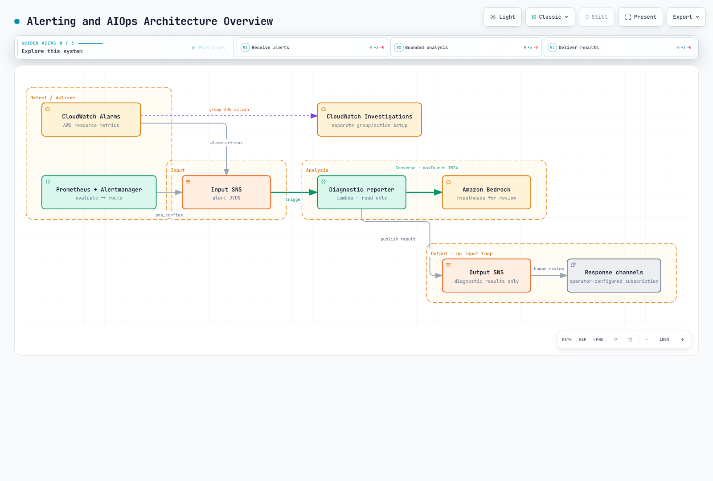
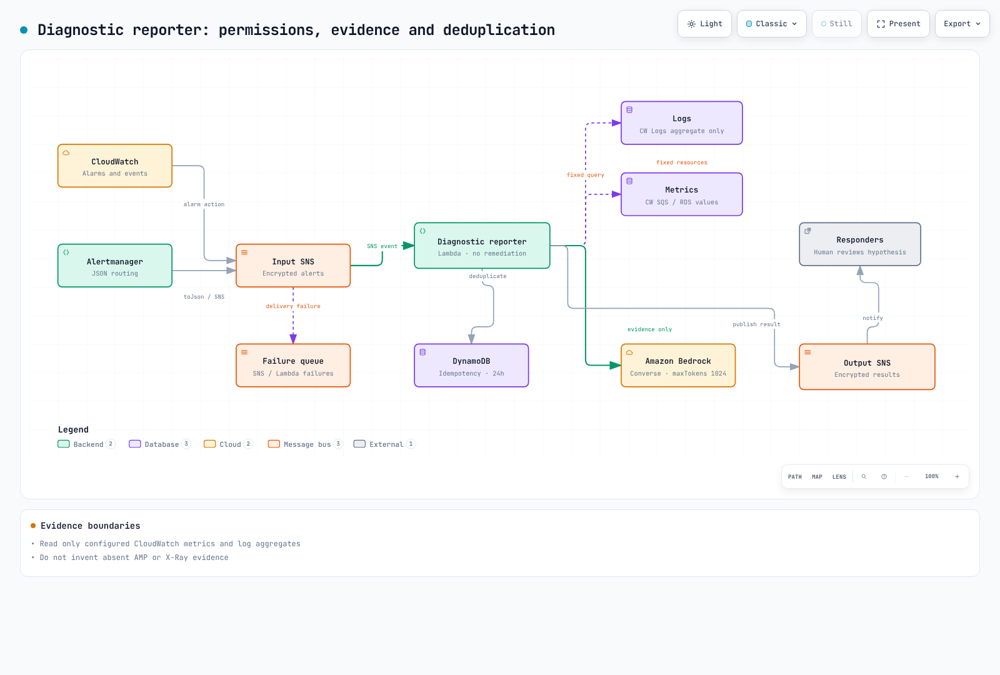

# 第 5 部分：告警与 AIOps

<span id="architecture-overview"></span>
<span id="cleanup"></span>
<span id="exercise-1-alertmanager-prometheusrules"></span>
<span id="exercise-2-cloudwatch-alarms"></span>
<span id="exercise-3-grafana-oncall-setup"></span>
<span id="exercise-4-sns-topic-and-email-subscription"></span>
<span id="exercise-5-cloudwatch-investigations"></span>
<span id="exercise-6-aiops-agent-with-lambda-and-bedrock"></span>
<span id="exercise-7-load-and-fault-injection"></span>
<span id="exercise-8-verify-aiops-pipeline"></span>
<span id="exercise-9-advanced-a2a-multi-agent-pattern"></span>
<span id="learning-objectives"></span>
<span id="next-steps"></span>
<span id="prerequisites"></span>
<span id="references"></span>
<span id="steps"></span>
<span id="steps-1"></span>
<span id="steps-2"></span>
<span id="steps-3"></span>
<span id="steps-4"></span>
<span id="steps-5"></span>
<span id="steps-6"></span>
<span id="steps-7"></span>
<span id="steps-8"></span>
<span id="summary"></span>
<span id="troubleshooting"></span>
<span id="verification-1"></span>
<span id="verification-checklist"></span>

> **难度**：高级 · **预计时间**：60 分钟
> **最后更新**：September 13, 2026

接收告警，检查实际指标和聚合日志，然后生成供人工审阅的诊断假设。[可运行示例](https://github.com/Atom-oh/kubernetes-docs/tree/main/examples/labs/observability/aiops)是一个 Lambda 报告程序，具有独立的输入/输出 SNS topic。它不包含自动修复或匿名 HTTP webhook。

前提条件包括 [第 2 部分](./02-observability-stack-lab.md)的数据摄取、[第 3 部分](./03-msa-deployment-lab.md)的服务，以及已成功完成的[第 4 部分](./04-load-testing-scaling-lab.md)冒烟测试。本次审计在本地检查了代码和模板；未执行 AWS 部署、模型调用或通知。



[🔍 查看交互式图表](https://www.atomai.click/kubernetes-docs/archmaps/en-labs-observability-05-alerting-aiops-lab-0.html)

## 1. 将评估与路由分离 {#rules-and-routing}

**Prometheus 评估告警规则**；**Alertmanager 负责分组、去重、路由、抑制和通知**。`PrometheusRule` 是 Prometheus Operator CRD，而不是由 Alertmanager 自身评估的资源。

| 设置 | 验证内容 |
|---|---|
| Prometheus `for` | 当条件在多次评估中持续满足时处于 Pending，随后变为 firing |
| 规则选择器 | Prometheus CR 中实际的 namespace/label 选择器会选择该规则 |
| Alertmanager 路由 | `matchers`、路由顺序、子项、`continue` 和 receiver 是否匹配 |
| 指标 | 实际 SDK 名称、单位和 label；缺失的序列、无流量以及 counter 重置 |
| Service label | 仅允许报告程序目录中的服务 |

`up == 0` 检测的是已知 scrape target 的故障，而不是所有未发现的 target。重启次数增长不同于 CrashLoopBackOff；旧的 OOMKilled 状态不同于新的 OOM 事件。没有 exporter 的 PromQL SQS 指标名称无法创建数据。

```bash
kubectl --context managed -n monitoring get prometheus,alertmanager,prometheusrule
kubectl --context managed -n monitoring get services
# Use the actual Prometheus Service name in the next command.
kubectl --context managed -n monitoring port-forward svc/REPLACE_WITH_PROMETHEUS_SERVICE 9090:9090
```

```bash
curl --fail --silent http://127.0.0.1:9090/api/v1/rules
curl --fail --silent http://127.0.0.1:9090/api/v1/alerts
```

请替换为已安装 chart release 中的名称。不要假定其他 release 名称，也不要搜索不存在的 ConfigMap。资源存在与 Prometheus 实际加载/评估是独立的检查。

## 2. CloudWatch alarm 语义 {#cloudwatch-alarms}

模板的 backlog alarm 使用 `AWS/SQS`、`ApproximateNumberOfMessagesVisible`、精确的 `QueueName`、`Maximum`、`Period=60`、`EvaluationPeriods=3` 和 `DatapointsToAlarm=2`。这表示评估的三个 datapoint 中有**两个**超出阈值；超限不必连续。`Period` 是聚合粒度，而不是 evaluation frequency 的同义词。

本实验将缺失数据保留为 `missing`。不要根据不活跃的 queue 或损坏的摄取推断健康的零值。添加 RDS CPU 时，请使用实际 instance metric dimension `DBInstanceIdentifier`；在使用 cluster aggregate 或其他 statistic 前先验证支持的 dimension。

Alertmanager 重发、CloudWatch state transition、SNS 传送和 Lambda 异步重试是独立层级。某一层的去重无法保证端到端的恰好一次传送。

## 3. 选择受支持的值班路径 {#oncall}

Grafana OnCall OSS 已于 **2026 年 3 月 24 日归档**；基于 Cloud Connection 的 SMS、电话和 push 支持也已结束。不要复用旧的新安装路径或虚构的 escalation YAML。请按照[官方维护公告](https://grafana.com/docs/oncall/latest/set-up/open-source/)选择当前受支持的路径，例如您现有的 incident/notification system 或 Grafana Cloud IRM。

此示例提供一个输出 SNS topic。请在所选系统中配置 responder、escalation、acknowledgement 和 resolution，并验证实际传送。模板不会自动创建 email、Slack 或 PagerDuty subscription。

## 4. 准备诊断报告程序 {#reporter}




[🔍 查看交互式图表](https://www.atomai.click/kubernetes-docs/archmaps/en-labs-observability-05-alerting-aiops-lab-10.html)
| 文件 | 职责 |
|---|---|
| `alerts.py` | SNS topic/format/allowlist 以及 CloudWatch/Alertmanager 规范化 |
| `evidence.py` | 已配置的 CloudWatch metrics 和聚合日志读取 |
| `analysis.py` | 仅使用可用 evidence 进行 Converse，1024 个 output token，完成检查 |
| `handler.py` | 双 worker 收集、Powertools 幂等性、输出 topic 发布 |
| `template.yaml` | 十五个 SAM/CloudFormation 资源及限定范围的 IAM |
| `tests/` | 成功、失败、重复、超时和缺失数据 |

```bash
cd examples/labs/observability/aiops
python3.12 -m venv .venv
.venv/bin/python -m pip install -r requirements.txt
.venv/bin/python -m unittest discover -s tests -v
```

代码已使用 boto3 **1.43.93**、Powertools **3.34.0** 和 Python **3.12** 检查。对于实际部署，请提供现有 SQS queue/log group、已批准的 service name、当前可用的 Converse model/inference-profile ID 及其**精确的 model/profile ARN**。不要硬编码已退役的 Claude model。跨 Region profile 可能还需要目标 model ARN 权限。

日志必须包含结构化的 `service` 和 `level` 字段。报告程序查询的是聚合 error count，而非原始 message，并且绝不执行模型生成的 resource ID 或 query。缺失/失败的来源会保持为 no_data/error，并可能导致跳过 analysis。它不会声称收集从未配置的 AMP 值或 X-Ray trace。

## 5. 部署并连接 Alertmanager {#deploy}

```bash
sam build --template-file template.yaml
sam deploy --guided --capabilities CAPABILITY_IAM
```

操作员会在审阅 change set 后于获批准的实验 account 中运行这些命令。模板会创建加密的输入/输出 SNS topic、Lambda、幂等性 table、failure queue 和 queue alarm。它不会覆盖诸如 `AWS_REGION` 的保留 Lambda environment variable。

请在下方替换已部署的 InputTopicArn 和实际 Region。`toJson` 序列化已通过 Alertmanager **0.34.0** native template 验证。请将 receiver/route 合并到您的安装实际加载的配置中，而不是整体覆盖。

```yaml
receivers:
- name: lab-diagnostics
  sns_configs:
  - topic_arn: REPLACE_WITH_INPUT_TOPIC_ARN
    sigv4:
      region: REPLACE_WITH_REGION
    message: '{{ . | toJson }}'
    send_resolved: true
```

`toJson` 遵循 JSON tag，生成 `alerts`、`labels`、`status` 以及诸如 `startsAt` 的 camelCase key。首字母大写的 Go template 访问方式（`.Alerts`）不同于序列化后的 JSON key。parser 仅为兼容性保留对大写的支持。默认的人类可读 SNS message 不采用此 JSON 格式。

仅将模板的 AlertmanagerPublishPolicyArn 附加到现有的**Alertmanager workload role**。验证 Pod credential path 以及 KMS/SNS 权限；不要扩大共享 node role。将 `service` label 和允许的 alert name 与 catalog/rule 匹配。绝不要让报告程序订阅 OutputTopicArn。

## 6. 重试、evidence 与完成状态 {#execution}


[🔍 查看交互式图表](https://www.atomai.click/kubernetes-docs/archmaps/en-labs-observability-05-alerting-aiops-lab-2.html)
成功的 SNS message ID 会在 DynamoDB 中去重 **24 小时**。同一 ID 下变更的 payload 会被拒绝。SNS 传送至少一次；在发布与幂等性提交之间发生故障可能导致重复通知。这不是恰好一次传送。

Lambda reserved concurrency 为两个，async retry 为两次，maximum event age 是 Lambda 接受 event 后一小时。SNS delivery retry 是独立的。请检查结果、failure queue 和 replay procedure。不要打印原始 event 或 credential。

读取相对于当前时间最多使用 15 分钟，并报告实际 start/end。它们不会重建原始 alarm 的精确 period。Logs Insights 会在限定范围内轮询并取消未完成的 query。被截断（`max_tokens`）、被阻止或为空的 model output 不会作为已完成 diagnosis 发布。

## 7. 单独配置 CloudWatch Investigations {#investigations}


[🔍 查看交互式图表](https://www.atomai.click/kubernetes-docs/archmaps/en-labs-observability-05-alerting-aiops-lab-1.html)
首先为 account 准备 investigation group、权限、retention 和 encryption。然后将 group ARN 添加为 alarm 的 **Investigation action**。metric 或 composite alarm 可以发起 investigation。ARN 形式为：

```text
arn:aws:aiops:REGION:ACCOUNT_ID:investigation-group/GROUP_ID
```

请遵循[官方流程](https://docs.aws.amazon.com/AmazonCloudWatch/latest/monitoring/Investigations-configure-alarm-procedures.html)，在添加 action 时保留现有 alarm setting。`put-anomaly-detector`、`put-insight-rule` 和 `list-dashboards` 不是 investigation-group 创建/list-investigation API。仅启用 Application Signals discovery 并不能完成此设置。示例 SAM stack 不会创建 investigation group。

## 8. 故障注入与运行验证 {#verification}

先记录健康的 smoke baseline 和 notification path。仅在具有时间限制、目标和恢复计划的专用 canary 上，使用应用程序实际实现的 fault control。不要调用不存在的 `/admin/chaos` endpoint 或未使用的 environment flag。删除一个 Pod 并不能保证出现 CrashLoopBackOff。

请通过 Git/受支持的 Rollouts flow 变更和恢复由 GitOps 管理的 workload。不要将 Deployment 与 Rollout 混淆，也不要使用负 JSON Patch index 删除 environment variable。

1. 确认 Prometheus 加载规则并经历 pending/firing 转换。
2. 检查选定的 Alertmanager receiver 和输入 SNS message。
3. 检查 Lambda completion/failure、DLQ 和 idempotency 结果。
4. 验证输出 topic 不同，且无法重新进入报告程序。
5. 将报告的 time bound、observation 和 unknown 与实际 responder delivery 进行比较。
6. 恢复注入的变更，并确认 retry/load test 已停止。

## 9. 可选扩展与清理 {#extensions}


[🔍 查看交互式图表](https://www.atomai.click/kubernetes-docs/archmaps/en-labs-observability-05-alerting-aiops-lab-3.html)
调用多个 analysis module 并不等于实现 A2A protocol。agent discovery、authentication、message/task contract、timeout 和 permission 需要单独设计。此报告程序是单一诊断函数。

清理前请保留 evidence，并停止输入 alarm action/subscription。根据 ownership record 核对 SAM stack、外部 workload-role policy attachment 和额外 subscription。不要删除现有 application queue/log group。请遵循[第 6 部分](./06-distributed-tracing-lab.md#cleanup)中的依赖顺序和成本检查。

## 验证范围

检查涵盖 24 个本地 test、带内存 store 的实际 Powertools、六个 botocore Stubber case、Alertmanager 0.34.0 native JSON template、CloudFormation lint 以及十五个 policy statement。它们不构成对在线 AWS IAM/KMS 授权、SNS 传送、DynamoDB 持久化、CloudWatch query 执行、Bedrock response quality 或 cluster deployment 的测试。
