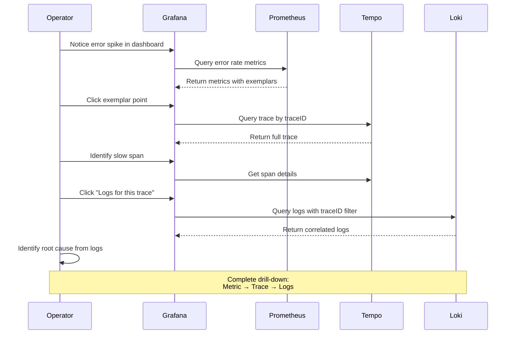
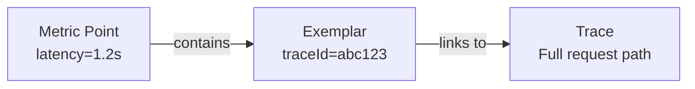

# 第 6 部分：分布式追踪分析

> **难度**：高级
> **预计时间**：45 分钟
> **最后更新**：February 22, 2026

## 学习目标

- 使用 Tempo 和 Grafana 执行端到端追踪分析
- 识别服务瓶颈和性能问题
- 配置 Loki-Tempo 关联以实现日志-追踪链接
- 使用 Exemplars 从指标深入分析到追踪
- 构建全面的可观测性仪表板

## 前置条件

- [ ] 已完成 [第 5 部分：告警和 AIOps](./05-alerting-aiops-lab.md)
- [ ] 已运行使用 OTel instrumentation 的 MSA 服务
- [ ] Tempo 正在接收追踪数据
- [ ] Loki 正在接收包含 traceId 的日志

---

## 深入分析工作流



---

## 练习 1：TraceQL 追踪搜索

### 步骤

**步骤 1.1：通过 Tempo 访问 Grafana Explore**

```bash
GRAFANA_URL=$(kubectl -n monitoring get svc grafana \
  -o jsonpath='{.status.loadBalancer.ingress[0].hostname}')

echo "Open: http://$GRAFANA_URL/explore"
echo "Select data source: Tempo"
```

**步骤 1.2：搜索服务器错误（5xx）**

```traceql
{ status = error } | select(span.http.status_code, resource.service.name, duration)
```

**步骤 1.3：查找缓慢请求（> 1 秒）**

```traceql
{ duration > 1s && span.http.method = "POST" } | select(resource.service.name, name, duration)
```

**步骤 1.4：搜索数据库慢查询**

```traceql
{ span.db.system = "postgresql" && duration > 100ms }
```

**步骤 1.5：查找 SQS 发布延迟**

```traceql
{ span.messaging.system = "sqs" && span.messaging.operation = "publish" && duration > 500ms }
```

**步骤 1.6：复杂查询 - 包含特定服务的错误追踪**

```traceql
{ resource.service.name = "order-service" && status = error }
| select(span.http.status_code, span.http.route, duration, span.error.message)
| order by duration desc
| limit 20
```

### TraceQL 查询参考

| 使用场景 | TraceQL 查询 |
|----------|---------------|
| 所有错误 | `{ status = error }` |
| 缓慢追踪 | `{ duration > 1s }` |
| 特定服务 | `{ resource.service.name = "order-service" }` |
| HTTP 500 错误 | `{ span.http.status_code >= 500 }` |
| 数据库查询 | `{ span.db.statement =~ "SELECT.*" }` |
| 跨服务 | `{ resource.service.name = "api-gateway" } >> { resource.service.name = "order-service" }` |

---

## 练习 2：服务图可视化

### 步骤

**步骤 2.1：在 Grafana 中启用 Service Graph**

```bash
# Service Graph is auto-generated from trace data
# Access: Grafana > Explore > Tempo > Service Graph tab
```

**步骤 2.2：分析服务依赖关系**

Service Graph 显示：
- 服务节点（圆形）
- 请求流（箭头）
- 请求速率（箭头粗细）
- 错误率（红色强度）
- 延迟（悬停时显示）

**步骤 2.3：识别瓶颈服务**

请查找：
1. 延迟高的服务（响应缓慢）
2. 错误率高的服务（红色节点）
3. 入站连接多的服务（潜在热点）
4. 具有扇出模式的服务（多个下游调用）

---

## 练习 3：延迟识别工作流

### 步骤

**步骤 3.1：延迟分析工作流表**

| 步骤 | 操作 | 工具 | 要查找的内容 |
|------|--------|------|------------------|
| 1 | 检查 P99 延迟趋势 | Prometheus/Grafana | 突然峰值或逐渐增加 |
| 2 | 识别受影响的服务 | Service Graph | 红色/缓慢节点 |
| 3 | 查找缓慢追踪 | TraceQL | `{ duration > p99 }` |
| 4 | 分析追踪瀑布图 | Tempo | 耗时长的 span、span 之间的间隙 |
| 5 | 检查 span 详情 | Tempo | db.statement、http.url、错误消息 |
| 6 | 与日志关联 | Loki | 相同时间戳附近的错误 |
| 7 | 检查资源指标 | Prometheus | CPU、内存、连接池 |

**步骤 3.2：实际延迟分析**

```bash
# Step 1: Find P99 latency
# In Grafana Explore with Prometheus:
histogram_quantile(0.99, sum(rate(http_server_request_duration_seconds_bucket{service="order-service"}[5m])) by (le))

# Step 2: Find traces above P99
# In Grafana Explore with Tempo:
{ resource.service.name = "order-service" && duration > 800ms }

# Step 3: Analyze a specific trace
# Click on a trace to see the waterfall view

# Step 4: Identify the slowest span
# Look for spans with longest duration relative to parent
```

**步骤 3.3：常见延迟模式**

| 模式 | 症状 | 可能原因 |
|---------|---------|--------------|
| 单个缓慢 span | 一个 span 占用 90% 的追踪时间 | 数据库查询、外部 API |
| 串行 span | 多个 span 按顺序执行 | 缺少并行化 |
| span 之间的间隙 | 存在未被记录的时间 | GC 暂停、线程争用 |
| 扇出延迟 | 多个并行调用，其中一个缓慢 | 某个下游服务性能下降 |
| 持续高延迟 | 所有请求都很慢 | 资源耗尽 |

---

## 练习 4：Loki-Tempo 关联

### 步骤

**步骤 4.1：配置双向链接**

第 2 部分中配置的 Grafana 数据源已设置关联。请验证：

```bash
# Check Tempo datasource config
kubectl get configmap -n monitoring grafana -o yaml | grep -A20 "Tempo"
```

**步骤 4.2：追踪到日志（Tempo → Loki）**

1. 在 Grafana Explore（Tempo）中打开一个追踪
2. 单击一个 span
3. 单击“Logs for this span”按钮
4. Grafana 使用 traceId 查询 Loki

**步骤 4.3：日志到追踪（Loki → Tempo）**

1. 在 Grafana Explore 中选择 Loki
2. 运行日志查询：
   ```logql
   {namespace="msa"} | json | level="ERROR"
   ```
3. 查找包含 traceId 的日志行
4. 单击 traceId 链接以跳转到 Tempo

**步骤 4.4：验证关联是否正常工作**

```bash
# Generate a test request and find it in both systems
curl -X POST "http://$API_URL:8080/api/v1/orders" \
  -H "Content-Type: application/json" \
  -d '{"customer_id":"TEST-001","product_id":"PROD-001","quantity":1}'

# Note the response and search in Tempo:
# { resource.service.name = "api-gateway" && span.http.route = "/api/v1/orders" }

# Find the traceId and search in Loki:
# {namespace="msa"} |= "traceId" | json | traceId = "<your-trace-id>"
```

---

## 练习 5：Exemplar 使用

### 步骤

**步骤 5.1：理解 Exemplars**

Exemplars 将指标数据点链接到特定追踪，从而能够从异常指标深入分析到实际请求。



**步骤 5.2：在 Grafana 中查看 Exemplars**

1. 打开 Grafana > Explore > Prometheus
2. 在启用 Exemplars 的情况下查询：
   ```promql
   histogram_quantile(0.99, sum(rate(http_server_request_duration_seconds_bucket{service="order-service"}[5m])) by (le))
   ```
3. 在图表中查找菱形标记（exemplars）
4. 悬停在菱形标记上以查看 traceId
5. 单击以导航到 Tempo

**步骤 5.3：配置 Exemplar 显示**

```bash
# Ensure Prometheus is recording exemplars
kubectl get configmap -n monitoring kube-prometheus-stack-prometheus -o yaml | grep exemplar
```

**步骤 5.4：Grafana 中的 Exemplar 查询**

```promql
# Show request duration with exemplars
http_server_request_duration_seconds_bucket{service="order-service"}

# In Query Options, enable "Exemplars"
```

---

## 练习 6：全面仪表板设置

### 步骤

**步骤 6.1：RED 仪表板（速率、错误、持续时间）**

```bash
cat > /tmp/red-dashboard.json << 'EOF'
{
  "dashboard": {
    "title": "MSA RED Dashboard",
    "tags": ["obs-lab", "red", "sre"],
    "panels": [
      {
        "title": "Request Rate by Service",
        "type": "timeseries",
        "gridPos": {"h": 8, "w": 8, "x": 0, "y": 0},
        "targets": [{
          "expr": "sum(rate(http_server_request_count{namespace=\"msa\"}[5m])) by (service)",
          "legendFormat": "{{service}}"
        }]
      },
      {
        "title": "Error Rate by Service",
        "type": "timeseries",
        "gridPos": {"h": 8, "w": 8, "x": 8, "y": 0},
        "targets": [{
          "expr": "sum(rate(http_server_request_count{namespace=\"msa\",http_status_code=~\"5..\"}[5m])) by (service) / sum(rate(http_server_request_count{namespace=\"msa\"}[5m])) by (service)",
          "legendFormat": "{{service}}"
        }],
        "fieldConfig": {
          "defaults": {
            "unit": "percentunit",
            "thresholds": {
              "steps": [
                {"value": 0, "color": "green"},
                {"value": 0.01, "color": "yellow"},
                {"value": 0.05, "color": "red"}
              ]
            }
          }
        }
      },
      {
        "title": "P99 Latency by Service",
        "type": "timeseries",
        "gridPos": {"h": 8, "w": 8, "x": 16, "y": 0},
        "targets": [{
          "expr": "histogram_quantile(0.99, sum(rate(http_server_request_duration_seconds_bucket{namespace=\"msa\"}[5m])) by (le, service))",
          "legendFormat": "{{service}}"
        }],
        "fieldConfig": {
          "defaults": {
            "unit": "s"
          }
        }
      }
    ]
  }
}
EOF

curl -X POST -H "Content-Type: application/json" \
  -u admin:ObsLab2026! \
  -d @/tmp/red-dashboard.json \
  "http://$GRAFANA_URL/api/dashboards/db"
```

**步骤 6.2：SLI/SLO 仪表板**

| SLI | 目标（SLO） | 查询 |
|-----|--------------|-------|
| 可用性 | 99.9% | `1 - (sum(rate(http_server_request_count{status_code=~"5.."}[30d])) / sum(rate(http_server_request_count[30d])))` |
| P99 延迟 | < 500ms | `histogram_quantile(0.99, sum(rate(http_server_request_duration_seconds_bucket[5m])) by (le)) < 0.5` |
| 吞吐量 | > 100 RPS | `sum(rate(http_server_request_count[5m])) > 100` |

**步骤 6.3：基础设施仪表板**

| 面板 | 指标 | 用途 |
|-------|--------|---------|
| Node CPU | `node_cpu_seconds_total` | Node 资源使用情况 |
| Node Memory | `node_memory_MemAvailable_bytes` | 内存压力 |
| Pod CPU | `container_cpu_usage_seconds_total` | Pod 资源使用情况 |
| Pod Memory | `container_memory_working_set_bytes` | 容器内存 |
| PVC 使用量 | `kubelet_volume_stats_used_bytes` | 存储消耗 |

**步骤 6.4：追踪仪表板**

| 面板 | 数据源 | 用途 |
|-------|-------------|---------|
| 追踪计数 | Tempo metrics | 追踪量 |
| Span 持续时间热力图 | Tempo | 持续时间分布 |
| Service Graph | Tempo | 依赖关系可视化 |
| 错误追踪表 | Tempo | 最近的错误 |

---

## 清理

> **重要提示**：请完成此清理部分，以避免持续产生 AWS 费用。

### 清理步骤表

| 资源 | 命令 | 说明 |
|----------|---------|-------|
| MSA 应用程序 | `kubectl delete namespace msa` | 删除所有 MSA pods/services |
| 可观测性堆栈 | `helm uninstall kube-prometheus-stack -n monitoring` | Prometheus、Alertmanager |
| Loki | `helm uninstall loki -n logging` | 日志存储 |
| Tempo | `helm uninstall tempo -n tracing` | 追踪存储 |
| Grafana | `helm uninstall grafana -n monitoring` | 仪表板 |
| OTel Collector | `kubectl delete namespace opentelemetry` | 遥测管道 |
| ArgoCD | `helm uninstall argocd -n argocd` | GitOps |
| KEDA | `helm uninstall keda -n keda` | 自动扩缩容器 |
| Locust | `kubectl delete deployment locust-master locust-worker -n msa` | 负载测试 |

### 完整清理脚本

```bash
#!/bin/bash
set -e

echo "Starting cleanup..."

# 1. Delete MSA applications
echo "Deleting MSA namespace..."
kubectl delete namespace msa --ignore-not-found

# 2. Delete observability stack (Managed Cluster)
kubectl config use-context $(kubectl config get-contexts -o name | grep obs-managed)

echo "Uninstalling Helm releases..."
helm uninstall grafana -n monitoring --ignore-not-found || true
helm uninstall kube-prometheus-stack -n monitoring --ignore-not-found || true
helm uninstall victoria-metrics -n monitoring --ignore-not-found || true
helm uninstall mimir -n monitoring --ignore-not-found || true
helm uninstall loki -n logging --ignore-not-found || true
helm uninstall tempo -n tracing --ignore-not-found || true
helm uninstall fluent-bit -n logging --ignore-not-found || true
helm uninstall argocd -n argocd --ignore-not-found || true
helm uninstall grafana-oncall -n monitoring --ignore-not-found || true

# 3. Delete namespaces
echo "Deleting namespaces..."
kubectl delete namespace monitoring logging tracing opentelemetry argocd --ignore-not-found

# 4. Delete Service Cluster resources
kubectl config use-context $(kubectl config get-contexts -o name | grep obs-service)
helm uninstall keda -n keda --ignore-not-found || true
helm uninstall argo-rollouts -n argo-rollouts --ignore-not-found || true
kubectl delete namespace keda argo-rollouts msa opentelemetry --ignore-not-found

# 5. Delete EKS clusters
echo "Deleting EKS clusters (this takes 15-20 minutes)..."
eksctl delete cluster -f ~/obs-lab/managed-cluster.yaml --wait || true
eksctl delete cluster -f ~/obs-lab/service-cluster.yaml --wait || true

# 6. Delete AWS resources
echo "Deleting AWS resources..."

# Aurora
aws rds delete-db-instance --db-instance-identifier obs-lab-aurora-1 --skip-final-snapshot --region $AWS_REGION || true
sleep 60
aws rds delete-db-cluster --db-cluster-identifier obs-lab-aurora --skip-final-snapshot --region $AWS_REGION || true

# OpenSearch
aws opensearch delete-domain --domain-name obs-lab-logs --region $AWS_REGION || true

# AMP
AMP_WORKSPACE_ID=$(aws amp list-workspaces --alias obs-lab-prometheus --query "workspaces[0].workspaceId" --output text --region $AWS_REGION)
aws amp delete-workspace --workspace-id $AMP_WORKSPACE_ID --region $AWS_REGION || true

# SQS/SNS
SQS_QUEUE_URL=$(aws sqs get-queue-url --queue-name obs-lab-orders --query QueueUrl --output text --region $AWS_REGION 2>/dev/null)
aws sqs delete-queue --queue-url $SQS_QUEUE_URL --region $AWS_REGION || true

SNS_TOPIC_ARN=$(aws sns list-topics --query "Topics[?contains(TopicArn, 'obs-lab-alerts')].TopicArn" --output text --region $AWS_REGION)
aws sns delete-topic --topic-arn $SNS_TOPIC_ARN --region $AWS_REGION || true

# S3 buckets
aws s3 rb s3://obs-lab-loki-${ACCOUNT_ID} --force --region $AWS_REGION || true
aws s3 rb s3://obs-lab-tempo-${ACCOUNT_ID} --force --region $AWS_REGION || true
aws s3 rb s3://obs-lab-mimir-${ACCOUNT_ID} --force --region $AWS_REGION || true
aws s3 rb s3://obs-lab-mwaa-${ACCOUNT_ID}-${AWS_REGION} --force --region $AWS_REGION || true

# Lambda and API Gateway
aws lambda delete-function --function-name obs-lab-aiops-agent --region $AWS_REGION || true

# IAM policies
aws iam delete-policy --policy-arn arn:aws:iam::${ACCOUNT_ID}:policy/obs-lab-amp-access || true
aws iam delete-policy --policy-arn arn:aws:iam::${ACCOUNT_ID}:policy/obs-lab-logging-access || true

# CloudWatch Alarms
aws cloudwatch delete-alarms --alarm-names obs-lab-aurora-cpu-high obs-lab-sqs-message-age obs-lab-opensearch-health obs-lab-critical-composite --region $AWS_REGION || true

# 7. Cleanup local files
echo "Cleaning up local files..."
rm -rf ~/obs-lab

echo "Cleanup complete!"
echo "Note: Some resources may take additional time to fully delete."
echo "Verify in AWS Console that all resources are removed."
```

### 验证

```bash
# Verify EKS clusters deleted
eksctl get cluster --region $AWS_REGION

# Verify AWS resources deleted
aws rds describe-db-clusters --query "DBClusters[?DBClusterIdentifier=='obs-lab-aurora']" --region $AWS_REGION
aws opensearch describe-domain --domain-name obs-lab-logs --region $AWS_REGION 2>&1 | grep -q "ResourceNotFoundException" && echo "OpenSearch deleted"
aws amp list-workspaces --alias obs-lab-prometheus --region $AWS_REGION
```

---

## 总结

在本实验系列中，您已构建了一个完整的可观测性平台：

| 部分 | 涵盖的主题 | 关键技能 |
|------|---------------|------------|
| 1 | 基础设施 | EKS、AWS 服务、ArgoCD 多集群 |
| 2 | 可观测性堆栈 | OTel、Prometheus、Loki、Tempo、Grafana |
| 3 | MSA 部署 | ArgoCD、Argo Rollouts、OTel instrumentation |
| 4 | 负载测试 | k6、KEDA、Karpenter 自动扩缩容 |
| 5 | 告警和 AIOps | Alertmanager、OnCall、Bedrock Claude |
| 6 | 追踪分析 | TraceQL、关联、exemplars |

### 关键要点

1. **三大支柱集成**：指标、日志和追踪协同工作，实现完整的可观测性
2. **OTel 标准化**：OpenTelemetry 提供厂商中立的 instrumentation
3. **多后端策略**：扇出到多个后端，以获得冗余和灵活性
4. **可观测性驱动部署**：使用自动化分析的 Canary 发布
5. **AIOps 自动化**：AI 驱动的事件分析可降低 MTTR
6. **关联是关键**：TraceID 链接支持端到端调试

## 最终验证清单

- [ ] 完整的指标→exemplar→追踪→日志深入分析正常工作
- [ ] Service Graph 显示所有 MSA 依赖关系
- [ ] Canary rollout 使用可观测性指标进行决策
- [ ] 告警触发并到达通知渠道
- [ ] AIOps agent 提供有用的分析
- [ ] 已清理所有资源以避免费用

## 后续步骤

完成本实验系列后：

1. **生产部署**：将这些模式应用于生产工作负载
2. **自定义 instrumentation**：添加业务特定的指标和追踪
3. **SLO 实施**：使用错误预算定义和跟踪 SLO
4. **混沌工程**：引入可控故障以测试可观测性
5. **成本优化**：实施采样和保留策略

## 参考资料

- [Tempo 文档](../../observability/tracing/01-tempo.md)
- [OpenTelemetry 文档](../../observability/tracing/03-opentelemetry.md)
- [Loki 文档](../../observability/logging/01-loki.md)
- [Prometheus 文档](../../observability/metrics/01-prometheus.md)
- [Grafana 文档](../../observability/grafana/README.md)
- [TraceQL 文档](https://grafana.com/docs/tempo/latest/traceql/)
