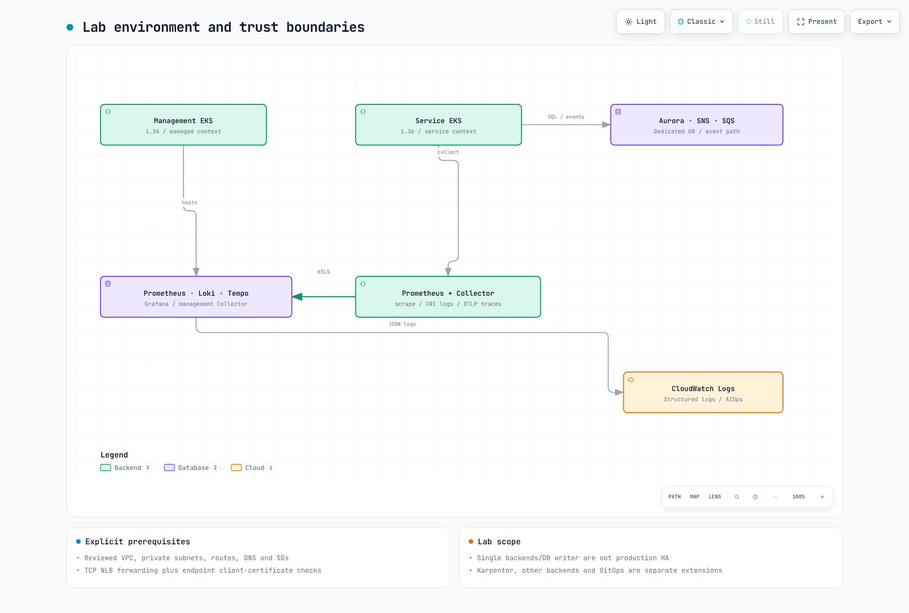
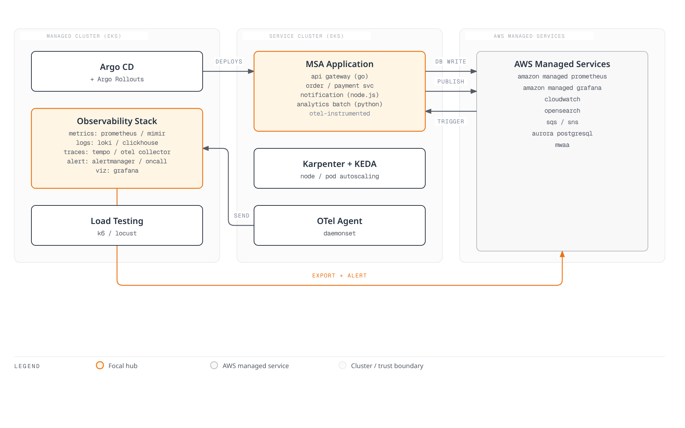
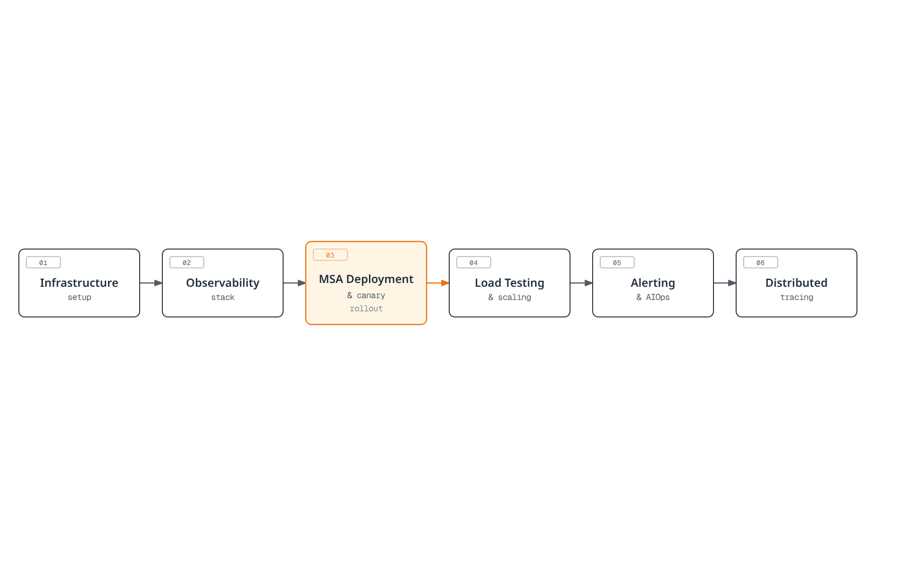
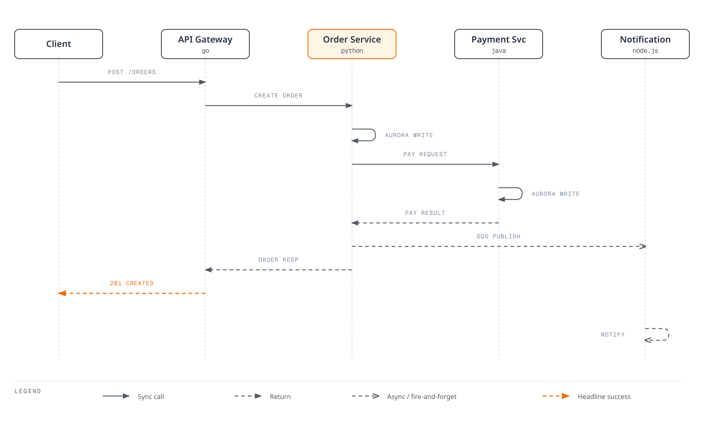

# 实验系列简介

> **难度**：高级 **最后更新**：February 23, 2026

## 概述

本实验系列将带您全面动手构建面向基于 Kubernetes 的微服务的全栈可观测性平台。您将在两个 EKS 集群中部署并集成多种可观测性工具，使用真实场景模式实现可观测性的三大支柱（Metrics、Logs、Traces）。

该架构模拟生产级环境：**Managed Cluster** 承载可观测性栈，**Service Cluster** 运行采用 OTel instrumentation 的 MSA 应用程序。

[🔍 查看交互式图表](https://www.atomai.click/kubernetes-docs/archmaps/en-labs-observability-overview-0.html)

## 架构图

## 前提条件

在开始本实验系列之前，请确保您具备以下条件：

| 要求 | 版本  | 验证命令          |
| ----------- | -------- | ----------------------------- |
| AWS 账户 | -        | `aws sts get-caller-identity` |
| AWS CLI     | >= 2.15  | `aws --version`               |
| eksctl      | >= 0.175 | `eksctl version`              |
| kubectl     | >= 1.29  | `kubectl version --client`    |
| Helm        | >= 3.14  | `helm version`                |
| Terraform   | >= 1.7   | `terraform version`           |
| k6          | >= 0.49  | `k6 version`                  |
| Docker      | >= 24.0  | `docker --version`            |

### 所需 IAM 权限

您的 AWS user/role 需要以下权限：

* EKS 完全访问权限
* EC2 完全访问权限（用于 node group）
* VPC 完全访问权限
* IAM 有限访问权限（用于 IRSA）
* CloudFormation 完全访问权限
* SQS/SNS 完全访问权限
* RDS 完全访问权限（用于 Aurora）
* OpenSearch 完全访问权限
* Managed Prometheus/Grafana 完全访问权限
* MWAA 完全访问权限

## 成本估算

> **警告**：本实验系列会创建大量 AWS 资源。以下提供预估成本。

| 服务                   | 配置                     | 每小时成本 (USD) |
| ------------------------- | --------------------------------- | ----------------- |
| EKS Control Plane         | 2 个集群                        | $0.20             |
| EC2 (Managed Cluster)     | 3x m5.xlarge                      | $0.58             |
| EC2 (Service Cluster)     | 3x m5.large（+ Karpenter scaling） | $0.29+            |
| Aurora PostgreSQL         | db.r6g.large（multi-AZ）           | $0.52             |
| OpenSearch                | m6g.large.search（2 个节点）        | $0.25             |
| Amazon Managed Prometheus | 按摄取量计算                | \~$0.10           |
| Amazon Managed Grafana    | 1 个 workspace                       | $0.15             |
| MWAA                      | mw1.small                         | $0.31             |
| SQS/SNS                   | 按使用量计算                    | \~$0.01           |
| **总计估算**        |                                   | **\~$2.50/小时**  |

**提示**：请在单次会话中完成实验，并立即执行清理以尽量减少成本。

## 实验顺序

| 部分 | 标题                                                    | 时长 | 关键主题                                      |
| ---- | -------------------------------------------------------- | -------- | ----------------------------------------------- |
| 1    | [基础设施设置](01-infrastructure-setup-lab.md)   | 60 分钟   | EKS 集群、AWS 服务、ArgoCD              |
| 2    | [可观测性栈](02-observability-stack-lab.md)     | 90 分钟   | OTel、Prometheus、Loki、Tempo、Grafana          |
| 3    | [MSA 部署与 Canary](03-msa-deployment-lab.md)      | 60 分钟   | ArgoCD、Argo Rollouts、OTel instrumentation     |
| 4    | [负载测试与扩缩容](04-load-testing-scaling-lab.md) | 45 分钟   | k6、KEDA、Karpenter                             |
| 5    | [告警与 AIOps](05-alerting-aiops-lab.md)             | 60 分钟   | Alertmanager、OnCall、CloudWatch Investigations |
| 6    | [分布式追踪](06-distributed-tracing-lab.md)     | 45 分钟   | Tempo、TraceQL、Log-Trace correlation           |

## MSA 应用程序概述

本实验使用一个包含 5 个服务的示例电子商务 MSA 应用程序：

| 服务              | 语言           | 角色                            | 依赖项              |
| -------------------- | ------------------ | ------------------------------- | ------------------------- |
| API Gateway          | Go                 | 请求路由、身份验证 | Order、Payment            |
| Order Service        | Python (FastAPI)   | 订单管理、库存     | Aurora、SQS               |
| Payment Service      | Java (Spring Boot) | 支付处理              | Aurora                    |
| Notification Service | Node.js (Express)  | 电子邮件/SMS 通知         | SQS consumer              |
| Analytics Batch      | Python             | 每日分析聚合     | Aurora，由 MWAA 触发 |

### 服务调用流程

## 可观测性工具覆盖范围

本实验涵盖以下可观测性工具：

| 类别          | 涵盖工具                      | AWS 集成             |
| ----------------- | ---------------------------------- | --------------------------- |
| **Metrics**       | Prometheus、VictoriaMetrics、Mimir | AMP（remote write）          |
| **Logging**       | Loki、ClickHouse、Fluent Bit       | CloudWatch Logs、OpenSearch |
| **Tracing**       | Tempo、OTel Collector              | X-Ray（通过 OTel）            |
| **Visualization** | Grafana                            | AMG                         |
| **Alerting**      | Alertmanager、Grafana OnCall       | CloudWatch Alarms、SNS      |
| **AIOps**         | CloudWatch Investigations          | Bedrock Claude 集成  |

> **注意**：本实验重点使用开源工具和 AWS 原生工具。Datadog 和 Dynatrace 等商业解决方案在单独的文档中介绍，但不会在本实验中部署。

## 学习成果

完成本实验系列后，您将能够：

1. **设计** 面向 Kubernetes 的生产级可观测性架构
2. **部署** 集成 OTel 的完整 LGTM 栈（Loki、Grafana、Tempo、Mimir）
3. **配置** 使用 OTel Collector 的多后端 telemetry pipeline
4. **实现** 通过可观测性驱动分析的 Canary deployment
5. **构建** 使用 CloudWatch Investigations 和 Bedrock 的 AIOps workflow
6. **分析** 分布式 trace 以识别性能瓶颈
7. **关联** Metrics、Logs 和 Traces 以进行根本原因分析

## 参考资料

* [可观测性概述](../../observability/README.md)
* [Prometheus 文档](../../observability/metrics/01-prometheus.md)
* [Grafana Dashboard](../../observability/grafana/README.md)
* [Loki 文档](../../observability/logging/01-loki.md)
* [Tempo 文档](../../observability/tracing/01-tempo.md)
* [OpenTelemetry 文档](../../observability/tracing/03-opentelemetry.md)
* [ArgoCD 文档](../../gitops/argocd/README.md)
* [KEDA 文档](../../autoscaling/01-keda.md)
* [Karpenter 文档](../../autoscaling/02-karpenter.md)

***

**准备好开始了吗？** 请从[第 1 部分：基础设施设置](01-infrastructure-setup-lab.md)开始
