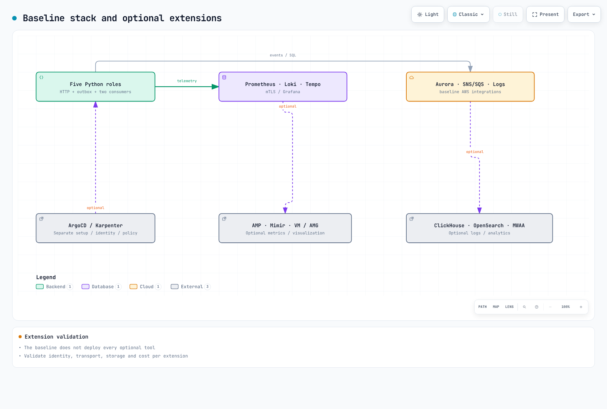

# 可观测性实验系列

> **难度**: 高级
> **最后更新**: September 13, 2026
连接一个可运行的合成订单应用程序及其指标/日志/追踪，覆盖两个 EKS 集群。基线采用 Prometheus、Loki、Tempo 和 Grafana，并使用 AWS SNS/SQS、Aurora 和 CloudWatch。实验配置不同于生产环境的 HA/容量验证。

[🔍 查看交互式图表](https://www.atomai.click/kubernetes-docs/archmaps/en-labs-observability-overview-0.html)

## 前置条件 {#prerequisites}

使用经批准的临时 AWS 角色、已审核的私有 VPC/子网/路由/DNS/SG、EBS CSI/gp3、支持 NetworkPolicy 的 CNI 以及 AWS Load Balancer Controller。无需授予一揽子服务 FullAccess 权限或使用长期访问密钥。请在每个阶段重新检查版本、权限和配额。

| 工具 | 已审核的基线 |
|---|---|
| EKS / kubectl | 1.36 / 1.36.2 |
| eksctl / Helm | 0.229.0 / 3.21.3 |
| Python / AWS CLI | 3.12 / v2 |
| k6 / Locust | 2.2.0 / 2.46.5 |
| 应用程序 / 控制器 | 示例中固定的要求、镜像摘要和 Chart 版本 |

## 可运行代码和顺序 {#sequence}

使用本仓库中的 [应用程序](https://github.com/Atom-oh/kubernetes-docs/tree/main/examples/labs/observability/application)、[堆栈](https://github.com/Atom-oh/kubernetes-docs/tree/main/examples/labs/observability/stack)、[负载测试](https://github.com/Atom-oh/kubernetes-docs/tree/main/examples/labs/observability/load-test) 和 [aiops](https://github.com/Atom-oh/kubernetes-docs/tree/main/examples/labs/observability/aiops) 示例。固定使用已审核的 commit/tag，并保留私有的 LAB_STATE；请勿克隆旧的、不存在的示例仓库。

[🔍 查看交互式图表](https://www.atomai.click/kubernetes-docs/archmaps/en-labs-observability-overview-2.html)

| 部分 | 阶段 | 结果 |
|---|---|---|
| 1 | [基础设施](01-infrastructure-setup-lab.md) | EKS、私有 DB、SNS 扇出、范围受限的角色 |
| 2 | [可观测性堆栈](02-observability-stack-lab.md) | mTLS 收集器/remote-write、Loki/Tempo/Grafana |
| 3 | [MSA/canary](03-msa-deployment-lab.md) | 五个可运行角色、outbox、仅限修订版本的分析 |
| 4 | [负载/扩缩容](04-load-testing-scaling-lab.md) | 已测量的请求以及消费者/节点观测 |
| 5 | [告警/AIOps](05-alerting-aiops-lab.md) | 独立主题的诊断报告器、人工审查 |
| 6 | [分布式追踪](06-distributed-tracing-lab.md) | 实际的指标/exemplar/追踪/日志关联、清理 |

## 应用程序和数据流 {#application}

一个 Python 镜像以独立的 api-gateway、order-service、payment-service、notification 和 analytics 角色运行。支付/通知均为合成操作，不会进行真实扣款/发送电子邮件/SMS。订单和 outbox 共享一个事务；独立队列和 event-ID 去重机制为 notification/analytics 提供服务。未实现或声称实现 Gateway 身份验证、通用速率限制和真实支付网关。

[🔍 查看交互式图表](https://www.atomai.click/kubernetes-docs/archmaps/en-labs-observability-overview-3.html)

## 基线与可选扩展 {#coverage}

[🔍 查看交互式图表](https://www.atomai.click/kubernetes-docs/archmaps/en-labs-observability-overview-1.html)

| 基线 | 可选的独立集成 |
|---|---|
| Prometheus / CloudWatch 指标 | VictoriaMetrics、Mimir、AMP |
| Loki / CloudWatch Logs | ClickHouse、OpenSearch |
| OTel / Tempo | X-Ray、Dynatrace |
| Grafana | Amazon Managed Grafana、商业工具 |
| Alertmanager / SNS / 诊断 Lambda | 现有值班平台、CloudWatch Investigations 组 |
| 合成事件消费者 | MWAA 调度/批量分析、生产事务系统 |

安装不同于已验证的数据摄取、查询、权限和成本。有关扩展，请参阅 [指标](../../observability/metrics/README.md)、[日志](../../observability/logging/README.md)、[追踪](../../observability/tracing/README.md) 和 [Grafana](../../observability/grafana/README.md) 指南。第 5 部分纳入了诸如 OnCall OSS 归档等变更。

## 成本、验证和清理 {#cost-and-cleanup}

根据实际使用量估算特定 Region 的节点、NAT、EBS、Aurora ACU/存储/I/O、日志摄取/保留、消息、KMS、LB、传输和模型调用。请勿将按用户按月收费与按小时计费的基础设施混合为一个固定总额。单写入器/backend 实验并非生产级 HA；副本限制并不是绝对的支出上限。

区分本地原生/SDK/schema/浏览器验证与实际 AWS 结果。清查资源、IAM 附加项、快照、DNS 和 LB/PVC；按照第 6 部分的依赖顺序进行清理。不要抑制所有失败，也不要在其托管依赖项之前删除集群。
