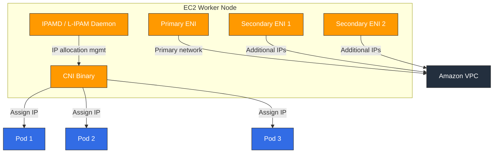

# Amazon VPC CNI

> **支持的版本**: VPC CNI v1.19+, EKS 1.25+
> **最后更新**: February 22, 2026

## 目录
- [VPC CNI 概览](#vpc-cni-overview)
- [网络模型](#networking-model)
- [安装与配置](#installation-and-configuration)
- [IP 地址管理](#ip-address-management)
- [Network Policy 支持](#network-policy-support)
- [高级功能](#advanced-features)
- [故障排除](#troubleshooting)
- [最佳实践](#best-practices)

## VPC CNI 概览

Amazon VPC CNI（Container Network Interface）是 Amazon EKS 的默认网络插件。它从 VPC 子网为每个 Pod 分配真实 IP 地址，使 Pod 能够在 VPC 网络内进行原生通信。

### 主要功能

1. **VPC 原生网络**：Pod 使用实际的 VPC IP，无需 Overlay 网络即可通信
2. **AWS Service 集成**：直接集成 Security Groups、VPC Flow Logs 和路由表等 AWS 网络功能
3. **高性能**：无需 Overlay 开销的原生网络性能
4. **IPv4/IPv6 双栈**：同时支持 IPv4 和 IPv6 网络

### 架构

VPC CNI 由两个主要组件构成：



1. **IPAMD（L-IPAM Daemon）**：运行在每个节点上的 Daemon，负责预分配和管理 ENI 及 IP 地址
2. **CNI Binary**：由 kubelet 调用的 CNI 插件，从 IPAMD 获取 IP 并配置 Pod 网络命名空间

### IP 分配模式

VPC CNI 支持两种 IP 分配模式：

| 功能 | Secondary IP 模式 | Prefix Delegation 模式 |
|---------|-------------------|----------------------|
| 分配单位 | 单个 IP 地址 | /28 IPv4 前缀（16 个 IP） |
| IP 效率 | 中等 | 高 |
| Pod 密度 | 受每个 ENI 的 IP 数量限制 | 更高的 Pod 密度 |
| 可用起始版本 | 初始版本 | v1.9+ |
| 推荐场景 | 小型集群 | 大型集群 |

## 网络模型

### ENI 架构

每个 EC2 实例可以有一个或多个 ENI（Elastic Network Interfaces），每个 ENI 可以分配多个私有 IP 地址。

```
┌─────────────────────────────────────────────────┐
│                 EC2 Instance                      │
│                                                   │
│  ┌─────────────┐  ┌─────────────┐  ┌──────────┐ │
│  │ Primary ENI  │  │Secondary ENI│  │Secondary │ │
│  │ (eth0)       │  │ (eth1)      │  │ENI (eth2)│ │
│  │              │  │             │  │          │ │
│  │ Primary IP   │  │ IP 1→Pod A  │  │IP 1→PodD│ │
│  │ IP 1 → Pod X │  │ IP 2→Pod B  │  │IP 2→PodE│ │
│  │ IP 2 → Pod Y │  │ IP 3→Pod C  │  │IP 3→PodF│ │
│  └─────────────┘  └─────────────┘  └──────────┘ │
└─────────────────────────────────────────────────┘
```

### 实例类型 ENI/IP 限制

| 实例类型 | 最大 ENI 数 | 每个 ENI 的 IPv4 数 | 最大 Pod 数 |
|--------------|----------|-------------|----------|
| t3.medium | 3 | 6 | 17 |
| t3.large | 3 | 12 | 35 |
| m5.large | 3 | 10 | 29 |
| m5.xlarge | 4 | 15 | 58 |
| m5.2xlarge | 4 | 15 | 58 |
| c5.4xlarge | 8 | 30 | 234 |
| m5.8xlarge | 8 | 30 | 234 |

> **注意**：最大 Pod 数 =（ENI 数量 × 每个 ENI 的 IP 数）- ENI 数量。主 IP 由节点使用。

### Prefix Delegation（IPv4/IPv6）

在 Prefix Delegation 模式下，向 ENI 分配的是 /28 IPv4 前缀（16 个 IP），而非单个 IP：

```bash
# Enable Prefix Delegation
kubectl set env daemonset aws-node -n kube-system ENABLE_PREFIX_DELEGATION=true

# Or via EKS add-on configuration
aws eks create-addon \
  --cluster-name my-cluster \
  --addon-name vpc-cni \
  --configuration-values '{"env":{"ENABLE_PREFIX_DELEGATION":"true"}}'
```

Prefix Delegation 的优势：
- **更高的 Pod 密度**：每个 /28 前缀提供 16 个 IP，可显著增加每个节点的 Pod 数量
- **更快的 IP 分配**：一次 API 调用即可获取 16 个 IP
- **Nitro 实例优化**：在基于 Nitro 的实例上获得最佳性能

## 安装与配置

### 作为 EKS add-on 安装

```bash
# Install VPC CNI add-on (latest version)
aws eks create-addon \
  --cluster-name my-cluster \
  --addon-name vpc-cni \
  --resolve-conflicts OVERWRITE

# Check add-on status
aws eks describe-addon \
  --cluster-name my-cluster \
  --addon-name vpc-cni

# Update add-on version
aws eks update-addon \
  --cluster-name my-cluster \
  --addon-name vpc-cni \
  --addon-version v1.19.0-eksbuild.1
```

### Helm Chart 安装

```bash
# Add Helm repository
helm repo add eks https://aws.github.io/eks-charts

# Install
helm install aws-vpc-cni eks/aws-vpc-cni \
  --namespace kube-system \
  --set init.image.tag=v1.19.0 \
  --set image.tag=v1.19.0
```

### 关键环境变量

| 变量 | 描述 | 默认值 |
|----------|------------|---------|
| `WARM_IP_TARGET` | 要预分配的备用 IP 数量 | 未设置 |
| `MINIMUM_IP_TARGET` | 节点上要维持的最小 IP 数量 | 未设置 |
| `WARM_ENI_TARGET` | 要预分配的备用 ENI 数量 | 1 |
| `WARM_PREFIX_TARGET` | 要预分配的备用前缀数量 | 未设置 |
| `ENABLE_PREFIX_DELEGATION` | 启用 Prefix Delegation | false |
| `AWS_VPC_K8S_CNI_CUSTOM_NETWORK_CFG` | 启用 Custom Networking | false |
| `ENI_CONFIG_LABEL_DEF` | 用于选择 ENIConfig 的标签 | 未设置 |
| `ENABLE_POD_ENI` | 启用每 Pod Security Groups | false |
| `POD_SECURITY_GROUP_ENFORCING_MODE` | Security Group 强制执行模式 | strict |

### Custom Networking（ENIConfig）

Custom Networking 允许从不同于节点的子网分配 IP：

```yaml
apiVersion: crd.k8s.amazonaws.com/v1alpha1
kind: ENIConfig
metadata:
  name: us-east-1a
spec:
  subnet: subnet-0123456789abcdef0
  securityGroups:
    - sg-0123456789abcdef0
---
apiVersion: crd.k8s.amazonaws.com/v1alpha1
kind: ENIConfig
metadata:
  name: us-east-1b
spec:
  subnet: subnet-0abcdef0123456789
  securityGroups:
    - sg-0123456789abcdef0
```

```bash
# Enable Custom Networking
kubectl set env daemonset aws-node -n kube-system AWS_VPC_K8S_CNI_CUSTOM_NETWORK_CFG=true
kubectl set env daemonset aws-node -n kube-system ENI_CONFIG_LABEL_DEF=topology.kubernetes.io/zone
```

## IP 地址管理

### WARM_IP_TARGET 调优

`WARM_IP_TARGET` 控制每个节点要预分配的备用 IP 数量：

```bash
# Small clusters: fewer spare IPs
kubectl set env daemonset aws-node -n kube-system WARM_IP_TARGET=2 MINIMUM_IP_TARGET=4

# Large clusters: more spare IPs for faster Pod startup
kubectl set env daemonset aws-node -n kube-system WARM_IP_TARGET=5 MINIMUM_IP_TARGET=10
```

### 添加 Secondary CIDR

当主 VPC CIDR 不足时，添加 Secondary CIDR：

```bash
# Add Secondary CIDR to VPC
aws ec2 associate-vpc-cidr-block \
  --vpc-id vpc-0123456789abcdef0 \
  --cidr-block 100.64.0.0/16

# Create subnets for Secondary CIDR
aws ec2 create-subnet \
  --vpc-id vpc-0123456789abcdef0 \
  --cidr-block 100.64.0.0/19 \
  --availability-zone us-east-1a
```

### IPv6 集群配置

```bash
# Create IPv6 EKS cluster
eksctl create cluster \
  --name ipv6-cluster \
  --version 1.28 \
  --ip-family ipv6
```

## Network Policy 支持

### VPC CNI 原生 Network Policy（v1.14+）

从 VPC CNI v1.14 开始，支持基于 eBPF 的原生 Network Policy：

```bash
# Enable Network Policy
aws eks create-addon \
  --cluster-name my-cluster \
  --addon-name vpc-cni \
  --configuration-values '{"enableNetworkPolicy":"true"}'
```

### Network Policy 示例

```yaml
apiVersion: networking.k8s.io/v1
kind: NetworkPolicy
metadata:
  name: allow-frontend-to-backend
  namespace: app
spec:
  podSelector:
    matchLabels:
      app: backend
  policyTypes:
    - Ingress
  ingress:
    - from:
        - podSelector:
            matchLabels:
              app: frontend
      ports:
        - protocol: TCP
          port: 8080
```

### 验证 Network Policy

```bash
# Check Network Policy controller logs
kubectl logs -n kube-system -l k8s-app=aws-node -c aws-network-policy-agent

# List Network Policies
kubectl get networkpolicy -A

# Check eBPF policy maps
kubectl exec -n kube-system ds/aws-node -c aws-node -- ebpf-sdk list-maps
```

## 高级功能

### 每 Pod Security Groups

直接向各个 Pod 分配 AWS Security Groups：

```yaml
apiVersion: vpcresources.k8s.aws/v1beta1
kind: SecurityGroupPolicy
metadata:
  name: my-security-group-policy
  namespace: app
spec:
  podSelector:
    matchLabels:
      app: database
  securityGroups:
    groupIds:
      - sg-0123456789abcdef0
      - sg-0abcdef0123456789
```

```bash
# Enable Pod Security Groups
kubectl set env daemonset aws-node -n kube-system ENABLE_POD_ENI=true
```

### Trunk ENI / Branch ENI

每 Pod Security Groups 使用 Trunk ENI 和 Branch ENI 架构：

- **Trunk ENI**：承载 Branch ENI 的节点主 ENI
- **Branch ENI**：分配给每个 Pod 的虚拟 ENI，并独立强制执行 Security Group

### Multus CNI 集成

将 VPC CNI 用作默认 CNI，同时通过 Multus 配置额外网络接口：

```yaml
apiVersion: k8s.cni.cncf.io/v1
kind: NetworkAttachmentDefinition
metadata:
  name: ipvlan-conf
spec:
  config: |
    {
      "cniVersion": "0.3.1",
      "type": "ipvlan",
      "master": "eth1",
      "mode": "l2",
      "ipam": {
        "type": "host-local",
        "subnet": "192.168.1.0/24"
      }
    }
```

### Windows 节点支持

VPC CNI 也适用于 Windows 节点：

```bash
# Create Windows node group
eksctl create nodegroup \
  --cluster my-cluster \
  --name windows-ng \
  --node-type m5.large \
  --nodes 2 \
  --node-ami-family WindowsServer2022FullContainer
```

## 故障排除

### IP 耗尽

**症状**：Pod 因 IP 分配失败而停留在 `Pending` 状态

```bash
# Check IPAMD logs
kubectl logs -n kube-system -l k8s-app=aws-node -c aws-node | grep -i "insufficient"

# Check per-node IP usage
kubectl get nodes -o json | jq '.items[] | {name: .metadata.name, allocatable_pods: .status.allocatable.pods}'

# Check available IPs in subnet
aws ec2 describe-subnets --subnet-ids subnet-xxx --query 'Subnets[].AvailableIpAddressCount'
```

**解决方案**：
1. 启用 Prefix Delegation 以提高 Pod 密度
2. 添加 Secondary CIDR 以扩展 IP 池
3. 使用包含专用 Pod 子网的 Custom Networking
4. 调优 `WARM_IP_TARGET` 以优化 IP 预分配

### ENI 超出限制

**症状**：出现 `ENI limit reached` 错误

```bash
# Check node's ENI count
aws ec2 describe-instances --instance-ids i-xxx \
  --query 'Reservations[].Instances[].NetworkInterfaces | length(@)'

# Check ENI limits for instance type
aws ec2 describe-instance-types --instance-types m5.large \
  --query 'InstanceTypes[].NetworkInfo.{MaxENI: MaximumNetworkInterfaces, IPv4PerENI: Ipv4AddressesPerInterface}'
```

### IPAMD 日志分析

```bash
# Watch IPAMD logs in real-time
kubectl logs -n kube-system -l k8s-app=aws-node -c aws-node -f

# Filter IP allocation events
kubectl logs -n kube-system -l k8s-app=aws-node -c aws-node | grep -E "(allocated|freed|assigned)"

# Check IPAMD metrics
kubectl exec -n kube-system ds/aws-node -c aws-node -- curl http://localhost:61678/v1/enis
```

### 常见错误和解决方案

| 错误 | 原因 | 解决方案 |
|-------|-------|----------|
| `InsufficientFreeAddressesInSubnet` | 子网 IP 耗尽 | 添加 Secondary CIDR 或启用 Prefix Delegation |
| `SecurityGroupLimitExceeded` | Security Groups 过多 | 清理未使用的 SG 或进行整合 |
| `ENI limit reached` | ENI 数量超限 | 使用更大型的实例类型 |
| `Failed to create ENI` | IAM 权限不足 | 向节点角色添加 ENI 创建权限 |
| `Timeout waiting for pod IP` | IPAMD 延迟 | 重启 IPAMD 并检查日志 |

## 最佳实践

### 子网 CIDR 规划

1. **确保足够的子网大小**：使用 /19 或更大的子网
2. **每个 AZ 使用独立子网**：为每个可用区分配专用 Pod 子网
3. **利用 100.64.0.0/10 范围**：为 Pod 使用 RFC 6598 地址空间

```
VPC CIDR: 10.0.0.0/16
├── 10.0.0.0/19   - Node subnet (AZ-a)
├── 10.0.32.0/19  - Node subnet (AZ-b)
├── 10.0.64.0/19  - Node subnet (AZ-c)
└── Secondary CIDR: 100.64.0.0/16
    ├── 100.64.0.0/19  - Pod subnet (AZ-a)
    ├── 100.64.32.0/19 - Pod subnet (AZ-b)
    └── 100.64.64.0/19 - Pod subnet (AZ-c)
```

### 推荐的 Prefix Delegation 设置

```bash
kubectl set env daemonset aws-node -n kube-system \
  ENABLE_PREFIX_DELEGATION=true \
  WARM_PREFIX_TARGET=1 \
  WARM_IP_TARGET=5 \
  MINIMUM_IP_TARGET=2
```

### 大型集群优化

1. **必须使用 Prefix Delegation**：在大规模场景下最大化 IP 效率
2. **使用 Custom Networking**：为节点和 Pod 使用独立子网
3. **调优 WARM_IP_TARGET**：最小化 Pod 调度延迟
4. **设置监控**：监控 IP 利用率并配置告警

```yaml
# IP utilization monitoring Prometheus rule
apiVersion: monitoring.coreos.com/v1
kind: PrometheusRule
metadata:
  name: vpc-cni-alerts
spec:
  groups:
    - name: vpc-cni
      rules:
        - alert: HighIPUtilization
          expr: awscni_assigned_ip_addresses / awscni_total_ip_addresses > 0.9
          for: 5m
          labels:
            severity: warning
          annotations:
            summary: "VPC CNI IP utilization is above 90%"
```

## 参考资料

- [AWS VPC CNI 官方文档](https://docs.aws.amazon.com/eks/latest/userguide/managing-vpc-cni.html)
- [VPC CNI GitHub Repository](https://github.com/aws/amazon-vpc-cni-k8s)
- [EKS 最佳实践 - 网络](https://aws.github.io/aws-eks-best-practices/networking/)
- [Prefix Delegation 指南](https://docs.aws.amazon.com/eks/latest/userguide/cni-increase-ip-addresses.html)
- [Pod 的 Security Groups](https://docs.aws.amazon.com/eks/latest/userguide/security-groups-for-pods.html)

## 测验

要测试您在本章中所学的内容，请尝试 [VPC CNI 测验](../quizzes/networking/01-vpc-cni-quiz.md)。
