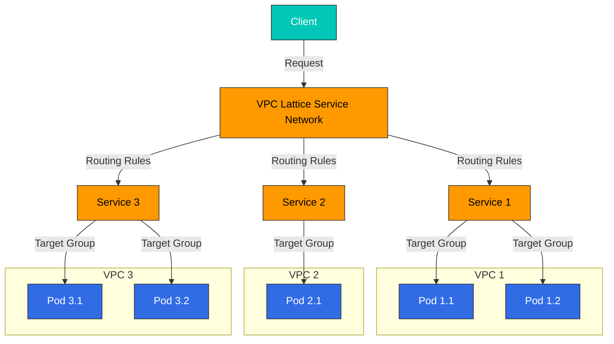
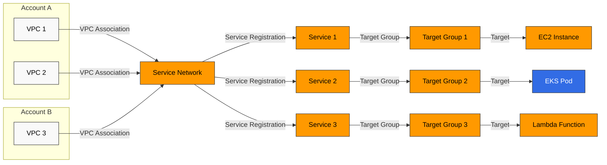
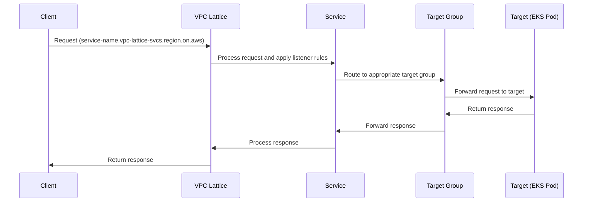
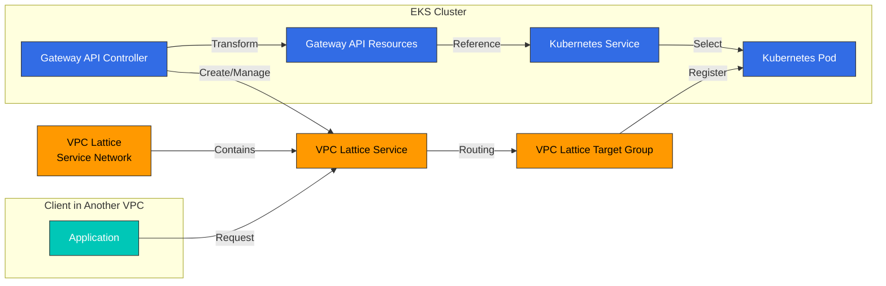

# VPC Lattice

Amazon VPC Lattice 是一项 AWS 应用程序网络服务，可让您在不同的 VPC 和账户之间安全地连接和管理服务。本文档介绍 VPC Lattice 的概念、架构、与 Amazon EKS 的集成方法以及最佳实践。

## 目录

1. [概述](#overview)
2. [架构](#architecture)
3. [EKS 与 VPC Lattice 集成](#eks-and-vpc-lattice-integration)
4. [安装与配置](#installation-and-configuration)
5. [服务管理](#service-management)
6. [路由与流量管理](#routing-and-traffic-management)
7. [安全与身份验证](#security-and-authentication)
8. [监控与日志记录](#monitoring-and-logging)
9. [最佳实践](#best-practices)
10. [故障排除](#troubleshooting)
11. [结论](#conclusion)

## 概述

### 什么是 VPC Lattice？

Amazon VPC Lattice 是一项完全托管的应用程序网络服务，用于实现服务到服务的连接、安全性和监控。主要功能包括：

- **Service Network**：连接多个 VPC 和账户中服务的逻辑边界
- **Service Discovery**：自动发现 Service Network 内的服务
- **Traffic Management**：支持路由规则、加权路由和基于路径的路由
- **Authentication and Authorization**：通过 AWS IAM 和资源策略进行访问控制
- **Observability**：集成的监控、日志记录和追踪功能

### 主要使用场景

1. **微服务架构**：简化并保护微服务之间的通信
2. **多账户环境**：多个 AWS 账户之间服务的安全通信
3. **混合工作负载**：容器化与非容器化工作负载之间的通信
4. **Service Mesh 替代方案**：提供轻量级 Service Mesh 功能以降低复杂性
5. **多集群连接**：简化多个 EKS 集群之间的服务通信

### VPC Lattice 与其他服务的比较

#### VPC Lattice 与 API Gateway

| 功能 | VPC Lattice | API Gateway |
|---------|------------|------------|
| 主要用途 | 内部服务到服务通信 | 外部 API 暴露 |
| 网络位置 | VPC 内部 | 连接互联网 |
| 协议 | HTTP/HTTPS、gRPC | HTTP/HTTPS、WebSocket、REST、GraphQL |
| 身份验证 | AWS IAM、资源策略 | IAM、Lambda authorizer、Cognito |
| 可扩展性 | 自动扩展 | 自动扩展 |
| 定价 | 按小时 + 数据吞吐量 | 请求数量 + 数据吞吐量 |

#### VPC Lattice 与 AWS App Mesh

| 功能 | VPC Lattice | AWS App Mesh |
|---------|------------|-------------|
| 架构 | 托管服务 | 基于 Sidecar proxy |
| 复杂性 | 低 | 中 |
| 协议 | HTTP/HTTPS、gRPC | HTTP/HTTPS、gRPC、TCP |
| Service Discovery | 内置 | AWS Cloud Map 集成 |
| 流量控制 | 基本路由规则 | 高级流量控制 |
| 可观测性 | CloudWatch 集成 | 通过 Envoy 提供详细指标 |

#### VPC Lattice 与 Transit Gateway

| 功能 | VPC Lattice | Transit Gateway |
|---------|------------|----------------|
| 主要用途 | 服务到服务通信 | VPC 到 VPC 的网络连接 |
| 抽象级别 | 服务级别 | 网络级别 |
| 协议 | 应用层 (L7) | 网络层 (L3) |
| 路由 | 基于服务名称 | 基于 IP |
| 安全性 | 服务级别策略 | 安全组、NACL |

## 架构

### VPC Lattice 组件

VPC Lattice 由以下主要组件构成：

1. **Service Network**：用于服务到服务通信的逻辑边界
2. **Service**：表示应用程序或微服务的端点
3. **Target Group**：将流量路由到 Service 的一组目标
4. **Listener**：处理到 Service 的连接请求的进程
5. **Rule**：定义 Listener 如何路由流量
6. **VPC Association**：将 VPC 连接到 Service Network



### Service Network 架构

Service Network 是 VPC Lattice 的核心组件，可连接多个 VPC 和账户中的服务。



### 流量流向

VPC Lattice 中的流量流向如下：

1. Client 向 VPC Lattice Service DNS 名称发送请求
2. VPC Lattice 接收请求，并根据 Listener 规则进行处理
3. Listener 规则将请求路由到适当的 Target Group
4. Target Group 将请求转发给已注册的目标（EC2、EKS Pod、Lambda 等）
5. 目标处理响应并将其返回给 Client



### Service Discovery

VPC Lattice 会在 Service Network 内自动提供 Service Discovery：

1. 每个 Service 都有唯一的 DNS 名称（`service-name.vpc-lattice-svcs.region.on.aws`）
2. Client 使用此 DNS 名称访问 Service
3. VPC Lattice 处理 DNS 解析和路由
4. 可从连接到 Service Network 的所有 VPC 访问 Service

### 安全模型

VPC Lattice 提供以下安全机制：

1. **网络隔离**：Service Network 提供逻辑隔离的环境
2. **身份验证和授权**：通过 AWS IAM 进行 Service 访问控制
3. **资源策略**：对 Service 和 Service Network 进行细粒度访问控制
4. **TLS 加密**：对服务到服务通信进行加密
5. **VPC Security Groups**：为目标提供额外的安全层

## EKS 与 VPC Lattice 集成

### 集成架构

Amazon EKS 与 VPC Lattice 的集成由以下组件构成：

1. **AWS Gateway API Controller**：将 Kubernetes Gateway API 转换为 VPC Lattice 资源
2. **Kubernetes Gateway API**：用于 Service 路由的标准 Kubernetes API
3. **VPC Lattice Service Network**：EKS 集群连接到的 Service Network
4. **VPC Lattice Service**：映射到 Kubernetes Service 的 VPC Lattice Service
5. **VPC Lattice Target Group**：映射到 Kubernetes Pod 的 Target Group



### 集成的优势

将 EKS 与 VPC Lattice 集成可提供以下优势：

1. **标准化 API**：通过 Kubernetes Gateway API 实现一致的 Service 管理
2. **跨集群通信**：多个 EKS 集群之间的无缝通信
3. **混合工作负载**：EKS Pod 与非容器化工作负载之间的通信
4. **集中管理**：从 AWS 控制台管理所有 Service Network
5. **统一可观测性**：通过 CloudWatch 和 CloudTrail 集成监控和日志记录
6. **简化的 Service Mesh**：无需 Sidecar 即可提供 Service Mesh 功能

### VPC Lattice 作为 Service Mesh 替代方案

VPC Lattice 可以作为传统 Service Mesh（Istio、Linkerd 等）的替代方案，原因如下：

1. **低复杂性**：无需 Sidecar proxy 即可提供 Service Mesh 功能
2. **降低管理开销**：由 AWS 提供的完全托管服务
3. **资源效率**：无需 Sidecar proxy，从而降低资源使用量
4. **AWS Service 集成**：与 AWS Service 生态系统无缝集成

| 功能 | VPC Lattice | 传统 Service Mesh |
|---------|------------|-----------------|
| Service Discovery | 内置 | 需要单独配置 |
| 流量路由 | 支持 | 支持 |
| 流量拆分 | 支持 | 支持 |
| 详细流量控制 | 有限 | 广泛 |
| Sidecar Proxy | 不需要 | 需要 |
| 管理复杂性 | 低 | 高 |
| 资源开销 | 低 | 高 |
| 可观测性 | CloudWatch 集成 | 支持各种工具 |
## 安装与配置

### 前提条件

将 VPC Lattice 与 EKS 集成的前提条件：

1. **Amazon EKS Cluster**：Kubernetes 版本 1.23 或更高版本
2. **IAM 权限**：创建和管理 VPC Lattice 资源的权限
3. **VPC 设置**：具有私有子网的 VPC
4. **AWS CLI**：最新版本的 AWS CLI
5. **kubectl**：最新版本的 kubectl
6. **Helm**：（可选）用于安装 AWS Gateway API Controller 的 Helm 3

### 安装 AWS Gateway API Controller

AWS Gateway API Controller 负责将 Kubernetes Gateway API 资源转换为 VPC Lattice 资源。

#### 使用 Helm 安装

```bash
# Add Helm repository
helm repo add eks https://aws.github.io/eks-charts
helm repo update

# Install AWS Gateway API Controller
helm install gateway-api-controller eks/aws-gateway-controller \
  --namespace aws-gateway-controller \
  --create-namespace \
  --set serviceAccount.create=true \
  --set serviceAccount.name=aws-gateway-controller \
  --set serviceAccount.annotations."eks\.amazonaws\.com/role-arn"=arn:aws:iam::<AWS_ACCOUNT_ID>:role/AmazonGatewayControllerRole
```

#### 使用 YAML Manifests 安装

1. Service account 和 RBAC 设置：

```yaml
apiVersion: v1
kind: ServiceAccount
metadata:
  name: aws-gateway-controller
  namespace: aws-gateway-controller
  annotations:
    eks.amazonaws.com/role-arn: arn:aws:iam::<AWS_ACCOUNT_ID>:role/AmazonGatewayControllerRole
---
apiVersion: rbac.authorization.k8s.io/v1
kind: ClusterRole
metadata:
  name: aws-gateway-controller
rules:
- apiGroups: ["gateway.networking.k8s.io"]
  resources: ["gatewayclasses", "gateways", "httproutes"]
  verbs: ["get", "list", "watch", "update", "patch"]
- apiGroups: [""]
  resources: ["services", "secrets", "namespaces"]
  verbs: ["get", "list", "watch"]
- apiGroups: [""]
  resources: ["events"]
  verbs: ["create", "patch"]
---
apiVersion: rbac.authorization.k8s.io/v1
kind: ClusterRoleBinding
metadata:
  name: aws-gateway-controller
roleRef:
  apiGroup: rbac.authorization.k8s.io
  kind: ClusterRole
  name: aws-gateway-controller
subjects:
- kind: ServiceAccount
  name: aws-gateway-controller
  namespace: aws-gateway-controller
```

2. Controller Deployment：

```yaml
apiVersion: apps/v1
kind: Deployment
metadata:
  name: aws-gateway-controller
  namespace: aws-gateway-controller
spec:
  replicas: 1
  selector:
    matchLabels:
      app: aws-gateway-controller
  template:
    metadata:
      labels:
        app: aws-gateway-controller
    spec:
      serviceAccountName: aws-gateway-controller
      containers:
      - name: controller
        image: public.ecr.aws/aws-application-networking-k8s/aws-gateway-controller:v1.0.0
        args:
        - --health-probe-bind-address=:8081
        - --metrics-bind-address=:8080
        - --leader-elect
        resources:
          limits:
            cpu: 500m
            memory: 128Mi
          requests:
            cpu: 10m
            memory: 64Mi
```

### IAM Role 设置

AWS Gateway API Controller 需要适当的 IAM 权限来管理 VPC Lattice 资源。

#### IRSA（Service Account 的 IAM Role）设置

```bash
# Create IAM policy
cat <<EOF > vpc-lattice-policy.json
{
  "Version": "2012-10-17",
  "Statement": [
    {
      "Effect": "Allow",
      "Action": [
        "vpc-lattice:*",
        "ec2:DescribeVpcs",
        "ec2:DescribeSubnets",
        "ec2:DescribeSecurityGroups",
        "elasticloadbalancing:DescribeTargetGroups",
        "elasticloadbalancing:DescribeTargetHealth",
        "elasticloadbalancing:RegisterTargets",
        "elasticloadbalancing:DeregisterTargets"
      ],
      "Resource": "*"
    }
  ]
}
EOF

aws iam create-policy \
  --policy-name AmazonGatewayControllerPolicy \
  --policy-document file://vpc-lattice-policy.json

# Create IAM role and associate with service account
eksctl create iamserviceaccount \
  --name aws-gateway-controller \
  --namespace aws-gateway-controller \
  --cluster <CLUSTER_NAME> \
  --attach-policy-arn arn:aws:iam::<AWS_ACCOUNT_ID>:policy/AmazonGatewayControllerPolicy \
  --approve \
  --override-existing-serviceaccounts
```

### 创建 VPC Lattice Service Network

可以通过 AWS Management Console、AWS CLI 或 AWS CloudFormation 创建 VPC Lattice Service Network。

#### 使用 AWS CLI 创建

```bash
# Create service network
aws vpc-lattice create-service-network \
  --name my-service-network \
  --auth-type AWS_IAM

# Store service network ID
SERVICE_NETWORK_ID=$(aws vpc-lattice list-service-networks \
  --query "items[?name=='my-service-network'].id" \
  --output text)

# Associate VPC with service network
aws vpc-lattice create-service-network-vpc-association \
  --service-network-identifier $SERVICE_NETWORK_ID \
  --vpc-identifier <VPC_ID> \
  --security-group-ids <SECURITY_GROUP_ID>
```

#### 使用 AWS CloudFormation 创建

```yaml
Resources:
  MyServiceNetwork:
    Type: AWS::VpcLattice::ServiceNetwork
    Properties:
      Name: my-service-network
      AuthType: AWS_IAM

  MyVpcAssociation:
    Type: AWS::VpcLattice::ServiceNetworkVpcAssociation
    Properties:
      ServiceNetworkIdentifier: !Ref MyServiceNetwork
      VpcIdentifier: !Ref MyVPC
      SecurityGroupIds:
        - !Ref MySecurityGroup
```

### 配置 Gateway API 资源

配置 Kubernetes Gateway API 资源以与 VPC Lattice 集成。

#### 1. 创建 GatewayClass

GatewayClass 定义 Gateway 资源的实现。

```yaml
apiVersion: gateway.networking.k8s.io/v1beta1
kind: GatewayClass
metadata:
  name: amazon-vpc-lattice
spec:
  controllerName: application-networking.k8s.aws/gateway-api-controller
```

#### 2. 创建 Gateway

Gateway 定义流量如何进入集群。

```yaml
apiVersion: gateway.networking.k8s.io/v1beta1
kind: Gateway
metadata:
  name: my-gateway
  namespace: default
  annotations:
    application-networking.k8s.aws/service-network-id: <SERVICE_NETWORK_ID>
spec:
  gatewayClassName: amazon-vpc-lattice
  listeners:
  - name: http
    port: 80
    protocol: HTTP
```

#### 3. 创建 HTTPRoute

HTTPRoute 定义 HTTP 流量如何路由到 Service。

```yaml
apiVersion: gateway.networking.k8s.io/v1beta1
kind: HTTPRoute
metadata:
  name: my-http-route
  namespace: default
spec:
  parentRefs:
  - name: my-gateway
    kind: Gateway
  rules:
  - matches:
    - path:
        type: PathPrefix
        value: /api
    backendRefs:
    - name: my-service
      port: 8080
```

### Service 和 Pod 配置

配置 Kubernetes Service 和 Pod 以与 VPC Lattice 集成。

#### 1. 创建 Service

```yaml
apiVersion: v1
kind: Service
metadata:
  name: my-service
  namespace: default
spec:
  selector:
    app: my-app
  ports:
  - port: 8080
    targetPort: 8080
  type: ClusterIP
```

#### 2. 创建 Deployment

```yaml
apiVersion: apps/v1
kind: Deployment
metadata:
  name: my-app
  namespace: default
spec:
  replicas: 3
  selector:
    matchLabels:
      app: my-app
  template:
    metadata:
      labels:
        app: my-app
    spec:
      containers:
      - name: my-container
        image: nginx:latest
        ports:
        - containerPort: 8080
        readinessProbe:
          httpGet:
            path: /health
            port: 8080
          initialDelaySeconds: 5
          periodSeconds: 10
```

## 服务管理

### 创建 VPC Lattice Service

VPC Lattice Service 可以直接通过 AWS Management Console、AWS CLI 或 AWS CloudFormation 创建，也可以通过 Kubernetes Gateway API 间接创建。

#### 使用 AWS CLI 直接创建

```bash
# Create target group
aws vpc-lattice create-target-group \
  --name my-target-group \
  --type INSTANCE \
  --config '{"port":80,"protocol":"HTTP","vpcIdentifier":"<VPC_ID>","healthCheck":{"enabled":true,"protocol":"HTTP","path":"/health","port":80,"healthCheckIntervalSeconds":30,"healthCheckTimeoutSeconds":5,"healthyThresholdCount":5,"unhealthyThresholdCount":2}}'

# Store target group ID
TARGET_GROUP_ID=$(aws vpc-lattice list-target-groups \
  --query "items[?name=='my-target-group'].id" \
  --output text)

# Create service
aws vpc-lattice create-service \
  --name my-service \
  --auth-type AWS_IAM

# Store service ID
SERVICE_ID=$(aws vpc-lattice list-services \
  --query "items[?name=='my-service'].id" \
  --output text)

# Create listener
aws vpc-lattice create-listener \
  --service-identifier $SERVICE_ID \
  --name my-listener \
  --protocol HTTP \
  --port 80 \
  --default-action '{"forward":{"targetGroups":[{"targetGroupIdentifier":"'$TARGET_GROUP_ID'"}]}}'

# Associate service with service network
aws vpc-lattice create-service-network-service-association \
  --service-network-identifier $SERVICE_NETWORK_ID \
  --service-identifier $SERVICE_ID
```

#### 使用 Kubernetes Gateway API 间接创建

创建 Gateway API 资源时，AWS Gateway API Controller 会自动创建 VPC Lattice 资源。

```yaml
apiVersion: gateway.networking.k8s.io/v1beta1
kind: Gateway
metadata:
  name: my-gateway
  namespace: default
  annotations:
    application-networking.k8s.aws/service-network-id: <SERVICE_NETWORK_ID>
spec:
  gatewayClassName: amazon-vpc-lattice
  listeners:
  - name: http
    port: 80
    protocol: HTTP
---
apiVersion: gateway.networking.k8s.io/v1beta1
kind: HTTPRoute
metadata:
  name: my-http-route
  namespace: default
spec:
  parentRefs:
  - name: my-gateway
    kind: Gateway
  rules:
  - matches:
    - path:
        type: PathPrefix
        value: /api
    backendRefs:
    - name: my-service
      port: 8080
```

### Service Discovery 和访问

VPC Lattice Service 会被自动分配 DNS 名称，并且可在 Service Network 内发现。

#### DNS 名称格式

```
<service-name>.<service-network-id>.vpc-lattice-svcs.<region>.on.aws
```

#### Service 访问示例

```bash
# Query service DNS name
SERVICE_DNS=$(aws vpc-lattice get-service \
  --service-identifier $SERVICE_ID \
  --query "dnsEntry.domainName" \
  --output text)

# Access service
curl -v http://$SERVICE_DNS/api
```

### 更新和删除 Service

#### 使用 AWS CLI 更新 Service

```bash
# Update service
aws vpc-lattice update-service \
  --service-identifier $SERVICE_ID \
  --auth-type NONE

# Update listener
aws vpc-lattice update-listener \
  --service-identifier $SERVICE_ID \
  --listener-identifier <LISTENER_ID> \
  --default-action '{"forward":{"targetGroups":[{"targetGroupIdentifier":"'$TARGET_GROUP_ID'","weight":100}]}}'
```

#### 使用 AWS CLI 删除 Service

```bash
# Dissociate from service network
aws vpc-lattice delete-service-network-service-association \
  --service-network-service-association-identifier <ASSOCIATION_ID>

# Delete listener
aws vpc-lattice delete-listener \
  --service-identifier $SERVICE_ID \
  --listener-identifier <LISTENER_ID>

# Delete service
aws vpc-lattice delete-service \
  --service-identifier $SERVICE_ID

# Delete target group
aws vpc-lattice delete-target-group \
  --target-group-identifier $TARGET_GROUP_ID
```

#### 使用 Kubernetes Gateway API 进行 Service 管理

更新或删除 Gateway API 资源时，AWS Gateway API Controller 会自动更新或删除 VPC Lattice 资源。

```bash
# Update HTTPRoute
kubectl apply -f updated-http-route.yaml

# Delete HTTPRoute
kubectl delete httproute my-http-route

# Delete Gateway
kubectl delete gateway my-gateway
```

## 路由与流量管理

### 基本路由

VPC Lattice 提供多种路由选项，包括基于路径的路由、基于 Header 的路由和加权路由。

#### 基于路径的路由

```yaml
apiVersion: gateway.networking.k8s.io/v1beta1
kind: HTTPRoute
metadata:
  name: path-based-route
  namespace: default
spec:
  parentRefs:
  - name: my-gateway
    kind: Gateway
  rules:
  - matches:
    - path:
        type: PathPrefix
        value: /api/v1
    backendRefs:
    - name: service-v1
      port: 8080
  - matches:
    - path:
        type: PathPrefix
        value: /api/v2
    backendRefs:
    - name: service-v2
      port: 8080
```

#### 基于 Header 的路由

```yaml
apiVersion: gateway.networking.k8s.io/v1beta1
kind: HTTPRoute
metadata:
  name: header-based-route
  namespace: default
spec:
  parentRefs:
  - name: my-gateway
    kind: Gateway
  rules:
  - matches:
    - headers:
      - name: "version"
        value: "v1"
    backendRefs:
    - name: service-v1
      port: 8080
  - matches:
    - headers:
      - name: "version"
        value: "v2"
    backendRefs:
    - name: service-v2
      port: 8080
```

### 流量拆分和 Canary Deployment

VPC Lattice 通过加权路由支持流量拆分和 Canary Deployment。

#### 使用 AWS CLI 进行加权路由

```bash
# Set up weighted routing
aws vpc-lattice update-listener \
  --service-identifier $SERVICE_ID \
  --listener-identifier <LISTENER_ID> \
  --default-action '{
    "forward": {
      "targetGroups": [
        {
          "targetGroupIdentifier": "'$TARGET_GROUP_ID_V1'",
          "weight": 80
        },
        {
          "targetGroupIdentifier": "'$TARGET_GROUP_ID_V2'",
          "weight": 20
        }
      ]
    }
  }'
```

#### 使用 Kubernetes Gateway API 进行加权路由

目前，Kubernetes Gateway API 不直接支持加权路由，但 AWS Gateway API Controller 通过 annotations 支持此功能。

```yaml
apiVersion: gateway.networking.k8s.io/v1beta1
kind: HTTPRoute
metadata:
  name: weighted-route
  namespace: default
  annotations:
    application-networking.k8s.aws/traffic-weights: |
      {
        "service-v1": 80,
        "service-v2": 20
      }
spec:
  parentRefs:
  - name: my-gateway
    kind: Gateway
  rules:
  - matches:
    - path:
        type: PathPrefix
        value: /api
    backendRefs:
    - name: service-v1
      port: 8080
    - name: service-v2
      port: 8080
```

### 健康检查配置

VPC Lattice 支持对 Target Group 进行健康检查。

#### 使用 AWS CLI 进行健康检查配置

```bash
# Update health check configuration
aws vpc-lattice update-target-group \
  --target-group-identifier $TARGET_GROUP_ID \
  --health-check '{
    "enabled": true,
    "protocol": "HTTP",
    "path": "/health",
    "port": 8080,
    "healthCheckIntervalSeconds": 30,
    "healthCheckTimeoutSeconds": 5,
    "healthyThresholdCount": 5,
    "unhealthyThresholdCount": 2,
    "matcher": {
      "httpCode": "200-299"
    }
  }'
```

#### 使用 Kubernetes Gateway API 进行健康检查配置

AWS Gateway API Controller 通过 annotations 支持健康检查配置。

```yaml
apiVersion: gateway.networking.k8s.io/v1beta1
kind: HTTPRoute
metadata:
  name: health-check-route
  namespace: default
  annotations:
    application-networking.k8s.aws/health-check: |
      {
        "enabled": true,
        "protocol": "HTTP",
        "path": "/health",
        "port": 8080,
        "intervalSeconds": 30,
        "timeoutSeconds": 5,
        "healthyThresholdCount": 5,
        "unhealthyThresholdCount": 2,
        "matcher": {
          "httpCode": "200-299"
        }
      }
spec:
  parentRefs:
  - name: my-gateway
    kind: Gateway
  rules:
  - matches:
    - path:
        type: PathPrefix
        value: /api
    backendRefs:
    - name: my-service
      port: 8080
```
## 安全与身份验证

### 身份验证方法

VPC Lattice 支持以下身份验证方法：

1. **AWS IAM**：使用 AWS Identity and Access Management 进行身份验证
2. **无身份验证**：允许所有请求，无需身份验证

#### 配置 AWS IAM 身份验证

```bash
# Create service with IAM authentication
aws vpc-lattice create-service \
  --name my-service \
  --auth-type AWS_IAM
```

#### 使用 Kubernetes Gateway API 配置 IAM 身份验证

```yaml
apiVersion: gateway.networking.k8s.io/v1beta1
kind: Gateway
metadata:
  name: my-gateway
  namespace: default
  annotations:
    application-networking.k8s.aws/service-network-id: <SERVICE_NETWORK_ID>
    application-networking.k8s.aws/auth-type: "AWS_IAM"
spec:
  gatewayClassName: amazon-vpc-lattice
  listeners:
  - name: http
    port: 80
    protocol: HTTP
```

### 资源策略

VPC Lattice 通过资源策略为 Service 和 Service Network 提供细粒度访问控制。

#### 设置 Service 资源策略

```bash
# Set service resource policy
aws vpc-lattice put-resource-policy \
  --resource-arn arn:aws:vpc-lattice:<REGION>:<ACCOUNT_ID>:service/<SERVICE_ID> \
  --policy '{
    "Version": "2012-10-17",
    "Statement": [
      {
        "Effect": "Allow",
        "Principal": {
          "AWS": "arn:aws:iam::<ACCOUNT_ID>:role/MyRole"
        },
        "Action": "vpc-lattice:Invoke",
        "Resource": "arn:aws:vpc-lattice:<REGION>:<ACCOUNT_ID>:service/<SERVICE_ID>"
      }
    ]
  }'
```

#### 设置 Service Network 资源策略

```bash
# Set service network resource policy
aws vpc-lattice put-resource-policy \
  --resource-arn arn:aws:vpc-lattice:<REGION>:<ACCOUNT_ID>:servicenetwork/<SERVICE_NETWORK_ID> \
  --policy '{
    "Version": "2012-10-17",
    "Statement": [
      {
        "Effect": "Allow",
        "Principal": {
          "AWS": "arn:aws:iam::<ACCOUNT_ID>:role/MyRole"
        },
        "Action": [
          "vpc-lattice:CreateServiceNetworkVpcAssociation",
          "vpc-lattice:CreateServiceNetworkServiceAssociation"
        ],
        "Resource": "arn:aws:vpc-lattice:<REGION>:<ACCOUNT_ID>:servicenetwork/<SERVICE_NETWORK_ID>"
      }
    ]
  }'
```

### 跨账户访问

VPC Lattice 通过 Service Network 支持多个 AWS 账户中 Service 之间的通信。

#### 跨账户共享 Service Network

1. 使用 AWS RAM (Resource Access Manager) 共享 Service Network：

```bash
# Share service network
aws ram create-resource-share \
  --name my-service-network-share \
  --resource-arns arn:aws:vpc-lattice:<REGION>:<ACCOUNT_ID>:servicenetwork/<SERVICE_NETWORK_ID> \
  --principals arn:aws:organizations::o-<ORGANIZATION_ID>:organization

# Or share with specific account
aws ram create-resource-share \
  --name my-service-network-share \
  --resource-arns arn:aws:vpc-lattice:<REGION>:<ACCOUNT_ID>:servicenetwork/<SERVICE_NETWORK_ID> \
  --principals <TARGET_ACCOUNT_ID>
```

2. 在目标账户中接受共享的 Service Network：

```bash
# Accept share invitation
aws ram accept-resource-share-invitation \
  --resource-share-invitation-arn arn:aws:ram:<REGION>:<ACCOUNT_ID>:resource-share-invitation/<INVITATION_ID>
```

3. 在目标账户中将 VPC 连接到共享的 Service Network：

```bash
# VPC association
aws vpc-lattice create-service-network-vpc-association \
  --service-network-identifier <SERVICE_NETWORK_ID> \
  --vpc-identifier <VPC_ID> \
  --security-group-ids <SECURITY_GROUP_ID>
```

### TLS 配置

VPC Lattice 支持对 Service 使用 TLS 加密。

#### 使用 AWS CLI 进行 TLS 配置

```bash
# Create or import ACM certificate
CERTIFICATE_ARN=$(aws acm request-certificate \
  --domain-name my-service.example.com \
  --validation-method DNS \
  --query CertificateArn \
  --output text)

# Create TLS listener
aws vpc-lattice create-listener \
  --service-identifier $SERVICE_ID \
  --name my-tls-listener \
  --protocol HTTPS \
  --port 443 \
  --tls '{
    "certificateArn": "'$CERTIFICATE_ARN'",
    "mode": "STRICT"
  }' \
  --default-action '{
    "forward": {
      "targetGroups": [
        {
          "targetGroupIdentifier": "'$TARGET_GROUP_ID'"
        }
      ]
    }
  }'
```

#### 使用 Kubernetes Gateway API 进行 TLS 配置

```yaml
apiVersion: gateway.networking.k8s.io/v1beta1
kind: Gateway
metadata:
  name: my-tls-gateway
  namespace: default
  annotations:
    application-networking.k8s.aws/service-network-id: <SERVICE_NETWORK_ID>
spec:
  gatewayClassName: amazon-vpc-lattice
  listeners:
  - name: https
    port: 443
    protocol: HTTPS
    tls:
      mode: Terminate
      certificateRefs:
      - kind: Secret
        name: my-tls-cert
```

## 监控与日志记录

### CloudWatch 指标

VPC Lattice 提供各种 CloudWatch 指标来监控 Service 性能和状态。

#### 关键指标

| 指标名称 | 描述 | 维度 |
|------------|------|------|
| RequestCount | 已处理请求的数量 | ServiceId、ServiceName、TargetGroupId |
| HTTP_4XX_Count | 4XX HTTP 响应代码的数量 | ServiceId、ServiceName、TargetGroupId |
| HTTP_5XX_Count | 5XX HTTP 响应代码的数量 | ServiceId、ServiceName、TargetGroupId |
| ProcessedBytes | 已处理字节数 | ServiceId、ServiceName、TargetGroupId |
| TargetProcessingTime | 目标处理时间（毫秒） | ServiceId、ServiceName、TargetGroupId |
| HealthyTargetCount | 健康目标的数量 | TargetGroupId |
| UnhealthyTargetCount | 不健康目标的数量 | TargetGroupId |

#### 创建 CloudWatch Dashboard

```bash
# Create CloudWatch dashboard
aws cloudwatch put-dashboard \
  --dashboard-name VPCLatticeMonitoring \
  --dashboard-body '{
    "widgets": [
      {
        "type": "metric",
        "x": 0,
        "y": 0,
        "width": 12,
        "height": 6,
        "properties": {
          "metrics": [
            ["AWS/VpcLattice", "RequestCount", "ServiceName", "my-service"]
          ],
          "period": 60,
          "stat": "Sum",
          "region": "<REGION>",
          "title": "Request Count"
        }
      },
      {
        "type": "metric",
        "x": 12,
        "y": 0,
        "width": 12,
        "height": 6,
        "properties": {
          "metrics": [
            ["AWS/VpcLattice", "HTTP_4XX_Count", "ServiceName", "my-service"],
            ["AWS/VpcLattice", "HTTP_5XX_Count", "ServiceName", "my-service"]
          ],
          "period": 60,
          "stat": "Sum",
          "region": "<REGION>",
          "title": "Error Count"
        }
      }
    ]
  }'
```

### CloudWatch 告警

为 VPC Lattice 指标设置 CloudWatch 告警，以便及早发现问题。

```bash
# Create 5XX error alarm
aws cloudwatch put-metric-alarm \
  --alarm-name VPCLattice-5XX-Errors \
  --alarm-description "Alarm when 5XX errors exceed threshold" \
  --metric-name HTTP_5XX_Count \
  --namespace AWS/VpcLattice \
  --dimensions Name=ServiceName,Value=my-service \
  --statistic Sum \
  --period 60 \
  --evaluation-periods 5 \
  --threshold 10 \
  --comparison-operator GreaterThanThreshold \
  --alarm-actions arn:aws:sns:<REGION>:<ACCOUNT_ID>:my-alert-topic
```

### 访问日志记录

VPC Lattice 可以将 Service 的访问日志发送到 Amazon S3、Amazon CloudWatch Logs 或 Amazon Kinesis Data Firehose。

#### 配置 S3 访问日志记录

```bash
# Create S3 bucket
aws s3 mb s3://vpc-lattice-access-logs-<ACCOUNT_ID>

# Set bucket policy
aws s3api put-bucket-policy \
  --bucket vpc-lattice-access-logs-<ACCOUNT_ID> \
  --policy '{
    "Version": "2012-10-17",
    "Statement": [
      {
        "Effect": "Allow",
        "Principal": {
          "Service": "delivery.logs.amazonaws.com"
        },
        "Action": "s3:PutObject",
        "Resource": "arn:aws:s3:::vpc-lattice-access-logs-<ACCOUNT_ID>/*",
        "Condition": {
          "StringEquals": {
            "s3:x-amz-acl": "bucket-owner-full-control"
          }
        }
      }
    ]
  }'

# Enable access logging
aws vpc-lattice create-access-log-subscription \
  --resource-identifier $SERVICE_ID \
  --destination-arn arn:aws:s3:::vpc-lattice-access-logs-<ACCOUNT_ID> \
  --destination-name my-s3-logs
```

#### 配置 CloudWatch Logs 访问日志记录

```bash
# Create log group
aws logs create-log-group \
  --log-group-name /aws/vpc-lattice/my-service

# Enable access logging
aws vpc-lattice create-access-log-subscription \
  --resource-identifier $SERVICE_ID \
  --destination-arn arn:aws:logs:<REGION>:<ACCOUNT_ID>:log-group:/aws/vpc-lattice/my-service \
  --destination-name my-cloudwatch-logs
```

### AWS X-Ray 集成

VPC Lattice 与 AWS X-Ray 集成，以支持分布式追踪。

#### 启用 X-Ray 追踪

```bash
# Enable X-Ray tracing
aws vpc-lattice update-service \
  --service-identifier $SERVICE_ID \
  --auth-type AWS_IAM \
  --tracing-config '{
    "enabled": true
  }'
```

#### 使用 Kubernetes Gateway API 启用 X-Ray 追踪

```yaml
apiVersion: gateway.networking.k8s.io/v1beta1
kind: Gateway
metadata:
  name: my-gateway
  namespace: default
  annotations:
    application-networking.k8s.aws/service-network-id: <SERVICE_NETWORK_ID>
    application-networking.k8s.aws/xray-tracing: "enabled"
spec:
  gatewayClassName: amazon-vpc-lattice
  listeners:
  - name: http
    port: 80
    protocol: HTTP
```

## 最佳实践

### 设计与架构

1. **Service Network 设计**
   - 按逻辑边界划分 Service Network
   - 按环境（开发、预发布、生产）划分 Service Network
   - 根据安全要求划分 Service Network

2. **Service 命名约定**
   - 使用一致的命名约定
   - 在名称中包含环境、服务类型和版本
   - 示例：`<env>-<service-name>-<version>`

3. **Target Group 设计**
   - 将具有相似特征的目标放在同一 Target Group 中
   - 优化健康检查路径和间隔
   - 设置适当的不健康阈值

### 性能优化

1. **健康检查优化**
   - 设置适当的健康检查间隔（不要过短）
   - 实现轻量级健康检查端点
   - 配置健康检查路径以验证关键依赖项

2. **连接复用**
   - 实现客户端连接池
   - 使用 Keep-Alive Header
   - 优化连接超时

3. **缓存策略**
   - 为静态内容实现客户端缓存
   - 优化 Cache-Control Header
   - 在需要时集成 CDN

### 安全加固

1. **最小权限原则**
   - 仅授予所需的最小权限
   - 创建特定于 Service 的 IAM 策略
   - 定期进行权限审查和审计

2. **网络安全**
   - 使用安全组限制流量
   - 仅开放所需端口
   - 考虑使用 VPC endpoint

3. **加密**
   - 对传输中的数据使用 TLS 加密
   - 使用最新的 TLS 版本和密码套件
   - 配置自动证书续订

### 监控与可观测性

1. **全面监控**
   - 为所有 Service 创建 CloudWatch Dashboard
   - 为关键指标设置告警
   - 实现日志分析和异常检测

2. **日志记录策略**
   - 为所有 Service 启用访问日志记录
   - 设置日志保留策略
   - 集成日志分析工具

3. **分布式追踪**
   - 启用 X-Ray 追踪
   - 实现 Service 之间的 Trace 关联
   - 分析和可视化 Trace 数据

### 成本优化

1. **资源使用监控**
   - 跟踪 Service 和 Target Group 的使用情况
   - 识别并删除未使用的资源
   - 使用成本分配标签

2. **流量优化**
   - 减少不必要的请求
   - 优化响应大小
   - 实现批处理（如可行）

3. **自动扩展**
   - 根据流量模式自动扩展目标
   - 实现计划扩展（适用于可预测的流量模式）
   - 优化扩展阈值

## 故障排除

### 常见问题与解决方案

#### 1. 连接问题

**问题**：Client 无法连接到 VPC Lattice Service

**解决方案**：
- 检查 VPC 与 Service Network 之间的连接
- 验证安全组规则
- 检查 DNS 解析
- 检查目标状态

```bash
# Check VPC association
aws vpc-lattice list-service-network-vpc-associations \
  --service-network-identifier $SERVICE_NETWORK_ID

# Check target status
aws vpc-lattice list-targets \
  --target-group-identifier $TARGET_GROUP_ID
```

#### 2. 身份验证问题

**问题**：Client 收到身份验证错误

**解决方案**：
- 验证 IAM 策略和权限
- 检查资源策略
- 检查签名版本和 Header
- 检查临时凭证是否过期

```bash
# Check resource policy
aws vpc-lattice get-resource-policy \
  --resource-arn arn:aws:vpc-lattice:<REGION>:<ACCOUNT_ID>:service/<SERVICE_ID>
```

#### 3. 路由问题

**问题**：请求被路由到错误的目标

**解决方案**：
- 检查 Listener 规则和优先级
- 检查路径模式和匹配条件
- 检查 Target Group 配置
- 检查加权路由设置

```bash
# Check listener rules
aws vpc-lattice list-listeners \
  --service-identifier $SERVICE_ID

# Check target group
aws vpc-lattice get-target-group \
  --target-group-identifier $TARGET_GROUP_ID
```

#### 4. 健康检查失败

**问题**：目标未通过健康检查

**解决方案**：
- 检查健康检查端点的可用性
- 检查健康检查配置
- 检查目标应用程序日志
- 检查网络连接

```bash
# Check health check configuration
aws vpc-lattice get-target-group \
  --target-group-identifier $TARGET_GROUP_ID \
  --query "config.healthCheck"

# Check target status
aws vpc-lattice list-targets \
  --target-group-identifier $TARGET_GROUP_ID
```

### 日志记录与调试

#### 1. 访问日志分析

您可以分析 VPC Lattice 访问日志来诊断问题。

```bash
# Download access logs from S3
aws s3 cp s3://vpc-lattice-access-logs-<ACCOUNT_ID>/ . --recursive

# Query access logs from CloudWatch Logs
aws logs start-query \
  --log-group-name /aws/vpc-lattice/my-service \
  --start-time $(date -d '1 hour ago' +%s) \
  --end-time $(date +%s) \
  --query-string 'fields @timestamp, client_ip, request_path, status_code, request_processing_time | filter status_code >= 400'
```

#### 2. CloudWatch 指标分析

您可以分析 CloudWatch 指标来诊断性能问题。

```bash
# Query request count metrics
aws cloudwatch get-metric-statistics \
  --namespace AWS/VpcLattice \
  --metric-name RequestCount \
  --dimensions Name=ServiceName,Value=my-service \
  --start-time $(date -d '1 hour ago' -u +%Y-%m-%dT%H:%M:%SZ) \
  --end-time $(date -u +%Y-%m-%dT%H:%M:%SZ) \
  --period 60 \
  --statistics Sum

# Query error metrics
aws cloudwatch get-metric-statistics \
  --namespace AWS/VpcLattice \
  --metric-name HTTP_5XX_Count \
  --dimensions Name=ServiceName,Value=my-service \
  --start-time $(date -d '1 hour ago' -u +%Y-%m-%dT%H:%M:%SZ) \
  --end-time $(date -u +%Y-%m-%dT%H:%M:%SZ) \
  --period 60 \
  --statistics Sum
```

#### 3. X-Ray Trace 分析

您可以使用 AWS X-Ray 分析分布式 Trace。

```bash
# Query X-Ray traces
aws xray get-service-graph \
  --start-time $(date -d '1 hour ago' +%s) \
  --end-time $(date +%s)

# Query specific trace
aws xray batch-get-traces \
  --trace-ids <TRACE_ID>
```

### AWS Support 和故障排除工具

#### 1. 创建 AWS Support Case

对于严重问题，您可以创建 AWS Support Case。

```bash
# Create AWS support case
aws support create-case \
  --subject "VPC Lattice Connectivity Issue" \
  --service-code vpc-lattice \
  --category-code connectivity \
  --severity-code urgent \
  --communication-body "We are experiencing connectivity issues with our VPC Lattice service. Service ID: $SERVICE_ID" \
  --language en
```

#### 2. AWS 资源运行状况检查

您可以通过 AWS Health Dashboard 检查 AWS Service 状态。

```bash
# Check AWS Health events
aws health describe-events \
  --filter 'eventTypeCategories=issue,scheduledChange,accountNotification' \
  --region <REGION>
```

## 结论

Amazon VPC Lattice 是一项 AWS 应用程序网络服务，可让您在不同的 VPC 和账户之间安全地连接和管理服务。通过与 EKS 集成，它以简化的方式在 Kubernetes 环境中提供 Service Mesh 功能。

本文档涵盖以下内容：

1. **概述**：VPC Lattice 的概念、主要使用场景以及与其他服务的比较
2. **架构**：VPC Lattice 组件、Service Network 架构和流量流向
3. **EKS 与 VPC Lattice 集成**：通过 AWS Gateway API Controller 集成及其优势
4. **安装与配置**：AWS Gateway API Controller 安装、IAM Role 设置和 Service Network 创建
5. **服务管理**：VPC Lattice Service 的创建、发现、访问、更新和删除
6. **路由与流量管理**：基本路由、流量拆分、Canary Deployment 和健康检查
7. **安全与身份验证**：身份验证方法、资源策略、跨账户访问和 TLS 配置
8. **监控与日志记录**：CloudWatch 指标、告警、访问日志记录和 X-Ray 集成
9. **最佳实践**：设计、性能、安全、监控和成本优化
10. **故障排除**：常见问题与解决方案、日志记录与调试

有效实施和管理 VPC Lattice 可降低微服务架构的复杂性、增强服务到服务通信的安全性并提高可观测性。作为 AWS 托管服务，它在最大限度减少运营开销的同时提供 Service Mesh 的优势。

## 参考资料

- [Amazon VPC Lattice 官方文档](https://docs.aws.amazon.com/vpc-lattice/)
- [AWS Gateway API Controller 官方文档](https://github.com/aws/aws-application-networking-k8s)
- [Kubernetes Gateway API 文档](https://gateway-api.sigs.k8s.io/)
- [Amazon EKS Workshop - VPC Lattice](https://www.eksworkshop.com/networking/vpc-lattice/)
- [AWS 博客 - VPC Lattice 简介](https://aws.amazon.com/blogs/aws/amazon-vpc-lattice-a-new-application-networking-service/)
- [AWS 博客 - EKS 与 VPC Lattice 集成](https://aws.amazon.com/blogs/containers/amazon-eks-and-vpc-lattice-integration/)
- [AWS re:Invent 2022 - VPC Lattice 课程](https://www.youtube.com/watch?v=bGHZlJGQl1I)
- [AWS Samples - VPC Lattice 示例](https://github.com/aws-samples/aws-vpc-lattice-examples)

## 测验

为测试您在本章所学的内容，请尝试 [VPC Lattice 测验](../quizzes/networking/02-vpc-lattice-quiz.md)。
