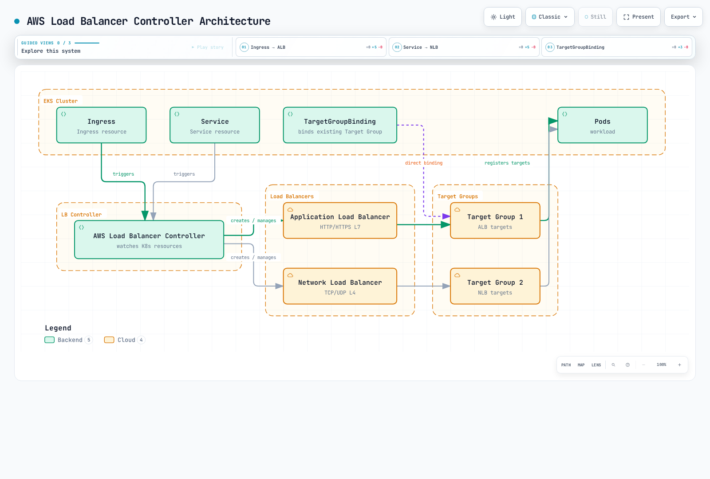

# AWS Load Balancer Controller

> **审查基线**：AWS Load Balancer Controller / Helm chart v3.5.0
> **最后更新**：2026 年 9 月 11 日

## 概述

AWS Load Balancer Controller 是为 Kubernetes 集群管理 AWS Elastic Load Balancer（ELB）的控制器。它自动将 Kubernetes Ingress 和 Service 资源与 AWS Application Load Balancer（ALB）及 Network Load Balancer（NLB）集成。

### 主要功能

- **Application Load Balancer（ALB）**：HTTP/HTTPS 流量、基于路径的路由、基于主机的路由
- **Network Load Balancer（NLB）**：TCP/UDP 流量、高性能 L4 负载均衡
- **TargetGroupBinding**：将现有目标组连接到 Kubernetes Service
- **AWS WAF 集成**：Web 应用防火墙防护
- **AWS Shield**：DDoS 防护



[🔍 查看交互式图表](https://www.atomai.click/kubernetes-docs/archmaps/en-networking-03-aws-lb-controller-0.html)

## 架构

### 控制器如何工作


[🔍 查看交互式图表](https://www.atomai.click/kubernetes-docs/archmaps/en-networking-03-aws-lb-controller-1.html)

### 组件结构

安装完整的已发布 chart，包括 RBAC、CRD、探针和 webhook 证书。控制器监视 Kubernetes 对象并调用 AWS API；应用流量经过负载均衡器及其目标，不经过控制器 Pod。启用领导者选举时，一个副本执行协调，其他副本提供备用容量和 webhook 可用性。仅有副本数量不能保证跨节点或可用区放置。

## 前提条件

### 所有权和兼容性

本章配置**自主管理的开源控制器**。EKS Auto Mode 提供自己的托管负载均衡：NLB Service 使用 `eks.amazonaws.com/nlb`，ALB IngressClass 使用 `eks.amazonaws.com/alb`，其 TargetGroupBinding API 也不同于 `elbv2.k8s.aws/v1beta1`。请查阅 Auto Mode 迁移指南，而不是就地更改类或复制所有注解。两种模型并存时，显式指定类可避免歧义。

使用当前受支持的 EKS Kubernetes 版本，并验证所有共享集群范围 CRD 的控制器。LBC **v3.5.0** 于 **2026-08-03** 发布；已验证的 chart **3.5.0** 打包了此控制器。Gateway API 用户升级前需要 **v1.6.0** CRD，LBC 专属 Gateway CRD 现使用 `gateway.k8s.aws/v1`。这不意味着任意最新 Gateway API 或 Kubernetes 版本均兼容。旧的通用“Kubernetes 1.22+”安装最低要求不是当前 EKS 支持矩阵。

控制器 webhook 需要控制平面可访问 TCP 9443。在 IMDS 受限或控制器运行于 Fargate/Hybrid Nodes 时，显式设置区域/VPC 值；选择该计算类型支持的凭证机制。IP 目标需要 VPC 可路由的 Pod 地址及受支持的端点/ENI 发现机制。Amazon VPC CNI 是 EKS 的常见选择，但不是唯一可行的 CNI 配置。实例目标需要支持 NodePort 的 Service 和适当的节点网络。


### 1. 创建 IAM 策略

使用 **v3.5.0** 附带的 IAM 策略及正确的 AWS 分区。审核其中宽泛的发现和安全组权限、资源/标签条件，以及本次部署启用的功能。创建前保存审核后的策略。不要将上游策略视为最小权限保证，也不要将旧 v2.8 策略复制到当前安装。控制器 AWS 凭证可在受支持的节点上使用 **IRSA 或 EKS Pod Identity**；这些与 Kubernetes API RBAC 相互独立。

### 2. IRSA 设置

```bash
export AWS_REGION=us-east-1
export CLUSTER_NAME=my-cluster
export AWS_ACCOUNT_ID="$(aws sts get-caller-identity --query Account --output text)"
export VPC_ID="$(aws eks describe-cluster --name "$CLUSTER_NAME" \
  --query 'cluster.resourcesVpcConfig.vpcId' --output text)"
kubectl config current-context

aws eks describe-cluster --name "$CLUSTER_NAME" \
  --query cluster.identity.oidc.issuer --output text
# Only if this cluster's IAM OIDC provider does not already exist:
eksctl utils associate-iam-oidc-provider --cluster "$CLUSTER_NAME" \
  --region "$AWS_REGION" --approve

curl --fail --location --output iam-policy-upstream.json \
  https://raw.githubusercontent.com/kubernetes-sigs/aws-load-balancer-controller/v3.5.0/docs/install/iam_policy.json
export REVIEWED_POLICY_FILE=iam-policy-reviewed.json
test -s "$REVIEWED_POLICY_FILE"
export CONTROLLER_POLICY_ARN="$(aws iam create-policy \
  --policy-name AWSLoadBalancerControllerIAMPolicy \
  --policy-document "file://$REVIEWED_POLICY_FILE" --query Policy.Arn --output text)"
eksctl create iamserviceaccount --cluster "$CLUSTER_NAME" --region "$AWS_REGION" \
  --namespace kube-system --name aws-load-balancer-controller \
  --attach-policy-arn "$CONTROLLER_POLICY_ARN" --approve
```

复用现有已审核策略/角色，不要重新创建。复用的 IRSA 角色需要针对本集群 OIDC 提供程序及目标服务账户的信任声明。对于现有服务账户，更改前应审核所有权和注解。Pod Identity 使用自己的代理/关联及角色信任配置；不要将静态访问密钥复制到 chart values。

## 安装

### 使用 Helm 安装

```bash
helm repo add eks https://aws.github.io/eks-charts
helm repo update eks
helm pull eks/aws-load-balancer-controller --version 3.5.0

# Review cluster-wide CRD changes and other controllers before applying.
curl --fail --location --output gateway-api-v1.6.0.yaml \
  https://github.com/kubernetes-sigs/gateway-api/releases/download/v1.6.0/standard-install.yaml
kubectl apply --server-side -f gateway-api-v1.6.0.yaml
helm show crds ./aws-load-balancer-controller-3.5.0.tgz > lbc-crds.yaml
kubectl apply --server-side -f lbc-crds.yaml

# Save the values below as controller-values.yaml and replace its cluster/region/VPC.
helm install aws-load-balancer-controller ./aws-load-balancer-controller-3.5.0.tgz \
  -n kube-system -f controller-values.yaml --wait --timeout 5m
```

```yaml
# values.yaml example
clusterName: my-cluster
serviceAccount:
  create: false
  name: aws-load-balancer-controller

region: us-east-1
vpcId: vpc-0123456789abcdef0

# Resource settings
resources:
  requests:
    cpu: 100m
    memory: 128Mi
  limits:
    cpu: 200m
    memory: 256Mi

# Replica count
replicaCount: 2

# Pod Disruption Budget
podDisruptionBudget:
  minAvailable: 1

# Anti-Affinity for HA
affinity:
  podAntiAffinity:
    preferredDuringSchedulingIgnoredDuringExecution:
      - weight: 100
        podAffinityTerm:
          labelSelector:
            matchExpressions:
              - key: app.kubernetes.io/name
                operator: In
                values:
                  - aws-load-balancer-controller
          topologyKey: kubernetes.io/hostname

# Webhook certificates
enableCertManager: false

# Log level
logLevel: info

# IngressClass settings
ingressClass: alb
createIngressClassResource: true

# Additional settings
enableShield: false
enableWaf: false
enableWafv2: true
# Use explicit Service classes; do not claim unclassified LoadBalancer Services.
enableServiceMutatorWebhook: false
enableEndpointSlices: true
keepTLSSecret: true
clusterSecretsPermissions:
  allowAllSecrets: false
```

资源值只是示例，并非测量得到的生产容量配置。现有发布需要审核过的 `helm upgrade`，并使用已保存 values；Helm 不会自动升级 CRD。设置 `enableServiceMutatorWebhook: false` 后，本章的 NLB Service 显式选择 `service.k8s.aws/nlb`。否则默认 webhook 会修改新建的 LoadBalancer Service，不会修改后来才改变类型的现有 Service。`keepTLSSecret: true` 在可用时复用 Helm 管理的 webhook Secret；GitOps/轮换时应协调 CA 捆绑包和 Pod 证书，或使用单独安装的兼容 cert-manager。不要通过删除共享 CRD 来强制升级。

### 验证安装

```bash
# Check Deployment status
kubectl get deployment -n kube-system aws-load-balancer-controller

# Check Pod status
kubectl get pods -n kube-system -l app.kubernetes.io/name=aws-load-balancer-controller

# Check logs
kubectl logs -n kube-system -l app.kubernetes.io/name=aws-load-balancer-controller

# Check IngressClass
kubectl get ingressclass
```

## Application Load Balancer（ALB）

将下列每个清单视为独立示例。把账户/资源 ID、域名、子网、安全组和证书 ARN 替换为正确区域中已验证的值。先创建引用的命名空间、Service 和就绪的后端工作负载；服务端口 80 与目标端口 8080 的职责不同。声明 containerPort 不会使应用开始监听或实现 /health。健康端点、实际目标端口、HTTP/TLS 协议、安全组和 NetworkPolicy 必须一致。概述中的图展示的是 **IP 目标**；实例目标注册节点并使用 NodePort。TargetGroupBinding 也由此控制器协调，时序图是示意，并非原子事务。

### 基本 Ingress 配置

```yaml
apiVersion: networking.k8s.io/v1
kind: Ingress
metadata:
  name: my-ingress
  namespace: default
  annotations:
    # ALB scheme (internet-facing or internal)
    alb.ingress.kubernetes.io/scheme: internet-facing

    # Target Type (ip or instance)
    alb.ingress.kubernetes.io/target-type: ip

    # Listener ports
    alb.ingress.kubernetes.io/listen-ports: '[{"HTTP": 80}, {"HTTPS": 443}]'

    # SSL redirect
    alb.ingress.kubernetes.io/ssl-redirect: "443"

    # ACM certificate
    alb.ingress.kubernetes.io/certificate-arn: arn:aws:acm:us-east-1:ACCOUNT:certificate/CERT_ID

    # Subnet specification
    alb.ingress.kubernetes.io/subnets: subnet-xxx,subnet-yyy,subnet-zzz

    # Security groups
    alb.ingress.kubernetes.io/security-groups: sg-xxxxxxxxx
    alb.ingress.kubernetes.io/manage-backend-security-group-rules: "true"

    # Health check settings
    alb.ingress.kubernetes.io/healthcheck-path: /health
    alb.ingress.kubernetes.io/healthcheck-interval-seconds: "15"
    alb.ingress.kubernetes.io/healthcheck-timeout-seconds: "5"
    alb.ingress.kubernetes.io/healthy-threshold-count: "2"
    alb.ingress.kubernetes.io/unhealthy-threshold-count: "2"

spec:
  ingressClassName: alb
  rules:
    - host: api.example.com
      http:
        paths:
          - path: /
            pathType: Prefix
            backend:
              service:
                name: api-service
                port:
                  number: 80
```

### 高级 Ingress 配置

```yaml
apiVersion: networking.k8s.io/v1
kind: Ingress
metadata:
  name: advanced-ingress
  annotations:
    alb.ingress.kubernetes.io/scheme: internet-facing
    alb.ingress.kubernetes.io/target-type: ip

    # Group multiple Ingresses into single ALB
    alb.ingress.kubernetes.io/group.name: my-app-group
    alb.ingress.kubernetes.io/group.order: "10"

    # Target group attributes
    alb.ingress.kubernetes.io/target-group-attributes: >-
      stickiness.enabled=true,
      stickiness.lb_cookie.duration_seconds=60,
      slow_start.duration_seconds=30,
      deregistration_delay.timeout_seconds=30

    # IP address type
    alb.ingress.kubernetes.io/ip-address-type: dualstack

    # Load balancer attributes
    alb.ingress.kubernetes.io/load-balancer-attributes: >-
      idle_timeout.timeout_seconds=60,
      routing.http2.enabled=true,
      routing.http.drop_invalid_header_fields.enabled=true,
      access_logs.s3.enabled=true,
      access_logs.s3.bucket=my-alb-logs,
      access_logs.s3.prefix=my-app

    # Tags
    alb.ingress.kubernetes.io/tags: Environment=production,Team=platform

    # WAF v2 integration
    alb.ingress.kubernetes.io/wafv2-acl-arn: arn:aws:wafv2:us-east-1:ACCOUNT:regional/webacl/my-acl/xxx

    # Shield Advanced
    alb.ingress.kubernetes.io/shield-advanced-protection: "true"

spec:
  ingressClassName: alb
  tls:
    - hosts:
        - api.example.com
        - www.example.com
  rules:
    - host: api.example.com
      http:
        paths:
          - path: /v1
            pathType: Prefix
            backend:
              service:
                name: api-v1
                port:
                  number: 80
          - path: /v2
            pathType: Prefix
            backend:
              service:
                name: api-v2
                port:
                  number: 80
    - host: www.example.com
      http:
        paths:
          - path: /
            pathType: Prefix
            backend:
              service:
                name: web-frontend
                port:
                  number: 80
```

### 基于路径的路由

```yaml
apiVersion: networking.k8s.io/v1
kind: Ingress
metadata:
  name: path-based-routing
  annotations:
    alb.ingress.kubernetes.io/scheme: internet-facing
    alb.ingress.kubernetes.io/target-type: ip

    # Condition-based routing
    alb.ingress.kubernetes.io/conditions.api-v2: >-
      [{"field":"http-header","httpHeaderConfig":{"httpHeaderName":"X-Api-Version","values":["v2"]}}]

spec:
  ingressClassName: alb
  rules:
    - host: api.example.com
      http:
        paths:
          # Exact path matching
          - path: /health
            pathType: Exact
            backend:
              service:
                name: health-service
                port:
                  number: 80

          # API version routing
          - path: /api
            pathType: Prefix
            backend:
              service:
                name: api-v2
                port:
                  number: 80
          - path: /api
            pathType: Prefix
            backend:
              service:
                name: api-v1
                port:
                  number: 80

          # Static files
          - path: /static
            pathType: Prefix
            backend:
              service:
                name: static-service
                port:
                  number: 80

          # Default path
          - path: /
            pathType: Prefix
            backend:
              service:
                name: default-service
                port:
                  number: 80
```

### 身份验证配置

这些示例需要现有 HTTPS 证书和身份提供程序应用。配置回调 `https://app.example.com/oauth2/idpresponse`、授权码流程、允许的作用域和所需客户端密钥。ALB 必须通过 IPv4 访问提供程序的令牌/用户信息端点；内部 ALB 可能需要适当的出口/NAT 路径。身份验证仅在 HTTPS 监听器上进行。对未经身份验证的请求使用 `allow` 不会保护后端。限制直接后端访问，并按应用要求验证 ALB 签名的用户声明。

```yaml
apiVersion: networking.k8s.io/v1
kind: Ingress
metadata:
  name: auth-ingress
  annotations:
    alb.ingress.kubernetes.io/scheme: internet-facing
    alb.ingress.kubernetes.io/target-type: ip
    alb.ingress.kubernetes.io/listen-ports: '[{"HTTPS": 443}]'
    alb.ingress.kubernetes.io/certificate-arn: arn:aws:acm:us-east-1:123456789012:certificate/12345678-1234-1234-1234-123456789012

    # Cognito authentication
    alb.ingress.kubernetes.io/auth-type: cognito
    alb.ingress.kubernetes.io/auth-idp-cognito: >-
      {"userPoolARN":"arn:aws:cognito-idp:us-east-1:ACCOUNT:userpool/us-east-1_xxxxx",
       "userPoolClientID":"xxxxxxxxx",
       "userPoolDomain":"my-domain"}
    alb.ingress.kubernetes.io/auth-on-unauthenticated-request: authenticate
    alb.ingress.kubernetes.io/auth-scope: "openid profile email"
    alb.ingress.kubernetes.io/auth-session-cookie: "AWSELBAuthSessionCookie"
    alb.ingress.kubernetes.io/auth-session-timeout: "3600"

spec:
  ingressClassName: alb
  rules:
    - host: app.example.com
      http:
        paths:
          - path: /
            pathType: Prefix
            backend:
              service:
                name: protected-app
                port:
                  number: 80
```

```yaml
# OIDC Authentication Example
apiVersion: networking.k8s.io/v1
kind: Ingress
metadata:
  name: oidc-ingress
  annotations:
    alb.ingress.kubernetes.io/scheme: internet-facing
    alb.ingress.kubernetes.io/target-type: ip
    alb.ingress.kubernetes.io/listen-ports: '[{"HTTPS": 443}]'
    alb.ingress.kubernetes.io/certificate-arn: arn:aws:acm:us-east-1:123456789012:certificate/12345678-1234-1234-1234-123456789012

    # OIDC authentication
    alb.ingress.kubernetes.io/auth-type: oidc
    alb.ingress.kubernetes.io/auth-idp-oidc: >-
      {"issuer":"https://accounts.google.com",
       "authorizationEndpoint":"https://accounts.google.com/o/oauth2/v2/auth",
       "tokenEndpoint":"https://oauth2.googleapis.com/token",
       "userInfoEndpoint":"https://openidconnect.googleapis.com/v1/userinfo",
       "secretName":"oidc-secret"}
    alb.ingress.kubernetes.io/auth-on-unauthenticated-request: authenticate

spec:
  ingressClassName: alb
  rules:
    - host: app.example.com
      http:
        paths:
          - path: /
            pathType: Prefix
            backend:
              service:
                name: protected-app
                port:
                  number: 80
---
# OIDC Secret
apiVersion: v1
kind: Secret
metadata:
  name: oidc-secret
type: Opaque
stringData:
  clientID: your-client-id
  clientSecret: your-client-secret
```

OIDC Secret 必须位于 Ingress 命名空间。Chart 默认设置 `clusterSecretsPermissions.allowAllSecrets: false`；仅授予控制器所需的 Secret 访问权限。v3.5.0 使用 `metadata.name` 字段选择器监视 Secret，因此 Role 可通过 `resourceNames` 限制范围。通过获准的密钥管理流程创建真实 Secret；不要提交真实客户端密钥。

```yaml
apiVersion: rbac.authorization.k8s.io/v1
kind: Role
metadata:
  name: lbc-oidc-secret
  namespace: default
rules:
- apiGroups:
  - ''
  resources:
  - secrets
  resourceNames:
  - oidc-secret
  verbs:
  - get
  - list
  - watch
---
apiVersion: rbac.authorization.k8s.io/v1
kind: RoleBinding
metadata:
  name: lbc-oidc-secret
  namespace: default
subjects:
- kind: ServiceAccount
  name: aws-load-balancer-controller
  namespace: kube-system
roleRef:
  apiGroup: rbac.authorization.k8s.io
  kind: Role
  name: lbc-oidc-secret
```

## Network Load Balancer（NLB）

### 基本 NLB Service 配置

```yaml
apiVersion: v1
kind: Service
metadata:
  name: nlb-service
  annotations:
    # Specify NLB type
    service.beta.kubernetes.io/aws-load-balancer-nlb-target-type: "ip"

    # Scheme
    service.beta.kubernetes.io/aws-load-balancer-scheme: "internet-facing"

    # Subnet specification
    service.beta.kubernetes.io/aws-load-balancer-subnets: subnet-xxx,subnet-yyy

    # Health check
    service.beta.kubernetes.io/aws-load-balancer-healthcheck-protocol: "HTTP"
    service.beta.kubernetes.io/aws-load-balancer-healthcheck-path: "/health"
    service.beta.kubernetes.io/aws-load-balancer-healthcheck-port: "8080"
    service.beta.kubernetes.io/aws-load-balancer-healthcheck-interval: "10"
    service.beta.kubernetes.io/aws-load-balancer-healthcheck-healthy-threshold: "2"
    service.beta.kubernetes.io/aws-load-balancer-healthcheck-unhealthy-threshold: "2"

spec:
  type: LoadBalancer
  loadBalancerClass: service.k8s.aws/nlb
  selector:
    app: my-app
  ports:
    - name: tcp
      port: 80
      targetPort: 8080
      protocol: TCP
```

### 加权目标组

下方 Service 将自身隐式目标组的权重设为 90，将现有 `service-canary:8080` 后端的权重设为 10。两个 Service 都必须具有预期的就绪端点及兼容的目标设置；此注解不会创建金丝雀工作负载。注解后缀为监听器协议和端口，即 **`actions.TCP-80`**。

权重是 **0 到 999** 的相对值，适用于新连接。普通权重更改保留现有连接；**将目标组权重设为 0 不仅停止新连接，还会在短时间后关闭其现有连接**。不要将其描述为保证零停机的连接排空。TLS 监听器要求兼容的目标组协议，且不支持目标组粘性。

```yaml
apiVersion: v1
kind: Service
metadata:
  name: nlb-weighted
  namespace: default
  annotations:
    service.beta.kubernetes.io/aws-load-balancer-nlb-target-type: ip
    service.beta.kubernetes.io/aws-load-balancer-scheme: internal
    service.beta.kubernetes.io/actions.TCP-80: '{"type":"forward","forwardConfig":{"baseServiceWeight":90,"targetGroups":[{"serviceName":"service-canary","servicePort":8080,"weight":10}]}}'
spec:
  type: LoadBalancer
  loadBalancerClass: service.k8s.aws/nlb
  selector:
    app: my-app
    version: stable
  ports:
  - name: tcp
    port: 80
    targetPort: 8080
    protocol: TCP
```

### 终止 TLS 的 NLB

```yaml
apiVersion: v1
kind: Service
metadata:
  name: nlb-tls-service
  annotations:
    service.beta.kubernetes.io/aws-load-balancer-nlb-target-type: "ip"
    service.beta.kubernetes.io/aws-load-balancer-scheme: "internet-facing"

    # TLS configuration
    service.beta.kubernetes.io/aws-load-balancer-ssl-cert: "arn:aws:acm:us-east-1:ACCOUNT:certificate/CERT_ID"
    service.beta.kubernetes.io/aws-load-balancer-ssl-ports: "443"
    service.beta.kubernetes.io/aws-load-balancer-ssl-negotiation-policy: "ELBSecurityPolicy-TLS13-1-2-2021-06"

    # Backend is HTTP
    service.beta.kubernetes.io/aws-load-balancer-backend-protocol: "tcp"

spec:
  type: LoadBalancer
  loadBalancerClass: service.k8s.aws/nlb
  selector:
    app: my-app
  ports:
    - name: https
      port: 443
      targetPort: 8080
      protocol: TCP
```

### 内部 NLB

```yaml
apiVersion: v1
kind: Service
metadata:
  name: internal-nlb
  annotations:
    service.beta.kubernetes.io/aws-load-balancer-nlb-target-type: "ip"

    # Internal scheme
    service.beta.kubernetes.io/aws-load-balancer-scheme: "internal"

    # Cross-zone load balancing
    service.beta.kubernetes.io/aws-load-balancer-attributes: "load_balancing.cross_zone.enabled=true"

    # Private subnets
    service.beta.kubernetes.io/aws-load-balancer-subnets: subnet-private-a,subnet-private-b

    # Security groups (optional)
    service.beta.kubernetes.io/aws-load-balancer-security-groups: sg-xxxxxxxxx
    service.beta.kubernetes.io/aws-load-balancer-manage-backend-security-group-rules: "true"

spec:
  type: LoadBalancer
  loadBalancerClass: service.k8s.aws/nlb
  selector:
    app: internal-service
  ports:
    - port: 80
      targetPort: 8080
```

### 支持 UDP 的 NLB

```yaml
apiVersion: v1
kind: Service
metadata:
  name: udp-nlb
  annotations:
    service.beta.kubernetes.io/aws-load-balancer-enable-tcp-udp-listener: "true"
    service.beta.kubernetes.io/aws-load-balancer-nlb-target-type: "ip"
    service.beta.kubernetes.io/aws-load-balancer-scheme: "internet-facing"

spec:
  type: LoadBalancer
  loadBalancerClass: service.k8s.aws/nlb
  selector:
    app: dns-server
  ports:
    - name: dns-udp
      port: 53
      targetPort: 53
      protocol: UDP
    - name: dns-tcp
      port: 53
      targetPort: 53
      protocol: TCP
```

### Proxy Protocol v2

Proxy Protocol v2 以二进制连接元数据传递原始客户端地址；它**不保留** IP 数据包的源地址。示例禁用数据包级客户端 IP 保留，以明确这一区别。后端必须先解析 Proxy Protocol，再处理应用数据，包括适用的健康检查连接。普通 HTTP/TLS 服务器不经配置无法处理该前缀。

`preserve_client_ip.enabled` 在目标类型/协议/网络路径支持时控制 NLB 数据包源地址保留。使用实例/NodePort 目标时，`externalTrafficPolicy: Local` 可避免后续 kube-proxy SNAT 跳转；它不是 NLB 地址保留的通用替代方案。IP 地址族转换及不受支持的中转/回流路径需要单独考虑。

```yaml
apiVersion: v1
kind: Service
metadata:
  name: proxy-protocol-nlb
  annotations:
    service.beta.kubernetes.io/aws-load-balancer-nlb-target-type: "ip"
    service.beta.kubernetes.io/aws-load-balancer-scheme: "internet-facing"

    # Enable Proxy Protocol v2

    # Target Group attributes
    service.beta.kubernetes.io/aws-load-balancer-target-group-attributes: >-
      proxy_protocol_v2.enabled=true,
      preserve_client_ip.enabled=false

spec:
  type: LoadBalancer
  loadBalancerClass: service.k8s.aws/nlb
  selector:
    app: proxy-aware-app
  ports:
    - port: 80
      targetPort: 8080
```

## IngressClass 和 IngressClassParams

此可选类名为 `alb-platform`，以避免覆盖 chart 管理的 `alb` 类。为目标命名空间添加 `alb-enabled=true` 标签，并将其 Ingress 设置为 `spec.ingressClassName: alb-platform`。除非策略有意如此，否则不要将其设为集群默认值。IngressClassParams 设置优先于相应注解。

### IngressClass 定义

```yaml
apiVersion: networking.k8s.io/v1
kind: IngressClass
metadata:
  name: alb-platform
spec:
  controller: ingress.k8s.aws/alb
  parameters:
    apiGroup: elbv2.k8s.aws
    kind: IngressClassParams
    name: alb-params
```

### IngressClassParams 配置

```yaml
apiVersion: elbv2.k8s.aws/v1beta1
kind: IngressClassParams
metadata:
  name: alb-params
spec:
  # Default scheme
  scheme: internet-facing

  # IP address type
  ipAddressType: dualstack

  # Namespace selector (allow only specific namespaces)
  namespaceSelector:
    matchLabels:
      alb-enabled: "true"

  # Default tags
  tags:
    - key: Environment
      value: production
    - key: ManagedBy
      value: aws-load-balancer-controller

  # Load balancer attributes
  loadBalancerAttributes:
    - key: idle_timeout.timeout_seconds
      value: "60"
    - key: routing.http2.enabled
      value: "true"

  # Subnet selection
  # subnets:
  #   ids:
  #     - subnet-xxx
  #     - subnet-yyy
  #   tags:
  #     kubernetes.io/role/elb: ["1"]

  # Group settings
  group:
    name: my-default-group
```

## TargetGroupBinding {#targetgroupbinding}

TargetGroupBinding CRD 允许将现有 AWS 目标组直接连接到 Kubernetes Service。

### 基本 TargetGroupBinding

```yaml
apiVersion: elbv2.k8s.aws/v1beta1
kind: TargetGroupBinding
metadata:
  name: my-tgb
  namespace: default
spec:
  # Existing Target Group ARN
  targetGroupARN: arn:aws:elasticloadbalancing:us-east-1:ACCOUNT:targetgroup/my-tg/xxxxxxxxxxxx

  # Service to connect
  serviceRef:
    name: my-service
    port: 80

  # Target Type (ip or instance)
  targetType: ip

  # Networking settings
  networking:
    ingress:
      - from:
          - securityGroup:
              groupID: sg-xxxxxxxxx
        ports:
          - port: 80
            protocol: TCP
```

TGB 管理目标注册，不管理现有负载均衡器/监听器的生命周期。保持服务端口、目标组协议/IP 地址族、后端目标端口及安全组规则一致。`nodeSelector` 仅过滤**实例**目标；不选择 IP 模式 Pod。应仅允许可信操作员创建/更新 TGB，因为控制器的 IAM 权限可能允许引用账户中的其他目标组。

当多个集群或 TGB 共享一个目标组时，**每个参与的 TGB 从创建时起**就应配置 `spec.multiClusterTargetGroup: true`。默认值 `false` 假定拥有完整管理权，可能注销其他集群的目标。创建后不要随意切换此标志；文档说明此更改可能遗留目标。为每个集群使用独立目标组是另一种所有权模型。

### 高级 TargetGroupBinding

```yaml
apiVersion: elbv2.k8s.aws/v1beta1
kind: TargetGroupBinding
metadata:
  name: advanced-tgb
  namespace: production
spec:
  targetGroupARN: arn:aws:elasticloadbalancing:us-east-1:ACCOUNT:targetgroup/prod-tg/xxxxxxxxxxxx

  serviceRef:
    name: production-service
    port: 8080

  targetType: ip

  # IP address type
  ipAddressType: ipv4

  # VPC ID (auto-detected, can be explicit)
  # vpcID: vpc-xxxxxxxxx

  # Networking settings
  networking:
    ingress:
      # Allow traffic from multiple security groups
      - from:
          - securityGroup:
              groupID: sg-alb-sg
          - securityGroup:
              groupID: sg-internal-sg
        ports:
          - port: 8080
            protocol: TCP
          - port: 8443
            protocol: TCP

  # Node selector applies to instance targets, not IP-mode pod selection
  # nodeSelector:
  #   matchLabels:
  #     node-type: compute
```

### 多端口 TargetGroupBinding

```yaml
# Separate TargetGroupBindings for multiple ports
---
apiVersion: elbv2.k8s.aws/v1beta1
kind: TargetGroupBinding
metadata:
  name: http-tgb
spec:
  targetGroupARN: arn:aws:elasticloadbalancing:...:targetgroup/http-tg/xxx
  serviceRef:
    name: multi-port-service
    port: 80
  targetType: ip
---
apiVersion: elbv2.k8s.aws/v1beta1
kind: TargetGroupBinding
metadata:
  name: https-tgb
spec:
  targetGroupARN: arn:aws:elasticloadbalancing:...:targetgroup/https-tg/yyy
  serviceRef:
    name: multi-port-service
    port: 443
  targetType: ip
```

## WAF 和 Shield 集成

使用 ALB 所在区域的现有区域 Web ACL，并配置预期规则。安装 values 启用 WAF v2，但禁用 Shield 集成；要使用 Shield Advanced 示例，先安排所需订阅/权限，再启用控制器的 Shield 集成。仅添加注解不会激活付费订阅，也不会覆盖已禁用的控制器功能。这些 ALB 集成不意味着 WAF 会检查任意 NLB TCP/UDP 流量。S3 访问日志示例还需要现有目标桶和文档规定的 ALB 日志交付桶策略。

### AWS WAF v2 集成

```yaml
apiVersion: networking.k8s.io/v1
kind: Ingress
metadata:
  name: waf-protected-ingress
  annotations:
    alb.ingress.kubernetes.io/scheme: internet-facing
    alb.ingress.kubernetes.io/target-type: ip

    # Connect WAF v2 WebACL
    alb.ingress.kubernetes.io/wafv2-acl-arn: arn:aws:wafv2:us-east-1:ACCOUNT:regional/webacl/my-webacl/xxxxxxxx-xxxx-xxxx-xxxx-xxxxxxxxxxxx

spec:
  ingressClassName: alb
  rules:
    - host: api.example.com
      http:
        paths:
          - path: /
            pathType: Prefix
            backend:
              service:
                name: api-service
                port:
                  number: 80
```

### AWS Shield Advanced

```yaml
apiVersion: networking.k8s.io/v1
kind: Ingress
metadata:
  name: shield-protected-ingress
  annotations:
    alb.ingress.kubernetes.io/scheme: internet-facing
    alb.ingress.kubernetes.io/target-type: ip

    # Enable Shield Advanced protection
    alb.ingress.kubernetes.io/shield-advanced-protection: "true"

spec:
  ingressClassName: alb
  rules:
    - host: critical-app.example.com
      http:
        paths:
          - path: /
            pathType: Prefix
            backend:
              service:
                name: critical-service
                port:
                  number: 80
```

## 重要版本更新

- **v2.16.0 — 2025-11-20：** ALB Target Optimizer 和 NLB 加权目标组。Target Optimizer 需要其目标控制代理和配置；仅安装 LBC 不会启用它。
- **v2.17.0 — 2025-12-19：** 通过单一 `aga.k8s.aws/v1beta1` `GlobalAccelerator` CRD 支持 Global Accelerator，内嵌监听器、端点组和端点；Gateway API 达到正式发布候选状态。Global Accelerator 需要额外 IAM 权限和功能配置。
- **v3.5.0 — 2026-08-03：** 符合 Gateway API v1.6.0，并支持稳定版 v1 TCPRoute/UDPRoute。LBC Gateway 配置资源使用 `gateway.k8s.aws/v1`；仍提供服务的 v1beta1 版本已弃用。

当前 v3.5 支持 QUIC/TCP_QUIC 配置和 ALB JWT 验证。这些是不同功能，具有各自协议约束。JWT 验证仅支持 HTTPS，其 JSON 使用 **`jwksEndpoint`**，而非 `jwksUri`。为具有有效证书、可达且可信的 JWKS 端点及已审核签发者/声明的 HTTPS Ingress 添加以下注解：

```yaml
alb.ingress.kubernetes.io/jwt-validation: >-
  {"issuer":"https://accounts.example.com","jwksEndpoint":"https://accounts.example.com/.well-known/jwks.json"}
```

这是注解片段，不是完整 Kubernetes 对象。请验证应用所需的受众/其他声明，不要假定仅验证签名就足以授权。独立的 Gateway 配置请参阅 [Gateway API 指南](./04-gateway-api.md)。

## 注解参考

### ALB Ingress 注解

| 注解 | 描述 | 默认值 |
|------------|-------------|---------|
| `alb.ingress.kubernetes.io/scheme` | internet-facing 或 internal | internal |
| `alb.ingress.kubernetes.io/target-type` | ip 或 instance | instance |
| `alb.ingress.kubernetes.io/subnets` | 子网 ID 或名称 | 自动检测 |
| `alb.ingress.kubernetes.io/security-groups` | 安全组 ID | 自动创建 |
| `alb.ingress.kubernetes.io/listen-ports` | 监听器端口 JSON | HTTP 80，指定 certificate-arn 时为 HTTPS 443 |
| `alb.ingress.kubernetes.io/certificate-arn` | ACM 证书 ARN | - |
| `alb.ingress.kubernetes.io/ssl-redirect` | SSL 重定向端口 | - |
| `alb.ingress.kubernetes.io/ssl-policy` | SSL 策略 | ELBSecurityPolicy-2016-08 |
| `alb.ingress.kubernetes.io/healthcheck-path` | 健康检查路径 | / |
| `alb.ingress.kubernetes.io/healthcheck-port` | 健康检查端口 | traffic-port |
| `alb.ingress.kubernetes.io/healthcheck-protocol` | 健康检查协议 | HTTP |
| `alb.ingress.kubernetes.io/healthcheck-interval-seconds` | 健康检查间隔 | 15 |
| `alb.ingress.kubernetes.io/healthcheck-timeout-seconds` | 健康检查超时 | 5 |
| `alb.ingress.kubernetes.io/healthy-threshold-count` | 健康阈值 | 2 |
| `alb.ingress.kubernetes.io/unhealthy-threshold-count` | 不健康阈值 | 2 |
| `alb.ingress.kubernetes.io/group.name` | Ingress 组名 | - |
| `alb.ingress.kubernetes.io/group.order` | 组内优先级 | 0 |
| `alb.ingress.kubernetes.io/ip-address-type` | ipv4 或 dualstack | ipv4 |
| `alb.ingress.kubernetes.io/load-balancer-attributes` | 负载均衡器属性 | - |
| `alb.ingress.kubernetes.io/target-group-attributes` | 目标组属性 | - |
| `alb.ingress.kubernetes.io/tags` | 资源标签 | - |
| `alb.ingress.kubernetes.io/wafv2-acl-arn` | WAF v2 WebACL ARN | - |
| `alb.ingress.kubernetes.io/shield-advanced-protection` | Shield 防护 | false |
| `alb.ingress.kubernetes.io/auth-type` | 身份验证类型（none、cognito、oidc） | none |

### NLB Service 注解

| 注解 | 描述 | 默认值 |
|------------|-------------|---------|
| `service.beta.kubernetes.io/aws-load-balancer-type` | external（NLB）或 nlb | - |
| `service.beta.kubernetes.io/aws-load-balancer-nlb-target-type` | ip 或 instance | instance |
| `service.beta.kubernetes.io/aws-load-balancer-scheme` | internet-facing 或 internal | internal |
| `service.beta.kubernetes.io/aws-load-balancer-subnets` | 子网 ID | 自动检测 |
| `service.beta.kubernetes.io/aws-load-balancer-ssl-cert` | ACM 证书 ARN | - |
| `service.beta.kubernetes.io/aws-load-balancer-ssl-ports` | 启用 SSL 的端口 | - |
| `service.beta.kubernetes.io/aws-load-balancer-ssl-negotiation-policy` | SSL 策略 | - |
| `service.beta.kubernetes.io/aws-load-balancer-backend-protocol` | 后端协议 | - |
| `service.beta.kubernetes.io/aws-load-balancer-proxy-protocol` | Proxy Protocol | - |
| `service.beta.kubernetes.io/aws-load-balancer-cross-zone-load-balancing-enabled` | 已弃用；使用 aws-load-balancer-attributes | false |
| `service.beta.kubernetes.io/aws-load-balancer-healthcheck-protocol` | 健康检查协议 | TCP |
| `service.beta.kubernetes.io/aws-load-balancer-healthcheck-path` | 健康检查路径 | - |
| `service.beta.kubernetes.io/aws-load-balancer-healthcheck-port` | 健康检查端口 | - |
| `service.beta.kubernetes.io/aws-load-balancer-attributes` | 负载均衡器属性 | - |
| `service.beta.kubernetes.io/aws-load-balancer-target-group-attributes` | 目标组属性 | - |
| `service.beta.kubernetes.io/aws-load-balancer-security-groups` | 安全组 | 自动创建 |

## EKS 最佳实践

### 1. 子网标记

角色标签是选择目标公有/私有子网的明确方式。自主管理的 LBC v2.12.1+ 中，没有匹配角色标签的子网时，默认 `SubnetDiscoveryByReachability` 行为可改为依据路由表分类。显式子网 ID 或 IngressClassParams 标签过滤器也是可选方式。EKS Auto Mode 仍要求其文档规定的子网标签。检查集群标签过滤、可用 IP，以及每个所选可用区中是否有一个符合条件的子网；普通 ALB 至少需要两个可用区。为子网添加标签不会更改其路由表或使其变为公有子网。

```bash
# Public subnets (for internet-facing ALB/NLB)
aws ec2 create-tags \
  --resources subnet-xxx \
  --tags Key=kubernetes.io/role/elb,Value=1

# Private subnets (for internal ALB/NLB)
aws ec2 create-tags \
  --resources subnet-yyy \
  --tags Key=kubernetes.io/role/internal-elb,Value=1

# Cluster-specific tag (optional)
aws ec2 create-tags \
  --resources subnet-xxx subnet-yyy \
  --tags Key=kubernetes.io/cluster/my-cluster,Value=shared
```

### 2. 安全组管理

```yaml
apiVersion: networking.k8s.io/v1
kind: Ingress
metadata:
  name: secure-ingress
  annotations:
    alb.ingress.kubernetes.io/scheme: internet-facing
    alb.ingress.kubernetes.io/target-type: ip

    # Explicit security group specification
    alb.ingress.kubernetes.io/security-groups: sg-alb-external

    # Configure approved inbound sources on this explicit security group.
    # inbound-cidrs is ignored when security-groups is specified.

    # Additional security groups (for backend communication)
    alb.ingress.kubernetes.io/manage-backend-security-group-rules: "true"

spec:
  ingressClassName: alb
  rules:
    - host: api.example.com
      http:
        paths:
          - path: /
            pathType: Prefix
            backend:
              service:
                name: api-service
                port:
                  number: 80
```

### 3. 成本优化

IngressGroup 共享 ALB 及其规则空间。仅在同一信任边界内使用：能创建加入该组的 Ingress 的用户，可以影响路由和优先级。实施 RBAC/准入控制，并审核合并/独占注解设置。组成员关系不是命名空间隔离功能，也不无条件保证节省成本。

```yaml
# Share ALB using Ingress groups
apiVersion: networking.k8s.io/v1
kind: Ingress
metadata:
  name: app1-ingress
  annotations:
    alb.ingress.kubernetes.io/group.name: shared-alb
    alb.ingress.kubernetes.io/group.order: "1"
spec:
  ingressClassName: alb
  rules:
    - host: app1.example.com
      http:
        paths:
          - path: /
            pathType: Prefix
            backend:
              service:
                name: app1
                port:
                  number: 80
---
apiVersion: networking.k8s.io/v1
kind: Ingress
metadata:
  name: app2-ingress
  annotations:
    alb.ingress.kubernetes.io/group.name: shared-alb
    alb.ingress.kubernetes.io/group.order: "2"
spec:
  ingressClassName: alb
  rules:
    - host: app2.example.com
      http:
        paths:
          - path: /
            pathType: Prefix
            backend:
              service:
                name: app2
                port:
                  number: 80
```

### 4. 高可用配置

```yaml
apiVersion: networking.k8s.io/v1
kind: Ingress
metadata:
  name: ha-ingress
  annotations:
    alb.ingress.kubernetes.io/scheme: internet-facing
    alb.ingress.kubernetes.io/target-type: ip

    # Specify subnets in 3+ AZs
    alb.ingress.kubernetes.io/subnets: subnet-az-a,subnet-az-b,subnet-az-c

    # ALB cross-zone is enabled at the load-balancer level.
    # Review target-group overrides separately.

    # Health check optimization
    alb.ingress.kubernetes.io/healthcheck-interval-seconds: "10"
    alb.ingress.kubernetes.io/healthy-threshold-count: "2"
    alb.ingress.kubernetes.io/unhealthy-threshold-count: "2"

    # Draining timeout
    alb.ingress.kubernetes.io/target-group-attributes: deregistration_delay.timeout_seconds=30

spec:
  ingressClassName: alb
  rules:
    - host: api.example.com
      http:
        paths:
          - path: /
            pathType: Prefix
            backend:
              service:
                name: api-service
                port:
                  number: 80
```

## 故障排除

根据实际命名空间和资源清单设置下面的命名变量。更改基础设施前检查控制器事件/错误原因。可选的 exec 健康检查假定应用镜像包含 curl；否则使用获准的诊断容器。收集证据时保护日志和凭证。502 可能由连接重置、响应格式错误或 TLS 问题引起；应检查 ALB 访问日志的错误详情，不要假定每个不健康目标都产生相同 HTTP 状态。

### 常见问题

#### 1. 未创建 ALB

```bash
# Check controller logs
kubectl logs -n kube-system -l app.kubernetes.io/name=aws-load-balancer-controller

# Check Ingress events
kubectl describe ingress "$INGRESS_NAME" -n "$NAMESPACE"

# Common causes:
# - Insufficient IAM permissions
# - Missing subnet tags
# - IngressClass not specified
```

#### 2. 目标不健康

```bash
# Check Target Group status
aws elbv2 describe-target-health \
  --target-group-arn "$TARGET_GROUP_ARN"

# Check Pod logs
kubectl logs "$POD_NAME" -n "$NAMESPACE" --tail=100

# Test health check endpoint
kubectl exec "$POD_NAME" -n "$NAMESPACE" -- curl --fail --max-time 5 http://localhost:8080/health

# Check security groups
aws ec2 describe-security-groups --group-ids "$SECURITY_GROUP_ID"
```

#### 3. 502 网关错误

```bash
# Root cause analysis:
# 1. Pod not ready
kubectl get pods -l app=my-app

# 2. Target Group draining
aws elbv2 describe-target-health --target-group-arn "$TARGET_GROUP_ARN"

# 3. Health check failure
# - Verify health check path
# - Adjust health check timeout

# 4. Security group rules
# - Verify ALB -> Pod communication allowed
```

#### 4. SSL 证书问题

```bash
# Check ACM certificate status
aws acm describe-certificate --certificate-arn "$ACM_CERTIFICATE_ARN"

# Verify certificate is ISSUED status
# Check domain validation completed

# Verify region (must be same region as ALB)
```

### 调试命令

```bash
# Controller detailed logs
kubectl logs -n kube-system deployment/aws-load-balancer-controller -f

# Ingress status check
kubectl get ingress -o wide
kubectl describe ingress "$INGRESS_NAME" -n "$NAMESPACE"

# Service status check
kubectl get svc -o wide
kubectl describe svc "$SERVICE_NAME" -n "$NAMESPACE"

# TargetGroupBinding status check
kubectl get targetgroupbindings -A
kubectl describe targetgroupbinding "$TGB_NAME" -n "$NAMESPACE"

# AWS resource check
aws elbv2 describe-load-balancers --query 'LoadBalancers[?contains(LoadBalancerName, `k8s`)]'
aws elbv2 describe-target-groups --query 'TargetGroups[?contains(TargetGroupName, `k8s`)]'
```

---

## 参考资料

- [AWS Load Balancer Controller 文档](https://kubernetes-sigs.github.io/aws-load-balancer-controller/)
- [GitHub 仓库](https://github.com/kubernetes-sigs/aws-load-balancer-controller)
- [EKS 用户指南](https://docs.aws.amazon.com/eks/latest/userguide/aws-load-balancer-controller.html)
- [ALB 文档](https://docs.aws.amazon.com/elasticloadbalancing/latest/application/)
- [NLB 文档](https://docs.aws.amazon.com/elasticloadbalancing/latest/network/)

- [LBC v3.5.0 发布](https://github.com/kubernetes-sigs/aws-load-balancer-controller/releases/tag/v3.5.0)
- [LBC v3.5.0 Ingress 注解](https://github.com/kubernetes-sigs/aws-load-balancer-controller/blob/v3.5.0/docs/guide/ingress/annotations.md)
- [LBC v3.5.0 Service 注解](https://github.com/kubernetes-sigs/aws-load-balancer-controller/blob/v3.5.0/docs/guide/service/annotations.md)
- [TargetGroupBinding 所有权](https://github.com/kubernetes-sigs/aws-load-balancer-controller/blob/v3.5.0/docs/guide/targetgroupbinding/targetgroupbinding.md)
- [子网发现](https://github.com/kubernetes-sigs/aws-load-balancer-controller/blob/v3.5.0/docs/deploy/subnet_discovery.md)
- [NLB 监听器权重和连接](https://docs.aws.amazon.com/elasticloadbalancing/latest/network/load-balancer-listeners.html)
- [ALB 身份验证前提条件](https://docs.aws.amazon.com/elasticloadbalancing/latest/application/listener-authenticate-users.html)
- [EKS Auto Mode NLB](https://docs.aws.amazon.com/eks/latest/userguide/auto-configure-nlb.html)
