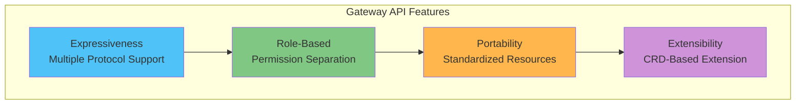
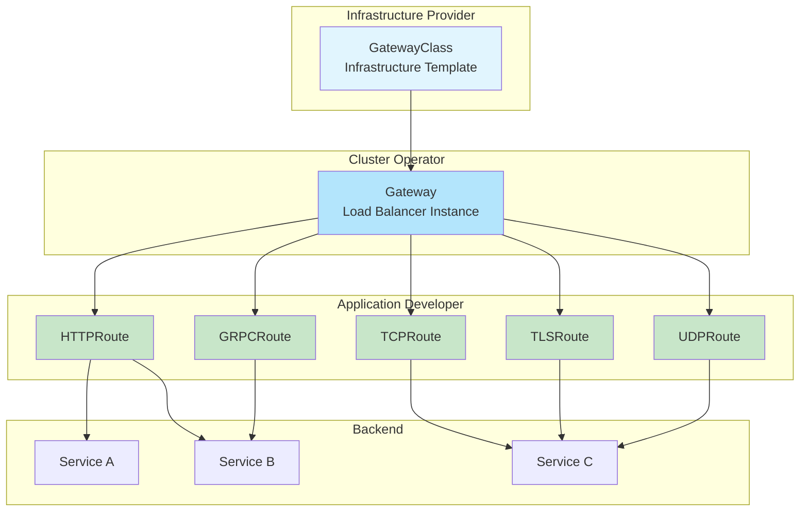

# Kubernetes Gateway API

> **支持的版本**: Gateway API v1.2+
> **最后更新**: July 3, 2026

## 概述

Gateway API 是 Kubernetes 的下一代 Ingress API，旨在克服现有 Ingress API 的限制，并提供更具表达力和可扩展的网络路由能力。它由 SIG-Network 开发，受到包括 Istio、Cilium、Envoy Gateway 等多种实现的支持。

### Ingress API 的限制

| 问题 | 描述 |
|---------|-------------|
| **表达能力有限** | 除 HTTP 路由外，对 TCP/UDP/gRPC 的支持较差 |
| **没有角色分离** | 难以分离基础设施管理员和应用开发者的权限 |
| **滥用注解** | 通过注解处理实现特定功能，降低可移植性 |
| **可扩展性有限** | 难以添加新协议或功能 |
| **跨 Namespace** | 跨 Namespace 的路由复杂 |

### Gateway API 的优势



## 资源模型

Gateway API 使用分层资源模型。



### 角色分离

| 角色 | 管理的资源 | 职责 |
|------|------------------|----------------|
| **基础设施提供商** | GatewayClass | 定义基础设施的基本配置 |
| **集群运维人员** | Gateway、ReferenceGrant | Load Balancer 配置、权限管理 |
| **应用开发者** | HTTPRoute、GRPCRoute 等 | 定义应用路由规则 |

## GatewayClass

GatewayClass 定义创建 Gateway 时要使用的 controller 和配置。

```yaml
apiVersion: gateway.networking.k8s.io/v1
kind: GatewayClass
metadata:
  name: istio
spec:
  # Controller that handles this GatewayClass
  controllerName: istio.io/gateway-controller

  # Controller-specific parameters (optional)
  parametersRef:
    group: ""
    kind: ConfigMap
    name: istio-gateway-config
    namespace: istio-system

  # Description
  description: "Istio Gateway Controller for production workloads"
```

### 按实现划分的 GatewayClass

```yaml
# Istio
apiVersion: gateway.networking.k8s.io/v1
kind: GatewayClass
metadata:
  name: istio
spec:
  controllerName: istio.io/gateway-controller
---
# Cilium
apiVersion: gateway.networking.k8s.io/v1
kind: GatewayClass
metadata:
  name: cilium
spec:
  controllerName: io.cilium/gateway-controller
---
# AWS Gateway API Controller
apiVersion: gateway.networking.k8s.io/v1
kind: GatewayClass
metadata:
  name: amazon-vpc-lattice
spec:
  controllerName: application-networking.k8s.aws/gateway-api-controller
---
# Envoy Gateway
apiVersion: gateway.networking.k8s.io/v1
kind: GatewayClass
metadata:
  name: envoy-gateway
spec:
  controllerName: gateway.envoyproxy.io/gatewayclass-controller
---
# Contour
apiVersion: gateway.networking.k8s.io/v1
kind: GatewayClass
metadata:
  name: contour
spec:
  controllerName: projectcontour.io/gateway-controller
---
# NGINX Gateway Fabric
apiVersion: gateway.networking.k8s.io/v1
kind: GatewayClass
metadata:
  name: nginx
spec:
  controllerName: gateway.nginx.org/nginx-gateway-controller
```

## Gateway

Gateway 定义实际的 Load Balancer 实例。

### 基本 Gateway 配置

```yaml
apiVersion: gateway.networking.k8s.io/v1
kind: Gateway
metadata:
  name: production-gateway
  namespace: gateway-system
spec:
  # GatewayClass to use
  gatewayClassName: istio

  # Listener configuration
  listeners:
    # HTTP listener
    - name: http
      protocol: HTTP
      port: 80
      # Allow Routes from all namespaces
      allowedRoutes:
        namespaces:
          from: All

    # HTTPS listener
    - name: https
      protocol: HTTPS
      port: 443
      tls:
        mode: Terminate
        certificateRefs:
          - kind: Secret
            name: tls-cert
            namespace: gateway-system
      allowedRoutes:
        namespaces:
          from: Selector
          selector:
            matchLabels:
              gateway-access: "true"

    # Host-specific listener
    - name: api
      protocol: HTTPS
      port: 443
      hostname: "api.example.com"
      tls:
        mode: Terminate
        certificateRefs:
          - kind: Secret
            name: api-tls-cert
      allowedRoutes:
        namespaces:
          from: Same

  # Address configuration (optional)
  addresses:
    - type: IPAddress
      value: "192.168.1.100"
```

### 高级 Gateway 配置

```yaml
apiVersion: gateway.networking.k8s.io/v1
kind: Gateway
metadata:
  name: multi-protocol-gateway
  namespace: gateway-system
  annotations:
    # Implementation-specific annotation
    networking.istio.io/service-type: LoadBalancer
spec:
  gatewayClassName: istio

  listeners:
    # For HTTP -> HTTPS redirect
    - name: http-redirect
      protocol: HTTP
      port: 80
      allowedRoutes:
        namespaces:
          from: All

    # HTTPS wildcard
    - name: https-wildcard
      protocol: HTTPS
      port: 443
      hostname: "*.example.com"
      tls:
        mode: Terminate
        certificateRefs:
          - kind: Secret
            name: wildcard-cert
      allowedRoutes:
        namespaces:
          from: All
        kinds:
          - kind: HTTPRoute

    # gRPC dedicated
    - name: grpc
      protocol: HTTPS
      port: 443
      hostname: "grpc.example.com"
      tls:
        mode: Terminate
        certificateRefs:
          - kind: Secret
            name: grpc-cert
      allowedRoutes:
        kinds:
          - kind: GRPCRoute

    # TCP passthrough
    - name: tcp-passthrough
      protocol: TLS
      port: 8443
      tls:
        mode: Passthrough
      allowedRoutes:
        kinds:
          - kind: TLSRoute

    # TCP
    - name: tcp
      protocol: TCP
      port: 9000
      allowedRoutes:
        kinds:
          - kind: TCPRoute
```

### TLS 模式

| 模式 | 描述 | 使用场景 |
|------|-------------|----------|
| **Terminate** | 在 Gateway 处终止 TLS | 标准 HTTPS |
| **Passthrough** | 将 TLS 传递至后端 | 端到端加密 |

```yaml
# TLS Terminate example
listeners:
  - name: https
    protocol: HTTPS
    port: 443
    tls:
      mode: Terminate
      certificateRefs:
        - kind: Secret
          name: server-cert
---
# TLS Passthrough example
listeners:
  - name: tls-passthrough
    protocol: TLS
    port: 443
    tls:
      mode: Passthrough
```

## HTTPRoute

HTTPRoute 定义 HTTP/HTTPS 流量的路由规则。

### 基本 HTTPRoute

```yaml
apiVersion: gateway.networking.k8s.io/v1
kind: HTTPRoute
metadata:
  name: basic-route
  namespace: production
spec:
  # Gateway to attach to
  parentRefs:
    - name: production-gateway
      namespace: gateway-system
      sectionName: https  # Target specific listener

  # Host matching
  hostnames:
    - "api.example.com"
    - "www.example.com"

  # Routing rules
  rules:
    - matches:
        - path:
            type: PathPrefix
            value: /api/v1
      backendRefs:
        - name: api-v1-service
          port: 80

    - matches:
        - path:
            type: PathPrefix
            value: /api/v2
      backendRefs:
        - name: api-v2-service
          port: 80

    # Default path
    - backendRefs:
        - name: default-service
          port: 80
```

### 高级匹配规则

```yaml
apiVersion: gateway.networking.k8s.io/v1
kind: HTTPRoute
metadata:
  name: advanced-matching
  namespace: production
spec:
  parentRefs:
    - name: production-gateway
      namespace: gateway-system

  hostnames:
    - "api.example.com"

  rules:
    # Exact path matching
    - matches:
        - path:
            type: Exact
            value: /health
      backendRefs:
        - name: health-service
          port: 80

    # Regex path matching (implementation dependent)
    - matches:
        - path:
            type: RegularExpression
            value: "/users/[0-9]+"
      backendRefs:
        - name: user-service
          port: 80

    # Header-based routing
    - matches:
        - headers:
            - name: X-Version
              value: "v2"
      backendRefs:
        - name: api-v2-service
          port: 80

    # Query parameter based
    - matches:
        - queryParams:
            - name: debug
              value: "true"
      backendRefs:
        - name: debug-service
          port: 80

    # HTTP method based
    - matches:
        - method: POST
          path:
            type: PathPrefix
            value: /api/data
      backendRefs:
        - name: write-service
          port: 80

    - matches:
        - method: GET
          path:
            type: PathPrefix
            value: /api/data
      backendRefs:
        - name: read-service
          port: 80

    # Combined conditions (AND)
    - matches:
        - path:
            type: PathPrefix
            value: /admin
          headers:
            - name: X-Admin-Token
              type: Exact
              value: "secret-token"
      backendRefs:
        - name: admin-service
          port: 80

    # Multiple conditions (OR)
    - matches:
        - path:
            type: PathPrefix
            value: /api
        - path:
            type: PathPrefix
            value: /v1
      backendRefs:
        - name: api-service
          port: 80
```

### 过滤器

过滤器可用于修改请求/响应。

```yaml
apiVersion: gateway.networking.k8s.io/v1
kind: HTTPRoute
metadata:
  name: filtered-route
  namespace: production
spec:
  parentRefs:
    - name: production-gateway
      namespace: gateway-system

  rules:
    # Request header modification
    - matches:
        - path:
            type: PathPrefix
            value: /api
      filters:
        - type: RequestHeaderModifier
          requestHeaderModifier:
            add:
              - name: X-Request-ID
                value: "generated-id"
            set:
              - name: X-Forwarded-Proto
                value: "https"
            remove:
              - X-Internal-Header
      backendRefs:
        - name: api-service
          port: 80

    # Response header modification
    - matches:
        - path:
            type: PathPrefix
            value: /public
      filters:
        - type: ResponseHeaderModifier
          responseHeaderModifier:
            add:
              - name: Cache-Control
                value: "public, max-age=3600"
            set:
              - name: X-Content-Type-Options
                value: "nosniff"
      backendRefs:
        - name: public-service
          port: 80

    # URL rewrite
    - matches:
        - path:
            type: PathPrefix
            value: /old-api
      filters:
        - type: URLRewrite
          urlRewrite:
            path:
              type: ReplacePrefixMatch
              replacePrefixMatch: /new-api
            hostname: "new-api.example.com"
      backendRefs:
        - name: new-api-service
          port: 80

    # Redirect
    - matches:
        - path:
            type: PathPrefix
            value: /legacy
      filters:
        - type: RequestRedirect
          requestRedirect:
            scheme: https
            hostname: "new.example.com"
            port: 443
            statusCode: 301
            path:
              type: ReplacePrefixMatch
              replacePrefixMatch: /modern

    # Mirroring
    - matches:
        - path:
            type: PathPrefix
            value: /api
      filters:
        - type: RequestMirror
          requestMirror:
            backendRef:
              name: shadow-service
              port: 80
      backendRefs:
        - name: main-service
          port: 80
```

### 流量拆分（权重）

```yaml
apiVersion: gateway.networking.k8s.io/v1
kind: HTTPRoute
metadata:
  name: canary-route
  namespace: production
spec:
  parentRefs:
    - name: production-gateway
      namespace: gateway-system

  hostnames:
    - "app.example.com"

  rules:
    - matches:
        - path:
            type: PathPrefix
            value: /
      backendRefs:
        # 90% traffic to stable version
        - name: app-stable
          port: 80
          weight: 90

        # 10% traffic to canary version
        - name: app-canary
          port: 80
          weight: 10
```

### 超时和重试

```yaml
apiVersion: gateway.networking.k8s.io/v1
kind: HTTPRoute
metadata:
  name: resilient-route
  namespace: production
spec:
  parentRefs:
    - name: production-gateway
      namespace: gateway-system

  rules:
    - matches:
        - path:
            type: PathPrefix
            value: /api
      # Timeout configuration (implementation dependent)
      timeouts:
        request: "30s"
        backendRequest: "25s"
      backendRefs:
        - name: api-service
          port: 80
```

## GRPCRoute

定义 gRPC 流量的路由规则。

```yaml
apiVersion: gateway.networking.k8s.io/v1
kind: GRPCRoute
metadata:
  name: grpc-route
  namespace: production
spec:
  parentRefs:
    - name: production-gateway
      namespace: gateway-system
      sectionName: grpc

  hostnames:
    - "grpc.example.com"

  rules:
    # Service-based routing
    - matches:
        - method:
            service: "myapp.UserService"
      backendRefs:
        - name: user-grpc-service
          port: 50051

    - matches:
        - method:
            service: "myapp.OrderService"
            method: "CreateOrder"
      backendRefs:
        - name: order-grpc-service
          port: 50052

    # Header-based routing
    - matches:
        - headers:
            - name: x-environment
              value: "staging"
      backendRefs:
        - name: staging-grpc-service
          port: 50051

    # Default routing
    - backendRefs:
        - name: default-grpc-service
          port: 50051
```

## TCPRoute

定义 TCP 流量路由。

```yaml
apiVersion: gateway.networking.k8s.io/v1alpha2
kind: TCPRoute
metadata:
  name: database-route
  namespace: production
spec:
  parentRefs:
    - name: production-gateway
      namespace: gateway-system
      sectionName: tcp

  rules:
    - backendRefs:
        - name: database-service
          port: 5432
---
# Multi-backend TCP routing
apiVersion: gateway.networking.k8s.io/v1alpha2
kind: TCPRoute
metadata:
  name: tcp-loadbalance
  namespace: production
spec:
  parentRefs:
    - name: production-gateway
      namespace: gateway-system
      sectionName: tcp

  rules:
    - backendRefs:
        - name: tcp-backend-1
          port: 9000
          weight: 50
        - name: tcp-backend-2
          port: 9000
          weight: 50
```

## TLSRoute

定义 TLS 透传流量路由。

```yaml
apiVersion: gateway.networking.k8s.io/v1alpha2
kind: TLSRoute
metadata:
  name: tls-passthrough-route
  namespace: production
spec:
  parentRefs:
    - name: production-gateway
      namespace: gateway-system
      sectionName: tcp-passthrough

  hostnames:
    - "secure.example.com"

  rules:
    - backendRefs:
        - name: secure-backend
          port: 8443
```

## UDPRoute

定义 UDP 流量路由。

```yaml
apiVersion: gateway.networking.k8s.io/v1alpha2
kind: UDPRoute
metadata:
  name: dns-route
  namespace: production
spec:
  parentRefs:
    - name: production-gateway
      namespace: gateway-system
      sectionName: udp

  rules:
    - backendRefs:
        - name: dns-service
          port: 53
```

## ReferenceGrant

ReferenceGrant 允许跨 Namespace 引用。

```yaml
# Allow Routes from other namespaces to reference Services in this namespace
apiVersion: gateway.networking.k8s.io/v1beta1
kind: ReferenceGrant
metadata:
  name: allow-routes-to-backend
  namespace: backend-services
spec:
  from:
    # HTTPRoute from production namespace
    - group: gateway.networking.k8s.io
      kind: HTTPRoute
      namespace: production
    # HTTPRoute from staging namespace too
    - group: gateway.networking.k8s.io
      kind: HTTPRoute
      namespace: staging
  to:
    # Can reference Services in this namespace
    - group: ""
      kind: Service
---
# Allow Gateway to reference Secrets (TLS certificates) from another namespace
apiVersion: gateway.networking.k8s.io/v1beta1
kind: ReferenceGrant
metadata:
  name: allow-gateway-to-secrets
  namespace: cert-management
spec:
  from:
    - group: gateway.networking.k8s.io
      kind: Gateway
      namespace: gateway-system
  to:
    - group: ""
      kind: Secret
```

## 实现对比

### 主要实现

| 实现 | Controller | 功能 |
|----------------|------------|----------|
| **Istio** | istio.io/gateway-controller | Service Mesh 集成、高级流量管理 |
| **Cilium** | io.cilium/gateway-controller | 基于 eBPF、高性能 |
| **Envoy Gateway** | gateway.envoyproxy.io/gatewayclass-controller | 基于 Envoy、符合标准 |
| **AWS Gateway API Controller** | application-networking.k8s.aws/gateway-api-controller | VPC Lattice 集成 |
| **Contour** | projectcontour.io/gateway-controller | 基于 Envoy、配置简单 |
| **NGINX Gateway Fabric** | gateway.nginx.org/nginx-gateway-controller | 基于 NGINX |
| **Traefik** | traefik.io/gateway-controller | 动态配置 |

### 功能支持状态

| 功能 | Istio | Cilium | Envoy GW | AWS | Contour |
|---------|-------|--------|----------|-----|---------|
| HTTPRoute | 是 | 是 | 是 | 是 | 是 |
| GRPCRoute | 是 | 是 | 是 | 部分支持 | 是 |
| TCPRoute | 是 | 是 | 是 | 否 | 是 |
| TLSRoute | 是 | 是 | 是 | 否 | 是 |
| UDPRoute | 是 | 是 | 部分支持 | 否 | 否 |
| ReferenceGrant | 是 | 是 | 是 | 是 | 是 |
| 流量拆分 | 是 | 是 | 是 | 是 | 是 |
| Header 修改 | 是 | 是 | 是 | 部分支持 | 是 |
| URL 重写 | 是 | 是 | 是 | 部分支持 | 是 |
| 镜像流量 | 是 | 部分支持 | 是 | 否 | 是 |

## AWS Load Balancer Controller Gateway API 支持（v3.0 GA）

从 AWS Load Balancer Controller v3.0.0（2026 年 1 月）开始，Gateway API 支持已达到 GA，可通过 GatewayClass/Gateway/HTTPRoute 角色分离模型声明式管理 ALB/NLB。

- **背景**：随着 NGINX Ingress Controller 将于 2026 年 3 月停止支持，AWS 将 LBC v3.0 + Gateway API 定位为原生替代方案。
- **向后兼容性**：现有 Ingress/Service 资源仍获得完全支持——无需立即切换，可逐步迁移。
- **优势**：基于 Header/query 的路由、加权流量分配（Blue/Green、Canary），以及覆盖 TCP/UDP/gRPC 的多协议设计。
- **升级注意事项**：如果通过 Helm 使用 `enableCertManager=true` 安装，请在升级前设置 `keepTLSSecret=false`（v3.0.0 起会自动处理）。

### v3.4.0 迁移工具（2026 年 6 月）

新增了可将现有基于 ALB 的 Ingress 无停机迁移至 Gateway API 的工具。

- **Ingress 到 Gateway 迁移工具**：在现有 ALB 旁创建新的 Gateway API 资源，实现零停机过渡
- **lbc-migrate CLI**：自动将现有 Ingress 注解、路由规则和 IngressGroups 转换为 Gateway API 资源；`--from-cluster` 选项直接分析集群
- **迁移控制台**：在迁移前用于验证已转换配置的 Web UI

> **注意**：Gateway API + NLB 组合的行为已更改。如果多个 TCP/UDP/TLS Route 附加到单个 Listener，则只有最早的 Route 会接收流量。请在升级前审查 L4 Route 配置。

（共同来源：[AWS Load Balancer Controller Releases](https://github.com/kubernetes-sigs/aws-load-balancer-controller/releases)）

## 从 Ingress 迁移到 Gateway API

### 分步迁移指南

#### 第 1 步：分析现有 Ingress

```yaml
# Existing Ingress
apiVersion: networking.k8s.io/v1
kind: Ingress
metadata:
  name: my-ingress
  annotations:
    kubernetes.io/ingress.class: "nginx"
    nginx.ingress.kubernetes.io/rewrite-target: /
    nginx.ingress.kubernetes.io/ssl-redirect: "true"
spec:
  tls:
    - hosts:
        - api.example.com
      secretName: api-tls
  rules:
    - host: api.example.com
      http:
        paths:
          - path: /api/v1
            pathType: Prefix
            backend:
              service:
                name: api-v1
                port:
                  number: 80
          - path: /api/v2
            pathType: Prefix
            backend:
              service:
                name: api-v2
                port:
                  number: 80
```

#### 第 2 步：创建 Gateway 和 GatewayClass

```yaml
# GatewayClass (Infrastructure Admin)
apiVersion: gateway.networking.k8s.io/v1
kind: GatewayClass
metadata:
  name: production
spec:
  controllerName: istio.io/gateway-controller
---
# Gateway (Cluster Operator)
apiVersion: gateway.networking.k8s.io/v1
kind: Gateway
metadata:
  name: production-gateway
  namespace: gateway-system
spec:
  gatewayClassName: production
  listeners:
    - name: http
      protocol: HTTP
      port: 80
      allowedRoutes:
        namespaces:
          from: All
    - name: https
      protocol: HTTPS
      port: 443
      tls:
        mode: Terminate
        certificateRefs:
          - kind: Secret
            name: api-tls
            namespace: gateway-system
      allowedRoutes:
        namespaces:
          from: All
```

#### 第 3 步：创建 HTTPRoute

```yaml
# HTTPRoute (Application Developer)
apiVersion: gateway.networking.k8s.io/v1
kind: HTTPRoute
metadata:
  name: api-route
  namespace: default
spec:
  parentRefs:
    - name: production-gateway
      namespace: gateway-system

  hostnames:
    - "api.example.com"

  rules:
    # HTTP -> HTTPS redirect
    - matches:
        - path:
            type: PathPrefix
            value: /
      filters:
        - type: RequestRedirect
          requestRedirect:
            scheme: https
            statusCode: 301

---
# HTTPRoute for HTTPS
apiVersion: gateway.networking.k8s.io/v1
kind: HTTPRoute
metadata:
  name: api-route-https
  namespace: default
spec:
  parentRefs:
    - name: production-gateway
      namespace: gateway-system
      sectionName: https

  hostnames:
    - "api.example.com"

  rules:
    - matches:
        - path:
            type: PathPrefix
            value: /api/v1
      filters:
        - type: URLRewrite
          urlRewrite:
            path:
              type: ReplacePrefixMatch
              replacePrefixMatch: /
      backendRefs:
        - name: api-v1
          port: 80

    - matches:
        - path:
            type: PathPrefix
            value: /api/v2
      filters:
        - type: URLRewrite
          urlRewrite:
            path:
              type: ReplacePrefixMatch
              replacePrefixMatch: /
      backendRefs:
        - name: api-v2
          port: 80
```

#### 第 4 步：逐步过渡

```yaml
# Gradual transition via traffic splitting
apiVersion: gateway.networking.k8s.io/v1
kind: HTTPRoute
metadata:
  name: gradual-migration
spec:
  parentRefs:
    - name: production-gateway
      namespace: gateway-system

  rules:
    - backendRefs:
        # Existing service (gradually decrease)
        - name: legacy-service
          port: 80
          weight: 90
        # New service (gradually increase)
        - name: new-service
          port: 80
          weight: 10
```

### 迁移检查清单

- [ ] 分析现有 Ingress 注解
- [ ] 选择实现并创建 GatewayClass
- [ ] 创建 Gateway 资源并配置 Listener
- [ ] 将路由规则转换为 HTTPRoute
- [ ] 使用 ReferenceGrant 配置跨 Namespace 访问
- [ ] 迁移 TLS 证书
- [ ] 通过流量拆分逐步过渡
- [ ] 设置监控和日志记录
- [ ] 移除现有 Ingress 资源

## EKS 模式

### AWS Gateway API Controller（VPC Lattice）

```yaml
# GatewayClass
apiVersion: gateway.networking.k8s.io/v1
kind: GatewayClass
metadata:
  name: amazon-vpc-lattice
spec:
  controllerName: application-networking.k8s.aws/gateway-api-controller
---
# Gateway (maps to VPC Lattice Service Network)
apiVersion: gateway.networking.k8s.io/v1
kind: Gateway
metadata:
  name: lattice-gateway
  namespace: default
spec:
  gatewayClassName: amazon-vpc-lattice
  listeners:
    - name: http
      protocol: HTTP
      port: 80
      allowedRoutes:
        namespaces:
          from: All
---
# HTTPRoute (maps to VPC Lattice Service)
apiVersion: gateway.networking.k8s.io/v1
kind: HTTPRoute
metadata:
  name: lattice-route
spec:
  parentRefs:
    - name: lattice-gateway
  rules:
    - backendRefs:
        - name: my-service
          port: 80
```

### 与 ALB Controller 配合使用

```yaml
# Istio Gateway API + ALB Ingress combination
apiVersion: gateway.networking.k8s.io/v1
kind: Gateway
metadata:
  name: internal-gateway
  namespace: istio-system
  annotations:
    # Internal Gateway
    networking.istio.io/service-type: ClusterIP
spec:
  gatewayClassName: istio
  listeners:
    - name: http
      protocol: HTTP
      port: 80
      allowedRoutes:
        namespaces:
          from: All
---
# ALB receives external traffic and forwards to Gateway
apiVersion: networking.k8s.io/v1
kind: Ingress
metadata:
  name: alb-to-gateway
  annotations:
    alb.ingress.kubernetes.io/scheme: internet-facing
    alb.ingress.kubernetes.io/target-type: ip
spec:
  ingressClassName: alb
  rules:
    - host: "*.example.com"
      http:
        paths:
          - path: /
            pathType: Prefix
            backend:
              service:
                name: internal-gateway
                port:
                  number: 80
```

## API 通道与成熟度

Gateway API 提供处于不同成熟度级别的功能。

### 通道分类

| 通道 | 成熟度 | 资源 |
|---------|----------|-----------|
| **Standard** | GA | GatewayClass、Gateway、HTTPRoute、ReferenceGrant |
| **Experimental** | Beta/Alpha | GRPCRoute、TCPRoute、TLSRoute、UDPRoute |

### 版本与兼容性

```yaml
# Standard channel (stable)
apiVersion: gateway.networking.k8s.io/v1
kind: HTTPRoute

# Experimental channel
apiVersion: gateway.networking.k8s.io/v1alpha2
kind: TCPRoute
```

## 与 Ingress API 的对比

| 功能 | Ingress | Gateway API |
|---------|---------|-------------|
| **角色分离** | 否 | 是（3 层） |
| **HTTP 路由** | 是 | 是 |
| **TCP/UDP** | 否 | 是 |
| **gRPC** | 通过注解 | 原生 |
| **TLS 透传** | 取决于实现 | 是 |
| **流量拆分** | 通过注解 | 原生 |
| **基于 Header 的路由** | 通过注解 | 原生 |
| **跨 Namespace** | 有限 | ReferenceGrant |
| **可移植性** | 取决于注解 | 标准化 |
| **可扩展性** | 否 | CRD |

## 最佳实践

### 1. 遵循角色分离

```yaml
# Infrastructure team: Manage GatewayClass
# Platform team: Manage Gateway
# App team: Manage HTTPRoute
```

### 2. 最小权限 ReferenceGrant

```yaml
# Explicitly allow only required namespaces
apiVersion: gateway.networking.k8s.io/v1beta1
kind: ReferenceGrant
metadata:
  name: minimal-access
  namespace: backend
spec:
  from:
    - group: gateway.networking.k8s.io
      kind: HTTPRoute
      namespace: frontend  # Specific namespace only
  to:
    - group: ""
      kind: Service
      name: specific-service  # Specific service only
```

### 3. Gateway 分离

```yaml
# Separate Gateway by environment
# production-gateway, staging-gateway

# Separate Gateway by protocol
# http-gateway, grpc-gateway
```

### 4. 监控配置

```yaml
# Prometheus metrics collection (varies by implementation)
# - Request count, latency, error rate
# - Backend status
# - TLS certificate expiry
```

---

## 参考资料

- [Gateway API 官方文档](https://gateway-api.sigs.k8s.io/)
- [Gateway API GitHub](https://github.com/kubernetes-sigs/gateway-api)
- [Istio Gateway API 支持](https://istio.io/latest/docs/tasks/traffic-management/ingress/gateway-api/)
- [Cilium Gateway API](https://docs.cilium.io/en/stable/network/servicemesh/gateway-api/)
- [AWS Gateway API Controller](https://www.gateway-api-controller.eks.aws.dev/)
- [Envoy Gateway](https://gateway.envoyproxy.io/)
