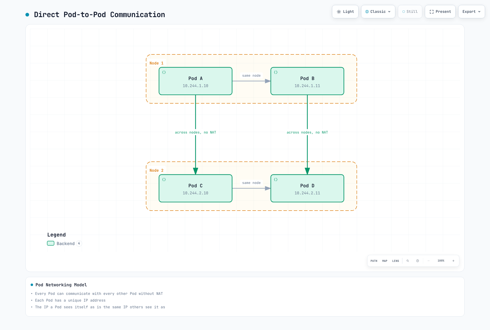
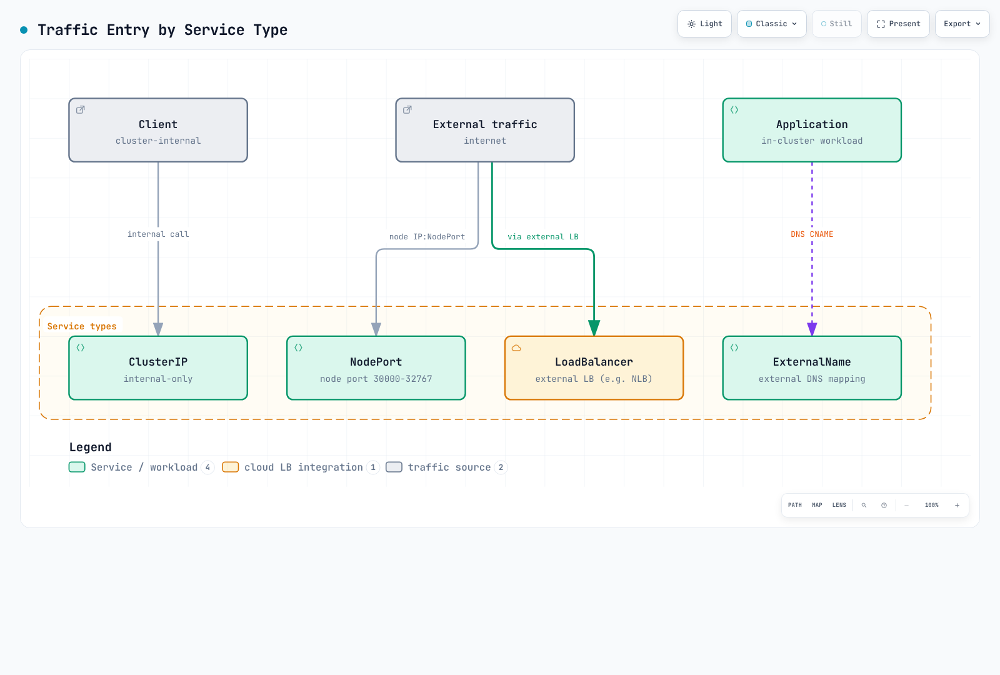

# Kubernetes 网络

> **最后更新**: September 13, 2026. 功能说明涉及 Cilium 1.20.1、Calico Open Source 3.32、Flannel 0.28.9 和 AWS VPC CNI 1.23.0。安装前请查阅各产品的 Kubernetes/平台兼容性矩阵；这些版本并非经过联合测试的集群组合。

## 概览

Kubernetes 网络是让容器化应用之间能够通信的核心基础设施层。本章涵盖从 Kubernetes 基础网络概念，到高级 CNI（Container Network Interface，容器网络接口）方案，以及 AWS EKS 环境中的网络模式。

## Kubernetes 网络模型

当前的 Kubernetes 模型提供一个 Pod 网络，其中 Pod 可以跨节点直接通信，无需地址转换或代理，但**会受到有意设置的网络分段的限制**。诸如 kubelet 之类的节点代理必须能够访问其所在节点上的 Pod。Network Policy（网络策略）、路由以及应用监听端口仍然决定某个具体连接是否能够成功建立。

普通 Pod 拥有各自的网络命名空间（network namespace）和集群范围内的地址；同一个 Pod 中的容器共享该命名空间和 localhost。使用主机网络（host network）的 Pod 共享节点网络，而双栈（dual-stack）或多网络配置需要更精确的地址处理。重建 Pod 可能会分配到不同的 IP；而重启同一个 Pod 内的容器并不一定会重建其网络沙箱（sandbox）。

| 组件 | 作用 |
|---|---|
| Pod 网络 | 工作负载网络命名空间之间的地址分配与连通性 |
| Service/服务发现 | 在不断变化的端点之上提供稳定的服务名称或虚拟地址 |
| Ingress/Gateway 实现 | 已配置的外部入口与应用路由 |
| Network Policy 引擎 | 强制执行所选实现支持的策略 |

这些角色并不构成一条强制的串行数据包路径。Service 转换、L7 代理和工作负载策略都可能改变某个具体请求穿越网络的方式。

### Pod 网络

Pod 网络为 Pod 通信提供地址和路由。下图展示的是普通的 IPv4 Pod；图中的连接假定适用的策略与网络控制允许这些通信。



[🔍 View interactive diagram](https://www.atomai.click/kubernetes-docs/archmaps/en-networking-readme-1.html)

图中地址仅为示意性的普通 Pod 地址。有意的隔离、主机网络或多网络配置需要各自单独解读。

#### Pod 网络的实现方式

| 方式 | 说明 | 示例 CNI |
|--------|-------------|-------------|
| **Overlay 网络** | 在既有网络之上对流量进行封装 | Flannel VXLAN、Calico VXLAN/IPIP、Cilium VXLAN/Geneve |
| **原生路由** | 使用底层网络中的路由，不做上述 Overlay 封装 | AWS VPC CNI、Calico 路由/BGP、Cilium 原生路由 |
| **条件性封装** | 根据已配置的拓扑，使用直连路径或封装 | Calico/Flannel/Cilium 所支持的模式，各自前置条件不同 |

### Service 网络

Service 描述一组逻辑上的端点（通常是 Pod）以及访问它们的方式。ClusterIP 默认提供一个稳定的虚拟 IP；headless Service 不提供该虚拟 IP，而 ExternalName 使用 DNS CNAME 映射。Service 也可以在没有 Pod selector 的情况下由外部管理其端点。



[🔍 View interactive diagram](https://www.atomai.click/kubernetes-docs/archmaps/en-networking-readme-2.html)

这些是典型的暴露机制，而非安全保证。NodePort 范围和可访问的节点地址都是可配置的；LoadBalancer 也可以是内部（internal）类型。ExternalName 返回一个 DNS 别名，并不会创建转发代理。

#### Service 类型特征

请在 `default` 命名空间中创建带有 `app: my-app` 标签的匹配 Pod，并监听示例中所示的目标端口。NodePort 的默认分配范围是 30000–32767，且可以配置。外部可达性仍取决于地址、路由和访问控制。

LoadBalancer 示例显式选择了 **AWS Load Balancer Controller**，使用 EC2 实例目标（instance target）和分配的 NodePort。请先安装/配置该 Controller 及其 IAM/子网前置条件。EKS Auto Mode 使用不同的 Controller/class。此处的 443 端口仅表示选择了一个 TCP 端口；TLS 必须由后端在 8443 上提供，或在负载均衡器上单独配置。

这些端口映射说明的是通用的 Kubernetes Service API。AWS 目前还记录了 EKS 原生 Network Policy 的额外要求：Service 端口必须与容器端口一致，并且由 Controller 管理、带有 `metadata.ownerReferences` 的 Pod 才能获得可靠的策略执行。在测试该策略实现之前，请按这些要求调整示例。

```yaml
apiVersion: v1
kind: Service
metadata:
  name: my-service
  namespace: default
spec:
  type: ClusterIP
  selector:
    app: my-app
  ports:
  - protocol: TCP
    port: 80
    targetPort: 8080
---
apiVersion: v1
kind: Service
metadata:
  name: my-nodeport-service
  namespace: default
spec:
  type: NodePort
  selector:
    app: my-app
  ports:
  - protocol: TCP
    port: 80
    targetPort: 8080
    nodePort: 30080
---
apiVersion: v1
kind: Service
metadata:
  name: my-loadbalancer-service
  annotations:
    service.beta.kubernetes.io/aws-load-balancer-scheme: internet-facing
    service.beta.kubernetes.io/aws-load-balancer-nlb-target-type: instance
  namespace: default
spec:
  type: LoadBalancer
  selector:
    app: my-app
  ports:
  - protocol: TCP
    port: 443
    targetPort: 8443
  loadBalancerClass: service.k8s.aws/nlb
  allocateLoadBalancerNodePorts: true
```

### Ingress 网络

Ingress 资源需要一个 Controller 及其数据平面。下面这个 HTTP 示例使用 AWS LBC，配合 `spec.ingressClassName: alb` 和 IP 目标。被引用的 `api-v1`、`api-v2` 和 `web-frontend` Service 必须存在于 `default` 命名空间中，暴露 80 端口，并具备就绪且在 VPC 内可路由的 Pod 端点。如有需要，请单独配置 HTTPS/证书。其安装和目标前置条件请参见 [LBC guide](03-aws-lb-controller.md)。

Ingress 定义将 HTTP/HTTPS 流量路由到集群内部 Service 的规则。


[🔍 View interactive diagram](https://www.atomai.click/kubernetes-docs/archmaps/en-networking-readme-3.html)

图中的方框代表 Ingress 数据平面的功能。AWS LBC 负责编排 ALB；应用流量并不会经过 Controller 的调谐（reconciliation）过程。根据目标模式的不同，数据平面可以直接访问 Pod IP 或 NodePort，而不是把 Service 虚拟 IP 当作一个真实的额外跳数。

```yaml
apiVersion: networking.k8s.io/v1
kind: Ingress
metadata:
  name: my-ingress
  annotations:
    alb.ingress.kubernetes.io/scheme: internet-facing
    alb.ingress.kubernetes.io/target-type: ip
  namespace: default
spec:
  rules:
  - host: api.example.com
    http:
      paths:
      - path: /v1
        pathType: Prefix
        backend:
          service:
            name: api-v1
            port:
              number: 80
      - path: /v2
        pathType: Prefix
        backend:
          service:
            name: api-v2
            port:
              number: 80
  - host: web.example.com
    http:
      paths:
      - path: /
        pathType: Prefix
        backend:
          service:
            name: web-frontend
            port:
              number: 80
  ingressClassName: alb
```

## CNI（Container Network Interface）

CNI 标准化了运行时配置容器网络所使用的接口。在当前的 Kubernetes 中，kubelet 通过 CRI 请求 Pod 沙箱操作，而**由容器运行时管理 CNI**。kubelet 旧有的直接管理 CNI 的相关参数已在 Kubernetes 1.24 中移除。

### 运行时与插件的职责

| 参与方 | 职责 |
|---|---|
| kubelet | 通过容器运行时接口请求创建/删除沙箱 |
| 容器运行时 | 选择网络配置并调用 CNI 插件链 |
| CNI 插件 | 接收配置，执行 ADD/DEL 及其他受支持的操作，并返回结果 |
| IPAM 实现 | 分配/释放地址；可以是委派插件，也可以是特定供应商 agent 的一部分 |
| 可选的节点 agent | 维护特定供应商的路由、策略、IP 池或数据路径状态 |

运行时通过 CNI 接口把配置传递给插件；并非每个插件都必须有一个单独的常驻 agent 或 IPAM 二进制文件。接口类型也各不相同：veth pair 很常见，但并非唯一的实现方式。

## CNI 对比

| 项目 / 范围 | 网络与策略 | 需要区分的功能与限制 |
|---|---|---|
| **Cilium 1.20.1** | eBPF 网络；相关 L7 功能使用 Envoy；Cilium 网络策略与 Hubble | Linux worker 数据平面，有 AMD64/Arm64 要求。提供 Windows CLI 并不等于支持 Windows CNI。WireGuard/IPsec 与 Beta 阶段的 ztunnel mTLS 适用范围各不相同。 |
| **Calico Open Source 3.32** | 可选择路由/封装方式；提供 iptables、nftables 和 eBPF 选项；有序的策略分层（tier）以及主机/工作负载策略 | Windows 有单独的限制，包括不支持 Linux eBPF 或 WireGuard 数据平面。Whisker/Goldmane 流量可观测性以 Tech Preview 形式提供。付费功能请查阅版本矩阵。 |
| **Flannel 0.28.9** | 主机子网分配与节点间传输；VXLAN、host-gw 及其他 backend | `flanneld` 本身不执行 NetworkPolicy；chart 中可选的 `netpol.enabled` 会部署一个 SIGs 策略 Controller。WireGuard 是有文档记录的 backend；IPsec 仍为实验性。Windows VXLAN 有特定的设置与限制。 |
| **AWS VPC CNI 1.23.0 / EKS** | VPC 地址分配与 EC2 ENI/前缀；在受支持的 Linux EC2 节点上提供 EKS standard 与 Admin 网络策略能力 | EKS Auto Mode 是一种托管网络实现，额外具备 DNS 策略能力。Windows、Fargate、自定义网络（custom networking）、前缀委派（prefix delegation）和多网卡支持各有不同的前提条件。 |
| **原始 Weave Net 项目** | 历史上的 Overlay 网络实现 | 原始的 `weaveworks/weave` 仓库已归档。请勿把它描述为新建集群的活跃、受支持的默认选项。 |

### 策略、加密与可观测性

- Cilium 通过适用的 L7 组件提供 HTTP/DNS 感知策略，以及集群范围/主机策略。其 deny/allow 语义并不等同于 Calico 的有序 Tier API。
- Calico Open Source 包含分层策略 tier 和主机策略。当前的产品矩阵把应用层策略、DNS/FQDN 策略和 Cluster Mesh 划归 Cloud/Enterprise 版本；不得默默把这些能力归到开源版本上。Calico 有文档记录的传输中加密使用 WireGuard。
- Amazon EKS 为 Auto Mode 以及受支持的 EC2/VPC-CNI 安装提供 `ClusterNetworkPolicy` 的 Admin/Baseline 控制。AWS 所描述的 DNS/FQDN `ApplicationNetworkPolicy` 功能面向 **Auto Mode**。其名称并不意味着当前支持 HTTP 方法/正文级别的检查。
- Flannel 的可选策略 Controller 有其自身要求；仅选择某个网络 backend 并不会启用策略执行。
- 节点间加密、经过认证的工作负载身份和应用层 mTLS 是不同的控制手段。网络流量可见性也不同于应用层追踪或进程/文件级别的强制控制。

### 路由与性能

Calico 和 Cilium 可以使用 BGP 通告路由；但这本身并不提供多集群服务发现、策略同步或加密。Flannel host-gw 使用直连路由，要求具备合适的二层连通性。Overlay 会带来封装开销和 MTU 方面的考量，但不能仅凭 CNI 名称推断出一个普适的性能排名。

此前的 100/98/95/85/80/75 百分比吞吐量数字缺乏可复现的工作负载、版本和测量来源。请在可比较的硬件、内核、包/请求大小、并发度、加密/策略设置下，测量吞吐量、丢包率和尾部延迟。单独的 [Pod benchmark](06-pod-network-benchmark.md) 保留其自身的历史环境与测量数据。

## CNI 选型指南

先确定所需的路由、策略、操作系统和支持模式，然后再测试该组合。

| 需求 | 评估路径 |
|---|---|
| 标准的 EKS VPC 地址分配与受支持的 Network Policy | 在引入第二个策略引擎之前，先评估 AWS VPC CNI/EKS 的能力。 |
| 有序的策略 tier、主机策略或基础设施 BGP | 评估相应的 Calico 版本/数据平面以及路由前置条件。 |
| Cilium 策略、Hubble 或选定的 mesh 功能 | 检查 Linux/内核/平台兼容性，并参见 [Cilium mesh guide](../service-mesh/cilium-service-mesh/README.md)。Envoy 仍然是适用 L7 路径的一部分。 |
| 功能集有限的小型网络 | 对照实际需求评估 Flannel 的 backend 和可选策略 Controller。 |
| 进程、syscall 或文件级别的强制控制 | 单独评估诸如 Tetragon 之类的运行时安全组件，而不是把它与 Network Policy 混为一谈。 |

### EKS 托管附加组件配置

以下是一个**配置负载（payload）**示例，并不是要你在同一批工作负载上同时安装 Calico 和 VPC CNI 策略引擎：

```json
{
  "enableNetworkPolicy": "true"
}
```

字符串 `"true"` 是该设置有文档记录的类型。请为现有 Kubernetes 版本选择兼容的 EKS 附加组件构建版本，并检查该构建版本的配置 schema：

```bash
EKS_REGION=ap-northeast-2
KUBERNETES_MINOR=1.35  # Replace with the existing cluster's minor version
aws eks describe-addon-versions --region "$EKS_REGION" --addon-name vpc-cni \
  --kubernetes-version "$KUBERNETES_MINOR"
: "${VPC_CNI_ADDON_VERSION:?Set the compatible eksbuild version selected from metadata}"
aws eks describe-addon-configuration --region "$EKS_REGION" --addon-name vpc-cni \
  --addon-version "$VPC_CNI_ADDON_VERSION"
```

上游的 1.23.0 版本号与 EKS 的 `eksbuild` 版本是不同的标识符。请把变更合并进预期的托管附加组件配置中；不要盲目选择 `latest`，也不要替换无关的取值。从第三方策略实现迁移过来时，还需要清除其既有的策略执行状态，并制定经过测试的节点/工作负载迁移方案。

## EKS 网络基础

### EKS 默认网络架构

| 位置 / 组件 | 职责 |
|---|---|
| EKS 托管 VPC | AWS 跨可用区运行托管的 Kubernetes 控制平面。 |
| 客户集群 VPC | Worker 网络、所选子网以及 EKS 托管的跨账户 ENI 提供通往控制平面的既定路径。 |
| 位于所选客户 VPC 子网中的 ALB/NLB | 提供所选的公网或内部应用入口；互联网网关/NAT 网关并不能替代该路由配置。 |
| NAT 网关或私有服务端点 | 提供工作负载设计所需的特定出站路径。 |

此前的图把控制平面画在客户 VPC 内部、把负载均衡器画在外部；现已替换为上述归属边界的描述。

### 按计算模式区分的 DNS 与网络

| 计算模式 | DNS / 组件位置 |
|---|---|
| 标准 EC2 节点 | 通常使用已配置的 CoreDNS Deployment 和已安装的网络组件；替换方案需要各自受支持的配置。 |
| 纯 EKS Auto Mode | CoreDNS、VPC CNI 和 kube-proxy 的功能以托管的节点 systemd 服务方式运行。这些节点不需要 CoreDNS Deployment/附加组件。 |
| Auto Mode 与非 Auto 节点混用 | 为非 Auto 节点保留 CoreDNS Deployment；它们无法使用其他节点的 Auto Mode DNS 服务。 |

Auto Mode 的首个 DNS 解析器位于节点本地。上游转发和控制平面通信仍可能需要网络访问；这并不保证所有与 DNS 相关的数据包都留在节点内。AWS 为 Auto Mode 同时记录了 Admin 和 DNS 策略，而标准 EC2 VPC-CNI 的 Admin 策略有其自身的版本和启用要求。

### VPC CNI 的工作原理

AWS VPC CNI 使用所选的 IPAM 模式，为普通 Pod 分配在 VPC 内可路由的地址。二级 IPv4 地址、委派前缀、branch ENI 和多网卡配置各不相同；使用主机网络的 Pod 共享节点网络。


[🔍 View interactive diagram](https://www.atomai.click/kubernetes-docs/archmaps/en-networking-readme-9.html)

此图仅描述二级 IP 模式。warm ENI 是一种可配置的分配策略，并不要求每个节点始终恰好预留一个。前缀委派、自定义网络和 branch ENI 有不同的分配规则。

#### ENI 与 IP 限制

| 实例类型 | 最大 ENI 数 | 每个 ENI 的 IPv4 槽位数 | 旧版二级 IP 引导值 |
|---------------|----------|--------------|------------------------|
| t3.medium | 3 | 6 | 17 |
| t3.large | 3 | 12 | 35 |
| m5.large | 3 | 10 | 29 |
| m5.xlarge | 4 | 15 | 58 |
| m5.2xlarge | 4 | 15 | 58 |
| c5.4xlarge | 8 | 30 | 234 |

这些数值已对照 VPC CNI 1.23.0 的实例限制表和旧版 max-Pods 表核对。历史计算公式为 `ENIs × (IPv4 slots per ENI − 1) + 2`；它并不是当前的通用建议。前缀委派、自定义网络、branch ENI 和多网络卡都会改变地址容量。Kubernetes 的调度还受 kubelet `maxPods` 和资源限制约束。EKS 托管节点组对 vCPU 少于 30 的实例把 `maxPods` 限制为 110，其他情况为 250；仅有可用 IP 数量并不能突破该上限。

### EKS 网络注意事项

#### IP 地址管理

对于 **Linux VPC CNI**，请通过所选的附加组件/Helm/DaemonSet 管理机制配置有文档记录的环境变量。下面是一段 EKS 附加组件配置片段。旧的带 `enable-prefix-delegation` 的 `amazon-vpc-cni` ConfigMap 并不是通过这种方式配置 Linux IPAMD 的。应用变更时，请保留其他有意设置的附加组件取值。

```json
{
  "env": {
    "ENABLE_PREFIX_DELEGATION": "true",
    "WARM_PREFIX_TARGET": "1"
  }
}
```

此外，也可以调整总的分配下限和空闲 IP 目标值。当配置了 `MINIMUM_IP_TARGET` 或 `WARM_IP_TARGET` 中的任意一个时，它会优先于 `WARM_PREFIX_TARGET`；这些是相互替代的策略，而不是四个各自独立叠加的目标值。分配仍以前缀为单位进行。Nitro 支持、用于 IPv4 的连续 `/28` 地址空间以及合适的 kubelet Pod 上限是彼此独立的前置条件。

Windows 的前缀分配是另一条配置路径：AWS 记录的是 `amazon-vpc-cni` ConfigMap 中的 `enable-windows-prefix-delegation` 及其 warm-target 键。请勿把 Linux 的环境变量流程原封不动地照搬到 Windows。

```json
{
  "env": {
    "ENABLE_PREFIX_DELEGATION": "true",
    "MINIMUM_IP_TARGET": "5",
    "WARM_IP_TARGET": "2"
  }
}
```

#### 自定义网络

这些 IPv4 示例需要目标可用区和 VPC 中真实的子网/安全组 ID。请启用自定义网络，并通过节点的可用区标签为每个节点选择 ENIConfig。显式的 ENIConfig 节点注解优先于该标签。下面示例中的名称在两种语言版本中使用相同的区域；请替换为实际的节点可用区。仅创建 ENIConfig 对象并不会激活自定义网络。

```json
{
  "env": {
    "AWS_VPC_K8S_CNI_CUSTOM_NETWORK_CFG": "true",
    "ENI_CONFIG_LABEL_DEF": "topology.kubernetes.io/zone"
  }
}
```

```yaml
apiVersion: crd.k8s.amazonaws.com/v1alpha1
kind: ENIConfig
metadata:
  name: ap-northeast-2a
spec:
  securityGroups:
  - sg-0123456789abcdef0
  subnet: subnet-0123456789abcdef0
---
apiVersion: crd.k8s.amazonaws.com/v1alpha1
kind: ENIConfig
metadata:
  name: ap-northeast-2b
spec:
  securityGroups:
  - sg-0123456789abcdef0
  subnet: subnet-fedcba9876543210f
```

## 高级网络概念

下面这些内容在本概览的其他部分只是被顺带提及。完整的配置步骤和实测数据放在相应的深入页面中；本节的作用是梳理这些要素在不同层次上的差异，以及各自的适用位置。

### L2–L7 以及路由器与负载均衡器的区别

“路由器”和“负载均衡器”常常出现在同一句话里，但它们回答的是不同的问题。路由器为单一目的地（通常）选择一条路径；负载均衡器则使用某种分发算法，从若干等价候选中选出一个目标。

| 层次 | 设备/功能 | 决策依据 | Kubernetes/AWS 对应 |
|---|---|---|---|
| L2（链路层） | 交换机、网桥 | 目的 MAC 地址 | CNI 创建的 veth pair 和 Linux 网桥，ENI 暴露的虚拟网卡 |
| L3（网络层） | 路由器或透明设备插入 | 路由使用目的 IP；设备选择使用流标识 | VPC 的隐式路由器、TGW；GWLB 为设备封装 IP 数据包 |
| L4（传输层） | L4 负载均衡器 | 连接/流标识，通常是五元组 | NLB；kube-proxy（iptables、IPVS、nftables）；独立的 eBPF Service 实现 |
| L7（应用层） | L7 负载均衡器/反向代理 | 每个请求的 host、path、header；协议感知 | ALB、Ingress/Gateway API 实现、Service Mesh sidecar（Envoy） |

关键区别在于**分发单位**。L4 负载均衡器通常为一条 TCP 连接或被跟踪的 UDP 流选择目标。L7 代理可以为每个受支持的应用请求选择目标，包括共享同一连接的多个请求。GWLB 把封装后的 IP 流分发到多个安全设备上，而不解析应用层请求。流粘性取决于所配置的超时、健康检查和故障切换行为；它并不保证某条流永远不会被重新分配或中断。

> 📎 L2/L3 概念的协议级定义见 [Network Fundamentals Part 1](../basics/06-network-fundamentals-part1.md)；ALB/NLB 目标类型和实际配置见 [AWS Load Balancer Controller](03-aws-lb-controller.md)。

### 跨账户/VPC 连接：TGW、VPC Peering、GWLB、PrivateLink、Lattice

这五种连接方案在层次和流量模型上各不相同。TGW RAM 共享、VPC Peering、PrivateLink、TGW Peering 和 VPC Lattice 的实测延迟见 [Cross-Org VPC Connectivity](05-cross-org-vpc-connectivity.md)。本节补充了该对比表中没有的 GWLB，并按层次重新梳理这五种方案。

| 连接方式 | 层次/模型 | 特征 |
|---|---|---|
| VPC Peering | L3，双向 IP 路由 | 不具备传递性；无法在 CIDR 重叠的情况下配置 |
| Transit Gateway (TGW) | L3，中心辐射式 IP 路由 | 在一个或多个 TGW 路由表中使用 attachment 关联与路由传播；通过 RAM 实现跨账户共享 |
| Gateway Load Balancer (GWLB) | L3，透明设备插入 | 将原始数据包封装在 GENEVE（UDP 6081）中；采用 VPC 端点服务模型，把消费者流量接入提供方的设备集群 |
| PrivateLink | 私有端点连接 | 由 NLB 支撑的端点服务是其中一种模型；此外还有资源端点。消费者/提供方的 CIDR 可以重叠 |
| VPC Lattice | 应用与资源网络 | HTTP/HTTPS 服务支持 L7 路由和可选的 IAM 授权；TLS passthrough 和资源配置的能力各不相同 |

GWLB 通过 Gateway Load Balancer 端点，把防火墙、IDS/IPS 之类的检测设备插入到 IP 路径中。其默认流粘性使用五个字段；受支持的配置也可以改用两个或三个字段。请验证正向与回程路由、设备健康状况、封装 MTU、NACL，以及实际工作负载/设备的安全组。GWLB 本身没有 ALB 那样的安全组，而流粘性也不能替代故障测试。

> 📎 完整的 EKS/VPC Lattice 集成（Gateway API Controller、IAM 授权、路由）见 [VPC Lattice](02-vpc-lattice.md)。

### DNS 解析器与路由表的实际行为

**DNS 解析器：** AmazonProvidedDNS **就是 Route 53 Resolver**。它的地址包括 VPC 主 IPv4 网络地址加二（对 `10.0.0.0/16` 而言是 `10.0.0.2`）以及 `169.254.169.253`；它按照 Resolver 规则解析关联的私有区域和公共名称。CoreDNS 通常服务于所配置的 Kubernetes 集群域名，常见为 `cluster.local`；`kube-dns` 是它的 Service 名称，既不是命名空间也不是 DNS 区域。外部转发遵循 Corefile 以及 DNS Pod 可见的 resolver 文件。请检查这些设置，而不要假定节点的 resolver 文件被原样使用。在 Resolver 端点设计中，inbound 端点接收来自本地数据中心的查询，而 outbound 端点和关联规则把选定的 VPC 查询转发到本地 DNS。Auto Mode 的节点本地解析器并不能消除对上游的依赖。

**路由表：** VPC 路由评估通常采用最长前缀匹配。AWS 允许替换 `local` 路由的目标，并为设备路由添加受支持的更具体的子网路由；`local` 并非无条件地就是最具体的路由。对于相同的目的地，静态 VPC 路由优先于从虚拟私有网关传播而来的路由。指向 TGW 的 VPC 路由是静态路由；TGW 内部的路由传播属于它自己单独的路由表。无效的目标会留下 `blackhole` 条目并丢弃流量，因此除目的地之外还要检查路由状态。没有显式关联路由表的子网使用 VPC 的主路由表。

> 📎 TGW/Peering 的路由优先级以及静态路由配置示例见 [Cross-Org VPC Connectivity's operational findings](05-cross-org-vpc-connectivity.md#operational-findings)。

### 内核数据平面：iptables、IPVS、eBPF 与包过滤

Linux 上的 Service 转发和 Network Policy 执行可以采用不同机制。Netfilter 提供数据包路径上的 hook，供 iptables 和 nftables 使用。eBPF 实现可以挂载到 XDP、tc 或 socket hook，并在这些位置完成 Service 选择。这并不意味着在启用了 eBPF 的集群中，每个数据包都会绕过 Netfilter 或连接跟踪；实际路径取决于 CNI、内核、路由和功能配置。

| 实现 | 所处位置 | 特征 |
|---|---|---|
| iptables | netfilter hook 上的顺序规则链 | 评估时间随规则数量增长（O(n)）；kube-proxy 长期以来的默认模式 |
| IPVS | 内核原生的 L4 负载均衡器，netfilter 的扩展 | 基于哈希的查找（接近 O(1)）；作为 kube-proxy 模式自 Kubernetes 1.35 起被弃用 |
| nftables | netfilter 中 iptables 的后继框架 | 自 1.33 起成为 kube-proxy 的稳定模式；请先检查内核/CNI 兼容性 |
| eBPF（例如 Cilium） | 已配置的 XDP、tc 和 socket hook | 可以取代 kube-proxy 的 Service 处理；它是一种独立实现，Netfilter/conntrack 行为因路径而异 |

切换实现可能会遗留内核规则和活跃连接。请遵循发行版/CNI 的迁移流程，按要求排空（drain）工作负载，并在清理需要时规划节点重启。用基于 eBPF 的 CNI 替换 kube-proxy 时，还需要一个受支持的切换顺序，以免两种实现争抢同一份 Service 流量。

> 📎 IPVS 的弃用时间线和 nftables 转为稳定的过程见 [Introduction to Kubernetes](../basics/04-kubernetes-introduction.md)；Cilium 的 eBPF kube-proxy 替换见 [Cilium eBPF](cilium/02-ebpf.md)；Calico 的 eBPF 数据平面及其迁移流程见 [Calico eBPF](calico/06-ebpf-dataplane.md)。

### 计算密集型网络：ENI、EFA、NVLink 与光模块

ENI、EFA 和 NVLink 服务于不同的路径。**ENI** 是附加到某个可用区内 EC2 实例上的虚拟网络接口；在路由和策略允许的情况下，其常规 IP 流量可以到达其他可用区和相连的 VPC（参见 [VPC CNI](01-vpc-cni.md)）。**EFA** 提供一个绕过操作系统（OS-bypass）的设备，由兼容的 MPI/NCCL 软件通过 libfabric 使用。**EFA 设备流量不可路由，无法跨越 VPC/可用区边界**；而通过“EFA with ENA”接口的 ENA 设备传输的常规 IP 流量仍然可路由。仅有 EFA 的接口没有 ENA 设备，也没有 IP 地址。**NVLink** 在受支持的系统内部连接多个 GPU，包括受支持的机架级 NVLink 域。请对所选硬件、集合通信操作和放置方式进行实测，而不要假定相对 EFA 有固定的加速比。

**光模块（optical transceiver）** 是通用的数据中心网络概念。铜缆 DAC（Direct Attach Copper）适用于短距离连接；光模块和光纤则满足其他传输距离和带宽需求。QSFP 和 OSFP 描述的是模块外形规格，并不保证使用光介质。请把这部分视为通用背景知识：它并不能确定某个具体 AWS 工作负载的物理布线方式。

> 📎 NVLink/IMEX 拓扑感知调度和 GPU Pod 放置示例见 [AI/ML Infrastructure](../ai-ml/06-ai-infrastructure.md)；EFA 的 VPC/可用区边界限制和实测数据见 [Cross-Org VPC Connectivity](05-cross-org-vpc-connectivity.md)。

### 下一代协议对 Kubernetes 的意义：HTTP/3、gRPC、QUIC

HTTP/3（RFC 9114）及其 QUIC 传输（RFC 9000）的协议机制见 [Network Fundamentals Part 2](../basics/06-network-fundamentals-part2.md) 和 [Part 3](../basics/06-network-fundamentals-part3.md)。这里只讨论真正影响 Kubernetes 流量分发的部分。

- **gRPC 与 L4 负载均衡器：** gRPC 在 HTTP/2 连接上复用多个请求。L4 负载均衡器通常会把已建立的 TCP 连接保持在它所选择的端点上；如果该端点是一个代理，它可以做进一步的路由决策。仅仅增加 Pod 并不会重新分配已有连接。要实现按 RPC 分发，需要兼容的 L7 代理或客户端侧策略。流式 RPC 始终是一次调用；其中的单条消息不会被独立地负载均衡。
- **Gateway API 的 GRPCRoute：** Ingress 没有 gRPC 专用资源，而 Gateway API 通过 `GRPCRoute` 标准化了服务/方法级别的路由。各实现的支持程度不同（支持多少个 header 匹配、重试策略等），因此请查阅相应 Controller 自己的文档。
- **HTTP/3/QUIC 实际能延伸到集群内多深：** 客户端与边缘（CDN、负载均衡器）之间是否支持 HTTP/3，与集群内部或 Ingress 到后端连接是否支持 HTTP/3，是两个不同的问题。许多 Ingress/Gateway 实现与后端之间仍使用 HTTP/1.1 或 HTTP/2，而是否支持端到端 HTTP/3 也因实现和版本而异——不要一概而论，请查阅实际使用的 Controller 的文档。

## 网络子页面

本章将详细介绍以下主题：

### [VPC CNI](01-vpc-cni.md)
为普通 Pod 使用 VPC 地址的 EKS 网络，以及各模式特有的 IPAM/策略前置条件。

### [Cilium Deep Dive](cilium/README.md)
高性能的基于 eBPF 的 CNI 方案。提供 L7 Network Policy、Service Mesh 和可观测性（Hubble）等高级功能。

### [Calico Deep Dive](calico/README.md)
使用最广泛的 CNI 之一。具备强大的 Network Policy、BGP 支持和企业级功能。内容涵盖入门介绍、架构、网络模式、BGP 深入剖析、Network Policy、eBPF、高级主题、EKS 集成和运维指南。

### [VPC Lattice](02-vpc-lattice.md)
AWS 托管的应用网络服务。支持跨 VPC、跨账户的服务间通信。

### [AWS Load Balancer Controller](03-aws-lb-controller.md)
将 Kubernetes Service 和 Ingress 与 AWS ELB（ALB/NLB）集成。

### [Gateway API](04-gateway-api.md)
下一代 Kubernetes 入口 API。标准化的资源模型与基于角色的配置。

### [Pod Network Benchmark](06-pod-network-benchmark.md)
在 EKS 上针对同节点、同可用区和跨可用区实测的 Pod 间 RTT、HTTP 延迟与吞吐量，以及 DNS `ndots:5` 查询放大效应。

## 网络故障排除

### 常见问题与解决方案

#### Pod 间通信失败

```bash
NAMESPACE=default
POD_NAME=iperf-client  # An existing diagnostic Pod with nslookup/curl
SERVICE_NAME=my-service
kubectl -n "$NAMESPACE" get pods -o wide
kubectl -n "$NAMESPACE" exec "$POD_NAME" -- nslookup "$SERVICE_NAME"
kubectl -n "$NAMESPACE" exec "$POD_NAME" -- \
  curl --connect-timeout 3 --max-time 5 -v "http://$SERVICE_NAME:80/"
kubectl -n kube-system logs -l k8s-app=aws-node -c aws-node --tail=100
kubectl -n kube-system logs -l k8s-app=cilium -c cilium-agent --tail=100
```

请从一个已安装上述工具的现有 Pod 中执行诊断。只查询集群中实际安装的 CNI；Auto Mode 的系统服务并不是这些 DaemonSet。DNS 解析成功、TCP 可达性和应用的 HTTP 响应是三项不同的检查。ICMP 可能被阻止或需要额外权限，因此仅凭 ping 失败并不能证明某个 TCP 服务不可达。

#### Service 无法访问

```bash
NAMESPACE=default
SERVICE_NAME=my-service
kubectl -n "$NAMESPACE" get service "$SERVICE_NAME" -o yaml
kubectl -n "$NAMESPACE" get endpointslices \
  -l "kubernetes.io/service-name=$SERVICE_NAME" -o yaml
kubectl -n kube-system logs -l k8s-app=kube-proxy --tail=100
```

请使用 EndpointSlice 来诊断当前的端点状态。检查 Service selector、目标端口、端点就绪状态、地址族以及适用的策略。只有当 kube-proxy 确实负责 Service 转发时才需要检查它的日志；使用 eBPF 替换方案或 Auto Mode 时需要各自的诊断方式。

#### Network Policy 调试

```bash
kubectl get networkpolicies.networking.k8s.io -A
kubectl -n kube-system exec ds/cilium -c cilium-agent -- cilium-dbg policy get
kubectl -n kube-system exec ds/cilium -c cilium-agent -- cilium-dbg endpoint list
# For a Calico installation using its standard CRD datastore:
kubectl get networkpolicies.crd.projectcalico.org -A
kubectl get globalnetworkpolicies.crd.projectcalico.org
```

上述 Cilium 命令检查的是通过 DaemonSet 引用选中的某一个 Agent；排查故障时请选择受影响节点上的 Agent。使用 Calico 原生 API 的安装可能暴露不同的 API group，因此请检查该安装实际提供的资源。Kubernetes、Calico 和 AWS 扩展策略是彼此不同的资源，优先级也可能不同。

### 网络性能测试

这个受限的 TCP 练习使用发布方固定的 Netshoot v0.16 镜像索引，其中包含 Linux AMD64 和 Arm64 镜像；其 Dockerfile 内含 `iperf3`。请在允许 TCP 5201 的测试环境中创建这些 Pod。它只是示意性的工作负载，不构成经过测量的 CNI 对比。

```yaml
apiVersion: v1
kind: Pod
metadata:
  name: iperf-server
  namespace: default
  labels:
    app: iperf-server
spec:
  restartPolicy: Never
  automountServiceAccountToken: false
  nodeSelector:
    kubernetes.io/os: linux
  containers:
  - name: netshoot
    image: nicolaka/netshoot:v0.16@sha256:b09d9b21381f47a79b3cbcb30da25266dc17186ea00ae65e99fdc51396f48e70
    command:
    - iperf3
    - -s
    workingDir: /tmp
    resources:
      requests:
        cpu: 100m
        memory: 64Mi
      limits:
        cpu: 500m
        memory: 256Mi
    securityContext:
      runAsNonRoot: true
      runAsUser: 1000
      allowPrivilegeEscalation: false
      capabilities:
        drop:
        - ALL
      seccompProfile:
        type: RuntimeDefault
    ports:
    - containerPort: 5201
      protocol: TCP
---
apiVersion: v1
kind: Pod
metadata:
  name: iperf-client
  namespace: default
  labels:
    app: iperf-client
spec:
  restartPolicy: Never
  automountServiceAccountToken: false
  nodeSelector:
    kubernetes.io/os: linux
  containers:
  - name: netshoot
    image: nicolaka/netshoot:v0.16@sha256:b09d9b21381f47a79b3cbcb30da25266dc17186ea00ae65e99fdc51396f48e70
    command:
    - sleep
    - '3600'
    workingDir: /tmp
    resources:
      requests:
        cpu: 100m
        memory: 64Mi
      limits:
        cpu: 500m
        memory: 256Mi
    securityContext:
      runAsNonRoot: true
      runAsUser: 1000
      allowPrivilegeEscalation: false
      capabilities:
        drop:
        - ALL
      seccompProfile:
        type: RuntimeDefault
```

```bash
kubectl -n default wait --for=condition=Ready pod/iperf-server pod/iperf-client --timeout=120s
IPERF_SERVER_IP="$(kubectl -n default get pod iperf-server -o jsonpath='{.status.podIP}')"
test -n "$IPERF_SERVER_IP"
kubectl -n default exec iperf-client -- iperf3 -c "$IPERF_SERVER_IP" -t 10 -b 10M
```

客户端会休眠一小时，而上述命令把发送流量限制为 10 Mbit/s、持续十秒。这测试的是所选路径，而不是最大吞吐量。在解读结果之前，请记录实际的 Pod/节点/可用区放置情况、资源限制和策略。对于 Windows 节点，请选择 Windows 专用工具。测试结束后，只删除你自己创建的测试资源。

这些独立的诊断 Pod 用于连通性测试。若要测试 EKS 原生 Network Policy 的执行效果，请使用由 Deployment/Job 管理的 Pod，并遵循有文档记录的 Service/容器端口要求。

## 最佳实践

### 1. IP 地址规划

- 设计足够大的 CIDR 块
- 将 Pod 网络与 Service 网络分开
- 设计子网时考虑未来的扩展需求

### 2. 应用 Network Policy

使用此示例前，请先创建隔离的 `networking-demo` 命名空间。它按标准 Kubernetes NetworkPolicy 语义选中该命名空间中的所有 Pod，并同时隔离入站和出站流量；必需的 DNS 和应用流量需要显式的放行规则。策略执行需要有支持该功能的策略引擎。额外的集群/管理级策略 API 可能改变优先级，而这一份 manifest 也不构成完整的零信任架构。

- 应用默认拒绝策略（Zero Trust）
- 只显式放行必需的流量
- 隔离命名空间

```yaml
apiVersion: networking.k8s.io/v1
kind: NetworkPolicy
metadata:
  name: default-deny-all
  namespace: networking-demo
spec:
  podSelector: {}
  policyTypes:
  - Ingress
  - Egress
```

### 3. 性能优化

- 选择合适的 CNI（与工作负载匹配）
- MTU 优化
- 内核参数调优

### 4. 安全加固

- 选择受支持的传输加密方式，并确认它覆盖哪些流量。
- 在需要时配置工作负载/应用身份和 mTLS；把这些与基于 DNS/IP 的白名单区分开来。
- 定期审查策略、证书和访问控制的变更。

### 5. 确保可观测性

- 采集网络指标
- 启用流日志（flow log）
- 实施分布式追踪

## 后续步骤

1. [VPC CNI](01-vpc-cni.md) - EKS 默认 CNI
2. [Cilium Deep Dive](cilium/README.md) - 基于 eBPF 的网络
3. [Calico Deep Dive](calico/README.md) - 路由、策略与数据平面
4. [VPC Lattice](02-vpc-lattice.md) - AWS 托管网络
5. [AWS Load Balancer Controller](03-aws-lb-controller.md) - ELB 集成
6. [Gateway API](04-gateway-api.md) - 下一代入口
7. [Cross-Org VPC Connectivity](05-cross-org-vpc-connectivity.md) - 跨 AWS Organizations 连接 VPC（现场验证）
8. [Pod Network Benchmark](06-pod-network-benchmark.md) - 按节点/可用区边界实测的延迟与吞吐量

---

## 参考资料

- [Kubernetes network model](https://kubernetes.io/docs/concepts/services-networking/)
- [Kubernetes Services](https://kubernetes.io/docs/concepts/services-networking/service/)
- [Container runtime and CNI](https://kubernetes.io/docs/concepts/extend-kubernetes/compute-storage-net/network-plugins/)
- [Kubernetes NetworkPolicy](https://kubernetes.io/docs/concepts/services-networking/network-policies/)
- [CNI specification](https://raw.githubusercontent.com/containernetworking/cni/main/SPEC.md)
- [Calico product editions](https://docs.tigera.io/calico/latest/about)
- [Calico policy tiers](https://docs.tigera.io/calico/latest/network-policy/policy-tiers/tiered-policy)
- [Calico Whisker flow logs](https://docs.tigera.io/calico/latest/observability/view-flow-logs)
- [Calico Windows limitations](https://docs.tigera.io/calico/latest/getting-started/kubernetes/windows-calico/limitations)
- [Flannel 0.28.9 networking and policy](https://raw.githubusercontent.com/flannel-io/flannel/v0.28.9/README.md)
- [Flannel backends](https://raw.githubusercontent.com/flannel-io/flannel/v0.28.9/Documentation/backends.md)
- [Original Weave repository status](https://api.github.com/repos/weaveworks/weave)
- [AWS VPC CNI 1.23.0](https://raw.githubusercontent.com/aws/amazon-vpc-cni-k8s/v1.23.0/README.md)
- [EKS network policy configuration](https://docs.aws.amazon.com/eks/latest/userguide/cni-network-policy-configure.html)
- [EKS standard and Admin network policies](https://docs.aws.amazon.com/eks/latest/userguide/cni-network-policy.html)
- [EKS prefix delegation and maxPods](https://docs.aws.amazon.com/eks/latest/userguide/cni-increase-ip-addresses-procedure.html)
- [EKS Admin and DNS policy deployment models](https://aws.amazon.com/blogs/containers/enhance-amazon-eks-network-security-posture-with-dns-and-admin-network-policies/)
- [EKS Auto Mode networking](https://docs.aws.amazon.com/eks/latest/userguide/auto-networking.html)
- [EKS add-on requirements](https://docs.aws.amazon.com/eks/latest/userguide/workloads-add-ons-available-eks.html)
- [EKS control plane architecture](https://docs.aws.amazon.com/eks/latest/best-practices/control-plane.html)
- [Netshoot v0.16 image metadata](https://hub.docker.com/v2/repositories/nicolaka/netshoot/tags/v0.16)
- [Netshoot v0.16 Dockerfile](https://raw.githubusercontent.com/nicolaka/netshoot/v0.16/Dockerfile)
- [Tetragon runtime security](https://tetragon.io/docs/overview/)
- [AWS LBC 3.5 NLB configuration](https://github.com/kubernetes-sigs/aws-load-balancer-controller/blob/v3.5.0/docs/guide/service/nlb.md)
- [AWS LBC 3.5 Ingress configuration](https://github.com/kubernetes-sigs/aws-load-balancer-controller/blob/v3.5.0/docs/guide/ingress/annotations.md)
- [Gateway Load Balancer concepts](https://docs.aws.amazon.com/vpc/latest/privatelink/gateway-load-balancers.html)
- [GENEVE encapsulation (RFC 8926)](https://www.rfc-editor.org/rfc/rfc8926)
- [VPC DNS resolver](https://docs.aws.amazon.com/vpc/latest/userguide/vpc-dns.html)
- [Route 53 Resolver endpoints and rules](https://docs.aws.amazon.com/Route53/latest/DeveloperGuide/resolver.html)
- [VPC route table evaluation order](https://docs.aws.amazon.com/vpc/latest/userguide/VPC_Route_Tables.html)
- [Local routes and more-specific subnet routes](https://docs.aws.amazon.com/vpc/latest/userguide/subnet-route-tables.html)
- [Static and propagated route priority](https://docs.aws.amazon.com/vpc/latest/userguide/route-tables-priority.html)
- [AmazonProvidedDNS addresses and behavior](https://docs.aws.amazon.com/vpc/latest/userguide/AmazonDNS-concepts.html)
- [GWLB flow stickiness and failover](https://docs.aws.amazon.com/elasticloadbalancing/latest/gateway/edit-target-group-attributes.html)
- [Kubernetes Service virtual IPs and kube-proxy modes](https://kubernetes.io/docs/reference/networking/virtual-ips/)
- [CoreDNS Service names and forwarding configuration](https://kubernetes.io/docs/tasks/administer-cluster/dns-custom-nameservers/)
- [PrivateLink resource endpoints](https://docs.aws.amazon.com/vpc/latest/privatelink/privatelink-access-resources.html)
- [Netfilter/iptables project documentation](https://www.netfilter.org/documentation/index.html)
- [EC2 Elastic Fabric Adapter](https://docs.aws.amazon.com/AWSEC2/latest/UserGuide/efa.html)
- [QUIC transport protocol (RFC 9000)](https://www.rfc-editor.org/rfc/rfc9000)
- [HTTP/3 (RFC 9114)](https://www.rfc-editor.org/rfc/rfc9114)
- [gRPC over HTTP/2 and load balancing](https://grpc.io/blog/grpc-load-balancing/)
- [Gateway API GRPCRoute](https://gateway-api.sigs.k8s.io/guides/user-guides/grpc-routing/)
