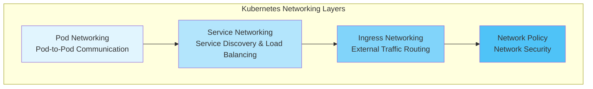
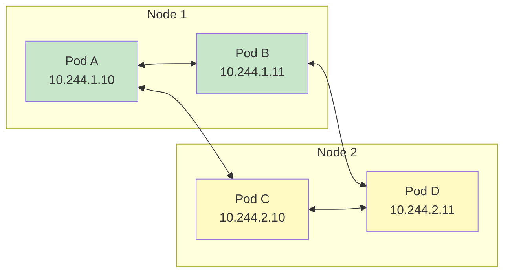
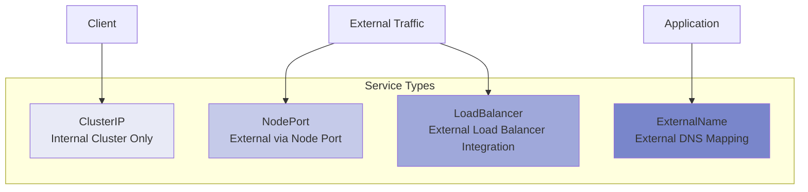
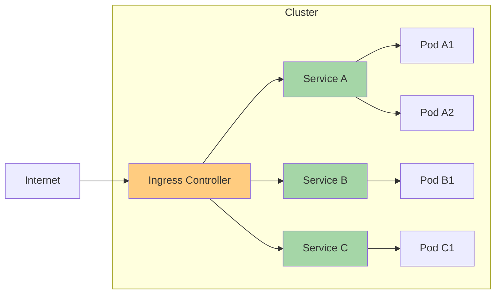
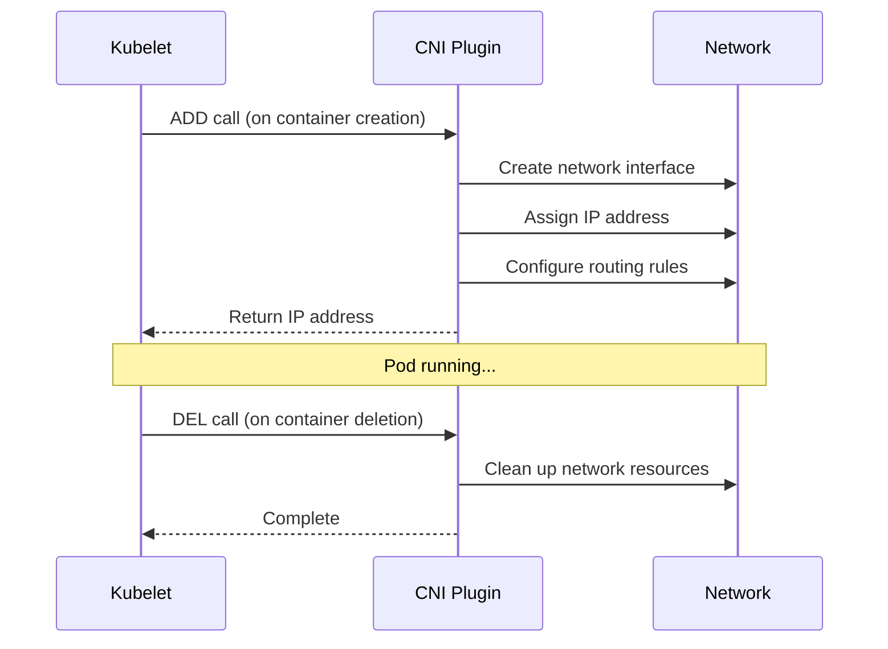
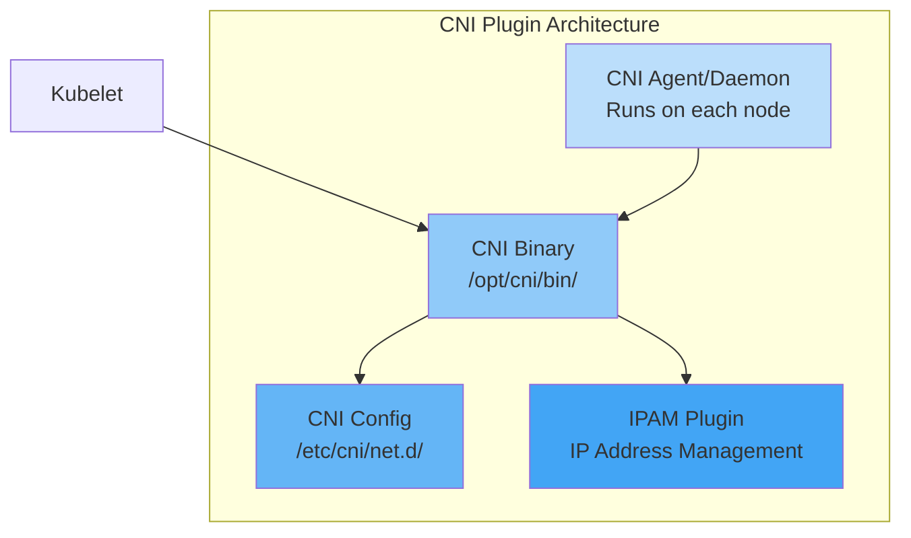
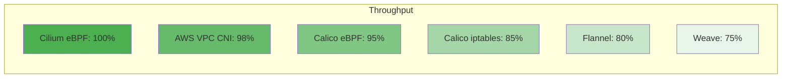
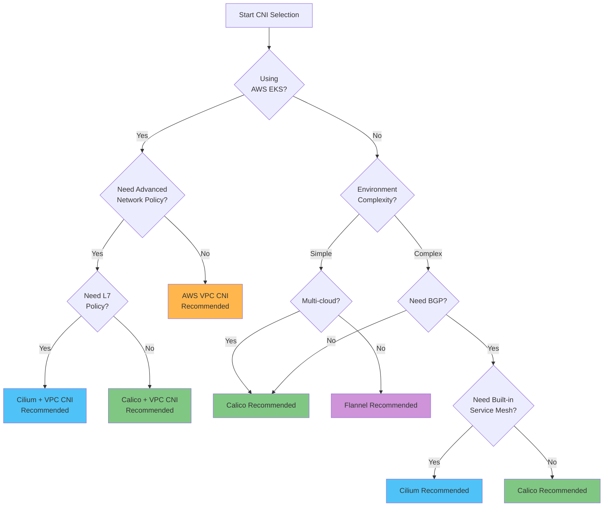
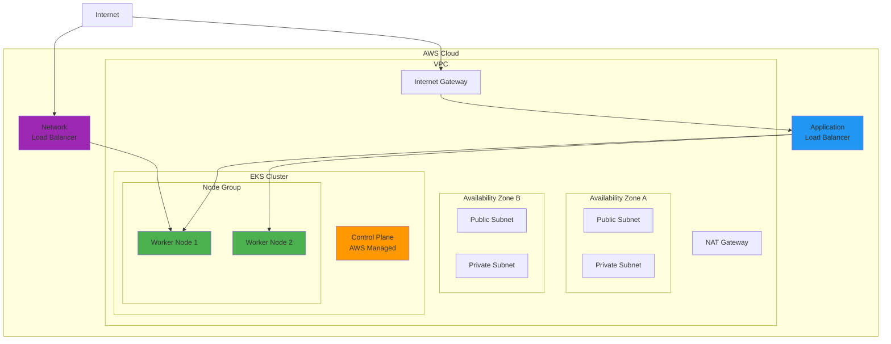
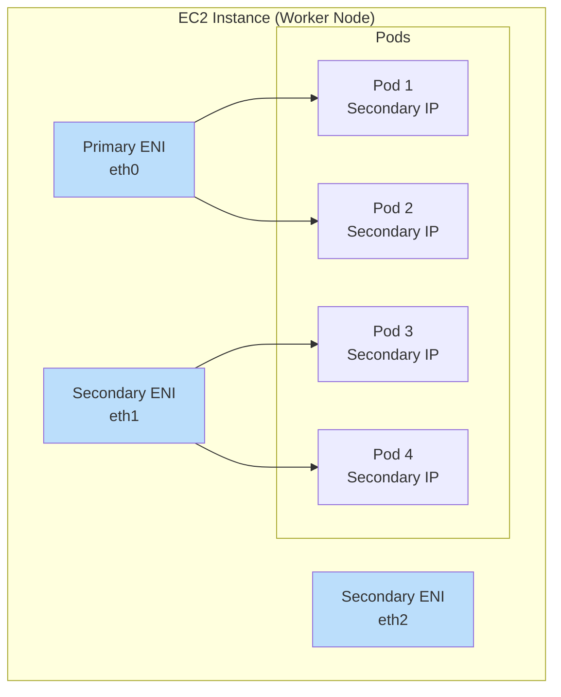

# Kubernetes 网络

> **最后更新**: February 22, 2026

## 概述

Kubernetes 网络是支持容器化应用程序之间通信的核心基础设施层。本节涵盖从基本 Kubernetes 网络概念到高级 CNI（Container Network Interface）解决方案，以及 AWS EKS 环境中的网络模式等所有内容。

## Kubernetes 网络模型

Kubernetes 基于以下网络要求进行设计：

1. **每个 Pod 都可以无需 NAT 与其他任何 Pod 通信**
2. **每个 Node 都可以无需 NAT 与每个 Pod 通信**
3. **Pod 看到的自身 IP 与其他对象看到的该 Pod IP 相同**



### Pod 网络

Pod 网络是 Kubernetes 网络中最基础的层。每个 Pod 都拥有唯一的 IP 地址，并且可以直接与集群中的所有其他 Pod 通信。



#### Pod 网络实现方式

| 方法 | 描述 | CNI 示例 |
|--------|-------------|-------------|
| **Overlay Network** | 构建在现有网络之上的虚拟网络 | Flannel (VXLAN), Calico (IPIP), Weave Net |
| **Underlay Network** | 在物理网络上直接路由 | AWS VPC CNI, Calico (BGP), Cilium (Native Routing) |
| **Hybrid** | 根据环境选择 overlay/underlay | Cilium, Calico |

### Service 网络

Service 为一组 Pod 提供稳定的网络端点。



#### Service 类型特性

```yaml
# ClusterIP Service Example
apiVersion: v1
kind: Service
metadata:
  name: my-service
  namespace: default
spec:
  type: ClusterIP
  selector:
    app: my-app
  ports:
    - protocol: TCP
      port: 80
      targetPort: 8080
---
# NodePort Service Example
apiVersion: v1
kind: Service
metadata:
  name: my-nodeport-service
spec:
  type: NodePort
  selector:
    app: my-app
  ports:
    - protocol: TCP
      port: 80
      targetPort: 8080
      nodePort: 30080  # Range: 30000-32767
---
# LoadBalancer Service Example
apiVersion: v1
kind: Service
metadata:
  name: my-loadbalancer-service
  annotations:
    service.beta.kubernetes.io/aws-load-balancer-type: "nlb"
spec:
  type: LoadBalancer
  selector:
    app: my-app
  ports:
    - protocol: TCP
      port: 443
      targetPort: 8443
```

### Ingress 网络

Ingress 定义将 HTTP/HTTPS 流量路由到集群内部 Service 的规则。



```yaml
# Ingress Example
apiVersion: networking.k8s.io/v1
kind: Ingress
metadata:
  name: my-ingress
  annotations:
    kubernetes.io/ingress.class: "alb"
    alb.ingress.kubernetes.io/scheme: "internet-facing"
spec:
  rules:
    - host: api.example.com
      http:
        paths:
          - path: /v1
            pathType: Prefix
            backend:
              service:
                name: api-v1
                port:
                  number: 80
          - path: /v2
            pathType: Prefix
            backend:
              service:
                name: api-v2
                port:
                  number: 80
    - host: web.example.com
      http:
        paths:
          - path: /
            pathType: Prefix
            backend:
              service:
                name: web-frontend
                port:
                  number: 80
```

## CNI（Container Network Interface）

CNI 是用于容器网络连接的标准接口。Kubernetes 通过 CNI 插件实现 Pod 网络。

### CNI 的工作原理



### CNI 插件组件



## CNI 对比矩阵

### 主要 CNI 解决方案对比

| 特性 | Cilium | Calico | Flannel | AWS VPC CNI | Weave Net |
|---------|--------|--------|---------|-------------|-----------|
| **核心技术** | eBPF | iptables/eBPF | VXLAN/host-gw | AWS ENI | VXLAN |
| **Network Policy** | 高级（L3-L7） | 高级（L3-L4） | 无 | 基础（L3-L4） | 基础 |
| **加密** | WireGuard/IPsec | WireGuard/IPsec | 无 | 无 | 内置 |
| **Service Mesh** | 内置 | 无 | 无 | 无 | 无 |
| **可观测性** | Hubble | 有限 | 无 | 无 | 无 |
| **BGP 支持** | 是 | 是 | 否 | 否 | 否 |
| **多集群** | ClusterMesh | Federation | 否 | 否 | 是 |
| **Windows 支持** | Beta | 是 | 是 | 是 | 是 |
| **性能** | 优秀 | 非常好 | 良好 | 优秀 | 良好 |
| **复杂度** | 中等偏高 | 中等 | 低 | 低 | 低 |
| **社区** | 活跃 | 非常活跃 | 活跃 | AWS 支持 | 一般 |

### 详细功能对比

#### 网络模式

| CNI | Overlay | 原生路由 | BGP | 直接路由 |
|-----|---------|----------------|-----|----------------|
| **Cilium** | VXLAN, Geneve | 是 | 是 | 是 |
| **Calico** | VXLAN, IPIP | 是 | 是 | 是 |
| **Flannel** | VXLAN | host-gw | 否 | 否 |
| **AWS VPC CNI** | 否 | VPC 原生 | 否 | 是 |
| **Weave Net** | VXLAN | 否 | 否 | 否 |

#### Network Policy 功能

| 特性 | Cilium | Calico | AWS VPC CNI |
|---------|--------|--------|-------------|
| **Ingress Policy** | 是 | 是 | 是 |
| **Egress Policy** | 是 | 是 | 是 |
| **L7 Policy (HTTP)** | 是 | 否 | 否 |
| **基于 DNS 的 Policy** | 是 | 是 | 否 |
| **FQDN Policy** | 是 | 是 | 否 |
| **Host Policy** | 是 | 是 | 否 |
| **全局 Policy** | 是 | 是 | 否 |
| **Policy 层级** | 是 | 是 | 否 |

#### 性能基准测试（相对比较）



## CNI 选型指南

### 决策流程图



### 按使用场景推荐 CNI

#### 1. AWS EKS 生产环境

**推荐：AWS VPC CNI + Calico（Network Policy）**

```yaml
# eksctl cluster configuration example
apiVersion: eksctl.io/v1alpha5
kind: ClusterConfig
metadata:
  name: production-cluster
  region: ap-northeast-2
vpc:
  cidr: "10.0.0.0/16"
addons:
  - name: vpc-cni
    version: latest
    configurationValues: |
      enableNetworkPolicy: "true"
  - name: coredns
  - name: kube-proxy
```

#### 2. 高级安全要求

**推荐：Cilium**

- 支持 L7 Network Policy
- 基于 DNS 的 Policy
- 进程/文件级安全 Policy
- 加密通信（WireGuard）

#### 3. 本地部署/裸机环境

**推荐：Calico（BGP 模式）**

- 与现有网络基础设施集成
- 与 ToR 交换机进行 BGP 对等连接
- 高性能（无 overlay）

#### 4. 开发/测试环境

**推荐：Flannel**

- 简单的安装和配置
- 资源使用量低
- 基础功能足够

#### 5. Service Mesh 集成环境

**推荐：Cilium（无 Sidecar Service Mesh）**

- 可替代 Istio/Envoy
- mTLS、流量管理
- 开销低

## EKS 网络基础

### EKS 默认网络架构



### VPC CNI 的工作原理

AWS VPC CNI 为每个 Pod 分配实际的 VPC IP 地址。



#### ENI 和 IP 限制

| 实例类型 | 最大 ENI 数 | 每个 ENI 的 IPv4 数 | 最大 Pod 数（推荐） |
|---------------|----------|--------------|------------------------|
| t3.medium | 3 | 6 | 17 |
| t3.large | 3 | 12 | 35 |
| m5.large | 3 | 10 | 29 |
| m5.xlarge | 4 | 15 | 58 |
| m5.2xlarge | 4 | 15 | 58 |
| c5.4xlarge | 8 | 30 | 234 |

### EKS 网络注意事项

#### IP 地址管理

```yaml
# VPC CNI Configuration - IP Prefix Delegation
apiVersion: v1
kind: ConfigMap
metadata:
  name: amazon-vpc-cni
  namespace: kube-system
data:
  enable-prefix-delegation: "true"
  warm-prefix-target: "1"
  minimum-ip-target: "5"
  warm-ip-target: "2"
```

#### 自定义网络

```yaml
# ENIConfig for Custom Subnets
apiVersion: crd.k8s.amazonaws.com/v1alpha1
kind: ENIConfig
metadata:
  name: us-east-1a
spec:
  securityGroups:
    - sg-0123456789abcdef0
  subnet: subnet-0123456789abcdef0
---
apiVersion: crd.k8s.amazonaws.com/v1alpha1
kind: ENIConfig
metadata:
  name: us-east-1b
spec:
  securityGroups:
    - sg-0123456789abcdef0
  subnet: subnet-fedcba9876543210f
```

## 网络子页面

本节详细介绍以下主题：

### [VPC CNI](01-vpc-cni.md)
默认 EKS CNI。为每个 Pod 分配 VPC IP，以实现原生 VPC 网络。

### [Cilium 深入解析](cilium/README.md)
基于 eBPF 的高性能 CNI 解决方案。提供 L7 Network Policy、Service Mesh 和可观测性（Hubble）等高级功能。

### [Calico 深入解析](calico/README.md)
最广泛使用的 CNI 之一。具备强大的 Network Policy、BGP 支持和企业级功能。涵盖介绍、架构、网络模式、BGP 深入解析、Network Policy、eBPF、高级主题、EKS 集成和运维指南。

### [VPC Lattice](02-vpc-lattice.md)
AWS 托管的应用程序网络服务。支持跨 VPC、跨账户的服务间通信。

### [AWS Load Balancer Controller](03-aws-lb-controller.md)
将 Kubernetes Service 和 Ingress 与 AWS ELB（ALB/NLB）集成。

### [Gateway API](04-gateway-api.md)
下一代 Kubernetes ingress API。标准化的资源模型和基于角色的配置。

## 网络故障排除

### 常见问题和解决方案

#### Pod 间通信失败

```bash
# 1. Check Pod IPs
kubectl get pods -o wide

# 2. Test network connectivity
kubectl exec -it <pod-name> -- ping <target-pod-ip>

# 3. Test DNS resolution
kubectl exec -it <pod-name> -- nslookup <service-name>

# 4. Check CNI logs
kubectl logs -n kube-system -l k8s-app=aws-node
kubectl logs -n kube-system -l k8s-app=cilium
```

#### Service 无法访问

```bash
# 1. Check Service status
kubectl get svc <service-name> -o yaml

# 2. Check Endpoints
kubectl get endpoints <service-name>

# 3. Check kube-proxy logs
kubectl logs -n kube-system -l k8s-app=kube-proxy
```

#### Network Policy 调试

```bash
# For Cilium
kubectl exec -n kube-system -it <cilium-pod> -- cilium policy get
kubectl exec -n kube-system -it <cilium-pod> -- cilium endpoint list

# For Calico
kubectl get networkpolicy -A
kubectl get globalnetworkpolicy
calicoctl get policy -o yaml
```

### 网络性能测试

```yaml
# Network performance test using iperf3
apiVersion: v1
kind: Pod
metadata:
  name: iperf-server
  labels:
    app: iperf-server
spec:
  containers:
  - name: iperf
    image: networkstatic/iperf3
    command: ["iperf3", "-s"]
    ports:
    - containerPort: 5201
---
apiVersion: v1
kind: Pod
metadata:
  name: iperf-client
spec:
  containers:
  - name: iperf
    image: networkstatic/iperf3
    command: ["sleep", "infinity"]
```

```bash
# Run the test
kubectl exec -it iperf-client -- iperf3 -c <iperf-server-ip> -t 30
```

## 最佳实践

### 1. IP 地址规划

- 设计足够大的 CIDR 块
- 将 Pod 网络与 Service 网络分离
- 设计子网时考虑未来扩展

### 2. 应用 Network Policy

- 应用默认拒绝 Policy（Zero Trust）
- 仅显式允许必需的流量
- 隔离 namespace

```yaml
# Default deny policy example
apiVersion: networking.k8s.io/v1
kind: NetworkPolicy
metadata:
  name: default-deny-all
  namespace: production
spec:
  podSelector: {}
  policyTypes:
    - Ingress
    - Egress
```

### 3. 性能优化

- 选择合适的 CNI（与工作负载匹配）
- MTU 优化
- 内核参数调优

### 4. 安全加固

- 加密通信（WireGuard、IPsec）
- 应用 mTLS
- 定期进行安全审计

### 5. 确保可观测性

- 收集网络指标
- 启用流日志
- 实施分布式追踪

## 后续步骤

1. [VPC CNI](01-vpc-cni.md) - 默认 EKS CNI
2. [Cilium 深入解析](cilium/README.md) - 基于 eBPF 的网络
3. [Calico 深入解析](calico/README.md) - 企业级 CNI
4. [VPC Lattice](02-vpc-lattice.md) - AWS 托管网络
5. [AWS Load Balancer Controller](03-aws-lb-controller.md) - ELB 集成
6. [Gateway API](04-gateway-api.md) - 下一代 ingress

---

## 参考资料

- [Kubernetes 网络模型](https://kubernetes.io/docs/concepts/cluster-administration/networking/)
- [CNI 规范](https://github.com/containernetworking/cni/blob/master/SPEC.md)
- [AWS VPC CNI 文档](https://docs.aws.amazon.com/eks/latest/userguide/pod-networking.html)
- [Network Policy 指南](https://kubernetes.io/docs/concepts/services-networking/network-policies/)
