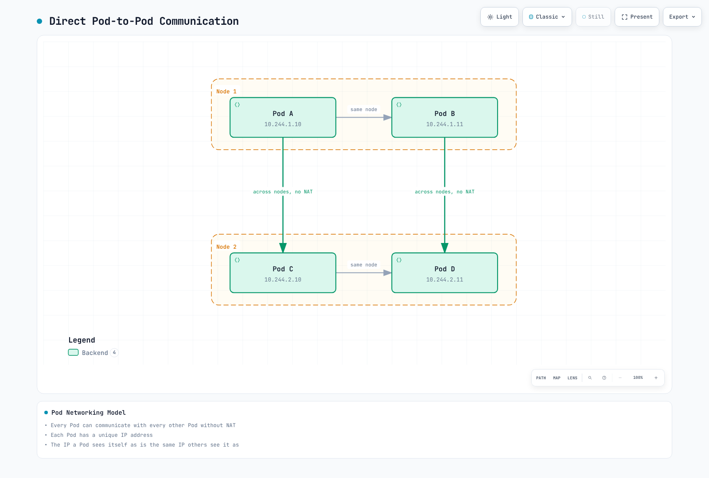
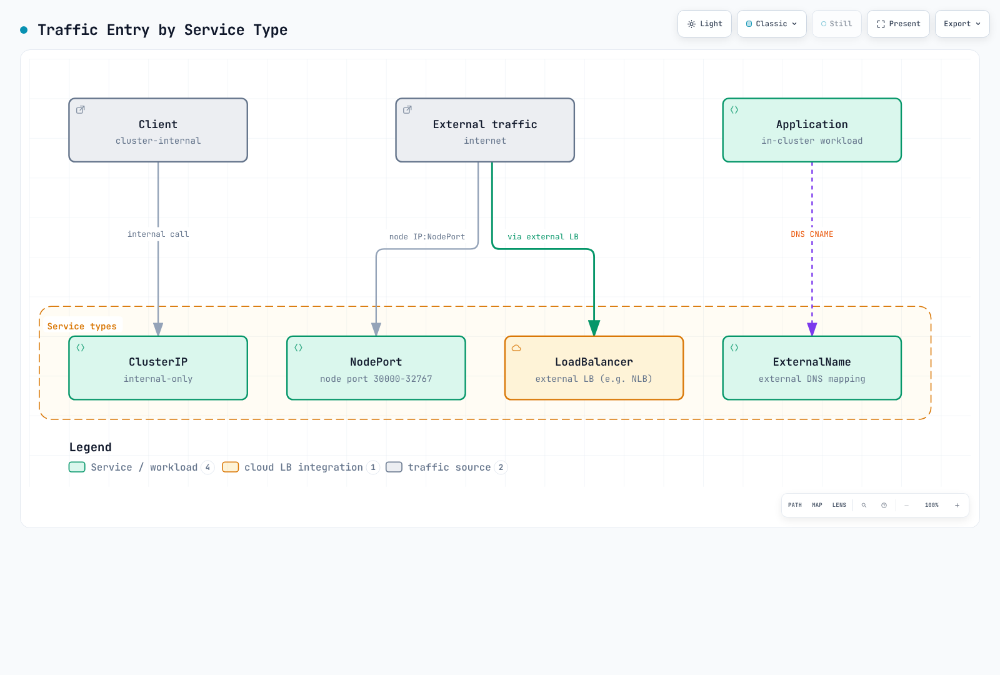
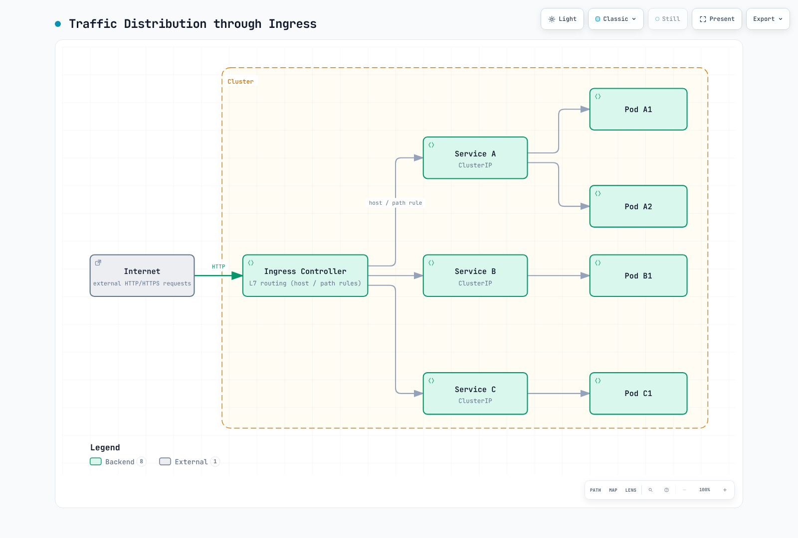
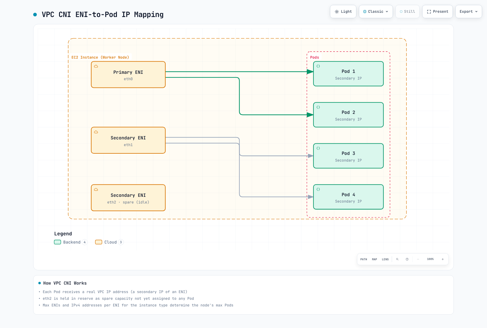

# Kubernetes 网络

> **最后更新**：2026年10月16日
>
> **固定示例版本**：Cilium 1.20.3、Calico Open Source 3.32.2、Flannel 0.28.10，以及上游 AWS VPC CNI/Helm Chart 1.23.2。
>
> **当前版本信息**：AWS 为 Kubernetes 1.31–1.37 列出了 EKS 托管的 VPC CNI 插件 `v1.23.1-eksbuild.1`。Calico 3.33.0 是最新的 Open Source 版本，并已在 Kubernetes 1.35–1.37 上经过测试。更改固定示例前，请查看其发行说明。
>
> 这些版本并非经过联合测试的集群配置。安装前，请检查每种产品的 Kubernetes/平台兼容矩阵。

## 概述

Kubernetes 网络是核心基础设施层，可让容器化应用相互通信。本节涵盖从 Kubernetes 网络基础概念，到高级 CNI（容器网络接口）解决方案以及 AWS EKS 环境中的网络模式等内容。

## 学习路径 {#learning-path}

完成入门课程后，可使用[专家网络学习路径](expert/README.md)，将协议项目、路由策略、EVPN、Linux 性能、云设计和自动化评估联系起来。请先检查每本练习手册中的环境、证据和恢复标准。

如果你刚接触 Linux 或网络，请从[入门课程](beginner/README.md)开始。课程通过八节课串联 CLI、寻址、DNS、SSH、防火墙、监控和综合项目。下面的路径将在此基础上进一步介绍协议、内核和集群实现。

从协议概念入手，逐步了解观测结果，再将其与容器、集群和云环境中的职责联系起来。根据先修条件选择切入点，并在继续学习前通过预期成果检查理解情况。

| 阶段 | 作用 | 先修条件 | 预期成果 | 阅读 / 练习 |
|---|---|---|---|---|
| 协议、寻址、HTTP | 建立术语基础 | 基本命令行操作 | 跟踪请求，并区分寻址、传输和应用层行为 | 网络基础知识[第 1 部分](../basics/06-network-fundamentals-part1.md)、[第 2 部分](../basics/06-network-fundamentals-part2.md)、[第 3 部分](../basics/06-network-fundamentals-part3.md)、[第 4 部分](../basics/06-network-fundamentals-part4.md) |
| 网络设备、LAN、WAN | 区分设备职责和边界 | 协议和寻址基础 | 说明交换机、路由器、防火墙、负载均衡器、VLAN、NAT 和 WAN 类型 | [网络基础知识第 5 部分](../basics/06-network-fundamentals-part5.md) · [测验](../quizzes/basics/06-network-fundamentals-part5-quiz.md) |
| Linux 套接字、VFS、数据包路径 | 将 API 与内核联系起来 | TCP/IP 基础 | 区分 FD、套接字缓冲区、窗口和队列 | [内核网络栈](../kernel/02-network-stack.md) |
| Linux 网络诊断 | 用证据检验假设 | 套接字和数据包路径概念 | 关联套接字、数据包和应用层观测结果 | [诊断练习](07-linux-network-diagnostics.md) · [测验](../quizzes/networking/07-linux-network-diagnostics-quiz.md) |
| Docker 和容器网络 | 找出命名空间边界 | Linux 数据包路径和基本诊断 | 说明桥接网络、发布的端口以及容器名称解析 | [容器技术](../basics/03-container-technology.md) |
| Kubernetes Service、DNS、Ingress | 映射集群抽象 | 容器网络 | 跟踪名称如何经由 Service 到达其端点，并确定 Ingress 的作用 | [Service 和网络](../core/03-services-networking.md) · [实验](../labs/core/03-services-networking-lab.md) |
| eBPF、CNI、策略 | 比较不同实现的职责 | Pod 和 Service 路径 | 区分数据包转发、策略实施和可观测性 | [eBPF 基础知识](../basics/05-ebpf-fundamentals.md) · [Cilium](cilium/README.md) · [Calico](calico/README.md) |
| AWS 网络边界和性能 | 将模型应用于云网络路径 | CNI 概念和测量技能 | 识别 VPC、节点和 AZ 边界，并结合上下文解读测量结果 | [VPC CNI](01-vpc-cni.md) · [AWS Load Balancer Controller](03-aws-lb-controller.md) · [跨组织 VPC 连接](05-cross-org-vpc-connectivity.md) · [Pod 网络基准测试](06-pod-network-benchmark.md) |
| WAN、混合云和边缘 | 设计本地环境、云和用户之间的网络路径 | 路由策略、AWS 网络边界 | 根据证据说明混合云路径和故障转移、CDN 响应的位置，以及 WAF 和 DDoS 防护的作用位置 | [WAN 和混合云](expert/07-wan-hybrid-connectivity.md) · [CDN 和边缘交付](expert/08-cdn-edge-delivery.md) · [边缘安全](expert/09-edge-security-waf-ddos.md) |

## Kubernetes 网络模型

当前 Kubernetes 模型提供 Pod 网络，使 Pod 可以跨节点直接通信，而无需地址转换或代理，**但有意实施网络分段的情况除外**。kubelet 等节点代理必须能够访问所在节点上的 Pod。网络策略、路由和应用监听程序仍会决定特定连接能否成功。

普通 Pod 拥有自己的网络命名空间和集群范围内的地址；同一 Pod 中的容器共享该命名空间和 localhost。使用主机网络的 Pod 与节点共享网络，而双栈或多网络配置则需要更精确地处理地址。重新创建 Pod 可能会分配不同的 IP；在同一 Pod 中重启容器则不一定会重新创建其网络沙箱。

| 组件 | 作用 |
|---|---|
| Pod 网络 | 为工作负载网络命名空间之间提供寻址和连接能力 |
| Service/服务发现 | 为不断变化的端点提供稳定的 Service 名称或虚拟地址 |
| Ingress/Gateway 实现 | 配置外部入口和应用路由 |
| 网络策略引擎 | 实施所选实现支持的策略 |

这些职责并不构成强制的串行数据包路径。Service 转换、L7 代理和工作负载策略可能会改变特定请求在网络中的传输路径。

### Pod 网络

Pod 网络为 Pod 通信提供寻址和路由。下图展示普通 IPv4 Pod；图中的连接以适用的策略和网络控制允许连接为前提。



[🔍 查看交互式图表](https://www.atomai.click/kubernetes-docs/archmaps/en-networking-readme-1.html)

图中地址是普通 Pod 地址示例。有意实施的隔离，以及主机网络或多网络配置，都需要分别解读。

#### Pod 网络实现方式

| 方式 | 描述 | CNI 示例 |
|--------|-------------|-------------|
| **覆盖网络** | 在现有网络上封装流量 | Flannel VXLAN、Calico VXLAN/IPIP、Cilium VXLAN/Geneve |
| **原生路由** | 使用底层网络中的路由，不进行上述覆盖封装 | AWS VPC CNI、Calico 路由/BGP、Cilium 原生路由 |
| **条件式封装** | 根据配置的拓扑使用直连路径或封装 | Calico/Flannel/Cilium 支持的模式，前提条件各不相同 |

### Service 网络

Service 描述一组逻辑端点（通常是 Pod）以及访问这些端点的方式。ClusterIP 默认提供稳定的虚拟 IP；无头 Service 不提供该虚拟 IP，而 ExternalName 使用 DNS CNAME 映射。Service 也可以拥有不通过 Pod 选择器管理的端点。



[🔍 查看交互式图表](https://www.atomai.click/kubernetes-docs/archmaps/en-networking-readme-2.html)

这些是典型的暴露方式，并非安全保障。NodePort 范围和可访问的节点地址可以配置；LoadBalancer 也可以是内部负载均衡器。ExternalName 返回 DNS 别名，不会创建转发代理。

#### Service 类型特征

在 `default` 中创建标签匹配 `app: my-app` 的 Pod，并让其监听下方显示的目标端口。NodePort 默认分配范围为 30000–32767，且可配置。外部是否可访问仍取决于地址、路由和访问控制。

LoadBalancer 示例明确选择了 **AWS Load Balancer Controller**，并使用 EC2 实例目标和已分配的 NodePort。请先安装/配置该 Controller 及其 IAM/子网先决条件。EKS Auto Mode 使用不同的 Controller/类别。此处的端口 443 仅表示选择了一个 TCP 端口；必须由后端在 8443 上提供 TLS，或在负载均衡器上单独配置 TLS。

这些端口映射展示的是通用 Kubernetes Service API。AWS 目前还记录了 EKS 原生网络策略的其他要求：Service 端口必须与容器端口匹配，并且带有 `metadata.ownerReferences` 的 Controller 管理型 Pod 才能可靠地实施策略。在测试该策略实现前，请先调整示例以符合这些要求。

```yaml
apiVersion: v1
kind: Service
metadata:
  name: my-service
  namespace: default
spec:
  type: ClusterIP
  selector:
    app: my-app
  ports:
  - protocol: TCP
    port: 80
    targetPort: 8080
---
apiVersion: v1
kind: Service
metadata:
  name: my-nodeport-service
  namespace: default
spec:
  type: NodePort
  selector:
    app: my-app
  ports:
  - protocol: TCP
    port: 80
    targetPort: 8080
    nodePort: 30080
---
apiVersion: v1
kind: Service
metadata:
  name: my-loadbalancer-service
  annotations:
    service.beta.kubernetes.io/aws-load-balancer-scheme: internet-facing
    service.beta.kubernetes.io/aws-load-balancer-nlb-target-type: instance
  namespace: default
spec:
  type: LoadBalancer
  selector:
    app: my-app
  ports:
  - protocol: TCP
    port: 443
    targetPort: 8443
  loadBalancerClass: service.k8s.aws/nlb
  allocateLoadBalancerNodePorts: true
```

### Ingress 网络

Ingress 资源需要 Controller 及其数据平面。此 HTTP 示例使用 AWS LBC、`spec.ingressClassName: alb` 和 IP 目标。被引用的 `api-v1`、`api-v2` 和 `web-frontend` Service 必须存在于 `default` 中、暴露端口 80，并拥有就绪且可通过 VPC 路由访问的 Pod 端点。需要时，请另行配置 HTTPS/证书。有关安装和目标先决条件，请参阅 [LBC 指南](03-aws-lb-controller.md)。

Ingress 定义将 HTTP/HTTPS 流量路由到集群内部 Service 的规则。



[🔍 查看交互式图表](https://www.atomai.click/kubernetes-docs/archmaps/en-networking-readme-3.html)

图中的方框代表 Ingress 数据平面功能。AWS LBC 对 ALB 进行编程；应用流量不会经过 Controller 的协调流程。根据目标模式，数据平面可以访问 Pod IP 或 NodePort，而不一定要把 Service 虚拟 IP 当作一个实际的额外跃点经过。

```yaml
apiVersion: networking.k8s.io/v1
kind: Ingress
metadata:
  name: my-ingress
  annotations:
    alb.ingress.kubernetes.io/scheme: internet-facing
    alb.ingress.kubernetes.io/target-type: ip
  namespace: default
spec:
  rules:
  - host: api.example.com
    http:
      paths:
      - path: /v1
        pathType: Prefix
        backend:
          service:
            name: api-v1
            port:
              number: 80
      - path: /v2
        pathType: Prefix
        backend:
          service:
            name: api-v2
            port:
              number: 80
  - host: web.example.com
    http:
      paths:
      - path: /
        pathType: Prefix
        backend:
          service:
            name: web-frontend
            port:
              number: 80
  ingressClassName: alb
```

## CNI（容器网络接口）

CNI 规范化了运行时配置容器网络所使用的接口。对于当前版本的 Kubernetes，kubelet 通过 CRI 请求 Pod 沙箱操作，**容器运行时负责管理 CNI**。kubelet 过去直接管理 CNI 的标志已在 Kubernetes 1.24 中移除。

### 运行时和插件的职责

| 参与方 | 职责 |
|---|---|
| kubelet | 通过容器运行时接口请求创建/移除沙箱 |
| 容器运行时 | 选择网络配置并调用 CNI 插件链 |
| CNI 插件 | 接收配置，执行 ADD/DEL 等支持的操作，并返回结果 |
| IPAM 实现 | 分配/释放地址；可以是受委托的插件，也可以是特定供应商代理的一部分 |
| 可选节点代理 | 维护特定供应商的路由、策略、IP 池或数据路径状态 |

运行时通过 CNI 接口将配置传递给插件；并非每个插件都必须配备独立的长驻代理或 IPAM 二进制文件。接口类型也各不相同：veth 对很常见，但并非唯一实现。

## CNI 比较

| 项目 / 范围 | 网络和策略 | 需要区分的功能和限制 |
|---|---|---|
| **Cilium 1.20.3** | 基于 eBPF 的网络；相关 L7 功能使用 Envoy；Cilium 网络策略和 Hubble | Linux 工作节点数据平面，并有 AMD64/Arm64 要求。Windows CLI 可用不等同于支持 Windows CNI。WireGuard/IPsec 和 Beta ztunnel mTLS 的适用范围各不相同。 |
| **Calico Open Source 3.32.2 示例；当前版本为 3.33.0** | 路由/封装选项；iptables、nftables 和 eBPF 选项；有序策略层级以及主机/工作负载策略 | Calico 3.33.0 已在 Kubernetes 1.35–1.37 上经过测试。升级前请查看其发行说明。Windows 有单独的限制，包括不支持 Linux eBPF 或 WireGuard 数据平面。Whisker/Goldmane 流量可观测性为 Tech Preview。付费功能请参阅版本功能矩阵。 |
| **Flannel 0.28.10** | 主机子网分配和节点间传输；VXLAN、host-gw 和其他后端 | `flanneld` 本身不实施 NetworkPolicy；Chart 的可选 `netpol.enabled` 会部署 SIGs 策略 Controller。WireGuard 是有文档说明的后端；IPsec 则处于实验阶段。Windows VXLAN 有特定设置/限制。 |
| **AWS VPC CNI 1.23.2 上游/Helm 示例；EKS 插件 `v1.23.1-eksbuild.1`** | VPC 地址分配和 EC2 ENI/前缀；适用于受支持 Linux EC2 节点的 EKS Standard 和 Admin 网络策略功能 | AWS 为 Kubernetes 1.31–1.37 列出了此托管插件构建版本；请确认区域可用性和集群的实际版本。EKS Auto Mode 是托管网络实现，并支持其他 DNS 策略功能。Windows、Fargate、自定义网络、前缀委派和多 NIC 支持都有各自的条件。 |
| **原始 Weave Net 项目** | 历史上的覆盖网络实现 | 原始 `weaveworks/weave` 仓库已归档。不要将其描述为新集群中仍在积极维护且受支持的默认选项。 |

### 策略、加密和可观测性

- Cilium 通过适用的 L7 组件提供感知 HTTP/DNS 的策略，以及集群范围/主机策略。其拒绝/允许语义不同于 Calico 的有序 Tier API。
- Calico Open Source 包含分层策略层级和主机策略。当前产品矩阵将应用层策略、DNS/FQDN 策略和 Cluster Mesh 列为 Cloud/Enterprise 功能；不能将这些功能默认为开源版本所有。Calico 文档中介绍的传输中加密使用 WireGuard。
- Amazon EKS 为 Auto Mode 以及受支持的 EC2/VPC-CNI 安装提供 `ClusterNetworkPolicy` Admin/Baseline 控制。AWS 描述的 DNS/FQDN `ApplicationNetworkPolicy` 功能适用于 **Auto Mode**。其名称并不表示当前支持检查 HTTP 方法/正文。
- Flannel 的可选策略 Controller 有自己的要求；仅选择网络后端并不会启用策略实施。
- 节点间加密、经过身份验证的工作负载身份和应用 mTLS 是不同的控制措施。网络流量可见性也不同于应用跟踪或进程/文件实施。

### 路由和性能

Calico 和 Cilium 可以通过 BGP 通告路由；但这本身不会提供多集群服务发现、策略同步或加密。Flannel host-gw 使用直连路由，并要求具备合适的二层连接能力。覆盖网络会带来封装和 MTU 方面的考虑，但不能仅根据 CNI 名称推断普遍适用的性能排名。

此前的 100/98/95/85/80/75 百分比吞吐量数据没有可复现的工作负载、版本或测量来源。请使用可比较的硬件、内核、数据包/请求大小、并发量、加密/策略设置、吞吐量、丢包率和尾延迟。单独的 [Pod 基准测试](06-pod-network-benchmark.md)保留了其自身的历史环境和测量结果。

## CNI 选择指南

先确定所需的路由、策略、操作系统和支持模式，再测试对应的组合。

| 需求 | 评估路径 |
|---|---|
| 标准 EKS VPC 寻址和受支持的网络策略 | 在添加第二个策略引擎之前，先评估 AWS VPC CNI/EKS 功能。 |
| 有序策略层级、主机策略或基础设施 BGP | 评估相关 Calico 版本/数据平面及路由先决条件。 |
| Cilium 策略、Hubble 或特定网格功能 | 检查 Linux/内核/平台兼容性，并参阅 [Cilium 网格指南](../service-mesh/cilium-service-mesh/README.md)。适用的 L7 路径仍包含 Envoy。 |
| 功能需求有限的小型网络 | 根据实际需求评估 Flannel 后端和可选策略 Controller。 |
| 进程、系统调用或文件实施 | 单独评估 Tetragon 等运行时安全组件，而不是将其视为网络策略。 |

### EKS 托管插件配置

以下是一个**配置有效载荷**示例，并非要求在同一组工作负载上同时安装 Calico 和 VPC CNI 策略引擎：

```json
{
  "enableNetworkPolicy": "true"
}
```

此设置的文档类型是字符串 `"true"`。请为现有 Kubernetes 版本选择兼容的 EKS 插件构建版本，并检查该构建版本的配置 Schema：

```bash
EKS_REGION=ap-northeast-2
KUBERNETES_MINOR=1.35  # Replace with the existing cluster's minor version
aws eks describe-addon-versions --region "$EKS_REGION" --addon-name vpc-cni \
  --kubernetes-version "$KUBERNETES_MINOR"
: "${VPC_CNI_ADDON_VERSION:?Set the compatible eksbuild version selected from metadata}"
aws eks describe-addon-configuration --region "$EKS_REGION" --addon-name vpc-cni \
  --addon-version "$VPC_CNI_ADDON_VERSION"
```

上游 1.23.2 发行版本号与 EKS 的 `eksbuild` 版本号是不同的标识符。AWS 当前的插件表为 Kubernetes 1.31–1.37 列出了 `v1.23.1-eksbuild.1`；请在目标区域使用 `describe-addon-versions` 选择兼容的构建版本。将更改合并到预期的托管插件配置中；不要盲目选择 `latest` 或替换无关值。从第三方策略实现迁移时，还需要移除现有实施状态，并制定经过测试的节点/工作负载切换计划。

## EKS 网络基础

### EKS 默认网络架构

| 位置 / 组件 | 职责 |
|---|---|
| EKS 托管 VPC | AWS 在多个可用区之间运行托管 Kubernetes 控制平面。 |
| 客户的集群 VPC | 工作节点网络、所选子网以及 EKS 托管的跨账户 ENI 提供通往控制平面的已配置路径。 |
| 客户所选 VPC 子网中的 ALB/NLB | 提供选定的公共或内部应用入口点；Internet Gateway/NAT Gateway 不能替代相应的路由配置。 |
| NAT Gateway 或私有服务端点 | 提供工作负载设计所需的特定出站路径。 |

之前的图将控制平面放在客户 VPC 内、将负载均衡器放在其外部；现已用上述所有权边界取代。

### 按计算模式划分的 DNS 和网络

| 计算模式 | DNS / 组件位置 |
|---|---|
| 标准 EC2 节点 | 通常使用已配置的 CoreDNS Deployment 和已安装的网络组件；替代方案需要使用各自受支持的配置。 |
| 纯 EKS Auto Mode | CoreDNS、VPC CNI 和 kube-proxy 功能作为托管节点 systemd 服务运行。这些节点不需要 CoreDNS Deployment/插件。 |
| Auto Mode 与非 Auto 节点混合部署 | 为非 Auto 节点保留 CoreDNS Deployment；它们无法使用其他节点上的 Auto Mode DNS 服务。 |

Auto Mode 的第一个 DNS 解析器位于节点本地。上游转发和控制平面通信仍可能需要网络访问；这不保证所有 DNS 相关数据包都留在节点上。AWS 为 Auto Mode 记录了 Admin 和 DNS 策略；而标准 EC2 VPC-CNI Admin 策略则有自己的版本/启用要求。

### VPC CNI 的工作原理

AWS VPC CNI 根据所选 IPAM 模式，为普通 Pod 分配可通过 VPC 路由访问的地址。辅助 IPv4 地址、委派前缀、分支 ENI 和多 NIC 配置各不相同；使用主机网络的 Pod 与节点共享网络。



[🔍 查看交互式图表](https://www.atomai.click/kubernetes-docs/archmaps/en-networking-readme-9.html)

此图仅展示辅助 IP 模式。预留 ENI 是可配置的分配策略，并不意味着每个节点都必须始终恰好预留一个 ENI。前缀委派、自定义网络和分支 ENI 的分配规则各不相同。

#### ENI 和 IP 限制

| 实例类型 | ENI 最大数量 | 每个 ENI 的 IPv4 槽位数 | 旧版辅助 IP 引导值 |
|---------------|----------|--------------|------------------------|
| t3.medium | 3 | 6 | 17 |
| t3.large | 3 | 12 | 35 |
| m5.large | 3 | 10 | 29 |
| m5.xlarge | 4 | 15 | 58 |
| m5.2xlarge | 4 | 15 | 58 |
| c5.4xlarge | 8 | 30 | 234 |

这些数值已根据 VPC CNI 1.23.2 实例限制和旧版 max-Pods 表进行验证。历史计算公式为 `ENIs × (IPv4 slots per ENI − 1) + 2`；它并非当前普遍适用的建议。前缀委派、自定义网络、分支 ENI 和多个网卡都会改变地址容量。Kubernetes 调度也受 kubelet `maxPods` 和资源限制。EKS 托管节点组会将少于 30 个 vCPU 的实例的 `maxPods` 上限设为 110，否则为 250；可用 IP 数量本身不会突破这一上限。

### EKS 网络注意事项

#### IP 地址管理

对于 **Linux VPC CNI**，请通过所选插件/Helm/DaemonSet 管理机制配置文档中列出的环境变量。以下是 EKS 插件配置片段。旧的 `amazon-vpc-cni` ConfigMap 中的 `enable-prefix-delegation` 并不能以这种方式配置 Linux IPAMD。应用更改时，请保留其他预期的插件值。

```json
{
  "env": {
    "ENABLE_PREFIX_DELEGATION": "true",
    "WARM_PREFIX_TARGET": "1"
  }
}
```

或者，调整总分配下限和空闲 IP 目标。配置 `MINIMUM_IP_TARGET` 或 `WARM_IP_TARGET` 时，二者优先于 `WARM_PREFIX_TARGET`；这些是可替代的策略，而不是四个可以彼此独立叠加的目标。分配仍按前缀大小的单位进行。支持 Nitro、拥有足够的连续 `/28` IPv4 地址空间，以及合适的 kubelet Pod 限制，都是独立的先决条件。

Windows 前缀分配使用不同的配置路径：AWS 在 `amazon-vpc-cni` ConfigMap 中记录了 `enable-windows-prefix-delegation` 及其 warm-target 键。不要将 Linux 环境变量配置流程原样用于 Windows。

```json
{
  "env": {
    "ENABLE_PREFIX_DELEGATION": "true",
    "MINIMUM_IP_TARGET": "5",
    "WARM_IP_TARGET": "2"
  }
}
```

#### 自定义网络

这些 IPv4 示例要求在目标 AZ 和 VPC 中使用真实的子网/安全组 ID。启用自定义网络，并通过可用区标签为每个节点选择 ENIConfig。显式设置的 ENIConfig 节点注解优先于该标签。以下示例中的名称在两种语言中都使用同一区域；请替换为实际节点所在的可用区。仅安装 ENIConfig 对象并不能启用自定义网络。

```json
{
  "env": {
    "AWS_VPC_K8S_CNI_CUSTOM_NETWORK_CFG": "true",
    "ENI_CONFIG_LABEL_DEF": "topology.kubernetes.io/zone"
  }
}
```

```yaml
apiVersion: crd.k8s.amazonaws.com/v1alpha1
kind: ENIConfig
metadata:
  name: ap-northeast-2a
spec:
  securityGroups:
  - sg-0123456789abcdef0
  subnet: subnet-0123456789abcdef0
---
apiVersion: crd.k8s.amazonaws.com/v1alpha1
kind: ENIConfig
metadata:
  name: ap-northeast-2b
spec:
  securityGroups:
  - sg-0123456789abcdef0
  subnet: subnet-fedcba9876543210f
```

## 高级网络概念

本概述的其他部分会顺带提及以下主题。完整的设置流程和实测数据见相关深入页面；本节则按层梳理各部分的差异及适用位置。

### L2–L7 以及路由器与负载均衡器的区别

“路由器”和“负载均衡器”常常出现在同一句话中，但它们回答的是不同问题。路由器通常为单个目标选择一条路径；负载均衡器则使用分发算法，从多个等效候选目标中选择一个。

| 层 | 设备/功能 | 决策依据 | Kubernetes/AWS 对应项 |
|---|---|---|---|
| L2（链路层） | 交换机、网桥 | 目标 MAC 地址 | CNI 创建的 veth 对和 Linux 网桥、ENI 提供的虚拟网卡 |
| L3（网络层） | 路由器或透明设备插入 | 路由时依据目标 IP；选择设备时依据流标识 | VPC 的隐式路由器、TGW；GWLB 为设备封装 IP 数据包 |
| L4（传输层） | L4 负载均衡器 | 连接/流标识，通常为 5 元组 | NLB；kube-proxy（iptables、IPVS、nftables）；独立的 eBPF Service 实现 |
| L7（应用层） | L7 负载均衡器/反向代理 | 每个请求中的主机、路径、标头；协议感知 | ALB、Ingress/Gateway API 实现、服务网格 sidecar（Envoy） |

关键区别在于**分发单位**。L4 负载均衡器通常为一个 TCP 连接或受跟踪的 UDP 流选择目标。L7 代理可以针对每个受支持的应用请求选择目标，即使这些请求共享一个连接。GWLB 在安全设备之间分发经过封装的 IP 流，而不是解析应用请求。流粘性取决于配置的超时、运行状况和故障转移行为；它并不保证某个流绝不会被重新分配或中断。

> 📎 L2/L3 概念的协议级定义见[网络基础知识第 1 部分](../basics/06-network-fundamentals-part1.md)；ALB/NLB 目标类型和实际配置见 [AWS Load Balancer Controller](03-aws-lb-controller.md)。

### 跨账户/VPC 连接：TGW、VPC Peering、GWLB、PrivateLink、Lattice

这五种连接选项在网络层级和流量模式上各不相同。有关 TGW RAM 共享、VPC Peering、PrivateLink、TGW Peering 和 VPC Lattice 的实测延迟，请参阅[跨组织 VPC 连接](05-cross-org-vpc-connectivity.md)。本节补充了未列入该比较表的 GWLB，并从层级角度重新梳理全部五种选项。

| 连接方式 | 层级/模式 | 特征 |
|---|---|---|
| VPC Peering | L3，双向 IP 路由 | 不具备传递性；不能在 CIDR 重叠的 VPC 之间配置 |
| Transit Gateway (TGW) | L3，中心辐射型 IP 路由 | 通过一个或多个 TGW 路由表中的关联和传播来运行；可通过 RAM 跨账户共享 |
| Gateway Load Balancer (GWLB) | L3，透明设备插入 | 使用 GENEVE（UDP 6081）封装原始数据包；VPC Endpoint Service 模式将使用方流量连接到提供方设备组 |
| PrivateLink | 私有端点连接 | 由 NLB 支持的 Endpoint Service 是一种模式；此外还有资源端点。使用方/提供方 CIDR 可以重叠 |
| VPC Lattice | 应用和资源网络 | HTTP/HTTPS Service 支持 L7 路由和可选 IAM 授权；TLS 直通和资源配置的功能各不相同 |

GWLB 通过 Gateway Load Balancer Endpoint 将防火墙和 IDS/IPS 等检查设备插入 IP 路径。其默认流粘性使用五个字段；受支持的配置也可以改用两个或三个字段。请验证正向和返回路由、设备运行状况、封装 MTU、NACL，以及实际工作负载/设备的安全组。GWLB 本身没有 ALB 那样的安全组，而且流粘性不能替代故障测试。

有关安全设计，请参阅 [WAF/源站防护](../security/14-waf-edge-api-security.md)、[Palo Alto/Fortinet NGFW](../security/15-ngfw-paloalto-fortinet.md) 和 [GWLB/GENEVE 路径与故障](../security/16-gwlb-geneve-inspection.md)。GWLBE 也不支持安全组。对于所有目标都不健康的情况，AWS 描述的行为是按流选择目标并持续丢弃流量，直到目标恢复，不会直接绕过设备。请一并检查缩减元组流粘性、跨区负载均衡、NAT 和 TGW 设备模式。

> 📎 完整的 EKS/VPC Lattice 集成（Gateway API Controller、IAM 授权、路由）见 [VPC Lattice](02-vpc-lattice.md)。

### DNS Resolver 和路由表的实际行为

**DNS Resolver**：AmazonProvidedDNS **就是 Route 53 Resolver**。其地址包括 VPC IPv4 主网段地址加 2（`10.0.0.0/16` 对应 `10.0.0.2`）以及 `169.254.169.253`；它根据 Resolver 规则解析关联的私有区域和公有名称。CoreDNS 通常提供已配置的 Kubernetes 集群域名，通常为 `cluster.local`；`kube-dns` 是其 Service 名称，不是命名空间或 DNS 区域。外部转发遵循 Corefile 和 DNS Pod 所能看到的 Resolver 文件。请检查这些设置，不要想当然地认为使用的是节点的 Resolver 文件且未经更改。在 Resolver Endpoint 设计中，入站端点接收本地环境的查询，出站端点及关联规则则将选定的 VPC 查询转发到本地 DNS。Auto Mode 的节点本地 Resolver 不会消除对上游的依赖。

**路由表**：VPC 路由评估通常采用最长前缀匹配。AWS 允许替换 `local` 路由的目标，并为设备路由添加受支持的、更具体的子网路由；`local` 并非无条件最具体的路由。对于相同目标，静态 VPC 路由的优先级高于从虚拟私有网关传播的路由。以 TGW 为目标的 VPC 路由是静态路由；TGW 内部的传播则属于其独立的路由表。无效目标可能会留下丢弃流量的 `blackhole` 条目，因此请同时检查路由状态和目标。未显式关联路由表的子网会使用 VPC 的主路由表。

> 📎 TGW/Peering 路由优先级和静态路由配置示例见[跨组织 VPC 连接的运维发现](05-cross-org-vpc-connectivity.md#operational-findings)。

### 内核数据平面：iptables、IPVS、eBPF 和数据包过滤

Linux Service 转发和网络策略实施可以采用不同机制。Netfilter 提供 iptables 和 nftables 使用的数据包路径钩子。eBPF 实现可以附加到 XDP、tc 或套接字钩子，并在这些位置执行 Service 选择。这并不意味着在启用了 eBPF 的集群中，每个数据包都会绕过 Netfilter 或连接跟踪；具体路径取决于 CNI、内核、路由和功能配置。

| 实现 | 所在位置 | 特征 |
|---|---|---|
| iptables | Netfilter 钩子上的顺序规则链 | 评估时间随规则数量增加（O(n)）；kube-proxy 长期使用的默认模式 |
| IPVS | 内核原生 L4 负载均衡器，是 Netfilter 扩展 | 基于哈希的查找（接近 O(1)）；从 Kubernetes 1.35 起，已弃用作为 kube-proxy 模式 |
| nftables | iptables 的后继 Netfilter 框架 | 自 1.33 起成为 kube-proxy 的稳定模式；请先检查内核/CNI 兼容性 |
| eBPF（例如 Cilium） | 已配置的 XDP、tc 和套接字钩子 | 可以替代 kube-proxy 处理 Service；这是独立的实现，Netfilter/conntrack 行为因路径而异 |

切换实现可能会遗留内核规则和活动连接。请遵循发行版/CNI 的迁移流程，按需驱逐工作负载，并在清理需要重启时安排节点重启。使用基于 eBPF 的 CNI 替代 kube-proxy 时，还必须按照受支持的切换顺序操作，避免不同实现争抢同一 Service 流量。

> 📎 IPVS 弃用时间线和 nftables 稳定版转换见 [Kubernetes 简介](../basics/04-kubernetes-introduction.md)；Cilium 基于 eBPF 的 kube-proxy 替代方案见 [Cilium eBPF](cilium/02-ebpf.md)；Calico eBPF 数据平面及迁移流程见 [Calico eBPF](calico/06-ebpf-dataplane.md)。

### 计算密集型网络：ENI、EFA、NVLink 和光收发器

ENI、EFA 和 NVLink 用于不同的路径。**ENI** 是附加到某个可用区中 EC2 实例的虚拟网络接口；在路由和策略允许的情况下，其普通 IP 流量可以到达其他 AZ 和互连的 VPC（参见 [VPC CNI](01-vpc-cni.md)）。**EFA** 提供操作系统旁路设备，由兼容的 MPI/NCCL 软件通过 libfabric 使用。**EFA 设备流量不可路由，不能跨越 VPC/AZ 边界**；而通过带有 ENA 的 EFA 接口上的 ENA 设备传输的普通 IP 流量仍可路由。仅含 EFA 的接口没有 ENA 设备或 IP 寻址。**NVLink** 用于连接受支持系统中的 GPU，包括受支持的机架级 NVLink 域。请测量所选硬件、集合通信操作和放置方式，不要假设相较于 EFA 总有固定的加速比。

**光收发器**是数据中心网络中的通用概念。铜缆 DAC（直连铜缆）适合短距离连接；光模块和光纤则满足其他距离和带宽要求。QSFP 和 OSFP 描述的是模块外形规格，并不保证使用光介质。请将这些内容视为通用背景信息：它们不能说明特定 AWS 工作负载的实际物理布线方式。

> 📎 面向拓扑感知调度的 NVLink/IMEX 和 GPU Pod 放置示例见 [AI/ML 基础设施](../ai-ml/06-ai-infrastructure.md)；EFA 的 VPC/AZ 边界限制和测量数据见[跨组织 VPC 连接](05-cross-org-vpc-connectivity.md)。

### 下一代协议对 Kubernetes 的影响：HTTP/3、gRPC、QUIC

[网络基础知识第 2 部分](../basics/06-network-fundamentals-part2.md)和[第 3 部分](../basics/06-network-fundamentals-part3.md)介绍了 HTTP/3（RFC 9114）及其 QUIC 传输协议（RFC 9000）的协议机制。此处只介绍实际影响 Kubernetes 流量分配的内容。

- **gRPC 和 L4 负载均衡器**：gRPC 会在 HTTP/2 连接上复用请求。L4 负载均衡器通常会让已建立的 TCP 连接保持在所选端点上；如果该端点是代理，代理还可以进一步进行路由决策。仅增加 Pod 不会重新分配现有连接。要按 RPC 分配流量，需要兼容的 L7 代理或客户端策略。流式 RPC 仍是一次调用；其中的各条消息不会单独进行负载均衡。
- **Gateway API 的 GRPCRoute**：Ingress 没有专门用于 gRPC 的资源，但 Gateway API 通过 `GRPCRoute` 规范化了按 Service/方法进行的路由。各实现支持的功能各不相同（例如支持多少个标头匹配项、重试策略等），因此请查阅对应 Controller 的文档。
- **HTTP/3/QUIC 在集群中的实际覆盖范围**：客户端与边缘端（CDN、负载均衡器）之间支持 HTTP/3，与集群内部或 Ingress 后端连接支持 HTTP/3，是两个不同的问题。许多 Ingress/Gateway 实现与后端通信时仍使用 HTTP/1.1 或 HTTP/2；是否支持端到端 HTTP/3 则取决于实现和版本，因此不要一概而论，请查阅实际使用的 Controller 文档。

## 网络子页面

本节详细介绍以下主题：

### [从头学习 Linux 网络](beginner/README.md) {#beginner-course}

如果你刚接触 Linux 或网络，请从[入门课程](beginner/README.md)开始。课程通过八节课串联 CLI、寻址、DNS、SSH、防火墙、监控和综合项目。下面的路径将在此基础上进一步介绍协议、内核和集群实现。

### [专家网络学习路径](expert/README.md) {#expert-course}

完成入门课程后，可使用[专家网络学习路径](expert/README.md)，将协议项目、路由策略、EVPN、Linux 性能、云设计和自动化评估联系起来。请先检查每本练习手册中的环境、证据和恢复标准。

### [Linux 网络诊断练习](07-linux-network-diagnostics.md) {#linux-network-diagnostics}

先将[内核套接字和数据包路径概念](../kernel/02-network-stack.md)与观测结果联系起来，再学习 CNI 实现。通过[诊断测验](../quizzes/networking/07-linux-network-diagnostics-quiz.md)检查你的解读是否正确。

### [VPC CNI](01-vpc-cni.md)
介绍使用 VPC 地址为普通 Pod 提供 EKS 网络连接，以及各模式特有的 IPAM/策略先决条件。

### [Cilium 深入介绍](cilium/README.md)
基于高性能 eBPF 的 CNI 解决方案。提供 L7 Network Policy、Service Mesh 和可观测性（Hubble）等高级功能。

### [Calico 深入介绍](calico/README.md)
最广泛使用的 CNI 之一。提供强大的 Network Policy、BGP 支持和企业级功能。涵盖简介、架构、网络模式、BGP 深入介绍、Network Policy、eBPF、高级主题、EKS 集成和运维指南。

### [VPC Lattice](02-vpc-lattice.md)
AWS 托管的应用网络服务。支持跨 VPC、跨账户的服务间通信。

### [AWS Load Balancer Controller](03-aws-lb-controller.md)
将 Kubernetes Service 和 Ingress 与 AWS ELB（ALB/NLB）集成。

### [Gateway API](04-gateway-api.md)
新一代 Kubernetes Ingress API。提供标准化资源模型和基于角色的配置。

### [Pod 网络基准测试](06-pod-network-benchmark.md)
在 EKS 上测量同一节点、同一 AZ 和跨 AZ 的 Pod 间 RTT、HTTP 延迟和吞吐量，并测量 DNS `ndots:5` 查询放大。

## 网络故障排查

### 常见问题和解决方案

#### Pod 间通信失败

```bash
NAMESPACE=default
POD_NAME=iperf-client  # An existing diagnostic Pod with nslookup/curl
SERVICE_NAME=my-service
kubectl -n "$NAMESPACE" get pods -o wide
kubectl -n "$NAMESPACE" exec "$POD_NAME" -- nslookup "$SERVICE_NAME"
kubectl -n "$NAMESPACE" exec "$POD_NAME" -- \
  curl --connect-timeout 3 --max-time 5 -v "http://$SERVICE_NAME:80/"
kubectl -n kube-system logs -l k8s-app=aws-node -c aws-node --tail=100
kubectl -n kube-system logs -l k8s-app=cilium -c cilium-agent --tail=100
```

请在包含所列工具的现有 Pod 中运行诊断。只查询集群中已安装的 CNI；Auto Mode 系统服务并非这些 DaemonSet。DNS 成功、TCP 可达性和应用 HTTP 响应是不同的检查。ICMP 可能被阻止或需要额外权限，因此仅仅 ping 失败并不能证明 TCP Service 无法访问。

#### Service 无法访问

```bash
NAMESPACE=default
SERVICE_NAME=my-service
kubectl -n "$NAMESPACE" get service "$SERVICE_NAME" -o yaml
kubectl -n "$NAMESPACE" get endpointslices \
  -l "kubernetes.io/service-name=$SERVICE_NAME" -o yaml
kubectl -n kube-system logs -l k8s-app=kube-proxy --tail=100
```

当前端点诊断请使用 EndpointSlice。检查 Service 选择器、目标端口、端点就绪状态、地址族和适用策略。只有在 kube-proxy 实际负责 Service 转发时才检查其日志；如果使用 eBPF 替代方案或 Auto Mode，则需要使用对应的诊断方法。

#### 网络策略调试

```bash
kubectl get networkpolicies.networking.k8s.io -A
kubectl -n kube-system exec ds/cilium -c cilium-agent -- cilium-dbg policy get
kubectl -n kube-system exec ds/cilium -c cilium-agent -- cilium-dbg endpoint list
# For a Calico installation using its standard CRD datastore:
kubectl get networkpolicies.crd.projectcalico.org -A
kubectl get globalnetworkpolicies.crd.projectcalico.org
```

Cilium 命令会检查 DaemonSet 引用所选的一个 Agent；追踪事件时，请选择受影响节点上的 Agent。使用 Calico 原生 API 的安装可能会公开不同的 API 组，因此请检查该安装实际提供的资源。Kubernetes、Calico 和 AWS 扩展策略是不同的资源，其优先级也可能不同。

### 网络性能测试

此有限范围的 TCP 测试使用发布者固定的 Netshoot v0.16 镜像索引，其中包含 Linux AMD64 和 Arm64 镜像；其 Dockerfile 包含 `iperf3`。请在允许 TCP 5201 的测试环境中创建这些 Pod。这是一个示例工作负载，并非 CNI 性能比较的测量结果。

```yaml
apiVersion: v1
kind: Pod
metadata:
  name: iperf-server
  namespace: default
  labels:
    app: iperf-server
spec:
  restartPolicy: Never
  automountServiceAccountToken: false
  nodeSelector:
    kubernetes.io/os: linux
  containers:
  - name: netshoot
    image: nicolaka/netshoot:v0.16@sha256:b09d9b21381f47a79b3cbcb30da25266dc17186ea00ae65e99fdc51396f48e70
    command:
    - iperf3
    - -s
    workingDir: /tmp
    resources:
      requests:
        cpu: 100m
        memory: 64Mi
      limits:
        cpu: 500m
        memory: 256Mi
    securityContext:
      runAsNonRoot: true
      runAsUser: 1000
      allowPrivilegeEscalation: false
      capabilities:
        drop:
        - ALL
      seccompProfile:
        type: RuntimeDefault
    ports:
    - containerPort: 5201
      protocol: TCP
---
apiVersion: v1
kind: Pod
metadata:
  name: iperf-client
  namespace: default
  labels:
    app: iperf-client
spec:
  restartPolicy: Never
  automountServiceAccountToken: false
  nodeSelector:
    kubernetes.io/os: linux
  containers:
  - name: netshoot
    image: nicolaka/netshoot:v0.16@sha256:b09d9b21381f47a79b3cbcb30da25266dc17186ea00ae65e99fdc51396f48e70
    command:
    - sleep
    - '3600'
    workingDir: /tmp
    resources:
      requests:
        cpu: 100m
        memory: 64Mi
      limits:
        cpu: 500m
        memory: 256Mi
    securityContext:
      runAsNonRoot: true
      runAsUser: 1000
      allowPrivilegeEscalation: false
      capabilities:
        drop:
        - ALL
      seccompProfile:
        type: RuntimeDefault
```

```bash
kubectl -n default wait --for=condition=Ready pod/iperf-server pod/iperf-client --timeout=120s
IPERF_SERVER_IP="$(kubectl -n default get pod iperf-server -o jsonpath='{.status.podIP}')"
test -n "$IPERF_SERVER_IP"
kubectl -n default exec iperf-client -- iperf3 -c "$IPERF_SERVER_IP" -t 10 -b 10M
```

客户端会休眠一小时，该命令会将发送流量限制为 10 Mbit/s、持续十秒。这是在测试所选路径，而不是测量最大吞吐量。解读结果前，请记录实际的 Pod/节点/AZ 放置情况、资源限制和策略。对于 Windows 节点，请选择 Windows 专用工具。完成后，只删除你创建的测试资源。

这些独立诊断 Pod 用于连接测试。对于 EKS 原生网络策略实施测试，请使用由 Deployment/Job 管理的 Pod，并遵守文档所述的 Service/容器端口要求。

## 最佳实践

### 1. IP 地址规划

- 设计足够大的 CIDR 块
- 将 Pod 网络与 Service 网络分开
- 设计子网时考虑未来扩展

### 2. 应用网络策略

使用此示例前，请先创建隔离的 `networking-demo` 命名空间。按照标准 Kubernetes NetworkPolicy 语义，此策略会选择其中的所有 Pod，并同时隔离入站和出站流量；所需的 DNS 和应用流量必须通过显式允许规则放行。实施策略需要受支持的策略引擎。其他集群/Admin 策略 API 可能会改变优先级，而且仅靠此清单并不能构成完整的零信任架构。

- 应用默认拒绝策略（零信任）
- 仅显式允许所需流量
- 隔离命名空间

```yaml
apiVersion: networking.k8s.io/v1
kind: NetworkPolicy
metadata:
  name: default-deny-all
  namespace: networking-demo
spec:
  podSelector: {}
  policyTypes:
  - Ingress
  - Egress
```

### 3. 性能优化

- 选择合适的 CNI（与工作负载匹配）
- 优化 MTU
- 调整内核参数

### 4. 安全加固

- 选择受支持的传输加密方式，并确认其覆盖哪些流量。
- 在需要时配置工作负载/应用身份和 mTLS；不要将它们与基于 DNS/IP 的允许列表混为一谈。
- 定期审查策略、证书和访问控制变更。

### 5. 确保可观测性

- 收集网络指标
- 启用流日志
- 实施分布式跟踪

## 后续步骤

完成[入门课程](beginner/README.md)后，请继续学习[内核网络栈](../kernel/02-network-stack.md)，然后进行 [Linux 网络诊断练习](07-linux-network-diagnostics.md)及其[测验](../quizzes/networking/07-linux-network-diagnostics-quiz.md)学习。[学习路径](#learning-path)会先将这些基础知识与容器和 Service 联系起来，再引出下方的 CNI 和 AWS 主题。

1. [VPC CNI](01-vpc-cni.md) - 默认 EKS CNI
2. [Cilium 深入介绍](cilium/README.md) - 基于 eBPF 的网络
3. [Calico 深入介绍](calico/README.md) - 路由、策略和数据平面
4. [VPC Lattice](02-vpc-lattice.md) - AWS 托管网络
5. [AWS Load Balancer Controller](03-aws-lb-controller.md) - ELB 集成
6. [Gateway API](04-gateway-api.md) - 新一代 Ingress
7. [跨组织 VPC 连接](05-cross-org-vpc-connectivity.md) - 连接 AWS Organizations 中的 VPC（经实地验证）
8. [Pod 网络基准测试](06-pod-network-benchmark.md) - 按节点/AZ 边界测量的延迟和吞吐量

---

## 参考资料

- [Kubernetes 网络模型](https://kubernetes.io/docs/concepts/services-networking/)
- [Kubernetes Services](https://kubernetes.io/docs/concepts/services-networking/service/)
- [容器运行时和 CNI](https://kubernetes.io/docs/concepts/extend-kubernetes/compute-storage-net/network-plugins/)
- [Kubernetes NetworkPolicy](https://kubernetes.io/docs/concepts/services-networking/network-policies/)
- [CNI 规范](https://raw.githubusercontent.com/containernetworking/cni/main/SPEC.md)
- [Calico 产品版本](https://docs.tigera.io/calico/latest/about)
- [Calico Open Source 3.33.0 发行版本](https://github.com/projectcalico/calico/releases/tag/v3.33.0)
- [Calico 策略层级](https://docs.tigera.io/calico/latest/network-policy/policy-tiers/tiered-policy)
- [Calico Whisker 流日志](https://docs.tigera.io/calico/latest/observability/view-flow-logs)
- [Calico Windows 限制](https://docs.tigera.io/calico/latest/getting-started/kubernetes/windows-calico/limitations)
- [Flannel 0.28.10 网络和策略](https://raw.githubusercontent.com/flannel-io/flannel/v0.28.10/README.md)
- [Flannel 后端](https://raw.githubusercontent.com/flannel-io/flannel/v0.28.10/Documentation/backends.md)
- [原始 Weave 仓库状态](https://api.github.com/repos/weaveworks/weave)
- [AWS VPC CNI 1.23.2](https://raw.githubusercontent.com/aws/amazon-vpc-cni-k8s/v1.23.2/README.md)
- [Amazon EKS 最新 VPC CNI 插件版本](https://docs.aws.amazon.com/eks/latest/userguide/managing-vpc-cni.html)
- [EKS 网络策略配置](https://docs.aws.amazon.com/eks/latest/userguide/cni-network-policy-configure.html)
- [EKS Standard 和 Admin 网络策略](https://docs.aws.amazon.com/eks/latest/userguide/cni-network-policy.html)
- [EKS 前缀委派和 maxPods](https://docs.aws.amazon.com/eks/latest/userguide/cni-increase-ip-addresses-procedure.html)
- [EKS Admin 和 DNS 策略部署模式](https://aws.amazon.com/blogs/containers/enhance-amazon-eks-network-security-posture-with-dns-and-admin-network-policies/)
- [EKS Auto Mode 网络](https://docs.aws.amazon.com/eks/latest/userguide/auto-networking.html)
- [EKS 插件要求](https://docs.aws.amazon.com/eks/latest/userguide/workloads-add-ons-available-eks.html)
- [EKS 控制平面架构](https://docs.aws.amazon.com/eks/latest/best-practices/control-plane.html)
- [Netshoot v0.16 镜像元数据](https://hub.docker.com/v2/repositories/nicolaka/netshoot/tags/v0.16)
- [Netshoot v0.16 Dockerfile](https://raw.githubusercontent.com/nicolaka/netshoot/v0.16/Dockerfile)
- [Tetragon 运行时安全](https://tetragon.io/docs/overview/)
- [AWS LBC 3.6 NLB 配置](https://github.com/kubernetes-sigs/aws-load-balancer-controller/blob/v3.6.0/docs/guide/service/nlb.md)
- [AWS LBC 3.6 Ingress 配置](https://github.com/kubernetes-sigs/aws-load-balancer-controller/blob/v3.6.0/docs/guide/ingress/annotations.md)
- [Gateway Load Balancer 概念](https://docs.aws.amazon.com/vpc/latest/privatelink/gateway-load-balancers.html)
- [GENEVE 封装（RFC 8926）](https://www.rfc-editor.org/rfc/rfc8926)
- [VPC DNS Resolver](https://docs.aws.amazon.com/vpc/latest/userguide/vpc-dns.html)
- [Route 53 Resolver 端点和规则](https://docs.aws.amazon.com/Route53/latest/DeveloperGuide/resolver.html)
- [VPC 路由表评估顺序](https://docs.aws.amazon.com/vpc/latest/userguide/VPC_Route_Tables.html)
- [Local 路由和更具体的子网路由](https://docs.aws.amazon.com/vpc/latest/userguide/subnet-route-tables.html)
- [静态路由和传播路由的优先级](https://docs.aws.amazon.com/vpc/latest/userguide/route-tables-priority.html)
- [AmazonProvidedDNS 地址和行为](https://docs.aws.amazon.com/vpc/latest/userguide/AmazonDNS-concepts.html)
- [GWLB 流粘性和故障转移](https://docs.aws.amazon.com/elasticloadbalancing/latest/gateway/edit-target-group-attributes.html)
- [Kubernetes Service 虚拟 IP 和 kube-proxy 模式](https://kubernetes.io/docs/reference/networking/virtual-ips/)
- [CoreDNS Service 名称和转发配置](https://kubernetes.io/docs/tasks/administer-cluster/dns-custom-nameservers/)
- [PrivateLink 资源端点](https://docs.aws.amazon.com/vpc/latest/privatelink/privatelink-access-resources.html)
- [Netfilter/iptables 项目文档](https://www.netfilter.org/documentation/index.html)
- [EC2 Elastic Fabric Adapter](https://docs.aws.amazon.com/AWSEC2/latest/UserGuide/efa.html)
- [QUIC 传输协议（RFC 9000）](https://www.rfc-editor.org/rfc/rfc9000)
- [HTTP/3（RFC 9114）](https://www.rfc-editor.org/rfc/rfc9114)
- [基于 HTTP/2 的 gRPC 和负载均衡](https://grpc.io/blog/grpc-load-balancing/)
- [Gateway API GRPCRoute](https://gateway-api.sigs.k8s.io/guides/user-guides/grpc-routing/)
