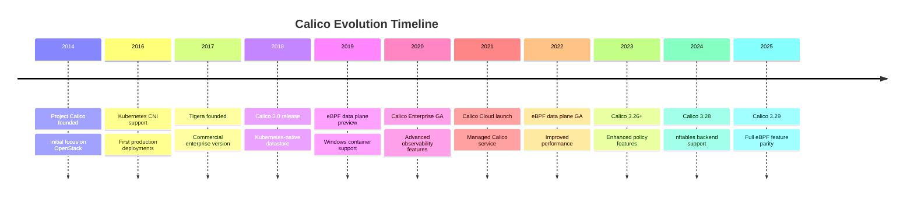
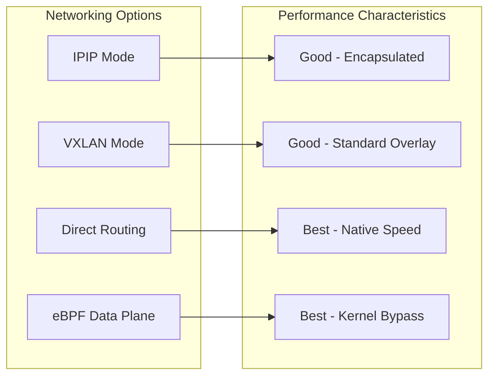
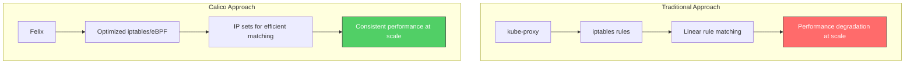
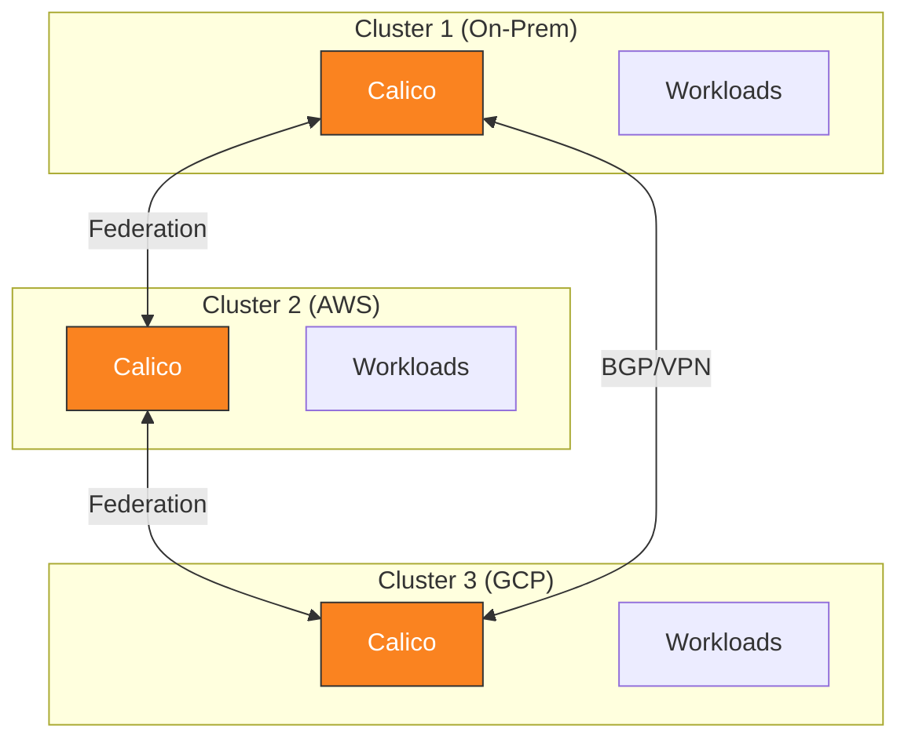

# 第 1 部分：Calico 简介

> **支持的版本**: Calico v3.29+ / Kubernetes 1.28+
> **最后更新**: February 22, 2026

## 实验环境设置

要跟随本文档中的示例操作，您将需要以下工具和环境。

### 必需工具

| 工具 | 版本 | 用途 |
|------|---------|---------|
| kubectl | v1.28+ | Kubernetes 集群管理 |
| calicoctl | v3.29+ | Calico 资源管理 |
| Helm | v3.12+ | 包管理（可选） |
| kind/minikube | 最新版 | 本地 Kubernetes 集群 |

### 安装 calicoctl

```bash
# Download calicoctl binary
curl -L https://github.com/projectcalico/calico/releases/download/v3.29.0/calicoctl-linux-amd64 -o calicoctl
chmod +x calicoctl
sudo mv calicoctl /usr/local/bin/

# Verify installation
calicoctl version

# Configure datastore access (Kubernetes API)
export DATASTORE_TYPE=kubernetes
export KUBECONFIG=~/.kube/config
```

### 使用 kind 设置本地集群

```bash
# Create kind cluster configuration
cat <<EOF > kind-calico.yaml
kind: Cluster
apiVersion: kind.x-k8s.io/v1alpha4
networking:
  disableDefaultCNI: true
  podSubnet: 192.168.0.0/16
nodes:
- role: control-plane
- role: worker
- role: worker
EOF

# Create the cluster
kind create cluster --config kind-calico.yaml --name calico-lab

# Install Calico
kubectl create -f https://raw.githubusercontent.com/projectcalico/calico/v3.29.0/manifests/tigera-operator.yaml
kubectl create -f https://raw.githubusercontent.com/projectcalico/calico/v3.29.0/manifests/custom-resources.yaml

# Wait for Calico to be ready
kubectl wait --for=condition=Ready pods -l k8s-app=calico-node -n calico-system --timeout=300s
```

### 验证安装

```bash
# Check all Calico components
kubectl get pods -n calico-system

# Expected output:
# NAME                                       READY   STATUS    RESTARTS   AGE
# calico-kube-controllers-xxxxxxxxx-xxxxx    1/1     Running   0          2m
# calico-node-xxxxx                          1/1     Running   0          2m
# calico-node-yyyyy                          1/1     Running   0          2m
# calico-typha-xxxxxxxxx-xxxxx               1/1     Running   0          2m
# csi-node-driver-xxxxx                      2/2     Running   0          2m

# Check node status
calicoctl node status

# Check IP pools
calicoctl get ippools -o wide
```

## 什么是 Calico？

Calico 是一款专为云原生工作负载设计的开源网络和网络安全解决方案。它为 Kubernetes、虚拟机和裸金属工作负载提供高度可扩展的网络和网络策略解决方案。

### 项目历史：从 Project Calico 到 Tigera



| 年份 | 里程碑 | 意义 |
|------|-----------|--------------|
| 2014 | Project Calico 成立 | 最初为 OpenStack 提供网络功能 |
| 2016 | Kubernetes CNI 支持 | 扩展至容器编排 |
| 2017 | Tigera 成立 | 获得商业支持和企业功能 |
| 2018 | Calico 3.0 | 支持 Kubernetes 原生数据存储 |
| 2019 | Windows 支持 | 加速企业采用 |
| 2020 | Calico Enterprise GA | 完整的企业功能集 |
| 2021 | Calico Cloud | 推出 SaaS 服务 |
| 2022 | eBPF 数据平面 GA | 现代数据平面选项 |
| 2024 | nftables 后端 | 支持下一代 Linux 防火墙 |
| 2025 | Calico 3.29 | 完整的 eBPF 功能对等性 |

## 核心功能

Calico 提供五项核心能力，使其成为 Kubernetes 网络的领先选择。

### 1. 高性能网络

Calico 提供针对不同环境优化的多种网络模式：



**关键性能特性：**
- 与原生 Linux 网络栈集成
- 可选的 eBPF 数据平面，可降低开销
- 基于 BGP 的路由，实现最优路径选择
- 直接路由模式下的最小封装开销

### 2. 网络策略实施

Calico 实现 Kubernetes NetworkPolicy API，并通过强大的附加功能对其进行扩展：

```yaml
# Standard Kubernetes NetworkPolicy (supported by Calico)
apiVersion: networking.k8s.io/v1
kind: NetworkPolicy
metadata:
  name: default-deny-ingress
  namespace: production
spec:
  podSelector: {}
  policyTypes:
  - Ingress
---
# Calico-specific GlobalNetworkPolicy
apiVersion: projectcalico.org/v3
kind: GlobalNetworkPolicy
metadata:
  name: security-baseline
spec:
  selector: all()
  types:
  - Ingress
  - Egress
  ingress:
  - action: Allow
    source:
      selector: trusted == 'true'
  egress:
  - action: Allow
    destination:
      nets:
      - 10.0.0.0/8
```

**策略能力：**
- 基于标签的 Pod 选择
- Namespace 隔离
- 基于 CIDR 的规则
- 协议和端口过滤
- 全局策略（集群范围）
- 有序策略层级（Enterprise）
- 基于 FQDN 的出口策略

### 3. 灵活的 IP 地址管理（IPAM）

Calico 的 IPAM 系统可在整个集群中高效分配 IP 地址：

```yaml
apiVersion: projectcalico.org/v3
kind: IPPool
metadata:
  name: default-ipv4-pool
spec:
  cidr: 192.168.0.0/16
  blockSize: 26              # 64 IPs per block
  ipipMode: Always
  vxlanMode: Never
  natOutgoing: true
  nodeSelector: all()
```

**IPAM 特性：**
- 基于块的分配（默认：/26 块）
- 面向不同工作负载类型的多个 IP 池
- 节点特定的 IP 池分配
- IPv4 和 IPv6 双栈支持
- 自动回收 IP 地址

### 4. 基于 BGP 的路由

Calico 的原生 BGP 支持可与现有网络基础设施无缝集成：

```yaml
apiVersion: projectcalico.org/v3
kind: BGPConfiguration
metadata:
  name: default
spec:
  logSeverityScreen: Info
  nodeToNodeMeshEnabled: true
  asNumber: 64512
---
apiVersion: projectcalico.org/v3
kind: BGPPeer
metadata:
  name: rack-tor-switch
spec:
  peerIP: 10.0.0.1
  asNumber: 64513
  nodeSelector: rack == 'rack-1'
```

**BGP 能力：**
- 节点间全互连（自动配置）
- 与外部路由器建立对等连接（ToR 交换机、防火墙）
- 为大型集群提供路由反射器支持
- AS 路径预置和社区属性
- 支持优雅重启

### 5. 跨平台支持

Calico 可在多样化环境中一致运行：

| 平台 | 支持级别 | 说明 |
|----------|---------------|-------|
| AWS EKS | 完整 | 可提供原生 VPC 集成 |
| Azure AKS | 完整 | Azure CNI + Calico 策略选项 |
| Google GKE | 完整 | 基于 Calico 的 Dataplane V2 |
| 本地部署 | 完整 | 与物理网络进行 BGP 集成 |
| OpenStack | 完整 | 原始平台支持 |
| Windows | 完整 | Windows Server 2019/2022 |
| 裸金属 | 完整 | 建议使用直接路由 |

## Calico 与传统网络的对比

### 传统 Kubernetes 网络面临的挑战



### 对比表

| 方面 | 传统方式（kube-proxy） | Calico |
|--------|-------------------------|--------|
| **规则组织** | 线性 iptables 链 | IP 集合 + 优化链 |
| **规模影响** | O(n) 规则遍历 | O(1) IP 集合查找 |
| **策略支持** | 无（需要独立的 CNI） | 原生支持，具备扩展功能 |
| **路由** | 仅 Service 级别 | 完整 L3 路由 |
| **可观测性** | 有限 | 流日志、指标 |
| **BGP** | 不支持 | 原生支持 |
| **数据平面选项** | 仅 iptables | iptables、nftables、eBPF |

### 大规模性能表现

```
Cluster Size: 1000 nodes, 50,000 pods

Traditional iptables (kube-proxy):
- Rules: ~150,000 iptables rules
- Latency: 2-5ms added per connection
- Memory: ~500MB per node

Calico (optimized):
- Rules: ~5,000 rules + IP sets
- Latency: <0.5ms added per connection
- Memory: ~150MB per node
```

## 使用场景

### 1. 本地数据中心

Calico 在需要与现有网络基础设施进行 BGP 集成的本地部署中表现出色：

```yaml
# BGP peering with data center ToR switches
apiVersion: projectcalico.org/v3
kind: BGPPeer
metadata:
  name: datacenter-tor
spec:
  peerIP: 10.1.0.1
  asNumber: 65001
  password:
    secretKeyRef:
      name: bgp-secrets
      key: tor-password
```

**优势：**
- 无 Overlay 开销
- 与现有路由直接集成
- 硬件负载均衡器兼容性
- 跨 VM 和容器的一致安全策略

### 2. 云部署（AWS、GCP、Azure）

Calico 在云提供商网络之上提供增强的安全和策略功能：

```yaml
# EKS deployment with VXLAN
apiVersion: operator.tigera.io/v1
kind: Installation
metadata:
  name: default
spec:
  kubernetesProvider: EKS
  cni:
    type: Calico
  calicoNetwork:
    bgp: Disabled
    ipPools:
    - cidr: 10.244.0.0/16
      encapsulation: VXLAN
```

**优势：**
- 可在云 VPC 约束内工作
- 提供超越云原生选项的增强网络策略
- 跨多云的一致策略模型
- 与云安全组集成

### 3. 混合与多集群

Calico Federation 可实现跨多个集群的策略和路由：



**优势：**
- 跨集群的统一策略管理
- 跨集群 Service 发现
- 一致的安全态势
- 支持渐进式迁移

### 4. 以合规为重点的环境

Calico Enterprise 为受监管行业提供高级功能：

- **审计日志**：完整记录策略变更和实施情况
- **合规报告**：PCI-DSS、SOC 2、HIPAA 的预构建报告
- **加密**：基于 WireGuard 的节点间加密
- **威胁防御**：DDoS 防护和异常检测

## 项目治理与社区

### 开源治理

Calico 是托管在 Cloud Native Computing Foundation（CNCF）生态系统下的开源项目：

- **许可证**：Apache 2.0
- **治理**：开放社区，Tigera 是主要维护者
- **贡献**：可通过 GitHub 向社区贡献
- **发布**：定期发布节奏（约每季度一次）

### 社区资源

| 资源 | URL |
|----------|-----|
| GitHub | https://github.com/projectcalico/calico |
| 文档 | https://docs.tigera.io/calico/latest/ |
| Slack | https://calicousers.slack.com |
| 社区会议 | 每两周一次，向所有人开放 |
| Stack Overflow | 标签：`project-calico` |

### 获取帮助

```bash
# Join the Calico Slack community
# Visit: https://slack.projectcalico.org

# File issues on GitHub
# https://github.com/projectcalico/calico/issues

# Check the FAQ
# https://docs.tigera.io/calico/latest/reference/faq
```

## 总结

Calico 为 Kubernetes 提供成熟且久经生产验证的网络解决方案，具有以下特点：

1. **经验证的稳定性**：数千家组织在生产环境中使用
2. **灵活的架构**：多种数据平面选项（iptables、nftables、eBPF）
3. **全面的策略**：Kubernetes NetworkPolicy 加上扩展的 Calico 策略
4. **原生 BGP**：一流地支持本地部署和混合部署
5. **跨平台**：在云端、本地和混合环境中提供一致体验

在下一节中，我们将深入了解 Calico 的架构，以理解这些组件如何协同工作。

[下一篇：第 2 部分 - Calico 架构深度剖析](02-architecture.md)

[返回 Calico 概览](README.md)

## 测验

要测试您在本章中所学的内容，请尝试[简介测验](../../quizzes/networking/calico/01-introduction-quiz.md)。
