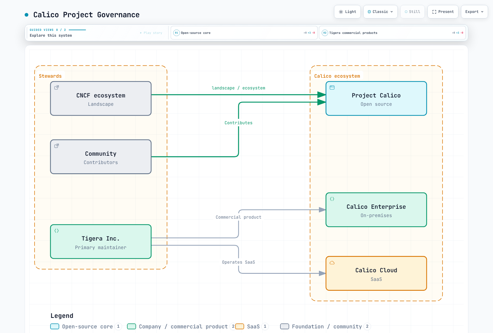

# 第 1 部分：Calico 简介

> **审查基线**：Calico Open Source 3.32.2、kind 0.33.0、Kubernetes 1.36.4
> **最后更新**：2026 年 9 月 12 日。Calico 3.32 针对 Kubernetes 1.34–1.36 进行了测试。

## 实验环境

这个可随时销毁的本地实验显式选择 iptables、VXLAN 和 Calico IPAM。它不替换现有 CNI，也不配置 EKS。审计检查了已发布制品和配置，未创建集群或测试实际流量。

| 工具/环境 | 要求 |
|---|---|
| kind | 0.33.0；固定使用下方 1.36.4 镜像，不接受未固定的默认值 |
| Docker | 受支持且正常工作的运行时，具有容纳三个 kind 节点的容量 |
| 节点操作系统 | 满足 [Calico 要求](https://docs.tigera.io/calico/latest/getting-started/kubernetes/requirements)的 Linux 内核/模块；macOS 上指容器虚拟机的内核 |
| kubectl | 与 API 服务器 1.36 相差不超过一个次版本；使用匹配的 1.36 客户端较方便 |
| calicoctl | 可选的匹配 3.32.2 客户端，适用于实际 CLI 主机操作系统/架构 |
| curl / Python 3 | 用于下方可选客户端下载和 SHA-256 验证 |
| Helm | [概述](README.md)中的可选替代方案，本实验不需要 |

[Kubernetes 版本偏差策略](https://kubernetes.io/releases/version-skew-policy/)不支持任意 `kubectl 1.28+` 与所有后续服务器搭配。创建实验前，请检查 Pod/Service CIDR 是否与容器网络、主机局域网和 VPN 冲突。

### 可选：匹配的 calicoctl

选择一个平台，验证确切发布制品公布的摘要，并将二进制文件保留在实验目录。这些命令不需要全局安装或主目录配置。

```bash
set -euo pipefail
CALICO_VERSION=v3.32.2
case "$(uname -s)" in
  Linux) CALICO_OS=linux ;;
  Darwin) CALICO_OS=darwin ;;
  *) echo "Select a supported calicoctl OS" >&2; exit 1 ;;
esac
case "$(uname -m)" in
  x86_64|amd64) CALICO_ARCH=amd64 ;;
  aarch64|arm64) CALICO_ARCH=arm64 ;;
  *) echo "Select a supported calicoctl architecture" >&2; exit 1 ;;
esac
CALICO_ASSET="calicoctl-$CALICO_OS-$CALICO_ARCH"
curl --fail --location --retry 3 \
  "https://api.github.com/repos/projectcalico/calico/releases/tags/$CALICO_VERSION" \
  --output calico-release.json
curl --fail --location --retry 3 \
  "https://github.com/projectcalico/calico/releases/download/$CALICO_VERSION/$CALICO_ASSET" \
  --output calicoctl
python3 - "$CALICO_ASSET" <<'PY'
import hashlib
import json
import pathlib
import sys

release = json.loads(pathlib.Path("calico-release.json").read_text())
if release["tag_name"] != "v3.32.2":
    raise SystemExit("Unexpected release")
asset = next(a for a in release["assets"] if a["name"] == sys.argv[1])
expected = asset.get("digest") or ""
actual = "sha256:" + hashlib.sha256(pathlib.Path("calicoctl").read_bytes()).hexdigest()
if not expected.startswith("sha256:") or actual != expected:
    raise SystemExit("Digest mismatch or missing published digest")
print("Verified", asset["name"], actual)
PY
chmod +x calicoctl
./calicoctl --help
```

配置实验数据存储后运行 `./calicoctl version`，查看客户端和集群信息。文档中的 `version` 命令没有 `--client` 标志。聚合 API 服务器就绪后，`kubectl` 也可管理 Calico 资源；并非每项操作都必须使用 calicoctl。

### 创建独立 kind 集群

使用未占用的集群名和新的本地 kubeconfig。[kind 0.33.0 发布](https://github.com/kubernetes-sigs/kind/releases/tag/v0.33.0)提供了这个 1.36.4 镜像，位于 Calico 已测试次版本范围内。审计检查了镜像仓库摘要和 amd64/arm64 清单；未下载节点镜像层。

```bash
set -euo pipefail
CALICO_LAB_KUBECONFIG="$PWD/calico-lab.kubeconfig"
test ! -e "$CALICO_LAB_KUBECONFIG"
cat > kind-calico.yaml <<'YAML'
kind: Cluster
apiVersion: kind.x-k8s.io/v1alpha4
networking:
  disableDefaultCNI: true
  kubeProxyMode: iptables
  podSubnet: 10.244.0.0/16
nodes:
  - role: control-plane
  - role: worker
  - role: worker
YAML
kind create cluster --name calico-lab --config kind-calico.yaml \
  --kubeconfig "$CALICO_LAB_KUBECONFIG" \
  --image kindest/node:v1.36.4@sha256:099e049362a1526b2db71494e1947aae99bd16290d7c895f2b7ea312e3cbfaed
export KUBECONFIG="$CALICO_LAB_KUBECONFIG"
export DATASTORE_TYPE=kubernetes
kubectl config current-context
kubectl cluster-info
```

CNI 安装前，节点和普通 Pod 可能保持未就绪。不要通过安装第二个 CNI 来消除此状态。如果 Pod CIDR 冲突，创建集群前应同时修改 kind 和 Installation 中的值。

```bash
CALICO_VERSION=v3.32.2
kubectl create -f "https://raw.githubusercontent.com/projectcalico/calico/$CALICO_VERSION/manifests/v1_crd_projectcalico_org.yaml"
kubectl create -f "https://raw.githubusercontent.com/projectcalico/calico/$CALICO_VERSION/manifests/tigera-operator.yaml"
kubectl -n tigera-operator rollout status deployment/tigera-operator --timeout=300s
kubectl apply -f - <<'YAML'
apiVersion: operator.tigera.io/v1
kind: Installation
metadata:
  name: default
spec:
  kubernetesProvider: Kind
  cni:
    type: Calico
  calicoNetwork:
    linuxDataplane: Iptables
    bgp: Disabled
    ipPools:
      - cidr: 10.244.0.0/16
        blockSize: 26
        encapsulation: VXLAN
        natOutgoing: Enabled
        nodeSelector: all()
---
apiVersion: operator.tigera.io/v1
kind: APIServer
metadata:
  name: default
spec: {}
YAML
kubectl get tigerastatus
kubectl -n calico-system get pods -o wide
```

等待 Operator 创建的工作负载出现，再检查滚动发布及条件。空标签选择结果或一个控制器可用，不能证明所有节点网络正常。

```bash
kubectl -n calico-system rollout status daemonset/calico-node --timeout=300s
kubectl -n calico-system rollout status deployment/calico-kube-controllers --timeout=300s
kubectl wait --for=condition=Available apiservice/v3.projectcalico.org --timeout=300s
kubectl wait --for=condition=Ready nodes --all --timeout=300s
kubectl get ippools.projectcalico.org -o wide
kubectl get installations.operator.tigera.io default -o yaml
# Optional, if the matching local client was downloaded:
./calicoctl version
./calicoctl get nodes
```

此处禁用 BGP，因此 BIRD 会话和 `calicoctl node status` 不是就绪标准。该命令还需要适当的节点环境，而不只是笔记本电脑上的 kubeconfig。观察实际组件数量；CSI/Typha 副本数并非固定。使用可销毁的工作负载检查 Pod、Service、DNS 连通性，以及策略允许和拒绝的流量。

## Calico 提供什么

Calico 结合 Kubernetes 网络、IPAM 和策略执行。在仅策略集成中，由其他 CNI 保有网络和 IPAM 职责。功能因操作系统、数据平面和产品版本而异；平台被列为受支持并不承诺相同行为。

## 项目历史与治理

Project Calico 于 2014 年起源于 Metaswitch；Tigera 于 2016 年成立，是其主要维护者。以下发布记录纠正之前的 3.0/3.29 日期，并区分最初的 eBPF 预览与后续功能可用性。

| 日期 | 一手发布记录 |
|---|---|
| 2017 年 12 月 21 日 | [Calico 3.0.0](https://github.com/projectcalico/calico/releases/tag/v3.0.0)，历史版本，并非安装建议 |
| 2020 年 2 月 25 日 | [eBPF 引入](https://www.tigera.io/blog/introducing-the-calico-ebpf-dataplane/)：宣布为 **3.13 技术预览**，并非正式可用 |
| 2024 年 10 月 29 日 | [Calico 3.29.0](https://github.com/projectcalico/calico/releases/tag/v3.29.0) |
| 2026 年 8 月 30 日 | [Calico 3.32.2](https://github.com/projectcalico/calico/releases/tag/v3.32.2)，本次审查基线 |

旧时间线中“eBPF 功能完全对等”和“Windows eBPF”的说法不正确。当前 [Windows 限制](https://docs.tigera.io/calico/latest/getting-started/kubernetes/windows-calico/limitations)仍排除 Linux eBPF、IPIP、IPv6/双栈和 WireGuard。

Calico 采用 Apache-2.0 许可证，由 Tigera 和社区维护。列入 CNCF Landscape 不代表 CNCF 拥有该项目，也不代表孵化或毕业。Enterprise 是商业自主管理产品；Cloud 是 SaaS 服务。Open Source 不限于小型或非生产集群。



[🔍 查看交互式图表](https://www.atomai.click/kubernetes-docs/archmaps/en-networking-calico-01-introduction-4.html)

CNCF 方框仅表示参与 Landscape/生态系统。Tigera 维护开源项目及自身产品；图中的分组不赋予 CNCF 治理权。

## 核心能力

### 1. 网络和数据平面

封装与实现是独立选择。Calico 可使用 IPIP、VXLAN 或路由底层网络。CrossSubnet 是条件式 IPIP/VXLAN 设置，不是广域网连接服务。Linux 数据平面包括 iptables、nftables 和 eBPF。eBPF **运行在内核内部**，可绕过其传统数据包处理路径的部分环节；它不绕过内核。仅在底层网络具有所需 Pod 路由时，非封装路由才能省去隧道标头，并不保证所有工作负载都获得最低延迟。

### 2. Kubernetes 和 Calico 策略

Kubernetes NetworkPolicy 属于命名空间作用域，规则可叠加。Calico 添加显式操作、有序策略和层，Open Source 也包含策略层。GlobalNetworkPolicy 具有集群资源作用域，但可以只选择一个命名空间。HostEndpoint 描述要保护的主机端点；它不是固定层次中位于 NetworkPolicy 下的第三种策略类型。

这些是专用命名空间中的**独立示例**。应考虑现有策略层和更高优先级策略；两者都不是完整安全基线。

```yaml
apiVersion: v1
kind: Namespace
metadata:
  name: calico-demo
---
apiVersion: networking.k8s.io/v1
kind: NetworkPolicy
metadata:
  name: default-deny-ingress
  namespace: calico-demo
spec:
  podSelector: {}
  policyTypes: [Ingress]
  ingress: []
```

```yaml
apiVersion: projectcalico.org/v3
kind: GlobalNetworkPolicy
metadata:
  name: calico-demo-trusted-ingress
spec:
  namespaceSelector: kubernetes.io/metadata.name == 'calico-demo'
  selector: app == 'backend'
  order: 100
  types: [Ingress]
  ingress:
    - action: Allow
      protocol: TCP
      source:
        namespaceSelector: kubernetes.io/metadata.name == 'calico-demo'
        selector: trusted == 'true'
      destination:
        ports: [8080]
    - action: Deny
```

Calico 示例允许匹配演示命名空间的端点通过 TCP 8080 访问选定后端，然后拒绝其他入站流量。保护标签写入权限：`trusted` 不是密码学身份。这些示例不配置出站流量或 DNS。支持 CIDR/端口规则，但大型私有 CIDR 不是身份边界。DNS/FQDN 和应用层策略需要适当的 Enterprise/Cloud 功能；参阅[版本矩阵](https://docs.tigera.io/calico/latest/about/calico-product-editions)。

### 3. IP 地址管理

Calico 负责 IPAM 时，池和块控制分配。IPv4 /26 块包含 64 个地址，不保证每个平台都有 64 个可用 Pod 地址；Windows 预留部分地址，IPv6 的默认值也不同。在 VPC CNI 仅策略模式下，AWS 负责 IPAM。

此示例演示 [IPPool API](https://docs.tigera.io/calico/latest/reference/resources/ippool)。**不要在存在重叠的 Operator 管理池时创建它。** kind 实验已有池；封装/IPAM 更改是需要单独规划的练习。

```yaml
apiVersion: projectcalico.org/v3
kind: IPPool
metadata:
  name: example-ipv4-pool
spec:
  cidr: 10.244.0.0/16
  blockSize: 26
  ipipMode: Never
  vxlanMode: Always
  natOutgoing: true
  nodeSelector: all()
```

多个不重叠池及节点选择器可分离地址分配。`natOutgoing` 通常作用于离开 Calico 池的流量；它不是防火墙或加密设置。没有底层网络设计，直接路由和 CrossSubnet 都不能连接不同站点。

### 4. BGP 路由

BGP 分发路由；应用数据包不经过 BIRD 进程，BGP 也不加密数据包。BGP 可支持直接路由，或与 IPIP 共存。全互联、路由反射器和外部对等体是拓扑选择。

以下属于**独立路由实验**，不适用于禁用 BGP 的 kind 示例。用设计好的拓扑和匹配路由器配置替换文档地址、ASN 和节点标签。替代路由分发正常工作前，不要禁用节点全互联。

```yaml
apiVersion: projectcalico.org/v3
kind: BGPConfiguration
metadata:
  name: default
spec:
  logSeverityScreen: Info
  nodeToNodeMeshEnabled: true
  asNumber: 64512
---
apiVersion: projectcalico.org/v3
kind: BGPPeer
metadata:
  name: example-rack-tor
spec:
  peerIP: 192.0.2.1
  asNumber: 64513
  nodeSelector: rack == 'rack-1'
```

BGPPeer 支持使用 `password.secretKeyRef` 进行会话身份验证。Secret 位于 Calico 节点组件的命名空间，路由器必须使用匹配凭证；这不会加密工作负载流量。Service CIDR 通告和移除全互联需要额外测试；参阅 [BGP 深入解析](04-bgp-deep-dive.md)。

### 5. 平台和规模边界

| 环境 | 边界 |
|---|---|
| EKS | VPC CNI + Calico 策略是一种集成；完整 Calico CNI 是独立的新集群设计 |
| AKS | 检查提供商支持的 CNI/策略组合及当前安装流程 |
| GKE | Dataplane V2 使用 **Cilium**；Calico 适用于相关旧配置，不应安装在 V2 之上 |
| 自主管理 Kubernetes | 检查发行版、内核、CNI 所有权、路由和权限 |
| Windows | 特定 IPv4 配置；不具备 Linux eBPF、IPIP、IPv6/双栈或 WireGuard 功能对等性 |
| 主机 / 虚拟机 | 独立安装和功能要求；KubeVirt/Enterprise 状态不同于基本主机保护 |

[GKE 文档](https://cloud.google.com/kubernetes-engine/docs/concepts/dataplane-v2)明确区分 V2 中的 Cilium 和旧版 Calico 路径。

Typha 通过独立一组 Pod 缓存和分发更新，减少 Felix 对数据存储的直接监视。三个副本只是示例，不是通用最低要求。容量取决于策略、端点、Service 变动、硬件、数据存储和数据平面。本简介没有可复现证据支持固定的“5,000 节点 / 100,000 Pod / 数百万规则”限制。

## Calico、kube-proxy 和性能

kube-proxy 实现 Service 转发，不负责 CNI 网络或 NetworkPolicy。Calico 标准数据平面可与其并用，如本实验；eBPF 数据平面经配置后可替代 Service 处理。

| 关注点 | 比较内容 |
|---|---|
| Pod 网络/IPAM | 相同拓扑下的 CNI/IPAM 实现 |
| Service 转发 | 所选 kube-proxy 后端或 eBPF 替代方案 |
| 策略 | 等效规则和执行覆盖范围 |
| 规模 | Service/端点、选择器、变动和连接复用 |
| CPU/内存/延迟 | 硬件、内核、版本、工作负载、预热、重复测试和错误 |

kube-proxy 不仅支持 iptables：当前 Kubernetes 也提供 nftables，以及依版本而异的旧后端。IP 集合查找不意味着整个 Calico 数据包路径为 O(1)。首次 iptables Service NAT 选择也不同于后续数据包的 conntrack 快速路径。之前没有来源的 1,000 节点/50,000 Pod 规则数、延迟和内存示例不是可复现基准，不应用于容量规划。

传统虚拟机网络也可自动化和分布式运行。Calico 声明式策略不意味着无限 IP 容量，也不保证秒级收敛。

## 部署场景

- **本地部署**：协调 Pod 路由、BGP 对等体/过滤器、返回路径和主机保护。仅禁用封装不会创建底层网络路由。
- **EKS**：要保留 AWS 网络，选择 `cni.type: AmazonVPC` 并遵循[已审查概述](README.md)，包括策略引擎所有权和 Pod IP 注解。不要将 EKS Installation 应用于此 Kind 实验，也不要运行两个策略引擎。
- **混合/多集群**：连接、发现和策略管理是独立功能。CrossSubnet IPPool 不建立 VPN、共享身份或跨集群发现。应分别评估适当的集群网格/多集群产品功能和底层网络；“Calico Federation”不是通用内置连接。
- **受监管工作负载**：Enterprise/Cloud 可添加报告、日志和安全功能；安装它们不代表已合规。API 审计日志记录 API 更改，流日志记录网络观测，不会自动记录每个策略执行决策。受支持的 Open Source Linux 配置也提供 WireGuard。

## 社区与源码开发

当前 Slack/会议链接参阅[社区页面](https://www.tigera.io/project-calico/community/)，可复现报告提交至[问题跟踪器](https://github.com/projectcalico/calico/issues)，并参阅[贡献者指南](https://github.com/projectcalico/calico/blob/v3.32.2/CONTRIBUTING.md)。不要假定未注明日期的双周安排或旧论坛 URL 仍有效。

源码学习方面，[开发者指南](https://github.com/projectcalico/calico/blob/v3.32.2/DEVELOPER_GUIDE.md)介绍 Linux/Docker/git/make 环境和组件专属测试。根目录不存在 `make dev-environment` 目标。此可选源码流程独立于网络实验，审计期间未执行：

```bash
git clone --depth 1 --branch v3.32.2 https://github.com/projectcalico/calico.git calico-source-study
cd calico-source-study
# Read prerequisites and the selected component's Makefile before running tests.
cat DEVELOPER_GUIDE.md
make -C calicoctl test
```

Open Source 为生产和实验环境提供社区支持的网络与策略。Enterprise 增加商业能力/支持；Cloud 提供 SaaS 管理。应按[功能矩阵](https://docs.tigera.io/calico/latest/about/calico-product-editions)选择，而非一概套用“小集群与大集群”的规则。

## 清理可销毁实验

保存结果后，使用 `kind delete cluster --name calico-lab`，仅移除本练习创建的 `calico-lab` 集群。保留无关集群和 kubeconfig。本地清理不是 EKS 删除流程。

[下一篇：Calico 架构](02-architecture.md) · [Calico 概述](README.md) · [简介测验](../../quizzes/networking/calico/01-introduction-quiz.md)
