# 第 2 部分：架构

> **支持的版本**：Calico v3.29+ / Kubernetes 1.28+ **最后更新**：February 23, 2026

## 概述

本节深入介绍 Calico 的架构。了解每个组件的工作方式及其相互交互，对于在生产环境中有效部署、排查故障和优化 Calico 至关重要。

## 完整架构图


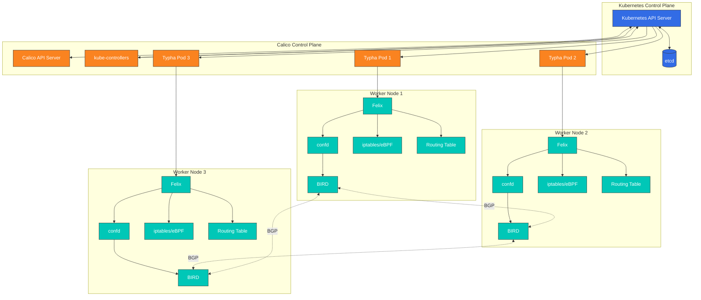

## Felix：Calico 代理

Felix 是运行在集群中每个节点上的主要 Calico 代理。它负责在主机上配置路由和 ACL（访问控制列表），以提供所需的连通性并实施网络策略。

### Felix 职责

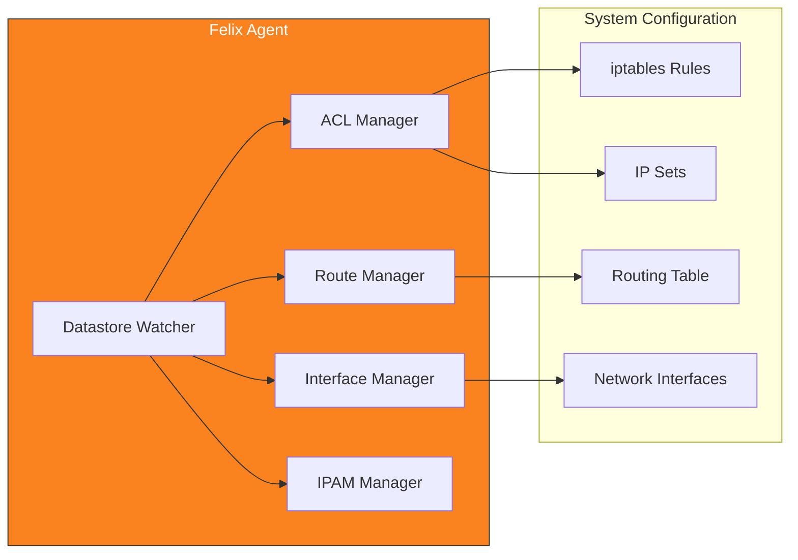

### 核心功能

1. **路由配置**：管理 Pod CIDR 块的路由
2. **ACL 实施**：为网络策略配置 iptables/nftables/eBPF 规则
3. **接口管理**：配置工作负载端点接口
4. **健康状态报告**：向 datastore 报告节点和端点的健康状态
5. **IPAM 协调**：管理本地工作负载的 IP 地址分配

### Felix 数据平面选项

Felix 支持多个数据平面后端：

| 数据平面 | 描述 | 最适合 |
| ------------ | -------------------------- | ------------------------------------------- |
| **iptables** | 传统 Linux 防火墙 | 兼容性、成熟的部署 |
| **nftables** | 现代 Linux 防火墙 | 较新的内核、更高的性能 |
| **eBPF** | 内核内可编程 | 极致性能、替代 kube-proxy |

### FelixConfiguration 资源

```yaml
apiVersion: projectcalico.org/v3
kind: FelixConfiguration
metadata:
  name: default
spec:
  # Logging configuration
  logSeverityScreen: Info
  logSeverityFile: Warning
  logFilePath: /var/log/calico/felix.log

  # Data plane selection
  bpfEnabled: false                    # Set true for eBPF data plane
  bpfDataIfacePattern: ^((en|wl|eth).*|bond[0-9]+)$
  bpfConnectTimeLoadBalancingEnabled: true
  bpfExternalServiceMode: Tunnel

  # iptables configuration
  iptablesBackend: Auto               # Auto, Legacy, NFT
  iptablesRefreshInterval: 90s
  iptablesPostWriteCheckIntervalSecs: 1
  iptablesLockFilePath: /run/xtables.lock
  iptablesLockTimeoutSecs: 0
  iptablesLockProbeIntervalMillis: 50

  # Performance tuning
  ipipMTU: 1440
  vxlanMTU: 1410
  wireguardMTU: 1420

  # Health and metrics
  healthEnabled: true
  healthPort: 9099
  prometheusMetricsEnabled: true
  prometheusMetricsPort: 9091
  prometheusGoMetricsEnabled: true
  prometheusProcessMetricsEnabled: true

  # Policy configuration
  defaultEndpointToHostAction: Drop
  failsafeInboundHostPorts:
    - protocol: TCP
      port: 22
    - protocol: UDP
      port: 68
  failsafeOutboundHostPorts:
    - protocol: UDP
      port: 53
    - protocol: UDP
      port: 67

  # Interface configuration
  interfacePrefix: cali
  chainInsertMode: Insert

  # Reporting
  reportingIntervalSecs: 30
  reportingTTLSecs: 90
```

### Felix iptables 规则结构

Felix 将 iptables 规则组织为链，以实现高效处理：

```
                         ┌─────────────────────────────────────────┐
                         │              FORWARD Chain              │
                         └─────────────────┬───────────────────────┘
                                           │
                         ┌─────────────────▼───────────────────────┐
                         │          cali-FORWARD (Calico)          │
                         └─────────────────┬───────────────────────┘
                                           │
              ┌────────────────────────────┼────────────────────────────┐
              │                            │                            │
┌─────────────▼─────────────┐ ┌────────────▼────────────┐ ┌─────────────▼─────────────┐
│   cali-from-wl-dispatch   │ │   cali-to-wl-dispatch   │ │    cali-from-host-ep     │
│  (from workload traffic)  │ │  (to workload traffic)  │ │   (from host endpoints)   │
└─────────────┬─────────────┘ └────────────┬────────────┘ └─────────────┬─────────────┘
              │                            │                            │
┌─────────────▼─────────────┐ ┌────────────▼────────────┐ ┌─────────────▼─────────────┐
│    cali-fw-caliXXXXXX     │ │    cali-tw-caliXXXXXX   │ │    Per-endpoint policy    │
│    (per-endpoint rules)   │ │   (per-endpoint rules)  │ │          chains           │
└───────────────────────────┘ └─────────────────────────┘ └───────────────────────────┘
```

### Felix 数据流

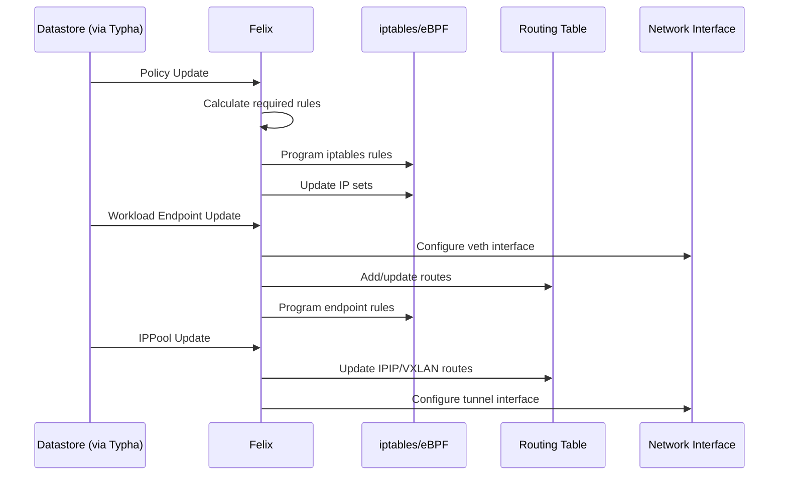

## BIRD：BGP 路由守护进程

BIRD（BIRD Internet Routing Daemon）是 Calico 用于在节点间分发路由的 BGP 守护进程。

### Calico 架构中的 BIRD

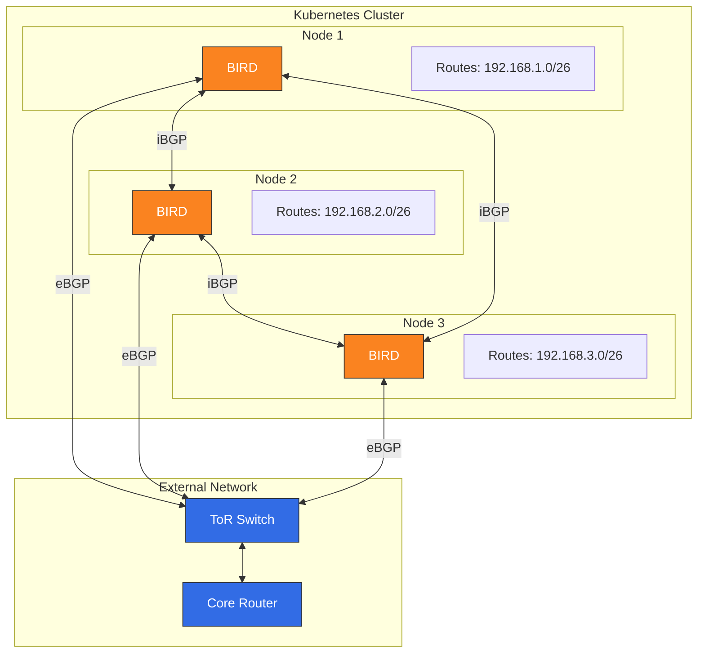

### BGP 会话类型

| 会话类型 | 使用场景 | 配置 |
| --------------------- | --------------------------- | ---------------------- |
| **节点间 Mesh** | 小型集群的默认选项 | 自动、全 Mesh |
| **路由反射器** | 大型集群（100+ 节点） | 专用 RR 节点 |
| **外部对等互连** | 本地部署集成 | 手动配置 BGP peer |

### BGP 配置示例

#### 节点间 Mesh（默认）

```yaml
apiVersion: projectcalico.org/v3
kind: BGPConfiguration
metadata:
  name: default
spec:
  logSeverityScreen: Info
  nodeToNodeMeshEnabled: true
  asNumber: 64512
```

#### 路由反射器配置

```yaml
# Disable node-to-node mesh
apiVersion: projectcalico.org/v3
kind: BGPConfiguration
metadata:
  name: default
spec:
  nodeToNodeMeshEnabled: false
  asNumber: 64512
---
# Configure route reflector nodes
apiVersion: projectcalico.org/v3
kind: Node
metadata:
  name: node-rr-1
  labels:
    route-reflector: "true"
spec:
  bgp:
    routeReflectorClusterID: 224.0.0.1
---
# Configure BGP peer to route reflector
apiVersion: projectcalico.org/v3
kind: BGPPeer
metadata:
  name: peer-to-rr
spec:
  nodeSelector: "!has(route-reflector)"
  peerSelector: route-reflector == "true"
```

#### 外部 BGP 对等互连

```yaml
apiVersion: projectcalico.org/v3
kind: BGPPeer
metadata:
  name: tor-switch-peer
spec:
  peerIP: 10.0.0.1
  asNumber: 65001
  nodeSelector: rack == 'rack-1'
  password:
    secretKeyRef:
      name: bgp-passwords
      key: tor-password
  sourceAddress: UseNodeIP
  keepOriginalNextHop: false
```

### 路由传播过程

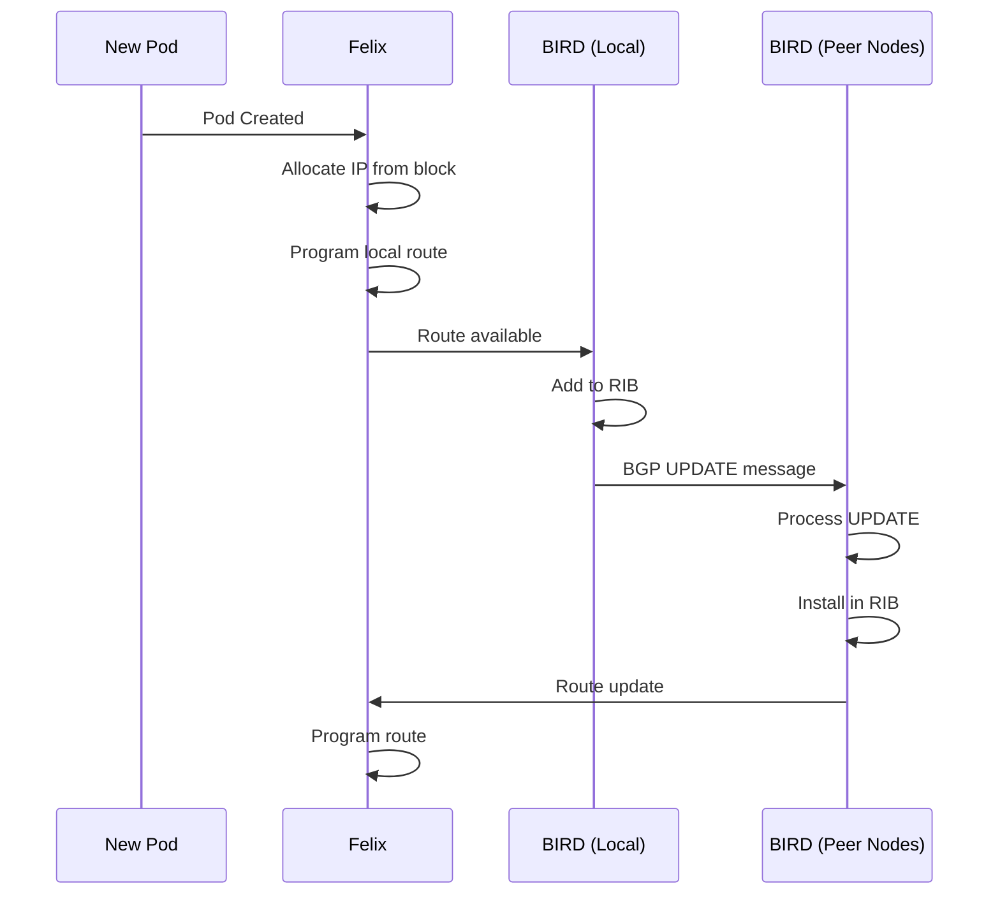

### BIRD 状态命令

```bash
# Access BIRD CLI on a Calico node
kubectl exec -n calico-system calico-node-xxxxx -c calico-node -- birdcl

# Show BGP protocol status
birdcl> show protocols
name     proto    table    state  since       info
kernel1  Kernel   master   up     2024-01-01
device1  Device   master   up     2024-01-01
direct1  Direct   master   up     2024-01-01
Mesh_10_0_1_10  BGP  master  up   2024-01-01  Established
Mesh_10_0_1_11  BGP  master  up   2024-01-01  Established

# Show BGP routes
birdcl> show route protocol Mesh_10_0_1_10
192.168.1.0/26     via 10.0.1.10 on eth0 [Mesh_10_0_1_10 2024-01-01] * (100/0) [i]
192.168.1.64/26    via 10.0.1.10 on eth0 [Mesh_10_0_1_10 2024-01-01] * (100/0) [i]

# Show route details
birdcl> show route 192.168.1.0/26 all
```

## confd：配置管理

confd 是一个轻量级配置管理工具，它会监视 Calico datastore 并生成 BIRD 配置文件。

### confd 工作流程

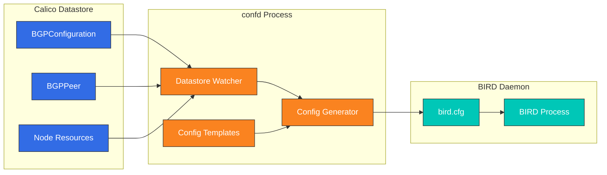

### confd 模板处理

confd 使用 Go 模板生成 BIRD 配置：

```
# Template: /etc/calico/confd/templates/bird.cfg.template
# Output: /etc/calico/confd/config/bird.cfg

router id {{.NodeIP}};

protocol kernel {
    learn;
    persist;
    scan time 2;
    import all;
    export {{if .ExportKernel}}all{{else}}none{{end}};
}

protocol device {
    scan time 2;
}

{{range .BGPPeers}}
protocol bgp {{.Name}} {
    local as {{$.LocalAS}};
    neighbor {{.PeerIP}} as {{.PeerAS}};
    import all;
    export {{if .ExportFilter}}filter {{.ExportFilter}}{{else}}all{{end}};
    {{if .Password}}password "{{.Password}}";{{end}}
    graceful restart;
}
{{end}}
```

## Typha：扩缩容组件

Typha 是位于 Kubernetes API server 与 Felix 代理之间的扇出代理。它通过缓存和分发 datastore 更新来降低 API server 的负载。

### 为什么需要 Typha？

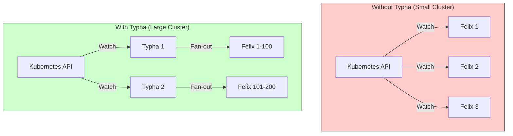

### Typha 扩缩容计算

建议的 Typha 副本数取决于集群规模：

```
Typha Replicas = max(3, ceil(Nodes / 200))

Examples:
- 50 nodes:   3 Typha replicas (minimum)
- 200 nodes:  3 Typha replicas
- 500 nodes:  3 Typha replicas
- 1000 nodes: 5 Typha replicas
- 2000 nodes: 10 Typha replicas
```

### Typha Deployment 配置

```yaml
apiVersion: apps/v1
kind: Deployment
metadata:
  name: calico-typha
  namespace: calico-system
spec:
  replicas: 3
  revisionHistoryLimit: 2
  selector:
    matchLabels:
      k8s-app: calico-typha
  strategy:
    type: RollingUpdate
    rollingUpdate:
      maxSurge: 1
      maxUnavailable: 1
  template:
    metadata:
      labels:
        k8s-app: calico-typha
    spec:
      nodeSelector:
        kubernetes.io/os: linux
      tolerations:
      - key: CriticalAddonsOnly
        operator: Exists
      priorityClassName: system-cluster-critical
      serviceAccountName: calico-typha
      containers:
      - name: calico-typha
        image: calico/typha:v3.29.0
        ports:
        - containerPort: 5473
          name: calico-typha
          protocol: TCP
        env:
        - name: TYPHA_LOGSEVERITYSCREEN
          value: "info"
        - name: TYPHA_LOGFILEPATH
          value: "none"
        - name: TYPHA_LOGSEVERITYSYS
          value: "none"
        - name: TYPHA_CONNECTIONREBALANCINGMODE
          value: "kubernetes"
        - name: TYPHA_DATASTORETYPE
          value: "kubernetes"
        - name: TYPHA_HEALTHENABLED
          value: "true"
        - name: TYPHA_PROMETHEUSMETRICSENABLED
          value: "true"
        - name: TYPHA_PROMETHEUSMETRICSPORT
          value: "9093"
        livenessProbe:
          httpGet:
            path: /liveness
            port: 9098
          periodSeconds: 30
          initialDelaySeconds: 30
        readinessProbe:
          httpGet:
            path: /readiness
            port: 9098
          periodSeconds: 10
        resources:
          requests:
            cpu: 100m
            memory: 128Mi
          limits:
            cpu: 1000m
            memory: 512Mi
---
apiVersion: v1
kind: Service
metadata:
  name: calico-typha
  namespace: calico-system
spec:
  ports:
  - port: 5473
    protocol: TCP
    targetPort: calico-typha
    name: calico-typha
  selector:
    k8s-app: calico-typha
```

### Typha 扇出架构

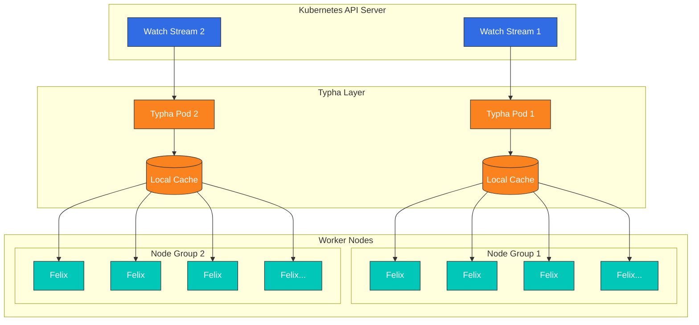

## kube-controllers：Kubernetes 集成

calico-kube-controllers Pod 运行一组控制器，用于将 Kubernetes 资源与 Calico datastore 同步。

### 控制器概览

| 控制器 | 用途 |
| ------------------------------- | ------------------------------------------------- |
| **Node Controller** | 将 Kubernetes 节点与 Calico 节点资源同步 |
| **Policy Controller** | 将 Kubernetes NetworkPolicy 与 Calico 策略同步 |
| **Namespace Controller** | 为 profile 管理同步 namespace 标签 |
| **ServiceAccount Controller** | 为 RBAC 同步 service account 标签 |
| **WorkloadEndpoint Controller** | 清理过期的工作负载端点 |

### 控制器协调循环

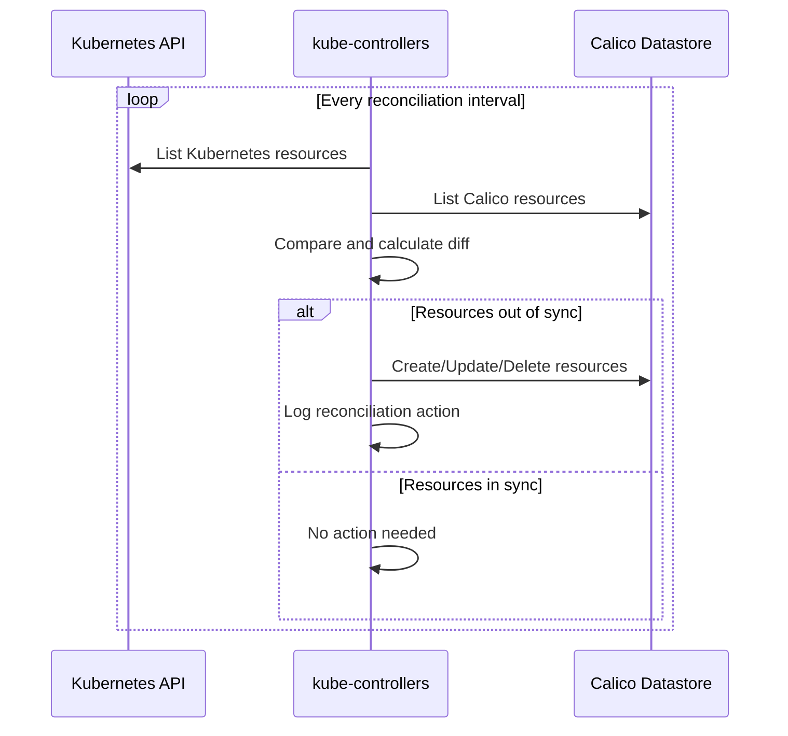

### kube-controllers 配置

```yaml
apiVersion: v1
kind: ConfigMap
metadata:
  name: calico-kube-controllers-config
  namespace: calico-system
data:
  config: |
    {
      "logSeverityScreen": "info",
      "healthEnabled": true,
      "prometheusPort": 9094,
      "controllers": {
        "node": {
          "hostEndpoint": {
            "autoCreate": "Disabled"
          },
          "syncLabels": "Enabled",
          "leakGracePeriod": "15m"
        },
        "policy": {
          "reconcilerPeriod": "5m"
        },
        "workloadEndpoint": {
          "reconcilerPeriod": "5m"
        },
        "namespace": {
          "reconcilerPeriod": "5m"
        },
        "serviceAccount": {
          "reconcilerPeriod": "5m"
        }
      }
    }
```

## Datastore 选项

Calico 支持两种 datastore 后端来存储其配置和状态。

### Kubernetes API Datastore（推荐）

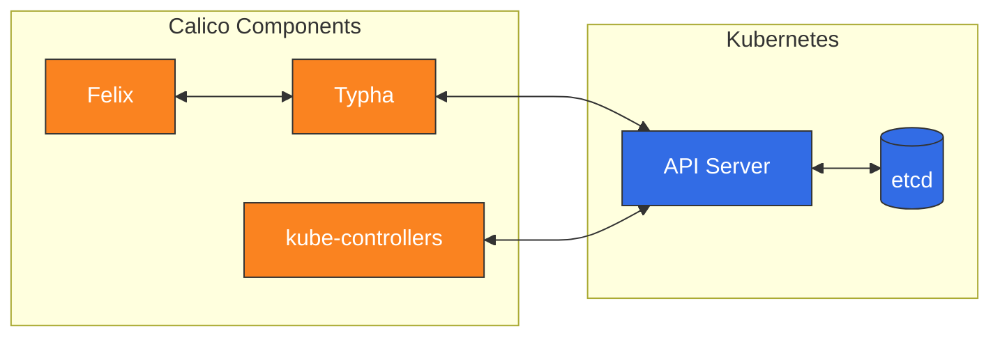

**优势：**

* 无需管理单独的 etcd 集群
* 使用 Kubernetes RBAC 进行访问控制
* 运维模型更简单
* 可与任何 Kubernetes 发行版配合使用

### etcd Datastore（旧版）

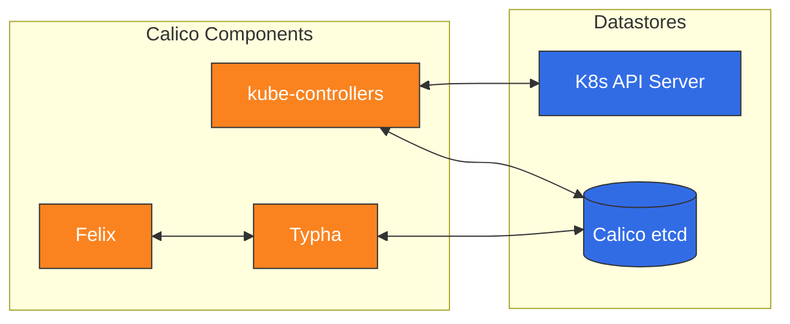

**优势：**

* 与 Kubernetes API server 解耦
* 可用于非 Kubernetes 工作负载（VM、裸金属）
* 超大型集群的历史选项

### Datastore 对比

| 功能 | Kubernetes API | etcd |
| -------------------------- | ----------------- | ------------------ |
| **运维复杂度** | 较低 | 较高 |
| **可扩展性** | 良好（使用 Typha） | 优秀 |
| **非 K8s 工作负载** | 有限 | 完全支持 |
| **备份/恢复** | 通过 K8s | 独立工具 |
| **访问控制** | K8s RBAC | etcd 认证 |
| **建议** | 默认选择 | 仅限特殊场景 |

## 组件交互序列

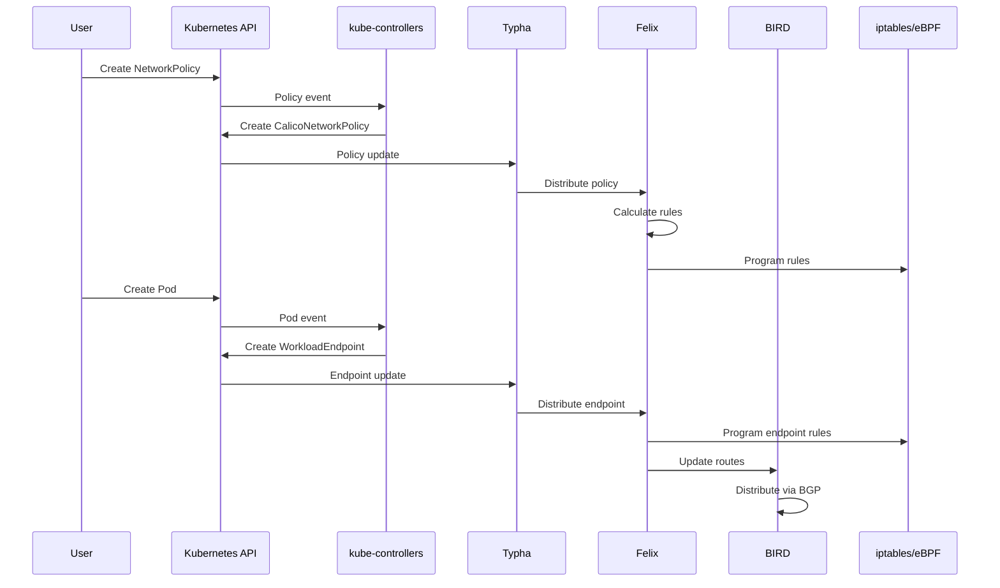

## 数据包流分析

### 入站数据包流（Pod 到 Pod，同一节点）

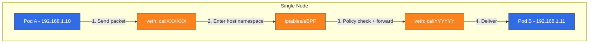

### 出站数据包流（Pod 到 Pod，使用 IPIP 的不同节点）

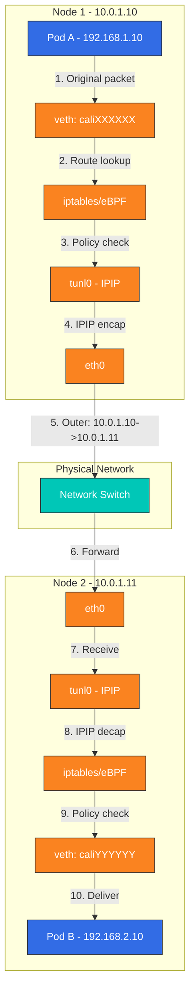

### 数据包结构对比

```
Original Pod-to-Pod Packet:
┌─────────────────────────────────────────────────────────────┐
│ Ethernet │   IP Header    │   TCP/UDP   │     Payload      │
│  Header  │ Src: 192.168.1.10 │   Header    │                  │
│          │ Dst: 192.168.2.10 │             │                  │
└─────────────────────────────────────────────────────────────┘

IPIP Encapsulated Packet:
┌───────────────────────────────────────────────────────────────────────────────┐
│ Ethernet │   Outer IP     │   Inner IP     │   TCP/UDP   │     Payload      │
│  Header  │ Src: 10.0.1.10 │ Src: 192.168.1.10 │   Header    │                  │
│          │ Dst: 10.0.1.11 │ Dst: 192.168.2.10 │             │                  │
│          │ Proto: 4 (IPIP)│                │             │                  │
└───────────────────────────────────────────────────────────────────────────────┘
```

## 总结

Calico 的架构旨在实现可扩展性、高性能和简化运维：

1. **Felix**：每个节点上的核心代理，负责配置路由和 ACL
2. **BIRD**：通过 BGP 分发路由，实现原生路由集成
3. **confd**：连接 datastore 与 BIRD 配置
4. **Typha**：通过降低 API server 负载来扩展系统
5. **kube-controllers**：保持 Kubernetes 和 Calico 同步
6. **Datastore**：使用 Kubernetes API（推荐）或 etcd 存储配置

了解这些组件及其交互方式，对于以下工作至关重要：

* 排查连通性问题
* 大规模优化性能
* 规划容量和架构
* 与现有网络基础设施集成

[上一节：第 1 部分 - Calico 简介](01-introduction.md)

[下一节：第 3 部分 - 网络模式](03-networking-modes.md)

[返回 Calico 概览](./)

## 测验

要测试你在本章中学到的内容，请尝试完成[架构测验](../../quizzes/networking/calico/02-architecture-quiz.md)。
