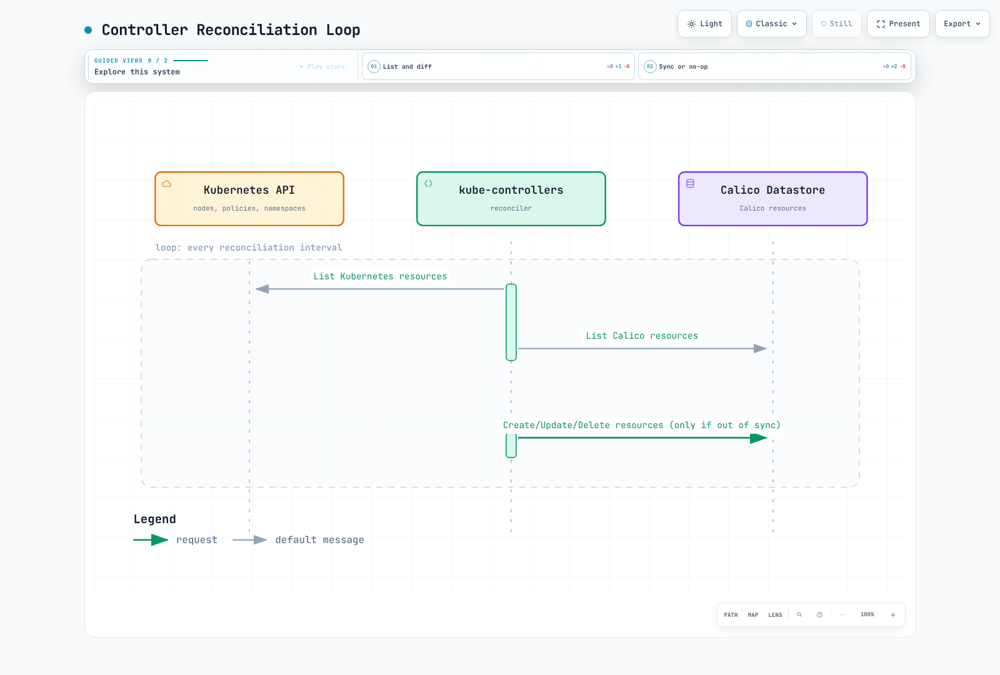

# 第 2 部分：架构

> **审查基线**：Calico Open Source 3.32.2 / Operator 1.42.6；Calico 3.32 针对 Kubernetes 1.34–1.36 进行了测试。
> **最后更新**：2026 年 9 月 12 日。示例是配置参考，并非实际集群验证。

## 概述

本节深入探讨 Calico 架构。了解各组件的工作方式和交互，对于在生产环境中有效部署、排障和优化 Calico 至关重要。

## 完整架构图


[🔍 查看交互式图表](https://www.atomai.click/kubernetes-docs/archmaps/en-networking-calico-02-architecture-0.html)

这是简化的控制状态图。BIRD 连线省略了负责渲染其配置的 confd；Typha 不是直接的 BIRD 配置 API。BIRD/confd 和 Typha 是否存在取决于安装模式，图中未展示所有控制平面组件。

## Felix：Calico 代理

Felix 在选定工作负载节点的 Calico 节点代理中运行，在内核中配置适用路由、接口设置和策略。在 Linux 完整网络路径中，容器运行时调用 CNI 链，CNI/IPAM 插件创建接口并分配地址。Felix 异步观察端点变化；它不是直接 CNI ADD 调用的处理程序。Operator、平台和网络模式决定具体组件。

### Felix 职责

Linux CNI/IPAM 创建 Pod 接口和地址。Felix 协调端点状态与内核策略。提供 HTTP 健康服务和向数据存储报告状态是独立功能。

### 核心功能

1. **路由编程**：协调适用的工作负载和隧道路由；BGP 模式下，BIRD 内核协议也安装学习到的路由
2. **ACL 执行**：为网络策略配置 iptables/nftables/eBPF 规则
3. **接口管理**：协调端点接口状态及相关内核设置；Linux veth 创建属于 CNI 路径
4. **健康报告**：向数据存储报告节点和端点健康状况
5. **端点协调**：监视工作负载端点状态并配置适用策略/路由；CNI/IPAM 插件分配地址并创建 Linux Pod 接口

### Felix 数据平面选项

Felix 支持多种数据平面后端：

| 数据平面 | 描述 | 适用场景 |
| ------------ | -------------------------- | ------------------------------------------- |
| **iptables** | 传统 Linux 防火墙 | 兼容性、成熟部署 |
| **nftables** | 原生 nftables 实现 | 检查受支持内核、平台和功能集 |
| **eBPF** | 内核内可编程 | 可选的 Service 处理；需要协调迁移和受支持功能 |

### FelixConfiguration 资源

```yaml
apiVersion: projectcalico.org/v3
kind: FelixConfiguration
metadata:
  name: default
spec:
  logSeverityScreen: Info
  healthEnabled: true
  healthPort: 9099
  prometheusMetricsEnabled: true
  prometheusMetricsPort: 9091
  reportingInterval: 30s
  reportingTTL: 90s
```

此最小示例使用 Calico 3.32.2 接受的字段。通过配置所有者应用更改；它不是数据平面迁移或性能调优方案。Felix 健康服务主机默认是 localhost。启用指标不会配置 Prometheus 抓取，也不意味着适合公开暴露。

| 配置关注点 | 正确所有者 / 解释 |
|---|---|
| Linux 数据平面 | Operator `Installation.spec.calicoNetwork.linuxDataplane` 为受支持配置选择 `Iptables`、`Nftables` 或 `BPF` |
| `bpfEnabled` | 底层 Felix 设置；应协调 Operator 管理的转换和 kube-proxy/API 可达性，而不是只修改此项 |
| `iptablesBackend: NFT` | 选择 iptables-nft 工具后端，不是原生 Calico nftables 数据平面 |
| 连接时负载均衡 | 当前字段为 `bpfConnectTimeLoadBalancing: TCP`、`Enabled` 或 `Disabled`；旧布尔字段 `bpfConnectTimeLoadBalancingEnabled` 仍被接受，但已弃用 |
| 节点地址检测 | Operator `calicoNetwork.nodeAddressAutodetectionV4` / `V6`，或清单管理安装中的节点启动环境；不是名为 `ipAutoDetectionMethod` 或 `ipv6AutoDetectionMethod` 的 Felix 字段 |
| 流量可见性 | 使用受支持的 Goldmane/Whisker 配置；Open Source 不接受之前示例中的 Enterprise 文件日志字段 |
| MTU 和隧道模式 | 根据底层网络、封装和加密推导；协调 Installation/IPPool 设置，不要随意设为 1440/1410/1420 或启用所有隧道 |
| 主机故障安全端口 | 替换默认列表前审核实际 API/BGP/etcd/管理可达性；旧的缩短列表可能移除必要例外 |
| 持续时间 | 使用 `reportingInterval`、`reportingTTL`、`iptablesPostWriteCheckInterval` 和 `iptablesLockProbeInterval` 等当前名称；不要机械追加 `Secs`/`Millis` |

发布模式拒绝旧名称 `iptablesLockFilePath`、`iptablesLockTimeoutSecs`、`iptablesLockProbeIntervalMillis`、`iptablesPostWriteCheckIntervalSecs`、`reportingIntervalSecs` 和 `reportingTTLSecs`。参阅 [Felix 资源参考](https://docs.tigera.io/calico/latest/reference/resources/felixconfig)和 [Operator API](https://docs.tigera.io/calico/latest/reference/installation/api)。地址或数据平面更改需要各自的滚动发布检查。

### Felix iptables 规则结构

以下是[发布规则定义](https://github.com/projectcalico/calico/blob/v3.32.2/felix/rules/rule_defs.go)中选取的前缀，不是完整链图。它们描述 iptables 数据平面；请检查已安装模式及配置的实际规则。

| 链/前缀 | 作用 |
|---|---|
| `cali-FORWARD` | Calico 转发钩子 |
| `cali-from-wl-dispatch` | 来自工作负载接口的分派 |
| `cali-to-wl-dispatch` | 发往工作负载接口的分派 |
| `cali-fw-…` / `cali-tw-…` | 每个工作负载的方向性链 |
| `cali-pi-…` / `cali-po-…` | 入站/出站策略链 |

### Felix 数据流

创建 Pod 时，运行时调用 CNI/IPAM 链，后者配置网络并记录端点状态。Felix 观察相关变化并配置策略/路由；启用 BGP 时，其配置遵循独立的 confd/BIRD 路径。Pod 为 Running 不能证明路由或策略已收敛。

## BIRD：BGP 路由守护进程

启用 Calico BGP 后端时，BIRD（BIRD Internet Routing Daemon）交换 BGP 路由。仅策略或禁用 BGP 的 VXLAN 安装不一定需要 BIRD/confd。以下拓扑示例需要适当设计、启用 BGP 的集群；它们不是对简介中禁用 BGP 的 kind 实验的补充配置。

### Calico 架构中的 BIRD


[🔍 查看交互式图表](https://www.atomai.click/kubernetes-docs/archmaps/en-networking-calico-02-architecture-3.html)

连线表示 BGP 会话，不表示应用数据包经过 BIRD。规模标签是示意性指导，不是协议要求或使用路由反射器的固定阈值。

### BGP 会话类型

| 会话类型 | 使用场景 | 配置 |
| --------------------- | --------------------------- | ---------------------- |
| **节点间全互联** | 小型集群的默认方式 | 自动、全互联 |
| **路由反射器** | 按拓扑需要减少全互联会话数 | 先配置并验证替代对等体 |
| **外部对等连接** | 本地基础设施集成 | 手动配置 BGP 对等体 |

### BGP 配置示例

#### 节点间全互联（默认）

```yaml
apiVersion: projectcalico.org/v3
kind: BGPConfiguration
metadata:
  name: default
spec:
  logSeverityScreen: Info
  nodeToNodeMeshEnabled: true
  asNumber: 64512
```

#### 路由反射器配置

使用[官方 BGP 转换流程](https://docs.tigera.io/calico/latest/networking/configuring/bgp)。分配路由反射器集群 ID 会立即将该节点移出现有节点全互联，可能中断工作负载。准备不运行应用工作负载的专用节点，或规划明确的维护迁移。不要用遗漏其他设置的不完整对象替换现有 Calico Node。

对于 Kubernetes API 数据存储，文档规定的节点注解保留现有 Node 字段。将示例名称替换为已准备的节点：

```bash
# Existing, prepared RR nodes with no application workloads.
kubectl get nodes rr-1 rr-2 -o yaml > rr-nodes-before.yaml
kubectl get bgpconfiguration.projectcalico.org default -o yaml > bgp-before.yaml
kubectl annotate node rr-1 projectcalico.org/RouteReflectorClusterID=244.0.0.1 --overwrite
kubectl annotate node rr-2 projectcalico.org/RouteReflectorClusterID=244.0.0.2 --overwrite
kubectl label nodes rr-1 rr-2 route-reflector=true --overwrite
kubectl apply -f - <<'YAML'
apiVersion: projectcalico.org/v3
kind: BGPPeer
metadata:
  name: nodes-to-route-reflectors
spec:
  nodeSelector: all()
  peerSelector: route-reflector == 'true'
YAML
```

从 `all()` 到 RR 选择器的配置覆盖客户端和 RR 间对等连接；验证两个反射器和客户端路由。禁用旧节点全互联前，等待会话建立并确认实际可达性。仅有 Established 会话不能证明所需路由已被接受。

```bash
# Only after replacement sessions, routes and test traffic have been verified.
kubectl patch bgpconfiguration.projectcalico.org default --type merge \
  -p '{"spec":{"nodeToNodeMeshEnabled":false}}'
```

这是有序转换流程，不是要求一次应用所有代码块，也不保证无中断。保留已保存配置及经过测试的恢复路径。外部网络示例中的地址、ASN 及任何复用 AS 号都需要有计划的路由策略和 AS 环路处理。

#### 外部 BGP 对等连接

用规划拓扑替换示例对等地址、ASN 和机架选择器。密码引用需要 Calico 节点组件命名空间中匹配的 Secret/键及匹配的路由器配置。它验证 BGP 会话，不验证工作负载载荷。

```yaml
apiVersion: projectcalico.org/v3
kind: BGPPeer
metadata:
  name: tor-switch-peer
spec:
  peerIP: 10.0.0.1
  asNumber: 65001
  nodeSelector: rack == 'rack-1'
  password:
    secretKeyRef:
      name: bgp-passwords
      key: tor-password
  sourceAddress: UseNodeIP
  keepOriginalNextHop: false
```

### 路由传播过程


[🔍 查看交互式图表](https://www.atomai.click/kubernetes-docs/archmaps/en-networking-calico-02-architecture-4.html)

这展示一种路由信息路径。BIRD 内核协议也可安装学习到的路由，而 confd/IPAM 数据参与生成路由配置。BGP 路由过滤器属于路由策略，不是 Kubernetes NetworkPolicy 执行。

### BIRD 状态命令

选择运行 BIRD 的节点。发布的[启动脚本](https://github.com/projectcalico/calico/blob/v3.32.2/node/filesystem/etc/service/available/bird/run)设置下方 IPv4 控制套接字。清单管理的安装可能使用其他命名空间。

```bash
CALICO_NODE=worker-node-name
CALICO_POD=$(kubectl -n calico-system get pods -l k8s-app=calico-node \
  --field-selector "spec.nodeName=$CALICO_NODE" -o jsonpath='{.items[0].metadata.name}')
: "${CALICO_POD:?No Calico Pod on the selected node}"
kubectl -n calico-system exec "$CALICO_POD" -c calico-node -- \
  birdcl -s /var/run/calico/bird.ctl show protocols
kubectl -n calico-system exec "$CALICO_POD" -c calico-node -- \
  birdcl -s /var/run/calico/bird.ctl show route
```

更详细查询应使用输出中的实际协议名和前缀。命令与示例控制台输出是不同事物；之前的 `birdcl>` 提示符不是 Bash 命令。这些只读检查不配置路由。

## confd：配置管理

confd 是轻量配置管理工具，监视 Calico 数据存储并生成 BIRD 配置文件。

### confd 工作流程

confd 监视相关 BGP 配置，渲染模板，检查候选配置，并通知 BIRD 重新加载。

### confd 模板处理

使用[发布模板](https://github.com/projectcalico/calico/blob/v3.32.2/confd/etc/calico/confd/templates/bird.cfg.template)，不要使用虚构的 `.NodeIP` / `.BGPPeers` 数据结构。此摘录演示内核同步；过滤器及周边配置在其他位置定义，因此不是完整 `bird.cfg`。

```text
protocol kernel {
  learn;
  persist;
  scan time 2;
  import all;
  export filter calico_kernel_programming;
  graceful restart;
  merge paths on;
}
```

[confd 模板定义](https://github.com/projectcalico/calico/blob/v3.32.2/confd/etc/calico/confd/conf.d/bird.toml)写入 `/etc/calico/confd/config/bird.cfg`，使用 `bird -p -c {{.src}}` 验证候选配置，并将 `sv hup bird || true` 设为重新加载操作。这说明 BIRD 可将选定的学习路由导出到内核；它并非只是从 Felix 接收所有路由。重新加载和优雅重启行为仍需要状态与流量检查。通过 API 所有者管理 BGP 设置，不要编辑生成文件。

## Typha：扩展组件

Typha 是位于 Kubernetes API 服务器和 Felix 代理之间的扇出代理。它通过缓存和分发数据存储更新来降低 API 服务器负载。

### 为什么使用 Typha？

Typha 通过缓存状态并向多个客户端流式发送变化，减少重复的数据存储更新处理。除了节点数，安装所有权、TLS 和实际扩缩逻辑也很重要。

### Operator 1.42.6 中的 Typha 扩缩

Operator 部署并扩缩 Typha；不存在通用的“仅超过 50 节点才使用”规则。固定版本的[自动扩缩实现](https://github.com/tigera/operator/blob/v1.42.6/pkg/controller/installation/typha_autoscaler.go)统计未标记为不可调度的节点，排除 AKS 虚拟节点，并单独检查是否有足够 Linux 节点放置预期副本。污点和其他放置约束仍然重要。

实际[扩缩函数](https://github.com/tigera/operator/blob/v1.42.6/pkg/common/autoscale.go)的返回值如下，而非其简略注释所述：

- 计入节点数为 1–2 时，1 个副本。
- 计入节点数为 3–4 时，2 个副本。
- 计入节点数为 5 或更多时，`max(3, floor(N / 200) + 2)` 个副本。

| 计入节点数 | 此版本中的预期副本数 |
|---|---|
| 50 | 3 |
| 200 | 3 |
| 500 | 4 |
| 1,000 | 7 |
| 2,000 | 12 |

这是特定版本的预期数量，不是每副本容量保证，也不是对所有安装的建议。非集群主机模式使用独立的符合条件 HostEndpoint 数量。之前的 `max(3, ceil(N / 200))` 表不描述此 Operator。

### Operator 管理的 Typha 配置

将 Operator 的 Deployment、ServiceAccount/RBAC、Service、中断预算和 TLS 配置作为整体保留。此前展示的手写 Deployment 遗漏关键依赖，并可能覆盖 Operator 管理设置。Felix 到 Typha 的 TLS 使用可信 CA、Typha 服务器证书/密钥及预期 Felix 客户端身份。端口 5473 是默认同步端口，不是用户流量代理。

```bash
# Change the operator's supported setting through its API.
kubectl patch installation.operator.tigera.io default --type merge \
  -p '{"spec":{"typhaMetricsPort":9093}}'
kubectl -n calico-system get deployment calico-typha -o yaml
kubectl -n calico-system get service calico-typha -o yaml
kubectl -n calico-system get pdb
```

Typha 健康端点默认为 localhost:9098。此 Operator 将健康端口设置为已配置 Felix 健康端口减一，并相应配置探针。Pod 网络 Deployment 若探针以 Pod IP 为目标，就无法访问仅绑定 localhost 的监听器；复制探针但不保留其网络/绑定设置是不安全的。Operator 源码提供了旧独立示例缺失的 TLS 挂载和客户端身份设置。

### Typha 扇出架构

每个 Typha 为其客户端流维护缓存状态。图中的客户端分组不是固定的单实例容量规范。

## kube-controllers：Kubernetes 集成

calico-kube-controllers 运行选定协调功能。运行哪些控制器取决于数据存储、产品版本和安装配置。将策略/命名空间/服务账户投影到 etcd 数据存储，与 Kubernetes API 数据存储处理不同。

### 可用控制器角色

| 控制器 | 用途 |
| ------------------------------- | ------------------------------------------------- |
| **Node Controller** | 将 Kubernetes 节点与 Calico 节点资源同步 |
| **Policy Controller** | 将 Kubernetes NetworkPolicy 与 Calico 策略同步 |
| **Namespace Controller** | 同步命名空间标签以管理配置文件 |
| **ServiceAccount Controller** | 将服务账户标签投影到 Calico 配置文件；不授予 Kubernetes RBAC |
| **WorkloadEndpoint Controller** | 在适用数据存储路径上更新 Pod 标签等工作负载端点元数据 |

### 控制器协调循环



[🔍 查看交互式图表](https://www.atomai.click/kubernetes-docs/archmaps/en-networking-calico-02-architecture-8.html)

这是期望状态与观测状态协调的逻辑示意，不是证明每个间隔都执行两次远程 LIST 调用的追踪记录。实际控制器使用监视/缓存，启用的角色取决于数据存储和安装。

### kube-controllers 配置

对于 Operator 安装，配置实际的 [KubeControllersConfiguration API](https://docs.tigera.io/calico/latest/reference/resources/kubecontrollersconfig)。本指南所示 Deployment 不会使用任意命名为 `calico-kube-controllers-config` 的 ConfigMap。

```bash
kubectl get kubecontrollersconfiguration.projectcalico.org default -o yaml
kubectl patch kubecontrollersconfiguration.projectcalico.org default --type merge \
  -p '{"spec":{"logSeverityScreen":"Info","healthChecks":"Enabled","prometheusMetricsPort":9094}}'
```

此合并补丁保留现有 `controllers` 配置。若资源由 GitOps 管理，应在其期望状态中进行等效更改。包含空控制器对象的替换清单可能更改现有协调或分配设置。

Operator 1.42.6 为标准 Open Source 部署选择 `ENABLED_CONTROLLERS=node,loadbalancer`。上方较广的列表描述可用控制器角色，不代表每种数据存储都运行五个控制器。其[渲染器](https://github.com/tigera/operator/blob/v1.42.6/pkg/render/kubecontrollers/kube-controllers.go)指定一个副本和 `Recreate` 策略；该配置不支持之前关于领导者选举的说法。让此工作负载继续由安装所有者管理，不要替换或手动扩缩。

## 数据存储选项

此处 Operator 示例使用 Kubernetes API 数据存储。Calico 状态可能涉及 Calico CRD 和原生 Kubernetes 对象；并非每个逻辑 Calico 资源都是独立 CRD。常规聚合 API 服务器在内部表示之上暴露 `projectcalico.org/v3`。原生 v3 CRD 是独立的 Calico 3.32 技术预览，有自己的迁移流程。

Typha 分发读取/监视更新；不是 Felix 的通用写入代理。更新状态或资源的组件使用各自的数据存储访问。Kubernetes 在后备存储中持久化 API 状态，但此模式不需要 Calico 用户另建 Calico etcd 集群。

直接 etcdv3 访问是另一种安装选择，有明确的支持与功能约束。不要推断它更快、无限扩展，或超过 5,000 节点时必须使用。eBPF 数据平面要求 Kubernetes 数据存储。直接 etcd 部署还需要自己的 TLS 信任、凭证、可用性以及一致备份/恢复设计。

| 关注点 | Kubernetes API 数据存储 | 直接 etcdv3 |
|---|---|---|
| 访问控制 | Kubernetes 身份验证/RBAC 加适当的 Calico API 路径 | etcd 身份验证/TLS 和访问控制 |
| 运维 | 复用集群 API；遵循提供商专属备份流程 | 运维并备份所选 etcd 部署 |
| 主机/虚拟机支持 | 检查具体安装和产品版本 | 检查具体安装和产品版本 |
| 选择 | 本 Operator 指南使用 | 单独验证的设计，不是按节点数量选择的捷径 |

在托管 Kubernetes 上，“Kubernetes 备份”不意味着用户可以直接对控制平面 etcd 创建快照。应使用平台流程备份受支持资源。

## 组件交互时序

kubelet 通过容器运行时请求创建沙箱，运行时调用 CNI/IPAM。端点和策略数据通过所选数据存储/监视路径到达 Felix。BGP 模式下，confd 和 BIRD 单独处理路由配置。这些组件异步收敛；应验证实际连通性和策略执行。

## 数据包流程分析

### 入站数据包流程（同节点 Pod 间）


[🔍 查看交互式图表](https://www.atomai.click/kubernetes-docs/archmaps/en-networking-calico-02-architecture-12.html)

策略框概括适用的源出站和目标入站内核检查。veth 接口属于两个 Pod 的网络路径；数据包不经过 Felix 进程。

### 出站数据包流程（使用 IPIP 的跨节点 Pod 间）


[🔍 查看交互式图表](https://www.atomai.click/kubernetes-docs/archmaps/en-networking-calico-02-architecture-13.html)

应将两条路径理解为备选方式。“Felix/iptables”指 Felix 配置的内核规则，不是守护进程转发数据包。BGP 模式下，BIRD 提供路由控制信息；它不承载应用数据包。

### 数据包结构比较

```
Original Pod-to-Pod Packet:
┌─────────────────────────────────────────────────────────────┐
│ Ethernet │   IP Header    │   TCP/UDP   │     Payload      │
│  Header  │ Src: 192.168.1.10 │   Header    │                  │
│          │ Dst: 192.168.2.10 │             │                  │
└─────────────────────────────────────────────────────────────┘

IPIP Encapsulated Packet:
┌───────────────────────────────────────────────────────────────────────────────┐
│ Ethernet │   Outer IP     │   Inner IP     │   TCP/UDP   │     Payload      │
│  Header  │ Src: 10.0.1.10 │ Src: 192.168.1.10 │   Header    │                  │
│          │ Dst: 10.0.1.11 │ Dst: 192.168.2.10 │             │                  │
│          │ Proto: 4 (IPIP)│                │             │                  │
└───────────────────────────────────────────────────────────────────────────────┘
```

## 总结

Calico 架构旨在实现可扩展性、性能和简洁运维：

1. **Felix**：每个节点上负责实际工作的代理，配置路由和 ACL
2. **BIRD**：通过 BGP 分发路由，实现原生路由集成
3. **confd**：连接数据存储与 BIRD 配置
4. **Typha**：降低 API 服务器负载以扩展系统
5. **kube-controllers**：保持 Kubernetes 与 Calico 同步
6. **数据存储**：使用 Kubernetes API（推荐）或 etcd 存储配置

理解这些组件及交互对于以下工作至关重要：

* 排查连接问题
* 优化大规模环境性能
* 规划容量和架构
* 与现有网络基础设施集成

[上一篇：第 1 部分 - Calico 简介](01-introduction.md)

[下一篇：第 3 部分 - 网络模式](03-networking-modes.md)

[返回 Calico 概述](./README.md)

## 测验

要测试本章所学内容，请尝试[架构测验](../../quizzes/networking/calico/02-architecture-quiz.md)。
