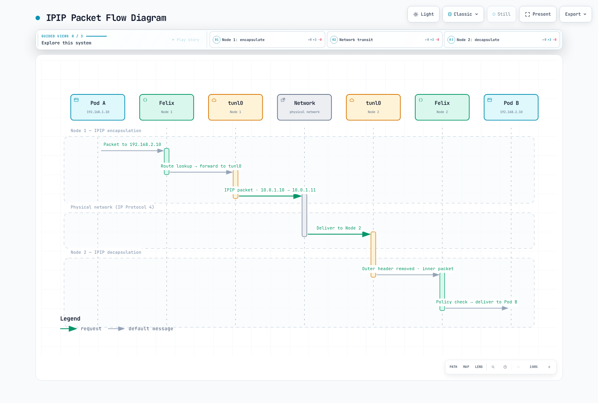

# 第 3 部分：网络模式

> **审查基线**：Calico Open Source 3.32.2 / Operator 1.42.6；Kubernetes 1.34–1.36 是 Calico 3.32 的已测试范围。
> **最后更新**：2026 年 9 月 12 日。下方历史基准值作为未经验证的报告保留，并非新测量结果。

## 范围和模式选择

本章讨论由 Calico 管理的 Linux Pod 网络和 IPAM。在 EKS 仅策略模式下，Amazon VPC CNI 仍负责 Pod 网络；创建 Calico IPPool 不会将该安装切换为覆盖网络。示例是备选设计，不应同时应用，也不应覆盖简介实验中已经创建的池。审计未执行集群迁移或网络基准测试。

| 选择 | 含义 | 重要边界 |
|---|---|---|
| IPIP | IPv4 内封装 IPv4，IP 协议 4 | Calico IPIP 仅支持 IPv4；底层网络必须允许它 |
| VXLAN | UDP 承载内部以太网帧，Calico 默认端口 4789 | 外层 IPv4 与 IPv6 开销不同；端口/VNI 可配置 |
| 直接 / 非封装 | 无 Pod 网络覆盖层，直接路由 Pod IP 数据包 | 底层网络和返回路径必须能路由 Pod 地址 |
| CrossSubnet | IPIP 或 VXLAN 的一种设置 | 仅当相关节点地址位于不同配置子网时，才封装节点间流量 |

`Always` 针对发往所配置池中地址的合格节点间流量；同节点流量不需要物理隧道。`Never` 禁用该封装，不是禁用所有网络。CrossSubnet 不是可用区、区域或广域网链路检测器：同一可用区中的两个子网仍可能需要封装。检查 Calico 使用的节点地址和子网掩码。

默认值取决于安装/提供商和数据平面。不存在“所有云默认使用 IPIP”的通用规则，也不保证 Direct 总是最快。[覆盖网络指南](https://docs.tigera.io/calico/latest/networking/configuring/vxlan-ipip)介绍受支持的路由路径。

### 路由和封装是独立选择

默认情况下，Felix 为 VXLAN 池配置路由，而 confd/BIRD 为 IPIP 和非封装池配置集群路由。Calico 3.32 也支持使用 `Installation.spec.calicoNetwork.clusterRoutingMode: Felix` 处理这些非 VXLAN 路由。对应底层设置为 Felix `programClusterRoutes: Enabled` 和 BGP `programClusterRoutes: Disabled`；安装由 Operator 管理时，应使用 Operator 设置。外部 BGP 通告仍需要 BGP。静态路由或合适的路由网络也可提供底层可达性，因此 BGP 和同二层邻接并非每种非封装设计的通用要求。

## 数据包结构与开销

下文使用**底层网络 IP MTU**。外层以太网标头不计入该 IP MTU。假定无 IPv4 选项或额外内部 VLAN 标签；TCP 选项和其他封装可能进一步减少载荷。

```text
Direct: outer Ethernet | Pod IP | TCP or UDP | payload
IPIP:   outer Ethernet | outer IPv4 | Pod IPv4 | TCP or UDP | payload
VXLAN:  outer Ethernet | outer IP | UDP | VXLAN | inner Ethernet | Pod IP | TCP or UDP | payload
```

| 传输方式 | Pod IP 数据包之外的开销 | 底层网络 IP MTU 为 1500 时的 Pod IP MTU |
|---|---|---|
| Direct，无其他隧道 | 0 | 1500 |
| IPIP，外层 IPv4 | 20 | 1480 |
| VXLAN，外层 IPv4 | 20 + 8 + 8 + 14 = 50 | 1450 |
| VXLAN，外层 IPv6 | 40 + 8 + 8 + 14 = 70 | 1430 |
| WireGuard，外层 IPv4 | 60 | 1440 |
| WireGuard，外层 IPv6 | 80 | 1420 |

对于 VXLAN，MTU 开销中的 14 字节是**内层以太网标头**，而非外层以太网标头。普通 TCP 标头至少 20 字节；UDP 标头为 8 字节。因此在上述假设下，1500 字节 IPv4 IP 数据包最多可包含 1460 字节 TCP 载荷或 1472 字节 UDP 载荷。原先共用的“TCP/UDP = 20 字节”标签不正确。

IPIP 的协议号为 4，不是 TCP/UDP 端口 4。Calico 常用 VXLAN VNI 为 4096，默认 UDP 端口为 4789，但两者均可配置。其他当前 VXLAN 实现可能使用 8472；这不限于过时软件。参阅 [IP-in-IP](https://www.rfc-editor.org/rfc/rfc2003) 和 [VXLAN](https://www.rfc-editor.org/rfc/rfc7348)。

### 数据包路径示意



[🔍 查看交互式图表](https://www.atomai.click/kubernetes-docs/archmaps/en-networking-calico-03-networking-modes-2.html)

“Felix”列代表 Felix 配置的内核路由/策略；数据包不经过 Felix 守护进程。这是 IPv4 节点间路径，不是同节点流量或加密机制。


[🔍 查看交互式图表](https://www.atomai.click/kubernetes-docs/archmaps/en-networking-calico-03-networking-modes-3.html)

4789 和 VNI 4096 是示意中的默认值。50 字节开销和 1450 MTU 适用于外层 IPv4、1500 字节路径及所述标头假设，不适用于每种网络或地址族。

### CrossSubnet 示例

节点地址为 10.0.1.10/24 和 10.0.1.11/24 时，同子网路径可不封装。地址为 10.0.2.20/24 的对等节点在 CrossSubnet 设计中需要封装。因此，即使云子网名称看起来正确，错误节点掩码仍会改变结果。CrossSubnet 不建立跨 VPC/区域连接，也不提供加密。


[🔍 查看交互式图表](https://www.atomai.click/kubernetes-docs/archmaps/en-networking-calico-03-networking-modes-1.html)

子网地址/掩码决定此选择。图中 1500/1480 假定底层为 IPv4 1500 字节网络；工作负载仍应使用其所有可能路径中的最小 MTU。接口 MTU 不会因同子网流量而动态增大。

### 节点诊断

在获授权的 **Linux 节点网络命名空间**运行这些只读命令，而非普通应用 Pod。接口仅在相应模式启用时存在。命令显示的值取决于实际安装。

```bash
ip link show tunl0
ip link show vxlan.calico
bridge fdb show dev vxlan.calico
ip route show
```

典型本地 Pod 路由是 `10.244.1.5/32 dev cali…` 这样的主机路由；不要将整个 /24 或 /26 路由到单个 Pod 的 veth。聚合块可能使用黑洞路由加更具体的 Pod 路由。远程块可使用隧道或下一跳节点/路由器，路由协议标签取决于由 BIRD 还是 Felix 配置。


[🔍 查看交互式图表](https://www.atomai.click/kubernetes-docs/archmaps/en-networking-calico-03-networking-modes-5.html)

这些示例采用 IPv4 1500 字节底层网络。图表比较数据包封装，不比较实测速度，也不表示控制平面行为相同。选择工作负载 MTU 时，必须考虑其他封装和 Service 路径。

## 通过所有者配置池

`kubectl …projectcalico.org` 示例假定使用简介中的聚合 Calico API（或适当的原生 v3 设置）。没有该 API 时，使用匹配的 calicoctl 管理逻辑 Calico 资源。Operator 命令仅适用于 Operator 安装。池范围还必须避免与 Service 和节点/底层网络范围冲突。

使用单一配置所有者。`Installation.spec.calicoNetwork.ipPools` 中列出的池由 Operator 协调；通过其所有者编辑期望列表，不要应用争夺管理权的 IPPool 对象。独立池使用 Calico IPPool API。两种情况下都应先验证实际集群 Pod CIDR、不重叠性、IPAM 类型和现有分配。

```bash
kubectl get installation.operator.tigera.io default -o yaml
kubectl get ippools.projectcalico.org -o yaml
calicoctl ipam show --show-blocks
```

对于 Operator 管理的池，以下是现有 `ipPools` 列表的**条目片段**。保留其他条目和 Installation 字段。不要在简介实验已分配的 /16 池之上创建它：

```yaml
- name: mode-demo-pool
  cidr: 10.244.0.0/16
  blockSize: 26
  encapsulation: VXLAN
  natOutgoing: Enabled
  nodeSelector: all()
```

对于独立规划的新池，下方是等效 IPv4 资源。它是 Operator 条目的替代方案，不是额外的重叠池。CIDR 仅为示例，必须适合实际集群且不与任何现有池冲突。

```yaml
apiVersion: projectcalico.org/v3
kind: IPPool
metadata:
  name: mode-demo-pool
spec:
  cidr: 10.244.0.0/16
  blockSize: 26
  ipipMode: Never
  vxlanMode: Always
  natOutgoing: true
  nodeSelector: all()
```

选择一行，不要创建多个具有相同 CIDR 的资源：

| IPv4 设计 | IPPool `ipipMode` | IPPool `vxlanMode` | Operator `encapsulation` |
|---|---|---|---|
| IPIP Always | Always | Never | IPIP |
| IPIP CrossSubnet | CrossSubnet | Never | IPIPCrossSubnet |
| VXLAN Always | Never | Always | VXLAN |
| VXLAN CrossSubnet | Never | CrossSubnet | VXLANCrossSubnet |
| Direct | Never | Never | None |

一个池不能同时启用 IPIP 和 VXLAN。`encapsulation` 是 Operator 池字段，不是独立 IPPool 的字段名。在常规聚合 API 安装中，创建重叠池会被拒绝。使用原生 v3 CRD（技术预览）时，重叠验证是异步的，已创建池可能收到 Disabled 条件；创建成功不能证明可用于分配。

Calico 3.32 的 Installation 模式允许池列表（最多 25 个条目），并受控制器验证和平台约束。旧示例中恰好只能有一个 IPv4 池的说法不应作为当前通用限制。

### 使用外部 BGP 的直接路由

若设计使用外部 BGP，移除覆盖网络前先配置真实对等体和返回路由。仅声明对等体不会配置物理路由器，也不能证明路由已被接受。此独立拓扑示例不是对禁用 BGP 的 VXLAN 实验的补充：

```yaml
apiVersion: projectcalico.org/v3
kind: BGPPeer
metadata:
  name: example-rack-tor
spec:
  peerIP: 192.0.2.1
  asNumber: 65001
  nodeSelector: rack == 'rack1'
```

替换文档地址和 AS 号，为目标节点添加标签，并验证每个机架的路由过滤器/AS 环路处理。只有设计好返回路由及任何所需外部 NAT 后，才适合使用 `natOutgoing: false`；BGP 本身不会让私有 Pod 地址可从互联网路由。全互联/RR 更改参阅 [BGP 转换指南](02-architecture.md)和 [BGP 深入解析](04-bgp-deep-dive.md)。


[🔍 查看交互式图表](https://www.atomai.click/kubernetes-docs/archmaps/en-networking-calico-03-networking-modes-4.html)

这展示基于 BGP 的设计，并不要求所有 Direct 设计都使用 BGP。1500 值假定路径具有该可用 MTU 且无其他隧道；eBPF Service 转交或加密可能要求更低的工作负载 MTU。

## NAT 和池选择

设置 `natOutgoing: true` 时，Calico 通常对源地址位于该池、目的地位于**所有 Calico IPPool 之外**的流量执行 SNAT。它不只是判断是否“离开集群”。即使禁用的池也可标识免 NAT 目的范围；移除它可能改变 NAT 行为。额外 Felix 设置也可排除主机 IP。NAT 不授予 NetworkPolicy 权限。参阅[出站 NAT](https://docs.tigera.io/calico/latest/networking/configuring/workloads-outside-cluster)。

### 基于拓扑的自动分配

这是独立规划示例，在 /16 集群范围内包含两个不相交 /18 池。它不能与已分配的父 /16 池共存。不要仅为使示例适用而删除使用中的父池。

```yaml
apiVersion: projectcalico.org/v3
kind: IPPool
metadata:
  name: zone-a-pool
spec:
  cidr: 10.244.0.0/18
  ipipMode: Never
  vxlanMode: CrossSubnet
  natOutgoing: true
  nodeSelector: topology.kubernetes.io/zone == 'ap-northeast-2a'
---
apiVersion: projectcalico.org/v3
kind: IPPool
metadata:
  name: zone-b-pool
spec:
  cidr: 10.244.64.0/18
  ipipMode: Never
  vxlanMode: CrossSubnet
  natOutgoing: true
  nodeSelector: topology.kubernetes.io/zone == 'ap-northeast-2b'
```

自动分配时，确保每个目标节点匹配符合条件的池；选择器不调度 Pod。上述可用区标签选择分配池，而 CrossSubnet 仍根据节点地址/掩码决定封装。

### 显式命名空间或 Pod 池请求

请求池前先创建并验证合适的池。此片段通过命名空间现有所有者添加注解；不是完整命名空间替换。Pod 注解优先于命名空间注解，命名空间注解又覆盖 CNI 池配置。

```yaml
metadata:
  annotations:
    cni.projectcalico.org/ipv4pools: '["production-pool"]'
```

`production-pool` 必须是已存在、启用且地址充足的池。`assignmentMode: Manual` 可将池排除在自动选择之外，同时允许显式请求。**池选择器和此注解都不是安全边界。** 发布的 [IPAM 实现](https://github.com/projectcalico/calico/blob/v3.32.2/libcalico-go/lib/ipam/ipam.go)在显式请求已启用池时，有意忽略节点/命名空间池选择器。如果地址范围意味着信任，应控制谁能请求池。现有 Pod 保留其地址；更改注解不会重新编号。

## 云和平台边界

| 环境 | 指导 |
|---|---|
| 自主管理 AWS EC2 | 检查所选模式的 IP 协议 4 或 VXLAN UDP 可达性、路由、源/目标检查和返回路径 |
| 使用 Amazon VPC CNI 的 EKS | 默认 Pod 网络是 VPC CNI，不是 Calico VXLAN；仅策略 Calico 不拥有这些池 |
| 使用完整 Calico 网络的 EKS | 采用 Calico CNI/IPAM 的独立规划安装；使用[官方 EKS 流程](https://docs.tigera.io/calico/latest/getting-started/kubernetes/managed-public-cloud/eks) |
| 由 Calico 管理网络的 Azure | 在不支持 IPIP 的情况下，Calico 覆盖网络指南支持 VXLAN；UDR 配置不能修复不受支持的 IPIP 封装 |
| AKS | 使用具体受支持的 Azure CNI/策略集成，不要泛化为 Calico 覆盖网络 |
| GCE / GKE | 自主管理 GCE 路由不同于托管 GKE；[GKE Dataplane V2 使用 Cilium](https://cloud.google.com/kubernetes-engine/docs/concepts/dataplane-v2) |
| 本地部署 | 直接路由、静态/BGP 路由或覆盖网络取决于底层可达性；不存在通用最快选择 |
| OpenStack Neutron 集成 | 引用的 Calico 覆盖网络指南排除此集成；不要缺少平台流程就复制 Kubernetes 覆盖网络指导 |

本章不提供 EKS Auto Mode 或 Fargate 的自定义 CNI 方案。VXLAN 示例禁用 BGP 表示该配置不需要它，不意味着 AWS 没有支持 BGP 的服务。Windows 也有独立限制，包括不支持 Calico IPIP 或 VXLAN CrossSubnet。

## MTU 配置和验证

使用工作负载可能经过路径中的最小可用 MTU，包括加密和 Service 路径。[Calico MTU 指南](https://docs.tigera.io/calico/latest/networking/configuring/mtu)介绍自动检测及 Operator/清单所有权。`mtuIfacePattern` 选择检测时考虑的接口；它不是开关，也不能证明端到端路径 MTU。

**不要盲目将 IPIP 和 WireGuard 开销相加。** 在 Calico 常规混合部署中，启用 WireGuard 的对等体之间使用 WireGuard；其他路径使用 IPIP/VXLAN。选择适用的最小 MTU。实际 1500 字节路径中，IPv4 WireGuard 与 IPIP 并用意味着 `min(1440, 1480) = 1440`，而非 `1500 − 60 − 20 = 1420`。外层 IPv6 WireGuard 则具有 80 字节开销。

AKS 有文档记录的 WireGuard 例外：即使接口显示 1500，底层路径也可能为 1400，因此 IPv4 WireGuard 为 1340，IPv6 为 1320。eBPF NodePort 路径也使用 VXLAN，所以仅有非封装 Pod 池不意味着工作负载 MTU 为 1500 字节。

对于 Operator 安装，在确定 **1450 适合此特定 IPv4 VXLAN 路径**后，将其合并到现有期望状态：


```bash
kubectl patch installation.operator.tigera.io default --type merge   -p '{"spec":{"calicoNetwork":{"mtu":1450}}}'
```

对于清单管理安装，文档规定的设置是 `calico-config.data.veth_mtu`；更新该 ConfigMap，并按流程滚动更新 Calico 节点 DaemonSet。不要将清单流程用于 Operator 管理的 Deployment。**更新后的工作负载 MTU 适用于新工作负载。** 仅重启 calico-node 不会重新创建应用 Pod，也不能证明其 MTU 已改变。

| 底层网络 IP MTU 示例 | IPIP IPv4 | VXLAN IPv4 | VXLAN IPv6 | WireGuard IPv4 | WireGuard IPv6 |
|---|---|---|---|---|---|
| 9000 | 8980 | 8950 | 8930 | 8940 | 8920 |
| 9001，且 AWS 路径实际支持此值 | 8981 | 8951 | 8931 | 8941 | 8921 |

整个路径都必须支持巨帧；仅接口设置还不够。验证工作负载路径时，应从诊断工作负载检查，而不只是从节点检查。

这些有界检查假定使用获准的 Linux 诊断 Pod，包含 iputils 并具有所需权限。设置真实 Pod 名称/地址。以下载荷大小是 **IPv4 ICMP** 示例：加上 20 字节 IPv4 和 8 字节 ICMP。IPv6 需要不同计算；探测成功不能证明每条 ECMP 路径都安全。

```bash
CHECK_NS=calico-demo
CHECK_POD=diagnostic-client
CHECK_TARGET=diagnostic-server
DEST_IPV4=$(kubectl -n "$CHECK_NS" get pod "$CHECK_TARGET" -o jsonpath='{.status.podIP}')
case "$DEST_IPV4" in
  ""|*:*) echo "Select a ready target Pod with an IPv4 address" >&2; exit 1 ;;
esac
kubectl -n "$CHECK_NS" exec "$CHECK_POD" -- ip link show eth0
kubectl -n "$CHECK_NS" exec "$CHECK_POD" -- ping -4 -c 3 -W 2 -M do -s 1472 "$DEST_IPV4"
kubectl -n "$CHECK_NS" exec "$CHECK_POD" -- ping -4 -c 3 -W 2 -M do -s 1452 "$DEST_IPV4"
kubectl -n "$CHECK_NS" exec "$CHECK_POD" -- ping -4 -c 3 -W 2 -M do -s 1422 "$DEST_IPV4"
```

三种载荷测试的 IP 数据包大小分别为 1500、1480 和 1450。失败可能源于策略/ICMP 过滤，也可能源于 MTU。抓包时，以适当权限检查 IPv4 需要分片消息和 IPv6 Packet Too Big 消息；原来的仅 IPv4 过滤器未覆盖 IPv6。

## 有计划地更改模式或迁移地址

更改封装不同于更改 Pod CIDR 或块大小。Calico 支持更改封装配置，但进行中的连接可能中断。维护更改前，验证底层网络权限、路由、实际 MTU、数据平面支持和恢复。不要将重启所有节点或命名空间内所有 Deployment 作为通用迁移步骤。

对于 Operator 管理的池，在现有期望 Installation 列表中更改 `encapsulation`，保留所有其他池/设置。**仅对于独立 IPv4 IPPool**，以下仅更改模式的示例保留 CIDR 和分配设置，并同时更改两个封装字段：

```bash
POOL_NAME=mode-demo-pool
kubectl get ippool.projectcalico.org "$POOL_NAME" -o yaml > pool-before.yaml
kubectl patch ippool.projectcalico.org "$POOL_NAME" --type merge   -p '{"spec":{"ipipMode":"Never","vxlanMode":"Always"}}'
```

这不保证无中断。如果规划的 Direct 到 IPIP CrossSubnet 转换适当，其字段组合为 `ipipMode: CrossSubnet` / `vxlanMode: Never`；更改它不需要替换池 CIDR。仅在已验证 MTU/地址计划需要时，使用各工作负载自身的滚动发布和就绪策略重新创建选定应用。[PodDisruptionBudget](https://kubernetes.io/docs/concepts/workloads/pods/disruptions/) 不限制 Deployment 控制器的滚动更新。

### 独立的 IPPool/CIDR 迁移

仅在 Calico 负责 IPAM 且编排器/网络设计支持时，使用[池迁移流程](https://docs.tigera.io/calico/latest/networking/ipam/migrate-pools)。

1. 清点现有池、Kubernetes/kube-proxy 集群 CIDR、显式池请求及全部分配。集群 CIDR 外的新池可能改变 NAT 或中断流量；旧示例的 10.245/16 不会自动兼容简介中的 10.244/16 集群。
2. 通过所有者添加已验证的不重叠池，撤除旧池前测试新分配。为旧工作负载保留现有池。
3. 通过适当所有者停止向旧池新增分配。独立池的 `spec.disabled: true` 将池排除在 IPAM 外。Operator 的 `nodeSelector: "!all()"` 禁用**自动选择**，但显式旧池请求绕过选择器；也应移除这些请求。
4. 分批受控迁移选定工作负载，检查地址、MTU、路由、策略和应用就绪状态。重建 Pod 可中断应用并改变 IP 地址；新池不保证无缝回滚。
5. 仅在确认旧池剩余分配和依赖后才将其退役，包括适用的隧道或 LoadBalancer 用途。仅查看 Pod 列表还不够。从所有者配置中移除时，应考虑其 NAT/路由影响。

有用的只读检查如下：


```bash
kubectl get ippools.projectcalico.org -o yaml
calicoctl ipam show --show-blocks
calicoctl ipam show --show-borrowed
kubectl get pods --all-namespaces -o wide
```

池块大小是独立迁移问题；不要通过替换教程清单来更改现有池不可变的分配结构。旧示例复制的“为立即应用模式而重启 calico-node”操作不能证明工作负载 MTU 或应用已恢复。

## 早期基准报告——来源未经验证

之前的英文和韩文页面包含不同数据，未提供原始结果、完整软件版本、放置情况或可复现测试工具。两份记录均保留如下；不能将它们视为同一次实验或已验证性能保证。本次审计未重新运行测试。

### 记录 A：早期英文页面

报告环境：**AWS 上 3 × c5.xlarge**，声称 10 Gbps 网络，iperf3 TCP，**单流持续 60 秒**。未提供置放群组、Calico/内核版本或延迟收集方法。

| 报告指标 | Direct | IPIP | VXLAN |
|---|---|---|---|
| 吞吐量，Gbps | 9.41 | 9.12 | 8.89 |
| p99 延迟，µs | 45 | 52 | 61 |
| CPU，每 Gbps 的百分比 | 2.1 | 2.8 | 3.4 |

AWS 文档说明，集群置放群组之外通常有 5 Gbps 单流限制，并列明特定例外。因此，使用该报告超过 9 Gbps 的值预测新部署前，需要补充缺失的放置/路径条件。“最高 10 Gbps”也不能证明持续基准带宽。参阅 [EC2 带宽](https://docs.aws.amazon.com/AWSEC2/latest/UserGuide/ec2-instance-network-bandwidth.html)。

### 记录 B：早期韩文页面

| 报告指标 | Direct | IPIP | VXLAN | 所述方法 |
|---|---|---|---|---|
| 吞吐量，Gbps | 9.8 | 9.2 | 8.5 | iperf3，MTU 1500 |
| 延迟，µs（统计量未说明） | 35 | 42 | 55 | netperf TCP_RR |
| CPU 利用率 | 低 | 中 | 中高 | 在 10 Gbps 时 |
| PPS，每秒百万包 | 1.8 | 1.5 | 1.2 | 64 字节数据包 |

未提供硬件、样本数量及“64 字节”的确切解释。netperf 的 TCP_RR 测试通常报告**每秒事务数**；经过明确论证的倒数可估算平均请求/响应周期时间，但不是 p99 或单独的单向网络延迟。报告的微秒值缺少原始输出/转换过程。

仅标头大小不能决定哪种模式更快。网卡卸载、内核/数据平面、数据包大小、CPU、路由、连接复用和发送负载都会改变结果。应将这些记录保留为未经验证的历史，并测量目标环境，不要据此给模式排名。

### 新实验的有界客户端探测

准备专用测试 Pod，包含匹配的 iperf3/netperf 版本、运行中的服务器监听器和所需策略权限。这些命令只是客户端探测，不是对任一记录的完整复现。记录版本、节点/可用区放置、MTU、请求/响应大小、原始输出和重复运行结果。确认所选服务器具有本示例所需 IPv4 地址。

```bash
set -euo pipefail
BENCH_NS=calico-demo
CLIENT_POD=benchmark-client
SERVER_POD=benchmark-server
SERVER_IP=$(kubectl -n "$BENCH_NS" get pod "$SERVER_POD" -o jsonpath='{.status.podIP}')
: "${SERVER_IP:?Server Pod has no address}"
case "$SERVER_IP" in
  *:*) echo "This example requires an IPv4 server Pod" >&2; exit 1 ;;
esac
kubectl -n "$BENCH_NS" get pods "$CLIENT_POD" "$SERVER_POD" -o wide
kubectl -n "$BENCH_NS" exec "$CLIENT_POD" --   iperf3 -c "$SERVER_IP" -t 30 -P 4 -J > iperf3-result.json
kubectl -n "$BENCH_NS" exec "$CLIENT_POD" --   netperf -H "$SERVER_IP" -t TCP_RR -l 60 > netperf-result.txt
```

iperf3 示例使用四个流，因此不是记录 A 的单流方法。[netperf 手册](https://github.com/HewlettPackard/netperf/blob/master/doc/netperf.txt)定义报告单位和可选延迟输出。隔离测试负载，结束后仅停止自己拥有的测试服务器/资源，不要为复现无来源图表而更改生产网络模式。

[Calico 概述](README.md) · [架构](02-architecture.md) · [下一篇：BGP 深入解析](04-bgp-deep-dive.md) · [网络模式测验](../../quizzes/networking/calico/03-networking-modes-quiz.md)
