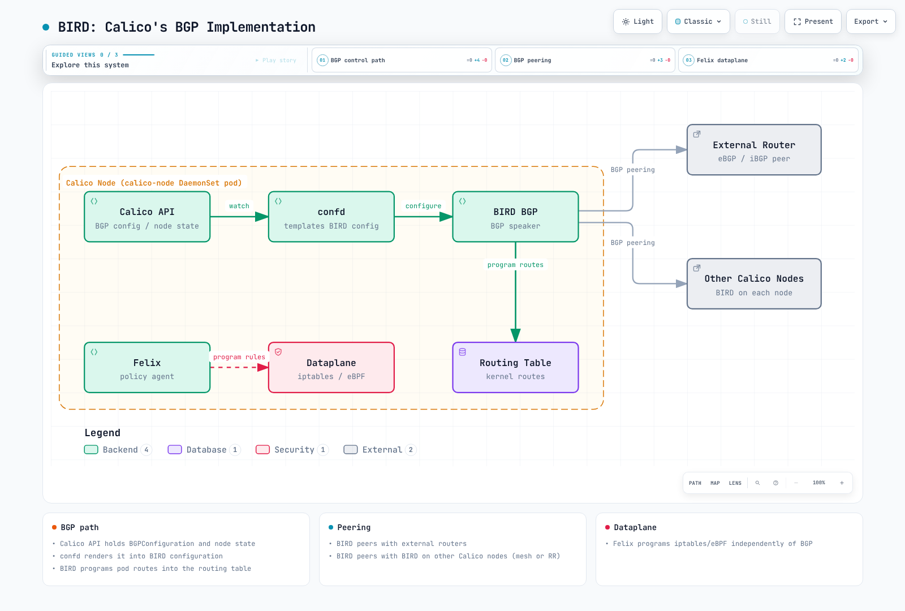
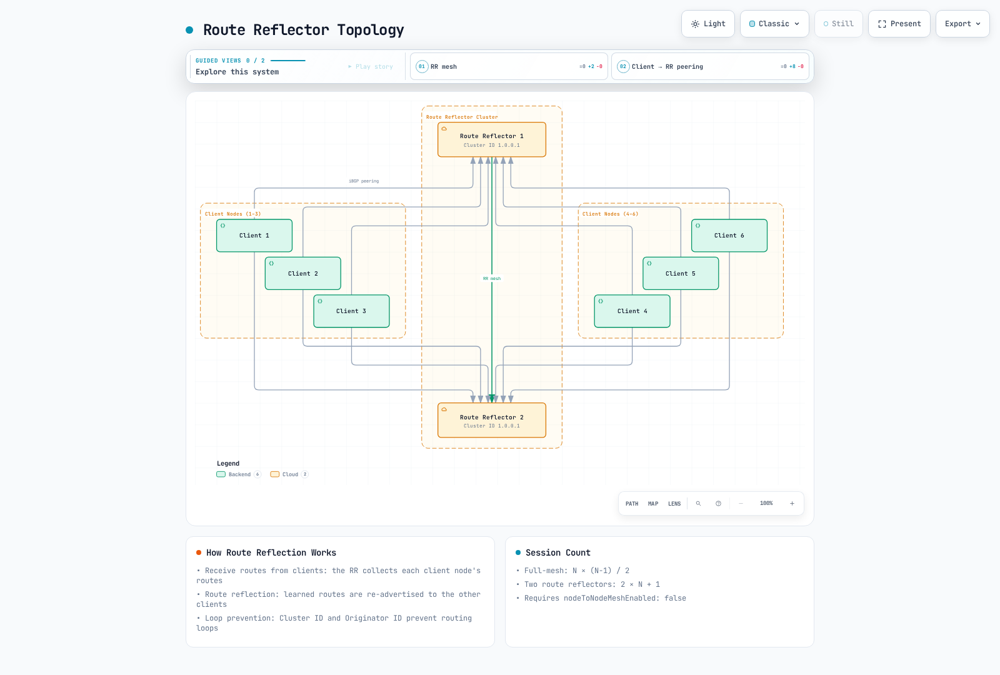
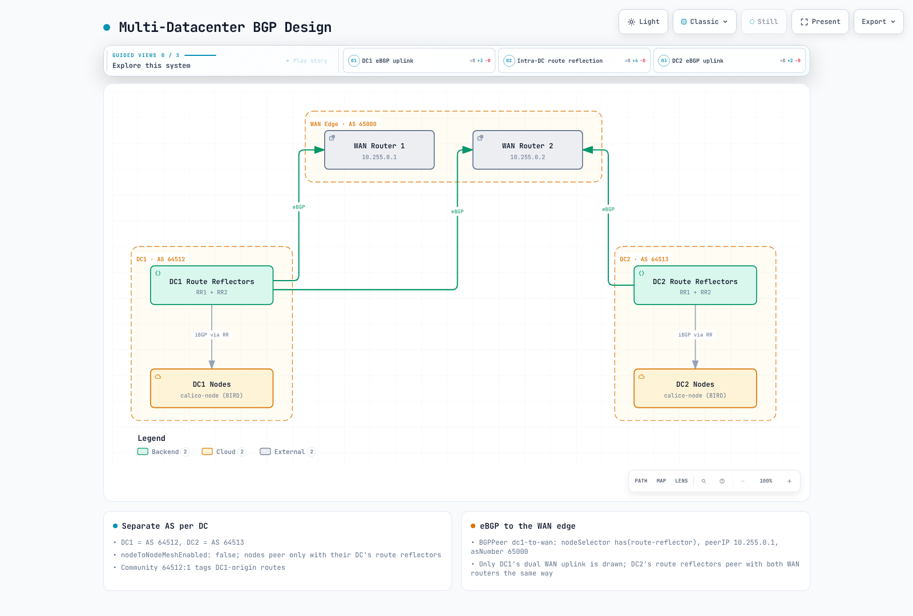

# 第 4 部分：BGP 深入解析

> **审查基线**：Calico 3.32.2；Calico 3.32 测试 Kubernetes 1.34–1.36。**最后更新**：2026 年 9 月 12 日。
>
> 配置示例假定使用启用 BGP 且安装标准 Calico API 服务器（`projectcalico.org/v3`）的 Linux Calico 集群。它们是独立的拓扑备选方案，不是一份应依次应用的清单。保留安装的 Operator/GitOps 所有权，并将所需字段合并到现有配置。[安装指南](01-introduction.md)介绍 API 前提条件；[网络模式指南](03-networking-modes.md)介绍不使用 BGP 的路由替代方案。路由器地址、ASN 和 CIDR 必须匹配您控制的网络。本次审查未测试真实网络或集群故障转移。

## 简介

边界网关协议（BGP）交换可达性信息。Calico 可用它分发工作负载路由并与现有路由网络集成。BGP 是控制平面协议：可配合非封装路由或 IP-in-IP，其本身不保证更高性能。Calico 3.32 也支持无需 BGP、由 Felix 管理的集群路由；外部 BGP 通告仍需要 BGP 发言者。

本深入指南涵盖 BGP 基础、Calico BGP 架构选项、配置资源及企业环境的高级部署模式。

***

## BGP 基础

### 什么是 BGP？

BGP（边界网关协议）是用于在自治系统之间交换路由信息的路径向量路由协议。在 Calico 中，BGP 在集群节点之间分发 Pod IP 路由，并可选择向外部网络基础设施分发。

### BGP 关键概念

| 概念 | 描述 |
| -------------------------- | -------------------------------------------------------------------- |
| **自治系统（AS）** | 单一管理域下的一组 IP 网络 |
| **AS 号（ASN）** | 16 位或 32 位标识符；分配范围排除特殊/保留范围 |
| **iBGP** | 内部 BGP，同一 AS 内路由器之间的会话 |
| **eBGP** | 外部 BGP，不同 AS 中路由器之间的会话 |
| **NLRI** | 网络层可达性信息，即被通告的路由 |
| **BGP 发言者** | 参与 BGP 的路由器或软件 |

### 私有 AS 号范围

IANA 为组织内部使用保留以下私有 ASN 范围：

```
16-bit Private ASN Range: 64512 - 65534
32-bit Private ASN Range: 4200000000 - 4294967294
```

Calico 默认集群 ASN 为 `64512`。路由到达全球互联网前，必须从 AS 路径中移除私有 ASN；它们是标识符，不是本质上不可路由的 IP 地址。其他特殊范围包括文档 ASN `64496–64511` 和 `65536–65551`，以及 `23456`（AS_TRANS）。请查阅 [IANA 注册表](https://www.iana.org/assignments/as-numbers/as-numbers.xhtml)，不要将其他每个整数都视为已分配公有 ASN。

### BGP 路由选择过程

应比较实际实现和路由策略。Cisco `Weight` 及管理距离 20/200 不是通用 BGP 属性，也不是 Calico BIRD 默认值。

Calico 3.32.2 将其 BIRD 分支固定到 `v0.3.3-211-g9111ec3c`。对于可比较的合格 BGP 路由，选择函数检查较高 LOCAL_PREF、较短 AS_PATH（启用时）、较低 ORIGIN、适用邻居 AS 策略下较低 MED、eBGP 优于 iBGP，以及较低 IGP 度量。剩余平局根据路由器/ORIGINATOR_ID、CLUSTER_LIST 长度和对等 IP 解决；可选的旧路由优先会改变平局处理。抑制、下一跳可达性、陈旧路由处理和 BIRD 路由优先级也很重要。这不是通用的十一步阶梯。

Calico 3.32 将路由优先级转换为 LOCAL_PREF 和内核度量。因此，不要假定每条本地导出路由都保留上游 BIRD 默认 LOCAL_PREF 100。

### iBGP 与 eBGP 行为

| 属性 | iBGP | eBGP |
| --- | --- | --- |
| AS 关系 | 相同 AS | 不同 AS |
| AS_PATH | 通常保留 | 通常在前面添加本地 AS |
| 路由传播 | 从 iBGP 学到的路由通常不会发给另一 iBGP 对等体；RR 是例外 | 导出取决于策略和环路防护 |
| 下一跳 | 经常保留；必须保持可达 | 经常更改；`nextHopMode` 和拓扑会影响它 |
| TTL 和管理距离 | 取决于实现/配置 | 取决于实现/配置 |

本地产生或从 eBGP 学到的路由可发送给 iBGP 对等体。Calico 生成的外部对等体配置使用 BIRD 多跳；不要根据通用“eBGP TTL 1”表诊断。应检查生成配置和协商后的会话状态。

***

## Calico BGP 架构

### BIRD：Calico 的 BGP 实现

启用 BGP 时，Calico 在 `calico-node` 中运行其 BIRD 分支，由 confd 渲染配置。禁用 BGP 的部署不需要 BIRD。BIRD 和 Felix 根据所选模式分别承担路由职责。



[🔍 查看交互式图表](https://www.atomai.click/kubernetes-docs/archmaps/en-networking-calico-04-bgp-deep-dive-1.html)

> 边界仅为示意：Calico API 服务器是独立组件，不是每个 calico-node Pod 内的进程。Felix 也管理本地工作负载路由，并在所选模式下管理集群路由。BIRD 仅在启用时存在。

### BGP 拓扑选项

常见内部 BGP 拓扑选择包括：

1. **节点间网格（全互联）** - 默认配置
2. **路由反射器** - 推荐用于较大集群

***

## 全互联拓扑

### 全互联如何工作

启用 BGP 和默认节点网格时，参与的非 RR 节点相互建立对等连接。标记为路由反射器的节点被排除在自动网格之外。


[🔍 查看交互式图表](https://www.atomai.click/kubernetes-docs/archmaps/en-networking-calico-04-bgp-deep-dive-3.html)

> 箭头列举双向会话，不代表单向流量。对于讨论的地址族，每对节点计一个会话。

### 会话数量公式

全互联拓扑中 BGP 会话数按二次方增长：

```
Sessions = N × (N - 1) / 2

Examples:
- 10 nodes:   10 × 9 / 2 = 45 sessions
- 50 nodes:   50 × 49 / 2 = 1,225 sessions
- 100 nodes:  100 × 99 / 2 = 4,950 sessions
- 500 nodes:  500 × 499 / 2 = 124,750 sessions
```

### 全互联扩展和转换

此公式假定对于所统计地址族，每对节点有一个会话。每个节点有 `N−1` 个对等体。CPU 和内存取决于路由数、更新变动、策略、硬件和收敛目标；之前的每节点内存表及固定 50/200 节点限制不是实测容量限制。

检查现有配置：

```bash
kubectl get bgpconfiguration.projectcalico.org default -o yaml
```

缺少 `default` 资源可能表示正在使用默认值。禁用自动网格前，先准备并验证替代 RR 或网络会话。遵循下方转换顺序；仅创建 RR 标签不能提供有效替代路径。

***

## 路由反射器拓扑

### 路由反射器概念

路由反射器（RR）通过允许部分节点向其他节点反射路由，解决 iBGP 可扩展性问题，从而无需全互联。



[🔍 查看交互式图表](https://www.atomai.click/kubernetes-docs/archmaps/en-networking-calico-04-bgp-deep-dive-4.html)

> 图中包含六个客户端和两个 RR，共 13 个会话。图中 2N+1 表达式的 N 是客户端数，而全互联中的 N 是节点总数。只有显式替代拓扑验证后，才禁用自动网格。

### 路由反射器关键属性

| 属性 | 描述 |
| -------------------- | ------------------------------------------------------------- |
| **Cluster ID** | 标识服务于同一组客户端的一组 RR |
| **Originator ID** | 防止路由环路，设置为发起者的路由器 ID |
| **路由反射** | RR 将从客户端学到的路由重新通告给其他客户端 |

### 使用路由反射器时的会话数

设 `T` 为节点总数，`R` 为反射器数，`C=T−R` 为客户端数。如果每个客户端与每个 RR 建立对等连接，RR 之间也相互连接：

```text
RR sessions = C×R + R×(R−1)/2
T=100, R=2: 98×2 + 1 = 197 (full mesh of the same 100 nodes: 4,950)
T=500, R=2: 498×2 + 1 = 997 (full mesh of the same 500 nodes: 124,750)
```

如果“100 个节点”实际指 100 个客户端加两个额外 RR，会话数是 201，但该拓扑有 102 个节点。不能混淆两种含义。

### 配置路由反射器节点

此次转换使用准备好的、无工作负载的 RR 节点。设置集群 ID 会立即将该节点移出自动网格；原地更改繁忙节点可能中断连接。此 Kubernetes 数据存储示例保留现有节点 IP 和其他字段。

**1. 为准备好的 RR 节点添加标签和注解**

```bash
kubectl label node rr-node-1 rr-node-2 route-reflector=true
kubectl annotate node rr-node-1 rr-node-2   projectcalico.org/RouteReflectorClusterID=244.0.0.1
```

共享 ID 标识此冗余 RR 集群，不是 Kubernetes 集群。其他 RR 集群/层级需要有计划的 ID 设计。

**2. 创建显式对等连接**

```yaml
apiVersion: projectcalico.org/v3
kind: BGPPeer
metadata:
  name: peer-to-rr
spec:
  nodeSelector: "!has(route-reflector)"
  peerSelector: "has(route-reflector)"
---
apiVersion: projectcalico.org/v3
kind: BGPPeer
metadata:
  name: rr-mesh
spec:
  nodeSelector: "has(route-reflector)"
  peerSelector: "has(route-reflector)"
```

`peerSelector` 选择 Calico 节点，除非选择 `reversePeering: Manual`，否则反向对等连接自动建立。它不发现任意外部路由器。

**3. 移除旧路径前先验证**

验证两个 RR 及其客户端的 Established 会话、预期通告/接收的工作负载前缀、可达下一跳及有代表性的跨节点流量。确认按计划失去任一 RR 后转发仍然正常。转换期间可保留普通客户端网格会话。

**4. 仅在这些检查后禁用自动网格**

更新受管理的 `BGPConfiguration/default` 清单，保留 ASN、团体属性和其他设置。现有资源的等效合并补丁为：

```bash
kubectl patch bgpconfiguration.projectcalico.org default --type=merge   -p '{"spec":{"nodeToNodeMeshEnabled":false}}'
```

若 `default` 不存在，在完成相同检查后，通过安装配置所有者创建它。更改后重新检查路由和流量，并保留恢复原拓扑的回滚计划。

### 路由反射器冗余模式

**模式 1：双路由反射器（中小型集群）**


[🔍 查看交互式图表](https://www.atomai.click/kubernetes-docs/archmaps/en-networking-calico-04-bgp-deep-dive-11.html)

> 当失去一个 RR 且传输、转发和剩余容量健康时，这为存活客户端提供冗余路由分发路径。它不能保留故障区域中的工作负载。

**模式 2：分层路由反射器**

机架级 RR 可与全局 RR 建立对等连接，以减少每节点会话扇出。会话总数仍随客户端和机架数增长。即使全局 RR 冗余，每机架单个 RR 仍是故障点；采用层次结构前，应评估每层冗余、集群 ID、反射规则、可达性和收敛。

***

## BGPPeer 资源

`BGPPeer` 资源定义 Calico 节点与外部 BGP 发言者之间的对等关系。

### BGPPeer 作用域类型

| 类型 | 描述 | 使用场景 |
| ----------------- | -------------------- | ----------------------- |
| **全局** | 适用于所有节点 | 外部路由器对等连接 |
| **特定节点组** | 使用 nodeSelector | 机架内对等连接 |
| **单节点** | 指定确切节点 | 特殊配置 |

### 全局 BGPPeer 示例

让所有节点与外部 ToR 交换机建立对等连接：

```yaml
apiVersion: projectcalico.org/v3
kind: BGPPeer
metadata:
  name: peer-to-tor-switches
spec:
  peerIP: 10.0.0.1
  asNumber: 65001
  # No nodeSelector means all nodes peer with this address
```

### 特定节点组 BGPPeer 示例

让特定机架中的节点与本地 ToR 交换机建立对等连接：

```yaml
apiVersion: projectcalico.org/v3
kind: BGPPeer
metadata:
  name: rack1-tor-peer
spec:
  nodeSelector: rack == 'rack1'
  peerIP: 10.0.1.1
  asNumber: 65001
---
apiVersion: projectcalico.org/v3
kind: BGPPeer
metadata:
  name: rack2-tor-peer
spec:
  nodeSelector: rack == 'rack2'
  peerIP: 10.0.2.1
  asNumber: 65002
```

### 使用 peerSelector 的 BGPPeer

使用 `peerSelector` 动态选择 Calico 节点作为对等体：

```yaml
apiVersion: projectcalico.org/v3
kind: BGPPeer
metadata:
  name: client-to-rr-peering
spec:
  nodeSelector: "!has(route-reflector)"
  peerSelector: has(route-reflector)
```

### 高级 BGPPeer 配置

先创建引用的 Secret 和安全章节中的 `tor-policy` BGPFilter。此示例假定对等体直接连接，且 GTSM 和身份验证设置匹配。

```yaml
apiVersion: projectcalico.org/v3
kind: BGPPeer
metadata:
  name: advanced-peer
spec:
  node: specific-node-name
  peerIP: 192.168.1.1
  asNumber: 65100
  password:
    secretKeyRef:
      name: bgp-secrets
      key: datacenter-password
  keepaliveTime: 30s
  maxRestartTime: 120s
  sourceAddress: UseNodeIP
  nextHopMode: Auto
  ttlSecurity: 1
  filters:
    - tor-policy
```

| 字段 | Calico 3.32.2 中的含义 |
| --- | --- |
| `keepaliveTime` | 持续时间字符串；小写 `a` 很重要。已对照发布 CRD 和渲染器验证。 |
| `maxRestartTime` | 向邻居通告的优雅重启时间；不是连接重试间隔。 |
| `sourceAddress` | `UseNodeIP` 或 `None`；不接受字面源 IP。 |
| `filters` | 现有 `BGPFilter` 资源名称，不是内嵌规则对象。 |
| `ttlSecurity` | 以边数表示的 GTSM 路径长度；`1` 表示直接连接的对等体。 |
| `numAllowedLocalASNumbers` | 接收的 AS_PATH 中允许本地 ASN 出现的次数；放宽环路防护，不是多跳设置。除非路由设计需要，否则不要设置。 |

当前 `BGPPeer` API 没有 `holdTime`、`keepAliveTime` 或 `restartTime` 字段。`nextHopMode` 为 `Auto`、`Self` 或 `Keep`；旧 `keepOriginalNextHop` 字段已弃用，但未移除。

***

## BGPConfiguration 资源

`BGPConfiguration` 资源定义集群范围的 BGP 设置。

### 基本 BGPConfiguration

```yaml
apiVersion: projectcalico.org/v3
kind: BGPConfiguration
metadata:
  name: default
spec:
  # Cluster AS number
  asNumber: 64512

  # Set topology separately after validating its peerings.
  # Log level for BIRD
  logSeverityScreen: Info
```

### Service IP 通告

Calico 可向获授权的路由网络通告现有 Service IP。通告不会分配 IP、创建云负载均衡器，也不保证返回路径可达。以下 CIDR 仅为示例：仅将所需范围合并到现有配置，并保留其他设置。

```yaml
apiVersion: projectcalico.org/v3
kind: BGPConfiguration
metadata:
  name: default
spec:
  asNumber: 64512

  # Advertise Service ClusterIPs
  serviceClusterIPs:
    - cidr: 10.96.0.0/12

  # Advertise Service ExternalIPs
  serviceExternalIPs:
    - cidr: 203.0.113.0/24

  # Advertise Service LoadBalancerIPs
  serviceLoadBalancerIPs:
    - cidr: 198.51.100.0/24
```

### BGP 团体属性配置

`prefixAdvertisements` 为匹配的现有路由添加团体属性，当前渲染器也包含 Pod 路由。它**不会**产生所列前缀，也不会将所有 Pod 块聚合到该前缀。命名团体属性仅被引用时生效；其名称和任意值本身不实现路由策略。

```yaml
apiVersion: projectcalico.org/v3
kind: BGPConfiguration
metadata:
  name: default
spec:
  asNumber: 64512

  # Community tagging for pod networks
  prefixAdvertisements:
    - cidr: 10.244.0.0/16
      communities:
        - "64512:100"  # Standard community
        - "64512:200"
    - cidr: 10.96.0.0/12
      communities:
        - "64512:300"  # Service IPs community

  # Named aliases, referenced by prefixAdvertisements in this configuration
  communities:
    - name: pod-networks
      value: "64512:100"
    - name: service-networks
      value: "64512:300"
    - name: no-export
      value: "65535:65281"  # Well-known NO_EXPORT
```

### 节点专属 AS 号

对于 Kubernetes 数据存储，为现有节点添加注解以保留地址及其他字段。更改 ASN 会重置受影响对等连接；应协调两端及路由拓扑。

```bash
kubectl annotate node border-node-1 projectcalico.org/ASNumber=65001
```

对于现有注解，审核当前值后通过配置所有者更新。其他数据存储使用 Calico Node API；不要用包含虚构地址的不完整示例替换现有 Node。

***

## Service IP 通告

### 通告类型和转发

| 类型 | 地址所有者和前提条件 |
| --- | --- |
| ClusterIP | 由 Kubernetes 分配；通告 Service CIDR 会暴露进入服务网络的路由。 |
| ExternalIP | 操作员必须已拥有并路由所分配地址。`spec.externalIPs` 自 Kubernetes 1.36 起弃用；现有支持不等于移除。 |
| LoadBalancer IP | 由兼容控制器分配。Calico 可自行分配拥有的 VIP，也可与显式选择的分配器协作。云负载均衡器主机名不是 IP 前缀。 |

默认聚合行为下，Cluster 模式 Service 使用配置的聚合通告，Local 模式 Service 则由具有就绪本地端点的节点通告主机路由（`/32` 或 `/128`）。显式主机前缀范围及 Calico 3.32 的 `serviceLoadBalancerAggregation` 设置可改变通告路由；应检查实际 RIB/导出，不要仅按 Service 类型推断。验证端点、Service 数据平面、上游 ECMP 和返回路径。这不同于 Pod IPAM 块通告。

### 原生 Calico LoadBalancer IPAM

Calico 3.32 在 `calico-kube-controllers` 中包含 LoadBalancer 控制器。它需要带 `allowedUses: [LoadBalancer]` 的 IPPool；标准 Pod 池不会自动提供这些地址。确认该控制器已启用。此独立裸金属示例还假定已有 `calico-demo` 命名空间及在所述端口提供服务的就绪 `app=my-app` 端点。将文档范围替换为您拥有且可路由的范围。

```yaml
apiVersion: projectcalico.org/v3
kind: IPPool
metadata:
  name: service-lb-pool
spec:
  cidr: 198.51.100.0/24
  allowedUses:
    - LoadBalancer
  assignmentMode: Automatic
---
apiVersion: projectcalico.org/v3
kind: BGPConfiguration
metadata:
  name: default
spec:
  serviceLoadBalancerIPs:
    - cidr: 198.51.100.0/24
---
apiVersion: v1
kind: Service
metadata:
  name: my-lb-service
  namespace: calico-demo
  annotations:
    projectcalico.org/loadBalancerIPs: '["198.51.100.50"]'
spec:
  type: LoadBalancer
  loadBalancerClass: calico
  externalTrafficPolicy: Local
  selector:
    app: my-app
  ports:
    - port: 443
      targetPort: 8443
```

显式 `projectcalico.org/loadBalancerIPs` 请求必须属于符合条件的池且地址可用；分配失败时不会回退到其他地址。地址分配与 BGP 通告相互独立。更改控制器 `assignIPs` 模式前先审核：`RequestedServicesOnly` 可能取消现有未注解 Service 的地址分配。保留现有池和控制器所有权。

MetalLB 是替代分配器：其当前请求 IP 注解为 `metallb.io/loadBalancerIPs`。应有计划地选择分配及 BGP 发言者的所有权，不要让分配器/发言者争夺同一 VIP。不要将 AWS 托管负载均衡器地址作为本地拥有的池通告。

### 选择性 Service 通告

没有文档支持名为 `projectcalico.org/bgp-advertise` 的 Calico Service 退出通告注解。在 `BGPConfiguration` 中选择通告范围，按需应用对等体专属 BGPFilter。受支持节点标签 `node.kubernetes.io/exclude-from-external-load-balancers=true` 排除的是节点；不是按 Service 退出。

如果仍通告覆盖它的 Service 聚合路由，拒绝一个 `/32` 不会使该 IP 不可达。必须保持内部访问的 Service，应确保没有通告范围覆盖它，并独立执行访问策略；路由过滤不是授权边界。

***

## 物理网络集成

### ToR 路由策略和厂商适配

将路由器 ASN、节点邻居、地址族、身份验证、导入/导出策略和可达下一跳作为完整设计配置。决定节点使用预先存在的底层默认路由，还是从 BGP 接收默认路由。`network` 产生已有匹配路由的通告；不是接受邻居路由的命令。宽泛的 `redistribute connected` 可能泄漏无关网络。

| 平台 | 所需适配 |
| --- | --- |
| Cisco IOS XE / NX-OS | 使用确切平台/版本语法。IOS XE 动态邻居使用对等组和 `bgp listen range`；不要混合 IOS 与 NX-OS 命令层次。定义每个引用的路由映射和前缀列表。 |
| Arista EOS | 使用部署版本的对等组、地址族、密钥及导入/导出策略配置。此前未经验证的 EOS 命令块不是可运行方案。 |
| Junos | 普通前缀列表匹配是精确匹配。需要更具体路由时，使用显式路由过滤器匹配类型。 |

例如，将此 **Junos 策略片段**作为导入策略附加到 ToR 预期面向节点的 BGP 组后，它接受规划的 Pod `/26`–`/32` 路由和 LoadBalancer `/32` 路由，再拒绝其他路由：

```text
policy-options {
    policy-statement K8S-IMPORT {
        term approved {
            from {
                route-filter 10.244.0.0/16 prefix-length-range /26-/32;
                route-filter 198.51.100.0/24 prefix-length-range /32-/32;
            }
            then accept;
        }
        term reject-rest {
            then reject;
        }
    }
}
```

最小 Pod 前缀长度假定 IPAM 块为 `/26`；应按实际池和路由清单调整。借用地址和某些移动路径可能需要 `/32` 路由，因此 `le 26` 不是普遍安全的 Pod 过滤器。此片段不创建邻居，也不通告默认路由。此处未运行测试厂商设备配置和故障转移；部署前，在确切路由器版本上完善并验证导出策略、限制和下一跳行为。

### Spine-Leaf 架构集成


[🔍 查看交互式图表](https://www.atomai.click/kubernetes-docs/archmaps/en-networking-calico-04-bgp-deep-dive-5.html)

> 分组方框概括多个会话。共享节点 ASN 需要明确的 AS 环路/覆盖设计；仅双脊交换机不提供叶交换机或节点上联冗余。地址和 ASN 是拓扑示意，不是完整可部署配置。

以下是 spine-leaf 设计的 Calico 对等体片段。先确认节点标签、直接/递归下一跳可达性、导出策略和返回路径。跨机架节点复用 ASN 64512 时，若 AS_PATH 包含接收节点 ASN，路由可能被拒绝；应设计唯一 ASN，或有意验证网络 AS 覆盖/环路策略。不要盲目提高 `numAllowedLocalASNumbers` 来绕过此问题。移除网格会话前先验证替代路径。

```yaml
# Final topology alternative: establish fabric peerings before removing mesh.
apiVersion: projectcalico.org/v3
kind: BGPConfiguration
metadata:
  name: default
spec:
  asNumber: 64512

---
# Peer nodes with their local leaf switch
apiVersion: projectcalico.org/v3
kind: BGPPeer
metadata:
  name: rack1-leaf-peer
spec:
  nodeSelector: topology.kubernetes.io/zone == 'rack1'
  peerIP: 10.0.1.1
  asNumber: 65001

---
apiVersion: projectcalico.org/v3
kind: BGPPeer
metadata:
  name: rack2-leaf-peer
spec:
  nodeSelector: topology.kubernetes.io/zone == 'rack2'
  peerIP: 10.0.2.1
  asNumber: 65002

---
apiVersion: projectcalico.org/v3
kind: BGPPeer
metadata:
  name: rack3-leaf-peer
spec:
  nodeSelector: topology.kubernetes.io/zone == 'rack3'
  peerIP: 10.0.3.1
  asNumber: 65003
```

***

## BGP 团体标记策略

### 团体属性设计模式

以下私有值是需要路由器策略配合的本地约定；不是内置优先级控制。标准团体属性包含两个 16 位值。大团体属性包含三个 32 位值，可表示四字节 ASN，无需将其压入标准团体属性。

| 团体属性 | 含义 | 操作 |
| ------------- | -------------- | -------------------------------- |
| `64512:100` | Pod 网络 | 接受，常规路由 |
| `64512:200` | Service IP | 接受，可应用特殊策略 |
| `64512:300` | 基础设施 | 更高优先级路由 |
| `65535:65281` | NO\_EXPORT | 不向 AS 联盟边界外通告；无联盟时不向 AS 外通告 |
| `65535:65282` | NO\_ADVERTISE | 不向任何对等体通告 |

### 基于团体属性的流量工程

```yaml
apiVersion: projectcalico.org/v3
kind: BGPConfiguration
metadata:
  name: default
spec:
  asNumber: 64512

  communities:
    - name: production
      value: "64512:100"
    - name: staging
      value: "64512:200"
    - name: local-only
      value: "65535:65281"  # NO_EXPORT

  prefixAdvertisements:
    # Tag existing production routes; actual propagation follows routing policy
    - cidr: 10.244.0.0/17
      communities:
        - production

    # Add NO_EXPORT to existing staging routes
    - cidr: 10.244.128.0/17
      communities:
        - staging
        - local-only

    # Service IPs
    - cidr: 10.96.0.0/12
      communities:
        - production
```

***

## BGP 安全

### MD5 身份验证

Calico 支持 BGP 的 TCP MD5 签名选项。它验证共享密钥的对等体流量；不加密流量，也不验证已认证对等体发送路由的合法性。

通过密钥管理流程，在 `calico-node` 运行的命名空间预置 `bgp-secrets`（本文 Operator 安装为 `calico-system`；清单安装可能使用 `kube-system`）。示例需要 `datacenter-password` 键。其他示例若引用 `mesh-password`、机架专属或叶交换机专属键，也需要这些键。在相应路由器配置匹配凭证，并确认 Calico 服务账户可读取 Secret。

```yaml
apiVersion: projectcalico.org/v3
kind: BGPPeer
metadata:
  name: secure-peer
spec:
  peerIP: 192.168.1.1
  asNumber: 65100
  password:
    secretKeyRef:
      name: bgp-secrets
      key: datacenter-password
```

### 前缀过滤

规则按顺序评估，首次匹配立即执行。未匹配路由默认 **Accept**，所以允许列表需要无条件最终 Reject。`Equal 0.0.0.0/0` 仅匹配默认路由；`In 0.0.0.0/0` 匹配所有 IPv4 路由，而 `NotIn 0.0.0.0/0` 不匹配任何路由。

以下外部对等体示例导入时仅接受默认路由及规划的底层网络 `10.0.0.0/16`。导出时允许实际 Pod `/26`–`/32` 路由和 LoadBalancer `/32` 路由。按实际路由清单调整 CIDR 和长度；不要将此外部策略无差别附加到 RR/客户端会话。

```yaml
apiVersion: projectcalico.org/v3
kind: BGPFilter
metadata:
  name: tor-policy
spec:
  importV4:
    - action: Accept
      matchOperator: Equal
      cidr: 0.0.0.0/0
    - action: Accept
      matchOperator: In
      cidr: 10.0.0.0/16
    - action: Reject
  exportV4:
    - action: Accept
      matchOperator: In
      cidr: 10.244.0.0/16
      prefixLength:
        min: 26
        max: 32
      operations:
        - addCommunity:
            value: "64512:100"
    - action: Accept
      matchOperator: In
      cidr: 198.51.100.0/24
      prefixLength:
        min: 32
        max: 32
    - action: Reject
---
apiVersion: projectcalico.org/v3
kind: BGPPeer
metadata:
  name: filtered-peer
spec:
  peerIP: 192.168.1.1
  asNumber: 65100
  filters:
    - tor-policy
```

`prefixLength` 是包含 `min` 和 `max` 的对象，不是范围字符串。Calico 3.32 也支持 `addCommunity` 等已接受路由操作。显式导出 Accept 会在内置 Calico 导出/聚合/`prefixAdvertisements` 处理前返回。因此，它可能导出 RIB 中已有的更具体路由，此示例直接在规则中添加 Pod 标记。应用到网络前检查 `show route export`；BGPFilter 不创建缺失路由。

### GTSM（TTL 安全）

GTSM 拒绝到达时 TTL 低于预期路径阈值的数据包；它减少路径外欺骗风险，但不验证对等体身份，也不能阻止链路内攻击者。两端配置应一致。

```yaml
apiVersion: projectcalico.org/v3
kind: BGPPeer
metadata:
  name: gtsm-enabled-peer
spec:
  peerIP: 192.168.1.1
  asNumber: 65100
  ttlSecurity: 1
```

固定版本 BIRD 实现中，GTSM 发送 TTL 255，并将最低接收 TTL 设为 `256−hops`。因此 `ttlSecurity: 1` 要求 255，而非 254；两条边要求至少 254。启用前验证实际路径。此设置与 AS_PATH 中允许的本地 ASN 次数无关。

***

## 性能调优

### BGP 定时器配置

```yaml
apiVersion: projectcalico.org/v3
kind: BGPPeer
metadata:
  name: tuned-peer
spec:
  peerIP: 192.168.1.1
  asNumber: 65100
  keepaliveTime: 20s
  maxRestartTime: 120s
```

固定版本 BIRD 分支默认提出 240 秒 Hold Time，并与邻居协商采用较小值。若未配置保活间隔，则使用协商 Hold Time 的三分之一。显式 `keepaliveTime` 覆盖该间隔；它**不会**自动将 Hold Time 改为该值的三倍。检查实际协商定时器并选择合适间隔。

`BGPPeer` 不暴露 `holdTime`。之前的 60/180、10/30 和 3/9 建议不是已验证的 Calico 默认值或故障检测保证。BIRD 的独立 BFD 能力不意味着 Calico 支持 BFD CRD 或配置字段。任何独立 BFD 集成都应针对确切受支持部署测试，不要添加虚构字段。

### 路由聚合

Calico 通常将本地 IPAM 地址聚合为其分配块；当前 BIRD 聚合模板也允许更高优先级的更具体路由。地址借用和移动可能需要主机路由。`prefixAdvertisements` 仅标记现有匹配路由，不会将每个 `/26` 转为产生的 `/16` 通告。

更大 IPAM 块以减少块路由为收益，代价是分配粒度和地址利用率。现有 IPPool `blockSize` 不可变；若需要新池，使用[网络模式](03-networking-modes.md)中的池迁移流程。不要在现有默认池上应用新块大小，也不要从无法访问所有覆盖目的地的路由器通告覆盖聚合路由。

### 优雅重启

Calico BIRD 模板启用优雅重启。其收益要求已协商能力且转发路径仍然有效；否则保留的陈旧路由可能导致流量黑洞。它不保证更新不中断。

对于显式对等体，`BGPPeer.maxRestartTime` 设置通告的重启时间。以下设置适用于**自动节点网格**会话，而非每个显式对等体：

```yaml
apiVersion: projectcalico.org/v3
kind: BGPConfiguration
metadata:
  name: default
spec:
  nodeMeshMaxRestartTime: 120s
```

这是持续时间字符串，不是整数或启用开关。通过现有配置所有者更改，并验证实际对等体能力和恢复行为。

***

## BGP 调试

### 从正确节点检查 BIRD

选择实际节点和安装命名空间。这些只读命令从操作员 shell 访问 IPv4 BIRD 控制套接字。IPv6 使用 `birdcl6` 和 `/var/run/calico/bird6.ctl`。禁用 BGP 的安装不一定有任一守护进程。

```bash
CALICO_NAMESPACE=calico-system
CALICO_NODE=worker-1
CALICO_POD="$(kubectl -n "$CALICO_NAMESPACE" get pods -l k8s-app=calico-node \
  --field-selector "spec.nodeName=$CALICO_NODE" -o jsonpath='{.items[0].metadata.name}')"
test -n "$CALICO_POD"
kubectl -n "$CALICO_NAMESPACE" exec "$CALICO_POD" -c calico-node -- \
  birdcl -s /var/run/calico/bird.ctl show protocols all
kubectl -n "$CALICO_NAMESPACE" exec "$CALICO_POD" -c calico-node -- \
  birdcl -s /var/run/calico/bird.ctl show route
```

```bash
CALICO_BGP_PROTOCOL=Global_192_168_1_1
kubectl -n "$CALICO_NAMESPACE" exec "$CALICO_POD" -c calico-node -- \
  birdcl -s /var/run/calico/bird.ctl show protocols all "$CALICO_BGP_PROTOCOL"
kubectl -n "$CALICO_NAMESPACE" exec "$CALICO_POD" -c calico-node -- \
  birdcl -s /var/run/calico/bird.ctl show route export "$CALICO_BGP_PROTOCOL"
kubectl -n "$CALICO_NAMESPACE" exec "$CALICO_POD" -c calico-node -- \
  birdcl -s /var/run/calico/bird.ctl show route protocol "$CALICO_BGP_PROTOCOL"
kubectl -n "$CALICO_NAMESPACE" exec "$CALICO_POD" -c calico-node -- \
  birdcl -s /var/run/calico/bird.ctl 'show route where net ~ [10.244.0.0/16+]'
```

```bash
kubectl get bgpconfiguration.projectcalico.org default -o yaml
kubectl get bgppeers.projectcalico.org -o wide
kubectl get bgpfilters.projectcalico.org -o yaml
kubectl -n "$CALICO_NAMESPACE" logs "$CALICO_POD" -c calico-node --tail=200
```

将 `CALICO_BGP_PROTOCOL` 替换为 `show protocols` 返回的名称；实际名称包括 `Mesh_…`、`Global_…` 和 `Node_…`，而非通用 `bgp*` 前缀。为路由表达式加引号，避免本地 shell 展开。`show protocols all` 也包含非 BGP 协议。

容器日志可显示启动及 confd 错误，但 stdout 没有匹配行不能证明 BIRD 健康。检查安装的 BIRD 日志目的地和会话状态。`calicoctl node status` 是需要节点环境的节点本地诊断，不是仅有工作站 kubeconfig 即可。同样，`ip route` 必须在目标节点/网络命名空间中检查。

| 症状 | 检查项 |
| --- | --- |
| 会话持续 Active | 对等地址/ASN、TCP 监听器和防火墙、源地址、MD5/GTSM 一致性、传输可达性 |
| Established 但无有用路由 | 导入/导出过滤器、RR 角色、端点/IPAM 状态、下一跳可达性和 AS 环路拒绝 |
| 震荡或重置 | 传输丢失、MTU、身份验证、协商定时器、控制器更改 |
| 路由存在但流量失败 | 实际内核/FIB 路径、返回路由、Service 转发、访问策略和覆盖聚合路由 |

仅 BGP Established 不能证明工作负载连通。

***

## 多机架和多数据中心设计

### 使用路由反射器的多机架设计


[🔍 查看交互式图表](https://www.atomai.click/kubernetes-docs/archmaps/en-networking-calico-04-bgp-deep-dive-7.html)

> 只有传输和容量仍可用时，存活 RR 才能维持路由分发。两个 RR 放在同一管理机架会共享该机架故障风险；要实现机架级韧性，应分离故障域。

### 多数据中心 BGP 设计



[🔍 查看交互式图表](https://www.atomai.click/kubernetes-docs/archmaps/en-networking-calico-04-bgp-deep-dive-8.html)

> WAN 分组概括必须单独配置的中转；仅图中可见连线不能建立端到端可达性。DC1 来源标记还需要正文所示 prefixAdvertisements 引用。

下方是 DC1 配置片段，假定其拥有的工作负载 CIDR 为 `10.244.0.0/16`，且本地 RR 拓扑已正常工作。命名团体属性还必须由 `prefixAdvertisements` 引用，才能标记匹配路由。DC2 需要自己的不重叠 CIDR、ASN 和对等体定义；WAN 需要明确的中转/返回路由和策略。此片段不是完整双数据中心部署。

```yaml
# DC1 Configuration
apiVersion: projectcalico.org/v3
kind: BGPConfiguration
metadata:
  name: default
spec:
  asNumber: 64512

  communities:
    - name: dc1-origin
      value: "64512:1"
  prefixAdvertisements:
    - cidr: 10.244.0.0/16
      communities:
        - dc1-origin

---
# Peer DC1 RRs with WAN routers
apiVersion: projectcalico.org/v3
kind: BGPPeer
metadata:
  name: dc1-to-wan
spec:
  nodeSelector: has(route-reflector)
  peerIP: 10.255.0.1  # WAN Router
  asNumber: 65000
```

***

## 最佳实践总结

### 设计建议

1. 根据实测路由数、变动和收敛目标规划全互联与 RR 部署容量。
2. 将冗余 RR 分散到不同故障域，并验证存活容量和传输。
3. 使用机架感知标签，并记录 ASN、CIDR 和下一跳计划。
4. 仅在理解反射/环路规则及每层冗余后添加层次结构。
5. 将多数据中心视为完整路由和安全设计，而非仅两个 BGPPeer 对象。

### 安全建议

1. 始终为外部对等体启用 MD5 身份验证
2. 实施前缀过滤以防路由注入
3. 在受支持时使用 GTSM（TTL 安全）
4. 在外部路由器配置受支持的前缀限制；不要虚构 Calico BGPPeer 限制字段。
5. 监控 BGP 会话异常

### 运维建议

1. 为 BGP 拓扑一致地标记节点
2. 记录 AS 号分配方案
3. 实施 BGP 监控和警报
4. 定期测试故障转移场景
5. 检查协商定时器并测试恢复；更短保活间隔不保证更短 Hold Time。

***

## 参考资料

* [Calico BGP 文档](https://docs.tigera.io/calico/latest/networking/configuring/bgp)
* [BIRD Internet Routing Daemon](https://bird.network.cz/)
* [RFC 4271 - BGP-4](https://www.rfc-editor.org/rfc/rfc4271)
* [RFC 4456 - BGP 路由反射](https://www.rfc-editor.org/rfc/rfc4456)
* [RFC 5082 - GTSM](https://www.rfc-editor.org/rfc/rfc5082)

* [Calico BGPPeer API](https://docs.tigera.io/calico/latest/reference/resources/bgppeer)
* [Calico BGPConfiguration API](https://docs.tigera.io/calico/latest/reference/resources/bgpconfig)
* [Calico BGPFilter API](https://docs.tigera.io/calico/latest/reference/resources/bgpfilter)
* [Service IP 通告](https://docs.tigera.io/calico/latest/networking/configuring/advertise-service-ips)
* [Calico LoadBalancer IPAM](https://docs.tigera.io/calico/latest/networking/ipam/service-loadbalancer)
* [Calico 3.32.2 BIRD 配置处理](https://github.com/projectcalico/calico/blob/v3.32.2/confd/pkg/backends/calico/bgp_processor.go)
* [Calico 3.32.2 BIRD 模板](https://github.com/projectcalico/calico/blob/v3.32.2/confd/etc/calico/confd/templates/bird.cfg.template)
* [固定版本 BIRD 最优路径实现](https://github.com/projectcalico/bird/blob/9111ec3c3ff3e769727a5940d3d829a0be8b5201/proto/bgp/attrs.c)
* [固定版本 BIRD 定时器和 GTSM](https://github.com/projectcalico/bird/blob/9111ec3c3ff3e769727a5940d3d829a0be8b5201/proto/bgp/bgp.c)
* [Cisco IOS XE 动态邻居](https://www.cisco.com/c/en/us/td/docs/routers/ios/config/17-x/ip-routing/b-ip-routing/m_irg-bgp-dynamic-neighbors.html)
* [Junos 路由过滤器匹配类型](https://www.juniper.net/documentation/en_US/junos/topics/usage-guidelines/policy-configuring-route-lists-for-use-in-routing-policy-match-conditions.html)
* [Kubernetes Service API 和 externalIPs 弃用](https://kubernetes.io/docs/concepts/services-networking/service/)
* [Calico 3.32.2 Service 路由生成](https://github.com/projectcalico/calico/blob/v3.32.2/confd/pkg/backends/calico/routes.go)
