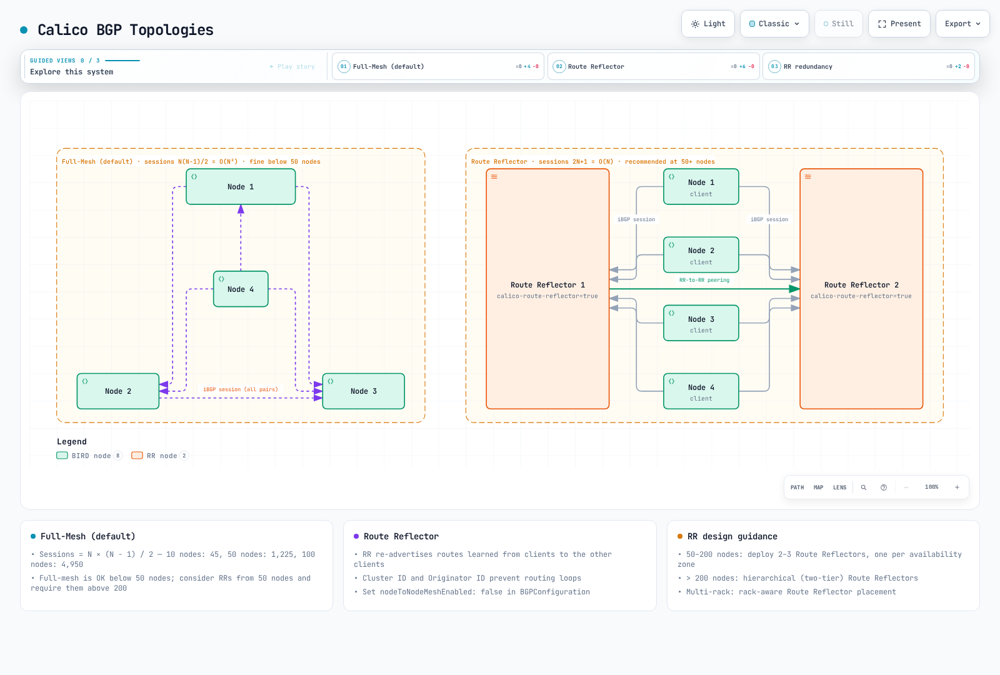

# 第 4 部分：BGP 深度解析

> **支持的版本**：Calico v3.29+ / Kubernetes 1.28+ **最后更新**：February 23, 2026

## 简介

Border Gateway Protocol (BGP) 是为互联网提供路由能力的协议，Calico 利用它为 Kubernetes 集群提供高度可扩展、基于标准的网络。与封装流量的覆盖网络不同，Calico 基于 BGP 的网络支持原生 IP 路由，可提供更出色的性能，并与现有网络基础设施无缝集成。

本深度解析涵盖 BGP 基础知识、Calico 的 BGP 架构选项、配置资源，以及适用于企业环境的高级部署模式。

***

## BGP 基础知识

### 什么是 BGP？

BGP (Border Gateway Protocol) 是一种路径向量路由协议，旨在自治系统之间交换路由信息。在 Calico 中，BGP 会在集群节点之间分发 Pod IP 路由，并且可以选择将其分发到外部网络基础设施。

### BGP 核心概念

| 概念                       | 描述                                                                 |
| -------------------------- | -------------------------------------------------------------------- |
| **自治系统 (AS)**          | 处于单一管理域下的一组 IP 网络                                      |
| **AS 编号 (ASN)**          | AS 的唯一标识符（16 位：1-65534，32 位：1-4294967294）               |
| **iBGP**                   | 内部 BGP —— 同一 AS 中路由器之间的会话                              |
| **eBGP**                   | 外部 BGP —— 不同 AS 中路由器之间的会话                              |
| **NLRI**                   | 网络层可达性信息 —— 正在通告的路由                                  |
| **BGP Speaker**            | 参与 BGP 的路由器或软件                                             |

### 私有 AS 编号范围

对于组织内部使用，IANA 保留了以下私有 ASN 范围：

```
16-bit Private ASN Range: 64512 - 65534
32-bit Private ASN Range: 4200000000 - 4294967294
```

Calico 通常在集群内部 BGP 中使用 `64512-65534` 范围内的 ASN。

### BGP 路由选择过程

当 BGP Speaker 收到到达同一目标的多条路由时，它会使用以下条件（按顺序）选择最佳路由：


### iBGP 与 eBGP 的行为差异

| 属性                    | iBGP                               | eBGP                                   |
| ----------------------- | ---------------------------------- | -------------------------------------- |
| AS\_PATH 修改          | 不修改                             | 添加本地 AS                            |
| 下一跳                  | 默认不更改                         | 更改为对等地址                         |
| 默认 TTL                | 255                                | 1（非相邻场景需要 multihop）           |
| 路由通告                | 仅通告给 eBGP 对等方（split-horizon） | 通告给所有对等方                       |
| 管理距离                | 200                                | 20                                     |

***

## Calico BGP 架构



[🔍 查看交互式图表](https://www.atomai.click/kubernetes-docs/archmaps/en-networking-calico-04-bgp-deep-dive-9.html)

### BIRD：Calico 的 BGP 实现

Calico 使用 BIRD (BIRD Internet Routing Daemon) 作为其 BGP 实现。BIRD 作为每个节点上 `calico-node` DaemonSet 的一部分运行。


### BGP 拓扑选项

Calico 支持两种主要 BGP 拓扑：

1. **节点到节点网状拓扑（全互连）** —— 默认配置
2. **路由反射器** —— 建议用于较大的集群

***

## 全互连网状拓扑

### 全互连的工作方式

在默认的全互连网状配置中，每个 Calico 节点都会与集群中的其他所有节点建立 BGP 对等会话。


### 会话数量公式

全互连网状拓扑中的 BGP 会话数量会呈二次增长：

```
Sessions = N × (N - 1) / 2

Examples:
- 10 nodes:   10 × 9 / 2 = 45 sessions
- 50 nodes:   50 × 49 / 2 = 1,225 sessions
- 100 nodes:  100 × 99 / 2 = 4,950 sessions
- 500 nodes:  500 × 499 / 2 = 124,750 sessions
```

### 全互连的扩展限制

| 集群规模       | BGP 会话数    | 每节点内存       | CPU 影响 | 建议           |
| ------------- | ------------ | --------------- | -------- | -------------- |
| < 50 个节点   | < 1,225      | \~50 MB         | 极小     | 全互连可用     |
| 50-100 个节点 | 1,225-4,950  | \~100 MB        | 低       | 考虑使用 RR    |
| 100-200 个节点 | 4,950-19,900 | \~200 MB        | 中等     | 使用 RR        |
| > 200 个节点  | > 19,900     | > 400 MB        | 高       | 必须使用 RR    |

### 启用/禁用节点到节点网状拓扑

检查当前状态：

```bash
calicoctl get bgpconfiguration default -o yaml
```

禁用节点到节点网状拓扑（使用路由反射器时）：

```yaml
apiVersion: projectcalico.org/v3
kind: BGPConfiguration
metadata:
  name: default
spec:
  nodeToNodeMeshEnabled: false
  asNumber: 64512
```

***

## 路由反射器拓扑

### 路由反射器概念

路由反射器 (RR) 通过允许一部分节点将路由反射给其他节点来解决 iBGP 的可扩展性问题。这消除了对全互连网状拓扑的需求。


### 路由反射器关键属性

| 属性                 | 描述                                                          |
| -------------------- | ------------------------------------------------------------- |
| **集群 ID**          | 标识为相同客户端提供服务的一组 RR                             |
| **源发者 ID**        | 防止路由环路（设置为源发路由器的 ID）                         |
| **路由反射**         | RR 将从客户端学习到的路由重新通告给其他客户端                 |

### 使用路由反射器时的会话数量

使用 2 个路由反射器和 N 个客户端节点：

```
Sessions = 2 × N + 1 (RR-to-RR peering)

Examples:
- 100 nodes: 2 × 100 + 1 = 201 sessions (vs 4,950 in full-mesh)
- 500 nodes: 2 × 500 + 1 = 1,001 sessions (vs 124,750 in full-mesh)
```

### 配置路由反射器节点

**步骤 1：为指定为路由反射器的节点添加标签**

```bash
kubectl label node rr-node-1 calico-route-reflector=true
kubectl label node rr-node-2 calico-route-reflector=true
```

**步骤 2：配置路由反射器集群 ID**

```yaml
apiVersion: projectcalico.org/v3
kind: Node
metadata:
  name: rr-node-1
  labels:
    calico-route-reflector: "true"
spec:
  bgp:
    ipv4Address: 10.0.1.10/24
    routeReflectorClusterID: 1.0.0.1
---
apiVersion: projectcalico.org/v3
kind: Node
metadata:
  name: rr-node-2
  labels:
    calico-route-reflector: "true"
spec:
  bgp:
    ipv4Address: 10.0.1.11/24
    routeReflectorClusterID: 1.0.0.1
```

**步骤 3：禁用节点到节点网状拓扑**

```yaml
apiVersion: projectcalico.org/v3
kind: BGPConfiguration
metadata:
  name: default
spec:
  nodeToNodeMeshEnabled: false
  asNumber: 64512
```

**步骤 4：配置到路由反射器的 BGP 对等关系**

```yaml
# Peering from non-RR nodes to RR nodes
apiVersion: projectcalico.org/v3
kind: BGPPeer
metadata:
  name: peer-to-route-reflectors
spec:
  nodeSelector: "!has(calico-route-reflector)"
  peerSelector: has(calico-route-reflector)
---
# Peering between RR nodes
apiVersion: projectcalico.org/v3
kind: BGPPeer
metadata:
  name: route-reflector-mesh
spec:
  nodeSelector: has(calico-route-reflector)
  peerSelector: has(calico-route-reflector)
```

### 路由反射器冗余模式

**模式 1：双路由反射器（小型/中型集群）**


**模式 2：分层路由反射器（大型集群）**


***

## BGPPeer 资源

`BGPPeer` 资源定义 Calico 节点与外部 BGP Speaker 之间的 BGP 对等关系。

### BGPPeer 作用域类型

| 类型                  | 描述                 | 使用场景               |
| --------------------- | -------------------- | ---------------------- |
| **全局**              | 应用于所有节点       | 外部路由器对等         |
| **节点特定**          | 使用 nodeSelector    | 机架本地对等           |
| **每节点**            | 指定确切节点         | 特殊配置               |

### 全局 BGPPeer 示例

将所有节点与外部 ToR 交换机对等：

```yaml
apiVersion: projectcalico.org/v3
kind: BGPPeer
metadata:
  name: peer-to-tor-switches
spec:
  peerIP: 10.0.0.1
  asNumber: 65001
  # No nodeSelector means all nodes peer with this address
```

### 节点特定 BGPPeer 示例

将特定机架中的节点与其本地 ToR 交换机对等：

```yaml
apiVersion: projectcalico.org/v3
kind: BGPPeer
metadata:
  name: rack1-tor-peer
spec:
  nodeSelector: rack == 'rack1'
  peerIP: 10.0.1.1
  asNumber: 65001
---
apiVersion: projectcalico.org/v3
kind: BGPPeer
metadata:
  name: rack2-tor-peer
spec:
  nodeSelector: rack == 'rack2'
  peerIP: 10.0.2.1
  asNumber: 65002
```

### 使用 peerSelector 的 BGPPeer

使用 `peerSelector` 动态选择 Calico 节点作为对等方：

```yaml
apiVersion: projectcalico.org/v3
kind: BGPPeer
metadata:
  name: client-to-rr-peering
spec:
  nodeSelector: "!has(route-reflector)"
  peerSelector: has(route-reflector)
```

### 高级 BGPPeer 配置

```yaml
apiVersion: projectcalico.org/v3
kind: BGPPeer
metadata:
  name: advanced-peer
spec:
  node: specific-node-name
  peerIP: 192.168.1.1
  asNumber: 65100

  # Authentication
  password:
    secretKeyRef:
      name: bgp-secrets
      key: peer-password

  # Timers (seconds)
  keepAliveTime: 30
  holdTime: 90

  # Source address for BGP session
  sourceAddress: 10.0.0.5

  # Maximum number of hops for eBGP multihop
  numAllowedLocalASNumbers: 2

  # TTL security (GTSM)
  ttlSecurity: 1

  # Filters
  filters:
    - action: Accept
      matchOperator: In
      cidr: 10.0.0.0/8
```

***

## BGPConfiguration 资源

`BGPConfiguration` 资源定义集群范围内的 BGP 设置。

### 基本 BGPConfiguration

```yaml
apiVersion: projectcalico.org/v3
kind: BGPConfiguration
metadata:
  name: default
spec:
  # Cluster AS number
  asNumber: 64512

  # Node-to-node mesh (disable for Route Reflectors)
  nodeToNodeMeshEnabled: false

  # Log level for BIRD
  logSeverityScreen: Info
```

### Service IP 通告

Calico 可以通过 BGP 通告 Kubernetes Service IP，使外部客户端能够直接访问 Service。

```yaml
apiVersion: projectcalico.org/v3
kind: BGPConfiguration
metadata:
  name: default
spec:
  asNumber: 64512
  nodeToNodeMeshEnabled: false

  # Advertise Service ClusterIPs
  serviceClusterIPs:
    - cidr: 10.96.0.0/12

  # Advertise Service ExternalIPs
  serviceExternalIPs:
    - cidr: 203.0.113.0/24

  # Advertise Service LoadBalancerIPs
  serviceLoadBalancerIPs:
    - cidr: 198.51.100.0/24
```

### BGP Communities 配置

BGP communities 可让您为外部路由器上的基于策略路由标记路由：

```yaml
apiVersion: projectcalico.org/v3
kind: BGPConfiguration
metadata:
  name: default
spec:
  asNumber: 64512

  # Community tagging for pod networks
  prefixAdvertisements:
    - cidr: 10.244.0.0/16
      communities:
        - "64512:100"  # Standard community
        - "64512:200"
    - cidr: 10.96.0.0/12
      communities:
        - "64512:300"  # Service IPs community

  # Named communities (referenced in other configs)
  communities:
    - name: pod-networks
      value: "64512:100"
    - name: service-networks
      value: "64512:300"
    - name: no-export
      value: "65535:65281"  # Well-known NO_EXPORT
```

### 节点特定 AS 编号

对于复杂拓扑，您可以为每个节点分配不同的 AS 编号：

```yaml
apiVersion: projectcalico.org/v3
kind: Node
metadata:
  name: border-node-1
spec:
  bgp:
    ipv4Address: 10.0.1.10/24
    asNumber: 65001  # Override cluster default
```

***

## Service IP 通告

### 通告类型

| 类型                  | 描述                 | 使用场景               |
| --------------------- | -------------------- | ---------------------- |
| **ClusterIP**         | 内部 Service IP      | 内部负载均衡           |
| **ExternalIP**        | 用户分配的外部 IP    | 直接外部访问           |
| **LoadBalancerIP**    | 云提供商分配         | 云集成                 |

### ExternalIP 通告示例

```yaml
# BGPConfiguration for ExternalIP advertisement
apiVersion: projectcalico.org/v3
kind: BGPConfiguration
metadata:
  name: default
spec:
  serviceExternalIPs:
    - cidr: 203.0.113.0/24

---
# Service with ExternalIP
apiVersion: v1
kind: Service
metadata:
  name: my-external-service
spec:
  type: ClusterIP
  externalIPs:
    - 203.0.113.10
  selector:
    app: my-app
  ports:
    - port: 80
      targetPort: 8080
```

### LoadBalancer IP 通告

适用于未集成云提供商的裸金属集群：

```yaml
apiVersion: projectcalico.org/v3
kind: BGPConfiguration
metadata:
  name: default
spec:
  serviceLoadBalancerIPs:
    - cidr: 198.51.100.0/24

---
apiVersion: v1
kind: Service
metadata:
  name: my-lb-service
  annotations:
    metallb.universe.tf/loadBalancerIPs: 198.51.100.50
spec:
  type: LoadBalancer
  selector:
    app: my-app
  ports:
    - port: 443
      targetPort: 8443
```

### 选择性 Service 通告

使用注解控制通告哪些 Service：

```yaml
apiVersion: v1
kind: Service
metadata:
  name: internal-only-service
  annotations:
    # Prevent BGP advertisement
    projectcalico.org/bgp-advertise: "false"
spec:
  type: LoadBalancer
  ...
```

***

## 物理网络集成

### ToR 交换机配置示例

**Cisco NX-OS 配置：**

```
! Configure BGP
router bgp 65001
  router-id 10.0.1.1

  ! Peer with Kubernetes nodes in rack
  neighbor 10.0.1.0/24 remote-as 64512

  address-family ipv4 unicast
    ! Accept pod network routes
    network 10.244.0.0/16
    ! Redistribute connected for node networks
    redistribute connected route-map KUBERNETES-NODES

    ! Route map for prefix filtering
    neighbor 10.0.1.0/24 route-map ACCEPT-K8S-ROUTES in
    neighbor 10.0.1.0/24 route-map DENY-ALL out

! Route map definitions
route-map ACCEPT-K8S-ROUTES permit 10
  match ip address prefix-list K8S-POD-NETS

ip prefix-list K8S-POD-NETS seq 10 permit 10.244.0.0/16 le 26
ip prefix-list K8S-POD-NETS seq 20 permit 10.96.0.0/12 le 32
```

**Arista EOS 配置：**

```
! Configure BGP
router bgp 65001
  router-id 10.0.1.1

  ! Peer group for Kubernetes nodes
  neighbor K8S-NODES peer group
  neighbor K8S-NODES remote-as 64512
  neighbor K8S-NODES maximum-routes 10000
  neighbor K8S-NODES password 7 <encrypted>

  ! Dynamic neighbors from subnet
  bgp listen range 10.0.1.0/24 peer-group K8S-NODES

  address-family ipv4
    neighbor K8S-NODES activate
    neighbor K8S-NODES prefix-list K8S-PODS-IN in
    neighbor K8S-NODES prefix-list DENY-ALL out

! Prefix lists
ip prefix-list K8S-PODS-IN seq 10 permit 10.244.0.0/16 le 26
ip prefix-list K8S-PODS-IN seq 20 permit 10.96.0.0/12 le 32
ip prefix-list DENY-ALL seq 10 deny 0.0.0.0/0 le 32
```

**Juniper Junos 配置：**

```
protocols {
    bgp {
        group K8S-NODES {
            type external;
            peer-as 64512;
            local-as 65001;

            multipath multiple-as;

            import K8S-IMPORT;
            export DENY-ALL;

            allow 10.0.1.0/24;

            authentication-key "$9$encrypted";
        }
    }
}

policy-options {
    prefix-list K8S-POD-NETS {
        10.244.0.0/16;
    }
    prefix-list K8S-SVC-NETS {
        10.96.0.0/12;
    }
    policy-statement K8S-IMPORT {
        term accept-pods {
            from {
                prefix-list K8S-POD-NETS;
                prefix-length-range /26-/26;
            }
            then accept;
        }
        term accept-services {
            from {
                prefix-list K8S-SVC-NETS;
            }
            then accept;
        }
        term reject-all {
            then reject;
        }
    }
    policy-statement DENY-ALL {
        then reject;
    }
}
```

### Spine-Leaf 架构集成


用于 spine-leaf 的 Calico 配置：

```yaml
# Disable node-to-node mesh
apiVersion: projectcalico.org/v3
kind: BGPConfiguration
metadata:
  name: default
spec:
  nodeToNodeMeshEnabled: false
  asNumber: 64512

---
# Peer nodes with their local leaf switch
apiVersion: projectcalico.org/v3
kind: BGPPeer
metadata:
  name: rack1-leaf-peer
spec:
  nodeSelector: topology.kubernetes.io/zone == 'rack1'
  peerIP: 10.0.1.1
  asNumber: 65001

---
apiVersion: projectcalico.org/v3
kind: BGPPeer
metadata:
  name: rack2-leaf-peer
spec:
  nodeSelector: topology.kubernetes.io/zone == 'rack2'
  peerIP: 10.0.2.1
  asNumber: 65002

---
apiVersion: projectcalico.org/v3
kind: BGPPeer
metadata:
  name: rack3-leaf-peer
spec:
  nodeSelector: topology.kubernetes.io/zone == 'rack3'
  peerIP: 10.0.3.1
  asNumber: 65003
```

***

## BGP Community 标记策略

### Community 设计模式

| Community       | 含义           | 操作                           |
| --------------- | -------------- | ------------------------------ |
| `64512:100`     | Pod 网络       | 接受，正常路由                 |
| `64512:200`     | Service IP     | 接受，可以应用特殊策略         |
| `64512:300`     | 基础设施       | 更高优先级路由                 |
| `65535:65281`   | NO\_EXPORT    | 不通告到 AS 外部               |
| `65535:65282`   | NO\_ADVERTISE | 不通告给任何对等方             |

### 基于 Community 的流量工程

```yaml
apiVersion: projectcalico.org/v3
kind: BGPConfiguration
metadata:
  name: default
spec:
  asNumber: 64512

  communities:
    - name: production
      value: "64512:100"
    - name: staging
      value: "64512:200"
    - name: local-only
      value: "65535:65281"  # NO_EXPORT

  prefixAdvertisements:
    # Production pod networks - advertise everywhere
    - cidr: 10.244.0.0/17
      communities:
        - production

    # Staging pod networks - keep local
    - cidr: 10.244.128.0/17
      communities:
        - staging
        - local-only

    # Service IPs
    - cidr: 10.96.0.0/12
      communities:
        - production
```

***

## BGP 安全性

### MD5 认证

使用 MD5 认证保护 BGP 会话：

```yaml
# Create secret for BGP password
apiVersion: v1
kind: Secret
metadata:
  name: bgp-auth
  namespace: kube-system
type: Opaque
stringData:
  bgp-password: "SuperSecretPassword123!"

---
# Reference in BGPPeer
apiVersion: projectcalico.org/v3
kind: BGPPeer
metadata:
  name: secure-peer
spec:
  peerIP: 10.0.1.1
  asNumber: 65001
  password:
    secretKeyRef:
      name: bgp-auth
      key: bgp-password
```

### 前缀过滤

限制接受/通告哪些前缀：

```yaml
apiVersion: projectcalico.org/v3
kind: BGPFilter
metadata:
  name: allow-pod-nets-only
spec:
  exportV4:
    - action: Accept
      matchOperator: In
      cidr: 10.244.0.0/16
      prefixLength: "24-28"
    - action: Reject
      matchOperator: In
      cidr: 0.0.0.0/0

  importV4:
    - action: Accept
      matchOperator: In
      cidr: 10.0.0.0/8
    - action: Reject
      matchOperator: In
      cidr: 0.0.0.0/0

---
apiVersion: projectcalico.org/v3
kind: BGPPeer
metadata:
  name: filtered-peer
spec:
  peerIP: 10.0.1.1
  asNumber: 65001
  filters:
    - allow-pod-nets-only
```

### GTSM (TTL 安全)

通用 TTL 安全机制可防止伪造的 BGP 数据包：

```yaml
apiVersion: projectcalico.org/v3
kind: BGPPeer
metadata:
  name: gtsm-enabled-peer
spec:
  peerIP: 10.0.1.1
  asNumber: 65001
  ttlSecurity: 1  # Expect TTL of 254 or higher
```

***

## 性能调优

### BGP 定时器配置

```yaml
apiVersion: projectcalico.org/v3
kind: BGPPeer
metadata:
  name: tuned-peer
spec:
  peerIP: 10.0.1.1
  asNumber: 65001

  # Keepalive interval (default: 60s)
  keepAliveTime: 20

  # Hold time (default: 180s, must be 3x keepalive)
  holdTime: 60
```

### 路由聚合

通过聚合 Pod CIDR 减少通告的路由数量：

```yaml
apiVersion: projectcalico.org/v3
kind: BGPConfiguration
metadata:
  name: default
spec:
  asNumber: 64512

  # Aggregate individual /26 pod CIDRs into /16
  prefixAdvertisements:
    - cidr: 10.244.0.0/16
      communities:
        - "64512:100"
```

### 优雅重启

启用 BGP Graceful Restart，以尽量减少 BIRD 重启期间的流量中断：

```yaml
apiVersion: projectcalico.org/v3
kind: BGPConfiguration
metadata:
  name: default
spec:
  asNumber: 64512

  # Enable graceful restart (BIRD default is enabled)
  # Stale route time in seconds
  nodeMeshMaxRestartTime: 120
```

***

## BGP 调试

### birdcl 命令

从 calico-node Pod 访问 BIRD 命令行界面：

```bash
# Enter calico-node pod
kubectl exec -it -n kube-system calico-node-xxxxx -c calico-node -- /bin/sh

# Show BGP protocol status
birdcl -s /var/run/calico/bird.ctl show protocols all

# Show BGP neighbors
birdcl -s /var/run/calico/bird.ctl show protocols all bgp*

# Show routing table
birdcl -s /var/run/calico/bird.ctl show route

# Show routes to specific prefix
birdcl -s /var/run/calico/bird.ctl show route for 10.244.1.0/24

# Show route export to specific peer
birdcl -s /var/run/calico/bird.ctl show route export Mesh_10_0_1_11

# Show BGP neighbor details
birdcl -s /var/run/calico/bird.ctl show protocols all Mesh_10_0_1_11
```

### 常见 BGP 问题和解决方案

| 问题                     | 症状                          | 解决方案                                |
| ------------------------ | ----------------------------- | --------------------------------------- |
| 会话卡在 Active 状态     | 未学习到路由                  | 检查防火墙（TCP 179）、AS 编号          |
| 路由未传播               | Pod 跨机架不可达              | 验证节点到节点网状拓扑或 RR 配置        |
| 路由抖动                 | 间歇性连接                    | 检查 BGP 定时器和网络稳定性             |
| 会话重置                 | 频繁 Established->Active      | 检查 MTU、MD5 密码                      |

### 诊断命令

```bash
# Check Calico node status
calicoctl node status

# List all BGP peers
calicoctl get bgppeers -o wide

# Check BGP configuration
calicoctl get bgpconfiguration default -o yaml

# View BIRD logs
kubectl logs -n kube-system calico-node-xxxxx -c calico-node | grep -i bird

# Check IP routes on node
ip route show | grep bird
```

***

## 多机架和多数据中心设计

### 使用路由反射器的多机架设计


### 多数据中心 BGP 设计


多数据中心配置：

```yaml
# DC1 Configuration
apiVersion: projectcalico.org/v3
kind: BGPConfiguration
metadata:
  name: default
spec:
  asNumber: 64512
  nodeToNodeMeshEnabled: false

  communities:
    - name: dc1-origin
      value: "64512:1"

---
# Peer DC1 RRs with WAN routers
apiVersion: projectcalico.org/v3
kind: BGPPeer
metadata:
  name: dc1-to-wan
spec:
  nodeSelector: has(route-reflector)
  peerIP: 10.255.0.1  # WAN Router
  asNumber: 65000
```

***

## 最佳实践总结

### 设计建议

1. **集群规模 < 50 个节点**：全互连网状拓扑可接受
2. **集群规模 50-200 个节点**：部署 2-3 个路由反射器
3. **集群规模 > 200 个节点**：部署分层路由反射器
4. **多机架**：使用感知机架的路由反射器部署位置
5. **多数据中心**：每个 DC 使用独立 AS，DC 之间使用 eBGP

### 安全建议

1. 始终为外部对等方启用 MD5 认证
2. 实施前缀过滤以防止路由注入
3. 在支持的情况下使用 GTSM (TTL 安全)
4. 限制每个对等方接受的最大路由数量
5. 监控 BGP 会话是否存在异常

### 运维建议

1. 为 BGP 拓扑一致地标记节点
2. 记录 AS 编号分配方案
3. 实施 BGP 监控和告警
4. 定期测试故障切换场景
5. 在各对等方之间保持 BGP 定时器一致

***

## 参考资料

* [Calico BGP 文档](https://docs.tigera.io/calico/latest/networking/configuring/bgp)
* [BIRD Internet Routing Daemon](https://bird.network.cz/)
* [RFC 4271 - BGP-4](https://tools.ietf.org/html/rfc4271)
* [RFC 4456 - BGP 路由反射](https://tools.ietf.org/html/rfc4456)
* [RFC 5765 - 用于 BGP 的 GTSM](https://tools.ietf.org/html/rfc5082)
