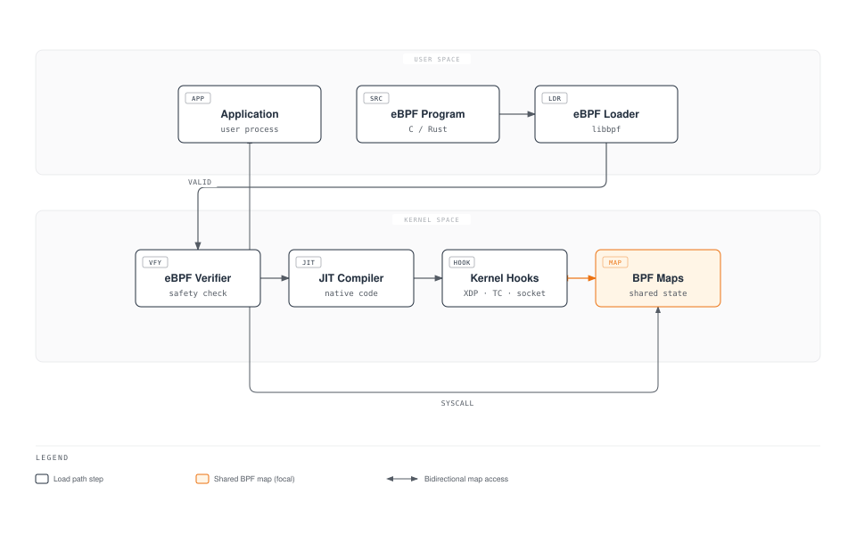
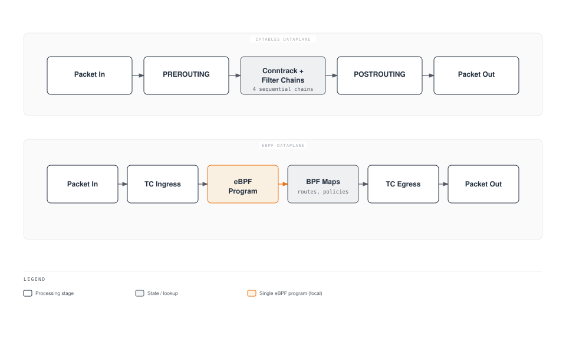
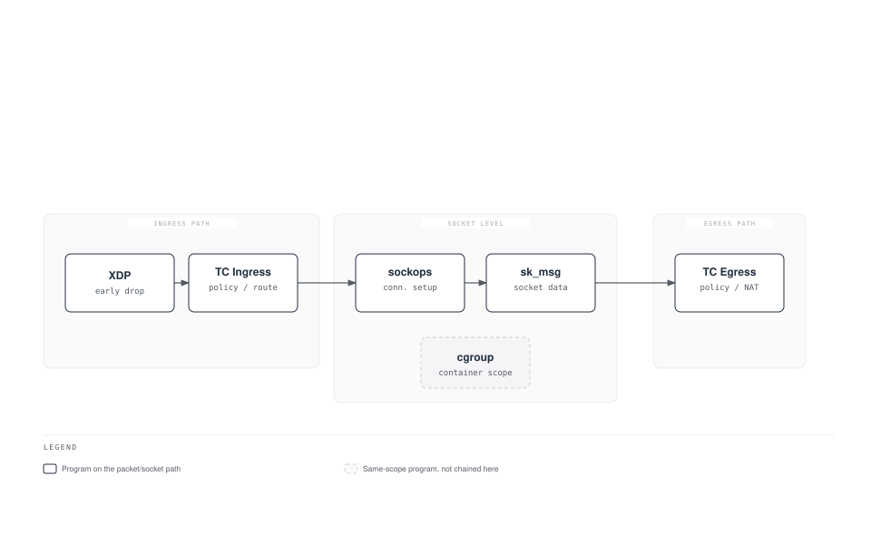
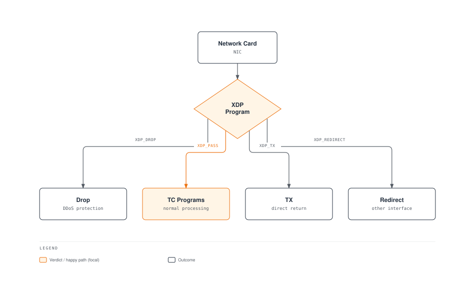
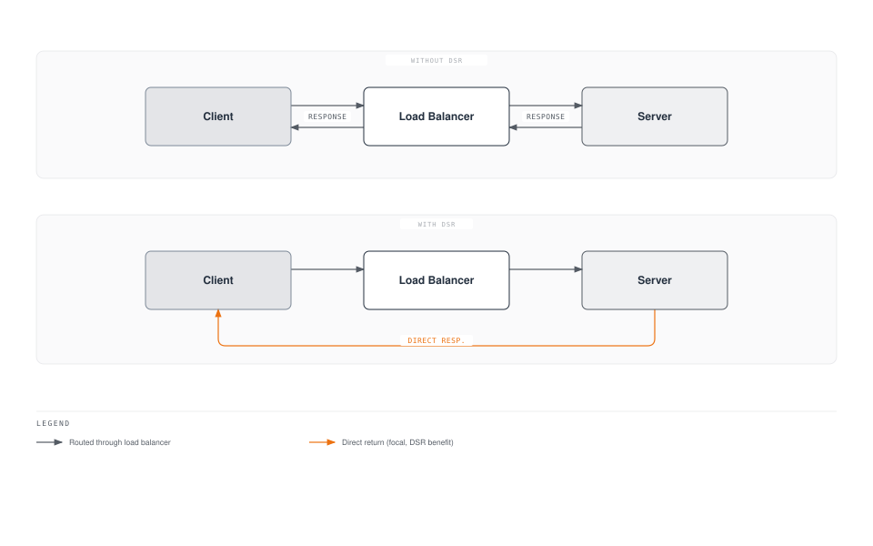
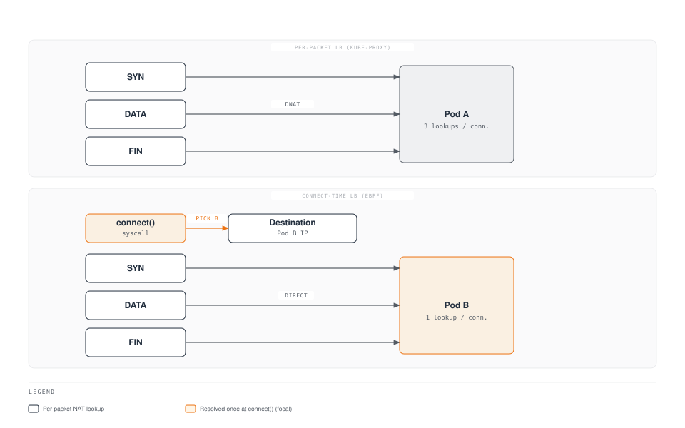
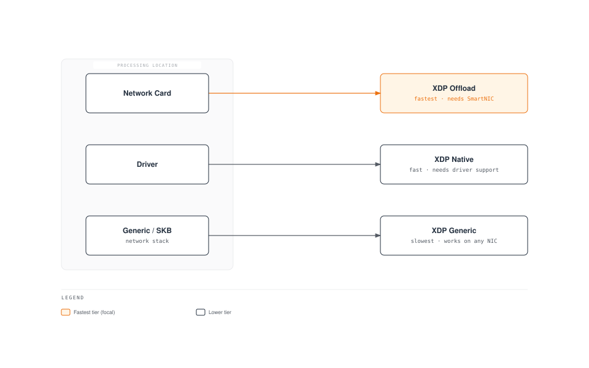

# 第 6 部分：eBPF 数据平面

> **支持的版本**：Calico v3.29+ / Kubernetes 1.28+ **最后更新**：February 23, 2026

## 简介

Calico 的 eBPF 数据平面代表了 Kubernetes 网络的一项重大演进，它以现代 eBPF 程序替代了传统的基于 iptables 的数据包处理。这种方法可带来显著的性能提升、更低的延迟以及增强的可观测性能力。

本文将从网络视角深入探讨 eBPF 基础知识、Calico 的 eBPF 架构、迁移策略和性能优化技术。

***

## eBPF 基础知识

### 什么是 eBPF？

eBPF（扩展 Berkeley Packet Filter）是一项革命性技术，可在无需修改内核源代码或加载内核模块的情况下，在 Linux 内核中运行沙盒程序。



### 网络场景下的 eBPF 核心概念

| 概念         | 描述                               | 在 Calico 中的用途              |
| ------------ | ---------------------------------- | ------------------------------- |
| **程序**     | 在内核钩子处执行的字节码           | 数据包过滤、路由                |
| **Map**      | 由程序共享的键值存储               | 路由表、策略规则                |
| **钩子**     | 内核中的附加点                     | XDP、TC、socket                 |
| **Helper**   | 可从 eBPF 调用的内核函数           | 数据包处理、map 操作            |
| **BTF**      | map/程序的类型信息                 | 调试信息、CO-RE                 |

### eBPF 与 iptables

| 方面                 | iptables                  | eBPF              |
| -------------------- | ------------------------- | ----------------- |
| **架构**             | 顺序规则链                | 直接执行          |
| **复杂度**           | O(n) 规则匹配             | O(1) map 查找     |
| **内核跨越次数**     | 每个数据包多次            | 最少              |
| **可编程性**         | 固定规则类型              | 灵活的程序        |
| **可观测性**         | 有限的计数器              | 丰富的指标        |
| **CPU 效率**         | 更高的中断开销            | 更低的开销        |

***

## Calico eBPF 架构


[🔍 查看交互式图表](https://www.atomai.click/kubernetes-docs/archmaps/en-networking-calico-06-ebpf-dataplane-9.html)

### 架构对比



### Calico 中的 eBPF 程序类型

Calico 针对不同功能使用多种 eBPF 程序类型：



### TC（Traffic Control）程序

TC 程序是 Calico 的主要数据平面钩子：

```
Ingress TC Program Functions:
├── Policy enforcement (allow/deny)
├── Connection tracking lookup
├── Service load balancing (DNAT)
├── Tunnel decapsulation
└── Metrics collection

Egress TC Program Functions:
├── Policy enforcement (egress rules)
├── SNAT for masquerade
├── Tunnel encapsulation
└── DSR return path handling
```

### XDP（eXpress Data Path）程序

XDP 提供最早的数据包处理钩子：



### Socket 程序

用于 Service mesh 集成的 socket 层 eBPF：

```yaml
# sockops: Intercept socket operations
- connect() -> Redirect to local sidecar
- accept() -> Apply connection policies
- close() -> Cleanup connection state

# sk_msg: Process socket data
- sendmsg() -> Apply L7 policy
- recvmsg() -> Inspect response
```

***

## BPF Map 结构

### Calico 使用的 Map 类型

| Map 类型           | 用途                 | 示例用途             |
| ------------------ | -------------------- | -------------------- |
| **Hash Map**       | 键值查找             | 连接跟踪             |
| **LRU Hash**       | 自动驱逐的缓存       | NAT 表               |
| **Array**          | 固定大小的索引       | Endpoint 配置        |
| **LPM Trie**       | 最长前缀匹配         | 路由查找             |
| **Per-CPU Array**  | 可扩展计数器         | 统计信息             |

### 路由 Map 结构

```c
// Simplified route map entry
struct calico_route_key {
    __be32 prefix;
    __u32 prefix_len;
};

struct calico_route_value {
    __u32 flags;          // LOCAL, REMOTE, HOST, etc.
    __be32 next_hop;      // Next hop IP
    __u32 ifindex;        // Interface index
    __u8 mac[6];          // Destination MAC
};
```

### 连接跟踪 Map

```c
// Connection tracking key
struct calico_ct_key {
    __be32 src_ip;
    __be32 dst_ip;
    __be16 src_port;
    __be16 dst_port;
    __u8 protocol;
};

// Connection tracking value
struct calico_ct_value {
    __u64 created;        // Timestamp
    __u64 last_seen;      // Last packet
    __be32 orig_dst;      // Pre-DNAT destination
    __be16 orig_port;     // Pre-DNAT port
    __u32 flags;          // Connection state
};
```

### 策略 Map 结构

```c
// Policy rule entry
struct calico_policy_key {
    __u32 policy_id;
    __u32 rule_index;
};

struct calico_policy_value {
    __u32 action;         // ALLOW, DENY, PASS
    __u32 flags;
    __be32 src_net;
    __be32 src_mask;
    __be32 dst_net;
    __be32 dst_mask;
    __be16 port_start;
    __be16 port_end;
};
```

***

## Direct Server Return（DSR）

### DSR 概述

DSR 允许响应流量绕过负载均衡器，从而降低延迟和负载均衡器资源消耗。



### Calico 中的 DSR 模式

| 模式         | 描述                     | 使用场景                  |
| ------------ | ------------------------ | ------------------------- |
| **Disabled** | 所有流量通过 LB          | 默认设置，所有环境        |
| **IPIP**     | 响应通过 IPIP 隧道      | 跨子网                    |
| **DSR**      | 直接响应                 | 相同 L2 网络              |

### 启用 DSR

```yaml
apiVersion: projectcalico.org/v3
kind: FelixConfiguration
metadata:
  name: default
spec:
  bpfEnabled: true
  bpfExternalServiceMode: DSR
```

### DSR 要求

* 服务器和客户端必须位于相同的 L2 网络，或者
* 对跨子网使用 IPIP/VXLAN 封装
* 外部客户端 IP 必须可从服务器路由到
* 入站路径上不得使用 SNAT

***

## Connect-Time 负载均衡

### 传统方式与 Connect-Time LB



### Connect-Time LB 的优势

| 方面                   | 逐数据包            | Connect-Time          |
| ---------------------- | ------------------- | --------------------- |
| **NAT 开销**           | 每个数据包          | 仅连接建立时          |
| **连接跟踪**           | 必需                | 最少                  |
| **延迟**               | 更高（NAT 查找）    | 更低（直接）          |
| **CPU 使用率**         | 更高                | 更低                  |

### Connect-Time LB 的工作原理

```c
// Simplified connect-time LB logic
int bpf_connect4(struct bpf_sock_addr *ctx) {
    // Check if destination is a Service IP
    struct lb_backend *backend = lookup_service(ctx->user_ip4, ctx->user_port);

    if (backend) {
        // Rewrite destination to backend pod
        ctx->user_ip4 = backend->pod_ip;
        ctx->user_port = backend->pod_port;
    }

    return 1; // Allow connection
}
```

***

## XDP 加速

### XDP 处理级别



### XDP 模式

| 模式         | 位置         | 性能     | 要求           |
| ------------ | ------------ | -------- | -------------- |
| **Offload**  | NIC 硬件     | 最快     | SmartNIC       |
| **Native**   | NIC 驱动程序 | 快       | 驱动程序支持   |
| **Generic**  | 网络栈       | 基准     | 任意 NIC       |

### 在 Calico 中启用 XDP

```yaml
apiVersion: projectcalico.org/v3
kind: FelixConfiguration
metadata:
  name: default
spec:
  bpfEnabled: true

  # XDP mode: Disabled, Enabled, Offload
  xdpEnabled: Enabled

  # Interfaces for XDP
  # Uses same detection as BPF dataplane interface
```

### Calico 中的 XDP 用例

1. **DDoS 防护**：在 NIC 处丢弃恶意流量
2. **Blocklist 强制执行**：提前拒绝被阻止的 IP
3. **速率限制**：数据包在进入网络栈前的速率限制
4. **指标收集**：线速数据包计数

***

## eBPF 模式要求

### 内核要求

| 要求             | 最低版本        | 说明                      |
| ---------------- | --------------- | ------------------------- |
| **Linux 内核**   | 5.3+            | 建议使用 5.8+             |
| **BTF 支持**     | 必需            | `CONFIG_DEBUG_INFO_BTF=y` |
| **BPF 系统调用** | 必需            | `CONFIG_BPF_SYSCALL=y`    |
| **BPF JIT**      | 必需            | `CONFIG_BPF_JIT=y`        |

### 验证内核支持

```bash
# Check kernel version
uname -r

# Check BTF support
ls /sys/kernel/btf/vmlinux

# Check BPF support
cat /boot/config-$(uname -r) | grep -E "CONFIG_BPF|CONFIG_DEBUG_INFO_BTF"

# Required output:
# CONFIG_BPF=y
# CONFIG_BPF_SYSCALL=y
# CONFIG_BPF_JIT=y
# CONFIG_DEBUG_INFO_BTF=y
```

### 发行版支持

| 发行版             | eBPF 就绪 | 说明                         |
| ------------------ | --------- | ---------------------------- |
| Ubuntu 20.04+      | 是        | 内核 5.4+                    |
| Ubuntu 22.04+      | 是        | 内核 5.15+（建议）           |
| RHEL/CentOS 8.2+   | 是        | 内核 4.18+，包含 backport    |
| Amazon Linux 2     | 部分支持  | 可能需要升级内核             |
| Amazon Linux 2023  | 是        | 内核 6.1+                    |
| Bottlerocket       | 是        | 专为容器构建                 |

### Calico 版本要求

```yaml
# Minimum Calico versions for eBPF features
eBPF dataplane basic:     v3.13.0
Connect-time LB:          v3.16.0
XDP acceleration:         v3.18.0
Dual-stack eBPF:         v3.20.0
Host-networked pods:      v3.13.0 (with limitations)
```

### Node 配置

```yaml
apiVersion: projectcalico.org/v3
kind: FelixConfiguration
metadata:
  name: default
spec:
  # Enable eBPF dataplane
  bpfEnabled: true

  # Data interface detection
  # Auto-detect: first interface with default route
  # Or specify pattern: "eth*"
  bpfDataIfacePattern: "^((en|eth|wl)[opsx].*|(eth|wlan|eno)[0-9].*)"

  # External service mode: Tunnel or DSR
  bpfExternalServiceMode: Tunnel

  # Log level for BPF programs
  bpfLogLevel: Info

  # Kube-proxy replacement
  bpfKubeProxyIptablesCleanupEnabled: true

  # Connection tracking
  bpfConnectTimeLoadBalancingEnabled: true
```

***

## 从 iptables 迁移到 eBPF

### 迁移前检查清单

```bash
# 1. Verify kernel requirements
uname -r  # Should be 5.3+
ls /sys/kernel/btf/vmlinux  # BTF must exist

# 2. Check Calico version
kubectl get deployment -n kube-system calico-kube-controllers -o jsonpath='{.spec.template.spec.containers[0].image}'
# Should be v3.13.0+

# 3. Verify CNI plugin
kubectl get ds -n kube-system calico-node -o jsonpath='{.spec.template.spec.containers[0].env}' | grep -i cni

# 4. Check existing networking mode
calicoctl get felixconfiguration default -o yaml | grep -i bpf

# 5. Verify no conflicting CNI
ls /etc/cni/net.d/
```

### 迁移步骤

**第 1 步：更新 FelixConfiguration（dry-run）**

```yaml
# Save current configuration
kubectl get felixconfiguration default -o yaml > felix-backup.yaml

# Create eBPF configuration
apiVersion: projectcalico.org/v3
kind: FelixConfiguration
metadata:
  name: default
spec:
  bpfEnabled: false  # Not enabled yet
  bpfLogLevel: Debug  # For troubleshooting
  bpfDataIfacePattern: "^((en|eth|wl)[opsx].*|(eth|wlan|eno)[0-9].*)"
  bpfExternalServiceMode: Tunnel
  bpfKubeProxyIptablesCleanupEnabled: false  # Don't cleanup yet
```

**第 2 步：禁用 kube-proxy（若将 Calico 用作替代方案）**

```bash
# Option A: Scale down kube-proxy
kubectl -n kube-system patch daemonset kube-proxy -p '{"spec":{"template":{"spec":{"nodeSelector":{"non-calico":"true"}}}}}'

# Option B: Add calico node selector to skip kube-proxy nodes
# Only if running both temporarily
```

**第 3 步：在测试 Node 上启用 eBPF**

```bash
# Label test node
kubectl label node test-node-1 calico-ebpf=enabled

# Apply node-specific config
calicoctl apply -f - <<EOF
apiVersion: projectcalico.org/v3
kind: FelixConfiguration
metadata:
  name: node.test-node-1
spec:
  bpfEnabled: true
EOF
```

**第 4 步：验证测试 Node**

```bash
# Check BPF programs loaded
kubectl exec -n kube-system calico-node-xxxxx -c calico-node -- \
  bpftool prog list

# Verify connectivity
kubectl run test-pod --image=busybox --restart=Never --overrides='{"spec":{"nodeName":"test-node-1"}}' -- sleep 3600
kubectl exec test-pod -- wget -O- http://kubernetes.default.svc

# Check logs
kubectl logs -n kube-system -l k8s-app=calico-node -c calico-node | grep -i bpf
```

**第 5 步：推广到所有 Node**

```yaml
apiVersion: projectcalico.org/v3
kind: FelixConfiguration
metadata:
  name: default
spec:
  bpfEnabled: true
  bpfLogLevel: Info
  bpfDataIfacePattern: "^((en|eth|wl)[opsx].*|(eth|wlan|eno)[0-9].*)"
  bpfExternalServiceMode: Tunnel
  bpfKubeProxyIptablesCleanupEnabled: true
  bpfConnectTimeLoadBalancingEnabled: true
```

**第 6 步：清理 iptables 规则**

```bash
# After confirming eBPF is working
calicoctl patch felixconfiguration default -p '{"spec":{"bpfKubeProxyIptablesCleanupEnabled":true}}'

# Verify iptables rules are minimal
iptables -L -n | wc -l  # Should be significantly reduced
```

### 回滚过程

```bash
# Disable eBPF
calicoctl patch felixconfiguration default -p '{"spec":{"bpfEnabled":false}}'

# Restore kube-proxy if disabled
kubectl -n kube-system patch daemonset kube-proxy -p '{"spec":{"template":{"spec":{"nodeSelector":null}}}}'

# Wait for calico-node restart
kubectl rollout status ds/calico-node -n kube-system

# Verify iptables rules restored
iptables -L -n -v
```

***

## 性能基准测试

### 延迟对比

| 场景                    | iptables | eBPF  | 改善幅度    |
| ----------------------- | -------- | ----- | ----------- |
| Pod 到 Pod（同一 Node） | 45 μs    | 25 μs | 44%         |
| Pod 到 Pod（跨 Node）   | 120 μs   | 80 μs | 33%         |
| Service（ClusterIP）    | 150 μs   | 60 μs | 60%         |
| Service（NodePort）     | 180 μs   | 70 μs | 61%         |

### 吞吐量对比

| 场景                | iptables | eBPF    | 改善幅度    |
| ------------------- | -------- | ------- | ----------- |
| TCP 单流            | 15 Gbps  | 23 Gbps | 53%         |
| TCP 多流            | 35 Gbps  | 48 Gbps | 37%         |
| UDP 单流            | 8 Gbps   | 18 Gbps | 125%        |
| 小数据包（64B）     | 2M pps   | 5M pps  | 150%        |

### CPU 效率

```
Connection rate test (connections/sec):

iptables dataplane:
├── 1000 rules: 50,000 conn/s
├── 5000 rules: 35,000 conn/s
└── 10000 rules: 20,000 conn/s

eBPF dataplane:
├── 1000 rules: 120,000 conn/s
├── 5000 rules: 115,000 conn/s
└── 10000 rules: 110,000 conn/s

Note: eBPF performance remains nearly constant regardless of rule count
```

### 运行自己的基准测试

```bash
# Install netperf
apt-get install netperf

# Pod-to-Pod latency (TCP_RR)
kubectl exec client-pod -- netperf -H server-pod-ip -t TCP_RR -l 30

# Throughput (TCP_STREAM)
kubectl exec client-pod -- netperf -H server-pod-ip -t TCP_STREAM -l 30

# Service latency
kubectl exec client-pod -- netperf -H service-cluster-ip -t TCP_RR -l 30

# Compare with iperf3
kubectl exec client-pod -- iperf3 -c server-pod-ip -t 30
```

***

## eBPF 调试

### bpftool 命令

```bash
# List loaded BPF programs
bpftool prog list

# Show program details
bpftool prog show id 123

# Dump program instructions
bpftool prog dump xlated id 123

# List BPF maps
bpftool map list

# Dump map contents
bpftool map dump id 456

# Show map entries
bpftool map lookup id 456 key 0x0a 0x00 0x01 0x0a
```

### TC Filter 检查

```bash
# Show TC filters on interface
tc filter show dev eth0 ingress
tc filter show dev eth0 egress

# Show BPF program attached to TC
tc filter show dev eth0 ingress | grep bpf

# Detailed filter info
tc -s filter show dev eth0 ingress
```

### Calico BPF 调试

```bash
# Enable debug logging
calicoctl patch felixconfiguration default -p '{"spec":{"bpfLogLevel":"Debug"}}'

# View BPF debug logs
kubectl logs -n kube-system -l k8s-app=calico-node -c calico-node | grep -i "bpf\|ebpf"

# Check BPF map contents via calico-node
kubectl exec -n kube-system calico-node-xxxxx -c calico-node -- \
  calico-bpf conntrack dump

# Show routes in BPF map
kubectl exec -n kube-system calico-node-xxxxx -c calico-node -- \
  calico-bpf routes dump

# Show NAT entries
kubectl exec -n kube-system calico-node-xxxxx -c calico-node -- \
  calico-bpf nat dump
```

### 常见调试场景

**连接问题：**

```bash
# Check if BPF programs are loaded
bpftool prog list | grep calico

# Verify route is in BPF map
kubectl exec -n kube-system calico-node-xxxxx -c calico-node -- \
  calico-bpf routes dump | grep "10.244.1.5"

# Check conntrack entries
kubectl exec -n kube-system calico-node-xxxxx -c calico-node -- \
  calico-bpf conntrack dump | grep "10.244.1.5"

# Verify policy is allowing traffic
kubectl exec -n kube-system calico-node-xxxxx -c calico-node -- \
  calico-bpf policy dump
```

**Service 负载均衡问题：**

```bash
# Check service backends in NAT map
kubectl exec -n kube-system calico-node-xxxxx -c calico-node -- \
  calico-bpf nat dump | grep "10.96.0.1"

# Verify frontend entry exists
kubectl exec -n kube-system calico-node-xxxxx -c calico-node -- \
  calico-bpf nat frontend list
```

***

## 限制与已知问题

### 当前限制

| 限制                   | 描述                 | 解决方法                        |
| ---------------------- | -------------------- | ------------------------------- |
| **使用 host 网络的 Pod** | 策略支持有限         | 对 host Pod 使用 iptables       |
| **IPv6**               | 部分支持             | 使用 dual-stack 模式            |
| **Wireguard**          | 不支持与 eBPF 并用   | 使用 IPsec 或禁用加密           |
| **Service topology**   | 支持有限             | 使用标准 kube-proxy             |
| **Windows Node**       | 不支持               | 使用 iptables 数据平面          |

### 已知问题

```yaml
# Issue: BPF program fails to load
# Cause: Kernel too old or BTF missing
# Solution: Upgrade kernel or enable BTF

# Issue: Services not accessible
# Cause: kube-proxy and Calico BPF conflict
# Solution: Fully disable kube-proxy

# Issue: NodePort not working
# Cause: DSR mode with non-routable client IPs
# Solution: Use Tunnel mode instead of DSR

# Issue: High memory usage
# Cause: Large conntrack table
# Solution: Tune conntrack limits
```

### 检查问题

```bash
# Check for BPF verifier errors
dmesg | grep -i "bpf\|verifier"

# Check Felix logs for BPF errors
kubectl logs -n kube-system -l k8s-app=calico-node -c calico-node | grep -i error

# Verify BPF map limits
cat /proc/sys/kernel/bpf_map_max_entries
```

***

## kube-proxy 替代方案

### 完整替代 kube-proxy

Calico eBPF 可完全替代 kube-proxy，处理 Service 负载均衡：

```yaml
apiVersion: projectcalico.org/v3
kind: FelixConfiguration
metadata:
  name: default
spec:
  bpfEnabled: true
  bpfKubeProxyIptablesCleanupEnabled: true
  bpfKubeProxyMinSyncPeriod: 1s

  # Disable kube-proxy IPVS/iptables cleanup
  # (Calico will manage service rules)
```

### 禁用 kube-proxy

```bash
# Method 1: Scale to zero
kubectl -n kube-system scale deployment kube-proxy --replicas=0

# Method 2: Delete DaemonSet
kubectl -n kube-system delete ds kube-proxy

# Method 3: Prevent scheduling (reversible)
kubectl -n kube-system patch ds kube-proxy -p '{"spec":{"template":{"spec":{"nodeSelector":{"non-calico":"true"}}}}}'
```

### 验证替代方案

```bash
# Check no kube-proxy rules in iptables
iptables -t nat -L KUBE-SERVICES 2>/dev/null | wc -l
# Should be 0 or minimal

# Verify Calico is handling services
kubectl exec -n kube-system calico-node-xxxxx -c calico-node -- \
  calico-bpf nat frontend list

# Test service connectivity
kubectl run test --image=busybox --rm -it -- wget -O- http://kubernetes.default.svc
```

### Service 功能对比

| 功能             | kube-proxy (iptables) | kube-proxy (IPVS) | Calico eBPF |
| ---------------- | --------------------- | ----------------- | ----------- |
| ClusterIP        | 是                    | 是                | 是          |
| NodePort         | 是                    | 是                | 是          |
| LoadBalancer     | 是                    | 是                | 是          |
| ExternalIPs      | 是                    | 是                | 是          |
| SessionAffinity  | 是                    | 是                | 是          |
| Topology         | 是                    | 是                | 有限        |
| ProxyMode        | iptables              | IPVS              | eBPF        |

***

## 最佳实践

### 部署建议

1. 在启用 eBPF 前**验证内核要求**
2. 先在**非生产环境**集群中测试
3. 使用 Node selector **逐步启用**
4. 在推出期间**监控性能**
5. 随时准备好**回滚计划**

### 配置最佳实践

```yaml
apiVersion: projectcalico.org/v3
kind: FelixConfiguration
metadata:
  name: default
spec:
  # Production settings
  bpfEnabled: true
  bpfLogLevel: Warn  # Reduce logging in production

  # Interface detection
  bpfDataIfacePattern: "^((en|eth)[0-9]+)"

  # Service mode based on topology
  bpfExternalServiceMode: Tunnel  # Safe default

  # Connection tracking
  bpfConnectTimeLoadBalancingEnabled: true

  # Cleanup legacy rules
  bpfKubeProxyIptablesCleanupEnabled: true
```

### 监控 eBPF 数据平面

```yaml
# Prometheus metrics to monitor
calico_bpf_num_maps                    # Number of BPF maps
calico_bpf_map_size_bytes              # Size of each map
calico_bpf_conntrack_entries           # Active connections
calico_bpf_nat_frontend_entries        # Service frontends
calico_bpf_nat_backend_entries         # Service backends
felix_bpf_dataplane_apply_time_seconds # Dataplane sync time
```

***

## 总结

Calico 的 eBPF 数据平面代表了 Kubernetes 网络的一项重大进步：

| 优势               | 影响                        |
| ------------------ | --------------------------- |
| **性能**           | 延迟最多降低 60%            |
| **可扩展性**       | O(1) 规则查找，相较于 O(n)  |
| **效率**           | 更低的 CPU 使用率           |
| **可观测性**       | 丰富的基于 BPF 的指标       |
| **简洁性**         | 替代 kube-proxy             |

### 何时使用 eBPF 数据平面

* 高吞吐量工作负载
* 对延迟敏感的应用程序
* 拥有众多 Service 的大型集群
* 需要详细可观测性的环境
* 可使用 Linux 内核 5.3+

### 何时继续使用 iptables

* 需要支持 Windows Node
* 使用较旧的内核版本
* 需要 Wireguard 加密
* 具有复杂的 Service topology 要求
* 需要成熟技术的风险规避型环境

***

## 参考资料

* [Calico eBPF 文档](https://docs.tigera.io/calico/latest/operations/ebpf/)
* [Linux eBPF 文档](https://ebpf.io/what-is-ebpf/)
* [BPF 和 XDP 参考指南](https://docs.cilium.io/en/stable/bpf/)
* [Calico eBPF 迁移指南](https://docs.tigera.io/calico/latest/operations/ebpf/enabling-ebpf)
* [bpftool 手册](https://man7.org/linux/man-pages/man8/bpftool.8.html)
