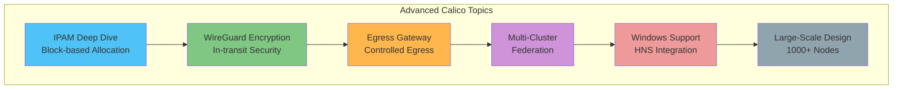
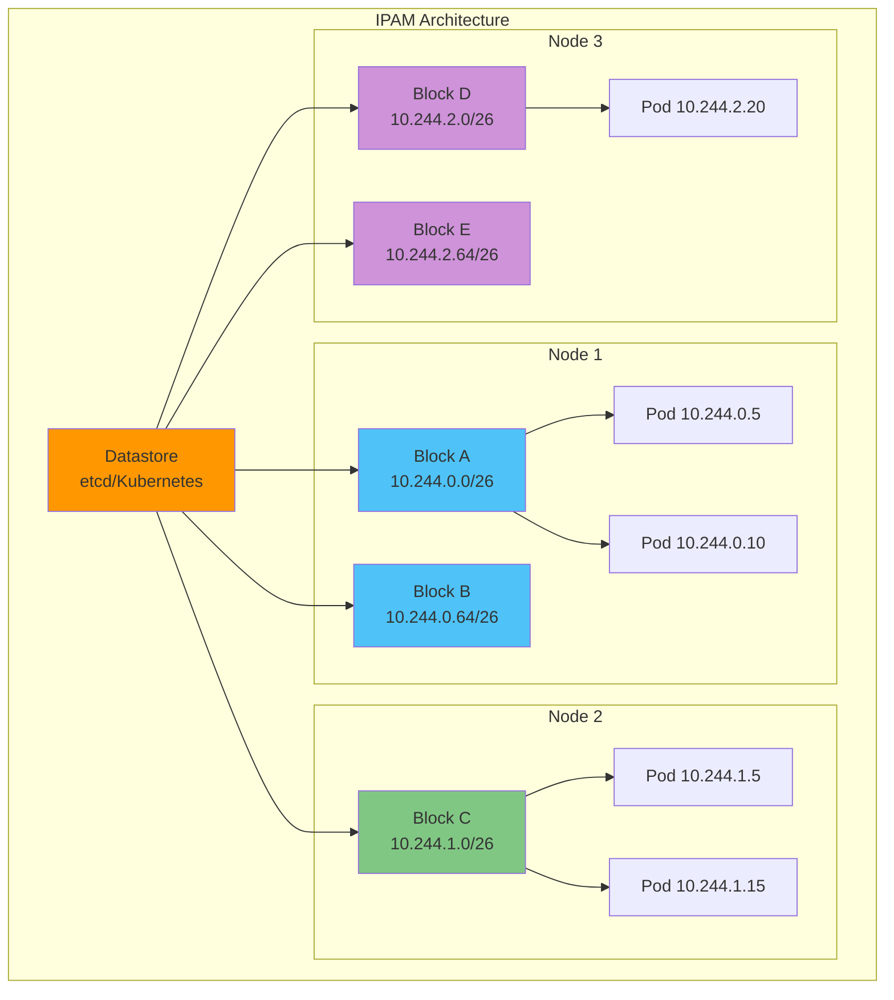
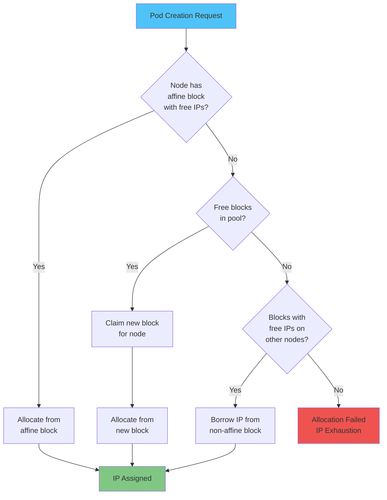
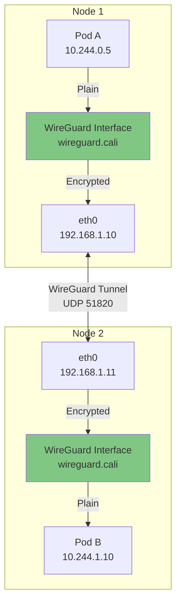
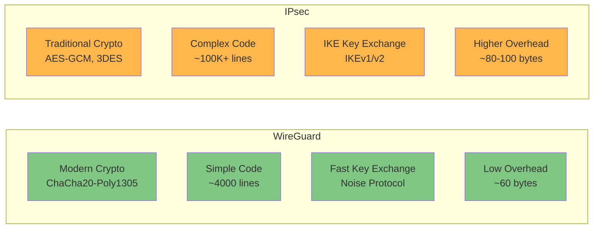
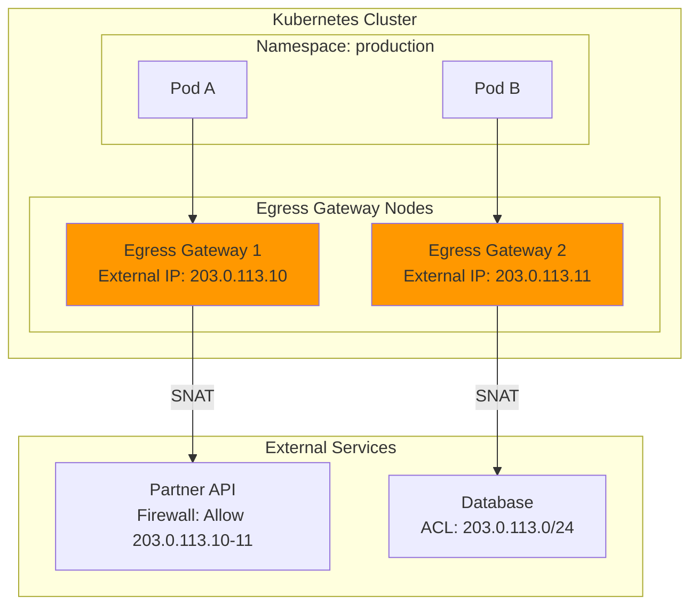
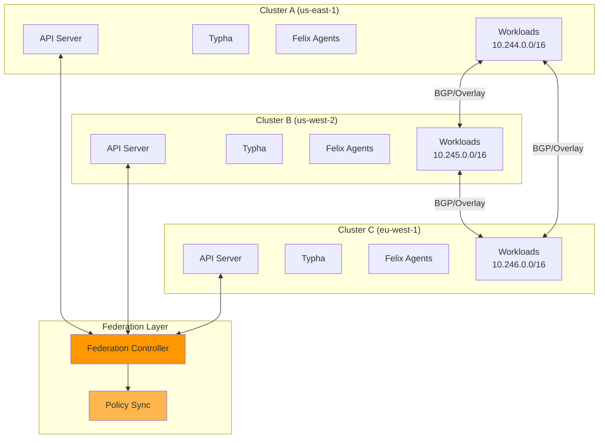
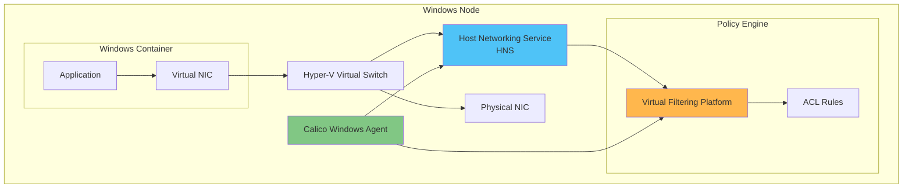
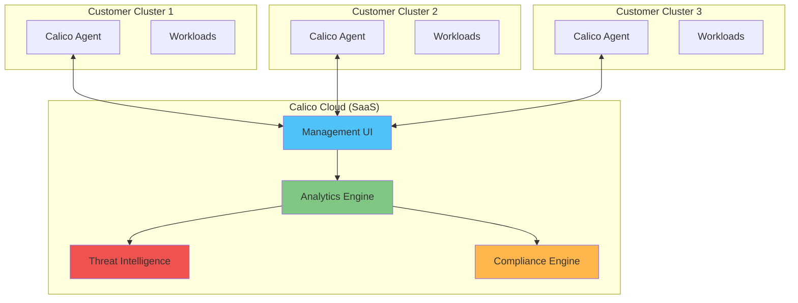
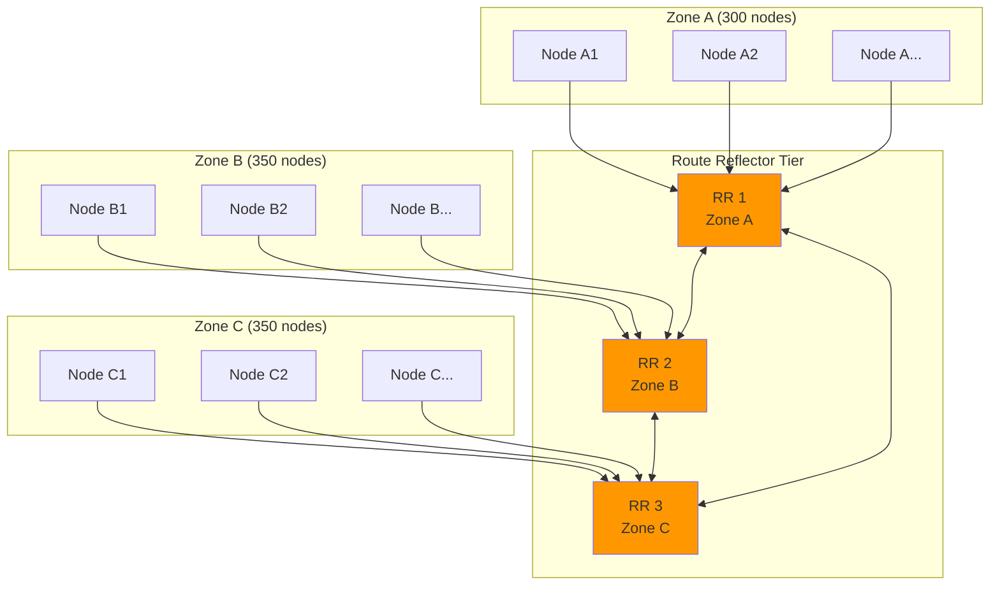

# 第 7 部分：Calico 高级主题

> **支持的版本**：Calico v3.29+ / Kubernetes 1.28+
> **最后更新**：February 23, 2026

## 概述

本章介绍适用于生产环境的 Calico 高级主题，包括 IPAM 深入解析、WireGuard 加密、Egress Gateway、多集群联邦、Windows 容器支持以及大规模集群设计模式。



## IPAM 深入解析

Calico 的 IP 地址管理（IPAM）系统专为高性能和可扩展性而设计。了解其架构对于优化大型部署至关重要。

### 基于块的 IPAM 架构

Calico 使用基于块的 IPAM 系统，将 IP 地址以块（默认 /26 = 64 个 IP）的形式分配给节点。这种方法可最大限度减少数据存储交互，并提高分配速度。



### IP 块亲和性

块亲和性确保 IP 块优先分配给特定节点，从而提高路由效率并减小路由表大小。

```yaml
# View block affinities
# calicoctl get blockaffinity -o yaml

apiVersion: projectcalico.org/v3
kind: BlockAffinity
metadata:
  name: node1-10-244-0-0-26
spec:
  cidr: 10.244.0.0/26
  node: node1
  state: confirmed
  # States: pending, confirmed, pendingDeletion
---
apiVersion: projectcalico.org/v3
kind: BlockAffinity
metadata:
  name: node1-10-244-0-64-26
spec:
  cidr: 10.244.0.64/26
  node: node1
  state: confirmed
```

### 分配算法

IPAM 分配遵循以下流程：



### 块大小配置

默认块大小为 /26（64 个 IP）。请根据集群特征进行调整：

```yaml
# IPPool with custom block size
apiVersion: projectcalico.org/v3
kind: IPPool
metadata:
  name: default-ipv4-ippool
spec:
  cidr: 10.244.0.0/16
  blockSize: 26  # Default: /26 (64 IPs per block)
  # Options:
  # /24 = 256 IPs (large pods per node)
  # /26 = 64 IPs (default, balanced)
  # /28 = 16 IPs (many nodes, few pods each)
  # /29 = 8 IPs (minimum recommended)
  # /30 = 4 IPs (not recommended)
  ipipMode: CrossSubnet
  vxlanMode: Never
  natOutgoing: true
  nodeSelector: all()
```

**块大小选择指南：**

| 块大小 | 每块 IP 数 | 建议场景 |
|------------|---------------|---------------------|
| /24 | 256 | 高 Pod 密度（50+ Pods/节点） |
| /25 | 128 | 中高密度 |
| /26 | 64 | 默认，均衡 |
| /27 | 32 | 节点较多，适度数量的 Pods |
| /28 | 16 | 大型集群，低密度 |
| /29 | 8 | 超大型集群，极少量 Pods |

### Host-Local IPAM

对于较简单的部署或特定使用场景，Calico 支持 host-local IPAM 模式：

```yaml
# Installation with host-local IPAM
apiVersion: operator.tigera.io/v1
kind: Installation
metadata:
  name: default
spec:
  calicoNetwork:
    ipPools:
      - cidr: 10.244.0.0/16
        encapsulation: VXLANCrossSubnet
        natOutgoing: Enabled
    # Use host-local IPAM instead of Calico IPAM
    hostLocalIPAMEnabled: true
```

**Calico IPAM 与 Host-Local IPAM：**

| 功能 | Calico IPAM | Host-Local IPAM |
|---------|-------------|-----------------|
| IP 重用 | 集群范围 | 节点本地 |
| 块管理 | 动态 | 静态 |
| 路由聚合 | 是 | 有限 |
| IP 释放 | 立即 | 延迟 |
| 复杂性 | 较高 | 较低 |
| 可扩展性 | 更好 | 有限 |

### 多池策略

为不同的工作负载类型配置多个 IP 池：

```yaml
# Production workloads pool
apiVersion: projectcalico.org/v3
kind: IPPool
metadata:
  name: production-pool
spec:
  cidr: 10.244.0.0/18
  blockSize: 26
  ipipMode: CrossSubnet
  natOutgoing: true
  nodeSelector: "node-type == 'production'"
---
# Development workloads pool
apiVersion: projectcalico.org/v3
kind: IPPool
metadata:
  name: development-pool
spec:
  cidr: 10.244.64.0/18
  blockSize: 28  # Smaller blocks for dev
  ipipMode: CrossSubnet
  natOutgoing: true
  nodeSelector: "node-type == 'development'"
---
# High-performance pool (no encapsulation)
apiVersion: projectcalico.org/v3
kind: IPPool
metadata:
  name: highperf-pool
spec:
  cidr: 10.244.128.0/18
  blockSize: 26
  ipipMode: Never
  vxlanMode: Never
  natOutgoing: false
  nodeSelector: "network == 'direct'"
```

**将 Pods 分配到特定池：**

```yaml
# Pod annotation to select IP pool
apiVersion: v1
kind: Pod
metadata:
  name: production-app
  annotations:
    cni.projectcalico.org/ipv4pools: '["production-pool"]'
spec:
  containers:
    - name: app
      image: nginx
---
# Namespace-level pool assignment
apiVersion: v1
kind: Namespace
metadata:
  name: production
  annotations:
    cni.projectcalico.org/ipv4pools: '["production-pool"]'
```

### IPv6 和双栈配置

Calico 支持仅 IPv6 和双栈部署：

```yaml
# Dual-stack IPPool configuration
apiVersion: projectcalico.org/v3
kind: IPPool
metadata:
  name: default-ipv4-pool
spec:
  cidr: 10.244.0.0/16
  blockSize: 26
  ipipMode: CrossSubnet
  natOutgoing: true
  nodeSelector: all()
---
apiVersion: projectcalico.org/v3
kind: IPPool
metadata:
  name: default-ipv6-pool
spec:
  cidr: fd00:10:244::/48
  blockSize: 122  # /122 = 64 IPv6 addresses
  ipipMode: Never  # IPIP not supported for IPv6
  vxlanMode: CrossSubnet
  natOutgoing: true
  nodeSelector: all()
```

```yaml
# FelixConfiguration for dual-stack
apiVersion: projectcalico.org/v3
kind: FelixConfiguration
metadata:
  name: default
spec:
  ipv6Support: true
  # IPv6 auto-detection
  ipAutoDetectionMethod: "kubernetes-internal-ip"
  ip6AutoDetectionMethod: "kubernetes-internal-ip"
```

### IP 耗尽策略

当 IP 地址变得紧缺时，请实施以下策略：

```yaml
# 1. Enable strict block affinity release
apiVersion: projectcalico.org/v3
kind: FelixConfiguration
metadata:
  name: default
spec:
  # Release unused blocks faster
  ipamAutoGC: true
  # Garbage collection interval
  # ipamAutoGCInterval: "5m"
---
# 2. Configure node-specific IP limits
apiVersion: projectcalico.org/v3
kind: IPPool
metadata:
  name: limited-pool
spec:
  cidr: 10.244.0.0/16
  blockSize: 26
  # Limit blocks per node
  allowedUses:
    - Workload
  # Disable tunnel addresses from this pool
  disableBGPExport: false
```

```bash
# Monitor IP usage
calicoctl ipam show

# Show detailed block allocation
calicoctl ipam show --show-blocks

# Check for leaked IPs
calicoctl ipam check

# Release orphaned IPs
calicoctl ipam release --ip=10.244.1.5

# Show IP usage per node
calicoctl ipam show --show-blocks | grep -E "Node|Block"
```

## 通过 BlockAffinity 查询每个节点的 PodCIDR

在 Calico 基于块的 IPAM 中，分配给每个节点的 CIDR 块通过 **BlockAffinity CR** 跟踪。这些 CR 用于识别每节点 Pod CIDR，以便进行静态路由配置或 IPAM 调试。

> **⚠ EKS Hybrid Nodes 注意事项**：Calico **不再获得官方支持** 用于 EKS Hybrid Nodes。对于新的部署，请使用 [Cilium](../cilium/04-ipam-policy.md)。以下信息仅供现有 Calico 环境参考。

### 查询 BlockAffinity CR

```bash
# Query IPAM blocks using calicoctl
calicoctl ipam show --show-blocks

# Check per-node CIDRs via BlockAffinity CRs
kubectl get blockaffinities

# Table format query
kubectl get blockaffinities -o custom-columns='\
NAME:.metadata.name,\
CIDR:.spec.cidr,\
NODE:.spec.node'
```

输出示例：

```
NAME                                    CIDR               NODE
hybrid-node-001-10-85-0-0-25            10.85.0.0/25       hybrid-node-001
hybrid-node-002-10-85-0-128-25          10.85.0.128/25     hybrid-node-002
hybrid-node-003-10-85-1-0-25            10.85.1.0/25       hybrid-node-003
```

### 检查整体 IPPool

```bash
kubectl get ippools -o custom-columns='\
NAME:.metadata.name,\
CIDR:.spec.cidr,\
BLOCK_SIZE:.spec.blockSize'
```

### 自动生成静态路由

以下示例展示如何从 BlockAffinity 生成静态路由命令：

```bash
# Generate ip route commands from BlockAffinity
kubectl get blockaffinities -o json | jq -r \
  '.items[] | "ip route add \(.spec.cidr) via <NODE_IP_FOR_\(.spec.node)>"'
```

> **使用场景**：此信息用于在 EKS Hybrid Nodes 环境中配置无需 BGP 的静态路由。详情请参阅 [EKS Hybrid Nodes - 网络配置](../../eks-hybrid-nodes/02-network-configuration.md)。

## WireGuard 加密

WireGuard 为跨节点的 Pod 间流量提供高效加密。

### WireGuard 架构



### 配置

```yaml
# Enable WireGuard encryption
apiVersion: projectcalico.org/v3
kind: FelixConfiguration
metadata:
  name: default
spec:
  # Enable WireGuard for IPv4
  wireguardEnabled: true

  # Enable WireGuard for IPv6 (if using dual-stack)
  wireguardEnabledV6: true

  # WireGuard interface MTU (default: auto)
  wireguardMTU: 1440

  # WireGuard listen port
  wireguardListeningPort: 51820

  # Keep-alive interval for NAT traversal
  wireguardPersistentKeepAlive: "25s"

  # Host encryption (encrypt host-networked pod traffic)
  wireguardHostEncryptionEnabled: true
```

```yaml
# Operator-based installation with WireGuard
apiVersion: operator.tigera.io/v1
kind: Installation
metadata:
  name: default
spec:
  calicoNetwork:
    ipPools:
      - cidr: 10.244.0.0/16
        encapsulation: WireguardCrossSubnet
        natOutgoing: Enabled
```

### 验证 WireGuard 状态

```bash
# Check WireGuard status on nodes
kubectl exec -n calico-system -it $(kubectl get pods -n calico-system -l k8s-app=calico-node -o name | head -1) -- wg show

# Sample output:
# interface: wireguard.cali
#   public key: ABC123...
#   private key: (hidden)
#   listening port: 51820
#
# peer: DEF456...
#   endpoint: 192.168.1.11:51820
#   allowed ips: 10.244.1.0/26
#   latest handshake: 5 seconds ago
#   transfer: 1.5 MiB received, 2.3 MiB sent

# Check Felix WireGuard statistics
calicoctl node status

# View WireGuard public keys
kubectl get nodes -o jsonpath='{range .items[*]}{.metadata.name}: {.metadata.annotations.projectcalico\.org/WireguardPublicKey}{"\n"}{end}'
```

### 性能影响

| 指标 | 无加密 | WireGuard | IPsec (AES-GCM) |
|--------|-------------------|-----------|-----------------|
| 吞吐量 | 基准 | -5 至 -10% | -15 至 -25% |
| 延迟 | 基准 | +0.1-0.3ms | +0.5-1.0ms |
| CPU 使用率 | 基准 | +10-15% | +30-50% |
| 设置复杂性 | 不适用 | 低 | 中等 |
| 密钥管理 | 不适用 | 自动 | 手动/IKE |

### WireGuard 与 IPsec 对比



| 功能 | WireGuard | IPsec |
|---------|-----------|-------|
| 密码学 | ChaCha20-Poly1305, Curve25519 | AES-GCM, SHA-256, DH |
| 代码复杂性 | ~4,000 行 | 100,000+ 行 |
| 攻击面 | 极小 | 大 |
| 密钥轮换 | 自动 | 手动或 IKE |
| NAT 穿越 | 内置 | 需要 NAT-T |
| 漫游 | 无缝 | 会话重新建立 |
| 内核支持 | 5.6+（主线） | 所有版本 |
| 硬件卸载 | 有限 | 广泛支持 |

## Egress Gateway

Egress Gateway 为需要特定源 IP 的 Pods 提供受控且可预测的出站流量。

### 架构



### 配置

```yaml
# 1. Label egress gateway nodes
# kubectl label node egress-node-1 egress-gateway=true
# kubectl label node egress-node-2 egress-gateway=true

# 2. Create Egress Gateway IP Pool
apiVersion: projectcalico.org/v3
kind: IPPool
metadata:
  name: egress-gateway-pool
spec:
  cidr: 203.0.113.0/28
  blockSize: 32
  nodeSelector: "!all()"  # Don't auto-assign
  allowedUses:
    - Workload
  natOutgoing: false
---
# 3. Create Egress Gateway deployment
apiVersion: apps/v1
kind: Deployment
metadata:
  name: egress-gateway
  namespace: calico-system
spec:
  replicas: 2
  selector:
    matchLabels:
      app: egress-gateway
  template:
    metadata:
      labels:
        app: egress-gateway
      annotations:
        cni.projectcalico.org/ipv4pools: '["egress-gateway-pool"]'
    spec:
      nodeSelector:
        egress-gateway: "true"
      tolerations:
        - key: "egress-gateway"
          operator: "Equal"
          value: "true"
          effect: "NoSchedule"
      containers:
        - name: egress-gateway
          image: calico/egress-gateway:v3.29.0
          env:
            - name: EGRESS_POD_IP
              valueFrom:
                fieldRef:
                  fieldPath: status.podIP
          securityContext:
            privileged: true
          resources:
            requests:
              cpu: 100m
              memory: 128Mi
            limits:
              cpu: 500m
              memory: 256Mi
---
# 4. Configure egress gateway selector
apiVersion: projectcalico.org/v3
kind: EgressGateway
metadata:
  name: production-egress
  namespace: production
spec:
  # Select egress gateway pods
  selector: app == 'egress-gateway'
  # Maximum gateways per client (for HA)
  maxGatewaysPerClient: 2
```

### SNAT 策略配置

```yaml
# Egress IP policy for specific namespaces
apiVersion: projectcalico.org/v3
kind: BGPConfiguration
metadata:
  name: default
spec:
  serviceExternalIPs:
    - cidr: 203.0.113.0/28
---
# Network policy to route through egress gateway
apiVersion: projectcalico.org/v3
kind: NetworkPolicy
metadata:
  name: use-egress-gateway
  namespace: production
spec:
  selector: requires-egress == 'true'
  egress:
    - action: Allow
      destination:
        notNets:
          - 10.0.0.0/8
          - 172.16.0.0/12
          - 192.168.0.0/16
      # Route through egress gateway
```

### 合规性使用场景

具有合规性要求（PCI-DSS、HIPAA）的组织通常需要可预测的出站 IP：

```yaml
# Compliance-focused egress configuration
apiVersion: projectcalico.org/v3
kind: GlobalNetworkPolicy
metadata:
  name: compliance-egress
spec:
  selector: "compliance-level in {'pci', 'hipaa'}"
  order: 100
  egress:
    # Allow only through egress gateway
    - action: Allow
      destination:
        selector: app == 'egress-gateway'
    # Block direct external access
    - action: Deny
      destination:
        notNets:
          - 10.0.0.0/8
```

## 多集群联邦

Calico 支持多集群部署，以实现跨集群通信和策略。

### 联邦架构



### 跨集群连接设置

```yaml
# Cluster A configuration
apiVersion: projectcalico.org/v3
kind: IPPool
metadata:
  name: cluster-a-pool
spec:
  cidr: 10.244.0.0/16
  ipipMode: CrossSubnet
  natOutgoing: true
---
apiVersion: projectcalico.org/v3
kind: BGPConfiguration
metadata:
  name: default
spec:
  asNumber: 64512
  nodeToNodeMeshEnabled: false
---
# BGP peer to Cluster B
apiVersion: projectcalico.org/v3
kind: BGPPeer
metadata:
  name: cluster-b-peer
spec:
  peerIP: 192.168.2.1  # Cluster B border router
  asNumber: 64513
  password:
    secretKeyRef:
      name: bgp-secrets
      key: cluster-b-password
```

```yaml
# Cluster B configuration
apiVersion: projectcalico.org/v3
kind: IPPool
metadata:
  name: cluster-b-pool
spec:
  cidr: 10.245.0.0/16
  ipipMode: CrossSubnet
  natOutgoing: true
---
apiVersion: projectcalico.org/v3
kind: BGPConfiguration
metadata:
  name: default
spec:
  asNumber: 64513
  nodeToNodeMeshEnabled: false
---
# BGP peer to Cluster A
apiVersion: projectcalico.org/v3
kind: BGPPeer
metadata:
  name: cluster-a-peer
spec:
  peerIP: 192.168.1.1  # Cluster A border router
  asNumber: 64512
  password:
    secretKeyRef:
      name: bgp-secrets
      key: cluster-a-password
```

### 跨集群网络策略

```yaml
# Global policy that applies across clusters
apiVersion: projectcalico.org/v3
kind: GlobalNetworkPolicy
metadata:
  name: cross-cluster-allow
spec:
  selector: all()
  order: 500
  ingress:
    # Allow from other clusters' pod CIDRs
    - action: Allow
      source:
        nets:
          - 10.244.0.0/16  # Cluster A
          - 10.245.0.0/16  # Cluster B
          - 10.246.0.0/16  # Cluster C
      protocol: TCP
      destination:
        ports:
          - 80
          - 443
          - 8080
  egress:
    - action: Allow
      destination:
        nets:
          - 10.244.0.0/16
          - 10.245.0.0/16
          - 10.246.0.0/16
```

## Windows 容器支持

Calico 为 Kubernetes 中的 Windows 容器提供网络和策略。

### 功能和限制

| 功能 | Linux | Windows |
|---------|-------|---------|
| Overlay (VXLAN) | 是 | 是 |
| 直接路由 | 是 | 有限 |
| BGP | 是 | 是 |
| Network Policy L3-L4 | 是 | 是 |
| Network Policy L7 | 是 | 否 |
| eBPF Dataplane | 是 | 否 |
| WireGuard | 是 | 否 |
| IPsec | 是 | 是 |
| Host Endpoint Policy | 是 | 有限 |
| IPAM | 完整 | 完整 |

### Windows 安装

```yaml
# Installation resource for Windows support
apiVersion: operator.tigera.io/v1
kind: Installation
metadata:
  name: default
spec:
  # Kubernetes provider
  kubernetesProvider: AKS  # or EKS, GKE, etc.

  # Windows dataplane
  windowsDataplane: HNS

  calicoNetwork:
    bgp: Enabled
    ipPools:
      - cidr: 10.244.0.0/16
        encapsulation: VXLAN
        natOutgoing: Enabled

    # Windows-specific settings
    windowsIPAM: Calico
```

### HNS（Host Networking Service）集成



### Windows 网络策略

```yaml
# Network policy for Windows workloads
apiVersion: projectcalico.org/v3
kind: NetworkPolicy
metadata:
  name: windows-web-policy
  namespace: windows-apps
spec:
  selector: app == 'iis-web'
  ingress:
    - action: Allow
      protocol: TCP
      source:
        selector: app == 'load-balancer'
      destination:
        ports:
          - 80
          - 443
  egress:
    - action: Allow
      protocol: TCP
      destination:
        selector: app == 'sql-server'
        ports:
          - 1433
```

### 混合 Linux/Windows 集群

```yaml
# Separate IP pools for Linux and Windows
apiVersion: projectcalico.org/v3
kind: IPPool
metadata:
  name: linux-pool
spec:
  cidr: 10.244.0.0/17
  ipipMode: CrossSubnet
  natOutgoing: true
  nodeSelector: "kubernetes.io/os == 'linux'"
---
apiVersion: projectcalico.org/v3
kind: IPPool
metadata:
  name: windows-pool
spec:
  cidr: 10.244.128.0/17
  vxlanMode: Always  # Windows requires VXLAN
  natOutgoing: true
  nodeSelector: "kubernetes.io/os == 'windows'"
```

## Calico Enterprise / Tigera

Tigera 提供 Calico Enterprise，其中包含面向企业部署的附加功能。

### OSS 与 Enterprise 对比

| 功能 | Calico OSS | Calico Enterprise |
|---------|-----------|-------------------|
| **网络** | | |
| CNI Plugin | 是 | 是 |
| BGP 路由 | 是 | 是 |
| VXLAN/IPIP Overlay | 是 | 是 |
| eBPF Dataplane | 是 | 是 |
| WireGuard 加密 | 是 | 是 |
| Egress Gateway | 基础 | 高级 |
| **网络策略** | | |
| Kubernetes NetworkPolicy | 是 | 是 |
| Calico NetworkPolicy | 是 | 是 |
| GlobalNetworkPolicy | 是 | 是 |
| 策略层级 | 是 | 是 |
| DNS 策略 | 是 | 是 |
| L7 策略 (HTTP) | 基础 | 完整 |
| 策略预览 | 否 | 是 |
| 策略建议 | 否 | 是 |
| **安全** | | |
| 威胁检测 | 否 | 是 |
| 异常检测 | 否 | 是 |
| 合规报告 | 否 | 是 |
| 安全告警 | 否 | 是 |
| Workload Identity | 基础 | SPIFFE/SPIRE |
| **可观测性** | | |
| Flow Logs | 基础 | 完整 |
| Service Graph | 否 | 是 |
| Kibana Dashboards | 否 | 是 |
| DNS Logs | 基础 | 完整 |
| L7 Logs | 否 | 是 |
| **运维** | | |
| Web UI | 否 | 是 |
| 多集群管理 | 手动 | 统一 |
| RBAC | Kubernetes | 扩展 |
| Audit Logs | 基础 | 完整 |
| **支持** | | |
| 社区支持 | 是 | 是 |
| 企业支持 | 否 | 24/7 SLA |
| 专业服务 | 否 | 是 |

### Calico Cloud

Calico Cloud 是一种 SaaS 产品，提供：



## 大规模集群设计（1000+ 节点）

为大型集群设计 Calico 需要仔细规划组件和资源。

### Typha 容量计算公式

Typha 通过聚合数据存储连接来降低 API server 负载：

```
Typha Replicas = max(3, ceil(Node Count / 200))

Examples:
- 100 nodes: 3 Typha replicas (minimum)
- 500 nodes: 3 Typha replicas
- 1000 nodes: 5 Typha replicas
- 2000 nodes: 10 Typha replicas
- 5000 nodes: 25 Typha replicas
```

```yaml
# Large cluster Typha configuration
apiVersion: operator.tigera.io/v1
kind: Installation
metadata:
  name: default
spec:
  typhaDeployment:
    spec:
      replicas: 10  # For ~2000 nodes
      template:
        spec:
          containers:
            - name: calico-typha
              resources:
                requests:
                  cpu: 500m
                  memory: 512Mi
                limits:
                  cpu: 2000m
                  memory: 1Gi
          affinity:
            podAntiAffinity:
              requiredDuringSchedulingIgnoredDuringExecution:
                - labelSelector:
                    matchLabels:
                      k8s-app: calico-typha
                  topologyKey: kubernetes.io/hostname
          topologySpreadConstraints:
            - maxSkew: 1
              topologyKey: topology.kubernetes.io/zone
              whenUnsatisfiable: DoNotSchedule
              labelSelector:
                matchLabels:
                  k8s-app: calico-typha
```

### 路由反射器拓扑

对于大型 BGP 部署，请使用路由反射器而非全网格：



```yaml
# Route Reflector node configuration
apiVersion: projectcalico.org/v3
kind: Node
metadata:
  name: rr-node-1
  labels:
    route-reflector: "true"
    topology.kubernetes.io/zone: "zone-a"
spec:
  bgp:
    routeReflectorClusterID: 244.0.0.1
    ipv4Address: 192.168.1.10/24
---
# Regular nodes peer with zone-local RR
apiVersion: projectcalico.org/v3
kind: BGPPeer
metadata:
  name: node-to-rr-zone-a
spec:
  nodeSelector: "topology.kubernetes.io/zone == 'zone-a' && !has(route-reflector)"
  peerSelector: "route-reflector == 'true' && topology.kubernetes.io/zone == 'zone-a'"
---
# RR mesh between zones
apiVersion: projectcalico.org/v3
kind: BGPPeer
metadata:
  name: rr-full-mesh
spec:
  nodeSelector: "has(route-reflector)"
  peerSelector: "has(route-reflector)"
```

### 面向大型集群的 Felix 调优

```yaml
# Optimized Felix configuration for large clusters
apiVersion: projectcalico.org/v3
kind: FelixConfiguration
metadata:
  name: default
spec:
  # Reduce datastore polling
  datastoreType: kubernetes

  # Increase refresh intervals (reduce API load)
  routeRefreshInterval: "90s"
  iptablesRefreshInterval: "180s"
  ipSetsRefreshInterval: "90s"

  # Optimize iptables
  iptablesBackend: NFT  # Use nftables if available
  iptablesMarkMask: 0xffff0000

  # Reduce logging overhead
  logSeverityScreen: Warning
  logSeverityFile: Warning

  # Flow logs (if enabled, optimize)
  flowLogsFlushInterval: "60s"
  flowLogsFileAggregationKindForAllowed: 2
  flowLogsFileAggregationKindForDenied: 1

  # Health check optimization
  healthEnabled: true
  healthPort: 9099
  healthTimeoutOverrides:
    - name: "InternalDataplaneMainLoop"
      timeout: "120s"

  # BPF mode optimization (if using eBPF)
  bpfEnabled: true
  bpfConnectTimeLoadBalancingEnabled: true
  bpfExternalServiceMode: "DSR"
  bpfMapSizeConntrack: 512000
  bpfMapSizeNATFrontend: 65536
  bpfMapSizeNATBackend: 262144
  bpfMapSizeNATAffinity: 65536
```

### 大规模数据存储

```yaml
# etcd optimization for large Calico deployments
# (if using etcd datastore instead of Kubernetes)
apiVersion: v1
kind: ConfigMap
metadata:
  name: etcd-config
  namespace: kube-system
data:
  etcd.conf.yaml: |
    name: etcd-0
    data-dir: /var/lib/etcd

    # Increase quota for large deployments
    quota-backend-bytes: 8589934592  # 8GB

    # Snapshot tuning
    snapshot-count: 50000
    auto-compaction-mode: periodic
    auto-compaction-retention: "1h"

    # Performance tuning
    heartbeat-interval: 250
    election-timeout: 2500

    # Enable gRPC gateway
    enable-grpc-gateway: true
```

## 性能调优

### Felix 参数

```yaml
# Comprehensive Felix performance tuning
apiVersion: projectcalico.org/v3
kind: FelixConfiguration
metadata:
  name: default
spec:
  # === CPU Optimization ===
  # Use eBPF for better CPU efficiency
  bpfEnabled: true
  bpfDisableUnprivileged: true

  # Batch iptables updates
  iptablesPostWriteCheckIntervalSecs: 5
  iptablesLockFilePath: "/run/xtables.lock"
  iptablesLockTimeoutSecs: 30
  iptablesLockProbeIntervalMillis: 50

  # === Memory Optimization ===
  # Limit in-memory caches
  routeTableRanges:
    - min: 1
      max: 250

  # === Network Optimization ===
  # MTU configuration
  mtuIfacePattern: "^(en.*|eth.*|bond.*)"

  # Failsafe inbound/outbound ports
  failsafeInboundHostPorts:
    - protocol: tcp
      port: 22
    - protocol: udp
      port: 68
  failsafeOutboundHostPorts:
    - protocol: tcp
      port: 443
    - protocol: udp
      port: 53

  # === Logging Optimization ===
  logFilePath: "/var/log/calico/felix.log"
  logSeverityFile: Warning
  logSeverityScreen: Warning
  logSeveritySys: Warning

  # === Health Check Optimization ===
  healthEnabled: true
  healthPort: 9099
  healthHost: "0.0.0.0"
```

### Typha 比率和配置

```yaml
# Typha deployment for optimal performance
apiVersion: apps/v1
kind: Deployment
metadata:
  name: calico-typha
  namespace: calico-system
spec:
  replicas: 5  # Adjust based on cluster size
  selector:
    matchLabels:
      k8s-app: calico-typha
  template:
    metadata:
      labels:
        k8s-app: calico-typha
    spec:
      priorityClassName: system-cluster-critical
      tolerations:
        - key: CriticalAddonsOnly
          operator: Exists
      affinity:
        podAntiAffinity:
          requiredDuringSchedulingIgnoredDuringExecution:
            - labelSelector:
                matchLabels:
                  k8s-app: calico-typha
              topologyKey: kubernetes.io/hostname
      containers:
        - name: calico-typha
          image: calico/typha:v3.29.0
          ports:
            - containerPort: 5473
              name: calico-typha
            - containerPort: 9093
              name: metrics
          env:
            - name: TYPHA_LOGSEVERITYSCREEN
              value: "warning"
            - name: TYPHA_DATASTORETYPE
              value: "kubernetes"
            # Max connections per Typha
            - name: TYPHA_MAXCONNECTIONSLOWERLIMIT
              value: "200"
            - name: TYPHA_MAXCONNECTIONSUPPERLIMIT
              value: "400"
            # Connection rebalancing
            - name: TYPHA_CONNECTIONREBALANCINGMODE
              value: "kubernetes"
            # Reduce sync interval
            - name: TYPHA_SNAPSHOTSYNCSINTERVAL
              value: "300s"
          resources:
            requests:
              cpu: 250m
              memory: 256Mi
            limits:
              cpu: 1000m
              memory: 512Mi
          livenessProbe:
            httpGet:
              path: /liveness
              port: 9098
            periodSeconds: 30
            initialDelaySeconds: 30
            failureThreshold: 5
          readinessProbe:
            httpGet:
              path: /readiness
              port: 9098
            periodSeconds: 10
            failureThreshold: 3
```

### 资源分配指南

| 集群规模 | Felix CPU | Felix 内存 | Typha CPU | Typha 内存 | Typha 副本数 |
|--------------|-----------|--------------|-----------|--------------|----------------|
| < 50 个节点 | 100m-250m | 128Mi-256Mi | 不适用 | 不适用 | 0 |
| 50-200 | 250m-500m | 256Mi-512Mi | 100m-250m | 128Mi-256Mi | 3 |
| 200-500 | 500m-1000m | 512Mi-1Gi | 250m-500m | 256Mi-512Mi | 3 |
| 500-1000 | 500m-1000m | 512Mi-1Gi | 500m-1000m | 512Mi-1Gi | 5 |
| 1000-2000 | 1000m-2000m | 1Gi-2Gi | 500m-1000m | 512Mi-1Gi | 10 |
| 2000+ | 1000m-2000m | 1Gi-2Gi | 1000m-2000m | 1Gi-2Gi | 节点数/200 |

---

## 参考资料

- [Calico IPAM 文档](https://docs.tigera.io/calico/latest/networking/ipam/)
- [WireGuard 加密](https://docs.tigera.io/calico/latest/network-policy/encrypt-cluster-pod-traffic)
- [Egress Gateway](https://docs.tigera.io/calico/latest/networking/egress/egress-gateway/)
- [Windows 容器](https://docs.tigera.io/calico/latest/getting-started/kubernetes/windows-calico/)
- [Calico Enterprise](https://docs.tigera.io/calico-enterprise/)
- [性能调优](https://docs.tigera.io/calico/latest/operations/monitor/component-performance)

## 测验

要测试本章所学内容，请尝试 [高级主题测验](../../quizzes/networking/calico/07-advanced-topics-quiz.md)。
