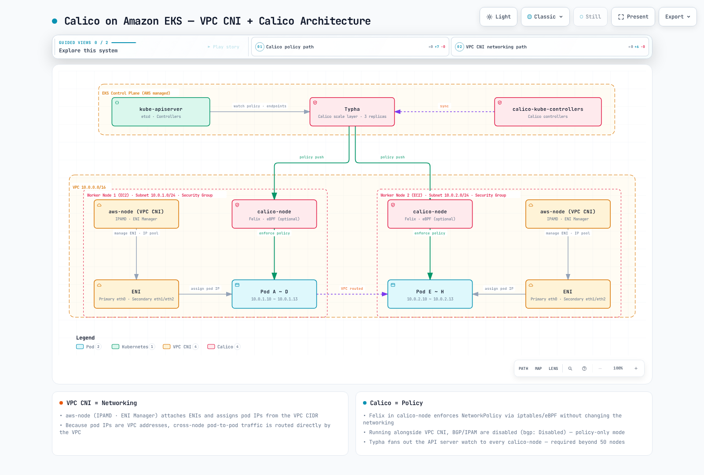

# 第 8 部分：EKS 集成

> **支持的版本**：Calico v3.29+ / Kubernetes 1.28+ / EKS 1.28+ **最后更新**：February 23, 2026

## 概述

本章介绍 Calico 与 Amazon EKS 的集成，包括架构模式、安装方法和 EKS 专属优化。了解如何结合 AWS VPC CNI 使用 Calico 的网络策略功能，以实现最佳 EKS 网络。


## VPC CNI + Calico 架构



[🔍 查看交互式图表](https://www.atomai.click/kubernetes-docs/archmaps/en-networking-calico-08-eks-integration-4.html)

Amazon EKS 默认使用 AWS VPC CNI 提供 Pod 网络。VPC CNI 负责 IP 地址管理时，可以添加 Calico 以获得高级网络策略功能。

### 架构深入解析


### 使用 VPC CNI + Calico 的流量流向


## 安装方法比较

### 方法概览

| 方法          | 复杂度 | 灵活性 | 升级路径 | EKS 集成 |
| --------------- | ---------- | ----------- | ------------ | --------------- |
| EKS Add-on      | 低        | 有限     | 自动     | 原生          |
| Tigera Operator | 中        | 高        | 半自动    | 良好            |
| Helm            | 中        | 最高     | 手动       | 良好            |
| Manifest        | 高       | 中        | 手动       | 基础           |

### 方法 1：EKS Add-on（最简单）

EKS Add-on 提供与 EKS 生命周期管理的原生集成。

```bash
# Enable via AWS CLI
aws eks create-addon \
  --cluster-name my-cluster \
  --addon-name vpc-cni \
  --addon-version v1.18.0-eksbuild.1 \
  --configuration-values '{"enableNetworkPolicy": "true"}'

# Or enable Calico as separate add-on (if available)
aws eks create-addon \
  --cluster-name my-cluster \
  --addon-name calico \
  --service-account-role-arn arn:aws:iam::ACCOUNT:role/CalicoRole
```

```yaml
# eksctl configuration
apiVersion: eksctl.io/v1alpha5
kind: ClusterConfig
metadata:
  name: my-cluster
  region: us-east-1
  version: "1.30"

addons:
  - name: vpc-cni
    version: latest
    configurationValues: |
      enableNetworkPolicy: "true"
      nodeAgent:
        enablePolicyEventLogs: "true"
```

**优点：**

* 随 EKS 自动更新
* 包含 AWS 支持
* 配置简单
* 原生 CloudWatch 集成

**缺点：**

* 仅限于 Kubernetes NetworkPolicy
* 没有 Calico 专属功能
* 配置灵活性较低

### 方法 2：Tigera Operator（推荐）

```bash
# Install Tigera Operator
kubectl create -f https://raw.githubusercontent.com/projectcalico/calico/v3.29.0/manifests/tigera-operator.yaml
```

```yaml
# Installation resource for EKS
apiVersion: operator.tigera.io/v1
kind: Installation
metadata:
  name: default
spec:
  # Specify EKS as the Kubernetes provider
  kubernetesProvider: EKS

  # Use VPC CNI for networking
  cni:
    type: AmazonVPC

  calicoNetwork:
    # Disable Calico networking (using VPC CNI)
    bgp: Disabled

    # No IP pools needed (VPC CNI handles IPAM)
    ipPools: []

    # Linux dataplane
    linuxDataplane: Iptables  # or BPF for eBPF mode

  # Component resources
  componentResources:
    - componentName: Node
      resourceRequirements:
        requests:
          cpu: 100m
          memory: 128Mi
        limits:
          cpu: 500m
          memory: 256Mi

  # Enable Typha for clusters > 50 nodes
  typhaDeployment:
    spec:
      replicas: 3
```

```bash
# Apply installation
kubectl apply -f installation.yaml

# Verify installation
kubectl get tigerastatus
kubectl get pods -n calico-system
```

**优点：**

* 完整的 Calico 功能（GlobalNetworkPolicy、Tiers 等）
* Operator 管理生命周期
* 自动协调组件
* 支持 eBPF dataplane

**缺点：**

* 需要额外部署 Operator
* 需要独立于 EKS 进行升级

### 方法 3：Helm 安装

```bash
# Add Tigera Helm repository
helm repo add projectcalico https://docs.tigera.io/calico/charts
helm repo update

# Install with EKS-specific values
helm install calico projectcalico/tigera-operator \
  --namespace tigera-operator \
  --create-namespace \
  --version v3.29.0 \
  -f eks-values.yaml
```

```yaml
# eks-values.yaml
installation:
  kubernetesProvider: EKS
  cni:
    type: AmazonVPC
  calicoNetwork:
    bgp: Disabled
    linuxDataplane: Iptables

  # Node configuration
  nodeUpdateStrategy:
    rollingUpdate:
      maxUnavailable: 1
    type: RollingUpdate

# Typha configuration
typhaDeployment:
  replicas: 3
  resources:
    requests:
      cpu: 100m
      memory: 128Mi
    limits:
      cpu: 500m
      memory: 256Mi

# Felix configuration via operator
felixConfiguration:
  prometheusMetricsEnabled: true
  prometheusMetricsPort: 9091
  flowLogsFlushInterval: "15s"
  flowLogsFileEnabled: true

# API server (for calicoctl access)
apiServer:
  enabled: false  # Set to true for Calico Enterprise
```

**优点：**

* 适合 GitOps
* 配置版本控制
* 易于回滚
* 值可自定义

**缺点：**

* 需要了解 Helm
* 手动管理升级

## EKS Network Policy Controller (v1.14+)

EKS 1.25+ 通过 VPC CNI 提供原生 Network Policy 支持。

### 启用原生 Network Policy

```yaml
# eksctl configuration
apiVersion: eksctl.io/v1alpha5
kind: ClusterConfig
metadata:
  name: network-policy-cluster
  region: us-east-1
  version: "1.30"

addons:
  - name: vpc-cni
    version: latest
    configurationValues: |
      enableNetworkPolicy: "true"
      nodeAgent:
        enablePolicyEventLogs: "true"
        enableCloudWatchLogs: "true"
```

```bash
# Enable via kubectl
kubectl set env daemonset aws-node -n kube-system ENABLE_NETWORK_POLICY=true

# Verify network policy agent
kubectl get pods -n kube-system -l k8s-app=aws-node
kubectl logs -n kube-system -l k8s-app=aws-node -c aws-network-policy-agent
```

### EKS 原生与 Calico Network Policy 对比

| 功能                  | EKS 原生 (VPC CNI) | Calico           |
| ------------------------ | -------------------- | ---------------- |
| Kubernetes NetworkPolicy | 是                  | 是              |
| GlobalNetworkPolicy      | 否                   | 是              |
| Policy Tiers             | 否                   | 是              |
| L7 Policy (HTTP)         | 否                   | 是（Enterprise） |
| 基于 DNS 的策略         | 否                   | 是              |
| FQDN 出口规则        | 否                   | 是              |
| Host Endpoint Policy     | 否                   | 是              |
| 策略预览           | 否                   | 是（Enterprise） |
| Flow Logs                | CloudWatch           | Prometheus/文件  |
| 性能              | eBPF 优化       | iptables/eBPF    |

## Node 类型注意事项

### 按 Node 类型划分的功能矩阵

| 功能        | 托管 Node | 自管理 | Fargate |
| -------------- | ------------- | ------------ | ------- |
| Calico CNI     | 否（VPC CNI）  | 是          | 否      |
| Calico Policy  | 是           | 是          | 有限 |
| eBPF Dataplane | 是           | 是          | 否      |
| BGP            | 否            | 是          | 否      |
| WireGuard      | 是           | 是          | 否      |
| Host Endpoints | 是           | 是          | 否      |
| 自定义 IPAM    | 否            | 是          | 否      |
| Node Taints    | 是           | 是          | 不适用     |

### 托管 Node Groups

```yaml
# eksctl with managed nodes and Calico
apiVersion: eksctl.io/v1alpha5
kind: ClusterConfig
metadata:
  name: managed-calico-cluster
  region: us-east-1
  version: "1.30"

managedNodeGroups:
  - name: calico-nodes
    instanceType: m5.large
    desiredCapacity: 3
    minSize: 2
    maxSize: 10
    volumeSize: 100
    volumeType: gp3

    # Labels for Calico node selector
    labels:
      calico-enabled: "true"

    # IAM policies for Calico
    iam:
      withAddonPolicies:
        cloudWatch: true

    # Taints (optional)
    taints:
      - key: calico
        value: "true"
        effect: NoSchedule
```

### 自管理 Node（完整 Calico）

```yaml
# Self-managed nodes with full Calico networking
apiVersion: eksctl.io/v1alpha5
kind: ClusterConfig
metadata:
  name: self-managed-calico
  region: us-east-1
  version: "1.30"

# Disable VPC CNI for self-managed nodes
addons:
  - name: vpc-cni
    version: latest
    configurationValues: |
      enableNetworkPolicy: "false"

nodeGroups:
  - name: calico-full-nodes
    instanceType: m5.xlarge
    desiredCapacity: 3

    # Custom AMI with Calico pre-installed (optional)
    ami: ami-0123456789abcdef0

    # Disable VPC CNI on these nodes
    overrideBootstrapCommand: |
      #!/bin/bash
      # Remove VPC CNI
      /etc/eks/bootstrap.sh my-cluster \
        --kubelet-extra-args '--network-plugin=cni'

    labels:
      networking: calico-full

# Then install full Calico CNI on these nodes
```

### Fargate 注意事项

```yaml
# Fargate profile with limited Calico support
apiVersion: eksctl.io/v1alpha5
kind: ClusterConfig
metadata:
  name: fargate-cluster
  region: us-east-1

fargateProfiles:
  - name: default
    selectors:
      - namespace: default
      - namespace: production
    # Note: Only Kubernetes NetworkPolicy works on Fargate
    # Calico GlobalNetworkPolicy does NOT apply to Fargate pods
```

**Fargate 限制：**

* 仅支持 Kubernetes 标准 NetworkPolicy
* 不支持 Calico GlobalNetworkPolicy
* 不支持 eBPF dataplane
* 不支持 host endpoint 策略
* 不支持自定义 IPAM

## IRSA 配置

IAM Roles for Service Accounts (IRSA) 为 Calico 组件提供细粒度的 IAM 权限。

```yaml
# Create IAM policy for Calico
# calico-policy.json
{
  "Version": "2012-10-17",
  "Statement": [
    {
      "Effect": "Allow",
      "Action": [
        "logs:CreateLogGroup",
        "logs:CreateLogStream",
        "logs:PutLogEvents",
        "logs:DescribeLogGroups",
        "logs:DescribeLogStreams"
      ],
      "Resource": "arn:aws:logs:*:*:log-group:/aws/calico/*"
    },
    {
      "Effect": "Allow",
      "Action": [
        "ec2:DescribeInstances",
        "ec2:DescribeNetworkInterfaces",
        "ec2:DescribeSecurityGroups",
        "ec2:DescribeSubnets",
        "ec2:DescribeVpcs"
      ],
      "Resource": "*"
    }
  ]
}
```

```bash
# Create IAM policy
aws iam create-policy \
  --policy-name CalicoPolicy \
  --policy-document file://calico-policy.json

# Create IRSA for Calico
eksctl create iamserviceaccount \
  --cluster my-cluster \
  --namespace calico-system \
  --name calico-node \
  --attach-policy-arn arn:aws:iam::ACCOUNT:policy/CalicoPolicy \
  --approve
```

```yaml
# Calico installation with IRSA
apiVersion: operator.tigera.io/v1
kind: Installation
metadata:
  name: default
spec:
  kubernetesProvider: EKS
  cni:
    type: AmazonVPC

  # Reference the IRSA service account
  nodeMetadata: "true"

  calicoNetwork:
    bgp: Disabled
```

## Security Group 与 Calico Policy

### 对比


| 方面          | Security Groups | Calico Policy         |
| --------------- | --------------- | --------------------- |
| 范围           | Instance/ENI    | Pod/Namespace/Cluster |
| 粒度     | IP/Port         | Labels/Selectors/FQDN |
| 层级           | L3-L4           | L3-L7                 |
| Pod 选择   | 按 Instance     | 按 Labels             |
| 动态更新 | 有限         | 实时             |
| 审计           | CloudTrail      | Flow Logs             |
| 跨 AZ        | 是             | 是                   |
| 成本            | 免费            | 免费（OSS）            |

### 同时使用两者

```yaml
# Security Group for node-level protection
# (Managed via AWS Console or Terraform)

# Calico for pod-level protection
apiVersion: projectcalico.org/v3
kind: NetworkPolicy
metadata:
  name: frontend-policy
  namespace: production
spec:
  selector: app == 'frontend'
  ingress:
    - action: Allow
      source:
        selector: app == 'load-balancer'
      protocol: TCP
      destination:
        ports:
          - 80
          - 443
  egress:
    - action: Allow
      destination:
        selector: app == 'backend'
      protocol: TCP
      destination:
        ports:
          - 8080
---
# Security Groups for Pods (EKS feature)
apiVersion: vpcresources.k8s.aws/v1beta1
kind: SecurityGroupPolicy
metadata:
  name: frontend-sg
  namespace: production
spec:
  podSelector:
    matchLabels:
      app: frontend
  securityGroups:
    groupIds:
      - sg-0123456789abcdef0
```

## EKS 升级注意事项

### 兼容性矩阵

| EKS 版本 | Calico 3.26 | Calico 3.27 | Calico 3.28 | Calico 3.29 |
| ----------- | ----------- | ----------- | ----------- | ----------- |
| 1.27        | 是         | 是         | 是         | 是         |
| 1.28        | 是         | 是         | 是         | 是         |
| 1.29        | 有限     | 是         | 是         | 是         |
| 1.30        | 否          | 是         | 是         | 是         |
| 1.31        | 否          | 有限     | 是         | 是         |

### 升级流程

```bash
# 1. Check current versions
kubectl get pods -n calico-system -o jsonpath='{.items[*].spec.containers[*].image}'
aws eks describe-cluster --name my-cluster --query 'cluster.version'

# 2. Review release notes for compatibility
# https://docs.tigera.io/calico/latest/release-notes/

# 3. Upgrade Calico first (before EKS)
helm upgrade calico projectcalico/tigera-operator \
  --namespace tigera-operator \
  --version v3.29.0 \
  -f eks-values.yaml

# 4. Verify Calico health
kubectl get tigerastatus
calicoctl node status

# 5. Upgrade EKS control plane
aws eks update-cluster-version \
  --name my-cluster \
  --kubernetes-version 1.30

# 6. Upgrade node groups
eksctl upgrade nodegroup \
  --cluster my-cluster \
  --name calico-nodes \
  --kubernetes-version 1.30
```

## 成本注意事项

### 成本因素

| 组件    | 成本驱动因素                   | 优化方式           |
| ------------ | ----------------------------- | ---------------------- |
| VPC CNI IPs  | ENI 附加、IP 分配 | 使用 prefix delegation  |
| Calico Typha | Instance 资源            | 合理设置 replica 数量    |
| Flow Logs    | 存储、处理           | 聚合、筛选      |
| 跨 AZ     | 数据传输                 | Zone affinity          |
| eBPF         | CPU 效率                | 在支持处启用 |

### 成本优化策略

```yaml
# 1. Enable VPC CNI prefix delegation (reduce ENI usage)
apiVersion: v1
kind: ConfigMap
metadata:
  name: amazon-vpc-cni
  namespace: kube-system
data:
  enable-prefix-delegation: "true"
  warm-prefix-target: "1"
---
# 2. Optimize Calico resource allocation
apiVersion: operator.tigera.io/v1
kind: Installation
metadata:
  name: default
spec:
  componentResources:
    - componentName: Node
      resourceRequirements:
        requests:
          cpu: 50m  # Start low, scale as needed
          memory: 64Mi
        limits:
          cpu: 200m
          memory: 128Mi
---
# 3. Reduce flow log storage
apiVersion: projectcalico.org/v3
kind: FelixConfiguration
metadata:
  name: default
spec:
  flowLogsFlushInterval: "60s"  # Less frequent
  flowLogsFileAggregationKindForAllowed: 2  # Aggregate allowed flows
```

## EKS 性能优化

### Prefix Delegation

```yaml
# Enable prefix delegation for better IP density
apiVersion: v1
kind: ConfigMap
metadata:
  name: amazon-vpc-cni
  namespace: kube-system
data:
  enable-prefix-delegation: "true"
  warm-prefix-target: "1"
  minimum-ip-target: "16"
  warm-ip-target: "4"
```

### EKS 上的 eBPF

```yaml
# Enable eBPF dataplane on EKS
apiVersion: operator.tigera.io/v1
kind: Installation
metadata:
  name: default
spec:
  kubernetesProvider: EKS
  cni:
    type: AmazonVPC
  calicoNetwork:
    bgp: Disabled
    linuxDataplane: BPF
---
apiVersion: projectcalico.org/v3
kind: FelixConfiguration
metadata:
  name: default
spec:
  bpfEnabled: true
  bpfExternalServiceMode: "Tunnel"  # or "DSR" for direct server return
  bpfKubeProxyIptablesCleanupEnabled: false  # Keep kube-proxy on EKS
  bpfDataIfacePattern: "^(eth.*)"
```

**注意：**在 EKS 上，即使使用 eBPF 模式也应保持 kube-proxy 运行，因为 VPC CNI 集成需要它。

## 完整的 eksctl 配置

```yaml
# Full EKS cluster with Calico - production-ready
apiVersion: eksctl.io/v1alpha5
kind: ClusterConfig

metadata:
  name: production-calico-cluster
  region: us-east-1
  version: "1.30"
  tags:
    environment: production
    networking: calico

# IAM configuration
iam:
  withOIDC: true
  serviceAccounts:
    - metadata:
        name: calico-node
        namespace: calico-system
      wellKnownPolicies:
        cloudWatch: true
      attachPolicy:
        Version: "2012-10-17"
        Statement:
          - Effect: Allow
            Action:
              - "ec2:DescribeInstances"
              - "ec2:DescribeNetworkInterfaces"
            Resource: "*"

# VPC configuration
vpc:
  cidr: 10.0.0.0/16
  nat:
    gateway: HighlyAvailable
  clusterEndpoints:
    publicAccess: true
    privateAccess: true

# Add-ons
addons:
  - name: vpc-cni
    version: latest
    configurationValues: |
      enableNetworkPolicy: "false"
      env:
        ENABLE_PREFIX_DELEGATION: "true"
        WARM_PREFIX_TARGET: "1"
  - name: coredns
    version: latest
  - name: kube-proxy
    version: latest

# Managed node groups
managedNodeGroups:
  - name: system-nodes
    instanceType: m5.large
    desiredCapacity: 3
    minSize: 3
    maxSize: 6
    volumeSize: 100
    volumeType: gp3
    labels:
      role: system
      calico: "true"
    taints:
      - key: CriticalAddonsOnly
        effect: NoSchedule
    iam:
      withAddonPolicies:
        cloudWatch: true
    availabilityZones:
      - us-east-1a
      - us-east-1b
      - us-east-1c

  - name: workload-nodes
    instanceType: m5.xlarge
    desiredCapacity: 6
    minSize: 3
    maxSize: 20
    volumeSize: 200
    volumeType: gp3
    labels:
      role: workload
      calico: "true"
    iam:
      withAddonPolicies:
        cloudWatch: true
        autoScaler: true
    availabilityZones:
      - us-east-1a
      - us-east-1b
      - us-east-1c

# Logging
cloudWatch:
  clusterLogging:
    enableTypes:
      - api
      - audit
      - authenticator
      - controllerManager
      - scheduler
```

## 分步 Helm 安装

```bash
# Step 1: Create EKS cluster
eksctl create cluster -f cluster-config.yaml

# Step 2: Verify cluster
kubectl get nodes
aws eks describe-cluster --name production-calico-cluster

# Step 3: Add Tigera Helm repo
helm repo add projectcalico https://docs.tigera.io/calico/charts
helm repo update

# Step 4: Create namespace
kubectl create namespace tigera-operator

# Step 5: Create values file
cat > calico-values.yaml << 'EOF'
installation:
  kubernetesProvider: EKS
  cni:
    type: AmazonVPC
  calicoNetwork:
    bgp: Disabled
    linuxDataplane: Iptables
  nodeUpdateStrategy:
    rollingUpdate:
      maxUnavailable: 1
    type: RollingUpdate
  componentResources:
    - componentName: Node
      resourceRequirements:
        requests:
          cpu: 100m
          memory: 128Mi
        limits:
          cpu: 500m
          memory: 256Mi
    - componentName: Typha
      resourceRequirements:
        requests:
          cpu: 100m
          memory: 128Mi
        limits:
          cpu: 500m
          memory: 256Mi

typhaDeployment:
  replicas: 3

apiServer:
  enabled: false
EOF

# Step 6: Install Calico
helm install calico projectcalico/tigera-operator \
  --namespace tigera-operator \
  --version v3.29.0 \
  -f calico-values.yaml

# Step 7: Wait for installation
kubectl wait --for=condition=Available deployment/calico-typha \
  -n calico-system --timeout=300s

# Step 8: Verify installation
kubectl get pods -n calico-system
kubectl get tigerastatus

# Step 9: Install calicoctl
curl -L https://github.com/projectcalico/calico/releases/download/v3.29.0/calicoctl-linux-amd64 -o calicoctl
chmod +x calicoctl
sudo mv calicoctl /usr/local/bin/

# Step 10: Configure calicoctl
export DATASTORE_TYPE=kubernetes
export KUBECONFIG=~/.kube/config

# Step 11: Verify connectivity
calicoctl node status
calicoctl get nodes -o wide

# Step 12: Apply default deny policy (optional)
kubectl apply -f - << 'EOF'
apiVersion: projectcalico.org/v3
kind: GlobalNetworkPolicy
metadata:
  name: default-deny
spec:
  selector: all()
  types:
    - Ingress
    - Egress
EOF

echo "Calico installation complete!"
```

***

## 参考资料

* [EKS 最佳实践 - 网络](https://aws.github.io/aws-eks-best-practices/networking/)
* [EKS 上的 Calico 文档](https://docs.tigera.io/calico/latest/getting-started/kubernetes/managed-public-cloud/eks)
* [VPC CNI 文档](https://github.com/aws/amazon-vpc-cni-k8s)
* [EKS Add-ons](https://docs.aws.amazon.com/eks/latest/userguide/eks-add-ons.html)
* [适用于 Pod 的 Security Groups](https://docs.aws.amazon.com/eks/latest/userguide/security-groups-for-pods.html)

## 测验

要测试您在本章所学的内容，请尝试 [EKS 集成测验](../../quizzes/networking/calico/08-eks-integration-quiz.md)。
