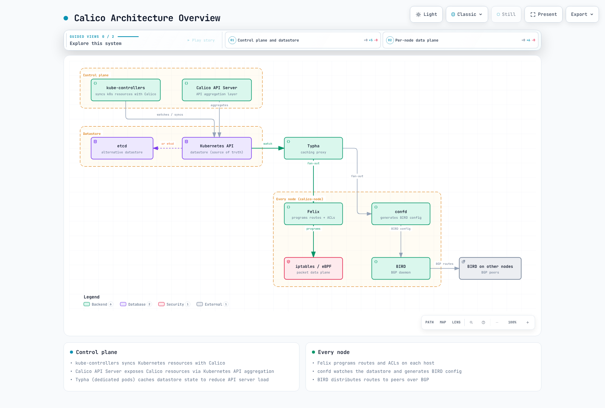

# Calico 深入解析：Kubernetes 网络与策略

> **审查基线**：Calico Open Source 3.32.2 · **最后更新**：2026 年 9 月 12 日
> Calico 3.32 针对 Kubernetes 1.34–1.36 进行了测试。这不是无上限的 `3.29+ / Kubernetes 1.28+` 兼容性保证。

## 概述

Calico 为 Kubernetes 提供网络和网络策略，另有取决于部署和产品版本的主机及虚拟机能力。本系列涵盖架构、封装与路由、BGP、策略、eBPF、EKS 集成和运维。应根据[当前要求](https://docs.tigera.io/calico/latest/getting-started/kubernetes/requirements)选择配置，不要依据未注明日期的成熟度或资源用量排名。

### 2026 年 7 月：面向 Kubernetes 虚拟机的 Calico

Tigera 的[官方公告](https://www.tigera.io/news/tigera-launches-ebpf-powered-calico-for-vms-on-kubernetes-vm-migration-that-doesnt-require-rebuilding-the-network/)日期为 **2026 年 7 月 23 日**。它介绍 VMware 迁移中的虚拟机/容器网络、IP 连续性、L2 网桥扩展、策略和可观测性。这是产品公告，不承诺每项宣传能力都包含在 Calico Open Source 中。请检查确切版本、拓扑和功能状态：[Enterprise 3.23 发布说明](https://docs.tigera.io/calico-enterprise/latest/release-notes/)仍将 KubeVirt 在线迁移标记为技术预览。市场宣传中的可用性不会消除这一具体功能限制。

## 兼容性和功能边界

- Calico 3.32.2 于 2026 年 8 月 30 日发布。已测试 Kubernetes 次版本为 1.34、1.35 和 1.36；Kubernetes 1.37 已可用不能证明兼容。
- 一般 Linux 要求为内核 5.10 或更高版本及所需模块。受支持架构、厂商回移补丁及各功能更高要求请参阅 eBPF 指南。
- Linux 数据平面包括 iptables、nftables 和 eBPF。默认值取决于安装器/平台；当前自主管理的 kubeadm Operator 安装可能默认使用 eBPF。不存在全面功能对等保证。
- [Calico for Windows](https://docs.tigera.io/calico/latest/getting-started/kubernetes/windows-calico/limitations) 支持特定 IPv4 VXLAN 和 BGP 配置，但不支持 Linux eBPF、IPIP、IPv6/双栈、WireGuard，也不支持所有 Linux 策略功能。
- Open Source 包含分层策略、Goldmane 流聚合和 Whisker UI。DNS/FQDN 策略、应用层策略及其他高级能力在[产品比较](https://docs.tigera.io/calico/latest/about/calico-product-editions)中有版本边界。

## Calico 与 Cilium

| 需求 | Calico | Cilium |
|---|---|---|
| Linux 数据平面 | iptables / nftables / eBPF，取决于配置 | eBPF，适用 L7 功能使用 Envoy |
| Kubernetes NetworkPolicy | 支持，另有 Calico 策略和层 | 支持，另有 Cilium 策略 |
| L7 / DNS 策略 | 检查 Enterprise/Cloud 许可及功能状态 | 提供 HTTP 和 DNS 策略；有协议专属限制 |
| BGP | 在适用网络模式中使用基于 BIRD 的路由 | BGP 控制平面通告；评估所需路由和拓扑 |
| 可观测性 | Open Source Goldmane/Whisker 和指标；付费功能增加能力 | Hubble 和指标 |
| Windows | 支持部分配置，但有显著限制 | Cilium 1.20 代理要求 Linux；不是 Windows beta 数据平面 |
| kube-proxy 替代 | eBPF 数据平面提供 | 配置后可用 |
| 多集群 / 网格 | 独立功能和集成；取决于版本 | Cluster Mesh 和可选服务网格功能；并非安装后全部启用 |

两者都可用于生产。资源用量和运维复杂性取决于规则、流量、平台和调优。应在目标环境验证所需功能。不要仅因两种主 CNI 在不同环境各自可用，就将它们同时安装到一个集群。Cilium 的[带版本要求](https://github.com/cilium/cilium/blob/v1.20.1/Documentation/operations/system_requirements.rst)和本站 [Cilium 服务网格指南](../../service-mesh/cilium-service-mesh/README.md)介绍其平台及网格边界。

## 架构



[🔍 查看交互式图表](https://www.atomai.click/kubernetes-docs/archmaps/en-networking-calico-readme-0.html)

图中是 BGP 部署示意，不是强制组件布局。下方 EKS 仅策略示例使用 Kubernetes 数据存储，省略 BIRD/confd。“控制平面”描述逻辑角色，不表示组件放在 EKS 托管控制平面机器上。Typha 是独立 Deployment，不是每节点进程。

| 组件 | 作用和范围 |
|---|---|
| Felix | 在工作负载节点上配置策略和适用路由 |
| BIRD / confd | 该后端启用时提供 BGP 及其配置；仅策略模式下不存在 |
| Typha | 可选数据存储更新缓存/扇出；Operator 随安装规模扩缩副本，不一定为三个 |
| kube-controllers | Kubernetes 资源协调、同步和清理 |
| Calico CNI / IPAM | Calico 管理网络时负责接口和 Pod 地址；EKS 示例中 Amazon VPC CNI/IPAM 保留这些职责 |
| Calico API 服务器 | 默认模型中，在内部 CRD 之上提供聚合 `projectcalico.org/v3` API；原生 v3 CRD 是独立技术预览 |

使用[架构参考](https://docs.tigera.io/calico/latest/reference/architecture/overview)和实际渲染工作负载识别已启用组件。本指南使用 Kubernetes API 数据存储；基于 etcd 的设计有独立安装和功能约束。

## 网络模式和 MTU

| 模式 | 封装和路由 | 1500 字节 IPv4 底层网络的 Pod MTU 示例 |
|---|---|---|
| IPIP | IPv4 内封装 IPv4，通常用 BGP 分发路由 | 1480 |
| VXLAN | 默认 UDP 4789；VXLAN Pod 路由不需要 BGP | 1450 |
| 非封装 | 底层网络必须路由 Pod 地址；BGP 是分发路由的一种方式 | 1500 |
| CrossSubnet | IPIP 或 VXLAN 设置，仅跨节点子网时封装 | 仍需为需要隧道的路径预留相应开销 |

这些 MTU 是示例，不是通用常量。IPv6 VXLAN 开销、巨帧底层网络、WireGuard 和云路径限制会改变计算。IPIP 仅支持 IPv4；IPv4 VXLAN 也可用于不适合 IPIP 的环境。参阅 [MTU 配置](https://docs.tigera.io/calico/latest/networking/configuring/mtu)和[覆盖网络要求](https://docs.tigera.io/calico/latest/networking/configuring/vxlan-ipip)。仅 BGP 可用不能证明每个底层跳点都能路由 Pod CIDR；同二层邻接不是非封装路由网络的通用前提。选择模式前应规划底层网络、端口、地址族和平台。

## EKS：保留 Amazon VPC CNI 并添加 Calico 策略

此示例适用于已安装受支持 Amazon VPC CNI 的 Linux EC2 节点。它不替换 Pod 网络，也不是 Auto Mode 或 Fargate 安装方案。[官方 EKS 指南](https://docs.tigera.io/calico/latest/getting-started/kubernetes/managed-public-cloud/eks)要求：

1. 选择 Calico 为策略引擎前，禁用 Amazon VPC CNI 原生网络策略执行；同时运行两者会冲突。对于已有保护的集群，应规划并验证策略交接，避免出现无保护转换阶段。
2. 设置 VPC CNI `ANNOTATE_POD_IP=true`，并授予其 `aws-node` ServiceAccount 对 Pod 的 `patch` 权限。通过已安装插件/配置所有者管理这些设置，防止协调将其还原。应用下方增量 RBAC 示例前，先检查实际 ServiceAccount 名称。
3. 不要声称覆盖设有 `ENABLE_V4_EGRESS=true` 的 IPv6 Pod：Calico EKS 指南明确排除此组合的策略执行。
4. 从下方选择**一种**安装方法。这些是全新安装示例，不是接管现有 Operator 或迁移活动 CNI 的命令。

```yaml
apiVersion: rbac.authorization.k8s.io/v1
kind: ClusterRole
metadata:
  name: calico-vpc-cni-pod-ip-patch
rules:
  - apiGroups: [""]
    resources: ["pods"]
    verbs: ["patch"]
---
apiVersion: rbac.authorization.k8s.io/v1
kind: ClusterRoleBinding
metadata:
  name: calico-vpc-cni-pod-ip-patch
roleRef:
  apiGroup: rbac.authorization.k8s.io
  kind: ClusterRole
  name: calico-vpc-cni-pod-ip-patch
subjects:
  - kind: ServiceAccount
    name: aws-node
    namespace: kube-system
```

### 方法 A：固定版本 Operator 清单

```bash
set -euo pipefail
CALICO_VERSION=v3.32.2
kubectl create -f "https://raw.githubusercontent.com/projectcalico/calico/$CALICO_VERSION/manifests/v1_crd_projectcalico_org.yaml"
kubectl create -f "https://raw.githubusercontent.com/projectcalico/calico/$CALICO_VERSION/manifests/tigera-operator.yaml"
kubectl -n tigera-operator rollout status deployment/tigera-operator --timeout=300s
kubectl apply -f - <<'YAML'
apiVersion: operator.tigera.io/v1
kind: Installation
metadata:
  name: default
spec:
  kubernetesProvider: EKS
  cni:
    type: AmazonVPC
  calicoNetwork:
    bgp: Disabled
    linuxDataplane: Iptables
---
apiVersion: operator.tigera.io/v1
kind: APIServer
metadata:
  name: default
spec: {}
YAML
```

### 方法 B：固定版本 Helm 安装

完成相同 VPC CNI 前提条件。Calico 3.32 将 CRD 安装与 Operator chart 分离；新集群仅安装小型 Operator chart 不够。将这些 values 保存为 `calico-eks-values.yaml`：

```yaml
installation:
  kubernetesProvider: EKS
  cni:
    type: AmazonVPC
  calicoNetwork:
    bgp: Disabled
    linuxDataplane: Iptables
apiServer:
  enabled: true
```

```bash
set -euo pipefail
helm repo add projectcalico https://docs.tigera.io/calico/charts
helm repo update projectcalico
helm template calico-crds projectcalico/crd.projectcalico.org.v1 --version v3.32.2   | kubectl apply --server-side -f -
helm install calico projectcalico/tigera-operator --version v3.32.2   --namespace tigera-operator --create-namespace -f calico-eks-values.yaml
```

固定版本 chart 默认还启用 Goldmane 和 Whisker。审核渲染清单中的这些组件和访问控制。原生 `projectcalico.org/v3` CRD 是独立技术预览；此处示例使用常规内部 CRD 加聚合 API 服务器。

### 先验证，再测试策略行为

```bash
kubectl get tigerastatus
kubectl -n calico-system get pods -o wide
kubectl -n calico-system rollout status daemonset/calico-node --timeout=300s
kubectl wait --for=condition=Available apiservice/v3.projectcalico.org --timeout=300s
kubectl get felixconfigurations.projectcalico.org
```

在依赖策略执行前，检查 degraded/progressing 状态，并用可销毁工作负载测试允许和拒绝的流量。Ready DaemonSet 不能证明策略有效。在 AmazonVPC 仅策略模式下，Calico IPPool 为空或没有 BIRD 会话不一定是故障：AWS 仍提供 Pod IPAM 和网络。

### 完整 Calico 网络和其他安装方法

EKS 上的完整 Calico 网络是独立的新集群设计。官方流程从没有工作负载节点开始，在添加节点前更改 CNI；不要在运行中的 VPC CNI 集群上应用 `cni.type: Calico` 片段。参阅 [EKS 集成](08-eks-integration.md)和官方 EKS 流程。对于没有现有 CNI 的自主管理集群，使用[本地部署指南](https://docs.tigera.io/calico/latest/getting-started/kubernetes/self-managed-onprem/onpremises)。直接清单仍是备选，但命名空间、Typha 配置和生命周期不同于 Operator 安装。应选择一个所有者，不要叠加 Helm、Operator 和 `calico.yaml` 安装。

## 具有明确范围的策略示例

使用专用 `calico-demo` 命名空间。以下入站和出站示例仅选择该命名空间；不是集群范围零信任部署。现有 Calico 层和更早的策略仍可改变结果。

```yaml
apiVersion: v1
kind: Namespace
metadata:
  name: calico-demo
---
apiVersion: networking.k8s.io/v1
kind: NetworkPolicy
metadata:
  name: allow-frontend-to-backend
  namespace: calico-demo
spec:
  podSelector:
    matchLabels:
      app: backend
  policyTypes: [Ingress]
  ingress:
    - from:
        - podSelector:
            matchLabels:
              app: frontend
      ports:
        - protocol: TCP
          port: 8080
```

对等方 `podSelector` 指**同一命名空间**中的 frontend Pod。它不验证用户身份，不允许所有同命名空间流量，也不设置出站策略。下一个独立示例将演示命名空间的出站流量限制为通过 UDP/TCP 53 访问选定 CoreDNS Pod，并拒绝其他出站流量：

```yaml
apiVersion: projectcalico.org/v3
kind: GlobalNetworkPolicy
metadata:
  name: calico-demo-dns-only
spec:
  namespaceSelector: kubernetes.io/metadata.name == 'calico-demo'
  selector: all()
  order: 100
  types: [Egress]
  egress:
    - action: Allow
      protocol: UDP
      destination:
        namespaceSelector: kubernetes.io/metadata.name == 'kube-system'
        selector: k8s-app == 'kube-dns'
        ports: [53]
    - action: Allow
      protocol: TCP
      destination:
        namespaceSelector: kubernetes.io/metadata.name == 'kube-system'
        selector: k8s-app == 'kube-dns'
        ports: [53]
    - action: Deny
```

先确认真实 DNS 端点和标签。此基于选择器的示例针对普通 CoreDNS Pod；不是 NodeLocal DNSCache 或 Auto Mode 系统解析器策略。仅端口 53 不能标识获授权 DNS 服务器。若还需要应用出站流量，应在启用最终拒绝前设计并测试显式允许规则。后续独立允许不能覆盖更早匹配的 Calico Deny。

### FQDN 策略因产品版本而异

Calico Enterprise/Cloud DNS 策略使用的 `destination.domains` 字段**不在 Open Source 3.32.2 NetworkPolicy 模式中**。不要将其应用于此 Open Source 安装。对于具有相应许可的部署，使用[基于域名的策略指南](https://docs.tigera.io/calico-enterprise/latest/network-policy/domain-based-policy)，配置可信 DNS 服务器并允许 DNS 路径。有计划地限制域名：`*.amazonaws.com` 是宽泛允许，不是对一个 AWS 账户或服务的授权。DNS 到 IP 的授权不等同于验证 HTTP Host 或 TLS 身份。

## 监控和健康状况

```yaml
apiVersion: projectcalico.org/v3
kind: FelixConfiguration
metadata:
  name: default
spec:
  prometheusMetricsEnabled: true
  prometheusMetricsPort: 9091
```

Felix 默认禁用指标。启用此监听器不会创建 Prometheus 抓取任务，也不意味着可安全公开；请按[指标指南](https://docs.tigera.io/calico/latest/operations/monitor/monitor-component-metrics)配置私有发现和访问控制。`flowLogsFileEnabled` 不是 Open Source FelixConfiguration 字段。使用受支持的 [Goldmane/Whisker 流日志路径](https://docs.tigera.io/calico/latest/observability/view-flow-logs)，不要复制 Enterprise 文件日志设置。

| 指标 | 含义 |
|---|---|
| `felix_active_local_endpoints` | 活动本地工作负载和主机端点 |
| `felix_active_local_policies` | 此节点端点上生效的策略 |
| `felix_iptables_rules` | 活动 iptables 规则；取决于数据平面 |
| `felix_int_dataplane_failures` | 失败且将重试的数据平面更新 |
| `felix_cluster_num_hosts` | Felix 的集群范围主机数；不要跨每个 Felix 实例求和 |
| `typha_connections_accepted` | 累计接受的连接数，不是当前连接数 |
| `typha_connections_active` | 当前打开的客户端连接 |

参阅 [Felix](https://docs.tigera.io/calico/latest/reference/felix/prometheus) 和 [Typha](https://docs.tigera.io/calico/latest/reference/typha/prometheus) 指标参考。这些是组件健康/配置指标，不是通用拒绝数据包计数器。Felix 健康服务默认位于 localhost:9099；Typha 健康服务启用时通常使用 9098。检查前先阅读已部署探针：在笔记本电脑上运行 `curl localhost` 不能检查节点健康服务器。

## 故障排除

```bash
kubectl -n calico-system get pods -o wide
kubectl -n calico-system logs -l k8s-app=calico-node -c calico-node --tail=100
kubectl get installations.operator.tigera.io default -o yaml
kubectl get networkpolicies.networking.k8s.io -A
kubectl get networkpolicies.projectcalico.org -A
kubectl get globalnetworkpolicies.projectcalico.org
kubectl get ippools.projectcalico.org -o wide
```

Operator 安装通常使用 `calico-system`；直接清单可能使用 `kube-system`。使用完全限定 API 资源名区分 Kubernetes 和 Calico NetworkPolicy。`kubectl get nodes ...status.conditions` 不是 Calico 路由状态命令。BIRD 状态命令仅适用于启用 BGP 的情况，`calicoctl node status` 需要适当 Calico 节点环境，而非任意管理员笔记本电脑。

| 症状 | 更改配置前的调查内容 |
|---|---|
| Pod 没有 IP | 先确定 IPAM 所有者：仅策略 EKS 检查 VPC CNI 日志/容量，否则检查 Calico IPAM |
| 跨节点失败 | 路由、底层网络/防火墙权限、MTU 和所选封装；盲目启用隧道可能加重故障 |
| 策略不匹配 | 端点标签、命名空间、方向、层/顺序、现有策略和实际数据平面 |
| CPU 高 | 流量/规则规模及指标/性能剖析证据；eBPF 迁移是规划更改，不是即时通用修复 |

仅在需要时使用匹配版本的 [calicoctl](https://docs.tigera.io/calico/latest/reference/calicoctl/)，选择实际操作系统/CPU 架构并验证发布制品。绝不能仅因缺少 BGP 或 Calico IPAM 状态就判定仅策略模式故障。

## 深入学习目录

| 部分 | 主题 |
|---|---|
| [1](01-introduction.md) | 简介、项目历史和实验设置 |
| [2](02-architecture.md) | 组件、数据存储和数据包流程 |
| [3](03-networking-modes.md) | 封装、直接路由和 MTU |
| [4](04-bgp-deep-dive.md) | BGP、路由反射器和外部集成 |
| [5](05-network-policy.md) | NetworkPolicy、策略层和策略设计 |
| [6](06-ebpf-dataplane.md) | eBPF 设置、限制和故障排除 |
| [7](07-advanced-topics.md) | 高级网络/安全主题 |
| [8](08-eks-integration.md) | EKS 和 VPC CNI 集成 |
| [9](09-operations.md) | 运维和诊断 |
| [术语表](glossary.md) | 术语 |

[Calico 简介测验](../../quizzes/networking/calico/01-introduction-quiz.md) · [官方文档](https://docs.tigera.io/calico/latest/about/) · [3.32.2 发布](https://github.com/projectcalico/calico/releases/tag/v3.32.2)
