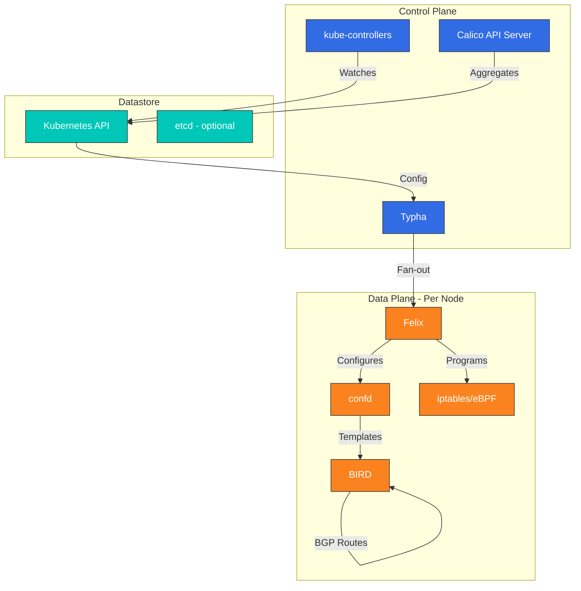
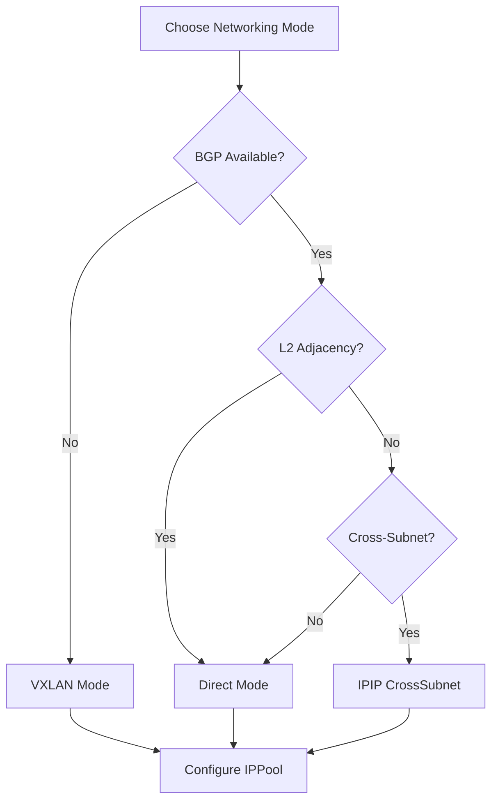

# Calico 深入解析：企业级 Kubernetes 网络

> **支持的版本**: Calico v3.29+ / Kubernetes 1.28+
> **最后更新**: July 27, 2026

## 概述

本节将帮助你全面了解 Calico 的核心概念和技术。我们将深入探讨 Calico 的架构、网络模式、网络策略、安全功能，以及与云服务提供商的集成。

## 什么是 Calico？

Calico 是一款面向容器、虚拟机和原生基于主机工作负载的开源网络与网络安全解决方案。Calico 最初由 Tigera 开发，如今已成为部署最广泛的 Kubernetes CNI 插件之一，凭借其稳定性、性能和强大的网络策略能力，受到全球企业的信赖。

### 2026 年 7 月更新：Kubernetes 上用于 VM 的 Calico

2026 年 7 月 21 日，Tigera 发布了 **Calico for VMs on Kubernetes**，这是一个由 eBPF 驱动的平台，可在单一 Kubernetes 原生控制平面上为虚拟机和容器提供网络与网络安全。它面向 VMware/NSX 迁移：迁移到 Kubernetes 上的 VM 可保留其 IP 地址，通过 L2 桥接扩展继续使用现有 VLAN，并继承与其相邻容器相同的 Calico 网络策略、微分段（包括策略层级和暂存策略）、路由、负载均衡和流量可见性。详见[新闻稿](https://www.storagenewsletter.com/2026/07/21/tigera-launches-calico-unified-platform-3-23-the-definitive-vmware-migration-solution-with-one-network-and-one-security-model-for-every-vm-and-container-on-kubernetes/)。

### 核心优势

1. **久经生产环境验证的成熟度**：自 2016 年以来被数千家组织用于生产环境
2. **灵活的数据平面**：可选择 iptables、nftables 或 eBPF 数据平面
3. **原生 BGP 支持**：为本地部署和混合部署提供一流的 BGP 集成
4. **全面的网络策略**：Kubernetes NetworkPolicy 加上扩展的 Calico 策略
5. **Windows 支持**：完整支持 Windows 容器网络
6. **企业功能**：Tigera Calico Enterprise 增加可观测性、合规性和威胁防御功能
7. **云原生集成**：与 AWS、GCP、Azure 和本地基础设施无缝集成

### 为什么选择 Calico？

- **经大规模验证**：为处理数十亿笔交易的公司提供生产工作负载支持
- **运维简单**：安装和配置直接明了
- **强大的社区**：拥有活跃的开源社区和丰富的文档
- **供应商灵活性**：可在任何 Kubernetes 发行版中保持一致运行
- **已具备合规能力**：内置审计日志和策略执行功能

## 版本亮点：Calico v3.29

Calico v3.29 在网络、安全和可观测性方面带来了显著改进：

### 网络增强
- **eBPF 数据平面 GA**：具备完整功能对等性的生产就绪 eBPF 数据平面
- **改进的 BGP 性能**：优化路由收敛并降低内存占用
- **增强的 VXLAN**：通过自动 MTU 检测改善跨子网路由
- **IPv6 双栈**：全面支持双栈网络环境

### 安全改进
- **DNS 策略增强**：更精细的基于 FQDN 的网络策略
- **策略建议**：基于观测流量的 AI 辅助策略生成
- **加密选项**：简化 WireGuard 的节点间加密配置

### 运维功能
- **Calico API Server**：针对 Calico 资源的原生 Kubernetes API 聚合
- **改进的诊断**：增强的故障排除工具和健康检查
- **资源优化**：降低 CPU 和内存消耗

## CNI 对比

| 功能 | Calico | Cilium |
|---------|--------|--------|
| **核心技术** | iptables/eBPF | eBPF |
| **成熟度** | 非常高（2016+） | 高（2017+） |
| **网络策略** | L3-L4（L7 Enterprise） | L3-L7 |
| **Service Mesh** | 独立（Enterprise） | 内置 |
| **BGP 支持** | 强（原生） | 支持 |
| **可观测性** | 基础（Enterprise：高级） | Hubble（强大） |
| **Windows 支持** | 完整 | Beta |
| **eBPF 数据平面** | 可选 | 必需 |
| **学习曲线** | 中等 | 更陡峭 |
| **资源使用量** | 较低 | 较高 |
| **kube-proxy 替代** | 是（eBPF 模式） | 是 |
| **多集群** | Federation | Cluster Mesh |

## 架构概述

Calico 的架构由多个关键组件协同工作，以提供网络和网络安全。



### 关键组件

| 组件 | 作用 | 运行位置 |
|-----------|------|---------|
| **Felix** | 在每个主机上配置路由和 ACL | 每个节点 |
| **BIRD** | 用于路由分发的 BGP 守护进程 | 每个节点 |
| **confd** | 监视 datastore，生成 BIRD 配置 | 每个节点 |
| **Typha** | 用于降低 API server 负载的缓存代理 | 专用 Pod |
| **kube-controllers** | 将 Kubernetes 资源与 Calico 同步 | 控制平面 |
| **Calico API Server** | Kubernetes API 聚合层 | 控制平面 |

## 网络模式

Calico 支持多种网络模式，以满足不同的基础设施需求：

### 1. IPIP 模式（默认）
- 用于跨子网流量的 IP-in-IP 封装
- MTU：1480 字节
- 最适合：云环境、简单配置

### 2. VXLAN 模式
- VXLAN 封装（UDP 端口 4789）
- MTU：1450 字节
- 最适合：需要标准 overlay 协议的环境

### 3. Direct/Unencapsulated 模式
- 无封装，原生路由
- MTU：1500 字节（完整）
- 最适合：使用 BGP 的本地部署环境、对性能要求严格的工作负载

### 模式选择指南



## Amazon EKS 集成

Calico 可与 Amazon EKS 无缝集成，提供增强的网络策略能力。

### 在 EKS 上快速安装

```bash
# Install Calico operator
kubectl create -f https://raw.githubusercontent.com/projectcalico/calico/v3.29.0/manifests/tigera-operator.yaml

# Configure Calico for EKS (VXLAN mode)
cat <<EOF | kubectl apply -f -
apiVersion: operator.tigera.io/v1
kind: Installation
metadata:
  name: default
spec:
  kubernetesProvider: EKS
  cni:
    type: Calico
  calicoNetwork:
    bgp: Disabled
    ipPools:
    - blockSize: 26
      cidr: 10.244.0.0/16
      encapsulation: VXLAN
      natOutgoing: Enabled
      nodeSelector: all()
EOF

# Verify installation
kubectl get pods -n calico-system
```

### 使用 VPC CNI + Calico Policy 的 EKS

对于使用 AWS VPC CNI 进行网络连接、但需要高级网络策略的 EKS 环境：

```bash
# Install Calico for network policy only
kubectl apply -f https://raw.githubusercontent.com/aws/amazon-vpc-cni-k8s/master/config/master/calico-operator.yaml
kubectl apply -f https://raw.githubusercontent.com/aws/amazon-vpc-cni-k8s/master/config/master/calico-crs.yaml
```

## 安装方法

### 方法 1：Tigera Operator（推荐）

```bash
# Install the operator
kubectl create -f https://raw.githubusercontent.com/projectcalico/calico/v3.29.0/manifests/tigera-operator.yaml

# Install Calico with custom configuration
cat <<EOF | kubectl apply -f -
apiVersion: operator.tigera.io/v1
kind: Installation
metadata:
  name: default
spec:
  calicoNetwork:
    ipPools:
    - blockSize: 26
      cidr: 192.168.0.0/16
      encapsulation: IPIP
      natOutgoing: Enabled
      nodeSelector: all()
EOF
```

### 方法 2：Helm 安装

```bash
# Add Calico Helm repository
helm repo add projectcalico https://docs.tigera.io/calico/charts
helm repo update

# Install Calico
helm install calico projectcalico/tigera-operator \
  --version v3.29.0 \
  --namespace tigera-operator \
  --create-namespace \
  --set installation.kubernetesProvider=EKS
```

### 方法 3：基于 Manifest 的安装

```bash
# For clusters with 50 nodes or less
kubectl apply -f https://raw.githubusercontent.com/projectcalico/calico/v3.29.0/manifests/calico.yaml

# For larger clusters (enables Typha)
kubectl apply -f https://raw.githubusercontent.com/projectcalico/calico/v3.29.0/manifests/calico-typha.yaml
```

## 网络策略示例

### 基本 Kubernetes NetworkPolicy

```yaml
apiVersion: networking.k8s.io/v1
kind: NetworkPolicy
metadata:
  name: allow-frontend-to-backend
  namespace: production
spec:
  podSelector:
    matchLabels:
      app: backend
  policyTypes:
  - Ingress
  ingress:
  - from:
    - podSelector:
        matchLabels:
          app: frontend
    ports:
    - protocol: TCP
      port: 8080
```

### Calico GlobalNetworkPolicy

```yaml
apiVersion: projectcalico.org/v3
kind: GlobalNetworkPolicy
metadata:
  name: deny-all-egress-except-dns
spec:
  selector: all()
  types:
  - Egress
  egress:
  - action: Allow
    protocol: UDP
    destination:
      ports:
      - 53
  - action: Allow
    protocol: TCP
    destination:
      ports:
      - 53
  - action: Deny
```

### 使用 FQDN 的 Calico NetworkPolicy

```yaml
apiVersion: projectcalico.org/v3
kind: NetworkPolicy
metadata:
  name: allow-external-api
  namespace: production
spec:
  selector: app == 'web'
  types:
  - Egress
  egress:
  - action: Allow
    protocol: TCP
    destination:
      domains:
      - "api.example.com"
      - "*.amazonaws.com"
      ports:
      - 443
```

## 监控和可观测性

### Prometheus 指标

Calico 通过 Prometheus 暴露指标。需要监控的关键指标：

```yaml
# Felix metrics endpoint configuration
apiVersion: projectcalico.org/v3
kind: FelixConfiguration
metadata:
  name: default
spec:
  prometheusMetricsEnabled: true
  prometheusMetricsPort: 9091
```

### 关键指标

| 指标 | 描述 |
|--------|-------------|
| `felix_active_local_endpoints` | 节点上的活跃 endpoint 数量 |
| `felix_iptables_rules` | 已配置的 iptables 规则数量 |
| `felix_ipsets_calico` | 维护的 IP 集合数量 |
| `felix_int_dataplane_failures` | 数据平面配置失败次数 |
| `felix_cluster_num_hosts` | 集群中的主机总数 |

### 健康检查端点

```bash
# Check Felix health
curl -s http://localhost:9099/liveness
curl -s http://localhost:9099/readiness

# Check Typha health
curl -s http://localhost:9098/liveness
```

## 故障排除快速参考

### 常用命令

```bash
# Check Calico system status
kubectl get pods -n calico-system

# View Calico node status
kubectl get nodes -o custom-columns=NAME:.metadata.name,CALICO:.status.conditions[*].type

# Check IP pools
kubectl get ippools -o wide

# View network policies
kubectl get networkpolicies -A
kubectl get globalnetworkpolicies

# Felix logs
kubectl logs -n calico-system -l k8s-app=calico-node -c calico-node

# BIRD status (BGP)
kubectl exec -n calico-system calico-node-xxxxx -c calico-node -- birdcl show protocols
```

### 常见问题和解决方案

| 问题 | 诊断 | 解决方案 |
|-------|-----------|----------|
| Pod 卡在 ContainerCreating | 检查 Felix 日志中的 IPAM 错误 | 验证 IPPool 配置 |
| 跨节点连接失败 | 检查封装模式 | 确保已启用 IPIP/VXLAN |
| 网络策略未生效 | 检查策略顺序和 selector | 使用 `calicoctl` 验证策略 |
| Felix CPU 使用率高 | iptables 规则过多 | 考虑使用 eBPF 数据平面 |

## 深入解析目录

**[第 1 部分：Calico 简介](01-introduction.md)**
- 什么是 Calico 及其项目历史
- Lab 环境设置
- 核心功能概述
- 使用案例和部署场景
- 社区和治理

**[第 2 部分：Calico 架构深入解析](02-architecture.md)**
- 组件架构概述
- Felix：Calico Agent
- BIRD：BGP 路由守护进程
- confd：配置管理
- Typha：扩展组件
- kube-controllers：Kubernetes 集成
- Datastore 选项
- 数据包流分析

**[第 3 部分：网络模式](03-networking-modes.md)**
- IPIP 封装模式
- VXLAN 封装模式
- Direct/Unencapsulated 模式
- 模式比较和选择
- 性能基准测试
- 云服务提供商兼容性
- MTU 优化

## 选择指南：Calico 与 Cilium

### 在以下情况下选择 Calico：
- 你需要经过生产环境验证的稳定性和成熟度
- 需要 Windows 容器支持
- 与现有网络基础设施的 BGP 集成至关重要
- 相比高级功能，你更偏好运维简单性
- 资源效率是优先事项
- 你已熟悉基于 iptables 的网络

### 在以下情况下选择 Cilium：
- 你需要高级 L7 网络策略
- 希望具备内置 Service Mesh 能力
- Hubble 的深度可观测性非常重要
- 你希望利用前沿 eBPF 功能
- 需要使用 Cluster Mesh 的多集群连接

### 混合方式
一些组织同时使用两者：
- 对需要稳定性的生产工作负载使用 Calico
- 对探索新功能的开发/预发布环境使用 Cilium

## 参考资料

- [Calico 官方文档](https://docs.tigera.io/calico/latest/about/)
- [Calico GitHub 仓库](https://github.com/projectcalico/calico)
- [Tigera Calico Enterprise](https://www.tigera.io/tigera-products/calico-enterprise/)
- [Calico 网络策略指南](https://docs.tigera.io/calico/latest/network-policy/)
- [Amazon EKS Calico 集成](https://docs.aws.amazon.com/eks/latest/userguide/calico.html)
- [calicoctl 参考](https://docs.tigera.io/calico/latest/reference/calicoctl/)
- [Calico eBPF 数据平面](https://docs.tigera.io/calico/latest/operations/ebpf/)

## 测验

要测试你在本节中学到的内容，请尝试 [Calico 深入解析测验](../../quizzes/networking/calico/01-introduction-quiz.md)。
