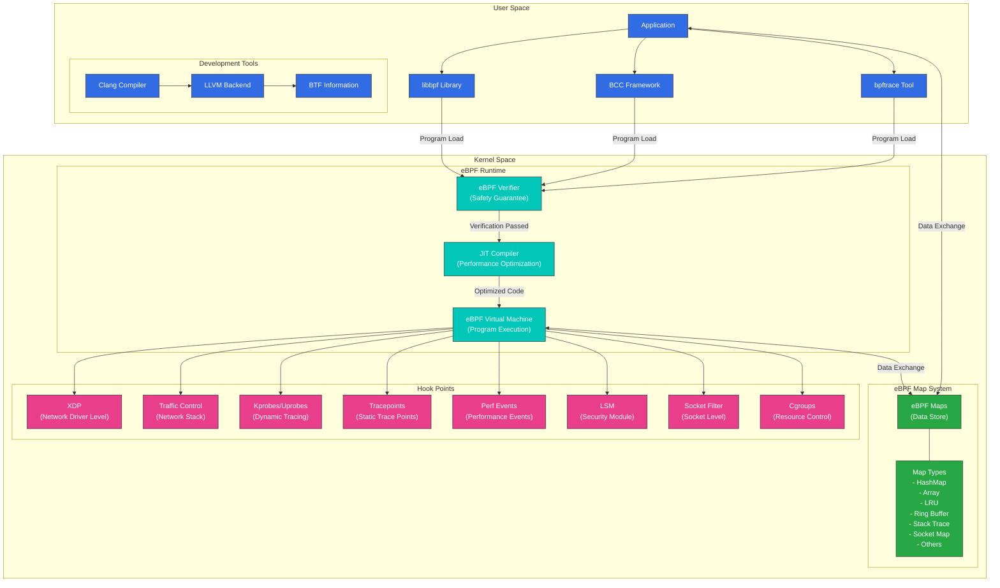
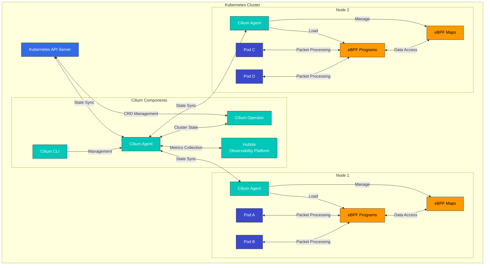

# eBPF 技术深度解析

> **支持的版本**: Linux kernel 4.19+
> **最后更新**: February 22, 2026

## 实验环境设置

要跟随本文档中的示例操作，您需要以下工具和环境：

### 所需工具
- Linux kernel 4.19 或更高版本（推荐 5.10+）
- bpftool、libbpf-dev、clang、llvm
- bcc（BPF Compiler Collection）

### 环境设置

```bash
# Install required packages on Ubuntu/Debian systems
sudo apt-get update
sudo apt-get install -y build-essential clang llvm libelf-dev libbpf-dev bpftool linux-tools-common linux-tools-generic

# Install BCC
sudo apt-get install -y bpfcc-tools python3-bpfcc

# Check kernel version
uname -r

# Check eBPF feature support
bpftool feature
```

## eBPF 技术简介与历史背景

eBPF（extended Berkeley Packet Filter）是一项革命性技术，允许程序在 Linux kernel 内安全运行。该技术提供了一种强大机制，无需修改 kernel 代码即可扩展和观测 kernel 行为。在现代云原生环境中，eBPF 已为网络、安全、监控和性能分析带来了革命性变化。

### 从 BPF 到 eBPF：演进历史

#### 早期 BPF 的诞生与局限（1992-2013）
1992 年，UC Berkeley 的 Steven McCanne 和 Van Jacobson 发表了题为 “The BSD Packet Filter: A New Architecture for User-level Packet Capture” 的论文，介绍了 Berkeley Packet Filter（BPF）。该技术提出了一种创新的网络数据包过滤方法。

BPF 引入了以下核心概念：
- **内核内虚拟机**：在 kernel 内安全执行用户定义的代码
- **基于寄存器的设计**：比基于栈的模型更高效的执行模型
- **安全保障**：防止无限循环并限制内存访问
- **数据包过滤优化**：避免不必要的数据包复制

早期 BPF 主要用于 tcpdump 等网络监控工具，并具有以下局限：
- 指令集有限（仅有 2 个 32 位寄存器）
- 程序大小受限（最多 4096 条指令）
- 功能有限（主要用于数据包过滤）
- 与用户空间的交互有限
- 无法利用现代 CPU 架构

尽管存在这些局限，BPF 在 20 多年间始终是 Linux kernel 的重要组成部分。

#### eBPF 的诞生与早期发展（2013-2016）
2013 年，PLUMgrid 的 Alexei Starovoitov 提出了扩展 BPF（eBPF），以克服现有 BPF 的限制。该提案旨在彻底重新设计 BPF，使其适配现代处理器架构。

eBPF 的初始设计目标包括：
- 支持 64 位架构
- 更多寄存器（10 → 当前为 11）
- 更大的栈空间（512 字节）
- 通过 maps 存储状态并与用户空间通信
- 能够附加到各种事件的通用能力

关键发展阶段：
- **2014 年 5 月（Linux kernel 3.15）**：初始 eBPF 基础设施集成到 Linux kernel
  - 引入新的 eBPF 指令集
  - 添加从经典 BPF（cBPF）到 eBPF 的转换层
  - 引入初始 eBPF map 类型（hash、array）

- **2014 年 12 月（Linux kernel 3.18）**：引入 eBPF JIT（Just-In-Time）编译器
  - 为 x86_64 架构提供 JIT 编译支持
  - 显著提升执行性能
  - 添加用于程序链式调用的 tail call 功能

- **2015 年 6 月（Linux kernel 4.1）**：扩展 eBPF maps 功能
  - 增强用户空间与 kernel 空间之间的数据共享机制
  - 添加新的 map 类型（LRU hash、stack trace）
  - 添加将 eBPF 程序附加到 kprobes 的能力

- **2016 年 1 月（Linux kernel 4.4）**：引入 XDP（eXpress Data Path）
  - 可在网络驱动层进行高性能数据包处理
  - 在数据包进入 kernel 网络栈前进行处理
  - 能够每秒处理数百万个数据包

- **2016 年 7 月（Linux kernel 4.7）**：引入额外的 eBPF 程序类型
  - 支持流量控制（TC）程序
  - 增强 socket 过滤功能
  - 扩展 helper function

在此期间，eBPF 开始从简单的数据包过滤工具演变为通用 kernel 编程基础设施，并扩展到网络以外的多种用途。

#### 现代 eBPF 生态系统的增长与创新（2017 年至今）
自 2017 年以来，eBPF 已确立为云原生计算的核心技术，各种项目和公司纷纷采用该技术。

##### 主要项目和技术发展：

- **2017 年**：
  - **Cilium Project 启动**：首个将 eBPF 用于容器网络和安全的重大项目
  - **BCC（BPF Compiler Collection）**：用于 eBPF 程序开发的高级工具集合出现
  - **Linux kernel 4.10-4.14**：添加 cgroup、socket、tracepoint 程序类型

- **2018 年**：
  - **Linux kernel 4.18**：引入 BTF（BPF Type Format），为 CO-RE（Compile Once – Run Everywhere）支持奠定基础
  - **bpftrace**：出现 DTrace 风格的高级追踪语言
  - **Facebook Katran**：开源基于 eBPF 的 L4 负载均衡器

- **2019 年**：
  - **Linux kernel 5.0-5.3**：支持 BPF-to-BPF 函数调用，添加 raw tracepoint 程序
  - **Falco**：基于 eBPF 的运行时安全监控工具日益流行
  - **Hubble**：出现基于 Cilium 的网络可观测性工具

- **2020 年**：
  - **Linux kernel 5.5-5.10**：BPF link 抽象、全局变量、sleep 能力、循环支持
  - **libbpf**：用户空间库趋于成熟
  - **eBPF Foundation 成立**：成立推动技术发展的官方组织
  - **Isovalent（Cilium 开发者）A 轮融资**：商业 eBPF 解决方案出现

- **2021 年**：
  - **Linux kernel 5.11-5.15**：内存分配功能、timer 支持、dynamic pointer 增加
  - **增强 Kubernetes 集成**：在 service mesh、网络、安全领域扩大采用
  - **商业产品发布**：多家公司推出基于 eBPF 的产品

- **2022 年至今**：
  - **Linux kernel 6.0+**：持续扩展功能和优化
  - **作为云原生技术的标准化**：扩大与 CNCF 项目的集成
  - **eBPF Summit**：专门会议和社区不断发展
  - **主要云提供商采用**：AWS、GCP、Azure 使用 eBPF 技术

##### 当前 eBPF 应用领域：

1. **网络**：
   - 容器网络（Cilium、Calico）
   - 负载均衡（Katran、Cilium）
   - 数据包过滤和防火墙（bpfilter）
   - 网络加速（基于 XDP 的解决方案）

2. **安全**：
   - 运行时安全监控（Falco、Tracee）
   - 入侵检测系统（Tetragon）
   - 系统调用过滤（seccomp-bpf）
   - 权限管理（LSM BPF）

3. **可观测性**：
   - 系统监控和追踪（bpftrace、BCC）
   - 性能分析（BPF Performance Tools）
   - 分布式追踪（Hubble）
   - 指标收集（eBPF Exporter）

4. **Service Mesh**：
   - 无 Sidecar 的 service mesh（Cilium Service Mesh）
   - L7 proxy 和负载均衡
   - 流量管理和路由

5. **存储**：
   - 块 I/O 追踪和优化
   - 文件系统监控
   - 缓存性能分析

### eBPF 的技术演进：按 Kernel 版本划分的关键特性

eBPF 的技术进步经历了多个 Linux kernel 版本的逐步发展，每个版本都增加了重要功能。下表展示了按 kernel 版本划分的主要 eBPF 功能新增项：

| Kernel 版本 | 年份 | 新增的主要 eBPF 功能 | 技术意义 |
|---------------|------|-------------------------|----------------------|
| 3.15 | 2014 | 引入初始 eBPF 基础设施 | 新指令集、寄存器扩展 |
| 3.18 | 2014 | 添加 JIT 编译器 | 显著提升执行性能 |
| 4.1 | 2015 | eBPF maps 功能、用户空间 API | 可存储状态和共享数据 |
| 4.4 | 2016 | 引入 XDP（eXpress Data Path） | 可进行超高速数据包处理 |
| 4.7 | 2016 | 额外的程序类型、tail call 支持 | 改进程序链式调用和可扩展性 |
| 4.10 | 2017 | Socket 和 cgroup 程序 | 网络 socket 控制、容器支持 |
| 4.14 | 2017 | XDP offload、更多 helper function | 硬件加速支持 |
| 4.18 | 2018 | 引入 BTF（BPF Type Format） | CO-RE 支持的基础 |
| 5.0 | 2019 | 支持 BPF-to-BPF 函数调用 | 可实现模块化和代码复用 |
| 5.5 | 2020 | BPF link 抽象、全局变量 | 改进程序管理 |
| 5.8 | 2020 | 循环支持（有界循环） | 增强编程灵活性 |
| 5.10 | 2020 | Sleep 能力 | 可进行异步编程 |
| 5.13 | 2021 | 内存分配功能 | 可进行动态内存管理 |
| 5.15 | 2021 | Timer 支持 | 基于时间的事件处理 |
| 6.0+ | 2022+ | 持续扩展功能和优化 | 演变为完整的编程环境 |

通过这些发展，eBPF 已从简单的数据包过滤器演变为完整的编程环境，如今是 Linux kernel 中最重要的技术之一。尤其是 CO-RE（Compile Once – Run Everywhere）功能的引入，极大提升了 eBPF 程序的可移植性，使同一个程序可在各种 kernel 版本上无需重新编译即可运行。

### eBPF 与传统 Kernel Module：范式转变

eBPF 与传统 kernel module 相比，为扩展 Linux kernel 提供了根本不同的方法。理解这些差异对于掌握 eBPF 的创新至关重要。

| 特性 | eBPF | Kernel Module |
|---------------|------|---------------|
| **安全性** | 通过 verifier 保证安全，不可能导致 kernel 崩溃 | 可能发生 kernel panic，影响整体系统稳定性 |
| **部署** | 运行时动态加载，保持二进制兼容性 | 每个 kernel 版本均需重新编译，可能出现兼容性问题 |
| **升级** | 无需重启 kernel 即可实时更新 | 通常需要重启，造成服务中断 |
| **性能** | 通过 JIT 编译优化，接近原生性能 | 原生性能，可直接访问 kernel |
| **开发复杂度** | 受限环境，需要特殊工具，调试困难 | 可完整访问 kernel API，具备标准调试工具 |
| **权限模型** | 权限受限，沙箱环境 | 完整 kernel 权限，无限制访问 |
| **可移植性** | 支持 CO-RE（Compile Once – Run Everywhere） | 每个 kernel 版本均需重新编译 |
| **部署范围** | 可安全部署在生产环境 | 通常仅限于供应商提供的 kernel module |

eBPF 最大的创新是其安全性和动态加载能力。传统 kernel module 在 kernel 内不受限制地运行，错误可能导致整个系统不稳定。相比之下，eBPF 程序只有通过 kernel verifier 后才能加载；verifier 会彻底检查内存访问、无限循环和 kernel 崩溃的可能性。

## 深入分析 Kernel 内的 eBPF 架构

> **核心概念**：eBPF 作为 Linux kernel 内的沙箱虚拟机运行，可以在不修改 kernel 代码的情况下扩展 kernel 行为。

eBPF 并非简单技术，而是一个完整技术栈，涵盖从 kernel 内虚拟机到用户空间库的各种组件。理解此架构对于掌握 eBPF 的强大功能和灵活性至关重要。

### 详细 eBPF 架构图



### eBPF 架构组件详解

#### 1. 用户空间组件

**开发工具和库**：
- **Clang/LLVM**：将 eBPF 程序从 C 或 Rust 编译为 eBPF bytecode
- **libbpf**：低级 eBPF 操作库，直接与 kernel 交互
- **BCC（BPF Compiler Collection）**：提供 Python 和 Lua binding 的高级库
- **bpftrace**：基于 eBPF 的追踪语言，语法类似 DTrace

**CO-RE（Compile Once – Run Everywhere）**：
- 使用 BTF（BPF Type Format）实现跨 kernel 版本的可移植性
- 同一个 eBPF 程序可在各种 kernel 版本上运行，无需重新编译
- 通过 struct relocation 功能应对 kernel 结构变更

#### 2. Kernel 空间组件

**eBPF Runtime**：
- **eBPF Verifier**：保证程序安全的核心组件
  - 防止无限循环
  - 仅允许有效的内存访问
  - 保证 kernel 稳定性
  - 权限检查

- **JIT（Just-In-Time）Compiler**：
  - 将 eBPF bytecode 转换为原生机器代码
  - 架构特定优化（x86_64、ARM64、RISC-V 等）
  - 显著提升执行性能

- **eBPF Virtual Machine**：
  - 11 个寄存器
  - 512 字节栈
  - 通过 helper function 访问 kernel 函数
  - 支持用于程序链式调用的 tail call

**eBPF Map System**：
- 实现为 key-value store 的数据结构
- 在 kernel 空间和用户空间之间共享数据
- 支持多种 map 类型：
  - **BPF_MAP_TYPE_HASH**：通用 hash table
  - **BPF_MAP_TYPE_ARRAY**：固定大小 array
  - **BPF_MAP_TYPE_LRU_HASH**：跟踪最近使用的项目
  - **BPF_MAP_TYPE_RINGBUF**：高性能 ring buffer
  - **BPF_MAP_TYPE_STACK_TRACE**：stack trace 存储
  - **BPF_MAP_TYPE_SOCKHASH**：socket 引用存储
  - **BPF_MAP_TYPE_DEVMAP**：网络设备引用
  - **BPF_MAP_TYPE_PROG_ARRAY**：eBPF 程序引用

**Hook Points**：

eBPF 程序可以附加到 kernel 内的各种位置，称为 hook point。每个 hook point 都允许 eBPF 程序在发生特定事件或操作时执行。主要 hook point 如下：

- **XDP（eXpress Data Path）**：
  - 在网络驱动层处理数据包
  - 在数据包从 NIC 进入 kernel 前处理
  - 性能最高的数据包处理点（每秒可处理数千万个数据包）
  - 可能的操作：数据包 drop、pass、redirect、modify
  - 使用场景：DDoS 防御、数据包过滤、负载均衡
  - 支持硬件 offload（在特定 NIC 上）

- **Traffic Control（TC）**：
  - 网络栈的流量控制层
  - Ingress/egress 队列点
  - 提供比 XDP 更多的上下文
  - 可以修改数据包 header 和 payload
  - 使用场景：Network Policy、NAT、数据包转换
  - 同时支持 ingress 和 egress

- **Socket Filter**：
  - 在 socket 层进行数据包过滤
  - 程序附加到特定 socket
  - 控制用户空间应用程序的 socket 操作
  - 使用场景：按应用程序的数据包过滤、socket 级别统计
  - 可在 socket 创建、绑定、连接时应用

- **Kprobes/Uprobes**：
  - 动态追踪 kernel/用户空间函数
  - 在函数入口/返回时执行
  - 可以 hook 任意 kernel 函数
  - 使用场景：性能分析、调试、安全监控
  - 可动态添加/移除
  - 存在开销（生产环境中需谨慎）

- **Tracepoints**：
  - kernel 内静态定义的 trace point
  - 提供稳定 ABI（跨 kernel 版本兼容）
  - 支持追踪主要 kernel 事件
  - 使用场景：系统调用追踪、块 I/O 监控、网络事件追踪
  - 开销低于 Kprobes

- **Perf Events**：
  - 性能监控事件
  - CPU performance counter 访问
  - 硬件/软件事件监控
  - 使用场景：CPU 使用率分析、cache miss 跟踪、分支预测失败监控
  - 可进行精确性能测量

- **LSM（Linux Security Module）**：
  - 应用安全策略
  - 系统调用安全检查
  - 权限验证和访问控制
  - 使用场景：容器安全、权限提升检测、文件访问控制
  - 支持 kernel 5.7+

- **Cgroups**：
  - 容器资源控制
  - 按容器应用策略
  - 限制和监控资源使用情况
  - 使用场景：容器 Network Policy、资源限制、隔离
  - 在容器编排环境中很重要

### eBPF 程序生命周期详解

eBPF 程序从开发到执行会经历多个阶段。了解此过程有助于阐明 eBPF 的工作方式和约束。

1. **开发阶段**：
   - 使用 C、Rust 等高级语言编写程序
   - 使用 kernel header 和 eBPF helper function
   - 利用 BTF 信息（用于 CO-RE 支持）
   - 定义 section（使用 `SEC()` macro）
   - 指定 license（需要与 GPL 兼容）

2. **编译阶段**：
   - 使用 Clang/LLVM 编译为 eBPF bytecode
   - 使用 `-target bpf` 选项指定 eBPF target
   - 生成 BTF 和调试信息
   - 以 ELF 文件格式输出

3. **加载阶段**：
   - 通过 `bpf()` system call 将程序加载到 kernel
   - libbpf 或 BCC 库处理此过程
   - 指定要附加的程序类型和 hook
   - 创建所需 maps

4. **验证阶段**：
   - kernel 内 verifier 检查程序安全性
   - 控制流图（CFG）分析
   - 内存访问验证
   - 防止无限循环
   - 权限检查
   - 失败时提供详细错误信息

5. **JIT 编译阶段**：
   - 将 bytecode 转换为主机架构的原生代码
   - 应用架构特定优化
   - 提高执行性能
   - 在大多数架构上受支持（x86_64、ARM64、RISC-V 等）

6. **附加阶段**：
   - 将程序附加到特定 kernel 事件（hooks）
   - 创建并初始化所需 maps
   - 设置程序 metadata
   - 管理 file descriptor

7. **执行阶段**：
   - 事件发生时执行程序
   - 访问 context 数据
   - 根据决策处理数据包/事件
   - 调用 helper function

8. **数据交换阶段**：
   - 通过 eBPF maps 存储和检索数据
   - 与用户空间应用程序通信
   - 共享性能指标、状态信息等
   - 事件通知（perf event buffer、ring buffer 等）

9. **更新/卸载阶段**：
   - 必要时动态更新程序
   - 使用完成后卸载程序
   - 清理相关资源
   - 保留或删除 map 数据

### eBPF 程序类型和特性

eBPF 程序根据所附加的 hook point 分为多种类型。每种程序类型都有特定的 context 和功能：

1. **XDP（eXpress Data Path）Programs**：
   - 程序类型：`BPF_PROG_TYPE_XDP`
   - Context：网络数据包数据、接口信息
   - 返回值：`XDP_DROP`、`XDP_PASS`、`XDP_TX`、`XDP_REDIRECT` 等
   - 特性：最高性能的数据包处理、驱动/硬件级执行

2. **Traffic Control（TC）Programs**：
   - 程序类型：`BPF_PROG_TYPE_SCHED_CLS`、`BPF_PROG_TYPE_SCHED_ACT`
   - Context：网络数据包数据、调度信息
   - 返回值：`TC_ACT_OK`、`TC_ACT_SHOT`、`TC_ACT_REDIRECT` 等
   - 特性：数据包分类和操作，支持 ingress/egress

3. **Socket Filter Programs**：
   - 程序类型：`BPF_PROG_TYPE_SOCKET_FILTER`
   - Context：socket buffer 数据
   - 返回值：0（丢弃数据包）或数据包长度（允许数据包）
   - 特性：socket 级别数据包过滤，功能类似 tcpdump

4. **kprobe/uprobe Programs**：
   - 程序类型：`BPF_PROG_TYPE_KPROBE`、`BPF_PROG_TYPE_UPROBE`
   - Context：函数参数、寄存器值
   - 返回值：整数（无语义）
   - 特性：动态函数追踪、调试和 profiling

5. **tracepoint Programs**：
   - 程序类型：`BPF_PROG_TYPE_TRACEPOINT`
   - Context：tracepoint 定义 struct
   - 返回值：整数（无语义）
   - 特性：稳定的 kernel trace point、版本兼容性

6. **perf Event Programs**：
   - 程序类型：`BPF_PROG_TYPE_PERF_EVENT`
   - Context：性能事件数据
   - 返回值：整数（无语义）
   - 特性：硬件/软件性能事件监控

7. **cgroup Programs**：
   - 程序类型：`BPF_PROG_TYPE_CGROUP_SKB`、`BPF_PROG_TYPE_CGROUP_SOCK` 等
   - Context：cgroup 信息、socket/数据包数据
   - 返回值：0（拒绝）或 1（允许）
   - 特性：按容器应用的 Network Policy、资源控制

8. **LSM（Linux Security Module）Programs**：
   - 程序类型：`BPF_PROG_TYPE_LSM`
   - Context：安全相关操作信息
   - 返回值：0（允许）或错误码（拒绝）
   - 特性：安全策略应用、权限检查

9. **Socket Operations Programs**：
   - 程序类型：`BPF_PROG_TYPE_SOCK_OPS`
   - Context：socket 操作信息
   - 返回值：整数（无语义）
   - 特性：TCP 连接控制、socket 选项设置

10. **fentry/fexit Programs**：
    - 程序类型：`BPF_PROG_TYPE_TRACING`
    - Context：函数参数、返回值
    - 返回值：整数（无语义）
    - 特性：低开销函数追踪，比 kprobe 更高效

### 简单 eBPF 程序示例和说明

以下是一个追踪系统调用执行的简单 eBPF 程序示例：

```c
// hello_world.c
#include <linux/bpf.h>
#include <bpf/bpf_helpers.h>

// Program section definition - this program executes on execve system call entry
SEC("tracepoint/syscalls/sys_enter_execve")
int hello_execve(void *ctx) {
    // Print simple message
    char msg[] = "Hello, eBPF!";
    bpf_trace_printk(msg, sizeof(msg));
    return 0;
}

// License definition (GPL compatible required)
char LICENSE[] SEC("license") = "GPL";
```

**代码说明**：
1. **Header 文件**：包含所需的 eBPF 相关 header
2. **Section 定义**：使用 `SEC()` macro 指定程序类型和附加点
3. **程序函数**：执行 `execve` system call 时调用的函数
4. **Context 参数**：包含事件相关数据
5. **Helper function 使用**：使用 `bpf_trace_printk()` 输出调试消息
6. **License 指定**：需要 GPL 兼容 license（用于访问 kernel symbol）

**编译和运行**：
```bash
# Compile
clang -O2 -target bpf -c hello_world.c -o hello_world.o

# Load and run
bpftool prog load hello_world.o /sys/fs/bpf/hello_world

# Check output
cat /sys/kernel/debug/tracing/trace_pipe
```

**执行结果**：
```
<...>-1234  [001] d... 123456.789012: bpf_trace_printk: Hello, eBPF!
<...>-5678  [002] d... 123456.789102: bpf_trace_printk: Hello, eBPF!
```

这个简单示例演示了 eBPF 的基本概念。在实际应用中，可以使用更复杂的逻辑和 maps 来收集和分析数据。

### eBPF Maps：数据共享和状态存储的核心

eBPF maps 是用于在 eBPF 程序和用户空间应用程序之间共享数据的 key-value store。这些 maps 是 eBPF 程序维护状态并与用户空间通信的核心机制。

#### eBPF Maps 的基本概念

eBPF maps 具有以下特性：

- **持久化存储**：即使重新加载程序，数据仍会保留
- **多种数据结构**：支持 hash table、array、queue、stack 等多种形式
- **并发支持**：可以从多个 CPU 并发访问
- **大小限制**：创建时必须指定最大大小
- **灵活的 Key/Value 格式**：可以存储多种数据类型
- **双向访问**：kernel 空间和用户空间均可访问

#### 主要 Map 类型和使用场景

1. **Hash Map（BPF_MAP_TYPE_HASH）**：
   - 通用 key-value store
   - O(1) 时间复杂度的查找性能
   - 动态大小管理（受 max entries 限制）
   - 使用场景：连接跟踪、会话信息存储、计数器
   - 示例代码：
     ```c
     struct bpf_map_def SEC("maps") connection_map = {
         .type = BPF_MAP_TYPE_HASH,
         .key_size = sizeof(struct connection_key),
         .value_size = sizeof(struct connection_info),
         .max_entries = 1024,
     };
     ```

2. **Array Map（BPF_MAP_TYPE_ARRAY）**：
   - 基于索引的固定大小 array
   - 查找性能非常快
   - 预分配所有条目
   - 使用场景：全局设置、统计信息、需要快速查找的数据
   - 示例代码：
     ```c
     struct bpf_map_def SEC("maps") config_array = {
         .type = BPF_MAP_TYPE_ARRAY,
         .key_size = sizeof(u32),
         .value_size = sizeof(struct config),
         .max_entries = 1,
     };
     ```

3. **LRU Hash Map（BPF_MAP_TYPE_LRU_HASH）**：
   - 具有最近最少使用项目跟踪功能的 hash map
   - 超过 max entries 时自动删除最旧条目
   - 适合实现缓存
   - 使用场景：连接缓存、路由缓存
   - 示例代码：
     ```c
     struct bpf_map_def SEC("maps") connection_cache = {
         .type = BPF_MAP_TYPE_LRU_HASH,
         .key_size = sizeof(struct connection_key),
         .value_size = sizeof(struct connection_info),
         .max_entries = 10000,
     };
     ```

4. **Ring Buffer（BPF_MAP_TYPE_RINGBUF）**：
   - 使用 producer-consumer 模型的高性能 buffer
   - 支持单 producer、单 consumer
   - 支持基于事件的通知
   - 使用场景：日志收集、事件交付、高性能数据流
   - 示例代码：
     ```c
     struct bpf_map_def SEC("maps") events = {
         .type = BPF_MAP_TYPE_RINGBUF,
         .max_entries = 256 * 1024, // 256 KB
     };
     ```

5. **Perf Event Array（BPF_MAP_TYPE_PERF_EVENT_ARRAY）**：
   - 传输性能事件数据
   - 从 kernel 向用户空间交付事件
   - 使用场景：追踪事件、性能数据收集
   - 示例代码：
     ```c
     struct bpf_map_def SEC("maps") perf_events = {
         .type = BPF_MAP_TYPE_PERF_EVENT_ARRAY,
         .key_size = sizeof(int),
         .value_size = sizeof(u32),
         .max_entries = 128,
     };
     ```

6. **Program Array（BPF_MAP_TYPE_PROG_ARRAY）**：
   - 存储对其他 eBPF 程序的引用
   - 用于实现 tail call
   - 可以进行程序链式调用
   - 使用场景：复杂处理逻辑模块化、条件执行
   - 示例代码：
     ```c
     struct bpf_map_def SEC("maps") jump_table = {
         .type = BPF_MAP_TYPE_PROG_ARRAY,
         .key_size = sizeof(u32),
         .value_size = sizeof(u32),
         .max_entries = 10,
     };
     ```

7. **Per-CPU Maps（BPF_MAP_TYPE_PERCPU_HASH/ARRAY）**：
   - 每个 CPU 独立存储数据
   - 无并发问题的高性能访问
   - 使用场景：高性能计数器、按 CPU 统计信息
   - 示例代码：
     ```c
     struct bpf_map_def SEC("maps") cpu_stats = {
         .type = BPF_MAP_TYPE_PERCPU_ARRAY,
         .key_size = sizeof(u32),
         .value_size = sizeof(struct stats),
         .max_entries = 1,
     };
     ```

8. **Socket Map（BPF_MAP_TYPE_SOCKMAP）**：
   - Socket 引用存储
   - 支持 socket 到 socket 的 redirect
   - 使用场景：socket 加速、proxy 实现
   - 示例代码：
     ```c
     struct bpf_map_def SEC("maps") socket_map = {
         .type = BPF_MAP_TYPE_SOCKMAP,
         .key_size = sizeof(u32),
         .value_size = sizeof(u32),
         .max_entries = 1024,
     };
     ```

#### eBPF Map 操作示例

以下是在 eBPF 程序中使用 maps 的简单示例：

```c
#include <linux/bpf.h>
#include <bpf/bpf_helpers.h>

// Map definition
struct bpf_map_def SEC("maps") counter_map = {
    .type = BPF_MAP_TYPE_ARRAY,
    .key_size = sizeof(u32),
    .value_size = sizeof(u64),
    .max_entries = 1,
};

SEC("tracepoint/syscalls/sys_enter_execve")
int count_execve(void *ctx) {
    u32 key = 0;
    u64 *value, init_val = 1;

    // Lookup value from map
    value = bpf_map_lookup_elem(&counter_map, &key);
    if (value) {
        // Increment if value exists
        __sync_fetch_and_add(value, 1);
    } else {
        // Initialize if value doesn't exist
        bpf_map_update_elem(&counter_map, &key, &init_val, BPF_ANY);
    }

    return 0;
}

char LICENSE[] SEC("license") = "GPL";
```

从用户空间访问 map：

```c
#include <bpf/bpf.h>
#include <stdio.h>

int main() {
    // Open map file descriptor
    int map_fd = bpf_obj_get("/sys/fs/bpf/counter_map");
    if (map_fd < 0) {
        perror("Failed to open map");
        return 1;
    }

    // Lookup value from map
    u32 key = 0;
    u64 value;
    if (bpf_map_lookup_elem(map_fd, &key, &value) == 0) {
        printf("execve count: %llu\n", value);
    } else {
        perror("Failed to lookup value");
    }

    return 0;
}
```

## 在 Cilium 中利用 eBPF：容器网络创新

Cilium 是一个开源项目，利用 eBPF 实现容器网络、负载均衡、Network Policy 和可见性。它为 Kubernetes 等容器编排平台提供网络和安全能力。

### Cilium 架构和 eBPF 的作用

Cilium 由以下组件构成，eBPF 在每个组件中都发挥重要作用：



#### 关键组件：

1. **Cilium Agent**：
   - 在每个 node 上运行的 daemon
   - eBPF 程序编译和加载
   - Endpoint 管理和策略应用
   - 网络拓扑发现
   - 状态监控和指标收集

2. **Cilium Operator**：
   - 集群范围的资源管理
   - CRD（Custom Resource Definition）处理
   - Node 间协调
   - 集群范围功能管理

3. **eBPF Programs**：
   - 附加到 XDP 和 TC hooks 的 datapath 程序
   - Socket 级负载均衡程序
   - 连接跟踪程序
   - Network Policy 执行程序

4. **eBPF Maps**：
   - Endpoint 信息存储
   - 策略规则存储
   - 连接跟踪状态管理
   - 负载均衡 Service 信息

5. **Hubble**：
   - 基于 eBPF 的网络可观测性平台
   - 网络流量监控
   - 安全可见性
   - 性能分析和故障排除

### Cilium eBPF Datapath 详解

Cilium 的 datapath 通过 eBPF 程序实现，在数据包通过网络栈时于多个位置进行处理：

1. **数据包接收（XDP/TC Ingress）**：
   - 在网络接口接收数据包
   - 在 XDP 或 TC hook 截获数据包
   - 初始过滤和 DDOS 防御
   - 数据包类型分类（本地/转发/主机）

2. **身份验证**：
   - 分析数据包源/目标 IP 和 port
   - Kubernetes endpoint 识别
   - Service backend 验证
   - 收集 context 信息

3. **策略应用**：
   - 检查 Network Policy 规则
   - 应用 L3/L4 策略（基于 IP/port）
   - 应用 L7 策略（HTTP/gRPC/DNS 等）
   - 基于策略决策允许/拒绝

4. **连接跟踪**：
   - 跟踪和管理连接状态
   - Stateful firewall 功能
   - 维护 NAT 状态
   - 连接超时管理

5. **NAT 和负载均衡**：
   - 必要时进行地址转换
   - Service 负载均衡（一致性 hash、session affinity）
   - 支持 DSR（Direct Server Return）
   - 基于 health check 的 endpoint 选择

6. **数据包转发**：
   - 将数据包转发至目标 endpoint
   - Overlay 或 native routing
   - 数据包封装/解封装（如有需要）
   - 数据包转换和优化

7. **监控和可见性**：
   - 收集 flow 信息
   - 更新指标
   - 生成事件
   - 记录调试信息

### Cilium 主要 eBPF 程序详解

Cilium 使用多种 eBPF 程序实现容器网络功能：

1. **bpf_lxc.c**：Endpoint 到 Endpoint 通信处理
   - 处理容器 network namespace 与主机之间的通信
   - 策略应用和连接跟踪
   - Endpoint 识别和路由
   - 关键函数：`handle_xgress`、`__tail_handle_ipv{4,6}`

2. **bpf_overlay.c**：Overlay 网络处理
   - VXLAN/Geneve 封装和解封装
   - Node 间数据包路由
   - Tunnel key 管理
   - 关键函数：`from_overlay`、`to_overlay`

3. **bpf_host.c**：主机网络处理
   - 主机网络栈与容器之间的通信
   - Host firewall 功能
   - 基于主机的 Service 处理
   - 关键函数：`handle_netdev`、`handle_from_host`

4. **bpf_xdp.c**：基于 XDP 的数据包处理
   - 早期数据包过滤
   - DDoS 防御
   - 高性能数据包 drop 和 redirect
   - 关键函数：`cilium_xdp_entry`

5. **bpf_sock.c**：Socket 级负载均衡
   - 在 socket 创建时进行负载均衡
   - 绕过连接跟踪
   - 高性能 Service 访问
   - 关键函数：`sock4_load_balancer`、`sock6_load_balancer`

6. **bpf_lb.c**：Service 负载均衡
   - Kubernetes Service 实现
   - Backend 选择和 NAT
   - Session affinity 支持
   - 关键函数：`lb{4,6}_service`

7. **bpf_network.c**：Network Policy 应用
   - L3/L4 策略应用
   - 策略决策缓存
   - 策略统计信息收集
   - 关键函数：`policy_can_access`、`policy_apply_verdict`

### Cilium 的 eBPF Map 使用

Cilium 使用多种 eBPF maps 来存储状态并共享数据：

1. **endpoints_map**：Endpoint 信息存储
   - Key：Endpoint ID
   - Value：Endpoint metadata（IP、安全 ID、接口等）
   - 用途：数据包路由、策略应用

2. **connection_map**：连接跟踪信息
   - Key：连接 tuple（src IP/port、dst IP/port、protocol）
   - Value：连接状态、timestamp、统计信息
   - 用途：Stateful firewall、NAT 跟踪

3. **policy_map**：Network Policy 规则
   - Key：策略标识符
   - Value：策略规则（允许/拒绝、port、protocol 等）
   - 用途：Network Policy 应用

4. **lb_map**：负载均衡 Service 信息
   - Key：Service 地址（virtual IP:port）
   - Value：backend 列表、选择算法、状态
   - 用途：Service 负载均衡

5. **tunnel_map**：Overlay 网络信息
   - Key：远程 node IP
   - Value：tunnel endpoint 信息
   - 用途：Node 间数据包路由

6. **metrics_map**：性能指标收集
   - Key：指标类型
   - Value：counters、gauges 等
   - 用途：监控和调试

### Cilium 基于 eBPF 的功能

Cilium 使用 eBPF 提供以下高级网络和安全功能：

1. **Kubernetes Network Policies**：
   - Namespace、Pod、Service 级策略
   - 支持 L3/L4/L7 策略
   - 基于 CIDR 的过滤
   - 集群内/外通信控制

2. **透明加密**：
   - 基于 WireGuard 或 IPsec 的 Node 间加密
   - 零配置设置
   - 性能优化的实现
   - 自动化 key 管理

3. **Service Mesh 功能**：
   - L7 proxy 集成
   - HTTP、gRPC、Kafka protocol 感知
   - 基于 header 的路由
   - 无 Sidecar 的 service mesh

4. **负载均衡**：
   - 一致性 hash 算法
   - Session affinity
   - Microservice 负载均衡
   - 支持 DSR（Direct Server Return）

5. **可观测性和监控**：
   - 网络 flow 可见性
   - Service dependency map
   - 性能 bottleneck 识别
   - 安全事件检测

6. **带宽管理**：
   - 按 Endpoint 限制带宽
   - 流量优先级
   - 拥塞控制
   - Quality of Service（QoS）保证

7. **多集群网络**：
   - 集群间连接
   - 全局 Service 路由
   - 一致的策略应用
   - Federation 支持

## 实验：eBPF 程序开发和调试

本节介绍开发和调试 eBPF 程序的实践体验。我们将从基本 eBPF 程序开始，并探索 Cilium 的 eBPF 功能。

### 1. 基本 eBPF 程序开发

#### 1.1 系统调用追踪程序

以下是一个追踪 `execve` system call 的简单 eBPF 程序：

```c
// hello_ebpf.c
#include <linux/bpf.h>
#include <bpf/bpf_helpers.h>

// Specify tracepoint for program execution
SEC("tracepoint/syscalls/sys_enter_execve")
int hello_execve(void *ctx) {
    // Output debug message
    char msg[] = "Hello, eBPF! Process executed.";
    bpf_trace_printk(msg, sizeof(msg));
    return 0;
}

// Specify GPL compatible license (required)
char LICENSE[] SEC("license") = "GPL";
```

#### 1.2 编译和加载

```bash
# Verify required packages are installed
sudo apt-get update
sudo apt-get install -y clang llvm libelf-dev libbpf-dev bpftool

# Compile
clang -O2 -target bpf -c hello_ebpf.c -o hello_ebpf.o

# Load program
sudo bpftool prog load hello_ebpf.o /sys/fs/bpf/hello_execve

# Check output
sudo cat /sys/kernel/debug/tracing/trace_pipe
```

执行结果：
```
<...>-1234  [001] d... 123456.789012: bpf_trace_printk: Hello, eBPF! Process executed.
<...>-5678  [002] d... 123456.789102: bpf_trace_printk: Hello, eBPF! Process executed.
```

#### 1.3 检查程序信息

```bash
# List loaded eBPF programs
sudo bpftool prog list

# Check specific program details
sudo bpftool prog show id 123

# Dump program bytecode
sudo bpftool prog dump xlated id 123
```

### 2. 使用 Maps 的高级 eBPF 程序

#### 2.1 进程执行计数器程序

以下是使用 maps 跟踪进程执行次数的程序：

```c
// process_counter.c
#include <linux/bpf.h>
#include <bpf/bpf_helpers.h>
#include <linux/sched.h>

// Struct to store process name
struct process_key {
    char comm[16];
};

// Map definition
struct {
    __uint(type, BPF_MAP_TYPE_HASH);
    __uint(max_entries, 1024);
    __type(key, struct process_key);
    __type(value, u64);
} process_map SEC(".maps");

SEC("tracepoint/syscalls/sys_enter_execve")
int count_execve(void *ctx) {
    struct process_key key = {};
    u64 *count, zero = 1;

    // Get current process name
    bpf_get_current_comm(&key.comm, sizeof(key.comm));

    // Lookup counter from map
    count = bpf_map_lookup_elem(&process_map, &key);
    if (count) {
        // Increment counter
        __sync_fetch_and_add(count, 1);
    } else {
        // Add new entry
        bpf_map_update_elem(&process_map, &key, &zero, BPF_ANY);
    }

    return 0;
}

char LICENSE[] SEC("license") = "GPL";
```

#### 2.2 用户空间应用程序

用于读取 map 数据的用户空间程序：

```c
// process_reader.c
#include <stdio.h>
#include <stdlib.h>
#include <bpf/libbpf.h>
#include <bpf/bpf.h>
#include <unistd.h>

struct process_key {
    char comm[16];
};

int main() {
    // Open map file descriptor
    int map_fd = bpf_obj_get("/sys/fs/bpf/process_map");
    if (map_fd < 0) {
        perror("Failed to open map");
        return 1;
    }

    // Iterate through map entries
    struct process_key key, next_key;
    u64 value;

    while (bpf_map_get_next_key(map_fd, &key, &next_key) == 0) {
        if (bpf_map_lookup_elem(map_fd, &next_key, &value) == 0) {
            printf("Process: %-16s Count: %llu\n", next_key.comm, value);
        }
        key = next_key;
    }

    return 0;
}
```

#### 2.3 编译和运行

```bash
# Compile eBPF program
clang -O2 -target bpf -c process_counter.c -o process_counter.o

# Compile user-space program
gcc -o process_reader process_reader.c -lbpf

# Load eBPF program
sudo bpftool prog load process_counter.o /sys/fs/bpf/process_counter map name process_map /sys/fs/bpf/process_map

# Check map pin
ls -la /sys/fs/bpf/

# Run some commands to increment counters
ls -la
echo "Hello"
find . -name "*.c"

# Check results
sudo ./process_reader
```

### 3. 探索和调试 Cilium eBPF 程序

Cilium 使用多种 eBPF 程序和 maps。让我们了解如何探索和调试它们。

#### 3.1 检查 Cilium eBPF Maps

```bash
# List Cilium eBPF maps
cilium bpf maps list

# Check specific map contents
cilium bpf maps get cilium_policy_00001

# Check endpoint information
cilium endpoint list

# Check eBPF programs for specific endpoint
cilium bpf endpoint list -e 1234
```

#### 3.2 调试 Cilium Network Policies

```bash
# Check network policy status
cilium policy get

# Check policy for specific endpoint
cilium endpoint get 1234 -o json | jq '.policy'

# Enable policy tracing
cilium policy trace --src-k8s-pod default:app-frontend --dst-k8s-pod default:app-backend -p TCP --dport 80

# Enable policy debug mode
cilium config Debug=true
```

#### 3.3 检查 Cilium Service 负载均衡

```bash
# List services
cilium service list

# Check service backends
cilium service get 1

# Check load balancer map
cilium bpf lb list

# Check backend status for specific service
cilium bpf lb maglev list
```

#### 3.4 监控 Cilium 网络流量

```bash
# Enable network flow monitoring
cilium monitor

# Monitor flows for specific endpoint only
cilium monitor --related-to 1234

# Monitor dropped packets only
cilium monitor --type drop

# Monitor L7 protocol flows
cilium monitor --type l7
```

#### 3.5 使用 Hubble 进行高级可观测性

```bash
# Check Hubble status
cilium status | grep Hubble

# Access Hubble UI
kubectl port-forward -n kube-system svc/hubble-ui 12000:80

# Observe flows for specific namespace
hubble observe --namespace default

# Observe HTTP requests
hubble observe --protocol http

# Generate service dependency map
hubble observe --output json | jq
```

### 4. 性能分析和优化

#### 4.1 eBPF 程序性能分析

```bash
# Measure eBPF program execution time
bpftool prog profile name hello_execve

# Measure specific map lookup performance
bpftool map dump name process_map -p

# Trace kernel function calls
bpftrace -e 'kprobe:bpf_prog_run { @start[arg0] = nsecs; } kretprobe:bpf_prog_run /@start[arg0]/ { @runtime_ns[arg0] = nsecs - @start[arg0]; delete(@start[arg0]); }'
```

#### 4.2 Cilium 性能优化

```bash
# Check Cilium datapath optimization settings
cilium config | grep -E 'EnableAutoDirectRouting|EnableBPFMasquerade|EnableIPv4Masquerade'

# Check XDP acceleration status
cilium status | grep XDP

# Check native routing mode
cilium status | grep Routing

# Check performance metrics
cilium metrics list
```

### 5. 故障排除提示

#### 5.1 调试 eBPF 程序验证错误

```bash
# Check verifier logs
sudo cat /sys/kernel/debug/tracing/trace_pipe | grep "bpf_verifier"

# Enable detailed logs during program load
sudo bpftool prog load hello_ebpf.o /sys/fs/bpf/hello_execve -d

# Check kernel logs
dmesg | grep bpf
```

#### 5.2 Cilium 故障排除

```bash
# Check Cilium status
cilium status --verbose

# Check Cilium agent logs
kubectl logs -n kube-system -l k8s-app=cilium

# Check endpoint status
cilium endpoint list | grep "not-ready"

# Check health status
cilium status --all-health

# Connectivity test
cilium connectivity test
```

#### 5.3 常见故障排除方法

1. **eBPF 程序无法加载**：
   - 检查 kernel 版本（需要 4.19+）
   - 检查所需权限（CAP_BPF、CAP_SYS_ADMIN）
   - 检查 verifier 错误信息

2. **Map 访问错误**：
   - 检查 map 路径和权限
   - 检查 map 类型及 key/value 大小
   - 检查 file descriptor 限制

3. **Cilium 网络连接问题**：
   - 检查 endpoint 状态
   - 检查策略规则
   - 检查路由表
   - 检查 CNI 配置

4. **性能问题**：
   - 检查 eBPF 程序复杂度
   - 优化 map 大小和查找模式
   - 验证 JIT compiler 是否已启用
   - 考虑硬件 offload 的可能性

[返回主页](README.md)

## 测验

为测试您在本章中所学的内容，请尝试 [主题测验](../../quizzes/networking/cilium/02-ebpf-quiz.md)。
