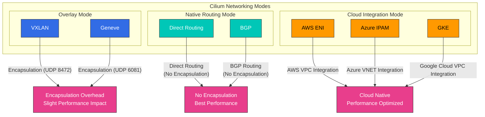
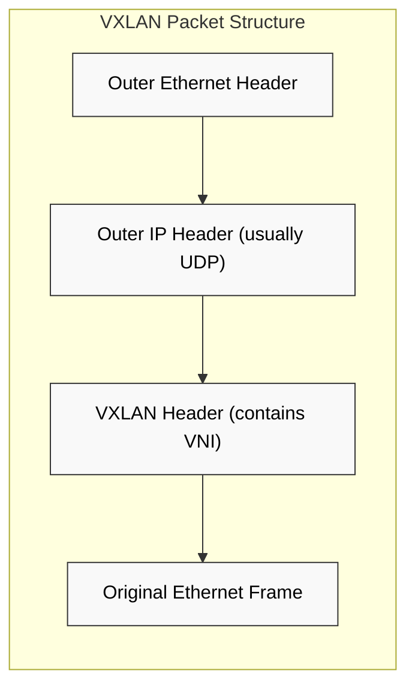
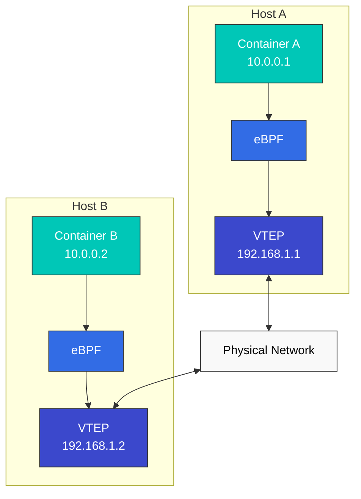

# 网络模型与 VXLAN

> **支持版本**: Cilium 1.18
> **最后更新**: February 22, 2026

## 实验环境设置

要跟随本文档中的示例操作，您需要以下工具和环境：

### 必需工具
- kubectl v1.31 或更高版本
- 可用的 Kubernetes 集群（EKS、minikube、kind 等）
- Cilium CLI
- tcpdump、wireshark（用于网络数据包分析）

### 网络分析工具安装

```bash
# Install tcpdump
sudo apt-get update
sudo apt-get install -y tcpdump

# Cilium network packet capture
kubectl exec -n kube-system -it $(kubectl get pods -n kube-system -l k8s-app=cilium -o jsonpath='{.items[0].metadata.name}') -- cilium monitor -v

# VXLAN traffic analysis
sudo tcpdump -i any udp port 8472 -vv
```

## 容器网络模型比较

容器网络模型定义了容器之间如何通信。每种模型在性能、可扩展性、安全性和实现复杂度方面各有优缺点。

### 主要网络模型：

1. **Host 网络模型**：
   - 容器共享 Host 的网络命名空间
   - 性能最佳，但可能发生端口冲突
   - 安全隔离有限

2. **Bridge 网络模型**：
   - 容器通过 Host 内的虚拟网桥连接
   - 对同一 Host 上容器之间的通信高效
   - Host 间通信需要额外机制

3. **Overlay 网络模型**：
   - 在物理网络之上构建虚拟网络
   - 使用封装实现 Host 间通信
   - 灵活但会带来轻微的性能开销

4. **Underlay 网络模型**：
   - 直接利用物理网络基础设施
   - 以最小开销实现最佳性能
   - 依赖物理网络配置

### 网络模型比较：

| 模型 | 性能 | 可扩展性 | 安全性 | 实现复杂度 | 使用场景 |
|-------|-------------|-------------|----------|---------------------------|-----------|
| Host | 非常高 | 低 | 低 | 低 | 高性能工作负载、单容器 |
| Bridge | 高 | 中 | 中 | 中 | 单 Host 部署 |
| Overlay | 中 | 高 | 高 | 高 | 多 Host 集群 |
| Underlay | 高 | 中 | 中 | 非常高 | 注重性能的生产环境 |

### Cilium 网络模式



## VXLAN 技术深入解析

> **关键概念**：VXLAN（Virtual Extensible LAN）是一种网络虚拟化技术，可在 Layer 3 网络之上覆盖 Layer 2 网络。

VXLAN 是一种网络虚拟化技术，可在 Layer 3 网络之上覆盖 Layer 2 网络。它广泛用于云环境，以扩展网络分段的数量并支持多租户环境。

### VXLAN 基本概念：

- **VXLAN Segment**：由 VXLAN Network Identifier（VNI）标识的逻辑 L2 分段
- **VXLAN Tunnel Endpoint（VTEP）**：负责 VXLAN 数据包的封装和解封装
- **VNI（VXLAN Network Identifier）**：最多支持 16,777,216（2^24）个唯一网络分段
- **Encapsulation**：将原始 L2 帧封装到 UDP 数据包中

### VXLAN 数据包结构：

```
+-------------------------------+
| Outer Ethernet Header         |
+-------------------------------+
| Outer IP Header (usually IPv4)|
+-------------------------------+
| Outer UDP Header (port 8472)  |
+-------------------------------+
| VXLAN Header (contains VNI)   |
+-------------------------------+
| Original Ethernet Frame       |
| (Inner Ethernet Header +      |
|  Payload)                     |
+-------------------------------+
```

### Cilium VXLAN 配置示例

```yaml
apiVersion: v1
kind: ConfigMap
metadata:
  name: cilium-config
  namespace: kube-system
data:
  tunnel: "vxlan"
  enable-ipv4: "true"
  enable-ipv6: "false"
  ipv4-range: "10.0.0.0/16"
  ipv4-service-range: "10.96.0.0/12"
```

此配置指示 Cilium 使用 VXLAN 隧道为集群内的 Pod 间通信建立网络。每个节点都充当 VTEP，并将 Pod 流量封装为 VXLAN 数据包后传输到其他节点。



### VXLAN 的工作原理：

1. **封装**：源 VTEP 使用 VXLAN Header 封装原始 L2 帧
2. **传输**：封装后的数据包通过 IP 网络发送到目标 VTEP
3. **解封装**：目标 VTEP 移除 VXLAN Header 并提取原始 L2 帧
4. **交付**：将原始 L2 帧交付给目标端点

### VXLAN 与其他 Overlay 技术的比较：

| 技术 | 封装 | 最大网络数 | 端口 | 优点 | 缺点 |
|------------|---------------|--------------|------|------------|---------------|
| VXLAN | L2 over UDP | 16,777,216 (2^24) | 4789 | 广泛支持、大规模可扩展性 | 开销（50 字节） |
| GENEVE | 可变长度 Header | 16,777,216 (2^24) | 6081 | 可扩展元数据 | 较新，支持有限 |
| GRE | IP over IP | 无限制 | IP Protocol 47 | 开销低 | 防火墙穿越问题 |
| NVGRE | L2 over GRE | 16,777,216 (2^24) | IP Protocol 47 | Microsoft 环境集成 | 硬件卸载支持有限 |

## Cilium 的 Overlay 网络

Cilium 默认使用 VXLAN 实现 Overlay 网络，但也支持 Geneve 等其他封装协议。Cilium 的 Overlay 网络利用 eBPF 提供优化的数据路径。

### Cilium Overlay 网络架构：



### Cilium Overlay 网络的工作原理：

1. **数据包生成**：Container A 向 Container B 发送数据包
2. **eBPF 处理**：eBPF 程序拦截数据包并应用策略
3. **VTEP 识别**：识别目标容器的 VTEP
4. **封装**：使用 VXLAN Header 封装数据包
5. **传输**：通过物理网络将封装后的数据包发送到目标 Host
6. **解封装**：在目标 Host 移除 VXLAN Header
7. **eBPF 处理**：目标 Host 上的 eBPF 程序处理数据包
8. **交付**：将数据包交付给目标容器

### Cilium Overlay 网络优化：

- **Direct Path**：在可能时使用直接路由
- **DSR（Direct Server Return）**：用于负载均衡响应的优化
- **Connection Tracking Bypass**：对已知连接绕过连接跟踪
- **XDP 集成**：利用 XDP 进行早期数据包处理
- **Header Push/Pop Optimization**：高效处理 Header

### Cilium Overlay 网络配置：

```yaml
# cilium-config.yaml
apiVersion: v1
kind: ConfigMap
metadata:
  name: cilium-config
  namespace: kube-system
data:
  # Enable overlay mode
  tunnel: "vxlan"

  # VXLAN port setting (default: 8472)
  tunnel-port: "8472"

  # MTU setting
  mtu: "1450"

  # Auto direct node routes
  auto-direct-node-routes: "true"
```

## 性能优化技术

Cilium 提供了多种性能优化技术，以最大限度地降低网络延迟并提高吞吐量。

### 网络模式优化：

1. **Direct Routing 模式**：
   - 使用无需 Overlay 封装的直接路由
   - 通过消除封装开销提升性能
   - 要求 Host 之间存在可路由网络

2. **Hybrid 模式**：
   - 在可能时使用直接路由，否则使用 Overlay
   - 在灵活性与性能之间取得平衡

3. **Native Routing 模式**：
   - 与现有网络基础设施集成
   - 利用 BGP 等路由协议

### 数据路径优化：

1. **XDP 利用**：
   - 在网络栈的早期阶段处理数据包
   - 通过尽早丢弃不必要的数据包提升性能

2. **eBPF Map 优化**：
   - 高效的 Map 结构和大小调整
   - 使用 LRU（Least Recently Used）Map 优化内存使用

3. **Connection Tracking 优化**：
   - 调整连接跟踪表大小
   - 为已知连接绕过连接跟踪

4. **基于 Socket 的负载均衡**：
   - 在 Socket 层进行负载均衡
   - 降低数据包处理开销

### 系统级优化：

1. **CPU Affinity**：
   - 将网络处理绑定到特定 CPU 核心
   - 提高缓存局部性并减少上下文切换

2. **NUMA 感知**：
   - 感知 NUMA（Non-Uniform Memory Access）拓扑
   - 优化本地内存访问

3. **中断调优**：
   - 优化网络中断处理
   - 中断合并与分配

4. **Huge Pages**：
   - 减少内存管理开销
   - 减少 TLB（Translation Lookaside Buffer）未命中

## 路由机制

Cilium 支持两种主要路由机制：Encapsulation 和 Native-Routing。

### 1. Encapsulation

Encapsulation 是一种通过将原始数据包封装在另一个数据包中进行传输的方法。Cilium 支持 VXLAN 和 Geneve 等封装协议。

**工作原理**：
1. 在源节点生成数据包。
2. Cilium 使用封装 Header 包装原始数据包，从而对数据包进行封装。
3. 封装后的数据包通过物理网络发送到目标节点。
4. 在目标节点，Cilium 对数据包进行解封装以提取原始数据包。
5. 提取出的数据包被交付给目标容器。

**优点**：
- 与现有网络基础设施兼容
- 独立于网络拓扑
- 防止多集群环境中的 IP 冲突

**缺点**：
- 封装开销导致性能受影响
- MTU 大小减小
- 额外的 CPU 使用量

### 2. Native-Routing

Native routing 是一种无需封装的直接路由方法。在此模式下，底层网络基础设施必须能够路由 Pod IP 地址。

**工作原理**：
1. 每个节点通告在该节点上运行的 Pod 的 CIDR 块。
2. 配置路由表，将每个 Pod CIDR 块路由到相应节点。
3. 数据包无需封装，直接路由到目标节点。

**优点**：
- 无封装开销
- 网络性能提升
- 更低的 CPU 使用量

**缺点**：
- 依赖底层网络基础设施
- 网络拓扑限制
- IP 地址管理复杂性

## Cloud Provider 特定网络

Cilium 与各种 Cloud Provider 的网络功能集成。

### 1. AWS ENI（Elastic Network Interface）

在 AWS ENI 模式下，Cilium 使用 AWS Elastic Network Interfaces 向 Pod 分配原生 VPC IP 地址。

**主要功能**：
- 向 Pod 分配原生 VPC IP 地址
- 无需 Overlay 网络的 VPC 原生网络
- AWS security group 和 network policy 集成
- 改进网络性能

### 2. Google Cloud 网络

在 Google Kubernetes Engine（GKE）中，Cilium 与 Google Cloud 网络功能集成。

**主要功能**：
- GCP VPC 原生 IP 地址分配
- GCP firewall rules 集成
- GKE 网络优化

## 实验：Cilium 网络模式配置与性能测试

### 各种网络模式配置：

```bash
# VXLAN overlay mode configuration
cilium install --config tunnel=vxlan

# Geneve overlay mode configuration
cilium install --config tunnel=geneve

# Direct routing mode configuration
cilium install --config tunnel=disabled --config auto-direct-node-routes=true

# Hybrid mode configuration
cilium install --config tunnel=vxlan --config auto-direct-node-routes=true
```

### 网络性能测试：

```bash
# Deploy test pods
kubectl apply -f https://raw.githubusercontent.com/cilium/cilium/master/examples/kubernetes/connectivity-check/connectivity-check.yaml

# Latency test
kubectl exec -it pod/netperf-client -- netperf -H netperf-server -t TCP_RR

# Throughput test
kubectl exec -it pod/netperf-client -- netperf -H netperf-server -t TCP_STREAM

# Connection establishment speed test
kubectl exec -it pod/netperf-client -- netperf -H netperf-server -t TCP_CRR
```

[返回主页](README.md)

## 测验

要测试您在本章学到的内容，请尝试[主题测验](../../quizzes/networking/cilium/03-networking-quiz.md)。
