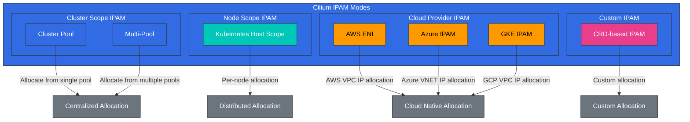

# IPAM 与网络策略

> **支持的版本**: Cilium 1.18
> **最后更新**: February 23, 2026

## 实验环境设置

要跟随本文档中的示例操作，您需要以下工具和环境：

### 必需工具
- kubectl v1.31 或更高版本
- 一个可用的 Kubernetes 集群（EKS、minikube、kind 等）
- Cilium CLI

### IPAM 和 Network Policy 实验设置

```bash
# Check Cilium status
cilium status --wait

# Check current IPAM configuration
kubectl -n kube-system get configmap cilium-config -o yaml | grep -E 'ipam|allocator'

# Create namespace for network policy testing
kubectl create namespace policy-test

# Deploy test application
kubectl -n policy-test apply -f https://raw.githubusercontent.com/cilium/cilium/v1.14/examples/minikube/http-sw-app.yaml
```

## IP 地址管理（IPAM）策略

> **关键概念**：IPAM（IP Address Management）是负责分配、跟踪和管理 IP 地址的系统。

IPAM 是负责分配、跟踪和管理 IP 地址的系统。Cilium 支持多种 IPAM 模式，可灵活配置以匹配不同的环境和需求。

### Cilium IPAM 架构



### Cilium IPAM 模式：

1. **Cluster Pool**：
   - 默认 IPAM 模式
   - 在整个集群中集中分配 IP 地址
   - 可配置单个或多个 IP Pool
   - 简单易用

2. **Kubernetes Host Scope**：
   - 为每个节点分配 IP 地址范围
   - 节点从自身范围中分配 IP 地址
   - 无需集中协调
   - 防止节点之间发生 IP 冲突

3. **基于 CRD 的 IPAM**：
   - 通过 CiliumIPPool 自定义资源定义 IP Pool
   - 将 IP Pool 分配给特定 namespace 或 Pod
   - 细粒度的 IP 地址管理
   - 动态 IP Pool 管理

4. **AWS ENI（Elastic Network Interface）**：
   - AWS VPC ENI 集成
   - 为 Pod 分配原生 VPC IP 地址
   - 无 Overlay Network 的 VPC 原生网络
   - 针对 AWS 环境优化

5. **Azure IPAM**：
   - Azure VNET 集成
   - 为 Pod 分配原生 VNET IP 地址
   - 针对 Azure 环境优化

### IPAM 组件：

- **IP Pool**：可供分配的 IP 地址范围
- **IP Allocation**：将 IP 地址分配给 Endpoint
- **IP Release**：回收未使用的 IP 地址
- **IP Conflict Detection**：防止 IP 地址冲突
- **IP Reservation**：为特定用途预留 IP 地址

### IPAM 注意事项：

- **Address Space Size**：所需 IP 地址数量
- **Network Segmentation**：子网和 CIDR 块设计
- **Scalability**：考虑未来增长

### IPAM 配置示例

Cluster Pool IPAM 配置：
```yaml
apiVersion: v1
kind: ConfigMap
metadata:
  name: cilium-config
  namespace: kube-system
data:
  ipam: "cluster-pool"
  cluster-pool-ipv4-cidr: "10.0.0.0/16"
  cluster-pool-ipv4-mask-size: "24"
  enable-ipv4: "true"
  enable-ipv6: "false"
```

AWS ENI IPAM 配置：
```yaml
apiVersion: v1
kind: ConfigMap
metadata:
  name: cilium-config
  namespace: kube-system
data:
  ipam: "eni"
  enable-ipv4: "true"
  enable-ipv6: "false"
  eni-tags: "{\"cluster\": \"eks-cluster\"}"
  ec2-api-endpoint: "ec2.us-west-2.amazonaws.com"
```
- **Cloud Integration**：与云提供商网络集成
- **IPv4 vs IPv6**：单栈或双栈配置

## Kubernetes 和 Cilium IPAM 集成

Cilium 与 Kubernetes 紧密集成，以便为 Pod 和 Service 分配及管理 IP 地址。

### Kubernetes IPAM 集成流程：

1. **Pod 创建**：Kubernetes 请求创建 Pod
2. **CNI 调用**：kubelet 调用 Cilium CNI 插件
3. **IP Allocation 请求**：Cilium 向 IPAM 模块请求 IP 地址
4. **IP Allocation**：IPAM 分配可用的 IP 地址
5. **网络设置**：Cilium 配置 Pod 的网络 namespace
6. **状态存储**：存储 IP 分配信息
7. **Pod 启动**：Pod 使用已配置的网络启动

### Cilium Cluster Pool 配置：

```yaml
# cilium-config.yaml
apiVersion: v1
kind: ConfigMap
metadata:
  name: cilium-config
  namespace: kube-system
data:
  # Cluster pool IPAM mode
  ipam: "cluster-pool"

  # IPv4 CIDR range
  cluster-pool-ipv4-cidr: "10.0.0.0/8"
  cluster-pool-ipv4-mask-size: "24"

  # IPv6 CIDR range (optional)
  cluster-pool-ipv6-cidr: "fd00::/104"
  cluster-pool-ipv6-mask-size: "120"

  # Enable dual stack
  enable-ipv4: "true"
  enable-ipv6: "true"
```

### 基于 CRD 的 IPAM 示例：

```yaml
# cilium-ippool.yaml
apiVersion: "cilium.io/v2alpha1"
kind: CiliumIPPool
metadata:
  name: "production-pool"
spec:
  ipv4:
    cidr: "10.10.0.0/16"
    blockSize: 27  # 32 IP address blocks
  selector:
    matchLabels:
      environment: production
```

### AWS ENI IPAM 配置：

```yaml
# cilium-aws-config.yaml
apiVersion: v1
kind: ConfigMap
metadata:
  name: cilium-config
  namespace: kube-system
data:
  # AWS ENI IPAM mode
  ipam: "eni"

  # AWS ENI configuration
  enable-endpoint-routes: "true"
  auto-create-cilium-node-resource: "true"

  # ENI tags (optional)
  eni-tags: "{\"team\": \"platform\"}"

  # Prefix delegation (optional)
  enable-prefix-delegation: "true"
  eni-prefix-delegation-enabled: "true"
```

## IPAM 模式详解

### 1. Cluster Scope - 默认模式

Cluster Scope IPAM 是 Cilium 的默认 IPAM 模式，可在整个集群中集中分配 IP 地址。

**主要特性**：
- 集中式 IP 地址分配
- 保证整个集群中的 IP 地址唯一性
- 可配置单个或多个 IP Pool
- 简单易用

**工作原理**：
1. Cilium agent 从集群范围的 IP Pool 中分配 IP 地址。
2. 已分配的 IP 地址存储在 Kubernetes CRD 中。
3. IP 地址分配信息在集群中的所有节点之间共享。

### 2. Kubernetes Host Scope

Kubernetes Host Scope IPAM 为每个节点分配 IP 地址范围，节点从自身范围中分配 IP 地址。

**主要特性**：
- 按节点分配 IP 地址范围
- 无需集中协调
- 防止节点之间发生 IP 冲突
- 可扩展性更强

**工作原理**：
1. Kubernetes 为每个节点分配一个 PodCIDR。
2. Cilium 从节点的 PodCIDR 中分配 IP 地址。
3. 每个节点独立管理自己的 IP 地址范围。

### 3. Multi-Pool - Beta

Multi-Pool IPAM 支持定义多个 IP Pool，并将特定 Pool 分配给特定工作负载。

**主要特性**：
- 定义和管理多个 IP Pool
- 按 namespace、Pod 或节点分配 IP Pool
- 细粒度的 IP 地址管理
- 支持多种网络需求

**工作原理**：
1. 使用 CiliumIPPool CRD 定义多个 IP Pool。
2. 使用 Selector 将特定 Pool 分配给特定工作负载。
3. Cilium 根据定义的规则从适当的 Pool 中分配 IP 地址。

### 4. Azure IPAM

Azure IPAM 与 Azure VNET 集成，为 Pod 分配原生 VNET IP 地址。

**主要特性**：
- Azure VNET 原生 IP 地址分配
- Azure Network Security Group 集成
- Azure 网络优化

### 5. Azure Delegated IPAM

Azure Delegated IPAM 是一种将 IP 地址管理委派给 Azure CNI 的模式。

**主要特性**：
- 与 Azure CNI 集成
- Azure 管理的 IP 地址分配
- 利用 Azure 网络功能

### 6. 基于 CRD 的 IPAM

基于 CRD 的 IPAM 使用 Kubernetes CRD 管理 IP 地址分配。

**主要特性**：
- 通过 Kubernetes CRD 管理 IP 地址
- 声明式 IP 地址分配
- 与 Kubernetes 原生工作流集成

**工作原理**：
1. IP 地址 Pool 信息存储在 CiliumNode CRD 中。
2. Cilium agent 从 CRD 读取 IP 地址分配信息。
3. IP 地址分配状态在 CRD 中更新。

## 通过 CiliumNode CR 查询每个节点的 PodCIDR

在 Cilium 的 `cluster-pool` IPAM 模式中，每个节点的 Pod CIDR 分配信息记录在 **CiliumNode CR** 中。此 CR 是配置静态路由、调试 IPAM 和排查网络故障的权威信息源。

> **注意**：Kubernetes Node 对象的 `spec.podCIDR` 可能与 CiliumNode CR 的 `spec.ipam.podCIDRs` 不同。在 Cilium 环境中，始终应将 CiliumNode CR 作为事实来源。

### CiliumNode CR 结构（关键字段）

```yaml
apiVersion: cilium.io/v2
kind: CiliumNode
metadata:
  name: hybrid-node-001
spec:
  addresses:
  - ip: 10.80.1.10        # Node IP (used as next hop for static routes)
    type: InternalIP
  ipam:
    podCIDRs:
    - 10.85.0.0/25         # Pod CIDR allocated to this node
```

- **`spec.addresses[].ip`**：节点的实际 IP 地址。配置静态路由时用作下一跳。
- **`spec.ipam.podCIDRs`**：Cilium Operator 为该节点分配的 Pod CIDR 列表。

### 查询命令

```bash
# List all CiliumNodes
kubectl get ciliumnodes

# Query node IP and PodCIDR in table format
kubectl get ciliumnodes -o custom-columns='\
NAME:.metadata.name,\
NODE_IP:.spec.addresses[0].ip,\
POD_CIDR:.spec.ipam.podCIDRs[0]'
```

示例输出：

```
NAME                NODE_IP       POD_CIDR
hybrid-node-001     10.80.1.10    10.85.0.0/25
hybrid-node-002     10.80.1.11    10.85.0.128/25
hybrid-node-003     10.80.1.12    10.85.1.0/25
```

### 脚本使用

```bash
# Extract routing table information using jq
kubectl get ciliumnodes -o json | jq -r \
  '.items[] | "\(.metadata.name)\t\(.spec.addresses[0].ip)\t\(.spec.ipam.podCIDRs[0])"'

# Auto-generate static route commands (useful for EKS Hybrid Nodes, etc.)
kubectl get ciliumnodes -o json | jq -r \
  '.items[] | "ip route add \(.spec.ipam.podCIDRs[0]) via \(.spec.addresses[0].ip)"'
```

> **使用场景**：此信息用于在 EKS Hybrid Nodes 环境中配置无需 BGP 的静态路由。详情请参阅 [EKS Hybrid Nodes - 网络配置](../../eks-hybrid-nodes/02-network-configuration.md)。

## Network Policy 设计与实现

Cilium Network Policy 提供了强大的机制，可在 L3-L7 层控制微服务之间的通信。这些 Policy 扩展了 Kubernetes NetworkPolicy API，可提供更细粒度的控制。

### Network Policy 基本概念：

- **Endpoint Selector**：定义 Policy 所适用的 Endpoint
- **Ingress Rules**：控制入站流量
- **Egress Rules**：控制出站流量
- **L3/L4 Policy**：基于 IP 地址和端口的过滤
- **L7 Policy**：感知应用层协议的过滤

### L3/L4 Network Policy 示例：

```yaml
# l3-l4-policy.yaml
apiVersion: "cilium.io/v2"
kind: CiliumNetworkPolicy
metadata:
  name: "l3-l4-policy"
spec:
  endpointSelector:
    matchLabels:
      app: backend
  ingress:
  - fromEndpoints:
    - matchLabels:
        app: frontend
    toPorts:
    - ports:
      - port: "8080"
        protocol: TCP
  egress:
  - toEndpoints:
    - matchLabels:
        app: database
    toPorts:
    - ports:
      - port: "3306"
        protocol: TCP
```

### L7 HTTP Policy 示例：

```yaml
# l7-http-policy.yaml
apiVersion: "cilium.io/v2"
kind: CiliumNetworkPolicy
metadata:
  name: "l7-http-policy"
spec:
  endpointSelector:
    matchLabels:
      app: backend
  ingress:
  - fromEndpoints:
    - matchLabels:
        app: frontend
    toPorts:
    - ports:
      - port: "8080"
        protocol: TCP
      rules:
        http:
        - method: "GET"
          path: "/api/v1/users"
        - method: "POST"
          path: "/api/v1/users"
          headers:
          - "Content-Type: application/json"
```

### L7 Kafka Policy 示例：

```yaml
# l7-kafka-policy.yaml
apiVersion: "cilium.io/v2"
kind: CiliumNetworkPolicy
metadata:
  name: "l7-kafka-policy"
spec:
  endpointSelector:
    matchLabels:
      app: kafka-broker
  ingress:
  - fromEndpoints:
    - matchLabels:
        app: kafka-client
    toPorts:
    - ports:
      - port: "9092"
        protocol: TCP
      rules:
        kafka:
        - apiKey: "Produce"
          topic: "allowed-topic-1"
        - apiKey: "Fetch"
          topic: "allowed-topic-1"
        - apiKey: "CreateTopics"
          topic: "allowed-topic-.*"
          apiVersions: ["0", "1"]
```

### 基于 DNS 的 Policy 示例：

```yaml
# dns-policy.yaml
apiVersion: "cilium.io/v2"
kind: CiliumNetworkPolicy
metadata:
  name: "dns-policy"
spec:
  endpointSelector:
    matchLabels:
      app: client
  egress:
  - toEndpoints:
    - matchLabels:
        "k8s:io.kubernetes.pod.namespace": kube-system
        "k8s:k8s-app": kube-dns
    toPorts:
    - ports:
      - port: "53"
        protocol: UDP
      - port: "53"
        protocol: TCP
  - toFQDNs:
    - matchName: "api.example.com"
    - matchPattern: "*.googleapis.com"
    toPorts:
    - ports:
      - port: "443"
        protocol: TCP
```

### Network Policy 最佳实践：

1. **应用 Default Deny Policy**：
   - 阻止所有未被明确允许的流量
   - 应用最小权限原则

2. **渐进式方法**：
   - 从观察模式开始以评估影响
   - 逐步应用并强化 Policy

3. **使用基于 Label 的 Selector**：
   - 使用基于 Label 的 Selector，而不是 IP 地址
   - 在动态环境中提供灵活性

4. **Policy 分层**：
   - 组合基础 Policy 和特定 Policy
   - 实现关注点分离和可维护性

5. **Policy 测试和验证**：
   - 在应用 Policy 前进行测试
   - 持续进行 Policy 验证和监控

## 多集群场景

Cilium 为多个 Kubernetes 集群之间的网络和安全提供了强大功能。这支持跨集群 Service 通信、Network Policy 强制执行和负载均衡。

### 多集群连接模型：

1. **Global Services**：
   - 在多个集群中公开 Service
   - 跨集群负载均衡
   - 自动故障转移和高可用性

2. **Cluster Mesh**：
   - 集群之间直接连接
   - 跨集群 Network Policy
   - 统一可观测性

3. **Remote Nodes**：
   - 将远程集群中的节点显示为本地节点
   - 集群之间透明通信
   - 单一网络 namespace 模拟

### Cilium Cluster Mesh 架构：

```
+-------------------+        +-------------------+
| Cluster A         |        | Cluster B         |
|                   |        |                   |
| +---------------+ |        | +---------------+ |
| | Service A     | |        | | Service B     | |
| | (Global)      | |        | | (Global)      | |
| +-------+-------+ |        | +-------+-------+ |
|         |         |        |         |         |
|     +---v---+     |        |     +---v---+     |
|     | eBPF  |     |        |     | eBPF  |     |
|     +---+---+     |        |     +---+---+     |
|         |         |        |         |         |
| +-------v-------+ |        | +-------v-------+ |
| | Cilium        | |<------>| | Cilium        | |
| | Clustermesh   | |        | | Clustermesh   | |
| +---------------+ |        | +---------------+ |
|                   |        |                   |
+-------------------+        +-------------------+
```

### Cilium Cluster Mesh 设置：

```bash
# Enable Cluster Mesh on Cluster A
cilium clustermesh enable --context cluster-a

# Enable Cluster Mesh on Cluster B
cilium clustermesh enable --context cluster-b

# Connect clusters
cilium clustermesh connect --context cluster-a --destination-context cluster-b

# Check status
cilium clustermesh status --context cluster-a
```

### Global Service 定义：

```yaml
# global-service.yaml
apiVersion: v1
kind: Service
metadata:
  name: global-service
  annotations:
    io.cilium/global-service: "true"
spec:
  selector:
    app: global-app
  ports:
  - port: 80
    targetPort: 8080
  type: ClusterIP
```

### 跨集群 Network Policy：

```yaml
# cross-cluster-policy.yaml
apiVersion: "cilium.io/v2"
kind: CiliumNetworkPolicy
metadata:
  name: "cross-cluster-policy"
spec:
  endpointSelector:
    matchLabels:
      app: backend
  ingress:
  - fromEndpoints:
    - matchLabels:
        app: frontend
        io.kubernetes.pod.namespace: frontend-ns
        io.cilium.k8s.policy.cluster: cluster-a
    toPorts:
    - ports:
      - port: "8080"
        protocol: TCP
```

[返回主页](README.md)

## 测验

为测试您在本章所学的内容，请尝试 [主题测验](../../quizzes/networking/cilium/04-ipam-policy-quiz.md)。
