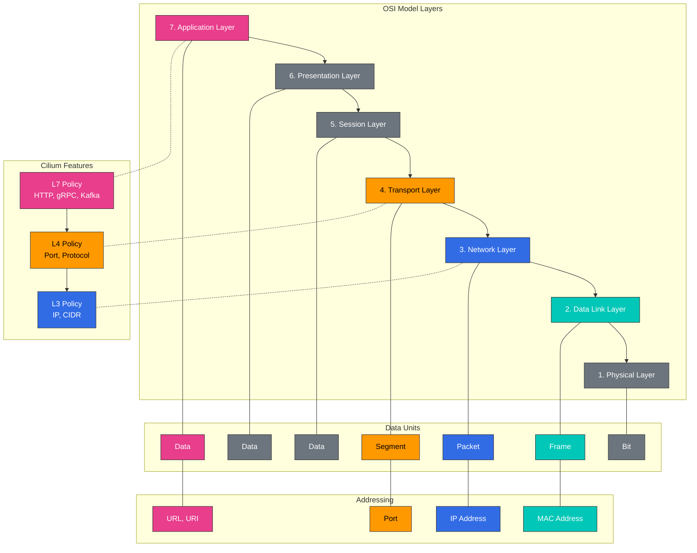

# L2-L7 网络与负载均衡

> **支持的版本**: Cilium 1.18
> **最后更新**: February 22, 2026

## 实验环境设置

要跟随本文档中的示例操作，您需要以下工具和环境：

### 必需工具
- kubectl v1.31 或更高版本
- 可用的 Kubernetes 集群（EKS、minikube、kind 等）
- Cilium CLI
- curl、jq（用于 API 测试）

### L7 Policy 测试环境设置

```bash
# Create test namespace
kubectl create namespace l7-test

# Deploy sample application
kubectl -n l7-test apply -f https://raw.githubusercontent.com/cilium/cilium/v1.14/examples/kubernetes/l7-policy/l7-application.yaml

# Verify deployment
kubectl -n l7-test get pods,svc

# Deploy test client
kubectl -n l7-test run client --image=curlimages/curl --restart=Never -- sleep 3600

# Basic connectivity test
kubectl -n l7-test exec client -- curl -s app1-service/public
```

## 理解 OSI 模型层（L2、L3、L4、L7）

> **关键概念**：OSI（开放系统互连，Open Systems Interconnection）模型是一种将网络通信划分为 7 个抽象层的概念模型。

OSI 模型是一种将网络通信划分为 7 个抽象层的概念模型。Cilium 在这些不同层级提供网络和安全功能。

### OSI 模型层图



### OSI 模型层：

1. **物理层（L1）**：
   - 用于比特传输的物理介质
   - 定义电气、机械和功能特性
   - 示例：线缆、交换机、中继器

2. **数据链路层（L2）**：
   - 物理寻址（MAC 地址）
   - 帧格式和流量控制
   - 示例：Ethernet、交换机、网桥

3. **网络层（L3）**：
   - 逻辑寻址（IP 地址）
   - 数据包路由和转发
   - 示例：IP、路由器、ICMP

4. **传输层（L4）**：
   - 端到端连接和可靠性
   - 基于 Port 的寻址
   - 示例：TCP、UDP、Port

5. **会话层（L5）**：
   - 会话建立、管理和终止
   - 对话控制和同步
   - 示例：NetBIOS、RPC

6. **表示层（L6）**：
   - 数据格式转换和加密
   - 数据压缩和编码
   - 示例：SSL/TLS、JPEG、ASCII

7. **应用层（L7）**：
   - 用户界面和应用服务
   - 协议和 API
   - 示例：HTTP、DNS、FTP、gRPC

### 各层的关键特性：

| 层 | 寻址 | 单位 | 设备/协议 | Cilium 功能 |
|-------|------------|------|-----------------|----------------|
| L2 | MAC 地址 | 帧 | 交换机、网桥 | ARP 处理、MAC 过滤 |
| L3 | IP 地址 | 数据包 | 路由器、IP | IP 路由、基于 CIDR 的 Policy |
| L4 | Port | 段 | TCP、UDP | 基于 Port 的过滤、连接跟踪 |
| L7 | URL、Method | 消息 | HTTP、gRPC、Kafka | API 感知过滤、基于 Header 的路由 |

### L7 Policy 示例

以下是一个根据 HTTP Method 和路径过滤流量的 Cilium L7 Policy 示例：

```yaml
apiVersion: cilium.io/v2
kind: CiliumNetworkPolicy
metadata:
  name: l7-policy
  namespace: l7-test
spec:
  endpointSelector:
    matchLabels:
      app: app1
  ingress:
  - fromEndpoints:
    - matchLabels:
        app: client
    toPorts:
    - ports:
      - port: "80"
        protocol: TCP
      rules:
        http:
        - method: "GET"
          path: "/public"
        - method: "POST"
          path: "/api/v1"
          headers:
          - "X-Auth-Token: ^[a-zA-Z0-9]{32}$"
```

此 Policy 允许：
1. 对 `/public` 路径的 GET 请求
2. 对 `/api/v1` 路径的 POST 请求（带有有效的 X-Auth-Token Header）

所有其他请求均会被阻止。
| L7 | URI、Method | 消息 | HTTP、gRPC、Kafka | API 感知过滤、Header 检查 |

## Cilium 的分层功能

Cilium 在从 L2 到 L7 的各个网络层提供功能，以交付全面的网络和安全解决方案。

### L2（数据链路层）功能：

- **ARP 处理**：Address Resolution Protocol 处理
- **MAC 地址过滤**：基于 MAC 地址的过滤
- **VLAN 标记**：Virtual LAN 标签处理
- **Bridge Mode**：支持 L2 Bridge Mode
- **混杂模式**：捕获所有流量

### L3（网络层）功能：

- **IP 路由**：IP 数据包路由
- **基于 CIDR 的 Policy**：基于 IP 地址范围的过滤
- **IP 分片**：IP 数据包分片处理
- **ICMP 处理**：ICMP 消息处理
- **多播**：支持 IP 多播

### L4（传输层）功能：

- **基于 Port 的过滤**：基于 TCP/UDP Port 的过滤
- **连接跟踪**：连接状态跟踪
- **TCP Option 处理**：TCP Option 和标志处理
- **基于 Socket 的负载均衡**：Socket 级负载均衡
- **会话亲和性**：维持持久会话

### L7（应用层）功能：

- **HTTP 过滤**：基于 HTTP Method、路径和 Header 的过滤
- **gRPC 过滤**：基于 gRPC Method 和元数据的过滤
- **Kafka 过滤**：基于 Kafka Topic 和操作的过滤
- **DNS 过滤**：基于 DNS 查询和响应的过滤
- **TLS 检查**：基于 TLS 证书和 SNI 的过滤

### 跨层集成：

Cilium 跨不同层集成功能，以提供全面的网络和安全解决方案：

- **L3/L4 + L7 Policy**：结合基于 IP/Port 的过滤和应用层过滤
- **多协议支持**：支持 HTTP、gRPC、Kafka 等多种协议
- **分层 Policy 强制执行**：在不同层应用 Policy
- **统一可观测性**：跨所有层的流量监控和可见性

## Service Mesh 集成

Cilium 与 Istio 等 Service Mesh 集成，为微服务架构提供强大的网络、安全和可观测性解决方案。

### Cilium-Istio 集成架构：

```
+-------------------+
| Service Mesh      |
| Control Plane     |
| (Istio Pilot)     |
+--------+----------+
         |
         v
+-------------------+
| Envoy Proxy       |
| (Sidecar)         |
+--------+----------+
         |
         v
+-------------------+
| Cilium eBPF       |
| (Data Plane)      |
+-------------------+
```

### Cilium-Istio 集成优势：

1. **性能提升**：
   - 通过绕过 Envoy Sidecar 降低延迟
   - 基于 eBPF 的优化数据路径

2. **增强的安全性**：
   - Kernel 级 Policy 强制执行
   - L3-L7 安全 Policy 集成

3. **改进的可观测性**：
   - 统一监控和追踪
   - 网络流可见性

4. **运维简化**：
   - 一致的网络和安全模型
   - 消除冗余功能

### Cilium-Istio 设置：

```bash
# Cilium installation (with Istio integration enabled)
cilium install --config enable-envoy-config=true --config enable-l7-proxy=true

# Istio installation
istioctl install --set profile=default

# Enable Istio sidecar auto-injection
kubectl label namespace default istio-injection=enabled

# Verify Cilium-Istio integration
cilium status --verbose
```

### 结合 Istio Virtual Service 与 Cilium Policy：

```yaml
# istio-virtual-service.yaml
apiVersion: networking.istio.io/v1alpha3
kind: VirtualService
metadata:
  name: reviews-route
spec:
  hosts:
  - reviews
  http:
  - match:
    - headers:
        end-user:
          exact: jason
    route:
    - destination:
        host: reviews
        subset: v2
  - route:
    - destination:
        host: reviews
        subset: v1
---
# cilium-l7-policy.yaml
apiVersion: "cilium.io/v2"
kind: CiliumNetworkPolicy
metadata:
  name: "reviews-policy"
spec:
  endpointSelector:
    matchLabels:
      app: reviews
  ingress:
  - fromEndpoints:
    - matchLabels:
        app: productpage
    toPorts:
    - ports:
      - port: "9080"
        protocol: TCP
      rules:
        http:
        - method: "GET"
          path: "/reviews/.*"
```

## 负载均衡架构

Cilium 利用 eBPF 提供高效且可扩展的负载均衡解决方案。它可作为 Kubernetes Service 的 kube-proxy 替代方案运行。

### Cilium 负载均衡模式：

1. **DSR（Direct Server Return）模式**：
   - 响应流量绕过负载均衡器，直接发送到客户端
   - 消除负载均衡器瓶颈
   - 针对处理大型响应进行了优化

2. **SNAT（Source Network Address Translation）模式**：
   - 将源 IP 地址转换为负载均衡器的 IP
   - 在无需保留客户端 IP 时很有用
   - 行为类似于现有的 kube-proxy

3. **混合模式**：
   - 根据情况使用 DSR 或 SNAT 模式
   - 在灵活性和性能之间取得平衡

### Cilium 负载均衡组件：

- **Service Map**：从 Service IP:Port 到后端 Pod 的映射
- **Backend Map**：存储后端 Pod 信息
- **Reverse NAT Map**：连接跟踪和响应处理
- **Socket LB**：Socket 层级的负载均衡
- **XDP 加速**：提前进行数据包处理加速

### Cilium 与 kube-proxy 对比：

| 功能 | Cilium | kube-proxy |
|---------|--------|------------|
| 实现方式 | eBPF | iptables/IPVS |
| 性能 | 高 | 中/低 |
| 可扩展性 | 高 | 中 |
| 连接跟踪 | 可选 | 始终启用 |
| DSR 支持 | 原生支持 | 有限（仅 IPVS 模式） |
| Socket 级 LB | 支持 | 不支持 |
| L7 感知 | 支持 | 不支持 |
| 可观测性 | 高 | 有限 |

### Cilium 负载均衡配置：

```yaml
# cilium-config.yaml
apiVersion: v1
kind: ConfigMap
metadata:
  name: cilium-config
  namespace: kube-system
data:
  # Enable kube-proxy replacement
  kube-proxy-replacement: "strict"

  # Enable DSR mode
  enable-dsr: "true"

  # External service load balancing
  enable-external-ips: "true"

  # NodePort acceleration
  enable-node-port: "true"

  # XDP acceleration
  enable-xdp-acceleration: "true"
```

## 伪装（Masquerading）

伪装（Masquerading）是在与外部网络通信时，将内部网络 IP 地址转换为不同 IP 地址的过程。Cilium 支持多种伪装配置和实现模式。

### 1. 伪装配置

在 Cilium 中，伪装用于以下目的：
- 向外部网络隐藏集群内部 IP 地址
- 提供对集群外部 Service 的访问
- 实现 Network Address Translation（NAT）

**配置选项**：
- `enable-ipv4-masquerade`：启用/禁用 IPv4 伪装
- `enable-ipv6-masquerade`：启用/禁用 IPv6 伪装
- `masquerade-all`：为所有流量启用伪装
- `masquerade-interfaces`：指定应用伪装的接口

**配置示例**：
```yaml
# cilium-masquerade-config.yaml
apiVersion: v1
kind: ConfigMap
metadata:
  name: cilium-config
  namespace: kube-system
data:
  enable-ipv4-masquerade: "true"
  enable-ipv6-masquerade: "false"
  masquerade-all: "false"
  ipv4-native-routing-cidr: "10.0.0.0/8"
```

### 2. 实现模式

Cilium 支持两种伪装实现模式：基于 iptables 和基于 eBPF。

**基于 iptables 的伪装**：
- 使用传统 iptables 规则实现伪装
- 与所有 Linux 发行版兼容
- 在大型环境中存在性能限制

**基于 eBPF 的伪装**：
- 使用 eBPF 程序实现伪装
- 提升性能和可扩展性
- 需要较新的 Linux Kernel

**配置示例**：
```yaml
# cilium-ebpf-masquerade-config.yaml
apiVersion: v1
kind: ConfigMap
metadata:
  name: cilium-config
  namespace: kube-system
data:
  enable-ipv4-masquerade: "true"
  enable-bpf-masquerade: "true"  # Enable eBPF-based masquerading
```

## IPv4 分片处理

IPv4 分片是因为超过 MTU（Maximum Transmission Unit）而被拆分为多个较小数据包的 IP 数据包。Cilium 提供多种处理 IPv4 分片的机制。

### 1. 分片处理机制

Cilium 支持以下 IPv4 分片处理机制：
- **分片跟踪**：跟踪并重新组装分片
- **分片匹配**：根据第一个分片进行 Policy 决策
- **基于 LPM（Longest Prefix Match）的路由**：为分片提供高效路由

### 2. 分片相关配置

Cilium 为 IPv4 分片处理提供多种配置选项：
- `enable-ipv4-fragment-tracking`：启用/禁用 IPv4 分片跟踪
- `fragment-tracking-timeout`：设置分片跟踪超时
- `max-fragments-per-flow`：设置每个流的最大分片数

**配置示例**：
```yaml
# cilium-fragment-config.yaml
apiVersion: v1
kind: ConfigMap
metadata:
  name: cilium-config
  namespace: kube-system
data:
  enable-ipv4-fragment-tracking: "true"
  fragment-tracking-timeout: "60"  # in seconds
  max-fragments-per-flow: "10"
```

### 3. 分片处理注意事项

处理 IPv4 分片时的注意事项：
- **性能影响**：分片跟踪和重组会消耗额外资源。
- **安全影响**：分片可用于绕过安全 Policy。
- **MTU 优化**：最好优化 MTU 以防止分片。
- **Path MTU Discovery**：可以启用 PMTUD 以防止分片。

**最佳实践**：
- 尽可能一致地配置 MTU 以防止分片。
- 使用 Overlay 网络时，请考虑封装开销来调整 MTU。
- 启用分片跟踪以防止基于分片的攻击。
- 在网络 Policy 中考虑分片处理。

## 实验：负载均衡和伪装配置

### 1. kube-proxy 替代模式配置：

```bash
# Enable kube-proxy replacement mode
cilium install --config kube-proxy-replacement=strict

# Check status
cilium status --verbose
```

### 2. DSR 模式配置：

```bash
# Enable DSR mode
cilium install --config enable-dsr=true

# Create service
kubectl create deployment echo --image=cilium/json-mock
kubectl expose deployment echo --port=8080 --target-port=80

# Test service
kubectl run client --rm -it --image=busybox -- wget -O- echo:8080
```

### 3. 伪装配置：

```bash
# Enable eBPF-based masquerading
cilium install --config enable-ipv4-masquerade=true --config enable-bpf-masquerade=true

# Test external service access
kubectl run client --rm -it --image=busybox -- wget -O- google.com
```

### 4. IPv4 分片处理配置：

```bash
# Enable fragment tracking
cilium install --config enable-ipv4-fragment-tracking=true

# MTU setting
cilium install --config mtu=1450
```

[返回主页](README.md)

## 测验

要测试您在本章学到的知识，请尝试[主题测验](../../quizzes/networking/cilium/05-l2-l7-networking-quiz.md)。
