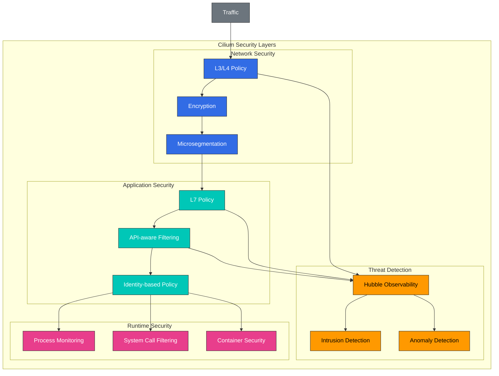

# 安全性与可观测性

> **支持的版本**: Cilium 1.18
> **最后更新**: February 22, 2026

## 实验环境设置

要跟随本文档中的示例操作，您需要以下工具和环境：

### 必需工具
- kubectl v1.31 或更高版本
- 可正常运行的 Kubernetes 集群（EKS、minikube、kind 等）
- Cilium CLI
- Hubble CLI

### Hubble 安装与设置

```bash
# Enable Hubble
cilium hubble enable --ui

# Install Hubble CLI
export HUBBLE_VERSION=$(curl -s https://raw.githubusercontent.com/cilium/hubble/master/stable.txt)
curl -L --remote-name-all https://github.com/cilium/hubble/releases/download/$HUBBLE_VERSION/hubble-linux-amd64.tar.gz
tar xzvfC hubble-linux-amd64.tar.gz /usr/local/bin
rm hubble-linux-amd64.tar.gz

# Set up Hubble port forwarding
cilium hubble port-forward &

# Verify Hubble connection
hubble status
```

## Cilium 的安全功能

Cilium 利用 eBPF 为容器化环境提供强大的安全功能。这些功能从网络层到应用层提供全面的安全保障。

### Cilium 安全架构



### 网络安全功能：

1. **微分段**：
   - 通过细粒度网络策略防止横向移动
   - 应用最小权限原则
   - 限制服务间通信

2. **加密**：
   - 节点间 IPsec 或 WireGuard 加密
   - 传输中的数据保护
   - 透明的加密实现

3. **威胁检测**：
   - 检测异常网络活动
   - 识别已知攻击模式
   - 实时告警与响应

4. **DNS 安全**：
   - 基于 DNS 的网络策略
   - 恶意域名拦截
   - DNS 请求监控

### 应用安全功能：

1. **API 感知安全**：
   - 基于 HTTP 方法、路径和标头的过滤
   - 基于 gRPC 方法和元数据的过滤
   - 基于 Kafka 主题和操作的过滤

2. **基于身份的安全**：
   - 基于服务身份的策略
   - 相互 TLS（mTLS）集成
   - SPIFFE/SPIRE 集成

3. **运行时安全**：
   - 进程和系统调用监控
   - 容器逃逸检测
   - 防止权限提升

### 安全策略示例：

```yaml
# comprehensive-security-policy.yaml
apiVersion: "cilium.io/v2"
kind: CiliumNetworkPolicy
metadata:
  name: "comprehensive-security"
  namespace: app
spec:
  endpointSelector:
    matchLabels:
      app: backend
  ingress:
  - fromEndpoints:
    - matchLabels:
        app: frontend
    toPorts:
    - ports:
      - port: "8080"
        protocol: TCP
      rules:
        http:
        - method: "GET"
          path: "/api/v1/data"
  egress:
  - toEndpoints:
    - matchLabels:
        app: database
    toPorts:
    - ports:
      - port: "3306"
        protocol: TCP
  - toFQDNs:
    - matchName: "api.example.com"
    toPorts:
    - ports:
      - port: "443"
        protocol: TCP
```

## 使用 Hubble 实现网络可观测性

> **核心概念**：Hubble 是 Cilium 的可观测性层，利用 eBPF 实时监控和分析网络流。

Hubble 是 Cilium 的可观测性层，利用 eBPF 实时监控和分析网络流。它可用于网络故障排除、安全监控和性能分析等多种用途。

```yaml
apiVersion: "cilium.io/v2"
kind: CiliumNetworkPolicy
metadata:
  name: "comprehensive-security"
spec:
  endpointSelector:
    matchLabels:
      app: secure-app
  ingress:
  - fromEndpoints:
    - matchLabels:
        app: authorized-client
        io.kubernetes.pod.namespace: default
    toPorts:
    - ports:
      - port: "8443"
        protocol: TCP
      rules:
        http:
        - method: "GET"
          path: "/api/v1/secure"
          headers:
          - "Authorization: Bearer [a-zA-Z0-9\\.]*"
  egress:
  - toEndpoints:
    - matchLabels:
        k8s:app: kube-dns
        k8s:io.kubernetes.pod.namespace: kube-system
    toPorts:
    - ports:
      - port: "53"
        protocol: UDP
  - toFQDNs:
    - matchName: "api.internal.secure"
    toPorts:
    - ports:
      - port: "443"
        protocol: TCP
  - toCIDR:
    - 10.0.0.0/8
    toPorts:
    - ports:
      - port: "5432"
        protocol: TCP
```

### 加密配置：

```yaml
# encryption-config.yaml
apiVersion: v1
kind: ConfigMap
metadata:
  name: cilium-config
  namespace: kube-system
data:
  # Enable IPsec encryption
  enable-ipsec: "true"
  ipsec-key-file: /etc/ipsec/keys

  # Or enable WireGuard encryption
  enable-wireguard: "true"

  # Encryption node selection
  encrypt-node: "true"

  # Encryption interface
  encrypt-interface: "eth0"
```

## 网络可观测性与监控

Cilium 通过 Hubble 在容器化环境中提供全面的网络可观测性和监控功能。这使得对网络流进行实时观察和故障排除成为可能。

### Hubble 架构：

```
+-------------------+        +-------------------+
| Hubble UI         |        | Grafana           |
+--------+----------+        +--------+----------+
         |                            |
         v                            v
+-------------------+        +-------------------+
| Hubble Relay      |        | Prometheus        |
+--------+----------+        +--------+----------+
         |                            |
         v                            v
+-------------------+        +-------------------+
| Hubble            |<-------| Cilium            |
+-------------------+        +-------------------+
         |                            |
         v                            v
+-------------------+        +-------------------+
| eBPF Maps         |        | Kernel            |
+-------------------+        +-------------------+
```

### Hubble 组件：

1. **Hubble Server**：
   - 与 Cilium agent 集成
   - 从 eBPF maps 收集网络流数据
   - 提供本地 API endpoint

2. **Hubble Relay**：
   - 聚合多个 Hubble Server 的数据
   - 提供集群范围的可观测性
   - 提供 gRPC API endpoint

3. **Hubble UI**：
   - 网络流可视化
   - Service 依赖关系图
   - 交互式查询界面

4. **Hubble CLI**：
   - 命令行界面
   - 网络流查询和过滤
   - 故障排除工具

### Hubble 安装：

```bash
# Enable Hubble
cilium hubble enable --ui

# Check Hubble status
cilium hubble status

# Hubble UI port forwarding
cilium hubble ui

# Install Hubble CLI
curl -L --remote-name-all https://github.com/cilium/hubble/releases/latest/download/hubble-linux-amd64.tar.gz
sudo tar xzvfC hubble-linux-amd64.tar.gz /usr/local/bin
```

### Hubble CLI 使用示例：

```bash
# Observe all network flows
hubble observe

# Filter flows for a specific namespace
hubble observe --namespace default

# Filter HTTP requests
hubble observe --protocol http

# Filter dropped packets
hubble observe --verdict DROPPED

# Filter communication between specific pods
hubble observe --pod app1/pod-1 --to-pod app2/pod-2

# Filter traffic to a specific service
hubble observe --to-service kube-system/kube-dns

# Output in JSON format
hubble observe -o json
```

## Hubble 架构与使用

Hubble 是 Cilium 基于 eBPF 的可观测性层，可深入洞察容器网络。Hubble 提供有关网络流、应用协议、安全事件等的实时信息。

### Hubble 数据流：

1. **数据收集**：
   - eBPF 程序捕获网络事件
   - 提取数据包元数据
   - 收集连接跟踪信息

2. **数据处理**：
   - 生成流记录
   - L7 协议解析
   - 指标聚合

3. **数据存储**：
   - 在 ring buffer 中临时存储
   - 支持可选的持久化存储
   - 指标导出

4. **数据查询**：
   - 实时网络流观察
   - 过滤和聚合
   - 可视化和分析

### Hubble 指标：

Hubble 收集各种指标来监控网络性能和安全状态：

- **TCP/IP 指标**：连接数、重传次数、RTT
- **HTTP 指标**：请求数、响应代码、延迟
- **DNS 指标**：查询数、响应代码、延迟
- **安全指标**：策略决策、丢弃的数据包、安全事件
- **Service 指标**：服务间通信、负载均衡决策

### Prometheus 集成：

Hubble 与 Prometheus 集成以收集和监控网络指标：

```yaml
# prometheus-config.yaml
apiVersion: v1
kind: ConfigMap
metadata:
  name: prometheus-config
  namespace: monitoring
data:
  prometheus.yml: |
    global:
      scrape_interval: 15s
    scrape_configs:
      - job_name: 'cilium-hubble'
        static_configs:
          - targets: ['hubble-metrics.cilium.io:9091']
        metrics_path: '/metrics'
```

### Grafana 仪表板：

Hubble 与 Grafana 集成以可视化网络指标：

1. **网络概览仪表板**：
   - 网络总流量
   - 协议分布
   - 通信量最高的 endpoints

2. **Service Map 仪表板**：
   - Service 依赖关系可视化
   - 通信模式分析
   - Service 状态监控

3. **安全仪表板**：
   - 策略决策可视化
   - 丢弃数据包分析
   - 安全事件跟踪

4. **HTTP 仪表板**：
   - 按 endpoint 统计的请求量
   - 响应代码分布
   - 延迟分布

## 实时威胁检测

Cilium 和 Hubble 利用 eBPF 提供实时威胁检测功能。这能够检测和响应基于网络的攻击。

### 可检测的威胁类型：

1. **网络扫描**：
   - 端口扫描检测
   - Service 枚举尝试
   - 暴力破解攻击

2. **异常流量模式**：
   - 流量突然增加
   - 异常协议使用
   - 异常连接模式

3. **策略违规**：
   - 未授权的服务间通信
   - 未授权的外部连接
   - 未授权的协议使用

4. **已知攻击模式**：
   - SQL 注入尝试
   - XSS（跨站脚本）尝试
   - 命令注入尝试

### 威胁检测配置：

```yaml
# threat-detection-config.yaml
apiVersion: v1
kind: ConfigMap
metadata:
  name: cilium-config
  namespace: kube-system
data:
  # Enable threat detection
  enable-threat-detection: "true"

  # Enable anomaly detection
  enable-anomaly-detection: "true"

  # Alert configuration
  alert-to-slack: "true"
  slack-webhook-url: "https://hooks.slack.com/services/..."

  # Logging configuration
  log-level: "info"
  enable-flow-logs: "true"
```

### 威胁响应自动化：

Cilium 可以配置为对检测到的威胁自动响应：

1. **自动拦截**：
   - 恶意 IP 地址拦截
   - 异常 Pod 隔离
   - 恶意域名拦截

2. **速率限制**：
   - 过多请求限制
   - 连接数限制
   - 带宽限制

3. **告警与日志记录**：
   - 向 Slack、PagerDuty 等发送告警
   - 将日志转发到集中式日志系统
   - 安全信息和事件管理（SIEM）集成

### 威胁检测监控：

```bash
# Monitor dropped packets
hubble observe --verdict DROPPED

# Monitor policy violations
hubble observe --verdict POLICY_DENIED

# Monitor HTTP errors
hubble observe --protocol http --http-status 4.. --http-status 5..

# Monitor traffic from specific IP
hubble observe --ip 10.0.0.1

# Set up real-time threat alerts
hubble observe --verdict DROPPED --output json | jq -c 'select(.verdict.reason == "Policy denied")' | webhook-forwarder
```

## 实验：Hubble 安装与使用

### 1. Hubble 安装与配置：

```bash
# Enable Hubble
cilium hubble enable --ui

# Check Hubble status
cilium hubble status

# Access Hubble UI
cilium hubble ui
```

### 2. 网络策略应用与监控：

```bash
# Apply default deny policy
kubectl apply -f - <<EOF
apiVersion: "cilium.io/v2"
kind: CiliumNetworkPolicy
metadata:
  name: "deny-all"
spec:
  endpointSelector: {}
  ingress:
  - {}
  egress:
  - toEndpoints:
    - matchLabels:
        k8s:app: kube-dns
        k8s:io.kubernetes.pod.namespace: kube-system
    toPorts:
    - ports:
      - port: "53"
        protocol: UDP
EOF

# Monitor policy violations
hubble observe --verdict DROPPED
```

### 3. 创建 Service 依赖关系图：

```bash
# Deploy test application
kubectl apply -f https://raw.githubusercontent.com/cilium/cilium/master/examples/minikube/http-sw-app.yaml

# Generate traffic
kubectl exec -ti deployment/xwing -- curl -s -XPOST deathstar.default.svc.cluster.local/v1/request-landing

# View service map
cilium hubble ui
```

### 4. 安全事件监控：

```bash
# Monitor security events
hubble observe --type drop --output json

# Monitor security events for specific pod
hubble observe --pod app=deathstar --verdict DROPPED

# Security event statistics
hubble observe --verdict DROPPED --output json | jq -c '.verdict.reason' | sort | uniq -c
```

[返回主页](README.md)

## 测验

要测试您在本章学到的内容，请尝试完成[主题测验](../../quizzes/networking/cilium/06-security-visibility-quiz.md)。
