# 高级主题与真实案例

> **支持的版本**: Cilium 1.18
> **最后更新**: February 22, 2026

## 实验环境设置

要跟随本文档中的示例操作，您需要以下工具和环境：

### 必需工具
- kubectl v1.31 或更高版本
- 一个可用的 Kubernetes 集群（EKS、minikube、kind 等）
- Cilium CLI
- Helm v3.10 或更高版本
- 系统监控工具（sysstat、htop、bpftool）

### 性能测试环境设置

```bash
# Create performance testing namespace
kubectl create namespace perf-test

# Deploy test application
kubectl -n perf-test apply -f - <<EOF
apiVersion: apps/v1
kind: Deployment
metadata:
  name: load-generator
  namespace: perf-test
spec:
  replicas: 2
  selector:
    matchLabels:
      app: load-generator
  template:
    metadata:
      labels:
        app: load-generator
    spec:
      containers:
      - name: wrk
        image: skandyla/wrk
        command: ["sleep", "infinity"]
EOF

# Monitor system status
kubectl -n kube-system exec -it $(kubectl -n kube-system get pods -l k8s-app=cilium -o jsonpath='{.items[0].metadata.name}') -- cilium status --verbose
```

## 性能调优与故障排查

> **关键概念**：要优化 Cilium 的性能，需要适当调整内核参数、eBPF map 大小、资源分配和网络模式。

了解如何优化 Cilium 的性能并解决常见问题，对于在生产环境中高效运行 Cilium 至关重要。

### 性能调优架构

```mermaid
flowchart TD
    subgraph "Cilium Performance Tuning Areas"
        direction TB

        subgraph "Kernel Parameters"
            TCP[TCP Parameters]
            Conntrack[Connection Tracking]
            ARP[ARP Cache]
            Memory[Memory Management]
        end

        subgraph "eBPF Maps"
            CTMap[Connection Tracking Map]
            NATMap[NAT Map]
            PolicyMap[Policy Map]
            EndpointMap[Endpoint Map]
        end

        subgraph "Resource Allocation"
            CPULimit[CPU Limits]
            MemLimit[Memory Limits]
            PodPriority[Pod Priority]
            NodeAffinity[Node Affinity]
        end

        subgraph "Networking Mode"
            DirectRouting[Direct Routing]
            Overlay[Overlay]
            KubeProxy[kube-proxy Replacement]
            XDP[XDP Acceleration]
        end
    end

    Performance[Performance Optimization] --> TCP & Conntrack & ARP & Memory
    Performance --> CTMap & NATMap & PolicyMap & EndpointMap
    Performance --> CPULimit & MemLimit & PodPriority & NodeAffinity
    Performance --> DirectRouting & Overlay & KubeProxy & XDP

    classDef kernel fill:#326CE5,stroke:#333,stroke-width:1px,color:white;
    classDef ebpf fill:#00C7B7,stroke:#333,stroke-width:1px,color:white;
    classDef resource fill:#FF9900,stroke:#333,stroke-width:1px,color:black;
    classDef network fill:#E83E8C,stroke:#333,stroke-width:1px,color:white;
    classDef perf fill:#6c757d,stroke:#333,stroke-width:1px,color:white;

    class TCP,Conntrack,ARP,Memory kernel;
    class CTMap,NATMap,PolicyMap,EndpointMap ebpf;
    class CPULimit,MemLimit,PodPriority,NodeAffinity resource;
    class DirectRouting,Overlay,KubeProxy,XDP network;
    class Performance perf;
```



### 性能调优领域：

1. **内核参数调优**：
   - `net.core.somaxconn`：TCP 连接队列大小
   - `net.ipv4.tcp_max_syn_backlog`：SYN backlog 大小
   - `net.ipv4.neigh.default.gc_thresh`：ARP 缓存大小
   - `net.netfilter.nf_conntrack_max`：连接跟踪表大小

2. **eBPF Map 调优**：
   - 连接跟踪 map 大小
   - NAT map 大小
   - Endpoint map 大小
   - Policy map 大小

3. **资源分配**：
   - Cilium agent CPU 请求与限制
   - Cilium agent 内存请求与限制
   - Hubble 组件资源分配
   - Node 资源分配

4. **网络模式选择**：
   - 直接路由与 overlay
   - 启用/禁用加密
   - kube-proxy 替换模式
   - XDP 加速

### 性能调优配置示例：

```yaml
# performance-tuning.yaml
apiVersion: v1
kind: ConfigMap
metadata:
  name: cilium-config
  namespace: kube-system
data:
  # eBPF map size adjustment
  bpf-map-dynamic-size-ratio: "0.0025"
  bpf-ct-global-any-max: "262144"
  bpf-nat-global-max: "131072"

  # Proxy configuration
  proxy-max-memory-percentage: "30"
  proxy-max-threads: "8"

  # Networking mode
  tunnel: "disabled"
  enable-ipv4: "true"
  enable-ipv6: "false"
  auto-direct-node-routes: "true"

  # kube-proxy replacement
  kube-proxy-replacement: "strict"
  enable-node-port: "true"
  node-port-algorithm: "maglev"

  # XDP acceleration
  enable-xdp: "true"
```

### 常见故障排查场景：

| 问题 | 症状 | 诊断命令 | 解决方案 |
|-------|----------|---------------------|------------|
| 连接跟踪 map 已满 | 连接失败、丢包 | `cilium bpf ct list global` | 增加连接跟踪 map 大小 |
| 内存不足 | OOM 终止、重启 | `kubectl top pods -n kube-system` | 增加内存限制 |
| Policy 应用失败 | 意外的连接阻断 | `cilium policy get` | Policy 调试、查看日志 |
| Node 间通信问题 | Pod 间连接失败 | `cilium connectivity test` | 验证路由表和防火墙规则 |

### 常见问题与解决方案：

1. **连接问题**：
   - 症状：Pod 间连接失败
   - 诊断：`cilium status`、`cilium endpoint list`、`cilium bpf tunnel list`
   - 解决方案：检查网络 Policy，验证 Endpoint 状态，验证路由表

2. **Policy 应用问题**：
   - 症状：网络 Policy 未按预期工作
   - 诊断：`cilium policy get`、`cilium endpoint get <id>`、`hubble observe`
   - 解决方案：验证 Policy 语法，检查标签，验证 Policy 优先级

3. **性能问题**：
   - 症状：高延迟、低吞吐量
   - 诊断：`cilium bpf metrics list`、`cilium monitor`、系统资源监控
   - 解决方案：增加资源分配，调整 map 大小，调优内核参数

4. **升级问题**：
   - 症状：升级后功能丢失或出现错误
   - 诊断：`cilium status`、日志审查、版本兼容性检查
   - 解决方案：分阶段升级、配置迁移、回滚计划

### 故障排查命令：

```bash
# Check Cilium status
cilium status --verbose

# Check endpoint status
cilium endpoint list
cilium endpoint get <id>

# Check policies
cilium policy get
cilium policy selectors

# Check eBPF maps
cilium bpf metrics list
cilium bpf tunnel list
cilium bpf lb list

# Monitor network flows
cilium monitor
hubble observe --verdict DROPPED

# Check logs
kubectl logs -n kube-system -l k8s-app=cilium
kubectl logs -n kube-system -l k8s-app=hubble-relay
```

## 大规模部署策略

在大规模 Kubernetes 集群中有效部署和管理 Cilium 的策略，对于确保稳定性、性能和运维效率至关重要。

### 大规模部署注意事项：

1. **集群规模规划**：
   - Node 数量和密度
   - Pod 数量和密度
   - Service 数量和密度
   - 网络 Policy 数量和复杂度

2. **资源分配**：
   - Cilium agent CPU 和内存需求
   - Hubble 组件资源需求
   - Node 资源需求
   - 存储需求

3. **网络架构**：
   - 直接路由与 overlay
   - 集群间连接
   - 外部 Service 集成
   - 负载均衡策略

4. **运维策略**：
   - 监控和告警
   - 备份和恢复
   - 升级策略
   - 事件响应计划

### 大规模部署架构：

```
+-------------------+        +-------------------+
| Management        |        | Workload          |
| Cluster           |        | Cluster           |
|                   |        |                   |
| +---------------+ |        | +---------------+ |
| | Cilium        | |        | | Cilium        | |
| | Operator      | |        | | Agent         | |
| +---------------+ |        | +---------------+ |
|                   |        |                   |
| +---------------+ |        | +---------------+ |
| | Hubble        | |        | | Hubble        | |
| | Centralized   | |        | | Distributed   | |
| +---------------+ |        | +---------------+ |
|                   |        |                   |
| +---------------+ |        | +---------------+ |
| | Monitoring    | |        | | Workload      | |
| | Dashboard     | |        | | Pods          | |
| +---------------+ |        | +---------------+ |
|                   |        |                   |
+-------------------+        +-------------------+
```

### 大规模部署最佳实践：

1. **渐进式发布**：
   - 使用金丝雀部署
   - 蓝绿部署策略
   - 准备回滚计划
   - 验证变更

2. **自动化**：
   - 实施 GitOps 工作流
   - 集成 CI/CD pipeline
   - 自动化测试与验证
   - 配置管理自动化

3. **监控与告警**：
   - 全面的指标收集
   - 多级告警策略
   - 仪表板和可视化
   - 日志聚合与分析

4. **灾难恢复**：
   - 定期备份
   - 文档化的恢复流程
   - 灾难恢复演练
   - 多可用区/区域策略

### 大规模部署配置示例：

```yaml
# large-scale-cilium.yaml
apiVersion: v1
kind: ConfigMap
metadata:
  name: cilium-config
  namespace: kube-system
data:
  # Large cluster optimization
  cluster-name: "prod-cluster"
  cluster-id: "1"

  # Resource optimization
  preallocate-bpf-maps: "true"
  bpf-map-dynamic-size-ratio: "0.005"

  # Scalability optimization
  enable-endpoint-slice: "true"
  enable-local-node-route: "false"
  auto-direct-node-routes: "true"

  # Operational optimization
  enable-ipv4: "true"
  enable-ipv6: "false"
  enable-ipv4-masquerade: "true"
  enable-bpf-masquerade: "true"

  # Monitoring optimization
  monitor-aggregation: "medium"
  hubble-export-file-max-size-mb: "100"
  hubble-export-file-max-backups: "5"
```

## 真实使用案例研究

让我们了解 Cilium 如何在各行业和环境中使用，并分享真实实施案例与经验教训。

### 案例研究 1：大规模电商平台

**背景**：
- 数千个微服务
- 数百个 Kubernetes Node
- 每秒数百万请求
- 严格的安全要求

**挑战**：
- 保护微服务间通信
- 管理大规模网络 Policy
- 高吞吐量和低延迟要求
- 复杂的 Service 依赖关系

**Cilium 实施**：
- 使用基于 eBPF 的负载均衡替换 kube-proxy
- 使用 L7 Policy 保护微服务
- 通过 Hubble 实现网络可观测性
- 使用 Cluster Mesh 实现多集群连接

**结果**：
- 网络延迟降低 30%
- 吞吐量提升 40%
- 安全事件减少 80%
- 运维开销减少 50%

### 案例研究 2：金融服务机构

**背景**：
- 严格的监管合规要求
- 敏感金融数据处理
- 混合云环境
- 零信任安全模型

**挑战**：
- 细粒度访问控制
- 加密通信
- 审计和合规报告
- 多云连接

**Cilium 实施**：
- 严格的 L3-L7 网络 Policy
- 使用 WireGuard 加密保护 Node 间通信
- 通过 Hubble 实现全面审计日志记录
- 使用 Cluster Mesh 实现多云连接

**结果**：
- 合规审计通过时间减少 70%
- 安全配置错误减少 90%
- 网络故障排查时间减少 60%
- 多云连接设置时间减少 80%

### 案例研究 3：电信服务提供商

**背景**：
- 5G 网络功能虚拟化（NFV）
- 边缘计算部署
- 高性能要求
- 大规模分布式环境

**挑战**：
- 超低延迟网络
- 大规模可扩展性
- 边缘位置之间的连接
- 资源受限环境

**Cilium 实施**：
- 使用 XDP 加速进行高性能数据包处理
- 使用优化的数据路径最小化延迟
- 使用 Cluster Mesh 实现边缘位置连接
- 使用基于 eBPF 的负载均衡提高资源效率

**结果**：
- 数据包处理延迟降低 50%
- 单个 Node 每秒处理 1000 万个数据包
- 边缘位置连接设置时间减少 75%
- 计算资源使用量减少 40%

## 未来路线图与发展方向

Cilium 持续演进，未来路线图包括新功能、性能改进和使用场景扩展。

### 技术发展方向：

1. **eBPF 技术进展**：
   - 扩展 CO-RE（Compile Once, Run Everywhere）支持
   - 增强 BTF（BPF Type Format）利用
   - 使用新的 eBPF 功能和 helper
   - 改进内核版本兼容性

2. **网络功能增强**：
   - 多集群网络改进
   - 加强混合云和多云连接
   - 增强 IPv6 支持
   - 支持新的 overlay 协议

3. **安全功能强化**：
   - 高级威胁检测与防御
   - 扩展零信任网络支持
   - Runtime security 集成
   - 合规自动化

4. **可观测性增强**：
   - 分布式追踪集成
   - 基于机器学习的异常检测
   - 高级可视化与分析
   - 长期数据存储与分析

### 生态系统集成：

1. **Service Mesh 集成**：
   - 增强与 Istio、Linkerd 等的集成
   - 支持无 Sidecar 的 Service Mesh
   - 统一 Policy 管理
   - 统一可观测性

2. **云提供商集成**：
   - 增强与 AWS、Azure、GCP 的原生集成
   - 云原生网络优化
   - 云安全服务集成
   - 云可观测性集成

3. **应用程序框架集成**：
   - 增强 Kubernetes 集成
   - Serverless 平台支持
   - 数据库和消息系统集成
   - CI/CD pipeline 集成

### 使用场景扩展：

1. **边缘计算**：
   - 资源受限环境优化
   - 边缘到云连接
   - 本地数据处理与过滤
   - 边缘安全

2. **5G 和电信**：
   - 网络功能虚拟化（NFV）支持
   - 用户面功能（UPF）优化
   - 移动边缘计算（MEC）集成
   - 网络切片支持

3. **IoT 和嵌入式系统**：
   - 轻量级 agent
   - 有限资源环境支持
   - 设备到云连接
   - IoT 安全

4. **AI/ML 工作负载**：
   - GPU 网络优化
   - 分布式训练支持
   - 模型服务优化
   - 数据 pipeline 安全

### 社区与生态系统：

1. **开源协作**：
   - 加强与 CNCF 项目的协作
   - 扩大社区贡献
   - 教育和认证计划
   - 用户组和活动

2. **商业支持**：
   - 企业级支持选项
   - 托管服务产品
   - 咨询和专业服务
   - 培训和认证

3. **标准化工作**：
   - 参与 eBPF 标准化
   - 参与网络和安全标准制定
   - 改进互操作性
   - 定义行业最佳实践

## Cilium 1.18 中的新功能

Cilium 1.18 在网络、安全和可观测性领域引入了重要改进。

### BGP 控制平面改进

Cilium 1.18 显著改进了 BGP 控制平面，以提供更灵活、可扩展的路由配置：

```yaml
apiVersion: cilium.io/v2alpha1
kind: CiliumBGPPeeringPolicy
metadata:
  name: bgp-peering-policy
spec:
  virtualRouters:
  - localASN: 64512
    exportPodCIDR: true
    neighbors:
    - peerAddress: "192.168.1.1/32"
      peerASN: 64513
      connectRetryTimeSeconds: 120
      holdTimeSeconds: 90
      keepAliveTimeSeconds: 30
```

**关键改进**：
- 更细粒度的 BGP peer 配置
- 增强的路由过滤选项
- 改进的多跳 BGP 支持
- 支持 BGP Graceful Restart

### 增强的网络可观测性

Hubble 中的新功能可提供更深入的网络洞察：

**新指标**：
- 细粒度延迟指标
- 增强的丢弃原因分析
- DNS 查询跟踪改进
- TCP 连接状态跟踪

**实时流量分析**：
```bash
# Enhanced Hubble queries
hubble observe --protocol tcp --verdict DROPPED --since 1h
hubble observe --dns --type A --from-label app=frontend
hubble observe --http-status 5xx --from-namespace production
```

### 性能优化

Cilium 1.18 显著提升了大规模集群中的性能：

**内存优化**：
- eBPF map 内存使用量减少 20%
- 通过连接跟踪优化提高内存效率
- 更高效的 Endpoint 管理

**CPU 优化**：
- eBPF 程序执行速度提升 15%
- 改进网络 Policy 评估性能
- 更快的 Service 负载均衡

### 安全增强

**网络 Policy 改进**：
```yaml
apiVersion: "cilium.io/v2"
kind: CiliumNetworkPolicy
metadata:
  name: enhanced-l7-policy
spec:
  endpointSelector:
    matchLabels:
      app: backend
  ingress:
  - fromEndpoints:
    - matchLabels:
        app: frontend
    toPorts:
    - ports:
      - port: "8080"
        protocol: TCP
      rules:
        http:
        - method: "GET|POST"
          path: "/api/v1/.*"
          headers:
          - "X-API-Version: 1.0"
```

**加密改进**：
- WireGuard 加密性能提升 30%
- 扩展 IPsec 加密套件
- 更快的密钥轮换

### 多集群网络改进

Cilium 1.18 改进了多集群场景中的性能和稳定性：

**ClusterMesh 改进**：
- 更快的集群间 Service 发现
- 增强的故障恢复机制
- 更好的负载均衡算法
- 改进集群间网络 Policy 传播

### Kubernetes 1.32 支持

Cilium 1.18 完全支持 Kubernetes 1.32 中的新功能：

- 支持 Gateway API v1.0
- 增强的 Service API 支持
- 新 Kubernetes 网络功能集成

## 结论与后续步骤

通过这一周的深入课程，我们已全面了解 Cilium 的核心概念、架构、功能和真实使用案例。您现在已经掌握了使用 Cilium 解决容器化环境中网络、安全和可观测性挑战的知识与工具。

### 关键学习要点：

- Cilium 的基本概念和架构
- eBPF 技术及其在 Cilium 中的使用
- 网络模型和 VXLAN 技术
- IPAM 和网络 Policy
- L2-L7 网络和负载均衡
- 安全和可见性功能
- 性能调优和故障排查
- 大规模部署策略
- 真实使用案例和未来发展方向

### 后续步骤：

1. **实践与实验**：
   - 在测试环境中安装并配置 Cilium
   - 尝试各种网络模式和功能
   - 设计并测试网络 Policy
   - 使用 Hubble 探索网络可见性

2. **知识扩展**：
   - 深入学习 eBPF 技术
   - 加强 Kubernetes 网络概念
   - 学习网络安全最佳实践
   - 探索云原生网络模式

3. **参与社区**：
   - 关注 Cilium GitHub 仓库
   - 加入 Cilium Slack 频道
   - 参加社区活动和网络研讨会
   - 提交 bug 报告或功能请求

4. **生产环境实施规划**：
   - 定义需求和目标
   - 设计并验证架构
   - 制定分阶段实施计划
   - 制定监控和运维策略

### 其他资源：

- [Cilium 官方文档](https://docs.cilium.io/)
- [Cilium GitHub 仓库](https://github.com/cilium/cilium)
- [eBPF.io](https://ebpf.io/)
- [CNCF 网站](https://www.cncf.io/)
- [Kubernetes 网络文档](https://kubernetes.io/docs/concepts/cluster-administration/networking/)

我们希望本课程能帮助您加深对 Cilium 和云原生网络的理解。由于 Cilium 持续演进，持续了解最新发展和最佳实践非常重要。

[返回主页](README.md)

## 测验

要测试您在本章学到的内容，请尝试完成[主题测验](../../quizzes/networking/cilium/07-advanced-topics-quiz.md)。
