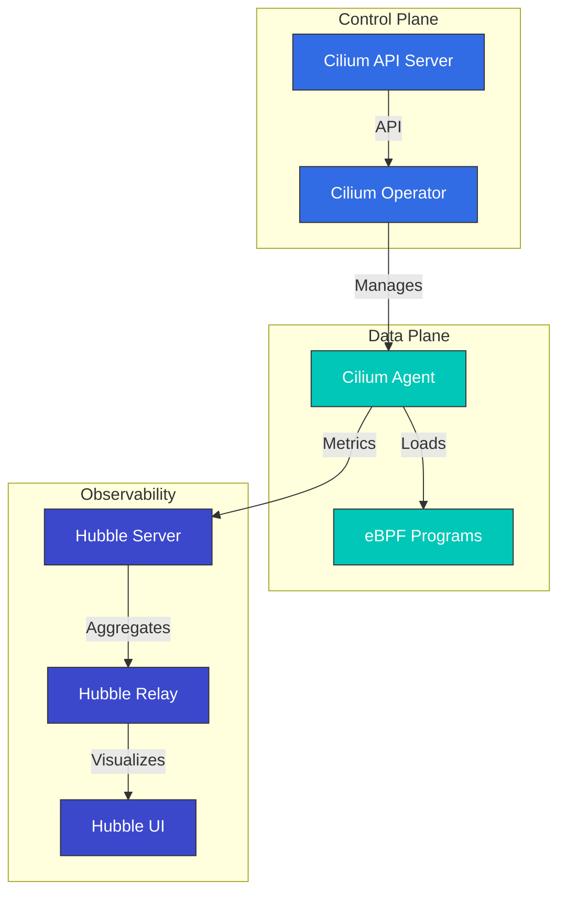

# Cilium 深入解析：云原生网络的未来

## 概览

本节将全面介绍 Cilium 的核心概念和技术。我们将深入探索 Cilium 的架构、eBPF 技术、网络模型、安全功能等内容。

> **支持的版本**: Cilium 1.17, 1.18
> **Kubernetes 兼容性**: 1.32 及以上
> **最后更新**: August 24, 2026

### 2026 年 7 月更新：补丁版本和一个 NetworkPolicy 安全问题

2026 年 7 月 16 日，发布了 Cilium 1.19.6、1.18.12 和 1.17.18 补丁版本。除新增 Gateway API 访问日志配置支持（`CiliumGatewayClassConfig` 中的 `spec.telemetry.accessLogs`）外，这些版本还修复了一个回归问题：在 agent 重启/升级期间可能短暂中断已建立的连接；同时修复了 ClusterMesh 中的一个 bug，即 `service.cilium.io/affinity: "none"` 注解会导致流量黑洞。

还请注意 **CVE-2026-56743** 安全问题：在 Cilium 1.19.0-1.19.4 中，如果使用非默认的 `clusterName`，仅使用 `ipBlock` 规则（不含 Pod/namespace 选择器）的 Kubernetes NetworkPolicy 可能会意外允许来自同一 namespace 中其他工作负载的流量。请升级到 1.19.5 或更高版本。详情请参阅[安全公告](https://github.com/cilium/cilium/security/advisories/GHSA-fm8w-2m5w-9j7r)。

2026 年 7 月 21 日，发布了 [Cilium 1.20.0-rc.1](https://github.com/cilium/cilium/releases/tag/v1.20.0-rc.1)——这是即将推出的 1.20 次要版本的第二个发布候选版本，继 7 月 14 日发布 rc.0 之后推出。

### 2026 年 8 月更新：Cilium 1.20.0 GA

2026 年 7 月 29 日，发布了 [Cilium 1.20.0](https://github.com/cilium/cilium/releases/tag/v1.20.0)——包含来自 1,100 多名贡献者的逾 2,660 个新提交。主要亮点：

- **Gateway API v1.6.1**：支持新晋 GA 的 TCPRoute/UDPRoute、用于后端 TLS 的 `BackendTLSPolicy`、用于委派 listener 管理的 ListenerSets、`ExternalAuth` 过滤器（GEP-1494）以及原生 CORS 支持
- **网络**：可在无需 fork 的情况下扩展 eBPF datapath 的 datapath 插件、自动 netkit 选择（`bpf.datapathMode=auto`），以及适用于双栈集群的 IPv6 egress gateway IP
- **IPAM**：适用于 AWS ENI IPAM 的 IPv6（Beta），以及从 cluster-pool 到 multi-pool IPAM 的原地迁移
- **Services/ClusterMesh**：`PreferSameZone`/`PreferSameNode` 流量分发、通过 `service.cilium.io/weight` 注解实现的加权 Maglev 后端，以及稳定的 Multi-Cluster Services (MCS) API 支持
- **安全**：支持具有 Admin/Baseline 层级的 Kubernetes ClusterNetworkPolicy (KCNP)、通过内部 CA 或 SPIRE 实现的 ztunnel identity，以及新的 `cluster-mesh` policy entity
- **性能**：`cilium-cni` 二进制文件从约 77 MB 缩小至 16 MB，此外还包括聚合的 load-balancer 状态和面向大型集群优化的 BPF policy-map 编码

如果您使用旧版 Mutual Authentication、Envoy Go extensions、Kafka-aware policies、`cilium.io/v2alpha1` `CiliumNodeConfig` API、libnetwork 集成或自定义 CNI 配置，请在升级期间采取相应措施——请参阅[升级指南](https://docs.cilium.io/en/v1.20/operations/upgrade/#upgrade-notes)。下一周期的首个预发布版本 1.21.0-pre.0 于 8 月 3 日发布。

### 2026 年 8 月更新：1.20.1 / 1.19.7 / 1.18.13 补丁版本

2026 年 8 月 18 日，这三个受维护版本线发布了协调补丁版本。[1.20.1](https://github.com/cilium/cilium/releases/tag/v1.20.1) 是 1.20 版本线的首个补丁版本，包含 Cluster Mesh 文档的全面改进以及自 1.20.0 以来回移的 bug 修复；[1.19.7](https://github.com/cilium/cilium/releases/tag/v1.19.7) 回移了 host firewall 中的 VRRP 和 IGMP 协议支持；[1.18.13](https://github.com/cilium/cilium/releases/tag/v1.18.13) 添加了 Envoy 资源（listeners、network policies 等）的增量同步，从而降低 CPU 负载和 policy 更新延迟。建议更新到您所用版本线的最新补丁版本。

## Cilium 1.18 的主要改进

Cilium 1.18 提供了以下主要功能改进和新能力：

### 网络改进
- **增强的 BGP 控制平面**：更灵活、更具可扩展性的 BGP 配置
- **改进的多集群路由**：优化的集群间通信性能
- **增强的 Service Mesh 集成**：与 Envoy proxy 更好地集成

### 安全增强
- **增强的网络策略**：更精细的策略控制和性能改进
- **改进的加密选项**：优化的 WireGuard 和 IPsec 加密性能

### 可观测性改进
- **Hubble 改进**：更丰富的指标和追踪信息
- **增强的 Prometheus 集成**：新的指标和仪表板
- **改进的流量日志记录**：更详细的网络流量信息

### 性能优化
- **eBPF 程序优化**：更快的数据包处理
- **内存使用改进**：大型集群中更好的资源效率
- **CPU 使用优化**：更低的开销

## 简介

Cilium 是一款面向 Kubernetes、Docker 和 Mesos 等 Linux 容器管理平台的开源网络、安全和可观测性解决方案。Cilium 基于 eBPF（extended Berkeley Packet Filter）技术，与传统 Linux 网络方法相比，提供了更强大、更高效的网络和安全功能。

### 什么是 eBPF？

eBPF 是一种在 Linux kernel 内充当沙箱虚拟机的技术，允许程序在不修改 kernel 代码的情况下安全地在 kernel 内执行。这使网络数据包处理、系统调用监控和性能分析等各种任务能够高效执行。

eBPF 的主要特性：
- 通过在 kernel space 中执行实现高性能
- 通过 JIT（Just-In-Time）编译实现原生性能
- 安全的执行环境（通过 verifier 进行程序验证）
- 支持动态加载和卸载

### Cilium 的主要优势

1. **高性能网络**：使用 eBPF 实现高效数据包处理
2. **精细化网络策略**：支持 L3-L7 级别的网络策略
3. **透明加密**：节点之间透明的 IPsec 或 WireGuard 加密
4. **负载均衡**：基于 XDP（eXpress Data Path）的高性能负载均衡
5. **可观测性**：通过 Hubble 实现网络流量可见性
6. **Service Mesh**：无需现有 sidecar 的 L7 流量管理
7. **多集群网络**：集群之间的透明连接
8. **BGP 支持**：与外部网络集成

### 与现有 CNI 的比较

| 功能 | Cilium | Calico | Flannel | AWS VPC CNI |
|---------|--------|--------|---------|-------------|
| 网络模型 | eBPF | iptables/IPVS | VXLAN/host-gw | AWS ENI |
| 网络策略 | L3-L7 | L3-L4 | 有限 | AWS Security Groups |
| 加密 | IPsec/WireGuard | IPsec | 无 | 无 |
| 可观测性 | Hubble | Flow Logs | 有限 | VPC Flow Logs |
| Service Mesh | 内置 | 需要 Istio | 需要 Istio | 需要 Istio/AppMesh |
| 性能 | 极高 | 高 | 中 | 高 |
| 多集群 | 内置 | 有限 | 无 | 需要 Transit Gateway |

## 架构

Cilium 由基于 eBPF 的数据平面和与 Kubernetes 集成的控制平面组成。



### 核心组件

1. **Cilium Agent**：在每个节点上运行，加载并管理 eBPF 程序
2. **Cilium Operator**：管理集群级别的资源和操作
3. **eBPF Programs**：加载到 kernel 中，用于数据包处理和策略执行
4. **Hubble**：提供网络流量监控和可观测性
5. **Cilium CLI**：用于管理 Cilium 和 Hubble 的命令行工具

### 网络模型

Cilium 支持多种网络模式：

1. **直接路由**：节点之间直接路由（BGP 或静态路由）
2. **隧道**：通过 VXLAN 或 Geneve 隧道实现 overlay networking
3. **AWS ENI**：在 Amazon EKS 上使用 Elastic Network Interface (ENI)
4. **Azure IPAM**：在 Azure AKS 上使用 Azure IPAM

### 数据包流

Cilium 如何处理数据包：

1. 数据包到达网络接口
2. eBPF XDP 程序执行初始处理（DDoS 防御、负载均衡）
3. eBPF TC（Traffic Control）程序应用网络策略
4. 数据包被传送到容器网络 namespace
5. 响应数据包经过类似路径处理

## 与 Amazon EKS 集成

在 Amazon EKS 上使用 Cilium 有两种主要方式：

1. **作为 Amazon EKS Add-on 安装**：Amazon EKS 将 Cilium 提供为托管 Add-on。
2. **手动安装**：使用 Helm chart 直接安装。

### 作为 Amazon EKS Add-on 安装

```bash
# Install Cilium add-on
aws eks create-addon \
  --cluster-name my-cluster \
  --addon-name cilium \
  --addon-version v1.17.0-eksbuild.1 \
  --service-account-role-arn arn:aws:iam::123456789012:role/AmazonEKSCiliumAddonRole

# Check add-on status
aws eks describe-addon \
  --cluster-name my-cluster \
  --addon-name cilium
```

### 使用 Helm 手动安装

```bash
# Add Cilium Helm repository
helm repo add cilium https://helm.cilium.io/

# Update Helm repository
helm repo update

# Install Cilium
helm install cilium cilium/cilium \
  --version 1.17.0 \
  --namespace kube-system \
  --set eni.enabled=true \
  --set ipam.mode=eni \
  --set egressMasqueradeInterfaces=eth0 \
  --set tunnel=disabled
```

### EKS 专用配置选项

在 EKS 中使用 Cilium 时需要考虑的主要配置选项：

1. **ENI Mode**：使用 AWS Elastic Network Interface 获得原生 AWS 网络性能
2. **IPAM Mode**：与 AWS VPC IP 地址管理集成
3. **Encryption**：节点间流量加密（WireGuard 或 IPsec）
4. **NodeLocal DNSCache**：提升 DNS 性能
5. **Hubble**：启用网络可观测性

### ENI Mode 配置

```yaml
apiVersion: v1
kind: ConfigMap
metadata:
  name: cilium-config
  namespace: kube-system
data:
  enable-endpoint-routes: "true"
  auto-create-cilium-node-resource: "true"
  ipam: "eni"
  eni-tags: "{\"Owner\": \"Cilium\"}"
  tunnel: "disabled"
  enable-ipv4: "true"
  enable-ipv6: "false"
  egress-masquerade-interfaces: "eth0"
```

### 在 EKS Cluster 上安装 Cilium

#### 在现有 EKS Cluster 上安装 Cilium

```bash
# Remove AWS CNI
kubectl delete daemonset -n kube-system aws-node

# Install Cilium
cilium install --set eni.enabled=true \
  --set ipam.mode=eni \
  --set egressMasqueradeInterfaces=eth0 \
  --set tunnel=disabled
```

#### 使用 Cilium CNI 创建新的 EKS Cluster

```bash
eksctl create cluster --name cilium-cluster \
  --without-nodegroup

eksctl create nodegroup --cluster cilium-cluster \
  --node-ami-family AmazonLinux2 \
  --node-type m5.large \
  --nodes 3 \
  --max-pods-per-node 110

# Install Cilium
cilium install --set eni.enabled=true \
  --set ipam.mode=eni \
  --set egressMasqueradeInterfaces=eth0 \
  --set tunnel=disabled
```

### EKS Cluster 互连

使用 Cilium Cluster Mesh 实现 EKS cluster 互连：

```bash
# On cluster 1
cilium clustermesh enable --service-type LoadBalancer

# On cluster 2
cilium clustermesh enable --service-type LoadBalancer

# Connect clusters
cilium clustermesh connect --context cluster1 --destination-context cluster2
```

## 安装和配置

### 前提条件

- Kubernetes cluster（v1.16 或更高版本）
- Linux kernel 4.9 或更高版本（推荐：5.4 或更高版本）
- 已配置 kubectl
- Helm（可选）

### 安装 Cilium CLI

```bash
curl -L --remote-name-all https://github.com/cilium/cilium-cli/releases/latest/download/cilium-linux-amd64.tar.gz
sudo tar xzvfC cilium-linux-amd64.tar.gz /usr/local/bin
rm cilium-linux-amd64.tar.gz
```

### 配置选项

#### 网络模式配置

直接路由模式：
```bash
cilium install --set tunnel=disabled --set autoDirectNodeRoutes=true
```

VXLAN 模式：
```bash
cilium install --set tunnel=vxlan
```

#### kube-proxy 替换配置

完全替换模式：
```bash
cilium install --set kubeProxyReplacement=strict
```

#### 加密配置

WireGuard 加密：
```bash
cilium install --set encryption.enabled=true --set encryption.type=wireguard
```

IPsec 加密：
```bash
cilium install --set encryption.enabled=true --set encryption.type=ipsec
```

## 网络策略

Cilium 扩展了 Kubernetes NetworkPolicy API，以提供 L3-L7 级别的精细化网络策略。

### 基本网络策略

```yaml
apiVersion: networking.k8s.io/v1
kind: NetworkPolicy
metadata:
  name: allow-frontend-to-backend
  namespace: app
spec:
  podSelector:
    matchLabels:
      app: backend
  ingress:
  - from:
    - podSelector:
        matchLabels:
          app: frontend
    ports:
    - port: 8080
      protocol: TCP
```

### Cilium 网络策略

```yaml
apiVersion: cilium.io/v2
kind: CiliumNetworkPolicy
metadata:
  name: allow-specific-http-methods
  namespace: app
spec:
  endpointSelector:
    matchLabels:
      app: backend
  ingress:
  - fromEndpoints:
    - matchLabels:
        app: frontend
    toPorts:
    - ports:
      - port: "8080"
        protocol: TCP
      rules:
        http:
        - method: "GET"
          path: "/api/v1/products"
```

### 基于 FQDN 的策略

```yaml
apiVersion: cilium.io/v2
kind: CiliumNetworkPolicy
metadata:
  name: allow-specific-domains
  namespace: app
spec:
  endpointSelector:
    matchLabels:
      app: web
  egress:
  - toFQDNs:
    - matchName: "api.example.com"
    - matchPattern: "*.amazonaws.com"
    toPorts:
    - ports:
      - port: "443"
        protocol: TCP
```

## 使用 Hubble 实现可观测性

Hubble 是 Cilium 的可观测性层，可通过 eBPF 收集的网络流量数据实现可视化和分析。

### 安装 Hubble

```bash
cilium hubble enable --ui
```

### 观察网络流量

```bash
# Observe all flows
hubble observe

# Observe flows in specific namespace
hubble observe --namespace app

# Observe HTTP requests
hubble observe --protocol http

# Observe flows between pods with specific labels
hubble observe --from-label app=frontend --to-label app=backend

# Observe failed connections
hubble observe --verdict DROPPED
```

### Prometheus 集成

```bash
cilium hubble enable --metrics="{dns:query;ignoreAAAA,drop:sourceContext=pod;destinationContext=pod,tcp,flow,icmp,http}"
```

## Cilium 测试

```bash
# Basic connectivity test
cilium connectivity test

# Run specific test
cilium connectivity test --test=client-to-echo-service

# Network performance test
cilium connectivity test --test=performance
```

## 最佳实践

### 性能优化

1. **Kernel 版本优化**：使用 Linux kernel 5.4 或更高版本
2. **启用 BBR 拥塞控制**：提高网络吞吐量
3. **启用 XDP 加速**：提高数据包处理性能
4. **MTU 优化**：设置适合网络环境的 MTU

```bash
cilium install --set bpf.preallocateMaps=true \
  --set bpf.masquerade=true \
  --set devices=eth0 \
  --set loadBalancer.acceleration=native \
  --set loadBalancer.mode=dsr
```

### 安全加固

1. **应用默认拒绝策略**：仅允许明确许可的流量
2. **启用加密**：加密节点间流量
3. **应用最小权限原则**：设计仅允许必要通信的策略

### 改进可观测性

```bash
cilium hubble enable --metrics="{dns,drop,tcp,flow,http}"
```

## 故障排除

### 连通性问题

```bash
# Check Cilium status
cilium status

# Check endpoint status
cilium endpoint list

# Review network policies
kubectl get cnp,ccnp -A

# Analyze flows
hubble observe --verdict DROPPED
```

### 性能问题

```bash
# Check eBPF map status
cilium bpf maps list

# Monitor system resources
cilium metrics list
```

### 调试工具

```bash
# Check status
cilium status --verbose

# Collect environment information
cilium sysdump

# Cilium agent logs
kubectl logs -n kube-system -l k8s-app=cilium
```

## 深入解析目录

**[Cilium 简介和基本概念](01-introduction.md)**
- Cilium 概览和历史
- 容器网络基础
- 理解 CNI（Container Network Interface）
- Cilium 的差异化功能

**[eBPF 技术深入解析](02-ebpf.md)**
- eBPF 技术和历史简介
- eBPF 如何在 Kernel 内工作
- eBPF 程序类型和 Maps
- 在 Cilium 中使用 eBPF

**[网络模型和 VXLAN](03-networking.md)**
- 容器网络模型比较
- VXLAN 技术深入解析
- Cilium 的 Overlay 网络
- 性能优化技术
- 路由机制（Encapsulation 与 Native-Routing）
- Cloud Provider 网络（AWS ENI、Google Cloud）

**[IPAM 和网络策略](04-ipam-policy.md)**
- IP 地址管理（IPAM）策略
- Kubernetes 和 Cilium IPAM 集成
- 网络策略设计和实施
- 多集群场景
- IPAM 模式深入解析（Cluster Scope、Kubernetes Host Scope、Multi-Pool）
- Cloud Provider IPAM（Azure IPAM、AWS ENI、GKE）
- 基于 CRD 的 IPAM

**[L2-L7 网络和负载均衡](05-l2-l7-networking.md)**
- 理解 OSI 模型层级（L2、L3、L4、L7）
- Cilium 的特定层级功能
- Service Mesh 集成
- 负载均衡架构
- Masquerading 配置和实施模式
- IPv4 分片处理

**[安全和可见性](06-security-visibility.md)**
- Cilium 的安全功能
- 网络可见性和监控
- Hubble 架构和使用方式
- 实时威胁检测

**[高级主题和实际案例](07-advanced-topics.md)**
- 性能调优和故障排除
- 大规模部署策略
- 实际使用案例研究
- 未来路线图和发展方向

## 附加资源

- [网络概念深入解析](networking-concepts.md)
- [术语表和缩写](glossary.md)

## 参考资料

- [Cilium 官方文档](https://docs.cilium.io/)
- [Cilium GitHub 仓库](https://github.com/cilium/cilium)
- [eBPF 文档](https://ebpf.io/)
- [Hubble 文档](https://github.com/cilium/hubble)
- [Cilium 网络策略编辑器](https://editor.cilium.io/)
- [AWS EKS Workshop - Cilium](https://www.eksworkshop.com/beginner/115_cilium/)

## 测验

要测试您在本节中所学的内容，请尝试 [Cilium 深入解析测验](../../quizzes/networking/cilium/01-introduction-quiz.md)。
