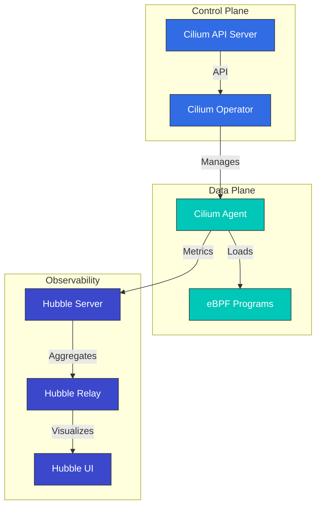

# Cilium 深度解析：云原生网络的未来

## 概述

本节将帮助你全面理解 Cilium 的核心概念和技术。我们将深入探讨 Cilium 的架构、eBPF 技术、网络模型、安全功能等。

> **支持的版本**: Cilium 1.17, 1.18
> **Kubernetes 兼容性**: 1.32 及以上
> **最后更新**: August 10, 2026

### 2026 年 7 月更新：补丁版本与 NetworkPolicy 安全问题

2026 年 7 月 16 日，Cilium 1.19.6、1.18.12 和 1.17.18 补丁版本发布。除了新增 Gateway API 访问日志配置支持（`CiliumGatewayClassConfig` 中的 `spec.telemetry.accessLogs`）外，这些版本还修复了一个可能在 agent 重启/升级期间短暂中断已建立连接的回归问题，以及一个 ClusterMesh bug：`service.cilium.io/affinity: "none"` 注解会导致流量黑洞。

还请注意 **CVE-2026-56743** 安全问题：在使用非默认 `clusterName` 的 Cilium 1.19.0-1.19.4 中，仅使用 `ipBlock` 规则（不含 pod/namespace selector）的 Kubernetes NetworkPolicy 可能会意外允许来自同一 namespace 中其他 workload 的流量。请升级到 1.19.5 或更高版本。详情请参阅[安全公告](https://github.com/cilium/cilium/security/advisories/GHSA-fm8w-2m5w-9j7r)。

2026 年 7 月 21 日，[Cilium 1.20.0-rc.1](https://github.com/cilium/cilium/releases/tag/v1.20.0-rc.1) 发布——这是即将发布的 1.20 次要版本的第二个 release candidate，继 7 月 14 日发布的 rc.0 之后。

### 2026 年 8 月更新：Cilium 1.20.0 GA

2026 年 7 月 29 日，[Cilium 1.20.0](https://github.com/cilium/cilium/releases/tag/v1.20.0) 发布——汇集了来自 1,100 多位贡献者的超过 2,660 个新提交。亮点包括：

- **Gateway API v1.6.1**：支持新近 GA 的 TCPRoute/UDPRoute、用于后端 TLS 的 `BackendTLSPolicy`、用于委托 listener 管理的 ListenerSets、`ExternalAuth` filter（GEP-1494）以及原生 CORS 支持
- **网络**：无需 fork 即可扩展 eBPF datapath 的 datapath plugin、自动 netkit 选择（`bpf.datapathMode=auto`），以及适用于 dual-stack cluster 的 IPv6 egress gateway IP
- **IPAM**：AWS ENI IPAM 的 IPv6 支持（Beta），以及从 cluster-pool 到 multi-pool IPAM 的原地迁移
- **Services/ClusterMesh**：`PreferSameZone`/`PreferSameNode` 流量分发、通过 `service.cilium.io/weight` 注解实现加权 Maglev backend，以及稳定的 Multi-Cluster Services (MCS) API 支持
- **安全**：支持带有 Admin/Baseline tier 的 Kubernetes ClusterNetworkPolicy (KCNP)、通过内部 CA 或 SPIRE 提供 ztunnel identity，以及新的 `cluster-mesh` policy entity
- **性能**：`cilium-cni` 二进制文件从约 77 MB 缩小至 16 MB，此外还包括聚合的 load-balancer state 和针对大型 cluster 优化的 BPF policy-map encoding

如果你使用 legacy Mutual Authentication、Envoy Go extension、Kafka-aware policy、`cilium.io/v2alpha1` `CiliumNodeConfig` API、libnetwork integration 或自定义 CNI 配置，请在升级期间采取相应措施——请参阅[升级指南](https://docs.cilium.io/en/v1.20/operations/upgrade/#upgrade-notes)。下一周期的首个预发布版本 1.21.0-pre.0 于 8 月 3 日发布。

## Cilium 1.18 的主要改进

Cilium 1.18 带来了以下主要功能改进和新能力：

### 网络改进
- **增强的 BGP Control Plane**：更灵活、可扩展的 BGP 配置
- **改进的 Multi-cluster Routing**：优化的 cluster 间通信性能
- **增强的 Service Mesh 集成**：与 Envoy proxy 更好地集成

### 安全增强
- **增强的 Network Policy**：更精细的 policy control 和性能改进
- **改进的加密选项**：优化的 WireGuard 和 IPsec 加密性能

### 可观测性改进
- **Hubble 改进**：更丰富的指标和 tracing 信息
- **增强的 Prometheus 集成**：新增 metrics 和 dashboard
- **改进的 Flow Logging**：更详细的网络流量信息

### 性能优化
- **eBPF Program 优化**：更快的数据包处理
- **内存使用改进**：在大规模 cluster 中具有更好的资源效率
- **CPU 使用优化**：更低的开销

## 简介

Cilium 是面向 Kubernetes、Docker 和 Mesos 等 Linux container 管理平台的开源网络、安全和可观测性解决方案。Cilium 基于 eBPF（extended Berkeley Packet Filter）技术，相比传统 Linux 网络方法，提供了更强大、更高效的网络和安全功能。

### 什么是 eBPF？

eBPF 是一种技术，类似于 Linux kernel 内部的沙箱化虚拟机，允许在不修改 kernel 代码的情况下在 kernel 中安全地执行程序。这使得网络数据包处理、system call 监控和性能分析等各种任务能够高效执行。

eBPF 的主要特性：
- 通过 kernel space 执行实现高性能
- 通过 JIT（Just-In-Time）编译实现原生性能
- 安全的执行环境（通过 verifier 进行 program 验证）
- 支持动态加载和卸载

### Cilium 的主要优势

1. **高性能网络**：使用 eBPF 实现高效的数据包处理
2. **细粒度 Network Policy**：支持 L3-L7 级别的网络 policy
3. **透明加密**：node 之间的透明 IPsec 或 WireGuard 加密
4. **Load Balancing**：基于 XDP（eXpress Data Path）的高性能 load balancing
5. **可观测性**：通过 Hubble 实现网络流量可见性
6. **Service Mesh**：无需现有 sidecar 的 L7 流量管理
7. **Multi-Cluster Networking**：cluster 之间的透明连接
8. **BGP 支持**：与外部网络集成

### 与现有 CNI 的比较

| 功能 | Cilium | Calico | Flannel | AWS VPC CNI |
|---------|--------|--------|---------|-------------|
| 网络模型 | eBPF | iptables/IPVS | VXLAN/host-gw | AWS ENI |
| Network Policy | L3-L7 | L3-L4 | 有限 | AWS Security Groups |
| 加密 | IPsec/WireGuard | IPsec | 无 | 无 |
| 可观测性 | Hubble | Flow Logs | 有限 | VPC Flow Logs |
| Service Mesh | 内置 | 需要 Istio | 需要 Istio | 需要 Istio/AppMesh |
| 性能 | 极高 | 高 | 中等 | 高 |
| Multi-Cluster | 内置 | 有限 | 无 | 需要 Transit Gateway |

## 架构

Cilium 由基于 eBPF 的 data plane 和与 Kubernetes 集成的 control plane 组成。



### 主要组件

1. **Cilium Agent**：在每个 node 上运行，加载和管理 eBPF program
2. **Cilium Operator**：管理 cluster 级资源和操作
3. **eBPF Programs**：加载到 kernel 中以进行数据包处理和 policy enforcement
4. **Hubble**：提供网络流量监控和可观测性
5. **Cilium CLI**：用于管理 Cilium 和 Hubble 的 command-line tool

### 网络模型

Cilium 支持多种网络模式：

1. **Direct Routing**：node 之间的直接路由（BGP 或 static routing）
2. **Tunneling**：通过 VXLAN 或 Geneve tunnel 实现 overlay networking
3. **AWS ENI**：在 Amazon EKS 上使用 Elastic Network Interface (ENI)
4. **Azure IPAM**：在 Azure AKS 上使用 Azure IPAM

### 数据包流

Cilium 中的数据包处理方式：

1. 数据包到达 network interface
2. eBPF XDP program 执行初始处理（DDoS defense、load balancing）
3. eBPF TC（Traffic Control）program 应用 network policy
4. 数据包被传递到 container network namespace
5. 响应数据包通过类似路径处理

## 与 Amazon EKS 集成

在 Amazon EKS 上使用 Cilium 的主要方式有两种：

1. **作为 Amazon EKS Add-on 安装**：Amazon EKS 提供 Cilium 作为托管 add-on。
2. **手动安装**：直接使用 Helm chart 安装。

### 作为 Amazon EKS Add-on 安装

```bash
# Install Cilium add-on
aws eks create-addon \
  --cluster-name my-cluster \
  --addon-name cilium \
  --addon-version v1.17.0-eksbuild.1 \
  --service-account-role-arn arn:aws:iam::123456789012:role/AmazonEKSCiliumAddonRole

# Check add-on status
aws eks describe-addon \
  --cluster-name my-cluster \
  --addon-name cilium
```

### 使用 Helm 手动安装

```bash
# Add Cilium Helm repository
helm repo add cilium https://helm.cilium.io/

# Update Helm repository
helm repo update

# Install Cilium
helm install cilium cilium/cilium \
  --version 1.17.0 \
  --namespace kube-system \
  --set eni.enabled=true \
  --set ipam.mode=eni \
  --set egressMasqueradeInterfaces=eth0 \
  --set tunnel=disabled
```

### EKS 专用配置选项

在 EKS 中使用 Cilium 时需要考虑的主要配置选项：

1. **ENI Mode**：使用 AWS Elastic Network Interface 充分发挥原生 AWS 网络性能
2. **IPAM Mode**：与 AWS VPC IP 地址管理集成
3. **Encryption**：node 间流量加密（WireGuard 或 IPsec）
4. **NodeLocal DNSCache**：提升 DNS 性能
5. **Hubble**：启用网络可观测性

### ENI Mode 配置

```yaml
apiVersion: v1
kind: ConfigMap
metadata:
  name: cilium-config
  namespace: kube-system
data:
  enable-endpoint-routes: "true"
  auto-create-cilium-node-resource: "true"
  ipam: "eni"
  eni-tags: "{\"Owner\": \"Cilium\"}"
  tunnel: "disabled"
  enable-ipv4: "true"
  enable-ipv6: "false"
  egress-masquerade-interfaces: "eth0"
```

### 在 EKS Cluster 上安装 Cilium

#### 在现有 EKS Cluster 上安装 Cilium

```bash
# Remove AWS CNI
kubectl delete daemonset -n kube-system aws-node

# Install Cilium
cilium install --set eni.enabled=true \
  --set ipam.mode=eni \
  --set egressMasqueradeInterfaces=eth0 \
  --set tunnel=disabled
```

#### 使用 Cilium CNI 创建新的 EKS Cluster

```bash
eksctl create cluster --name cilium-cluster \
  --without-nodegroup

eksctl create nodegroup --cluster cilium-cluster \
  --node-ami-family AmazonLinux2 \
  --node-type m5.large \
  --nodes 3 \
  --max-pods-per-node 110

# Install Cilium
cilium install --set eni.enabled=true \
  --set ipam.mode=eni \
  --set egressMasqueradeInterfaces=eth0 \
  --set tunnel=disabled
```

### EKS Cluster 互连

使用 Cilium Cluster Mesh 实现 EKS cluster 互连：

```bash
# On cluster 1
cilium clustermesh enable --service-type LoadBalancer

# On cluster 2
cilium clustermesh enable --service-type LoadBalancer

# Connect clusters
cilium clustermesh connect --context cluster1 --destination-context cluster2
```

## 安装和配置

### 前提条件

- Kubernetes cluster（v1.16 或更高版本）
- Linux kernel 4.9 或更高版本（推荐：5.4 或更高版本）
- 已配置 kubectl
- Helm（可选）

### 安装 Cilium CLI

```bash
curl -L --remote-name-all https://github.com/cilium/cilium-cli/releases/latest/download/cilium-linux-amd64.tar.gz
sudo tar xzvfC cilium-linux-amd64.tar.gz /usr/local/bin
rm cilium-linux-amd64.tar.gz
```

### 配置选项

#### 网络模式配置

Direct routing mode：
```bash
cilium install --set tunnel=disabled --set autoDirectNodeRoutes=true
```

VXLAN mode：
```bash
cilium install --set tunnel=vxlan
```

#### kube-proxy 替换配置

完全替换模式：
```bash
cilium install --set kubeProxyReplacement=strict
```

#### 加密配置

WireGuard 加密：
```bash
cilium install --set encryption.enabled=true --set encryption.type=wireguard
```

IPsec 加密：
```bash
cilium install --set encryption.enabled=true --set encryption.type=ipsec
```

## Network Policy

Cilium 扩展了 Kubernetes NetworkPolicy API，以提供 L3-L7 级别的细粒度网络 policy。

### 基础 Network Policy

```yaml
apiVersion: networking.k8s.io/v1
kind: NetworkPolicy
metadata:
  name: allow-frontend-to-backend
  namespace: app
spec:
  podSelector:
    matchLabels:
      app: backend
  ingress:
  - from:
    - podSelector:
        matchLabels:
          app: frontend
    ports:
    - port: 8080
      protocol: TCP
```

### Cilium Network Policy

```yaml
apiVersion: cilium.io/v2
kind: CiliumNetworkPolicy
metadata:
  name: allow-specific-http-methods
  namespace: app
spec:
  endpointSelector:
    matchLabels:
      app: backend
  ingress:
  - fromEndpoints:
    - matchLabels:
        app: frontend
    toPorts:
    - ports:
      - port: "8080"
        protocol: TCP
      rules:
        http:
        - method: "GET"
          path: "/api/v1/products"
```

### 基于 FQDN 的 Policy

```yaml
apiVersion: cilium.io/v2
kind: CiliumNetworkPolicy
metadata:
  name: allow-specific-domains
  namespace: app
spec:
  endpointSelector:
    matchLabels:
      app: web
  egress:
  - toFQDNs:
    - matchName: "api.example.com"
    - matchPattern: "*.amazonaws.com"
    toPorts:
    - ports:
      - port: "443"
        protocol: TCP
```

## 使用 Hubble 实现可观测性

Hubble 是 Cilium 的可观测性层，支持对通过 eBPF 收集的网络流量数据进行可视化和分析。

### 安装 Hubble

```bash
cilium hubble enable --ui
```

### 观察网络流量

```bash
# Observe all flows
hubble observe

# Observe flows in specific namespace
hubble observe --namespace app

# Observe HTTP requests
hubble observe --protocol http

# Observe flows between pods with specific labels
hubble observe --from-label app=frontend --to-label app=backend

# Observe failed connections
hubble observe --verdict DROPPED
```

### Prometheus 集成

```bash
cilium hubble enable --metrics="{dns:query;ignoreAAAA,drop:sourceContext=pod;destinationContext=pod,tcp,flow,icmp,http}"
```

## Cilium 测试

```bash
# Basic connectivity test
cilium connectivity test

# Run specific test
cilium connectivity test --test=client-to-echo-service

# Network performance test
cilium connectivity test --test=performance
```

## 最佳实践

### 性能优化

1. **Kernel Version 优化**：使用 Linux kernel 5.4 或更高版本
2. **启用 BBR Congestion Control**：提高网络吞吐量
3. **启用 XDP Acceleration**：提高数据包处理性能
4. **MTU 优化**：设置适合网络环境的 MTU

```bash
cilium install --set bpf.preallocateMaps=true \
  --set bpf.masquerade=true \
  --set devices=eth0 \
  --set loadBalancer.acceleration=native \
  --set loadBalancer.mode=dsr
```

### 安全加固

1. **应用 Default Deny Policy**：仅允许明确许可的流量
2. **启用 Encryption**：加密 node 间流量
3. **应用 Least Privilege Principle**：设计仅允许必要通信的 policy

### 改进可观测性

```bash
cilium hubble enable --metrics="{dns,drop,tcp,flow,http}"
```

## 故障排除

### 连接问题

```bash
# Check Cilium status
cilium status

# Check endpoint status
cilium endpoint list

# Review network policies
kubectl get cnp,ccnp -A

# Analyze flows
hubble observe --verdict DROPPED
```

### 性能问题

```bash
# Check eBPF map status
cilium bpf maps list

# Monitor system resources
cilium metrics list
```

### 调试工具

```bash
# Check status
cilium status --verbose

# Collect environment information
cilium sysdump

# Cilium agent logs
kubectl logs -n kube-system -l k8s-app=cilium
```

## 深度解析目录

**[Cilium 简介和基础概念](01-introduction.md)**
- Cilium 概述和历史
- Container Networking 基础
- 理解 CNI（Container Network Interface）
- Cilium 的差异化功能

**[eBPF 技术深度解析](02-ebpf.md)**
- eBPF 技术和历史简介
- eBPF 在 Kernel 内部的工作原理
- eBPF Program 类型和 Map
- 在 Cilium 中使用 eBPF

**[网络模型和 VXLAN](03-networking.md)**
- Container Networking 模型比较
- VXLAN 技术深度解析
- Cilium 的 Overlay Networking
- 性能优化技术
- Routing 机制（Encapsulation 与 Native-Routing）
- Cloud Provider Networking（AWS ENI、Google Cloud）

**[IPAM 和 Network Policy](04-ipam-policy.md)**
- IP Address Management (IPAM) 策略
- Kubernetes 和 Cilium IPAM 集成
- Network Policy 设计和实现
- Multi-Cluster 场景
- IPAM Mode 深度解析（Cluster Scope、Kubernetes Host Scope、Multi-Pool）
- Cloud Provider IPAM（Azure IPAM、AWS ENI、GKE）
- 基于 CRD 的 IPAM

**[L2-L7 网络和 Load Balancing](05-l2-l7-networking.md)**
- 理解 OSI Model 层级（L2、L3、L4、L7）
- Cilium 的分层功能
- Service Mesh 集成
- Load Balancing 架构
- Masquerading 配置和实现模式
- IPv4 Fragment 处理

**[安全与可见性](06-security-visibility.md)**
- Cilium 的安全功能
- 网络可见性和监控
- Hubble 架构和使用
- 实时威胁检测

**[高级主题和真实案例](07-advanced-topics.md)**
- 性能调优和故障排除
- 大规模部署策略
- 真实使用案例研究
- 未来路线图和发展方向

## 其他资源

- [网络概念深度解析](networking-concepts.md)
- [术语表和缩写](glossary.md)

## 参考资料

- [Cilium 官方文档](https://docs.cilium.io/)
- [Cilium GitHub Repository](https://github.com/cilium/cilium)
- [eBPF 文档](https://ebpf.io/)
- [Hubble 文档](https://github.com/cilium/hubble)
- [Cilium Network Policy Editor](https://editor.cilium.io/)
- [AWS EKS Workshop - Cilium](https://www.eksworkshop.com/beginner/115_cilium/)

## 测验

要测试你在本节中学到的内容，请尝试 [Cilium 深度解析测验](../../quizzes/networking/cilium/01-introduction-quiz.md)。
