# 深入了解网络概念

> **最后更新**: February 22, 2026

本文深入讲解理解 Cilium 所需的核心网络概念。本文探讨构成 Cilium 基础的技术概念，包括容器网络、覆盖网络和路由协议。

## 学习目标

通过本文，您将了解：
- OSI 模型和 TCP/IP 协议栈的基本结构，以及各层的作用
- 容器网络的基本原理和实现方法
- 覆盖网络与底层网络之间的差异
- NAT、路由和 DNS 等核心网络概念如何在 Cilium 中使用

## 目录

1. [OSI 模型和 TCP/IP 协议栈](#osi-model-and-tcpip-stack)
2. [容器网络基础](#container-networking-basics)
3. [覆盖网络](#overlay-networks)
4. [网络地址转换 (NAT)](#network-address-translation-nat)
5. [路由协议](#routing-protocols)
6. [DNS 和服务发现](#dns-and-service-discovery)
7. [负载均衡概念](#load-balancing-concepts)
8. [网络安全基础](#network-security-basics)

## OSI 模型和 TCP/IP 协议栈

> **关键概念**：OSI 模型是一个将网络通信划分为 7 个抽象层的概念框架，使复杂的网络过程更易于理解。

OSI（开放系统互连）模型是一个将网络通信划分为 7 个抽象层的概念框架。每一层负责特定的网络功能，从而可将复杂的网络过程拆分，以便于理解。

### OSI 模型与 TCP/IP 模型对比

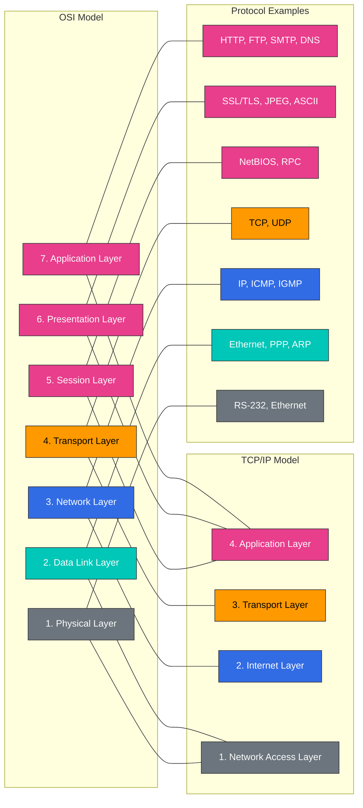

### OSI 7 层模型

1. **物理层**
   - 将比特流转换为电信号、光信号或无线信号
   - 包含线缆、交换机和集线器等物理设备
   - 数据单元：比特

2. **数据链路层**
   - 负责物理网络中节点之间的数据传输
   - 使用 MAC（媒体访问控制）地址进行设备识别
   - 错误检测和纠正
   - 数据单元：帧
   - Ethernet 和 Wi-Fi 协议在此层运行

3. **网络层**
   - 负责不同网络之间的数据包路由
   - 逻辑寻址（IP 地址）
   - 路径确定和数据包转发
   - 数据单元：数据包
   - IP（互联网协议）是此层的核心协议

4. **传输层**
   - 端到端通信控制
   - 数据分段和重组
   - 流量控制和错误恢复
   - 数据单元：报文段
   - TCP（传输控制协议）和 UDP（用户数据报协议）是此层的主要协议

5. **会话层**
   - 通信会话的建立、维护和终止
   - 同步和对话控制
   - 检查点设置和恢复
   - NetBIOS 和 RPC（远程过程调用）是此层的示例

6. **表示层**
   - 数据格式转换和加密
   - 字符编码、数据压缩、加密/解密
   - SSL/TLS、JPEG、ASCII 是此层的示例

7. **应用层**
   - 提供用户界面和应用服务
   - 电子邮件、文件传输、Web 浏览等服务
   - HTTP、FTP、SMTP、DNS 是此层的示例

### Cilium 与 OSI 模型的关系

Cilium 在多个 OSI 层运行：

| OSI 层 | Cilium 功能 | 示例 |
|-----------|----------------|---------|
| L2（数据链路） | ARP 处理、MAC 过滤 | 节点之间的 MAC 地址验证 |
| L3（网络） | IP 路由、基于 CIDR 的策略 | Pod 之间的 IP 路由 |
| L4（传输） | 基于端口的过滤、连接跟踪 | Service 端口访问控制 |
| L7（应用） | HTTP、gRPC、Kafka 过滤 | 基于 API 路径的访问控制 |

### TCP/IP 协议栈

TCP/IP 协议栈是一组构成互联网基础的协议，也是 OSI 模型的简化 4 层模型。

1. **网络接口层**
   - 对应 OSI 模型的物理层和数据链路层
   - 负责与物理网络介质的接口
   - 包括 Ethernet 和 Wi-Fi 等协议

2. **互联网层**
   - 对应 OSI 模型的网络层
   - 使用 IP（互联网协议）进行数据包路由
   - 包括 ICMP（互联网控制消息协议）和 ARP（地址解析协议）

3. **传输层**
   - 与 OSI 模型的传输层相同
   - 包括 TCP 和 UDP 协议
   - 提供面向连接（TCP）和无连接（UDP）的通信

4. **应用层**
   - 整合 OSI 模型的会话层、表示层和应用层
   - 包括 HTTP、SMTP、FTP、DNS 等协议
   - 提供用户应用程序与网络之间的接口

### 按层划分的 Cilium 功能

Cilium 在不同网络层提供功能：

- **L2（数据链路层）**：基于 MAC 地址的过滤、ARP 欺骗防护
- **L3（网络层）**：基于 IP 地址的路由和过滤、IPAM
- **L4（传输层）**：基于端口的过滤、负载均衡、连接跟踪
- **L7（应用层）**：针对 HTTP、gRPC、Kafka 等的协议感知过滤和负载均衡

## 容器网络基础

容器网络是一种使容器化应用程序能够相互通信并与外部世界通信的机制。Kubernetes 等容器编排平台使用各种网络模型和解决方案。

### 容器网络接口 (CNI)

CNI（容器网络接口）定义了容器运行时与网络插件之间的标准接口。这使得各种网络解决方案能够集成到容器平台中。

#### CNI 的关键组件：

1. **插件**：负责创建和配置网络接口的可执行文件
2. **配置文件**：定义插件行为的 JSON 格式文件
3. **IPAM（IP 地址管理）**：负责 IP 地址分配和管理的模块

#### CNI 插件的主要职责：

- 向容器网络命名空间添加/从中移除接口
- 分配和释放 IP 地址
- 配置路由表
- 应用网络策略

### 容器网络模型

容器网络模型有多种，每种模型都适用于不同的用例和需求。

#### 1. Bridge 网络

- 在主机上创建虚拟网桥来连接容器
- 每个容器通过虚拟 Ethernet（veth）对连接到网桥
- 同一主机上容器之间的高效通信
- Docker 的默认网络模式

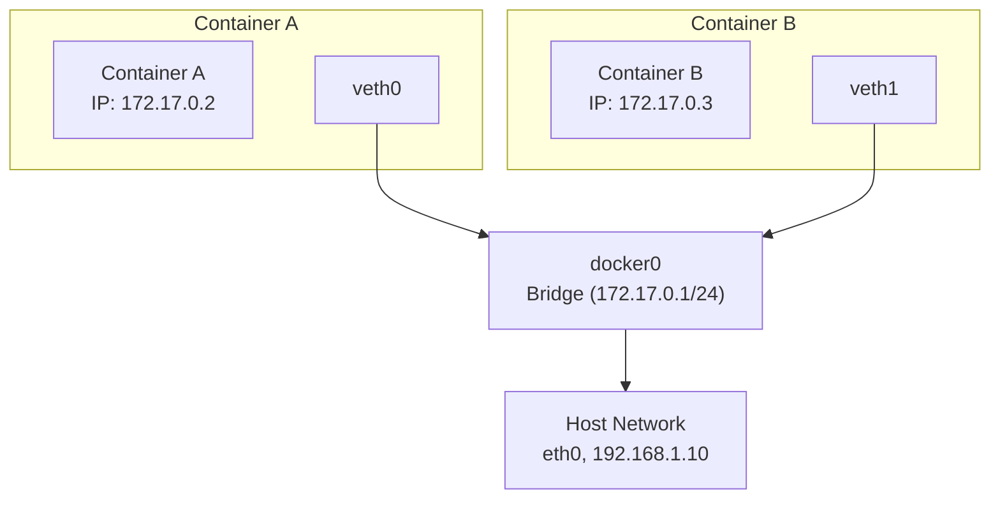

#### 2. Host 网络

- 容器直接使用主机的网络命名空间
- 没有独立的网络隔离
- 提供最佳网络性能
- 可能发生端口冲突

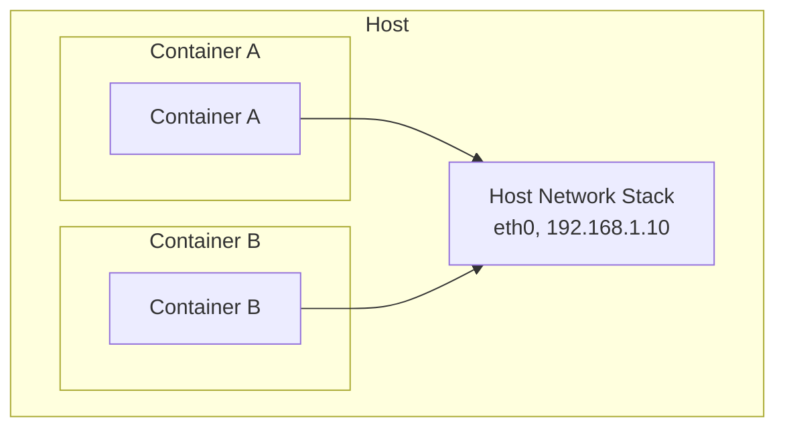

#### 3. 覆盖网络

- 支持跨多个主机的容器之间通信
- 使用 VXLAN 和 GENEVE 等封装协议
- 适用于大规模集群
- 得到 Cilium、Calico、Flannel 等支持

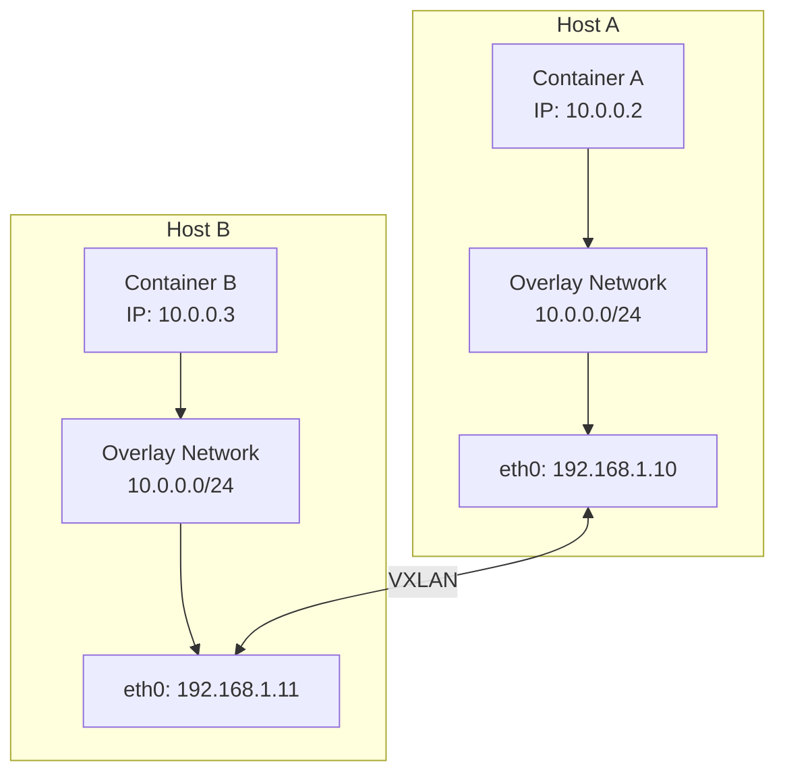

#### 4. 底层网络（直接路由）

- 直接利用物理网络基础设施
- 没有封装开销
- 需要能够控制网络基础设施
- 可与 BGP 等路由协议集成

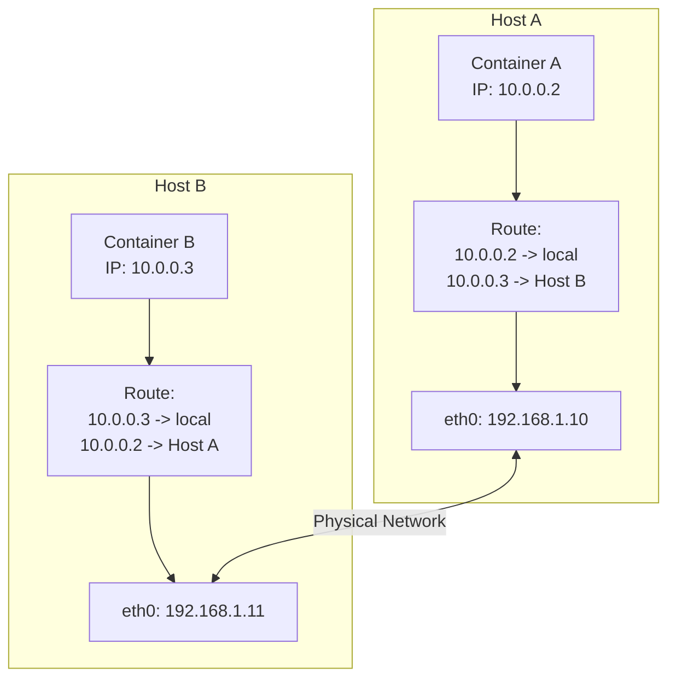

### Kubernetes 网络模型

Kubernetes 的一项基本要求是所有 Pod 必须能够在不使用 NAT 的情况下相互通信。为实现这一目标，它定义了以下网络模型：

1. **Pod 到 Pod 通信**：所有 Pod 必须能够在不使用 NAT 的情况下相互通信
2. **Node 到 Pod 通信**：Node 必须能够在不使用 NAT 的情况下与所有 Pod 通信
3. **Pod 到外部通信**：Pod 必须能够与外部网络通信（通常使用 NAT）

#### Kubernetes 网络组件：

1. **Pod 网络**：连接集群中所有 Pod 的网络
2. **Service 网络**：为一组 Pod 提供稳定端点
3. **集群 DNS**：用于服务发现的 DNS 服务
4. **Ingress/Egress**：管理与集群外部的通信

### Cilium 的容器网络方法

Cilium 利用 eBPF 提供高性能、可扩展的容器网络解决方案：

1. **基于 eBPF 的数据路径**：直接在内核中处理数据包
2. **支持多种网络模式**：覆盖网络（VXLAN、Geneve）和底层网络（直接路由）
3. **高级负载均衡**：kube-proxy 替代功能
4. **网络策略**：L3-L7 层级的细粒度策略
5. **集成 IPAM**：支持多种 IP 地址分配策略

## 覆盖网络

覆盖网络是一种在现有网络基础设施之上构建虚拟网络层的技术。这项技术使创建虚拟网络拓扑时无需依赖物理网络拓扑成为可能。在容器环境中，它被广泛用于实现跨多个主机的容器通信。

### 覆盖网络的工作原理

覆盖网络使用封装技术工作。原始数据包被封装在其他数据包内，并通过物理网络传输。

1. **数据包封装**：原始数据包（内部数据包）会被包裹上新的报头，有时还会加上新的报尾。
2. **隧道传输**：封装后的数据包通过物理网络传输到目标主机。
3. **数据包解封装**：在目标主机上，移除外部报头并提取原始数据包。
4. **数据包转发**：将原始数据包转发到目标容器。

### 主要覆盖网络协议

#### VXLAN（虚拟可扩展 LAN）

VXLAN 是容器网络中最广泛使用的覆盖协议之一。

- **VXLAN 隧道端点 (VTEP)**：负责数据包的封装和解封装
- **VXLAN 网络标识符 (VNI)**：最多支持 16,777,216 个虚拟网络
- **UDP 封装**：VXLAN 数据包通过 UDP 端口 4789 传输
- **MAC-in-UDP 封装**：将原始 L2 帧封装到 UDP 数据包中

VXLAN 数据包结构：
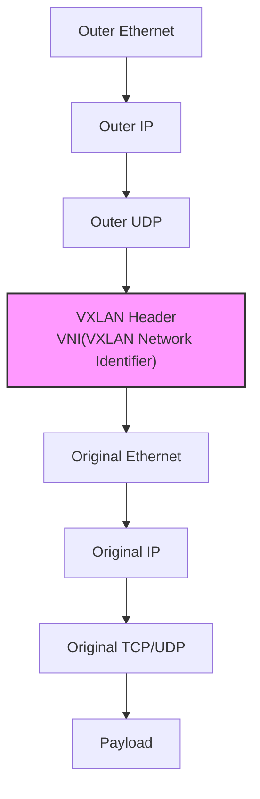

#### GENEVE（通用网络虚拟化封装）

GENEVE 是一种更灵活的覆盖协议，旨在克服 VXLAN 的限制。

- **可扩展选项报头**：支持各种元数据
- **协议无关**：可与各种虚拟化技术一起使用
- **UDP 封装**：通过 UDP 端口 6081 传输
- **灵活隧道传输**：支持各种网络虚拟化需求

#### IPsec

IPsec 是一组在 IP 数据包层提供安全服务的协议。

- **身份验证和加密**：确保数据完整性和机密性
- **传输和隧道模式**：支持各种部署场景
- **安全关联 (SA)**：定义通信方之间的安全参数
- **互联网密钥交换 (IKE)**：自动化安全密钥管理

### 覆盖网络的优缺点

#### 优点：

- **灵活性**：可独立于物理网络拓扑配置虚拟网络
- **可扩展性**：支持大型网络段和众多端点
- **隔离性**：在不同租户或应用程序之间提供网络隔离
- **兼容性**：可与现有网络基础设施配合使用

#### 缺点：

- **开销**：封装会增加数据包大小和处理开销
- **MTU 注意事项**：封装会降低最大传输单元（MTU）
- **复杂性**：故障排除和调试可能更加复杂
- **延迟**：封装和解封装期间会略微增加延迟

### Cilium 中的覆盖网络

Cilium 支持 VXLAN 和 Geneve 等覆盖协议，并利用 eBPF 提供高效的数据包处理。

- **基于 eBPF 的 VXLAN 处理**：直接在内核中进行数据包封装和解封装
- **高效路由**：通过优化路径转发数据包
- **加密选项**：通过 IPsec 或 WireGuard 加密覆盖网络
- **与直接路由混合使用**：可根据需要组合覆盖网络和直接路由

#### Cilium VXLAN 配置示例：

```yaml
apiVersion: v1
kind: ConfigMap
metadata:
  name: cilium-config
  namespace: kube-system
data:
  tunnel: "vxlan"
  enable-ipv4: "true"
  enable-ipv6: "false"
  ipv4-range: "10.0.0.0/16"
  ipv4-tunnel-endpoint-selector: "kubernetes.io/hostname"
```

## 网络地址转换 (NAT)

网络地址转换（NAT）是修改 IP 数据包源地址或目标地址的过程。NAT 主要用于使私有网络中的设备能够与公共互联网通信，或使两个网络地址空间重叠的网络之间能够通信。

### NAT 的主要类型

#### 1. 源 NAT (SNAT)

源 NAT 修改数据包的源 IP 地址。它通常用于私有网络中的设备访问互联网时。

- **工作原理**：将内部主机的私有 IP 地址转换为公共 IP 地址
- **用例**：互联网访问、出站连接
- **跟踪**：在 NAT 表中存储连接状态

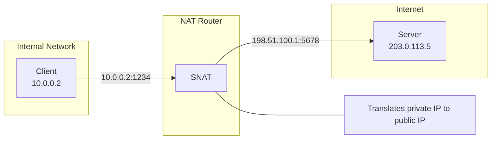

#### 2. 目标 NAT (DNAT)

目标 NAT 修改数据包的目标 IP 地址。它通常用于从公共互联网访问私有网络上的服务时。

- **工作原理**：将公共 IP 地址转换为内部主机的私有 IP 地址
- **用例**：端口转发、负载均衡、入站连接
- **配置**：为特定端口或端口范围定义映射

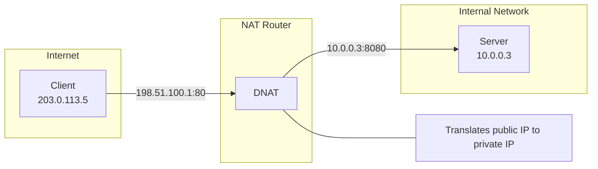

#### 3. 端口地址转换 (PAT)

PAT 同时修改 IP 地址和端口号。这使多个内部主机能够共享一个公共 IP 地址。

- **工作原理**：将内部主机的 IP:port 组合转换为单个公共 IP 的不同端口
- **用例**：节约 IP 地址、支持大量内部主机
- **限制**：受可用端口数量限制（约 65,000 个）

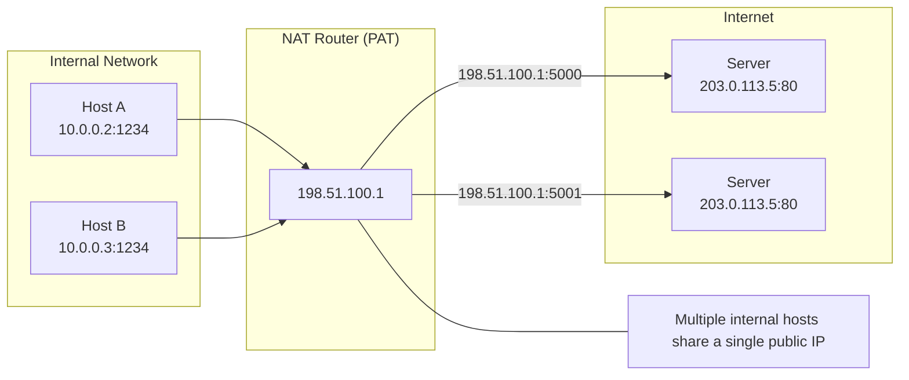

#### 4. 双向 NAT

双向 NAT 同时修改源地址和目标地址。这使两个网络地址空间重叠的网络之间能够通信。

- **工作原理**：双向进行地址转换
- **用例**：网络合并、地址空间冲突解决
- **复杂性**：配置和维护更复杂

### NAT 的优缺点

#### 优点：

- **节约 IP 地址**：使用有限数量的公共 IP 地址支持大量内部主机
- **增强安全性**：隐藏内部网络拓扑
- **网络隔离**：可以连接地址空间重叠的网络
- **灵活的网络设计**：无需重新配置内部网络即可更换 ISP

#### 缺点：

- **连接跟踪开销**：维护状态表需要资源
- **某些协议问题**：部分协议可能与 NAT 不兼容
- **端到端连接丢失**：直接点对点通信存在困难
- **复杂的故障排除**：调试 NAT 相关问题可能很复杂

### Kubernetes 和 Cilium 中的 NAT

#### Kubernetes 中的 NAT

Kubernetes 在多种场景中使用 NAT：

1. **集群外通信**：Pod 与集群外部通信时使用 SNAT
2. **Service 实现**：Cluster IP Service 使用 DNAT 将流量重定向到 Pod
3. **NodePort Service**：从 Node IP:port 到 Pod 的 DNAT
4. **LoadBalancer Service**：从外部负载均衡器 IP 到 Pod 的 DNAT

#### Cilium 中的 NAT

Cilium 利用 eBPF 提供高效的 NAT 实现：

1. **基于 eBPF 的 NAT**：直接在内核中执行 NAT
2. **高性能连接跟踪**：使用优化的 BPF map 进行连接状态跟踪
3. **NAT 策略**：可定义细粒度的 NAT 规则
4. **伪装**：Pod 与集群外部通信时自动执行 SNAT

#### Cilium NAT 配置示例：

```yaml
apiVersion: v1
kind: ConfigMap
metadata:
  name: cilium-config
  namespace: kube-system
data:
  # Enable masquerading for communication outside the cluster
  enable-ipv4-masquerade: "true"

  # Use eBPF-based masquerading
  enable-bpf-masquerade: "true"

  # NAT map size setting
  bpf-nat-global-max: "262144"

  # Exclude specific CIDRs from masquerading
  ipv4-masquerade-exclude-cidr: "10.0.0.0/8,172.16.0.0/12,192.168.0.0/16"
```

## 路由协议

路由协议定义用于确定数据包在网络中从源端到目标端的最佳路径的规则和过程。这些协议对于适应网络拓扑变化、高效转发流量和绕过网络故障发挥着重要作用。

### 路由协议的分类

#### 1. 内部网关协议 (IGP)

内部网关协议用于在单个自治系统 (AS) 内交换路由信息。

##### 距离矢量协议

- **RIP（路由信息协议）**
  - 使用跳数作为度量指标
  - 最大 15 跳限制
  - 实现简单，适用于小型网络
  - 每 30 秒更新整个路由表

- **EIGRP（增强型内部网关路由协议）**
  - 综合考虑带宽、延迟、负载、可靠性的度量指标
  - 仅发送部分更新
  - 快速收敛
  - Cisco 专有协议（原为）

##### 链路状态协议

- **OSPF（开放最短路径优先）**
  - 使用 Dijkstra 算法计算最短路径
  - 基于区域的层次结构
  - 快速收敛
  - 支持大规模网络
  - 通过链路状态通告（LSA）交换拓扑信息

- **IS-IS（中间系统到中间系统）**
  - 与 OSPF 类似的链路状态协议
  - 广泛用于大型服务提供商网络
  - 支持多个网络层
  - 高效的路由更新

#### 2. 外部网关协议 (EGP)

外部网关协议用于在不同自治系统之间交换路由信息。

- **BGP（边界网关协议）**
  - 互联网的核心路由协议
  - 路径矢量协议
  - 基于策略的路由决策
  - 基于 TCP 的可靠会话
  - 通过路径属性（AS 路径、本地优先级等）选择路径
  - 包含 iBGP（内部 BGP）和 eBGP（外部 BGP）变体

### 容器网络中的路由协议

在容器环境中，传统路由协议与容器特定的路由机制一起使用。

#### 1. 使用 BGP 的容器网络

BGP 因以下原因在容器网络中日益普及：

- **直接路由**：无需覆盖网络开销即可直接路由 Pod IP
- **可扩展性**：支持大规模集群和多集群环境
- **现有网络集成**：与数据中心网络基础设施集成
- **高可用性**：支持多条路径和快速故障转移

#### 2. 容器网络路由机制

- **基于主机的路由**：每个 Node 为其自身的 Pod CIDR 通告路由信息
- **集中式路由**：Controller 集中管理路由决策
- **分布式路由**：Node 之间直接交换路由信息
- **基于策略的路由**：根据流量特征进行路由决策

### Cilium 中的路由

Cilium 使用 eBPF 实现高效路由，并支持多种路由模式。

#### 1. 原生路由（直接路由）

在原生路由模式中，Cilium 直接路由 Pod IP，无需覆盖封装。

- **工作原理**：每个 Node 为其 Pod CIDR 通告路由信息
- **优点**：无封装开销，性能最佳
- **要求**：Node 之间需要可路由的网络
- **用例**：性能关键型工作负载、单子网集群

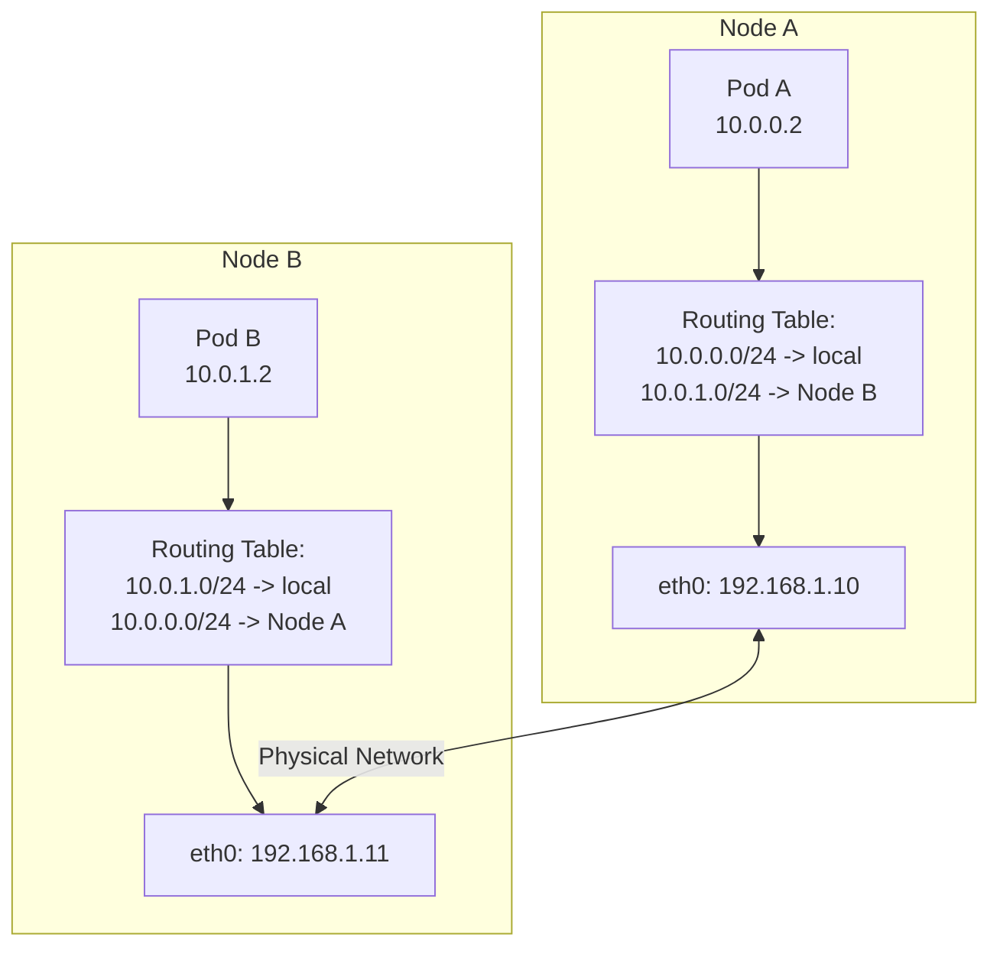

#### 2. BGP 路由

Cilium 支持 BGP 路由，以将 Pod IP 与物理网络基础设施集成。

- **工作原理**：Cilium 通过 BGP 对等连接通告 Pod CIDR
- **优点**：与现有网络基础设施集成、高可用性
- **组件**：BGP 对等连接、路由过滤、社区属性
- **用例**：与数据中心网络集成、多集群环境

#### 3. 覆盖路由

Cilium 可以使用 VXLAN 或 Geneve 等覆盖协议在 Node 之间路由 Pod 流量。

- **工作原理**：封装 Pod 数据包以在 Node 之间传输
- **优点**：最小化网络基础设施要求、部署灵活
- **用例**：云环境、复杂网络拓扑

#### 4. 混合路由

Cilium 支持结合直接路由和覆盖路由的混合方法。

- **工作原理**：尽可能使用直接路由，否则使用覆盖网络
- **优点**：平衡性能与灵活性
- **用例**：混合网络环境、云和本地部署

### Cilium 路由配置示例

#### 原生路由配置：

```yaml
apiVersion: v1
kind: ConfigMap
metadata:
  name: cilium-config
  namespace: kube-system
data:
  tunnel: "disabled"
  enable-auto-direct-node-routes: "true"
  ipv4-native-routing-cidr: "10.0.0.0/16"
```

#### BGP 路由配置：

```yaml
apiVersion: v1
kind: ConfigMap
metadata:
  name: cilium-config
  namespace: kube-system
data:
  tunnel: "disabled"
  enable-bgp: "true"
  bgp-announce-pod-cidr: "true"
  bgp-config-path: "/var/lib/cilium/bgp/config.yaml"
```

#### 覆盖路由配置：

```yaml
apiVersion: v1
kind: ConfigMap
metadata:
  name: cilium-config
  namespace: kube-system
data:
  tunnel: "vxlan"
  enable-ipv4: "true"
  ipv4-range: "10.0.0.0/16"
```

## DNS 和服务发现

DNS（域名系统）和服务发现对于现代网络应用程序至关重要，尤其是在动态容器环境中。这些机制可抽象服务位置，并使应用程序能够适应网络拓扑变化。

### DNS（域名系统）

DNS 是一个将人类可读的域名转换为 IP 地址的分布式系统。

#### DNS 的工作原理

1. **分层命名空间**：域名按由点分隔的层次结构组织（例如 www.example.com）
2. **分布式数据库**：分布在全球各地的 DNS 服务器网络
3. **迭代和递归查询**：处理客户端请求的两种主要方法
4. **缓存**：为提高性能而临时存储结果

#### DNS 记录类型

- **A 记录**：将域名映射到 IPv4 地址
- **AAAA 记录**：将域名映射到 IPv6 地址
- **CNAME 记录**：域名的别名（规范名称）
- **MX 记录**：指定邮件服务器
- **SRV 记录**：指定提供特定服务的服务器
- **TXT 记录**：存储文本信息（主要用于验证和策略）
- **PTR 记录**：将 IP 地址反向映射到域名（反向 DNS）

#### DNS 解析过程

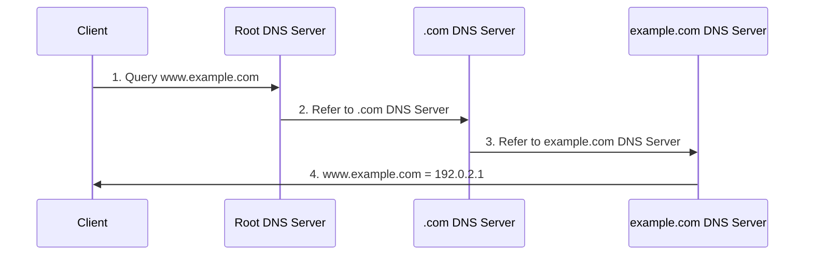

### 容器环境中的服务发现

服务发现是自动检测可用服务并在网络中定位它们的过程。在容器环境中，它对于有效管理动态创建和移除的服务尤为重要。

#### 服务发现方法

1. **基于 DNS 的服务发现**
   - 在注册服务时创建 DNS 记录
   - 客户端通过标准 DNS 查找发现服务
   - 简单且得到广泛支持
   - 示例：Kubernetes DNS、CoreDNS

2. **基于键值存储的服务发现**
   - 将服务信息存储在集中式键值存储中
   - 客户端查询存储以发现服务
   - 支持丰富的元数据
   - 示例：etcd、Consul、ZooKeeper

3. **基于 API 的服务发现**
   - 通过专用 API 提供服务信息
   - 客户端调用 API 以发现服务
   - 支持复杂查询和过滤
   - 示例：Kubernetes API Server

4. **基于 Mesh 的服务发现**
   - Service mesh 基础设施处理服务发现
   - 支持客户端负载均衡和路由
   - 高级流量管理功能
   - 示例：Istio、Linkerd

### Kubernetes 中的 DNS 和服务发现

Kubernetes 提供了集群内服务发现的内置机制。

#### Kubernetes Services

Kubernetes Service 为一组 Pod 提供稳定端点：

- **ClusterIP**：只能在集群内访问的虚拟 IP
- **NodePort**：通过所有 Node 上的特定端口访问
- **LoadBalancer**：通过外部负载均衡器访问
- **ExternalName**：外部 Service 的 DNS 别名

#### Kubernetes DNS

Kubernetes 运行一个集群 DNS 服务（通常为 CoreDNS）以支持服务发现：

- **Service DNS**：`<service-name>.<namespace>.svc.cluster.local`
- **Pod DNS**：`<pod-ip>.<namespace>.pod.cluster.local`
- **无头 Service**：Service 名称解析为所有 Pod IP 的 DNS 记录

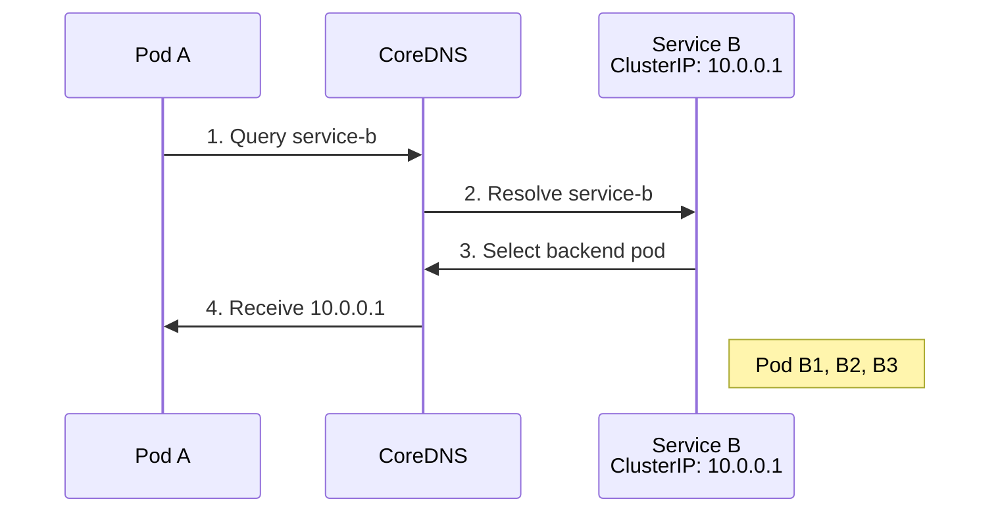

#### Kubernetes 服务发现机制

1. **环境变量**：将活动 Service 的环境变量注入每个 Pod
2. **DNS**：通过集群 DNS 解析 Service 名称
3. **API Server**：通过直接查询 Kubernetes API 获取服务信息
4. **Endpoint 对象**：提供 Service 后端 Pod 的 IP 和端口信息

### Cilium 中的 DNS 和服务发现

Cilium 与 Kubernetes 服务发现机制集成，并提供附加功能。

#### Cilium 的基于 DNS 的策略

Cilium 可基于 DNS 名称定义网络策略：

- **基于 DNS 名称的过滤**：对特定域名进行访问控制
- **通配符支持**：如 `*.example.com` 的模式匹配
- **FQDN 策略**：基于完全限定域名（FQDN）的策略

```yaml
apiVersion: "cilium.io/v2"
kind: CiliumNetworkPolicy
metadata:
  name: "dns-policy"
spec:
  endpointSelector:
    matchLabels:
      app: myapp
  egress:
  - toFQDNs:
    - matchName: "api.example.com"
    - matchPattern: "*.api.example.com"
```

#### Cilium 的服务发现增强功能

Cilium 提供多项增强 Kubernetes 服务发现的功能：

1. **基于 eBPF 的 Service 实现**：
   - kube-proxy 替代
   - 在内核中直接进行 Service 负载均衡
   - 改善性能和功能

2. **全局 Service**：
   - 跨多个集群的服务发现
   - 跨集群负载均衡
   - 统一的服务命名空间

3. **Service 亲和性**：
   - 支持会话亲和性
   - 基于源 IP 一致地选择后端
   - 支持有状态连接

4. **健康检查集成**：
   - 后端健康监控
   - 自动移除不健康的后端
   - 快速故障检测和恢复

#### Cilium Service 配置示例：

```yaml
apiVersion: v1
kind: ConfigMap
metadata:
  name: cilium-config
  namespace: kube-system
data:
  # Enable kube-proxy replacement
  enable-k8s-services: "true"
  kube-proxy-replacement: "strict"

  # Enable DNS policy support
  enable-fqdn-filter: "true"

  # Configure service affinity
  enable-session-affinity: "true"

  # Enable global services
  enable-global-services: "true"
```

## 负载均衡概念

负载均衡是一种将网络流量分配到多个服务器或后端服务的技术，用于优化资源利用率、提高吞吐量、降低延迟并确保高可用性。在容器环境中，有效地在动态变化的后端实例之间分配流量尤为重要。

### 负载均衡的类型

#### 1. L4（传输层）负载均衡

L4 负载均衡基于 IP 地址和端口号等传输层信息分配流量。

- **工作原理**：基于 TCP/UDP 报头信息进行路由决策
- **优点**：处理快速、开销低、可以处理加密流量
- **缺点**：无法根据应用层信息执行高级路由
- **用例**：基于 TCP/UDP 的服务、高性能需求

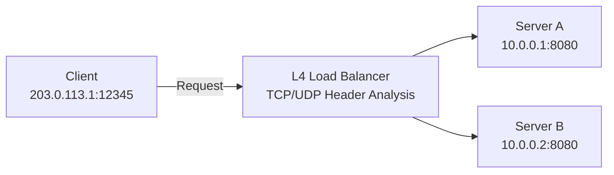

#### 2. L7（应用层）负载均衡

L7 负载均衡基于 HTTP 报头、URL 和 cookie 等应用层信息分配流量。

- **工作原理**：通过检查 HTTP/HTTPS 请求内容进行路由决策
- **优点**：基于内容的路由、高级流量管理、安全功能
- **缺点**：处理开销更高，加密流量需要 SSL 终止
- **用例**：Web 应用程序、微服务、API 网关

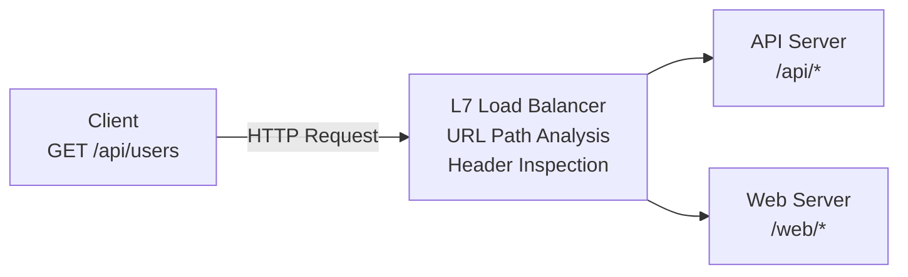

### 负载均衡算法

负载均衡算法决定如何向后端服务器分配流量。

#### 1. 轮询

- **工作原理**：按顺序将请求分配给每个后端服务器
- **优点**：实现简单、分配均匀
- **缺点**：不考虑服务器容量差异或当前负载
- **变体**：加权轮询（根据服务器容量应用权重）

#### 2. 最少连接

- **工作原理**：将新请求转发给活动连接数最少的服务器
- **优点**：考虑服务器负载，对长连接有效
- **缺点**：连接数并不总是准确反映负载
- **变体**：加权最少连接（根据服务器容量应用权重）

#### 3. IP 哈希

- **工作原理**：对客户端 IP 地址进行哈希以一致地选择后端服务器
- **优点**：提供会话持久性，同一客户端路由到同一服务器
- **缺点**：可能分配不均，特定服务器可能过载
- **变体**：源-目标 IP 哈希（同时考虑源 IP 和目标 IP）

#### 4. 最短响应时间

- **工作原理**：将请求转发给响应时间最短的服务器
- **优点**：考虑性能和可用性，适用于延迟敏感型应用程序
- **缺点**：响应时间测量有开销，受网络变化影响
- **变体**：加权响应时间（同时考虑服务器容量和响应时间）

#### 5. 随机选择

- **工作原理**：随机选择后端服务器
- **优点**：实现简单，无需特殊状态跟踪
- **缺点**：可能分配不均
- **变体**：加权随机选择（根据服务器容量调整概率）

### 负载均衡器部署模型

#### 1. 硬件负载均衡器

- **特性**：专用物理设备
- **优点**：高性能、高可靠性、专用硬件加速
- **缺点**：成本高、可扩展性有限、缺乏灵活性
- **示例**：F5 BIG-IP、Citrix ADC、A10 Networks

#### 2. 软件负载均衡器

- **特性**：运行在通用服务器上的软件
- **优点**：灵活性、成本效益、可编程性
- **缺点**：通常性能低于硬件负载均衡器
- **示例**：NGINX、HAProxy、Envoy

#### 3. 云负载均衡器

- **特性**：由云提供商管理的服务
- **优点**：降低管理开销、自动扩缩容、高可用性
- **缺点**：供应商锁定、定制能力有限
- **示例**：AWS ELB/ALB/NLB、Google Cloud Load Balancing、Azure Load Balancer

#### 4. 容器原生负载均衡器

- **特性**：针对容器环境优化的负载均衡
- **优点**：与容器编排集成、动态服务发现
- **缺点**：专用于容器环境
- **示例**：Kubernetes Services、Istio、Cilium

### Kubernetes 中的负载均衡

Kubernetes 提供多个层级的负载均衡：

#### 1. Service 负载均衡

- **ClusterIP**：集群内部负载均衡
- **NodePort**：通过 Node 端口进行外部访问
- **LoadBalancer**：配置外部负载均衡器
- **ExternalName**：外部服务的 DNS 别名

#### 2. Ingress Controller

- L7 负载均衡和路由
- 基于 URL 的路由、SSL 终止、身份验证
- 多种实现：NGINX、Traefik、HAProxy、Istio

#### 3. Service Mesh

- 微服务之间的高级流量管理
- 细粒度路由、流量拆分、故障注入
- 示例：Istio、Linkerd、Consul Connect

### Cilium 中的负载均衡

Cilium 使用 eBPF 实现高效的负载均衡：

#### 1. 基于 eBPF 的负载均衡

- **kube-proxy 替代**：直接在内核中进行 Service 负载均衡
- **性能提升**：通过绕过网络协议栈降低延迟
- **可扩展性**：支持大规模 Service 和端点
- **连接跟踪优化**：高效状态管理

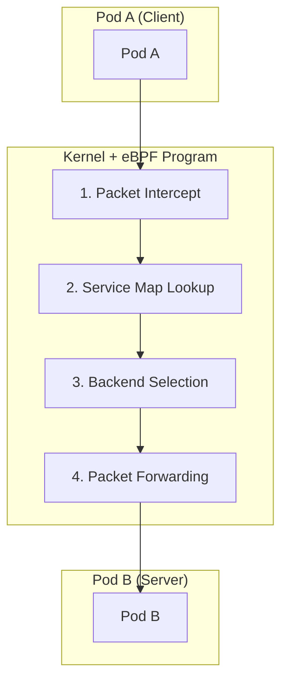

#### 2. 负载均衡算法

Cilium 支持多种负载均衡算法：

- **轮询**：默认算法，均匀分配
- **Maglev**：基于源 IP 一致地选择后端
- **会话亲和性**：基于客户端 IP 的持久连接
- **Maglev 超时**：在指定时间后重新均衡

#### 3. L7 负载均衡

Cilium 还支持 L7（应用层）负载均衡：

- **基于 HTTP 报头的路由**：基于特定报头值路由
- **基于 URL 路径的路由**：基于 URL 模式分配流量
- **gRPC 路由**：基于 gRPC 方法和元数据进行路由
- **Kafka 路由**：基于 Kafka topic 和消息键进行路由

#### 4. 全局 Service 负载均衡

Cilium 支持跨多个集群的负载均衡：

- **跨集群负载均衡**：在多个集群的后端之间分配流量
- **位置感知路由**：选择后端时考虑延迟和位置
- **故障转移**：集群故障期间自动故障转移

#### Cilium 负载均衡配置示例：

```yaml
apiVersion: v1
kind: ConfigMap
metadata:
  name: cilium-config
  namespace: kube-system
data:
  # Enable kube-proxy replacement
  kube-proxy-replacement: "strict"

  # Configure load balancing algorithm
  load-balancing-algorithm: "maglev"
  maglev-hash-seed: "Cilium"
  maglev-table-size: "16381"

  # Configure session affinity
  enable-session-affinity: "true"

  # Enable L7 load balancing
  enable-l7-proxy: "true"
```

## 网络安全基础

网络安全是保护网络基础设施、应用程序和数据免受未经授权的访问、滥用、故障或修改的实践。由于容器环境具有动态和分布式特性，网络安全在其中更为重要。

### 核心网络安全概念

#### 1. 深度防御

深度防御是一种实施多层安全防护的方法，以便单一安全机制的失效不会导致整个系统遭到安全破坏。

- **多层安全防护**：在网络、主机、应用程序和数据层面提供保护
- **冗余控制措施**：结合各种安全机制
- **故障隔离**：一层的失效不会影响其他层
- **威胁检测和响应**：在每一层进行监控和响应

#### 2. 最小权限原则

最小权限原则是一种安全实践，只向用户、进程或应用程序授予完成其任务所需的最低权限。

- **细粒度访问控制**：将访问限制为仅必要的资源
- **权限分离**：分离不同功能的权限
- **默认拒绝**：拒绝所有未明确允许的访问
- **定期审查**：定期审核和调整权限

#### 3. 网络分段

网络分段是一种将网络划分为更小的网段或区域，以增强安全性并限制威胁横向移动的技术。

- **安全区域**：将具有相似安全要求的系统分组
- **微分段**：在工作负载层面进行细粒度控制
- **边界保护**：控制和监控区域之间的流量
- **威胁隔离**：限制安全漏洞的影响范围

#### 4. 加密

加密是转换数据以使未经授权方无法读取的过程。

- **传输中加密**：保护在网络上传输的数据（例如 TLS/SSL）
- **静态加密**：保护存储在磁盘或数据库中的数据
- **端到端加密**：保护整个通信路径中的数据
- **密钥管理**：安全地生成、存储和轮换加密密钥

### 容器网络安全威胁

容器环境带来了独特的安全挑战：

#### 1. 基于网络的攻击

- **DDoS（分布式拒绝服务）攻击**：通过大量流量破坏服务可用性
- **端口扫描**：探测开放端口和漏洞
- **ARP 欺骗**：操纵地址解析协议以拦截网络流量
- **DNS 投毒**：将 DNS 查找重定向到恶意目标

#### 2. 应用层攻击

- **SQL 注入**：插入恶意 SQL 代码
- **XSS（跨站脚本）**：插入客户端脚本
- **CSRF（跨站请求伪造）**：通过已认证用户执行恶意操作
- **命令注入**：通过恶意输入执行系统命令

#### 3. 容器特定威胁

- **镜像漏洞**：包含存在漏洞组件的容器镜像
- **权限提升**：从容器向主机提升权限
- **横向移动**：从一个容器未经授权地访问另一个容器
- **Volume 挂载利用**：访问敏感的主机路径

### 网络安全控制措施

#### 1. 防火墙

防火墙是根据定义的安全规则过滤网络流量的网络安全系统。

- **数据包过滤**：基于 IP 地址、端口和协议进行过滤
- **有状态检测**：跟踪连接状态并基于上下文做出决策
- **应用层过滤**：理解并检查应用协议
- **下一代防火墙 (NGFW)**：高级威胁检测和防护功能

#### 2. 入侵检测和防御系统 (IDS/IPS)

IDS/IPS 是监控网络流量并检测或阻止恶意活动的系统。

- **基于签名的检测**：匹配已知攻击模式
- **异常检测**：识别偏离正常行为的活动
- **行为监控**：分析可疑活动模式
- **自动响应**：对检测到的威胁进行实时响应

#### 3. 网络策略

网络策略是一组定义网络内允许通信的规则。

- **Ingress 控制**：限制入站流量
- **Egress 控制**：限制出站流量
- **细粒度策略**：工作负载层面的通信控制
- **基于标签的策略**：在动态环境中灵活应用策略

#### 4. 加密协议

加密协议在网络上提供安全通信。

- **TLS/SSL**：保护 Web 流量和 API 通信
- **IPsec**：网络层加密
- **WireGuard**：现代高效的 VPN 协议
- **mTLS（双向 TLS）**：对客户端和服务器均进行身份验证

### Kubernetes 中的网络安全

Kubernetes 为容器化应用程序的网络安全提供多种机制：

#### 1. 网络策略

Kubernetes Network Policy 是控制 Pod 之间通信的规范。

- **Pod Selector**：根据标签选择策略适用的 Pod
- **Ingress 规则**：控制入站流量
- **Egress 规则**：控制出站流量
- **基于 CIDR 的规则**：基于 IP 范围进行过滤

```yaml
apiVersion: networking.k8s.io/v1
kind: NetworkPolicy
metadata:
  name: api-allow
spec:
  podSelector:
    matchLabels:
      app: api
  ingress:
  - from:
    - podSelector:
        matchLabels:
          app: frontend
    ports:
    - protocol: TCP
      port: 8080
  egress:
  - to:
    - podSelector:
        matchLabels:
          app: database
    ports:
    - protocol: TCP
      port: 5432
```

#### 2. Service Mesh 安全

Service mesh 是管理和保护微服务之间通信的基础设施层。

- **mTLS**：服务之间的加密通信
- **身份验证和授权**：服务身份验证和访问控制
- **流量策略**：细粒度路由和访问控制
- **可观测性**：服务间通信的可见性

#### 3. 安全上下文

安全上下文定义 Pod 和容器的权限及访问控制设置。

- **权限限制**：以非 root 用户运行
- **能力限制**：仅允许必要的 Linux capability
- **只读文件系统**：不可变的容器文件系统
- **seccomp 和 AppArmor**：限制系统调用和应用程序行为

### Cilium 的网络安全功能

Cilium 利用 eBPF 提供强大的网络安全功能：

#### 1. 基于身份的安全

Cilium 基于工作负载身份而非 IP 地址应用安全策略。

- **基于标签的策略**：动态环境中的一致安全性
- **基于 Service Account 的策略**：基于 Kubernetes Service Account 的访问控制
- **基于 DNS 的策略**：基于 FQDN 的 Egress 控制
- **API 感知安全**：基于 HTTP 方法和路径的过滤

#### 2. 透明加密

Cilium 无需修改应用程序即可加密网络流量。

- **IPsec**：用于 Node 间流量的网络层加密
- **WireGuard**：现代高效的加密协议
- **透明集成**：无需更改应用程序即可应用加密
- **密钥轮换**：自动化加密密钥管理

#### 3. 威胁检测和可见性

Cilium 提供对网络活动的深度可见性和威胁检测能力。

- **Hubble**：网络流监控和分析
- **流日志**：Pod 到 Pod 通信的详细日志
- **异常检测**：识别异常网络模式
- **安全事件告警**：针对策略违规和攻击尝试发出告警

#### 4. L3-L7 策略执行

Cilium 提供从网络层到应用层的全面策略执行。

- **L3/L4 策略**：基于 IP 和端口的过滤
- **L7 HTTP 过滤**：基于 URL、方法、报头的控制
- **L7 gRPC 过滤**：基于 gRPC 方法和元数据的控制
- **L7 Kafka 过滤**：基于 Kafka topic 和消息的控制

#### Cilium 网络安全配置示例：

```yaml
apiVersion: "cilium.io/v2"
kind: CiliumNetworkPolicy
metadata:
  name: "secure-api"
spec:
  endpointSelector:
    matchLabels:
      app: api
  ingress:
  - fromEndpoints:
    - matchLabels:
        app: frontend
    toPorts:
    - ports:
      - port: "8080"
        protocol: TCP
      rules:
        http:
        - method: "GET"
          path: "/api/v1/products"
  egress:
  - toEndpoints:
    - matchLabels:
        app: database
    toPorts:
    - ports:
      - port: "5432"
        protocol: TCP
  - toFQDNs:
    - matchName: "api.external-service.com"
    toPorts:
    - ports:
      - port: "443"
        protocol: TCP
```

### 网络安全最佳实践

#### 1. 默认拒绝策略

- 实施默认拒绝策略，仅允许明确许可的流量
- 仅开放必要的通信路径
- 定期审查策略并移除不必要的规则
- 维护策略变更的审计跟踪

#### 2. 深度防御方法

- 实施多层安全防护
- 结合网络、主机和应用层保护
- 采用各种安全机制的冗余控制措施
- 消除单点故障

#### 3. 最小权限网络

- 仅允许最低限度的必要网络访问
- 按 Service 定义细粒度策略
- 阻止不必要的端口和协议
- 定期进行访问审查和调整

#### 4. 持续监控和审计

- 监控网络流量和策略违规
- 检测异常和潜在威胁
- 对安全事件进行告警和响应
- 定期进行安全审计和漏洞评估

## 测验

要测试您在本章中学到的内容，请尝试[主题测验](../../quizzes/networking/cilium/networking-concepts-quiz.md)。
