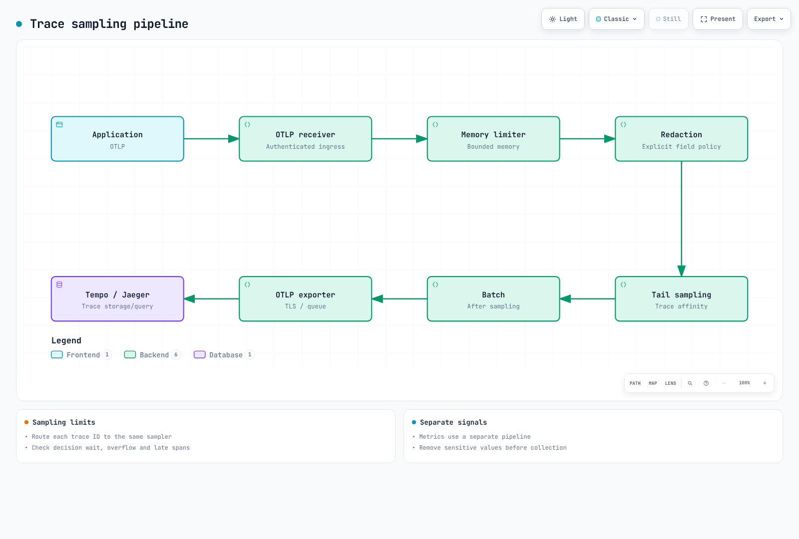

# EKS 可观测性优化指南

> **已验证的示例版本**: Prometheus 3.14.0 · OTel Collector Contrib 0.160.0 · Alertmanager 0.34.0 · OpenCost 1.121.2/chart 2.5.31

> **最后更新**: September 13, 2026

请围绕故障排查中要回答的问题、采集质量以及实测成本来优化可观测性。仅凭节点数量无法预测数据摄入量、查询负载、保留期成本或人力投入。本章使用[完整配置示例](https://github.com/Atom-oh/kubernetes-docs/tree/main/examples/observability/optimization)，并链接到集群安装所需的部署指南。原生测试使用的是合成数据；它们不是生产容量基准测试。

<span id="table-of-contents"></span>

## 目录

- [1. 可观测性三大支柱概览](#1-overview-of-the-three-pillars-of-observability)
- [2. 日志方案对比](#2-logging-solution-comparison)
- [3. 指标采集与存储](#3-metrics-collection-and-storage)
- [4. 分布式追踪](#4-distributed-tracing)
- [5. 基于 eBPF 的免代码监控](#5-ebpf-based-no-code-monitoring)
- [6. 成本监控](#6-cost-monitoring)
- [7. 统一可观测性仪表板](#7-unified-observability-dashboard)
- [8. 运维挑战与解决方案](#8-operational-challenges-and-solutions)
- [9. 最佳实践与后续步骤](#9-best-practices-and-next-steps)

<span id="_1-1-relationship-between-logging-metrics-and-tracing"></span>

<span id="_1-2-role-of-each-pillar-and-selection-criteria"></span>

<span id="_1-3-overall-eks-observability-architecture"></span>

<span id="1-overview-of-the-three-pillars-of-observability"></span>

## 1. 可观测性三大支柱概览

日志（Logs）描述事件，指标（Metrics）汇总一段时间内的行为，追踪（Traces）描述已埋点的请求路径。缺失某条 trace 或仪表板没有异常，并不能证明服务是健康的。请把 Collector 的丢弃量、队列、导出失败以及抓取（scrape）健康状况纳入同一个运维视图。


[🔍 查看交互式图示](https://www.atomai.click/kubernetes-docs/archmaps/en-observability-09-observability-optimization-0.html)

指标应使用取值有界的 service/route/status 标签，而把高基数（high-cardinality）的请求 ID 放入受到适当管控的日志/追踪中。一条 trace 未必是完整的：埋点、上下文传播、采样和保留期都会影响它。


[🔍 查看交互式图示](https://www.atomai.click/kubernetes-docs/archmaps/en-observability-09-observability-optimization-1.html)

Agent 与 gateway 的职责不同。节点 Agent 读取本地日志；gateway 可以施加集中式策略。尾部采样（tail sampling）需要 trace 亲和性，把任意数量的 DaemonSet 副本放在一个随机负载均衡器后面并不能让它变得正确。

<span id="_2-1-log-storage-comparison"></span>

<span id="_2-2-log-agent-comparison"></span>

<span id="_2-3-fluent-bit-loki-configuration-example-for-eks"></span>

<span id="2-logging-solution-comparison"></span>

## 2. 日志方案对比

| 后端 | 有用的特性 | 成本与运维约束 |
|---|---|---|
| CloudWatch Logs | 托管式摄入、保留期与 Logs Insights | 区域、日志类别、摄入、存储、查询扫描量与配额 |
| OpenSearch | 索引化搜索与分析 | 预置/Serverless 容量、索引、副本、存储与查询负载 |
| Loki | 基于标签索引的日志、LogQL 与对象存储 | 计算、缓存、对象请求、保留期、查询扇出与运维 |
| ClickHouse | SQL 分析、schema 与压缩方式的选择 | 计算、存储、复制、摄入 schema 与查询调优 |

不存在普遍意义上最快或最便宜的选择。请在相同的输入量、压缩方式、保留期、可用性、查询延迟和支持范围下进行对比。仅看对象存储价格并不等于 Loki 或 Tempo 的总成本。托管服务同样存在配额。

### Agent 与容器日志格式

Fluent Bit、Fluentd 和 Vector 在插件、实现语言、缓冲以及部署模型上各有不同。诸如“15 MB”或“每秒 20 万条消息”这类固定说法，需要有可复现的负载、版本与硬件条件。请测量你自己的记录大小、解析器开销、重试与背压情况。

现代 EKS 的 containerd 日志使用 CRI 格式。不要盲目套用 Docker JSON 解析器，也不要假设 `/var/lib/docker/containers` 存在。请使用受支持的 container/CRI 解析器，处理多行消息，以只读方式挂载主机日志，并把偏移量/缓冲区存放在单独的可写位置。Kubernetes 元数据增强需要对应的 ServiceAccount/RBAC。仅有一个 ConfigMap 并不会部署任何采集器。

请把 Loki 的标签限制在 cluster、namespace、service 这类稳定维度上。自动复制所有 Pod 标签会导致流（stream）数量爆炸。请参考[采集器指南](./logging/05-collectors.md)与 [Loki 指南](./logging/01-loki.md)获取当前的完整配置；安装前请确认目标 Service、schema、存储、IAM 与网络管控。

### 过滤不等于按百分比采样

在把 JSON 解析出 `level` 字段之后，下面这段 Fluent Bit filter 片段可以排除精确的 DEBUG/TRACE 级别：

```ini
[FILTER]
    Name     grep
    Match    application.*
    Exclude  level ^(DEBUG|TRACE)$
```

这段片段需要配套的 input/parser/output 流水线。不要仅因为任意消息文本中包含“DEBUG”就丢弃记录。Fluent Bit 的 throttle `Rate` 与 `Window` 实现的是滑动窗口限速，而不是 10% 概率采样器。在开启过滤之前，请测量被丢弃的记录数，并确保满足事件调查/审计要求。

对于 CloudWatch，请使用有文档记载的 `cloudwatch_logs` 选项。`log_format json` 以及旧的 `max_batch_size`/`max_batch_put_limit` 片段并不是有效的通用 JSON 输出/批处理配置。批处理由该插件自行处理；请查阅你所固定版本的选项。创建日志组时使用的 `log_retention_days` 设置，并不能决定所有已存在日志组的保留期。

<span id="_3-1-metrics-storage-comparison"></span>

<span id="_3-2-cardinality-management-strategy"></span>

<span id="_3-3-improving-query-performance-with-recording-rules"></span>

<span id="_3-4-long-term-storage-strategy"></span>

<span id="3-metrics-collection-and-storage"></span>

## 3. 指标采集与存储

Prometheus 拥有本地 TSDB 存储；分片（sharding）、远程写入（remote write）以及查询/聚合层扩展了它的部署模型。VictoriaMetrics 的单节点版与集群版在可用性和复制特性上并不相同。AMP 是托管服务，但存在 workspace 配额，保留期可配置。这些都不意味着无限保留期、由“三个存储 Pod”自动完成复制，或者所有扩展查询语义完全一致。

### 控制基数而不删除无关指标

示例 `prometheus.yaml` 只丢弃某个已知 histogram 中被选中的桶（bucket）。它保留了非 histogram 指标、`_sum`、`_count`、SLO 所需的桶 `le="0.5"` 以及 `+Inf`。

```yaml
- source_labels:
  - __name__
  - le
  regex: lab_http_request_duration_seconds_bucket;(0\.005|0\.01|0\.025|0\.05|0\.25)
  action: drop
```

只匹配 `.*_bucket;...` 的 `action: keep` 会同时删除所有不匹配的指标，而且往往连 `+Inf` 也一并删除。修改 histogram 的桶会影响分位数（quantile）精度；应尽可能优先在埋点 schema 层面调整，并保留 SLO 所需的桶。Prometheus 3 会规范化经典 histogram 的 `le` 取值，例如 `1` 会变成 `1.0`；请按实际摄入的标签进行匹配。

`relabel_configs` 在抓取之前修改被发现的目标；`metric_relabel_configs` 修改已抓取的样本。删除标签并不会聚合样本，反而可能产生重复的序列。服务发现的 `__meta_*` 标签不会自动成为持久化的样本标签。请在源头减少标签，并证明剩余的标签集合是唯一的。

### Recording 规则与保留期

对重复计算使用 recording 规则，并保持 `service`、`cluster` 与 namespace 键的一致性。node-exporter 通常用 `instance` 标识目标；不要按一个从未添加过的 `node` 标签做分组。诊断采集器自身所需的指标，不应连同所有 `go_.*` 或 `promhttp_.*` 家族一起被盲目丢弃。


[🔍 查看交互式图示](https://www.atomai.click/kubernetes-docs/archmaps/en-observability-09-observability-optimization-2.html)

远程写入队列不是备份，也不保证不丢数据。请规划 WAL/队列容量、重试行为、认证、网络中断以及接收端限制。Thanos sidecar/块上传架构与这里展示的 Thanos Receive 路径并不相同。

对于 Prometheus Operator，`replicas: 2` 与 `shards: 3` 意味着六个 Prometheus Pod。请为这六个 Pod 全部预留 PVC 与内存，配置好选择器，并提供一个能够合并分片并对 HA 副本去重的查询层。两个副本配合一个不做去重的远程写入接收端，会导致数据重复计数。请针对固定版本的 Operator 核对 CRD 字段与受支持的专用查询设置；不要添加相互冲突的通用参数。

<span id="_4-1-opentelemetry-overview-and-architecture"></span>

<span id="_4-2-tracing-backend-comparison"></span>

<span id="_4-3-sampling-strategies"></span>

<span id="_4-4-otel-collector-daemonset-configuration-for-eks"></span>

<span id="4-distributed-tracing"></span>

## 4. 分布式追踪

Tempo 除支持按 trace ID 查找外，还支持 TraceQL。Jaeger 2 采用基于 OTel 的架构，需要显式选择存储。X-Ray 是 AWS 提供的后端；请使用当前的 OTel/ADOT 集成指引，而不是把某个旧 SDK 版本当作通用做法。请综合考虑摄入、查询、存储与运维，而不是只比较单条 trace 的价格和 S3 价格。



[🔍 查看交互式图示](https://www.atomai.click/kubernetes-docs/archmaps/en-observability-09-observability-optimization-3.html)

### 采样与亲和性

头部采样（head sampling）在完整请求结果已知之前就做出决定。Collector 的概率采样也发生在遥测数据到达 Collector 之后，与 SDK 的头部决策并不相同。尾部采样无法恢复在上游已经被丢弃的 span。

在默认的 `trace-complete` 策略中，`decision_wait` 控制的是针对已接收 span 的基于定时器的决策；它并不能证明每个 span 都已到达或该 trace 已经结束。请把同一个 trace ID 的所有 span 路由到同一个采样器。缓冲区大小应按到达速率 × 等待时间，再加上突发流量与 span 大小的余量来估算。容量溢出、超大 trace、重启以及迟到的 span，都会破坏“保留所有错误 trace”的承诺。

仅使用回环地址的 `collector-tail-local.yaml` 是一个合成演示，而不是 EKS 清单。它使用 1,000 条 trace 的缓冲区、两秒的决策等待以及 192 MiB 的 memory_limiter 设置；生产环境的取值应根据实测 trace 与容器内存余量来调整。它的策略如下：

```yaml
decision_wait: 2s
num_traces: 1000
maximum_trace_size_bytes: 1048576
policies:
- name: errors
  type: status_code
  status_code:
    status_codes:
    - ERROR
- name: slow
  type: latency
  latency:
    threshold_ms: 1000
- name: baseline
  type: probabilistic
  probabilistic:
    sampling_percentage: 10
```

在这些正向策略下，匹配错误/慢请求的 trace 会被保留，其他 trace 则进入概率策略的判定范围。这并不意味着总量会减少 90%。drop/composite/inverted 策略具有不同的决策语义；不要把“第一条匹配规则生效”推广到所有情况。示例只删除了明确命名的 `sensitive_data` span 属性。在导出之前，请通过明确的数据策略对 span 名称、事件、resource 属性以及应用日志进行脱敏。

集群部署请参考 [OTel 指南](./tracing/03-opentelemetry.md)与[可观测性栈实验](../labs/observability/02-observability-stack-lab.md)。Operator 注入注解需要 Operator、对应的 `Instrumentation` 资源、受支持的运行时镜像以及重启工作负载。请匹配 OTLP HTTP/4318 与 gRPC/4317 以及 TLS/认证配置；仅有注解并不会安装埋点。

<span id="_5-1-why-ebpf-monitoring"></span>

<span id="_5-2-coroot-automatic-service-maps-and-latency-analysis"></span>

<span id="_5-3-pixie-now-new-relic-kubernetes-specific-observability"></span>

<span id="_5-4-cilium-hubble-network-flow-observation"></span>

<span id="_5-5-kepler-energy-consumption-monitoring"></span>

<span id="5-ebpf-based-no-code-monitoring"></span>

## 5. 基于 eBPF 的免代码监控


[🔍 查看交互式图示](https://www.atomai.click/kubernetes-docs/archmaps/en-observability-09-observability-optimization-4.html)

对于受支持的协议、内核和运行时，eBPF 可以减少对源码的改动。它不会自动捕获业务语义、覆盖所有语言/库，也无法覆盖全部 TLS 流量。uprobe 可以在受支持的库边界上观测明文；那并不是通用的 TLS 解密。请评估权限、敏感载荷捕获、内核兼容性以及实测开销。SDK 自动埋点同样可以避免修改应用源码，不过可能需要重启或额外配置。

| 工具 | 当前部署注意事项 |
|---|---|
| Coroot | 旧的 `coroot/coroot` chart 已弃用。请使用有文档记载的 Operator/Coroot CR 流程；Operator chart 0.9.10 与 CE chart 0.3.3 是彼此独立的组件。请审查 Agent 权限、存储与认证。 |
| Pixie | 一个开源项目，存在内核/协议前提条件以及控制平面选型。数据存储在集群内并不意味着查询/结果无法被导出；请核查实际的访问与数据路径。 |
| Cilium Hubble | 需要兼容的 Cilium 部署。流量可见性、L7 策略/代理覆盖范围以及已启用的指标各不相同；它不能替代覆盖整个应用的分布式追踪。 |
| Kepler | 0.10+ 版本重写了旧的 0.7 架构。当前的指标与部署前提条件均有不同；不要照搬旧的特权/BPF DaemonSet。 |

Kepler 0.11.4 记录了诸如 `kepler_pod_cpu_watts` 和 `kepler_pod_cpu_joules_total` 这类 CPU 指标，并带有 `pod_namespace`/`pod_name` 标签。硬件能耗访问与归因必须在实际主机上可用；普通的虚拟化 EKS 节点并不保证暴露主机 RAPL 数据。在声称测量准确之前，请查阅该版本的部署与硬件支持文档。

```promql
# A watts gauge already measures power.
sum by (pod_namespace) (kepler_pod_cpu_watts)

# J/s = W; multiplying by 1000 would give milliwatts.
rate(kepler_pod_cpu_joules_total[5m])
```

就绪状态或 exporter 正在运行，并不能证明硬件测量是正确的。EKS Auto Mode 与 Fargate 的主机访问约束不同；请核实受支持的埋点方式，而不是到处部署特权节点 Agent。在认证与网络访问配置完成之前，请让 Hubble/Coroot/OpenCost 的 UI 保持内网可见。

<span id="_6-1-kubecost-opencost-installation-and-configuration"></span>

<span id="_6-2-cost-allocation-by-namespace-team"></span>

<span id="_6-3-cloudwatch-cost-optimization"></span>

<span id="_6-4-log-metrics-storage-cost-reduction-strategies"></span>

<span id="6-cost-monitoring"></span>

## 6. 成本监控

### OpenCost 与成本分摊

`opencost-values.yaml` 面向 chart 2.5.31/app 1.121.2，选用已有的 Prometheus，并禁用 Cloud Cost 摄入。请把端点替换为包含 OpenCost 所需指标（含工作负载/资源与成本数据）的端点；仅仅网络可达是不够的。对受保护的 Prometheus 端点，请配置经批准的认证/CA 处理方式。

```bash
helm repo add opencost https://opencost.github.io/opencost-helm-chart
helm repo update opencost
helm upgrade --install opencost opencost/opencost --version 2.5.31   -n opencost --create-namespace -f opencost-values.yaml
kubectl -n opencost port-forward service/opencost 9003:9003 --address 127.0.0.1
# In another terminal:
curl --fail --get http://127.0.0.1:9003/allocation/compute   --data-urlencode 'window=7d' --data-urlencode 'aggregate=namespace'
```

要得到七天的输出，需要有足够的历史输入数据。成本分摊结果是估算值，不等于 AWS 账单。请统一 `team`、`cost-center`、cluster 与 namespace 标签；定义空闲/共享成本的分摊方式，并与 CUR/Data Exports、抵扣券、折扣及摊销情况进行对比。AWS Cloud Cost 对账需要其受支持的 `cloudIntegrationSecret` 格式、CUR/Athena/S3 前提条件以及范围受限的身份权限。诸如旧的 `exporter.aws.athenaProjectID` 片段这类不受支持的取值，并不能让集成生效。切勿把 AWS 访问密钥写入 values 文件。

### 保留期与归档安全性

修改保留期之前，请先盘点日志组：

```bash
aws logs describe-log-groups --log-group-name-prefix /eks/production/   --query 'logGroups[].{name:logGroupName,retention:retentionInDays,storedBytes:storedBytes}'   --output json
```

请通过基础设施配置，对明确选定的日志组应用经批准的保留期策略。`storedBytes == 0` 并不表示该日志组未被使用；订阅、生产者、审计要求以及未来的写入都可能依赖它。不要批量删除“空”的日志组，也不要把制表符分隔的 CLI 文本当成每行一个日志组名。


[🔍 查看交互式图示](https://www.atomai.click/kubernetes-docs/archmaps/en-observability-09-observability-optimization-5.html)

不要盲目把活跃的 Loki/Tempo 块转换到 Glacier：后端可能要求立即读取，而且不一定会按需还原已归档的对象。请让后端保留期/压实（compaction）策略与对象生命周期规则相互协调，并测试取回流程。压缩、过滤与保留期带来的节省是相互重叠的；不要把它们的百分比当作彼此独立而直接相加。

<span id="_7-1-grafana-based-unified-dashboard-configuration"></span>

<span id="_7-2-log-metrics-trace-correlation-exemplars"></span>

<span id="_7-3-alerting-strategy-preventing-alert-fatigue"></span>

<span id="_7-4-slo-sli-based-monitoring"></span>

<span id="7-unified-observability-dashboard"></span>

## 7. 统一可观测性仪表板

请参考 [Grafana 指南](./grafana/README.md)进行固定版本的 provisioning，其中包含匹配的 `prometheus`、`loki` 与 `tempo` UID、当前的 `tracesToLogsV2` 以及真实的 HTTP/TLS 端点。环境变量本身并不会创建数据源。exemplar 的标签名称与 JSON 中的 trace 字段必须与已埋点的应用保持一致。

Prometheus 的特性开关应写在命令行参数或 Operator 支持的 `enableFeatures` 字段中，而不是 `prometheus.yml` 里的 `global.enable_features`。示例使用了 `storage.exemplars.max_exemplars`；启用 exemplar 存储时，还需要配合与版本对应的特性标志。应用侧需要注册好 collector 并提供 OpenMetrics 暴露格式。请避免在 exemplar 埋点中使用原始请求路径或未采样/无效的 trace ID。

### 基于请求的 SLO、燃烧率与剩余预算

对于基于请求的 99.9% 可用性 SLO，在给定窗口内允许的失败请求数为 `总请求数 × 0.001`。这并不会自动等于 43 分钟的停机时间；基于时间与基于请求的 SLI 分母不同。

`slo-rules.yaml` 把短窗口错误比率与 30 天按请求加权的比率区分开：

```promql
# Recent burn rate:
service:http_5xx:ratio_5m / 0.001

# Remaining 30-day request budget:
1 - service:http_5xx:ratio_30d / 0.001
```

30 天比率的分子与分母都使用 `increase(counter[30d])`，而不是最近五分钟的比率。请确保有足够的历史数据，并监控采集缺口。预算耗尽后可以为负值；缺失流量或零流量仍然属于未定义，而不是变成完美可用性。`le="0.5"` 桶除以 histogram 计数得到的是 500 毫秒内完成的请求占比，而不是“p99 取值低于 500 毫秒的比例”。

示例把 1 小时/5 分钟的燃烧率阈值设为 14.4，6 小时/30 分钟设为 6。对 30 天目标而言，这些只是用于说明的快速/持续燃烧策略，而不是通用的严重级别设置。请与服务负责人一起调整评估窗口、流量置信度与响应策略。不要仅因为某个短窗口估算值越过阈值就自动暂停部署。

### 告警路由

`alertmanager.yaml` 提供了当前的 matcher、Asia/Seoul 非工作时段设置，以及以非空 cluster/node 标签为前提的抑制（inhibition）规则。否则缺失的标签会被判定为相等，从而静默掉无关告警。它的 `review-only` 接收器有意不配置任何集成：它只验证路由，而不实际发送。投入运维使用之前，请添加经批准的联系人、以 Secret 保存的 webhook/路由密钥以及明确的接收器策略，然后测试投递与抑制效果。评估间隔、分组、重复间隔、pending 时长与静默计划各有不同用途。

<span id="_8-1-responding-to-exploding-log-metrics-storage-costs"></span>

<span id="_8-2-eks-auto-mode-node-monitoring"></span>

<span id="_8-3-cross-tool-data-correlation-analysis"></span>

<span id="_8-4-maintaining-monitoring-system-performance-at-large-scale"></span>

<span id="_8-5-high-availability-observability-stack-configuration"></span>

<span id="8-operational-challenges-and-solutions"></span>

## 8. 运维挑战与解决方案


[🔍 查看交互式图示](https://www.atomai.click/kubernetes-docs/archmaps/en-observability-09-observability-optimization-6.html)

计算得出的 p99 序列自身并不会保留 exemplar 元数据。请从原始已埋点序列查询 exemplar，然后验证 trace 保留期与日志字段。trace 链接打不开数据，可能意味着采样/保留期不匹配，而不是 UI 出了问题。

EKS Auto Mode 包含一个节点监控 Agent，它会发布 Kubernetes Event 与节点 Condition。请把这些信号与节点健康状况一起，与工作负载指标结合起来查看。PodMonitor 选择的是 Pod 与具名容器端口；选择一个节点标签并不会神奇地暴露节点指标。CloudWatch Observability 的插件/Operator 会安装 Agent，并需要相应权限与配置；单独一个 ConfigMap 并不能启用 Container Insights。


[🔍 查看交互式图示](https://www.atomai.click/kubernetes-docs/archmaps/en-observability-09-observability-optimization-7.html)

请在采集、队列、接收端、存储与查询各层分别做故障测试。PDB 在被遵守时限制的是自愿中断；它并不能保证节点丢失期间的可用性。复制因子、法定人数、AZ 分布、有状态存储与读路径聚合是彼此独立的需求。请遵循当前的 Loki/Tempo 部署模式，而不要把已废弃的 Simple Scalable/Tempo 2 ingester 示例混进当前的技术栈。

<span id="_9-1-phased-adoption-strategy"></span>

<span id="_9-2-cost-benefit-analysis"></span>

<span id="_9-3-checklist"></span>

<span id="_9-4-related-documents-and-quizzes"></span>

<span id="9-best-practices-and-next-steps"></span>

## 9. 最佳实践与后续步骤


[🔍 查看交互式图示](https://www.atomai.click/kubernetes-docs/archmaps/en-observability-09-observability-optimization-8.html)

请建立基线：每类信号的每日字节数、活跃序列数、新序列的变动率、每秒样本数、每秒 span 数、样本保留期、查询扫描量、保留期、缓冲丢失、恢复时间以及运维投入。请使用当前区域的实际价格与你已谈定的条款。假设基线为每月 5,000 美元、目标为 2,500 美元，在估算节省之前请先把实际成本归类到各个类别。任何工具替换都不保证能节省 50%。

一次只推出一项可度量的变更。对比变更前后的故障排查成功率、SLO 覆盖率、被丢弃的数据量以及账单。保留足够的数据，以便回滚有害的过滤规则并恢复诊断能力。部署周期取决于权限、团队经验、验证与迁移工作；固定的“一到两天”时间表并不是承诺。

### 验证与限制

原生检查覆盖了 Prometheus 配置与九条规则、针对真实合成抓取的选择性桶重标记、包含 30 天请求预算的七项 SLO 断言、一个实际的 Collector 尾部采样流水线、Alertmanager 配置以及固定版本的 OpenCost Helm 渲染。其中没有生产工作负载、账单对账、Kubernetes/eBPF 安装或外部通知。图示/浏览器相关检查另行记录在评审报告中。

### 延伸阅读

- [Prometheus 指南](./metrics/01-prometheus.md)
- [Grafana 仪表板](./grafana/README.md)
- [可观测性优化测验](../quizzes/observability/09-observability-optimization-quiz.md)

## 参考资料

- [Collector tail sampling v0.160.0](https://github.com/open-telemetry/opentelemetry-collector-contrib/tree/v0.160.0/processor/tailsamplingprocessor)
- [Prometheus configuration](https://prometheus.io/docs/prometheus/latest/configuration/configuration/)
- [Prometheus alerting configuration](https://prometheus.io/docs/alerting/latest/configuration/)
- [AMP workspace retention configuration](https://docs.aws.amazon.com/prometheus/latest/APIReference/API_UpdateWorkspaceConfiguration.html)
- [EKS Auto Mode troubleshooting](https://docs.aws.amazon.com/eks/latest/userguide/auto-troubleshoot.html)
- [CloudWatch Observability add-on](https://docs.aws.amazon.com/eks/latest/userguide/cloudwatch.html)
- [Kepler v0.11.4](https://github.com/sustainable-computing-io/kepler/tree/v0.11.4)
- [Coroot Helm charts](https://github.com/coroot/helm-charts/tree/main/charts)
- [OpenCost Helm chart](https://github.com/opencost/opencost-helm-chart/tree/main/charts/opencost)
- [Pixie](https://github.com/pixie-io/pixie)
