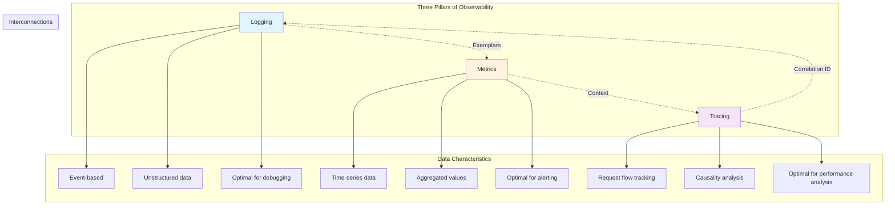
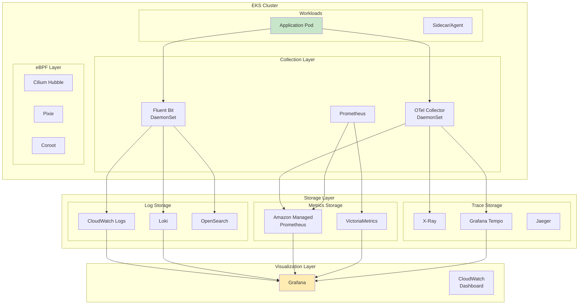
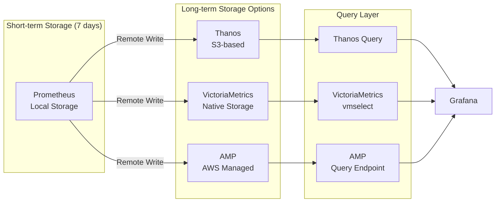
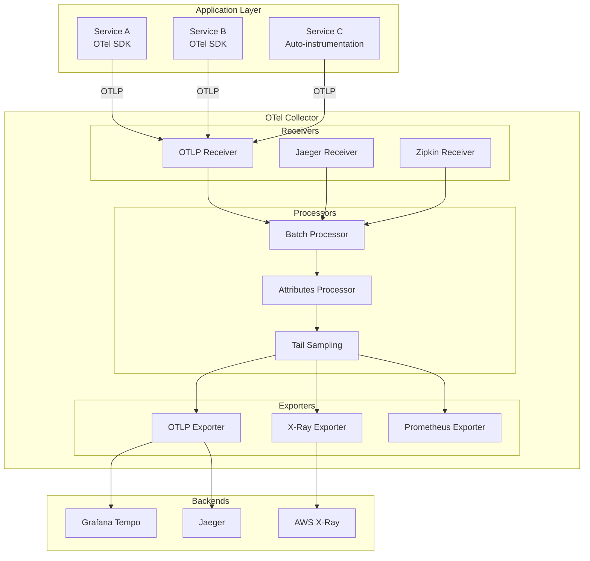
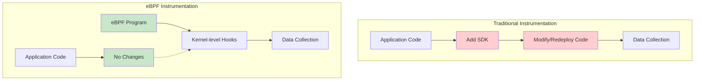
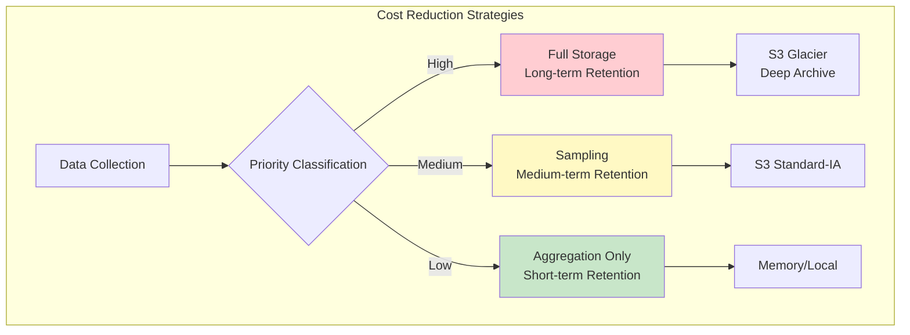
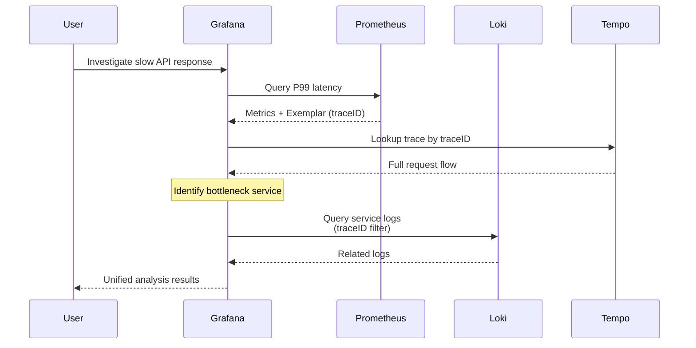
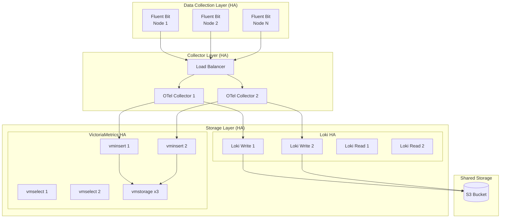
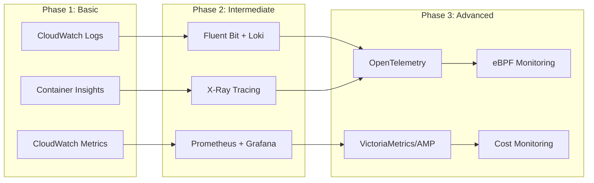

# EKS 可观测性优化指南

> **支持版本**：Amazon EKS 1.29+、OpenTelemetry 0.90+
> **最后更新**：February 2025

---

## 目录

1. [可观测性的三大支柱概述](#1-overview-of-the-three-pillars-of-observability)
2. [日志解决方案对比](#2-logging-solution-comparison)
3. [指标收集与存储](#3-metrics-collection-and-storage)
4. [分布式追踪](#4-distributed-tracing)
5. [基于 eBPF 的无代码监控](#5-ebpf-based-no-code-monitoring)
6. [成本监控](#6-cost-monitoring)
7. [统一可观测性仪表板](#7-unified-observability-dashboard)
8. [运维挑战与解决方案](#8-operational-challenges-and-solutions)
9. [最佳实践与后续步骤](#9-best-practices-and-next-steps)

---

## 1. 可观测性的三大支柱概述

在现代云原生环境中，**可观测性**是指通过系统的外部输出了解其内部状态的能力。要在 EKS 环境中实现有效的可观测性，需要了解三个关键支柱。

### 1.1 日志、指标与追踪之间的关系



### 1.2 各支柱的角色与选择标准

| 支柱 | 主要角色 | 问题类型 | 数据量 | 成本特征 |
|---|---|---|---|---|
| **日志** | 事件记录、审计、调试 | “发生了什么？” | 高 | 存储成本高 |
| **指标** | 系统状态监控、告警 | “系统是否健康？” | 中 | 对基数敏感 |
| **追踪** | 请求流跟踪、瓶颈分析 | “为什么变慢？” | 高（需要采样） | 与采样率成正比 |

### 1.3 整体 EKS 可观测性架构



---

## 2. 日志解决方案对比

### 2.1 日志存储对比

| 标准 | CloudWatch Logs | OpenSearch | Loki | ClickHouse |
|---|---|---|---|---|
| **成本** | 摄取：$0.50/GB<br/>存储：$0.03/GB/月 | 实例成本 + EBS<br/>r6g.large：约 $150/月 | 对象存储成本<br/>S3：$0.023/GB/月 | 实例 + 存储<br/>通过高压缩率降低成本 |
| **性能** | 小规模时表现优异<br/>大规模时存在延迟 | 针对全文搜索优化<br/>复杂查询能力强 | 基于标签的过滤速度快<br/>全文搜索受限 | 针对分析查询优化<br/>实时聚合能力优异 |
| **运维复杂度** | 完全托管<br/>运维负担极低 | 需要管理集群<br/>调优复杂 | 架构简单<br/>易于运维 | 需要管理 Schema<br/>复杂度中等 |
| **查询能力** | Logs Insights<br/>基础分析 | Lucene 查询<br/>强大的全文搜索 | LogQL<br/>基于标签的过滤 | 基于 SQL<br/>复杂分析查询 |
| **可扩展性** | 自动扩展<br/>无限制 | 手动分片<br/>需要添加节点 | 易于水平扩展<br/>利用对象存储 | 支持分片<br/>PB 级规模 |
| **适用场景** | AWS 原生环境<br/>简单日志记录 | 复杂搜索需求<br/>安全/合规 | 注重成本效益<br/>Grafana 集成 | 日志分析/聚合<br/>长期保留 |

### 2.2 日志 Agent 对比

| 标准 | Fluent Bit | Fluentd | Vector |
|---|---|---|---|
| **内存使用量** | ~15MB | ~60MB | ~30MB |
| **CPU 使用量** | 低 | 中 | 低 |
| **吞吐量** | 最高约 ~200K msg/s | 最高约 ~50K msg/s | 最高约 ~300K msg/s |
| **语言** | C | Ruby/C | Rust |
| **插件生态系统** | 有限但支持核心功能 | 非常丰富 | 不断成长 |
| **配置复杂度** | 低 | 中 | 中 |
| **EKS 集成** | 原生支持 | 支持 | 支持 |

### 2.3 适用于 EKS 的 Fluent Bit + Loki 配置示例

```yaml
# fluent-bit-configmap.yaml
apiVersion: v1
kind: ConfigMap
metadata:
  name: fluent-bit-config
  namespace: logging
data:
  fluent-bit.conf: |
    [SERVICE]
        Flush         5
        Log_Level     info
        Daemon        off
        Parsers_File  parsers.conf
        HTTP_Server   On
        HTTP_Listen   0.0.0.0
        HTTP_Port     2020

    [INPUT]
        Name              tail
        Tag               kube.*
        Path              /var/log/containers/*.log
        Parser            docker
        DB                /var/log/flb_kube.db
        Mem_Buf_Limit     50MB
        Skip_Long_Lines   On
        Refresh_Interval  10

    [FILTER]
        Name                kubernetes
        Match               kube.*
        Kube_URL            https://kubernetes.default.svc:443
        Kube_CA_File        /var/run/secrets/kubernetes.io/serviceaccount/ca.crt
        Kube_Token_File     /var/run/secrets/kubernetes.io/serviceaccount/token
        Kube_Tag_Prefix     kube.var.log.containers.
        Merge_Log           On
        Keep_Log            Off
        K8S-Logging.Parser  On
        K8S-Logging.Exclude On

    [OUTPUT]
        Name                   loki
        Match                  *
        Host                   loki-gateway.logging.svc.cluster.local
        Port                   80
        Labels                 job=fluent-bit
        Label_Keys             $kubernetes['namespace_name'],$kubernetes['pod_name'],$kubernetes['container_name']
        Remove_Keys            kubernetes,stream
        Auto_Kubernetes_Labels on
        Line_Format            json

  parsers.conf: |
    [PARSER]
        Name        docker
        Format      json
        Time_Key    time
        Time_Format %Y-%m-%dT%H:%M:%S.%L
        Time_Keep   On

    [PARSER]
        Name        json
        Format      json
        Time_Key    timestamp
        Time_Format %Y-%m-%dT%H:%M:%S.%L
---
# fluent-bit-daemonset.yaml
apiVersion: apps/v1
kind: DaemonSet
metadata:
  name: fluent-bit
  namespace: logging
  labels:
    app: fluent-bit
spec:
  selector:
    matchLabels:
      app: fluent-bit
  template:
    metadata:
      labels:
        app: fluent-bit
    spec:
      serviceAccountName: fluent-bit
      tolerations:
        - key: node-role.kubernetes.io/control-plane
          effect: NoSchedule
        - key: node-role.kubernetes.io/master
          effect: NoSchedule
      containers:
        - name: fluent-bit
          image: fluent/fluent-bit:2.2
          resources:
            limits:
              memory: 200Mi
              cpu: 200m
            requests:
              memory: 100Mi
              cpu: 100m
          volumeMounts:
            - name: varlog
              mountPath: /var/log
            - name: varlibdockercontainers
              mountPath: /var/lib/docker/containers
              readOnly: true
            - name: config
              mountPath: /fluent-bit/etc/
      volumes:
        - name: varlog
          hostPath:
            path: /var/log
        - name: varlibdockercontainers
          hostPath:
            path: /var/lib/docker/containers
        - name: config
          configMap:
            name: fluent-bit-config
```

```bash
# Install Loki (Helm)
helm repo add grafana https://grafana.github.io/helm-charts
helm repo update

# Install Loki in Simple Scalable mode
helm install loki grafana/loki \
  --namespace logging \
  --create-namespace \
  --set loki.auth_enabled=false \
  --set loki.storage.type=s3 \
  --set loki.storage.s3.endpoint=s3.ap-northeast-2.amazonaws.com \
  --set loki.storage.s3.region=ap-northeast-2 \
  --set loki.storage.s3.bucketnames=my-loki-bucket \
  --set loki.storage.s3.insecure=false \
  --set serviceAccount.annotations."eks\.amazonaws\.com/role-arn"=arn:aws:iam::ACCOUNT:role/LokiS3Role
```

---

## 3. 指标收集与存储

### 3.1 指标存储对比

| 标准 | Prometheus | VictoriaMetrics | AMP (Amazon Managed Prometheus) |
|---|---|---|---|
| **可扩展性** | 单节点<br/>仅支持垂直扩展 | 集群模式<br/>水平扩展 | 自动扩展<br/>无限制 |
| **成本** | 仅基础设施成本<br/>EC2/EBS | 基础设施成本<br/>相比 Prometheus 可节省成本 | 摄取：$0.90/1000 万样本<br/>存储：$0.03/GB/月 |
| **HA** | 需要单独配置<br/>Thanos/Cortex | 内置副本<br/>自动故障转移 | 完全托管的 HA<br/>Multi-AZ |
| **运维开销** | 高<br/>存储/扩展管理 | 中<br/>运维简单 | 低<br/>AWS 托管 |
| **长期存储** | 需要单独的解决方案 | 内置支持 | 无限保留 |
| **查询性能** | 优异 | 非常优异<br/>（优化的引擎） | 优异 |
| **PromQL 兼容性** | 原生 | 完全兼容 + 扩展功能 | 完全兼容 |

### 3.2 基数管理策略

**基数**是指唯一时间序列的数量。高基数会直接影响内存使用量和查询性能。

```yaml
# prometheus-config.yaml - Metric dropping and label optimization
apiVersion: v1
kind: ConfigMap
metadata:
  name: prometheus-config
  namespace: monitoring
data:
  prometheus.yml: |
    global:
      scrape_interval: 30s
      evaluation_interval: 30s

    scrape_configs:
      - job_name: 'kubernetes-pods'
        kubernetes_sd_configs:
          - role: pod
        relabel_configs:
          # Collect only specific namespaces
          - source_labels: [__meta_kubernetes_namespace]
            regex: 'kube-system|monitoring|production'
            action: keep

          # Remove unnecessary labels
          - regex: '__meta_kubernetes_pod_label_(.+)'
            action: labeldrop

          # Remove Pod UID (high cardinality cause)
          - regex: 'pod_template_hash|controller_revision_hash'
            action: labeldrop

        metric_relabel_configs:
          # Drop unnecessary metrics
          - source_labels: [__name__]
            regex: 'go_.*|promhttp_.*'
            action: drop

          # Limit histogram buckets (major high cardinality culprit)
          - source_labels: [__name__, le]
            regex: '.*_bucket;(0\.001|0\.005|0\.01|0\.05|0\.1|0\.5|1|5|10|30|60|120|300)'
            action: keep
```

### 3.3 使用 Recording Rules 提升查询性能

Recording Rules 会预先计算复杂查询并存储结果。

```yaml
# prometheus-recording-rules.yaml
apiVersion: monitoring.coreos.com/v1
kind: PrometheusRule
metadata:
  name: recording-rules
  namespace: monitoring
spec:
  groups:
    - name: k8s.rules
      interval: 30s
      rules:
        # Pre-compute CPU utilization per node
        - record: node:cpu_utilization:ratio
          expr: |
            1 - avg by (node) (
              rate(node_cpu_seconds_total{mode="idle"}[5m])
            )

        # Memory utilization per node
        - record: node:memory_utilization:ratio
          expr: |
            1 - (
              node_memory_MemAvailable_bytes
              / node_memory_MemTotal_bytes
            )

        # CPU usage per namespace
        - record: namespace:container_cpu_usage_seconds_total:sum_rate
          expr: |
            sum by (namespace) (
              rate(container_cpu_usage_seconds_total{container!=""}[5m])
            )

        # Pod restart count (hourly)
        - record: namespace:pod_restarts:sum_increase1h
          expr: |
            sum by (namespace) (
              increase(kube_pod_container_status_restarts_total[1h])
            )

    - name: slo.rules
      interval: 30s
      rules:
        # Error rate per service
        - record: service:http_requests:error_rate5m
          expr: |
            sum by (service) (
              rate(http_requests_total{status=~"5.."}[5m])
            )
            /
            sum by (service) (
              rate(http_requests_total[5m])
            )

        # P99 latency per service
        - record: service:http_request_duration_seconds:p99
          expr: |
            histogram_quantile(0.99,
              sum by (service, le) (
                rate(http_request_duration_seconds_bucket[5m])
              )
            )
```

### 3.4 长期存储策略



---

## 4. 分布式追踪

### 4.1 OpenTelemetry 概述与架构

OpenTelemetry (OTel) 是用于收集和导出可观测性数据（追踪、指标、日志）的供应商中立标准。



### 4.2 追踪后端对比

| 标准 | Grafana Tempo | Jaeger | AWS X-Ray |
|---|---|---|---|
| **架构** | 基于对象存储<br/>无索引 | Elasticsearch/Cassandra<br/>基于索引 | AWS 托管<br/>Serverless |
| **成本** | 仅 S3 存储成本<br/>非常低廉 | 基础设施成本<br/>索引存储 | 按追踪计费<br/>$5/百万条追踪 |
| **可扩展性** | 无限制<br/>水平扩展 | 需要添加节点<br/>索引管理 | 自动扩展<br/>无限制 |
| **查询方式** | 直接 TraceID 查询<br/>Exemplars 集成 | 基于标签的搜索<br/>时间范围搜索 | 服务映射<br/>筛选搜索 |
| **Grafana 集成** | 原生 | 支持 | 有限 |
| **AWS 集成** | 单独配置 | 单独配置 | 原生<br/>Lambda、ECS 等 |
| **适用场景** | 注重成本效益<br/>Grafana 技术栈 | 复杂搜索需求<br/>自托管基础设施 | AWS 原生<br/>Serverless 环境 |

### 4.3 采样策略

```yaml
# otel-collector-config.yaml - Sampling strategy configuration
apiVersion: v1
kind: ConfigMap
metadata:
  name: otel-collector-config
  namespace: observability
data:
  config.yaml: |
    receivers:
      otlp:
        protocols:
          grpc:
            endpoint: 0.0.0.0:4317
          http:
            endpoint: 0.0.0.0:4318

    processors:
      # Batch processing - performance optimization
      batch:
        timeout: 5s
        send_batch_size: 1000
        send_batch_max_size: 1500

      # Memory limit - OOM prevention
      memory_limiter:
        check_interval: 1s
        limit_mib: 1000
        spike_limit_mib: 200

      # Probabilistic sampling - Head Sampling
      probabilistic_sampler:
        hash_seed: 22
        sampling_percentage: 10  # 10% sampling

      # Tail Sampling - condition-based sampling
      tail_sampling:
        decision_wait: 10s
        num_traces: 100000
        policies:
          # Keep 100% of traces with errors
          - name: errors
            type: status_code
            status_code:
              status_codes: [ERROR]

          # Keep 100% of high-latency traces
          - name: slow-traces
            type: latency
            latency:
              threshold_ms: 1000

          # Keep 100% of traces from specific services
          - name: critical-services
            type: string_attribute
            string_attribute:
              key: service.name
              values: [payment-service, order-service]

          # Sample only 5% of the rest
          - name: default
            type: probabilistic
            probabilistic:
              sampling_percentage: 5

      # Add/remove attributes
      attributes:
        actions:
          - key: environment
            value: production
            action: upsert
          - key: sensitive_data
            action: delete

    exporters:
      otlp:
        endpoint: tempo-distributor.observability:4317
        tls:
          insecure: true

      awsxray:
        region: ap-northeast-2

      debug:
        verbosity: detailed

    service:
      pipelines:
        traces:
          receivers: [otlp]
          processors: [memory_limiter, batch, tail_sampling, attributes]
          exporters: [otlp, awsxray]
```

### 4.4 适用于 EKS 的 OTel Collector DaemonSet 配置

```yaml
# otel-collector-daemonset.yaml
apiVersion: apps/v1
kind: DaemonSet
metadata:
  name: otel-collector
  namespace: observability
  labels:
    app: otel-collector
spec:
  selector:
    matchLabels:
      app: otel-collector
  template:
    metadata:
      labels:
        app: otel-collector
    spec:
      serviceAccountName: otel-collector
      containers:
        - name: collector
          image: otel/opentelemetry-collector-contrib:0.92.0
          args:
            - --config=/conf/config.yaml
          ports:
            - containerPort: 4317  # OTLP gRPC
              hostPort: 4317
            - containerPort: 4318  # OTLP HTTP
              hostPort: 4318
            - containerPort: 8888  # Metrics
          resources:
            limits:
              memory: 1Gi
              cpu: 500m
            requests:
              memory: 200Mi
              cpu: 100m
          volumeMounts:
            - name: config
              mountPath: /conf
          env:
            - name: K8S_NODE_NAME
              valueFrom:
                fieldRef:
                  fieldPath: spec.nodeName
            - name: K8S_POD_NAME
              valueFrom:
                fieldRef:
                  fieldPath: metadata.name
            - name: K8S_NAMESPACE
              valueFrom:
                fieldRef:
                  fieldPath: metadata.namespace
      volumes:
        - name: config
          configMap:
            name: otel-collector-config
      tolerations:
        - key: node-role.kubernetes.io/control-plane
          effect: NoSchedule
---
apiVersion: v1
kind: Service
metadata:
  name: otel-collector
  namespace: observability
spec:
  selector:
    app: otel-collector
  ports:
    - name: otlp-grpc
      port: 4317
      targetPort: 4317
    - name: otlp-http
      port: 4318
      targetPort: 4318
    - name: metrics
      port: 8888
      targetPort: 8888
```

使用 OTel SDK 为应用程序配置自动插桩：

```yaml
# Adding auto-instrumentation to application Deployment
apiVersion: apps/v1
kind: Deployment
metadata:
  name: my-app
  namespace: production
spec:
  template:
    metadata:
      annotations:
        # Enable OTel Operator auto-instrumentation
        instrumentation.opentelemetry.io/inject-java: "true"
        # Or for Python, Node.js, etc.
        # instrumentation.opentelemetry.io/inject-python: "true"
        # instrumentation.opentelemetry.io/inject-nodejs: "true"
    spec:
      containers:
        - name: app
          image: my-app:latest
          env:
            - name: OTEL_EXPORTER_OTLP_ENDPOINT
              value: "http://otel-collector.observability:4317"
            - name: OTEL_SERVICE_NAME
              value: "my-app"
            - name: OTEL_RESOURCE_ATTRIBUTES
              value: "service.namespace=production,deployment.environment=prod"
```

---

## 5. 基于 eBPF 的无代码监控

### 5.1 为什么选择 eBPF 监控

**eBPF（extended Berkeley Packet Filter）**是一项允许在 Linux 内核中安全执行程序的技术。基于 eBPF 的监控最大的优势是可在**无需修改代码**的情况下实现可观测性。



| 特性 | 传统插桩 | eBPF 插桩 |
|---|---|---|
| **代码修改** | 必需 | 不需要 |
| **部署影响** | 需要重新部署 | 单独部署 |
| **开销** | 应用程序级别 | 内核级别（非常低） |
| **语言依赖性** | 每种语言都需要 SDK 支持 | 与语言无关 |
| **覆盖范围** | 仅已插桩的部分 | 整个系统 |
| **维护** | 与代码一同管理 | 独立管理 |

### 5.2 Coroot：自动服务映射与延迟分析

Coroot 使用 eBPF 自动生成服务映射并分析延迟。

```yaml
# coroot-helm-values.yaml
apiVersion: v1
kind: Namespace
metadata:
  name: coroot
---
# Install Coroot via Helm
# helm repo add coroot https://coroot.github.io/helm-charts
# helm install coroot coroot/coroot -n coroot -f coroot-helm-values.yaml

coroot:
  replicas: 1
  resources:
    requests:
      cpu: 200m
      memory: 1Gi
    limits:
      cpu: 1
      memory: 2Gi

  # Prometheus integration
  prometheus:
    url: "http://prometheus-server.monitoring:9090"

  # ClickHouse storage (logs/traces)
  clickhouse:
    enabled: true
    persistence:
      size: 100Gi
      storageClass: gp3

node-agent:
  # eBPF-based agent
  ebpf:
    enabled: true

  resources:
    requests:
      cpu: 100m
      memory: 100Mi
    limits:
      cpu: 500m
      memory: 500Mi

  tolerations:
    - operator: Exists
```

**Coroot 主要功能：**

- **自动服务发现**：通过 eBPF 检测网络连接，自动生成服务映射
- **延迟分析**：自动测量各服务之间的延迟
- **资源使用情况跟踪**：按服务分析 CPU、内存、磁盘 I/O
- **日志收集**：无需修改代码即可收集应用程序日志

### 5.3 Pixie（现为 New Relic）：Kubernetes 专用可观测性

Pixie 是一个专为 Kubernetes 环境打造的基于 eBPF 的可观测性平台。

```bash
# Install Pixie CLI
bash -c "$(curl -fsSL https://withpixie.ai/install.sh)"

# Deploy Pixie
px deploy

# Check cluster status
px get viziers

# Real-time HTTP traffic monitoring
px live http_data

# Per-service latency analysis
px live service_stats
```

**Pixie 主要功能：**

- **开箱即用的仪表板**：部署后立即自动监控 HTTP、DNS、MySQL、PostgreSQL 等
- **PxL 脚本**：使用类 Python 查询语言进行自定义分析
- **本地数据存储**：敏感数据绝不离开集群
- **自动加密分析**：通过 eBPF 解密 TLS 流量以进行分析

### 5.4 Cilium Hubble：网络流量观测

对于使用 Cilium CNI 的 EKS 集群，Hubble 可提供网络可见性。

```yaml
# cilium-hubble-values.yaml
hubble:
  enabled: true

  relay:
    enabled: true
    resources:
      requests:
        cpu: 100m
        memory: 128Mi

  ui:
    enabled: true
    replicas: 1
    ingress:
      enabled: true
      annotations:
        kubernetes.io/ingress.class: nginx
      hosts:
        - hubble.example.com

  metrics:
    enabled:
      - dns
      - drop
      - tcp
      - flow
      - icmp
      - http
    serviceMonitor:
      enabled: true
```

```bash
# Real-time flow observation with Hubble CLI
hubble observe --namespace production

# Filter traffic to specific service
hubble observe --to-service production/api-server

# Monitor DNS requests
hubble observe --protocol dns

# Analyze dropped packets
hubble observe --verdict DROPPED
```

### 5.5 Kepler：能耗监控

Kepler（Kubernetes Efficient Power Level Exporter）使用 eBPF 测量工作负载能耗。

```yaml
# kepler-daemonset.yaml
apiVersion: apps/v1
kind: DaemonSet
metadata:
  name: kepler
  namespace: kepler
spec:
  selector:
    matchLabels:
      app: kepler
  template:
    metadata:
      labels:
        app: kepler
    spec:
      serviceAccountName: kepler
      containers:
        - name: kepler
          image: quay.io/sustainable_computing_io/kepler:release-0.7
          securityContext:
            privileged: true
          ports:
            - containerPort: 9102
              name: metrics
          volumeMounts:
            - name: lib-modules
              mountPath: /lib/modules
            - name: tracing
              mountPath: /sys/kernel/tracing
            - name: kernel-src
              mountPath: /usr/src/kernels
          env:
            - name: NODE_NAME
              valueFrom:
                fieldRef:
                  fieldPath: spec.nodeName
      volumes:
        - name: lib-modules
          hostPath:
            path: /lib/modules
        - name: tracing
          hostPath:
            path: /sys/kernel/tracing
        - name: kernel-src
          hostPath:
            path: /usr/src/kernels
```

**Kepler 指标示例：**

```promql
# Energy consumption by namespace (joules)
sum by (namespace) (kepler_container_joules_total)

# Power consumption by Pod (watts)
rate(kepler_container_joules_total[5m]) * 1000

# Top 10 Pods consuming the most energy
topk(10, sum by (pod_name) (rate(kepler_container_joules_total[5m])))
```

---

## 6. 成本监控

### 6.1 KubeCost / OpenCost 安装与配置

OpenCost 是 CNCF 项目，也是 Kubernetes 成本监控的开源标准。

```bash
# Install OpenCost
helm repo add opencost https://opencost.github.io/opencost-helm-chart
helm repo update

helm install opencost opencost/opencost \
  --namespace opencost \
  --create-namespace \
  --set opencost.prometheus.internal.enabled=false \
  --set opencost.prometheus.external.enabled=true \
  --set opencost.prometheus.external.url="http://prometheus-server.monitoring:9090" \
  --set opencost.ui.enabled=true
```

```yaml
# opencost-values.yaml - Detailed configuration
opencost:
  exporter:
    defaultClusterId: "eks-production"

    # AWS cost integration
    aws:
      spotDataRegion: ap-northeast-2
      spotDataBucket: "my-spot-data-bucket"
      athenaProjectID: "my-aws-project"
      athenaRegion: ap-northeast-2
      athenaDatabase: "athenacurcfn_my_cur"
      athenaTable: "my_cur"
      masterPayerARN: "arn:aws:iam::ACCOUNT:role/OpenCostRole"

  prometheus:
    external:
      enabled: true
      url: "http://prometheus-server.monitoring:9090"

  ui:
    enabled: true
    ingress:
      enabled: true
      annotations:
        kubernetes.io/ingress.class: nginx
      hosts:
        - host: opencost.example.com
          paths:
            - path: /
              pathType: Prefix
```

### 6.2 按 Namespace/团队分配成本

```yaml
# cost-allocation-labels.yaml
# Label standardization for team cost tracking
apiVersion: v1
kind: Namespace
metadata:
  name: team-alpha
  labels:
    cost-center: "engineering"
    team: "alpha"
    environment: "production"
---
# Apply cost labels to Pods
apiVersion: apps/v1
kind: Deployment
metadata:
  name: api-server
  namespace: team-alpha
spec:
  template:
    metadata:
      labels:
        cost-center: "engineering"
        team: "alpha"
        component: "api"
    spec:
      containers:
        - name: api
          resources:
            requests:
              cpu: 500m
              memory: 512Mi
            limits:
              cpu: 1000m
              memory: 1Gi
```

**通过 OpenCost API 查询成本：**

```bash
# Cost by namespace (last 7 days)
curl -s "http://opencost.opencost:9003/allocation/compute?window=7d&aggregate=namespace" | jq '.'

# Cost by team label
curl -s "http://opencost.opencost:9003/allocation/compute?window=7d&aggregate=label:team" | jq '.'

# Daily cost trend
curl -s "http://opencost.opencost:9003/allocation/compute?window=30d&step=1d&aggregate=namespace" | jq '.'
```

### 6.3 CloudWatch 成本优化

```yaml
# cloudwatch-log-retention.yaml
# Cost reduction through log retention period optimization
apiVersion: v1
kind: ConfigMap
metadata:
  name: fluent-bit-cloudwatch-config
  namespace: logging
data:
  fluent-bit.conf: |
    [OUTPUT]
        Name                cloudwatch_logs
        Match               *
        region              ap-northeast-2
        log_group_name      /eks/production/application
        log_stream_prefix   ${HOSTNAME}-
        auto_create_group   true
        # Set log retention period (cost optimization)
        log_retention_days  14

        # Batch settings for API call optimization
        log_format          json
        max_batch_size      1048576
        max_batch_put_limit 100
```

```bash
# Batch set CloudWatch Logs retention period
aws logs describe-log-groups --query 'logGroups[*].logGroupName' --output text | \
while read log_group; do
  aws logs put-retention-policy \
    --log-group-name "$log_group" \
    --retention-in-days 14
done

# Clean up unused log groups
aws logs describe-log-groups --query 'logGroups[?storedBytes==`0`].logGroupName' --output text | \
while read log_group; do
  echo "Deleting empty log group: $log_group"
  aws logs delete-log-group --log-group-name "$log_group"
done
```

### 6.4 日志/指标存储成本降低策略



| 策略 | 目标 | 预期节省比例 |
|---|---|---|
| **日志级别过滤** | 丢弃 DEBUG/TRACE 日志 | 40-60% |
| **采样** | 高频事件 | 30-50% |
| **压缩** | 所有日志/指标 | 60-80% |
| **分层存储** | 旧数据 | 70-90% |
| **保留期优化** | 低优先级数据 | 50-70% |

---

## 7. 统一可观测性仪表板

### 7.1 基于 Grafana 的统一仪表板配置

```yaml
# grafana-datasources.yaml
apiVersion: v1
kind: ConfigMap
metadata:
  name: grafana-datasources
  namespace: monitoring
data:
  datasources.yaml: |
    apiVersion: 1
    datasources:
      # Prometheus - Metrics
      - name: Prometheus
        type: prometheus
        access: proxy
        url: http://prometheus-server:9090
        isDefault: true
        jsonData:
          httpMethod: POST
          exemplarTraceIdDestinations:
            - name: traceID
              datasourceUid: tempo

      # Loki - Logs
      - name: Loki
        type: loki
        access: proxy
        url: http://loki-gateway:80
        jsonData:
          derivedFields:
            - name: TraceID
              matcherRegex: '"traceId":"([a-f0-9]+)"'
              url: '$${__value.raw}'
              datasourceUid: tempo

      # Tempo - Traces
      - name: Tempo
        type: tempo
        access: proxy
        url: http://tempo-query-frontend:3100
        uid: tempo
        jsonData:
          httpMethod: GET
          tracesToLogs:
            datasourceUid: loki
            tags: ['service.name', 'pod']
          serviceMap:
            datasourceUid: prometheus
          nodeGraph:
            enabled: true
          lokiSearch:
            datasourceUid: loki
```

### 7.2 日志 -> 指标 -> 追踪关联（Exemplars）

Exemplars 是一项将 trace ID 链接到指标数据点的功能。

```yaml
# prometheus-exemplars-config.yaml
apiVersion: v1
kind: ConfigMap
metadata:
  name: prometheus-config
  namespace: monitoring
data:
  prometheus.yml: |
    global:
      scrape_interval: 15s
      # Enable Exemplars
      enable_features:
        - exemplar-storage

    scrape_configs:
      - job_name: 'application'
        kubernetes_sd_configs:
          - role: pod
        relabel_configs:
          - source_labels: [__meta_kubernetes_pod_annotation_prometheus_io_scrape]
            regex: 'true'
            action: keep
```

从应用程序导出 Exemplars（Go 示例）：

```go
// Adding Exemplars to Prometheus histograms
import (
    "github.com/prometheus/client_golang/prometheus"
    "go.opentelemetry.io/otel/trace"
)

var httpDuration = prometheus.NewHistogramVec(
    prometheus.HistogramOpts{
        Name:    "http_request_duration_seconds",
        Help:    "HTTP request duration",
        Buckets: prometheus.DefBuckets,
    },
    []string{"method", "path", "status"},
)

func recordMetric(ctx context.Context, method, path, status string, duration float64) {
    span := trace.SpanFromContext(ctx)
    traceID := span.SpanContext().TraceID().String()

    httpDuration.WithLabelValues(method, path, status).(prometheus.ExemplarObserver).
        ObserveWithExemplar(duration, prometheus.Labels{"traceID": traceID})
}
```

### 7.3 告警策略：防止告警疲劳

```yaml
# alertmanager-config.yaml
apiVersion: v1
kind: ConfigMap
metadata:
  name: alertmanager-config
  namespace: monitoring
data:
  alertmanager.yml: |
    global:
      resolve_timeout: 5m

    # Routing rules
    route:
      receiver: 'default'
      group_by: ['alertname', 'namespace', 'service']
      group_wait: 30s
      group_interval: 5m
      repeat_interval: 4h

      routes:
        # Routing by severity
        - match:
            severity: critical
          receiver: 'critical-alerts'
          group_wait: 10s
          repeat_interval: 1h

        - match:
            severity: warning
          receiver: 'warning-alerts'
          group_wait: 1m
          repeat_interval: 4h

        # Suppress alerts outside business hours
        - match:
            severity: info
          receiver: 'info-alerts'
          mute_time_intervals:
            - off-hours

    # Alert inhibition rules
    inhibit_rules:
      # Suppress individual service alerts when cluster is down
      - source_match:
          alertname: ClusterDown
        target_match_re:
          alertname: '.+'
        equal: ['cluster']

      # Suppress Pod alerts when node is down
      - source_match:
          alertname: NodeDown
        target_match_re:
          alertname: 'Pod.*'
        equal: ['node']

    # Define off-hours
    time_intervals:
      - name: off-hours
        time_intervals:
          - weekdays: ['saturday', 'sunday']
          - times:
              - start_time: '00:00'
                end_time: '09:00'
              - start_time: '18:00'
                end_time: '24:00'

    receivers:
      - name: 'default'
        slack_configs:
          - channel: '#alerts-default'

      - name: 'critical-alerts'
        slack_configs:
          - channel: '#alerts-critical'
        pagerduty_configs:
          - service_key: '<pagerduty-key>'

      - name: 'warning-alerts'
        slack_configs:
          - channel: '#alerts-warning'

      - name: 'info-alerts'
        slack_configs:
          - channel: '#alerts-info'
```

### 7.4 基于 SLO/SLI 的监控

```yaml
# slo-recording-rules.yaml
apiVersion: monitoring.coreos.com/v1
kind: PrometheusRule
metadata:
  name: slo-rules
  namespace: monitoring
spec:
  groups:
    - name: slo.rules
      rules:
        # Availability SLI: Successful request ratio
        - record: sli:availability:ratio
          expr: |
            sum(rate(http_requests_total{status!~"5.."}[5m]))
            /
            sum(rate(http_requests_total[5m]))

        # Latency SLI: P99 < 500ms ratio
        - record: sli:latency:ratio
          expr: |
            sum(rate(http_request_duration_seconds_bucket{le="0.5"}[5m]))
            /
            sum(rate(http_request_duration_seconds_count[5m]))

        # Error budget burn rate (30-day basis)
        - record: slo:error_budget:remaining
          expr: |
            1 - (
              (1 - sli:availability:ratio)
              /
              (1 - 0.999)  # 99.9% SLO target
            )

    - name: slo.alerts
      rules:
        # Warning when 50% of error budget consumed
        - alert: ErrorBudgetBurnRateHigh
          expr: slo:error_budget:remaining < 0.5
          for: 5m
          labels:
            severity: warning
          annotations:
            summary: "More than 50% of error budget consumed"
            description: "Remaining error budget: {{ $value | humanizePercentage }}"

        # Critical when 80% of error budget consumed
        - alert: ErrorBudgetBurnRateCritical
          expr: slo:error_budget:remaining < 0.2
          for: 5m
          labels:
            severity: critical
          annotations:
            summary: "More than 80% of error budget consumed"
            description: "Remaining error budget: {{ $value | humanizePercentage }}"
```

---

## 8. 运维挑战与解决方案

### 8.1 应对日志/指标存储成本激增

| 问题 | 原因 | 解决方案 |
|---|---|---|
| 日志成本激增 | 过多的 DEBUG 日志 | 日志级别过滤、采样 |
| 指标基数激增 | Pod UID、时间戳标签 | 清理标签、丢弃指标 |
| 追踪存储成本 | 100% 采样 | 应用 Tail Sampling |
| 长期保留成本 | 所有数据使用相同保留期 | 分层存储 |

```yaml
# cost-optimization-config.yaml
# Fluent Bit log filtering
[FILTER]
    Name     grep
    Match    *
    Exclude  log ^.*DEBUG.*$
    Exclude  log ^.*TRACE.*$

# High-frequency log sampling (10%)
[FILTER]
    Name          throttle
    Match         kube.var.log.containers.nginx*
    Rate          10
    Window        60
    Print_Status  true
```

### 8.2 EKS Auto Mode 节点监控

在 EKS Auto Mode 中，节点由系统自动管理，因此需要特殊的监控策略。

```yaml
# auto-mode-monitoring.yaml
# Managed Node Pool monitoring
apiVersion: monitoring.coreos.com/v1
kind: PodMonitor
metadata:
  name: auto-mode-nodes
  namespace: monitoring
spec:
  selector:
    matchLabels:
      eks.amazonaws.com/managed: "true"
  namespaceSelector:
    any: true
  podMetricsEndpoints:
    - port: metrics
      interval: 30s
---
# Enable CloudWatch Container Insights
# Recommended for use with EKS Auto Mode
apiVersion: v1
kind: ConfigMap
metadata:
  name: cwagent-config
  namespace: amazon-cloudwatch
data:
  cwagentconfig.json: |
    {
      "logs": {
        "metrics_collected": {
          "kubernetes": {
            "cluster_name": "eks-auto-cluster",
            "metrics_collection_interval": 60
          }
        }
      }
    }
```

### 8.3 跨工具数据关联分析



### 8.4 在大规模环境中维持监控系统性能

```yaml
# high-scale-prometheus.yaml
apiVersion: monitoring.coreos.com/v1
kind: Prometheus
metadata:
  name: prometheus
  namespace: monitoring
spec:
  replicas: 2
  retention: 7d
  retentionSize: 100GB

  # Sharding for load distribution
  shards: 3

  resources:
    requests:
      cpu: 2
      memory: 8Gi
    limits:
      cpu: 4
      memory: 16Gi

  # Offload to external storage
  remoteWrite:
    - url: "http://victoriametrics:8428/api/v1/write"
      queueConfig:
        capacity: 10000
        maxShards: 30
        maxSamplesPerSend: 5000

  # Query performance optimization
  queryLogFile: /prometheus/query.log

  additionalArgs:
    # Query concurrency limit
    - name: query.max-concurrency
      value: "20"
    # Query timeout
    - name: query.timeout
      value: "2m"
```

### 8.5 高可用可观测性技术栈配置



---

## 9. 最佳实践与后续步骤

### 9.1 分阶段采用策略



| 阶段 | 组件 | 时长 | 成本 | 运维复杂度 |
|---|---|---|---|---|
| **第 1 阶段（基础）** | 基于 CloudWatch | 1-2 天 | 低 | 低 |
| **第 2 阶段（中级）** | Grafana 技术栈 | 1-2 周 | 中 | 中 |
| **第 3 阶段（高级）** | OpenTelemetry + eBPF | 2-4 周 | 高 | 高 |

### 9.2 成本效益分析

| 工具组合 | 估算月成本（100 个节点） | 功能覆盖范围 | ROI |
|---|---|---|---|
| 完整 CloudWatch | $500-1,000 | 基础 | 低 |
| Prometheus + Loki + Grafana | $200-400（基础设施） | 中级 | 中 |
| AMP + Tempo + eBPF | $300-600 | 高级 | 高 |
| 商业解决方案（Datadog 等） | $2,000-5,000 | 完整 | 各不相同 |

### 9.3 检查清单

**可观测性实施检查清单：**

- [ ] 实现所有三大支柱：日志、指标、追踪
- [ ] 建立支柱之间的数据关联
- [ ] 制定基数管理策略
- [ ] 定义并应用采样策略
- [ ] 部署成本监控工具
- [ ] 优化告警规则（防止告警疲劳）
- [ ] 定义 SLO/SLI 并配置仪表板
- [ ] 制定长期存储策略
- [ ] 完成高可用配置
- [ ] 完成文档编写和团队培训

### 9.4 相关文档和测验

**相关文档：**

- [Prometheus 运维指南](./metrics/01-prometheus.md)
- [Grafana 仪表板配置](./grafana/README.md)

**相关测验：**

- [可观测性优化测验](../quizzes/observability/09-observability-optimization-quiz.md)

---

## 参考资料

- [OpenTelemetry 官方文档](https://opentelemetry.io/docs/)
- [Grafana Loki 文档](https://grafana.com/docs/loki/latest/)
- [Prometheus Operator](https://prometheus-operator.dev/)
- [AWS 可观测性最佳实践](https://aws-observability.github.io/observability-best-practices/)
- [OpenCost 项目](https://www.opencost.io/)
- [eBPF.io](https://ebpf.io/)
