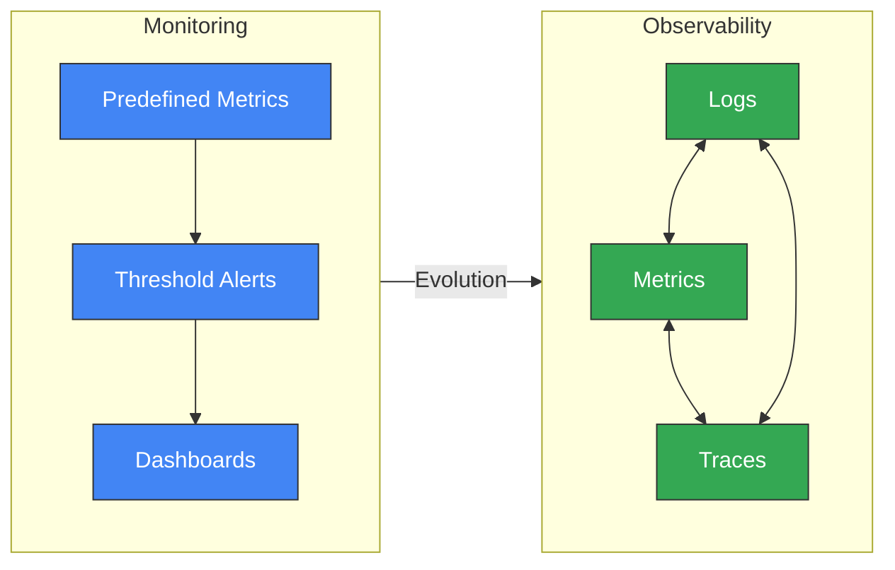
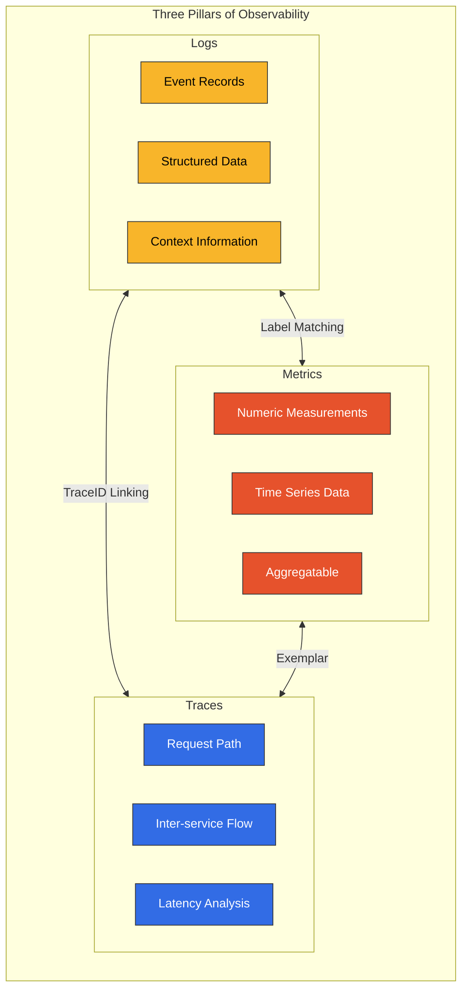
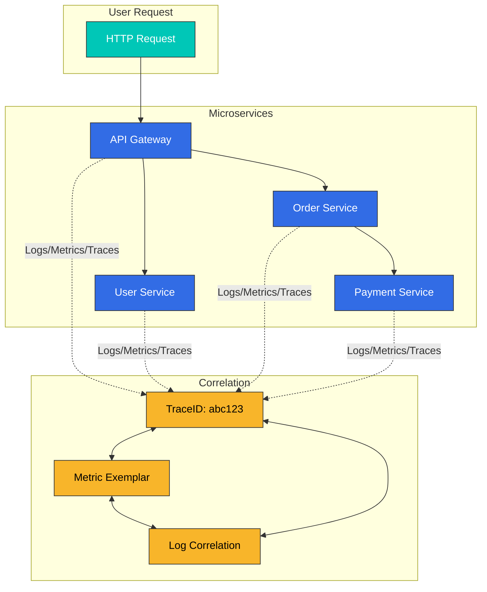
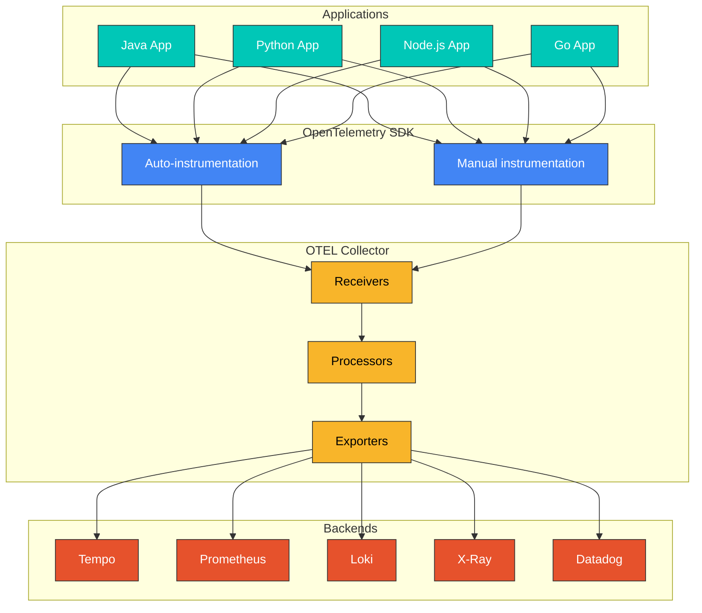
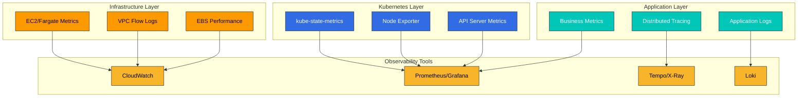
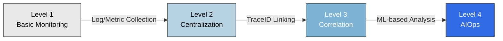

# 可观测性概述

> **最后更新**: February 20, 2026

## 简介

在现代分布式系统中，特别是基于 Kubernetes 的微服务架构中，通过外部输出观察和理解系统内部状态的能力至关重要。这被称为**可观测性（Observability）**。

## 可观测性与监控

可观测性和监控常常被交替使用，但两者存在根本差异：

| 方面 | 监控 | 可观测性 |
|--------|-----------|---------------|
| **方法** | 基于预定义的指标和阈值 | 通过系统输出推断内部状态 |
| **问题类型** | “出了什么问题？”（What） | “为什么会出问题？”（Why） |
| **数据范围** | 检测已知问题 | 探索未知问题 |
| **灵活性** | 预定义的仪表板 | 动态查询和探索 |
| **复杂性** | 适用于简单系统 | 对复杂分布式系统至关重要 |



## 可观测性的三大支柱

可观测性由三种核心数据类型构成：



### 1. 日志

日志是系统中发生的单个事件的记录。

**特性：**
- 离散且不可变的事件记录
- 包含时间戳和上下文信息
- 结构化（JSON）或非结构化格式
- 对调试和审计至关重要

**使用场景：**
- 错误和异常跟踪
- 安全审计
- 合规性
- 详细调试

**工具：**Loki、Elasticsearch、CloudWatch Logs、Fluent Bit

### 2. 指标

指标是随时间变化的数值测量结果。

**特性：**
- 以时间序列数据形式存储
- 支持聚合和数学运算
- 存储效率高
- 适用于趋势分析

**关键指标类型：**
- **Counter**：累计递增的值（例如，请求计数）
- **Gauge**：当前状态值（例如，CPU 使用率）
- **Histogram**：分布测量（例如，响应时间）
- **Summary**：分位数计算

**工具：**Prometheus、VictoriaMetrics、CloudWatch Metrics、Datadog

### 3. 追踪

追踪可跟踪请求跨越分布式系统的完整路径。

**特性：**
- 可视化服务之间的请求流
- 测量每个步骤的延迟
- 识别瓶颈
- 依赖关系分析

**组件：**
- **Trace**：单个请求的完整旅程
- **Span**：单个工作单元
- **SpanContext**：在服务之间传播的上下文

**工具：**Tempo、Jaeger、X-Ray、Zipkin、Datadog APM

## 三大支柱之间的关联

三大支柱并非彼此独立，而是相互关联，共同提供强大的分析能力：



### Trace 与日志关联

在日志中包含 TraceID，以跟踪与特定请求相关的所有日志：

```json
{
  "timestamp": "2025-02-15T10:30:00Z",
  "level": "ERROR",
  "message": "Payment processing failed",
  "traceId": "abc123def456",
  "spanId": "789xyz",
  "service": "payment-service"
}
```

### 指标与 Trace 关联（Exemplars）

将 TraceID 链接到指标，以便在发生异常时追踪请求：

```yaml
# Prometheus Exemplar
http_request_duration_seconds_bucket{le="0.5"} 1000 # {traceID="abc123"}
```

## OpenTelemetry 与标准化

OpenTelemetry（OTel）是可观测性数据收集的行业标准：



**OpenTelemetry 的优势：**
- 与供应商无关的标准
- 支持多种语言的 SDK
- 自动插桩能力
- 支持多个后端
- 活跃的社区

## EKS 环境的可观测性策略

在 Amazon EKS 中实施有效可观测性的策略：

### 1. 分层可观测性



### 2. 推荐工具栈

| 功能 | 开源 | AWS 原生 | 商业产品 |
|----------|-------------|------------|------------|
| 指标 | Prometheus、VictoriaMetrics | CloudWatch、AMP | Datadog、New Relic |
| 日志 | Loki、Elasticsearch | CloudWatch Logs | Splunk、Datadog |
| 追踪 | Tempo、Jaeger | X-Ray | Datadog APM、Dynatrace |
| 可视化 | Grafana | CloudWatch Dashboards | Datadog、Dynatrace |

### 3. 成本优化策略

- **采样**：通过对追踪数据采样降低成本
- **保留策略**：优化数据保留期限
- **分层存储**：将较旧的数据移至更低成本的存储
- **聚合**：存储聚合数据而非详细数据

## 可观测性成熟度模型



| 级别 | 特性 | 示例工具 |
|-------|-----------------|---------------|
| 级别 1 | 基础日志/指标收集 | kubectl logs、CloudWatch |
| 级别 2 | 集中式可观测性 | Loki、Prometheus、Grafana |
| 级别 3 | 三大支柱关联 | Tempo、Exemplars、TraceID |
| 级别 4 | AIOps、自动异常检测 | Datadog Watchdog、Dynatrace Davis |

## 章节指南

本可观测性章节的组织如下：

### [日志](./logging/)
日志收集、存储和分析的工具与策略：
- Loki：轻量级日志聚合系统
- Fluent Bit：高性能日志收集器
- CloudWatch Logs：AWS 原生日志记录

### [指标](./metrics/)
时间序列指标收集与分析：
- Prometheus：行业标准指标系统
- VictoriaMetrics：高性能 Prometheus 替代方案
- CloudWatch Metrics：AWS 原生指标

### [追踪](./tracing/)
分布式追踪和请求流分析：
- Tempo：Grafana 的分布式追踪后端
- X-Ray：AWS 原生分布式追踪
- OpenTelemetry：标准化插桩
- Dynatrace：AI 驱动的 APM

### [Grafana（仪表板）](./grafana/)
统一可视化和仪表板：
- 数据源集成
- 仪表板设计模式
- 告警配置

## 开始使用

如要开始实施可观测性，建议按以下顺序进行：

1. **设置指标收集**：部署 Prometheus 或 VictoriaMetrics
2. **设置日志收集**：部署 Loki 和 Fluent Bit
3. **设置追踪**：部署 Tempo 或 X-Ray
4. **可视化**：在 Grafana 中连接所有数据源
5. **关联**：配置基于 TraceID 的链接

## 参考资料

- [OpenTelemetry 官方文档](https://opentelemetry.io/docs/)
- [Grafana LGTM Stack](https://grafana.com/oss/lgtm-stack/)
- [AWS 可观测性最佳实践](https://aws-observability.github.io/observability-best-practices/)
- [SRE 工作手册 - 监控](https://sre.google/workbook/monitoring/)
