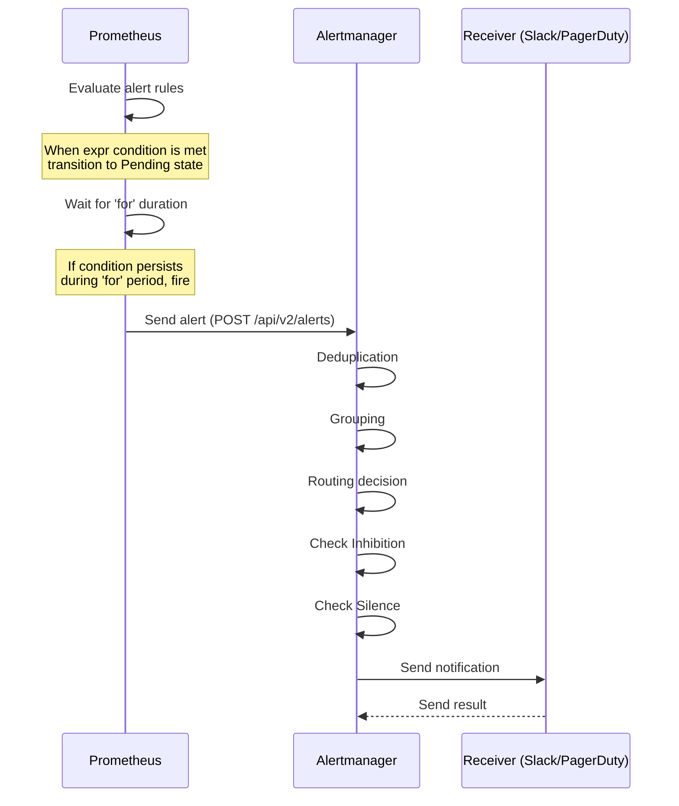
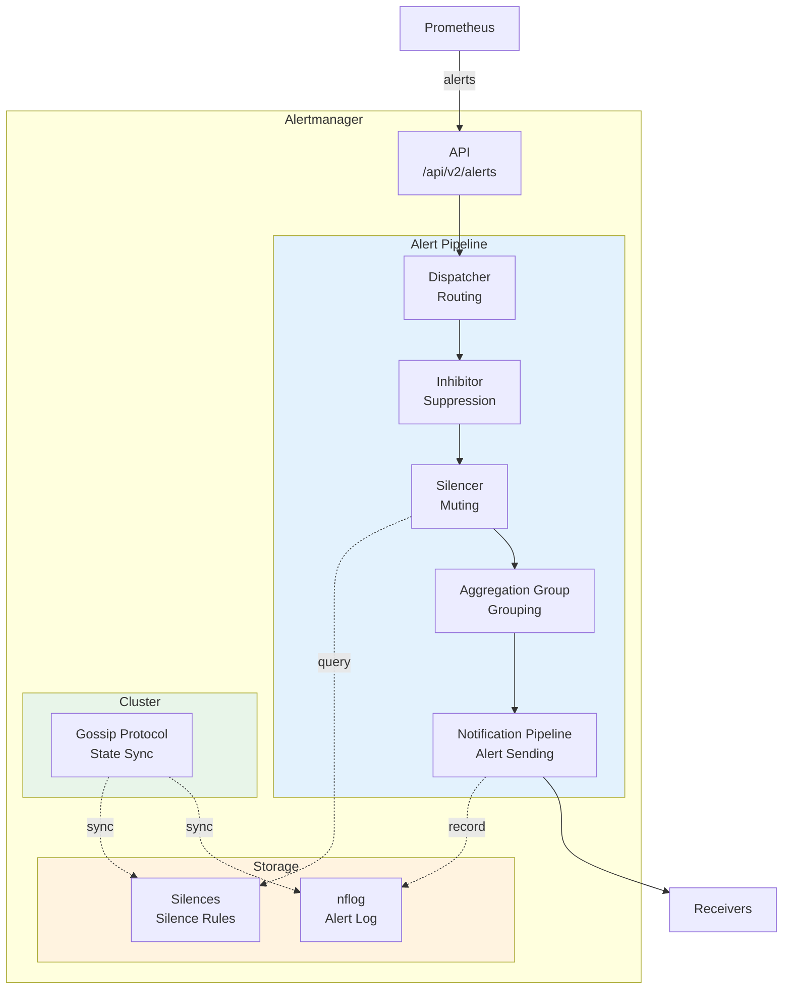
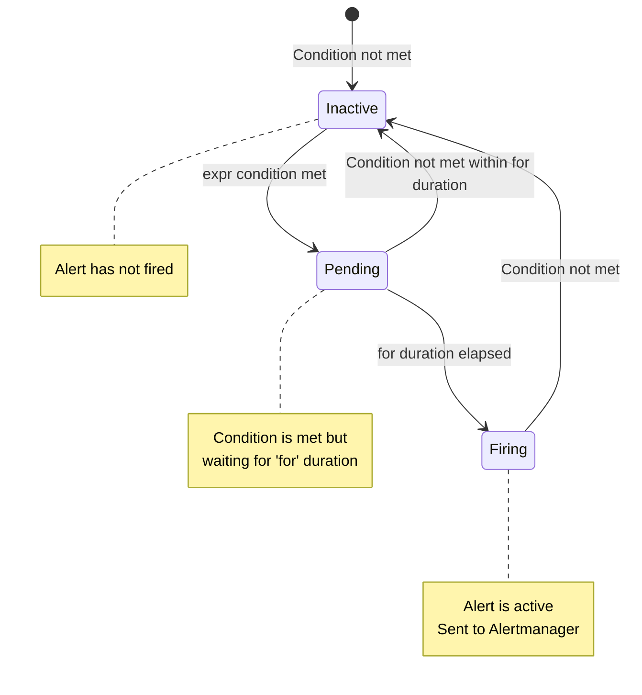
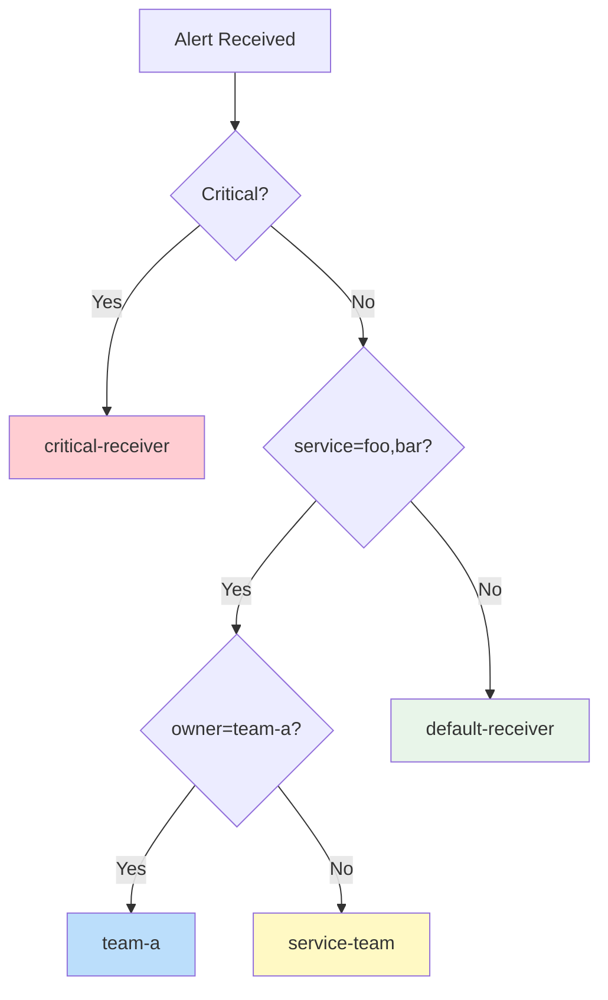
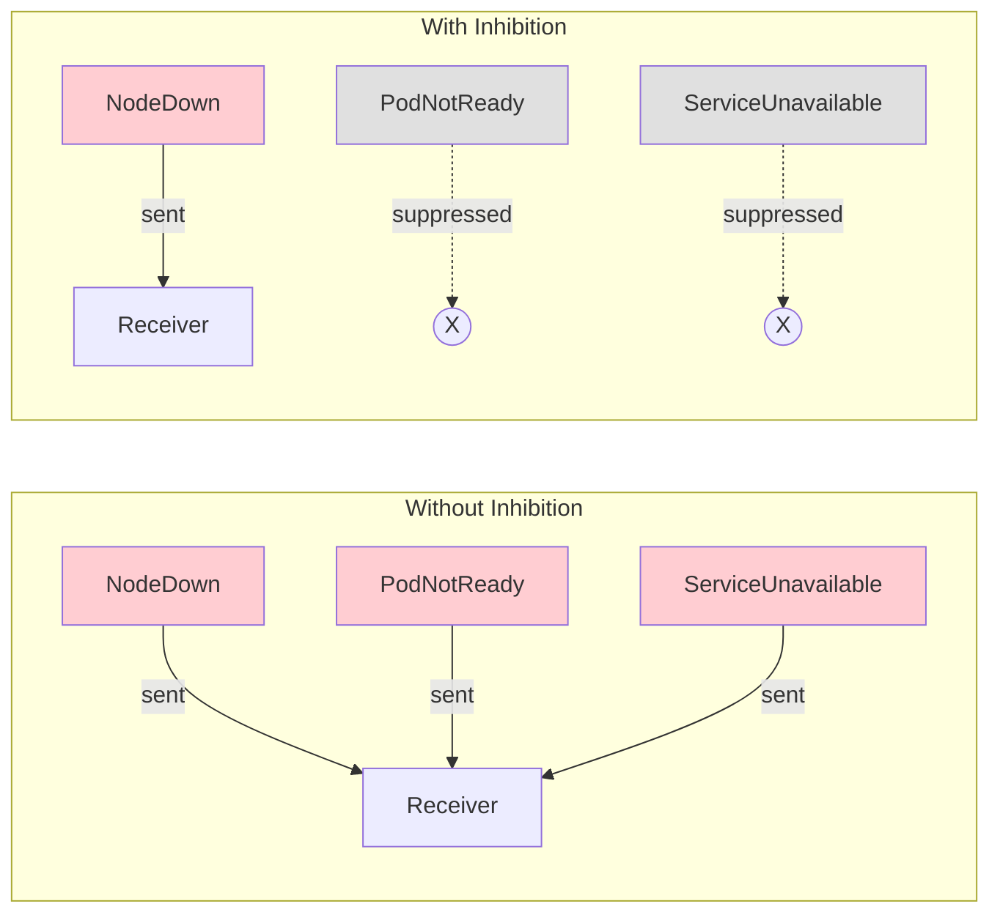
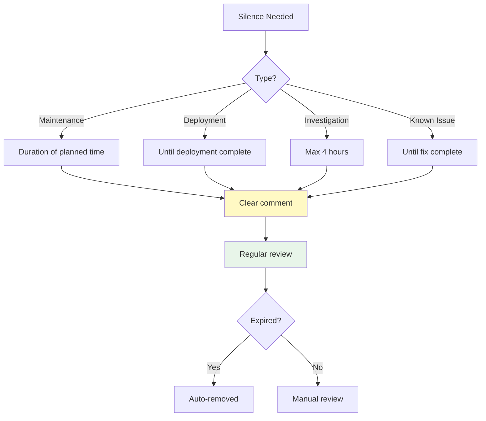
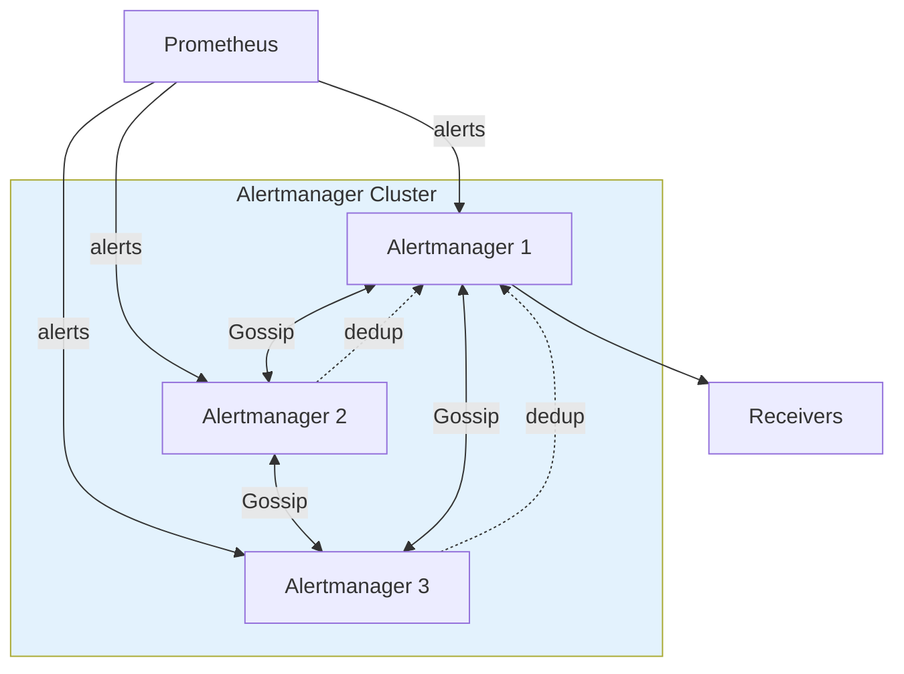

# Prometheus Alertmanager

> **支持的版本**: Alertmanager 0.27.x
> **最后更新**: February 20, 2026

## 目录

- [Alertmanager 概述](#alertmanager-overview)
- [架构](#architecture)
- [安装与配置](#installation-and-configuration)
- [定义告警规则](#defining-alert-rules)
- [路由配置](#routing-configuration)
- [接收器配置](#receiver-configuration)
- [抑制规则](#inhibition-rules)
- [静默](#silencing)
- [模板自定义](#template-customization)
- [高可用配置](#high-availability-configuration)
- [AlertmanagerConfig CRD](#alertmanagerconfig-crd)
- [生产环境告警规则示例](#production-alert-rule-examples)
- [故障排查](#troubleshooting)

---

## Alertmanager 概述

Prometheus Alertmanager 是一个处理 Prometheus server 发送告警的组件。它提供告警去重、分组、路由、抑制和静默等功能。

### 主要功能

1. **分组**：将相似的告警合并为一条通知
2. **抑制**：当特定告警触发时，抑制相关告警
3. **静默**：在特定时间段内忽略告警
4. **路由**：将告警发送到适当的接收器
5. **高可用**：通过集群实现冗余

### Prometheus 告警流程



---

## 架构

### Alertmanager 内部结构



### 组件说明

| 组件 | 作用 |
|-----------|------|
| **Dispatcher** | 根据路由树将告警路由到适当的接收器 |
| **Inhibitor** | 根据抑制规则抑制相关告警 |
| **Silencer** | 过滤匹配静默规则的告警 |
| **Aggregation Group** | 对同一组中的告警进行分组处理 |
| **Notification Pipeline** | 处理实际的告警发送 |
| **nflog** | 记录已发送的告警（用于去重） |

---

## 安装与配置

### 通过 Helm 安装（kube-prometheus-stack）

```bash
# Add Helm repository
helm repo add prometheus-community https://prometheus-community.github.io/helm-charts
helm repo update

# Install kube-prometheus-stack (includes Alertmanager)
helm install prometheus prometheus-community/kube-prometheus-stack \
  --namespace monitoring \
  --create-namespace \
  --set alertmanager.enabled=true
```

### Alertmanager 专用 Helm Chart

```bash
# Install Alertmanager separately
helm install alertmanager prometheus-community/alertmanager \
  --namespace monitoring \
  --create-namespace \
  -f alertmanager-values.yaml
```

### values.yaml 示例

```yaml
# alertmanager-values.yaml
alertmanager:
  enabled: true

  config:
    global:
      resolve_timeout: 5m
      slack_api_url: 'https://hooks.slack.com/services/xxx/yyy/zzz'

    route:
      receiver: 'default-receiver'
      group_by: ['alertname', 'namespace']
      group_wait: 30s
      group_interval: 5m
      repeat_interval: 4h

      routes:
        - match:
            severity: critical
          receiver: 'critical-receiver'

    receivers:
      - name: 'default-receiver'
        slack_configs:
          - channel: '#alerts'
            send_resolved: true

      - name: 'critical-receiver'
        slack_configs:
          - channel: '#critical-alerts'
            send_resolved: true
        pagerduty_configs:
          - service_key: '<pagerduty-service-key>'

    inhibit_rules:
      - source_match:
          severity: 'critical'
        target_match:
          severity: 'warning'
        equal: ['alertname', 'namespace']

  persistence:
    enabled: true
    size: 10Gi

  resources:
    requests:
      memory: 256Mi
      cpu: 100m
    limits:
      memory: 512Mi
      cpu: 200m

  replicas: 3  # High availability
```

### 通过 ConfigMap 直接配置

```yaml
apiVersion: v1
kind: ConfigMap
metadata:
  name: alertmanager-config
  namespace: monitoring
data:
  alertmanager.yml: |
    global:
      resolve_timeout: 5m

    route:
      receiver: 'default'
      group_by: ['alertname']

    receivers:
      - name: 'default'
        webhook_configs:
          - url: 'http://webhook-receiver:8080/alerts'
```

---

## 定义告警规则

### PrometheusRule CRD

使用 Prometheus Operator 时，可以通过 `PrometheusRule` CRD 定义告警规则。

```yaml
apiVersion: monitoring.coreos.com/v1
kind: PrometheusRule
metadata:
  name: kubernetes-alerts
  namespace: monitoring
  labels:
    release: prometheus  # Prometheus selects rules with this label
spec:
  groups:
    - name: kubernetes.rules
      interval: 30s  # Rule evaluation interval
      rules:
        # Node alerts
        - alert: NodeNotReady
          expr: kube_node_status_condition{condition="Ready",status="true"} == 0
          for: 5m
          labels:
            severity: critical
            team: sre
          annotations:
            summary: "Node {{ $labels.node }} is not ready"
            description: "Node {{ $labels.node }} has been not ready for more than 5 minutes."
            runbook_url: "https://wiki.company.com/runbooks/node-not-ready"

        # Pod alerts
        - alert: PodCrashLooping
          expr: |
            rate(kube_pod_container_status_restarts_total[15m]) * 60 * 15 > 3
          for: 5m
          labels:
            severity: warning
            team: dev
          annotations:
            summary: "Pod {{ $labels.namespace }}/{{ $labels.pod }} is crash looping"
            description: "Pod has restarted {{ $value | printf \"%.0f\" }} times in the last 15 minutes."
```

### 告警规则组成部分

```yaml
rules:
  - alert: AlertName           # Alert name (required)
    expr: <PromQL expression>  # Alert condition (required)
    for: 5m                    # Duration condition must persist (optional, default 0)
    labels:                    # Additional labels (optional)
      severity: warning
      team: sre
    annotations:               # Metadata (optional)
      summary: "Summary"
      description: "Detailed description"
      runbook_url: "Runbook URL"
```

### 告警状态



---

## 路由配置

### 路由树结构

Alertmanager 路由配置为树形结构。

```yaml
route:
  # Default receiver (required)
  receiver: 'default-receiver'

  # Grouping criteria
  group_by: ['alertname', 'cluster', 'namespace']

  # Wait time before first notification
  group_wait: 30s

  # Wait time for additional alerts in the same group
  group_interval: 5m

  # Resend interval for identical alerts
  repeat_interval: 4h

  # Child routes
  routes:
    - match:
        severity: critical
      receiver: 'critical-receiver'
      group_wait: 10s

    - match_re:
        service: ^(foo|bar)$
      receiver: 'service-team'
      routes:
        - match:
            owner: team-a
          receiver: 'team-a'
```

### 路由流程



### 匹配器

```yaml
routes:
  # Exact match
  - match:
      severity: critical
      namespace: production
    receiver: 'prod-critical'

  # Regex match
  - match_re:
      service: ^(api|web|worker).*$
      environment: ^prod.*$
    receiver: 'prod-team'

  # Multiple conditions (AND)
  - matchers:
      - severity = critical
      - namespace =~ "prod.*"
    receiver: 'prod-critical'
```

### 高级路由示例

```yaml
route:
  receiver: 'default'
  group_by: ['alertname', 'namespace']
  routes:
    # Send only Critical outside business hours
    - match:
        severity: critical
      receiver: 'oncall'
      active_time_intervals:
        - offhours

    # Send all alerts during business hours
    - receiver: 'team-slack'
      active_time_intervals:
        - business-hours
      routes:
        - match:
            team: infra
          receiver: 'infra-team'
        - match:
            team: dev
          receiver: 'dev-team'

# Time interval definitions
time_intervals:
  - name: business-hours
    time_intervals:
      - weekdays: ['monday:friday']
        times:
          - start_time: '09:00'
            end_time: '18:00'
        location: 'Asia/Seoul'

  - name: offhours
    time_intervals:
      - weekdays: ['monday:friday']
        times:
          - start_time: '18:00'
            end_time: '09:00'
      - weekdays: ['saturday', 'sunday']
```

---

## 接收器配置

### Slack 接收器

```yaml
receivers:
  - name: 'slack-notifications'
    slack_configs:
      - api_url: 'https://hooks.slack.com/services/T00/B00/XXX'
        channel: '#alerts'
        username: 'Alertmanager'
        icon_emoji: ':warning:'
        send_resolved: true

        # Message title
        title: '{{ template "slack.default.title" . }}'

        # Message body
        text: |
          {{ range .Alerts }}
          *Alert:* {{ .Labels.alertname }}
          *Severity:* {{ .Labels.severity }}
          *Description:* {{ .Annotations.description }}
          *Details:*
          {{ range .Labels.SortedPairs }}• *{{ .Name }}:* `{{ .Value }}`
          {{ end }}
          {{ end }}

        # Color (resolved: good, firing: danger)
        color: '{{ if eq .Status "firing" }}danger{{ else }}good{{ end }}'

        # Add fields
        fields:
          - title: Severity
            value: '{{ .CommonLabels.severity }}'
            short: true
          - title: Namespace
            value: '{{ .CommonLabels.namespace }}'
            short: true
```

### PagerDuty 接收器

```yaml
receivers:
  - name: 'pagerduty-critical'
    pagerduty_configs:
      - service_key: '<integration-key>'
        severity: '{{ .CommonLabels.severity }}'
        description: '{{ .CommonAnnotations.summary }}'
        client: 'Alertmanager'
        client_url: 'https://alertmanager.example.com'

        details:
          alertname: '{{ .CommonLabels.alertname }}'
          namespace: '{{ .CommonLabels.namespace }}'
          description: '{{ .CommonAnnotations.description }}'

        # Add links
        links:
          - href: '{{ .CommonAnnotations.runbook_url }}'
            text: 'Runbook'
          - href: 'https://grafana.example.com/d/xxx?var-namespace={{ .CommonLabels.namespace }}'
            text: 'Dashboard'
```

### Email 接收器

```yaml
receivers:
  - name: 'email-alerts'
    email_configs:
      - to: 'team@example.com'
        from: 'alertmanager@example.com'
        smarthost: 'smtp.example.com:587'
        auth_username: 'alertmanager@example.com'
        auth_password: '<password>'
        send_resolved: true

        # HTML template
        html: '{{ template "email.default.html" . }}'

        # Subject
        headers:
          Subject: '[{{ .Status | toUpper }}] {{ .CommonLabels.alertname }}'
```

### OpsGenie 接收器

```yaml
receivers:
  - name: 'opsgenie-alerts'
    opsgenie_configs:
      - api_key: '<api-key>'
        api_url: 'https://api.opsgenie.com/'
        message: '{{ .CommonLabels.alertname }}'
        description: '{{ .CommonAnnotations.description }}'
        priority: '{{ if eq .CommonLabels.severity "critical" }}P1{{ else if eq .CommonLabels.severity "warning" }}P3{{ else }}P5{{ end }}'

        # Tags
        tags: 'kubernetes,{{ .CommonLabels.namespace }}'

        # Team assignment
        teams:
          - name: 'sre-team'

        # Details
        details:
          alertname: '{{ .CommonLabels.alertname }}'
          namespace: '{{ .CommonLabels.namespace }}'
          severity: '{{ .CommonLabels.severity }}'
```

### Webhook 接收器

```yaml
receivers:
  - name: 'webhook-receiver'
    webhook_configs:
      - url: 'http://webhook-handler.monitoring:8080/alerts'
        send_resolved: true
        max_alerts: 10

        # HTTP configuration
        http_config:
          basic_auth:
            username: 'alertmanager'
            password: '<password>'
          tls_config:
            insecure_skip_verify: false
```

### 多接收器配置

```yaml
receivers:
  - name: 'team-all'
    slack_configs:
      - channel: '#alerts'
        api_url: '<slack-webhook-url>'
    email_configs:
      - to: 'team@example.com'
    pagerduty_configs:
      - service_key: '<integration-key>'
```

---

## 抑制规则

### 抑制概念

抑制是一项在特定告警触发时抑制相关告警的功能。



### 抑制规则配置

```yaml
inhibit_rules:
  # Suppress pod alerts when node is down
  - source_match:
      alertname: NodeDown
    target_match_re:
      alertname: ^(PodNotReady|PodCrashLooping|ContainerOOMKilled)$
    equal: ['node']

  # Suppress warning when critical alert exists
  - source_match:
      severity: critical
    target_match:
      severity: warning
    equal: ['alertname', 'namespace']

  # Suppress all node alerts when cluster is down
  - source_match:
      alertname: ClusterDown
    target_match_re:
      alertname: ^Node.*$
    equal: ['cluster']

  # Suppress connection error alerts when database is down
  - source_matchers:
      - alertname = DatabaseDown
    target_matchers:
      - alertname =~ "DatabaseConnection.*|DatabaseTimeout.*"
    equal: ['instance']
```

### 抑制优先级

```yaml
inhibit_rules:
  # Priority 1: Infrastructure failure
  - source_match:
      alertname: InfrastructureFailure
    target_match_re:
      alertname: .*
    equal: ['datacenter']

  # Priority 2: Node failure
  - source_match:
      alertname: NodeDown
    target_match_re:
      alertname: ^(Pod|Container).*$
    equal: ['node']

  # Priority 3: Service failure
  - source_match:
      alertname: ServiceDown
    target_match_re:
      alertname: ^Endpoint.*$
    equal: ['service', 'namespace']
```

---

## 静默

### 创建静默

可以通过 Alertmanager UI 或 API 创建静默。

#### 使用 amtool CLI

```bash
# Create silence (2 hours)
amtool silence add alertname=PodCrashLooping namespace=development \
  --duration=2h \
  --comment="Deployment in progress in dev environment" \
  --author="ops@example.com"

# Silence until specific time
amtool silence add alertname=NodeDown node="worker-1" \
  --end="2025-02-21T18:00:00+09:00" \
  --comment="Node maintenance" \
  --author="ops@example.com"

# List silences
amtool silence query

# Expire silence
amtool silence expire <silence-id>
```

#### 通过 API 创建静默

```bash
curl -X POST http://alertmanager:9093/api/v2/silences \
  -H "Content-Type: application/json" \
  -d '{
    "matchers": [
      {"name": "alertname", "value": "HighCPU", "isRegex": false},
      {"name": "namespace", "value": "dev.*", "isRegex": true}
    ],
    "startsAt": "2025-02-20T10:00:00Z",
    "endsAt": "2025-02-20T14:00:00Z",
    "createdBy": "ops@example.com",
    "comment": "Dev environment load testing"
  }'
```

### 静默管理最佳实践



**建议：**

1. **始终填写备注**：记录创建静默的原因
2. **设置最短时长**：仅在必要时长内静默
3. **定期审查**：定期审查长期静默
4. **设置通知**：在静默过期前发出告警

---

## 模板自定义

### Go 模板基础

Alertmanager 使用 Go 模板。

```yaml
# Template file definition
templates:
  - '/etc/alertmanager/templates/*.tmpl'
```

### Slack 模板示例

```go
{{ define "slack.custom.title" }}
[{{ .Status | toUpper }}{{ if eq .Status "firing" }}:{{ .Alerts.Firing | len }}{{ end }}] {{ .CommonLabels.alertname }}
{{ end }}

{{ define "slack.custom.text" }}
{{ range .Alerts }}
*Alert:* {{ .Labels.alertname }}
*Severity:* `{{ .Labels.severity }}`
*Namespace:* `{{ .Labels.namespace }}`
*Description:* {{ .Annotations.description }}
*Started:* {{ .StartsAt.Format "2006-01-02 15:04:05 MST" }}
{{ if .Annotations.runbook_url }}*Runbook:* <{{ .Annotations.runbook_url }}|Link>{{ end }}
---
{{ end }}
{{ end }}

{{ define "slack.custom.color" }}
{{ if eq .Status "firing" }}
{{ if eq .CommonLabels.severity "critical" }}#ff0000{{ else if eq .CommonLabels.severity "warning" }}#ff9900{{ else }}#439fe0{{ end }}
{{ else }}#36a64f{{ end }}
{{ end }}
```

### 模板函数

```go
{{ define "custom.message" }}
{{ /* String manipulation */ }}
{{ .Labels.alertname | title }}
{{ .Labels.namespace | toUpper }}

{{ /* Conditionals */ }}
{{ if eq .Labels.severity "critical" }}Urgent{{ else }}Normal{{ end }}

{{ /* Loops */ }}
{{ range .Alerts }}
- {{ .Labels.alertname }}
{{ end }}

{{ /* Date format */ }}
{{ .StartsAt.Format "2006-01-02 15:04" }}

{{ /* Number format */ }}
{{ $value := 95.5 }}
{{ printf "%.2f%%" $value }}

{{ /* Label sorting */ }}
{{ range .Labels.SortedPairs }}
{{ .Name }}: {{ .Value }}
{{ end }}
{{ end }}
```

### 通过 ConfigMap 管理模板

```yaml
apiVersion: v1
kind: ConfigMap
metadata:
  name: alertmanager-templates
  namespace: monitoring
data:
  slack.tmpl: |
    {{ define "slack.custom.title" }}
    [{{ .Status | toUpper }}] {{ .CommonLabels.alertname }}
    {{ end }}

    {{ define "slack.custom.text" }}
    {{ range .Alerts }}
    *Severity:* {{ .Labels.severity }}
    *Description:* {{ .Annotations.description }}
    {{ end }}
    {{ end }}
```

---

## 高可用配置

### 集群架构



### StatefulSet 配置

```yaml
apiVersion: apps/v1
kind: StatefulSet
metadata:
  name: alertmanager
  namespace: monitoring
spec:
  serviceName: alertmanager
  replicas: 3
  selector:
    matchLabels:
      app: alertmanager
  template:
    metadata:
      labels:
        app: alertmanager
    spec:
      containers:
        - name: alertmanager
          image: quay.io/prometheus/alertmanager:v0.27.0
          args:
            - '--config.file=/etc/alertmanager/alertmanager.yml'
            - '--storage.path=/alertmanager'
            - '--cluster.listen-address=0.0.0.0:9094'
            - '--cluster.peer=alertmanager-0.alertmanager:9094'
            - '--cluster.peer=alertmanager-1.alertmanager:9094'
            - '--cluster.peer=alertmanager-2.alertmanager:9094'
          ports:
            - containerPort: 9093
              name: http
            - containerPort: 9094
              name: cluster
          volumeMounts:
            - name: config
              mountPath: /etc/alertmanager
            - name: storage
              mountPath: /alertmanager
          resources:
            requests:
              memory: 256Mi
              cpu: 100m
            limits:
              memory: 512Mi
              cpu: 200m
      volumes:
        - name: config
          configMap:
            name: alertmanager-config
  volumeClaimTemplates:
    - metadata:
        name: storage
      spec:
        accessModes: ["ReadWriteOnce"]
        resources:
          requests:
            storage: 10Gi
---
apiVersion: v1
kind: Service
metadata:
  name: alertmanager
  namespace: monitoring
spec:
  type: ClusterIP
  clusterIP: None  # Headless service
  ports:
    - port: 9093
      name: http
    - port: 9094
      name: cluster
  selector:
    app: alertmanager
```

### Prometheus 集成配置

```yaml
# Prometheus configuration
alerting:
  alertmanagers:
    - static_configs:
        - targets:
            - alertmanager-0.alertmanager:9093
            - alertmanager-1.alertmanager:9093
            - alertmanager-2.alertmanager:9093
      # Or DNS-based
    - dns_sd_configs:
        - names:
            - alertmanager.monitoring.svc
          type: A
          port: 9093
```

---

## AlertmanagerConfig CRD

### 按 Namespace 划分的配置

Prometheus Operator 的 `AlertmanagerConfig` CRD 允许您按 Namespace 分离告警配置。

```yaml
apiVersion: monitoring.coreos.com/v1alpha1
kind: AlertmanagerConfig
metadata:
  name: team-a-config
  namespace: team-a
  labels:
    alertmanagerConfig: team-a
spec:
  route:
    receiver: 'team-a-slack'
    groupBy: ['alertname']
    matchers:
      - name: namespace
        value: team-a
    routes:
      - receiver: 'team-a-critical'
        matchers:
          - name: severity
            value: critical

  receivers:
    - name: 'team-a-slack'
      slackConfigs:
        - apiURL:
            name: slack-webhook-secret
            key: webhook-url
          channel: '#team-a-alerts'
          sendResolved: true

    - name: 'team-a-critical'
      slackConfigs:
        - apiURL:
            name: slack-webhook-secret
            key: webhook-url
          channel: '#team-a-critical'
      pagerdutyConfigs:
        - routingKey:
            name: pagerduty-secret
            key: routing-key

  inhibitRules:
    - sourceMatch:
        - name: severity
          value: critical
      targetMatch:
        - name: severity
          value: warning
      equal: ['alertname']
```

### Secret 引用

```yaml
apiVersion: v1
kind: Secret
metadata:
  name: slack-webhook-secret
  namespace: team-a
type: Opaque
stringData:
  webhook-url: "https://hooks.slack.com/services/xxx/yyy/zzz"
---
apiVersion: v1
kind: Secret
metadata:
  name: pagerduty-secret
  namespace: team-a
type: Opaque
stringData:
  routing-key: "<pagerduty-routing-key>"
```

### Alertmanager AlertmanagerConfig 选择

```yaml
apiVersion: monitoring.coreos.com/v1
kind: Alertmanager
metadata:
  name: main
  namespace: monitoring
spec:
  replicas: 3
  alertmanagerConfigSelector:
    matchLabels:
      alertmanagerConfig: enabled
  alertmanagerConfigNamespaceSelector: {}  # All namespaces
```

---

## 生产环境告警规则示例

### Node 告警

```yaml
apiVersion: monitoring.coreos.com/v1
kind: PrometheusRule
metadata:
  name: node-alerts
  namespace: monitoring
spec:
  groups:
    - name: node.rules
      rules:
        - alert: NodeDown
          expr: up{job="node-exporter"} == 0
          for: 5m
          labels:
            severity: critical
          annotations:
            summary: "Node {{ $labels.instance }} is down"
            description: "Node exporter is not responding for more than 5 minutes."

        - alert: NodeHighCPU
          expr: |
            100 - (avg by(instance) (rate(node_cpu_seconds_total{mode="idle"}[5m])) * 100) > 80
          for: 10m
          labels:
            severity: warning
          annotations:
            summary: "High CPU usage on {{ $labels.instance }}"
            description: "CPU usage is {{ $value | printf \"%.2f\" }}%"

        - alert: NodeHighMemory
          expr: |
            (1 - (node_memory_MemAvailable_bytes / node_memory_MemTotal_bytes)) * 100 > 90
          for: 10m
          labels:
            severity: warning
          annotations:
            summary: "High memory usage on {{ $labels.instance }}"
            description: "Memory usage is {{ $value | printf \"%.2f\" }}%"

        - alert: NodeDiskPressure
          expr: |
            (node_filesystem_avail_bytes{fstype!~"tmpfs|overlay"} / node_filesystem_size_bytes) * 100 < 15
          for: 5m
          labels:
            severity: warning
          annotations:
            summary: "Low disk space on {{ $labels.instance }}"
            description: "Disk {{ $labels.mountpoint }} has only {{ $value | printf \"%.2f\" }}% free"

        - alert: NodeNetworkErrors
          expr: |
            rate(node_network_receive_errs_total[5m]) > 10
            or
            rate(node_network_transmit_errs_total[5m]) > 10
          for: 5m
          labels:
            severity: warning
          annotations:
            summary: "Network errors on {{ $labels.instance }}"
```

### Pod 和 Container 告警

```yaml
apiVersion: monitoring.coreos.com/v1
kind: PrometheusRule
metadata:
  name: pod-alerts
  namespace: monitoring
spec:
  groups:
    - name: pod.rules
      rules:
        - alert: PodNotReady
          expr: |
            kube_pod_status_phase{phase=~"Pending|Unknown"} > 0
          for: 15m
          labels:
            severity: warning
          annotations:
            summary: "Pod {{ $labels.namespace }}/{{ $labels.pod }} is not ready"

        - alert: PodCrashLooping
          expr: |
            rate(kube_pod_container_status_restarts_total[15m]) * 60 * 15 > 3
          for: 5m
          labels:
            severity: warning
          annotations:
            summary: "Pod {{ $labels.namespace }}/{{ $labels.pod }} is crash looping"
            description: "Pod has restarted {{ $value | printf \"%.0f\" }} times in 15 minutes"

        - alert: ContainerOOMKilled
          expr: |
            kube_pod_container_status_last_terminated_reason{reason="OOMKilled"} > 0
          for: 0m
          labels:
            severity: warning
          annotations:
            summary: "Container {{ $labels.container }} in {{ $labels.namespace }}/{{ $labels.pod }} was OOM killed"

        - alert: ContainerCPUThrottled
          expr: |
            rate(container_cpu_cfs_throttled_seconds_total[5m]) > 0.5
          for: 10m
          labels:
            severity: warning
          annotations:
            summary: "Container {{ $labels.container }} is being CPU throttled"

        - alert: ContainerMemoryNearLimit
          expr: |
            (container_memory_working_set_bytes / container_spec_memory_limit_bytes) > 0.9
          for: 5m
          labels:
            severity: warning
          annotations:
            summary: "Container {{ $labels.container }} memory usage is near limit"
            description: "Memory usage is {{ $value | printf \"%.2f\" }}% of limit"
```

### API Server 告警

```yaml
apiVersion: monitoring.coreos.com/v1
kind: PrometheusRule
metadata:
  name: apiserver-alerts
  namespace: monitoring
spec:
  groups:
    - name: apiserver.rules
      rules:
        - alert: KubeAPIServerDown
          expr: |
            absent(up{job="kubernetes-apiservers"} == 1)
          for: 5m
          labels:
            severity: critical
          annotations:
            summary: "Kubernetes API server is down"

        - alert: KubeAPIServerLatencyHigh
          expr: |
            histogram_quantile(0.99,
              sum(rate(apiserver_request_duration_seconds_bucket{verb!~"WATCH|CONNECT"}[5m]))
              by (verb, resource, le)
            ) > 1
          for: 10m
          labels:
            severity: warning
          annotations:
            summary: "API server latency is high"
            description: "99th percentile latency for {{ $labels.verb }} {{ $labels.resource }} is {{ $value | printf \"%.2f\" }}s"

        - alert: KubeAPIServerErrors
          expr: |
            sum(rate(apiserver_request_total{code=~"5.."}[5m])) /
            sum(rate(apiserver_request_total[5m])) > 0.01
          for: 10m
          labels:
            severity: warning
          annotations:
            summary: "API server error rate is high"
            description: "Error rate is {{ $value | printf \"%.2f\" }}%"

        - alert: KubeClientCertificateExpiration
          expr: |
            apiserver_client_certificate_expiration_seconds_count > 0
            and
            apiserver_client_certificate_expiration_seconds_bucket{le="604800"} > 0
          for: 0m
          labels:
            severity: warning
          annotations:
            summary: "Client certificate will expire within 7 days"
```

### etcd 告警

```yaml
apiVersion: monitoring.coreos.com/v1
kind: PrometheusRule
metadata:
  name: etcd-alerts
  namespace: monitoring
spec:
  groups:
    - name: etcd.rules
      rules:
        - alert: EtcdMembersDown
          expr: |
            count(etcd_server_id) < 3
          for: 5m
          labels:
            severity: critical
          annotations:
            summary: "etcd cluster has less than 3 members"

        - alert: EtcdNoLeader
          expr: |
            etcd_server_has_leader == 0
          for: 1m
          labels:
            severity: critical
          annotations:
            summary: "etcd cluster has no leader"

        - alert: EtcdHighCommitDuration
          expr: |
            histogram_quantile(0.99, rate(etcd_disk_backend_commit_duration_seconds_bucket[5m])) > 0.25
          for: 10m
          labels:
            severity: warning
          annotations:
            summary: "etcd commit duration is high"
            description: "99th percentile commit duration is {{ $value | printf \"%.3f\" }}s"

        - alert: EtcdHighFsyncDuration
          expr: |
            histogram_quantile(0.99, rate(etcd_disk_wal_fsync_duration_seconds_bucket[5m])) > 0.5
          for: 10m
          labels:
            severity: warning
          annotations:
            summary: "etcd fsync duration is high"

        - alert: EtcdDatabaseSizeLarge
          expr: |
            etcd_mvcc_db_total_size_in_bytes > 6e+9
          for: 5m
          labels:
            severity: warning
          annotations:
            summary: "etcd database size is large"
            description: "Database size is {{ $value | humanize1024 }}B"
```

---

## 故障排查

### 常见问题及解决方案

#### 告警未发送

```bash
# 1. Check Alertmanager logs
kubectl logs -n monitoring alertmanager-main-0

# 2. Check configuration
kubectl exec -n monitoring alertmanager-main-0 -- cat /etc/alertmanager/config/alertmanager.yaml

# 3. Check alert status (API)
curl http://alertmanager:9093/api/v2/alerts

# 4. Check silences
curl http://alertmanager:9093/api/v2/silences

# 5. Check alerts firing from Prometheus
curl http://prometheus:9090/api/v1/alerts
```

#### 重复告警

```yaml
# Check group_by configuration
route:
  group_by: ['alertname', 'namespace', 'pod']  # Set appropriate grouping keys
  group_wait: 30s
  group_interval: 5m
  repeat_interval: 4h  # Set sufficient interval
```

#### 告警发送到错误的接收器

```bash
# Test routing
amtool config routes test \
  --config.file=/etc/alertmanager/alertmanager.yml \
  alertname=HighCPU severity=warning namespace=production

# Output: Shows which receiver the alert would be routed to
```

### amtool 命令参考

```bash
# Validate configuration
amtool check-config /etc/alertmanager/alertmanager.yml

# List alerts
amtool alert query

# Query specific alerts
amtool alert query alertname=HighCPU

# Create silence
amtool silence add alertname=HighCPU --duration=2h --comment="Testing"

# List silences
amtool silence query

# Expire silence
amtool silence expire <silence-id>

# Test routing
amtool config routes test --config.file=config.yml alertname=Test severity=warning
```

### 指标验证

```promql
# Alertmanager metrics

# Received alerts count
alertmanager_alerts_received_total

# Invalid alerts count
alertmanager_alerts_invalid_total

# Failed sends count
alertmanager_notifications_failed_total

# Successful sends count
alertmanager_notifications_total

# Current active alerts count
alertmanager_alerts

# Current silences count
alertmanager_silences

# Cluster status
alertmanager_cluster_members
```

### 调试提示

```yaml
# 1. Add debug receiver
receivers:
  - name: 'debug'
    webhook_configs:
      - url: 'http://localhost:5001/'  # Use webhook.site etc.
        send_resolved: true

# 2. Increase log level
containers:
  - name: alertmanager
    args:
      - '--log.level=debug'

# 3. Send test alert
curl -X POST http://alertmanager:9093/api/v2/alerts \
  -H "Content-Type: application/json" \
  -d '[{
    "labels": {
      "alertname": "TestAlert",
      "severity": "warning"
    },
    "annotations": {
      "summary": "This is a test alert"
    }
  }]'
```

---

## 测验

通过 [Alertmanager 测验](../../quizzes/observability/alerting/01-alertmanager-quiz.md) 测试您的知识。
