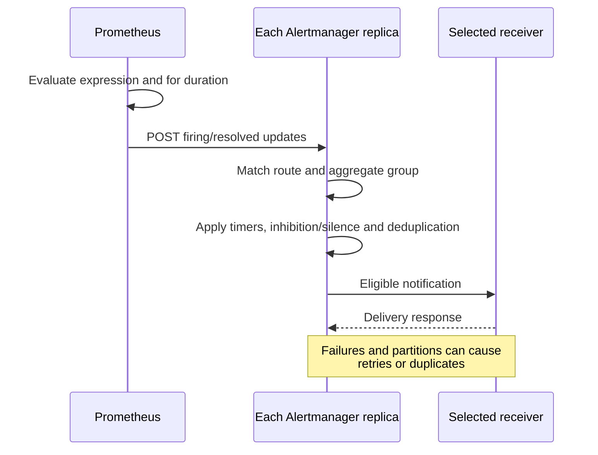
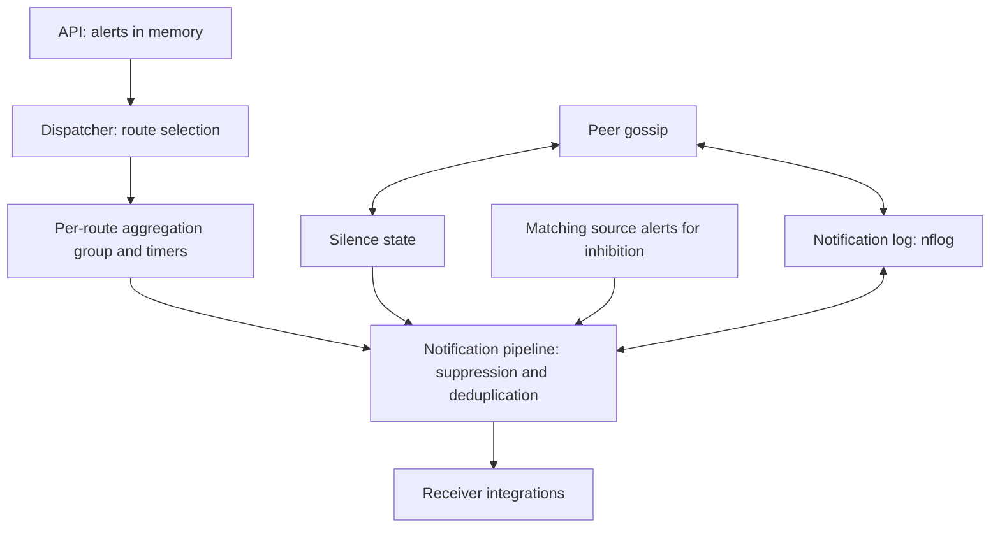
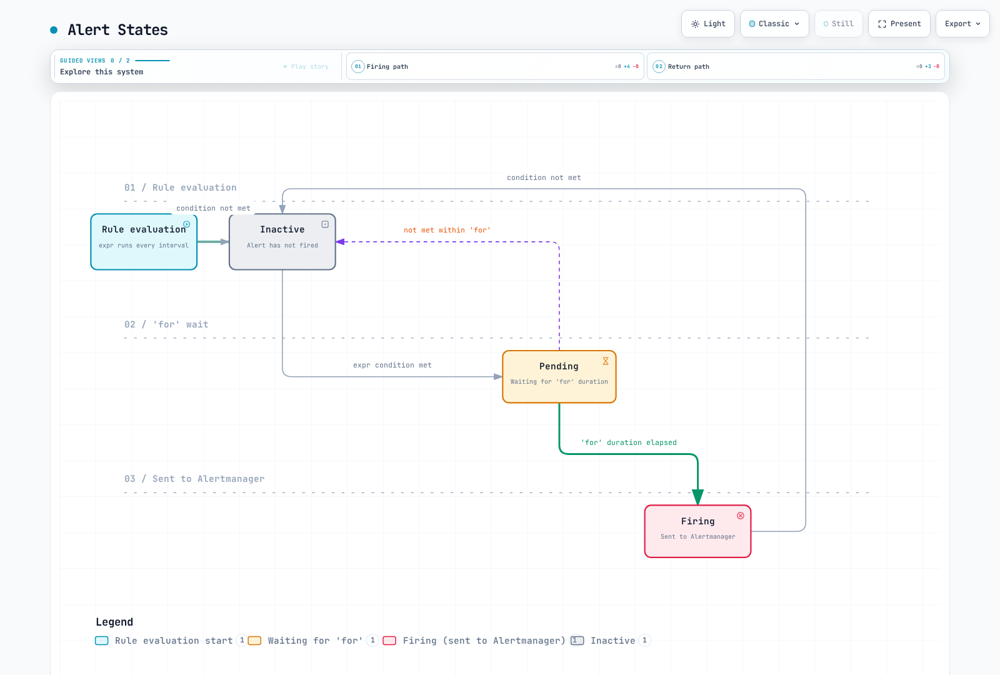
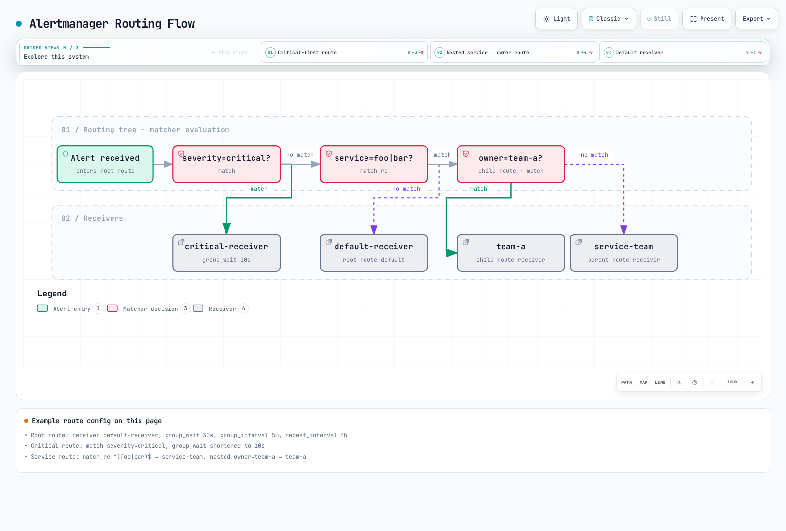
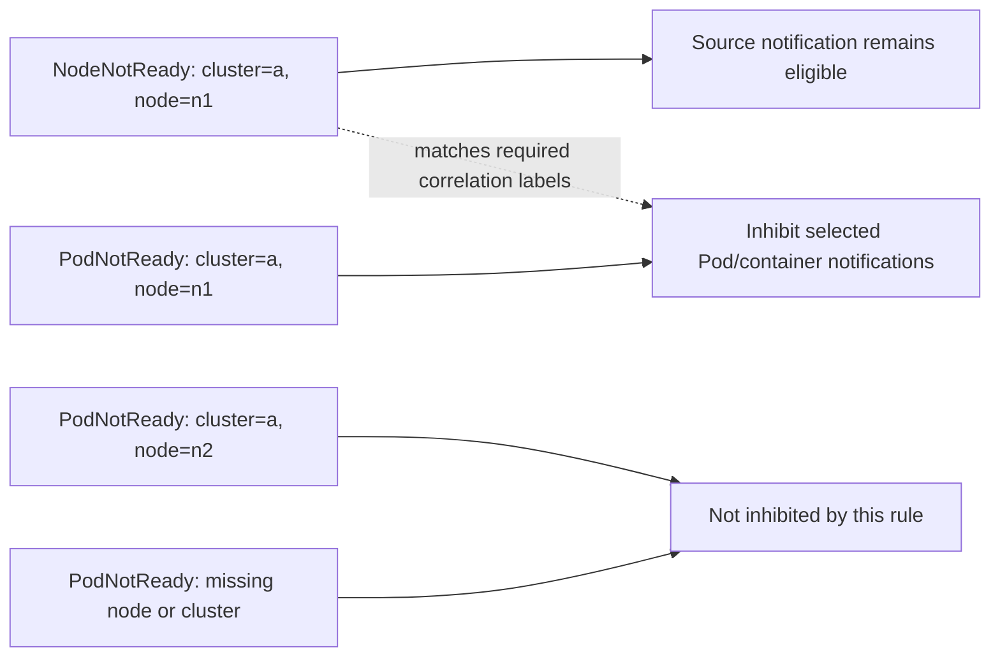
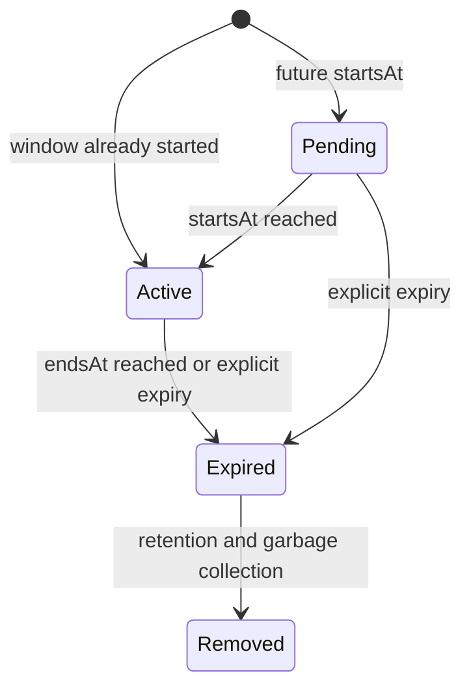
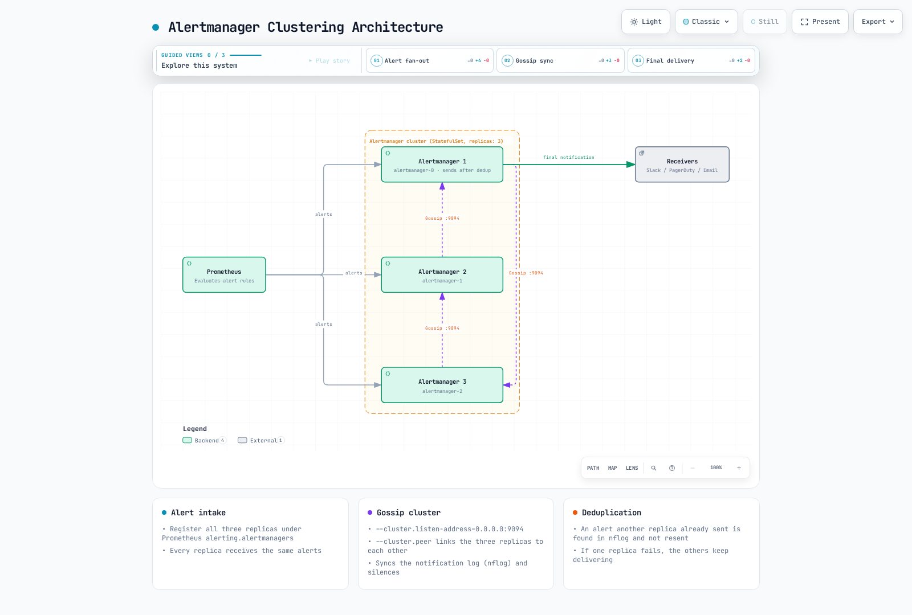

# Prometheus Alertmanager

> **审阅基线**：Alertmanager 0.34.0；kube-prometheus-stack 90.0.0 / Operator 0.93.1；独立 chart 1.43.1
> **Last Updated**: September 13, 2026

## 目录

- [Alertmanager 概述](#alertmanager-overview)
- [架构](#architecture)
- [安装与配置](#installation-and-configuration)
- [定义告警规则](#defining-alert-rules)
- [路由配置](#routing-configuration)
- [接收器配置](#receiver-configuration)
- [抑制规则](#inhibition-rules)
- [静默](#silencing)
- [模板自定义](#template-customization)
- [高可用配置](#high-availability-configuration)
- [AlertmanagerConfig CRD](#alertmanagerconfig-crd)
- [生产环境告警规则示例](#production-alert-rule-examples)
- [故障排查](#troubleshooting)

---

<span id="alertmanager-overview"></span>

## Alertmanager 概述

Prometheus Alertmanager 是处理 Prometheus 服务器发送的告警的组件，提供告警去重、分组、路由、抑制和静默等功能。

### 主要功能

1. **分组**将同一路由/分组中的告警组合成通知。
2. **抑制和静默**会阻止通知，但不会改变底层 Prometheus 规则的条件。
3. **路由**选择接收器；一个接收器可以包含多个集成。
4. **HA**以最终一致性共享静默和通知日志状态。发生网络分区时，它宁可重复投递，也不愿丢掉通知；这不是恰好一次投递。

### Prometheus 告警流程

Prometheus 评估规则，Alertmanager 处理通知。该时序图概括了职责划分，并不保证投递延迟。



<span id="architecture"></span>

## 架构

### Alertmanager 内部结构

dispatcher 在**选择路由之后**创建分组。抑制、静默/时间检查和通知日志去重在通知流水线中执行，并不是分组前的一条固定处理链。Gossip 不能替代 Prometheus 向每个副本发送告警。告警本身不会像静默和 nflog 一样被持久化。



### 组件说明

| 组件 | 作用 |
|-----------|------|
| **Dispatcher** | 根据路由树将告警路由到适当的接收器 |
| **Inhibitor** | 根据抑制规则抑制相关告警 |
| **Silencer** | 过滤匹配静默规则的告警 |
| **Aggregation Group** | 将同组告警组合起来处理 |
| **Notification Pipeline** | 处理实际的告警发送 |
| **nflog** | 记录已发送的告警，用于去重 |

---

<span id="installation-and-configuration"></span>

## 安装与配置

以下是以 Kubernetes 1.35 Linux 工作节点为基线的备选示例。两个 Helm chart 和手动 StatefulSet 属于**不同的安装管理主体**，只能选择一种。已在本地渲染 chart，并执行配置、模板和合成规则检查；未执行 Kubernetes 安装、真实 CNI 策略强制执行、SaaS 投递或生产容量测试。对于已有安装，需要由负责人审阅 values 合并和升级计划，而不是盲目用本教程替换现有配置。

请准备 `monitoring` 命名空间、用于硬性反亲和性的三个可调度节点、合适的默认 RWO StorageClass、通知凭证以及获准的网络路径。EKS Fargate/Auto Mode 和托管控制平面指标具有不同的采集/存储约束。尤其是，EKS 托管的 etcd 不是客户可抓取的端点。本 profile 禁用了 Grafana 和 etcd ServiceMonitor，以聚焦示例；这不是要求在已有 stack 中禁用这些组件。

### 通过 Helm 安装（kube-prometheus-stack）

对于**新 release**，请使用下方固定版本的 stack profile。90.0.0 版本包含 Operator 0.93.1 和 Alertmanager 0.34.0。这是已检查的基线，并不意味着没有更新的 chart。安装前请检查集群 RBAC、CRD、PVC、命名空间和安装管理主体的设置。

```bash
helm repo add prometheus-community https://prometheus-community.github.io/helm-charts
helm repo update
helm template prometheus prometheus-community/kube-prometheus-stack   --version 90.0.0 --namespace monitoring --kube-version 1.35.0   -f kube-prometheus-stack-values.yaml > stack-rendered.yaml
# After reviewing the prerequisites and rendered resources:
helm install prometheus prometheus-community/kube-prometheus-stack   --version 90.0.0 --namespace monitoring --create-namespace   -f kube-prometheus-stack-values.yaml --wait --timeout 10m
```

### Alertmanager 专用 Helm Chart

这是**独立安装的备选方案**，不是 stack 的附加安装步骤。它使用顶层的 `replicaCount`、`resources`、`persistence` 和 `config`；stack 则通过 `alertmanager.alertmanagerSpec` 配置副本、资源和存储。此前混用的 values 无法按文中描述正确配置任一 chart。

```bash
helm template alertmanager prometheus-community/alertmanager   --version 1.43.1 --namespace monitoring --kube-version 1.35.0   -f alertmanager-values.yaml > alertmanager-rendered.yaml
helm install alertmanager prometheus-community/alertmanager   --version 1.43.1 --namespace monitoring --create-namespace   -f alertmanager-values.yaml --wait --timeout 10m
```

### values.yaml 示例

下方的主配置为 `alertmanager.yaml`。接收器凭证使用文件引用，而不是实际令牌值。请在选定的工作负载启动前创建 `notification-credentials` 和 `alertmanager-templates`。Helm 渲染成功并不能解决文件缺失、频道错误或 provider 凭证无效的问题。

创建**两个不同的 Slack incoming-webhook URL**，并在 Slack 中预先分别绑定目标频道：`slack-normal-webhook-url` 对应 `#alerts`，`slack-critical-webhook-url` 对应 `#critical-alerts`。Incoming webhook 不能通过 `channel` 字段覆盖已配置的频道。这两个文件对应 `notification-credentials` 中的键，由 stack、独立和手动 profile 挂载。URL 与频道的绑定是 provider 侧的先决条件；本地解析不验证 Slack 投递。

**Stack profile — `kube-prometheus-stack-values.yaml`：**

```yaml
grafana:
  enabled: false
alertmanager:
  enabled: true
  config:
    global:
      resolve_timeout: 5m
    route:
      receiver: default-receiver
      group_by:
      - cluster
      - alertname
      - namespace
      group_wait: 30s
      group_interval: 5m
      repeat_interval: 4h
      routes:
      - matchers:
        - severity="critical"
        receiver: critical-receiver
    receivers:
    - name: default-receiver
      slack_configs:
      - api_url_file: /etc/alertmanager/secrets/notification-credentials/slack-normal-webhook-url
        send_resolved: true
        title: '{{ template "slack.custom.title" . }}'
        text: '{{ template "slack.custom.text" . }}'
        color: '{{ template "slack.custom.color" . }}'
    - name: critical-receiver
      slack_configs:
      - api_url_file: /etc/alertmanager/secrets/notification-credentials/slack-critical-webhook-url
        send_resolved: true
        title: '{{ template "slack.custom.title" . }}'
        text: '{{ template "slack.custom.text" . }}'
        color: '{{ template "slack.custom.color" . }}'
      pagerduty_configs:
      - routing_key_file: /etc/alertmanager/secrets/notification-credentials/pagerduty-routing-key
        send_resolved: true
        severity: '{{ if eq .CommonLabels.severity "critical" }}critical{{ else if
          eq .CommonLabels.severity "warning" }}warning{{ else }}info{{ end }}'
        description: '{{ .CommonLabels.alertname }}'
        client: Alertmanager
        client_url: https://alertmanager.example.com
        details:
          cluster: '{{ .CommonLabels.cluster }}'
          namespace: '{{ .CommonLabels.namespace }}'
    inhibit_rules:
    - source_matchers:
      - severity="critical"
      - cluster=~".+"
      - namespace=~".+"
      - alertname=~".+"
      target_matchers:
      - severity="warning"
      - cluster=~".+"
      - namespace=~".+"
      - alertname=~".+"
      equal:
      - cluster
      - namespace
      - alertname
    templates:
    - /etc/alertmanager/configmaps/alertmanager-templates/*.tmpl
  podDisruptionBudget:
    enabled: true
    minAvailable: 2
  alertmanagerSpec:
    replicas: 3
    retention: 120h
    resources:
      requests:
        cpu: 100m
        memory: 256Mi
      limits:
        cpu: 500m
        memory: 512Mi
    podAntiAffinity: hard
    secrets:
    - notification-credentials
    configMaps:
    - alertmanager-templates
    storage:
      volumeClaimTemplate:
        spec:
          accessModes:
          - ReadWriteOnce
          resources:
            requests:
              storage: 10Gi
    automountServiceAccountToken: false
  serviceAccount:
    automountServiceAccountToken: false
prometheus:
  prometheusSpec:
    externalLabels:
      cluster: example-cluster
    ruleSelectorNilUsesHelmValues: false
    ruleSelector:
      matchLabels:
        release: prometheus
    ruleNamespaceSelector:
      matchLabels:
        kubernetes.io/metadata.name: monitoring
kubeEtcd:
  enabled: false
```

**独立 profile — `alertmanager-values.yaml`：**

```yaml
replicaCount: 3
automountServiceAccountToken: false
resources:
  requests:
    cpu: 100m
    memory: 256Mi
  limits:
    cpu: 500m
    memory: 512Mi
podAntiAffinity: hard
podDisruptionBudget:
  minAvailable: 2
persistence:
  enabled: true
  size: 10Gi
config:
  global:
    resolve_timeout: 5m
  route:
    receiver: default-receiver
    group_by:
    - cluster
    - alertname
    - namespace
    group_wait: 30s
    group_interval: 5m
    repeat_interval: 4h
    routes:
    - matchers:
      - severity="critical"
      receiver: critical-receiver
  receivers:
  - name: default-receiver
    slack_configs:
    - api_url_file: /etc/alertmanager/secrets/notification-credentials/slack-normal-webhook-url
      send_resolved: true
      title: '{{ template "slack.custom.title" . }}'
      text: '{{ template "slack.custom.text" . }}'
      color: '{{ template "slack.custom.color" . }}'
  - name: critical-receiver
    slack_configs:
    - api_url_file: /etc/alertmanager/secrets/notification-credentials/slack-critical-webhook-url
      send_resolved: true
      title: '{{ template "slack.custom.title" . }}'
      text: '{{ template "slack.custom.text" . }}'
      color: '{{ template "slack.custom.color" . }}'
    pagerduty_configs:
    - routing_key_file: /etc/alertmanager/secrets/notification-credentials/pagerduty-routing-key
      send_resolved: true
      severity: '{{ if eq .CommonLabels.severity "critical" }}critical{{ else if eq
        .CommonLabels.severity "warning" }}warning{{ else }}info{{ end }}'
      description: '{{ .CommonLabels.alertname }}'
      client: Alertmanager
      client_url: https://alertmanager.example.com
      details:
        cluster: '{{ .CommonLabels.cluster }}'
        namespace: '{{ .CommonLabels.namespace }}'
  inhibit_rules:
  - source_matchers:
    - severity="critical"
    - cluster=~".+"
    - namespace=~".+"
    - alertname=~".+"
    target_matchers:
    - severity="warning"
    - cluster=~".+"
    - namespace=~".+"
    - alertname=~".+"
    equal:
    - cluster
    - namespace
    - alertname
  templates:
  - /etc/alertmanager/configmaps/alertmanager-templates/*.tmpl
  enabled: true
extraSecretMounts:
- name: notification-credentials
  secretName: notification-credentials
  mountPath: /etc/alertmanager/secrets/notification-credentials
  readOnly: true
extraVolumes:
- name: alertmanager-templates
  configMap:
    name: alertmanager-templates
extraVolumeMounts:
- name: alertmanager-templates
  mountPath: /etc/alertmanager/configmaps/alertmanager-templates
  readOnly: true
hostUsers: true
```

`hostUsers: true` 使独立安装基线使用传统的用户命名空间；启用 Pod 用户命名空间需要另行检查运行时和平台。资源 requests/limits 和 10Gi PVC 仅为容量设置示例，并非经过容量测试的结论。硬性反亲和性需要三个符合条件的节点。PDB 约束的是自愿中断，而不是所有故障。

### 通过 ConfigMap 直接配置

下方完整的核心配置也嵌入在 chart profile 中。手动部署时，将其保存为 `alertmanager.yaml`，再将内容写入 ConfigMap 的 `alertmanager.yml` 键。ConfigMap 包含路径和路由元数据，**不包含凭证**。不要将这种手动管理方式与 Operator 生成的 Secret 混用。

```yaml
global:
  resolve_timeout: 5m
route:
  receiver: default-receiver
  group_by:
  - cluster
  - alertname
  - namespace
  group_wait: 30s
  group_interval: 5m
  repeat_interval: 4h
  routes:
  - matchers:
    - severity="critical"
    receiver: critical-receiver
receivers:
- name: default-receiver
  slack_configs:
  - api_url_file: /etc/alertmanager/secrets/notification-credentials/slack-normal-webhook-url
    send_resolved: true
    title: '{{ template "slack.custom.title" . }}'
    text: '{{ template "slack.custom.text" . }}'
    color: '{{ template "slack.custom.color" . }}'
- name: critical-receiver
  slack_configs:
  - api_url_file: /etc/alertmanager/secrets/notification-credentials/slack-critical-webhook-url
    send_resolved: true
    title: '{{ template "slack.custom.title" . }}'
    text: '{{ template "slack.custom.text" . }}'
    color: '{{ template "slack.custom.color" . }}'
  pagerduty_configs:
  - routing_key_file: /etc/alertmanager/secrets/notification-credentials/pagerduty-routing-key
    send_resolved: true
    severity: '{{ if eq .CommonLabels.severity "critical" }}critical{{ else if eq
      .CommonLabels.severity "warning" }}warning{{ else }}info{{ end }}'
    description: '{{ .CommonLabels.alertname }}'
    client: Alertmanager
    client_url: https://alertmanager.example.com
    details:
      cluster: '{{ .CommonLabels.cluster }}'
      namespace: '{{ .CommonLabels.namespace }}'
inhibit_rules:
- source_matchers:
  - severity="critical"
  - cluster=~".+"
  - namespace=~".+"
  - alertname=~".+"
  target_matchers:
  - severity="warning"
  - cluster=~".+"
  - namespace=~".+"
  - alertname=~".+"
  equal:
  - cluster
  - namespace
  - alertname
templates:
- /etc/alertmanager/configmaps/alertmanager-templates/*.tmpl
```

```bash
# The directory/files must already contain approved credentials; do not commit them.
credential_dir="$PWD/private-notification-credentials"
chmod 700 "$credential_dir"
chmod 600 "$credential_dir"/*
kubectl -n monitoring create secret generic notification-credentials \
  --from-file=slack-normal-webhook-url="$credential_dir/slack-normal-webhook-url" \
  --from-file=slack-critical-webhook-url="$credential_dir/slack-critical-webhook-url" \
  --from-file=pagerduty-routing-key="$credential_dir/pagerduty-routing-key"
# Optional integrations need their own additional files; rotate existing Secrets separately.
```

```bash
kubectl -n monitoring create configmap alertmanager-config   --from-file=alertmanager.yml=alertmanager.yaml
```

请保护 Secret 读取/exec 权限以及通知内容本身。仅添加已启用集成所需的凭证文件。ConfigMap 投射不会自动使 Alertmanager 重载：请使用所选安装管理主体审阅过的重载/滚动更新机制；无效的重载应使上一份有效配置继续运行。

<span id="defining-alert-rules"></span>

## 定义告警规则

### PrometheusRule CRD

PrometheusRule 必须匹配 Prometheus 实例的**规则标签选择器和命名空间选择器**。这些示例在 `monitoring` 中使用 `release: prometheus`，与显式配置的 stack values 匹配。仅安装 CR 并不能证明它已被选中或成功加载。部署后应对照检查实际生效的规则和抓取标签，并避免与 stack 的现有规则集产生重复告警。

```yaml
apiVersion: monitoring.coreos.com/v1
kind: PrometheusRule
metadata:
  name: kubernetes-alerts
  namespace: monitoring
  labels:
    release: prometheus
spec:
  groups:
  - name: kubernetes.rules
    interval: 30s
    rules:
    - alert: NodeNotReady
      expr: max by (node) (kube_node_status_condition{condition="Ready",status="true"})
        == 0
      for: 5m
      labels:
        severity: critical
        team: sre
      annotations:
        summary: Node {{ $labels.node }} is not ready
        description: Node {{ $labels.node }} has been not ready for more than 5 minutes.
        runbook_url: https://runbooks.example.com/node-not-ready
```

### 告警规则组成部分

`alert` 和 `expr` 分别标识规则及其表达式。非空结果向量代表活跃的告警实例，即使样本值为零也是如此。`for` 会跨多次规则评估进行检查；它不是抓取间隔，也不是通知截止时间。`labels` 影响告警身份和路由；不断变化的值应放在 `annotations` 中，而不是标签中。可选的 `keep_firing_for` 会在条件解除后继续保持一段时间的 Firing 状态。请确认所部署的 Prometheus/Operator 版本是否支持它。

### 告警状态

该 Prometheus 状态示意图假定 for 时长为正且未设置 keep_firing_for；for 为零的规则可在匹配条件的当次评估中立即触发。



[交互式图表](https://www.atomai.click/kubernetes-docs/archmaps/en-observability-alerting-01-alertmanager-2.html)

<span id="routing-configuration"></span>

## 路由配置

### 路由树结构

以下**路由测试配置**声明了全部接收器名称，但将其集成留空。在添加获准的集成前，它不会投递通知。同级路由中，第一个匹配项通常会停止后续同级遍历；子路由可以选择更具体的接收器。

```yaml
route:
  receiver: default-receiver
  group_by:
  - cluster
  - alertname
  - namespace
  group_wait: 30s
  group_interval: 5m
  repeat_interval: 4h
  routes:
  - matchers:
    - severity="critical"
    receiver: critical-receiver
    group_wait: 10s
  - matchers:
    - service=~"foo|bar"
    receiver: service-team
    routes:
    - matchers:
      - owner="team-a"
      receiver: team-a
receivers:
- name: default-receiver
- name: critical-receiver
- name: service-team
- name: team-a
```

### 路由流程

仅按标签路由且 continue=false。图中使用旧的 match/match_re 写法；经过检查的等价配置使用 matchers。时间窗口是否允许通知需要另行判断。



[交互式图表](https://www.atomai.click/kubernetes-docs/archmaps/en-observability-alerting-01-alertmanager-3.html)

### 匹配器

使用带引号的 matcher 字符串，运算符为 `=`、`!=`、`=~` 或 `!~`。同一路由中的 matcher 之间是 AND 关系；正则表达式采用完整锚定匹配。空标签和缺失标签会影响结果。此版本仍接受旧的 `match`/`match_re` 字段，但它们已被弃用。分组计时参数从父路由继承，active/mute 时间区间则不会继承。

```yaml
# Alternative child-route fragments; attach to a complete configuration.
routes:
  - matchers: ['severity="critical"', 'namespace="production"']
    receiver: prod-critical
  - matchers: ['service=~"(api|web|worker).*"', 'environment=~"prod.*"']
    receiver: prod-team
```

### 高级路由示例

请在午夜处分割跨夜区间，并在**每个**区间条目中指定时区。旧的 `18:00→09:00` 区间无法通过原生验证。本扁平路由示例将时间限制直接设置在实际接收器路由上。非工作时间的 critical 路由使用 `continue: true`：不在活动时间内的路由仍会匹配标签，否则会阻止后续同级路由，因此不能让它吞掉工作时间路由。这里留空的接收器集成是有意设置的测试替身。

```yaml
route:
  receiver: 'null'
  group_by:
  - cluster
  - alertname
  - namespace
  group_wait: 30s
  group_interval: 5m
  repeat_interval: 4h
  routes:
  - matchers:
    - severity="critical"
    receiver: oncall
    active_time_intervals:
    - offhours
    continue: true
  - matchers:
    - team="infra"
    receiver: infra-team
    active_time_intervals:
    - business-hours
  - matchers:
    - team="dev"
    receiver: dev-team
    active_time_intervals:
    - business-hours
  - receiver: team-slack
    active_time_intervals:
    - business-hours
receivers:
- name: 'null'
- name: oncall
- name: infra-team
- name: dev-team
- name: team-slack
time_intervals:
- name: business-hours
  time_intervals:
  - weekdays:
    - monday:friday
    times:
    - start_time: 09:00
      end_time: '18:00'
    location: Asia/Seoul
- name: offhours
  time_intervals:
  - weekdays:
    - monday:friday
    times:
    - start_time: 00:00
      end_time: 09:00
    - start_time: '18:00'
      end_time: '24:00'
    location: Asia/Seoul
  - weekdays:
    - saturday
    - sunday
    location: Asia/Seoul
```

原生标签路由测试不评估日历。日历已使用发布版本的时间区间实现另行检查，覆盖开始/结束边界、周末和 UTC/KST 偏移。被静音或不在活动时间内的通知不会自动重定向到父路由的兜底接收器。

<span id="receiver-configuration"></span>

## 接收器配置

### Slack 接收器

使用 `api_url_file` 引用受保护的 incoming-webhook URL 文件，该 URL 应已绑定目标 Slack 频道。下方的一般告警示例使用 `slack-normal-webhook-url`；critical 路由使用另一个独立的 critical 文件。[Slack 文档明确说明 incoming webhook 不支持覆盖频道](https://docs.slack.dev/messaging/sending-messages-using-incoming-webhooks/)。经过检查的自定义模板仅输出获准的字段子集；不要转储全部标签或 annotation，因为其中可能包含用户数据或秘密信息，截断并不等于遮蔽敏感信息。这些是供完整配置使用的接收器片段。

```yaml
receivers:
- name: slack-notifications
  slack_configs:
  - api_url_file: /etc/alertmanager/secrets/notification-credentials/slack-normal-webhook-url
    send_resolved: true
    title: '{{ template "slack.custom.title" . }}'
    text: '{{ template "slack.custom.text" . }}'
    color: '{{ template "slack.custom.color" . }}'
```

### PagerDuty 接收器

使用 Events API v2 的 `routing_key_file`；旧的 Prometheus 集成使用不同的 service-key 模式，并非相同凭证，绝不能同时设置两者。将严重性映射到 PagerDuty 支持的值；任意 Alertmanager severity 字符串不一定有效。这些是供完整配置使用的接收器片段。

```yaml
receivers:
- name: pagerduty-critical
  pagerduty_configs:
  - routing_key_file: /etc/alertmanager/secrets/notification-credentials/pagerduty-routing-key
    send_resolved: true
    severity: '{{ if eq .CommonLabels.severity "critical" }}critical{{ else if eq
      .CommonLabels.severity "warning" }}warning{{ else }}info{{ end }}'
    description: '{{ .CommonLabels.alertname }}'
    client: Alertmanager
    client_url: https://alertmanager.example.com
    details:
      cluster: '{{ .CommonLabels.cluster }}'
      namespace: '{{ .CommonLabels.namespace }}'
```

### Email 接收器

使用 `auth_password_file`，并通过有效的 SMTP 信任配置要求 TLS。地址均为占位符；请审阅中继策略、发件人身份以及投递/退信监控。这些是供完整配置使用的接收器片段。

```yaml
receivers:
- name: email-alerts
  email_configs:
  - to: team@example.com
    from: alertmanager@example.com
    smarthost: smtp.example.com:587
    auth_username: alertmanager@example.com
    auth_password_file: /etc/alertmanager/secrets/notification-credentials/smtp-password
    require_tls: true
    send_resolved: true
    headers:
      Subject: '[{{ .Status | toUpper }}] {{ .CommonLabels.alertname }}'
    html: '{{ template "email.default.html" . }}'
```

### OpsGenie 接收器

这是供**现有客户迁移**使用的参考配置。根据 [Atlassian](https://www.atlassian.com/licensing/opsgenie)，Opsgenie 已于 June 4, 2025 停止销售，并将于 April 5, 2027 结束支持和访问。不要围绕它设计新的长期依赖。使用当前的 `responders` 形式和受保护的密钥文件。这些是供完整配置使用的接收器片段。

```yaml
receivers:
- name: opsgenie-existing
  opsgenie_configs:
  - api_key_file: /etc/alertmanager/secrets/notification-credentials/opsgenie-api-key
    api_url: https://api.opsgenie.com/
    send_resolved: true
    message: '{{ .CommonLabels.alertname }}'
    priority: '{{ if eq .CommonLabels.severity "critical" }}P1{{ else if eq .CommonLabels.severity
      "warning" }}P3{{ else }}P5{{ end }}'
    responders:
    - name: sre-team
      type: team
```

### Webhook 接收器

Basic authentication 需要 HTTPS；`insecure_skip_verify: false` 不会加密 `http://` URL。请提供自有接收器、匹配的 TLS 证书/信任配置以及挂载的凭证文件。使用 `max_alerts: 10` 时，载荷可能省略部分告警，并通过 `truncatedAlerts` 报告；消费者必须处理这种情况。接收器必须实现 Alertmanager webhook 协议，而不能只是返回通用健康响应。这些是供完整配置使用的接收器片段。

```yaml
receivers:
- name: webhook-receiver
  webhook_configs:
  - url: https://alert-webhook.monitoring.svc:8443/alerts
    send_resolved: true
    max_alerts: 10
    http_config:
      basic_auth:
        username: alertmanager
        password_file: /etc/alertmanager/secrets/notification-credentials/webhook-password
      tls_config:
        ca_file: /etc/alertmanager/secrets/notification-credentials/webhook-ca.crt
        insecure_skip_verify: false
```

### 多接收器配置

一个接收器无需 `continue` 就可通知多个集成。各 provider 的失败和重试相互独立；某个 provider 成功并不能证明全部 provider 成功。本示例需要所有列出 provider 的文件，以及 SMTP/TLS 配置。这些是供完整配置使用的接收器片段。

```yaml
receivers:
- name: team-all
  slack_configs:
  - api_url_file: /etc/alertmanager/secrets/notification-credentials/slack-normal-webhook-url
    send_resolved: true
    title: '{{ template "slack.custom.title" . }}'
    text: '{{ template "slack.custom.text" . }}'
    color: '{{ template "slack.custom.color" . }}'
  email_configs:
  - to: team@example.com
    from: alertmanager@example.com
    smarthost: smtp.example.com:587
    auth_username: alertmanager@example.com
    auth_password_file: /etc/alertmanager/secrets/notification-credentials/smtp-password
    require_tls: true
    send_resolved: true
    headers:
      Subject: '[{{ .Status | toUpper }}] {{ .CommonLabels.alertname }}'
    html: '{{ template "email.default.html" . }}'
  pagerduty_configs:
  - routing_key_file: /etc/alertmanager/secrets/notification-credentials/pagerduty-routing-key
    send_resolved: true
    severity: '{{ if eq .CommonLabels.severity "critical" }}critical{{ else if eq
      .CommonLabels.severity "warning" }}warning{{ else }}info{{ end }}'
    description: '{{ .CommonLabels.alertname }}'
    client: Alertmanager
    client_url: https://alertmanager.example.com
    details:
      cluster: '{{ .CommonLabels.cluster }}'
      namespace: '{{ .CommonLabels.namespace }}'
```

<span id="inhibition-rules"></span>

## 抑制规则

### 抑制概念

抑制会阻止匹配的**通知**，而不是停止规则评估或删除已存储的告警。使用非空标签限定关联范围。节点状态不能成为抑制整个集群全部服务告警的理由。



### 抑制规则配置

第一条规则使用 `NodeNotReady` 及 kube-state-metrics 提供的 `node` 标签。下方的 Pod 规则通过 `kube_pod_info` 添加节点信息；若该指标缺失，仍保留未被补充节点信息的告警。缺失标签比较时等同于空值，因此相等匹配前必须要求 `cluster`/`node` 非空。本地测试复现了旧配置对无关告警的抑制，并验证了这些防护条件。

当被监控集群无法发送告警时，`ClusterDown` 需要由独立路径投递源告警。数据库规则需要稳定且共享的 `database_id`，而不是彼此无关的抓取 `instance` 标签。启用规则前应先定义这些输入。

```yaml
route:
  receiver: 'null'
receivers:
- name: 'null'
inhibit_rules:
- source_matchers:
  - alertname="NodeNotReady"
  - cluster=~".+"
  - node=~".+"
  target_matchers:
  - alertname=~"PodNotReady|PodCrashLooping|ContainerOOMKilled"
  - cluster=~".+"
  - node=~".+"
  equal:
  - cluster
  - node
- source_matchers:
  - severity="critical"
  - cluster=~".+"
  - namespace=~".+"
  - alertname=~".+"
  target_matchers:
  - severity="warning"
  - cluster=~".+"
  - namespace=~".+"
  - alertname=~".+"
  equal:
  - cluster
  - namespace
  - alertname
- source_matchers:
  - alertname="ClusterDown"
  - cluster=~".+"
  target_matchers:
  - alertname=~"Node.*"
  - cluster=~".+"
  equal:
  - cluster
- source_matchers:
  - alertname="DatabaseDown"
  - cluster=~".+"
  - database_id=~".+"
  target_matchers:
  - alertname=~"DatabaseConnection.*|DatabaseTimeout.*"
  - cluster=~".+"
  - database_id=~".+"
  equal:
  - cluster
  - database_id
```

### 抑制优先级

列表顺序**不是优先级系统**。任意适用的抑制规则都可能抑制目标。用不重叠的源/目标 matcher 和非空关联标签建立基础设施→节点→服务的依赖模型，再测试无关节点/集群以及缺失标签。宽泛的 `alertname=~".*"` 加上缺失的 `datacenter` 可能使无关事故的通知被静音。不要仅根据严重性推断因果关系。

<span id="silencing"></span>

## 静默

### 创建静默

创建静默或使其过期都会改变通知行为。请审阅端点、精确 matcher、作者、原因以及有限的时间窗口。`--end` 需要明确选择一个未来的 RFC3339 时间；旧的固定 2025 年窗口无法静默当前告警。使用受支持的 TLS/认证配置保护 HTTP 访问；`amtool --http.config.file` 可读取受保护的客户端配置文件。

#### 使用 amtool CLI

```bash
# Use an approved authenticated endpoint, or an authorized local port-forward.
: "${ALERTMANAGER_URL:?Set the reviewed Alertmanager URL}"
amtool --alertmanager.url="$ALERTMANAGER_URL" silence add   'alertname="PodCrashLooping"' 'namespace="development"'   --duration=2h --comment="Approved deployment window" --author="operator"
amtool --alertmanager.url="$ALERTMANAGER_URL" silence query
# Copy the specific UUID from the approved operation, never a blanket selection.
: "${SILENCE_ID:?Set the exact silence UUID}"
amtool --alertmanager.url="$ALERTMANAGER_URL" silence expire "$SILENCE_ID"
```

#### 通过 API 创建静默

将此辅助程序的输出保存为 `silence.json`，审阅后使用已配置的认证将其 POST 到获准的 `/api/v2/silences` 端点。不要将凭证值放入命令参数，也不要分享包含运维数据的原始 API 载荷。

```python
# Generates a payload only; it makes no API call.
import datetime
import json
now = datetime.datetime.now(datetime.timezone.utc)
print(json.dumps({
    "matchers": [
        {"name": "alertname", "value": "HighCPU", "isRegex": False, "isEqual": True},
        {"name": "namespace", "value": "development", "isRegex": False, "isEqual": True}
    ],
    "startsAt": now.isoformat(),
    "endsAt": (now + datetime.timedelta(hours=2)).isoformat(),
    "createdBy": "operator",
    "comment": "Approved maintenance window"
}, indent=2))
```

### 静默管理最佳实践

采用获准的最短维护/部署窗口，并为调查设置有限时长。“直到修复”为止仍需要明确的结束时间和负责人审阅；四小时是团队策略示例，不是 Alertmanager 的限制。过期会停止抑制，但过期记录会保留到 retention/GC 清理。本地 API 测试验证了这一区别。到期提醒需要另行配置工作流。



<span id="template-customization"></span>

## 模板自定义

### Go 模板基础

通知模板接收 `Data`：在根上下文使用 `.CommonLabels`、`.CommonAnnotations`、`.GroupLabels` 和 `.Alerts`。进入 `range .Alerts` 后，点号表示单个 Alert，可使用其 `.Labels`、`.Annotations` 和 `.StartsAt`。这与 Prometheus 规则 annotation 模板中的 `$labels`、`$value` 不同。不要对不可信数据使用 `safeHtml`/`safeUrl` 来绕过转义。模板必须被挂载，并列入配置。

### Slack 模板示例

保存为 `slack.tmpl`。空白裁剪使颜色结果保持为一个有效的颜色字符串。仅输出获准字段；此模板不会清除任意敏感 annotation 值中的敏感信息。

```text
{{ define "slack.custom.title" -}}
[{{ .Status | toUpper }}{{ if eq .Status "firing" }}:{{ len .Alerts.Firing }}{{ end }}] {{ .CommonLabels.alertname }}
{{- end }}
{{ define "slack.custom.text" -}}
{{ range .Alerts -}}
*Alert:* {{ .Labels.alertname }}
*Severity:* {{ .Labels.severity }}
*Cluster:* {{ .Labels.cluster }}
*Namespace:* {{ .Labels.namespace }}
*Summary:* {{ printf "%.100s" .Annotations.summary }}
*Started:* {{ .StartsAt.Format "2006-01-02 15:04:05 MST" }}
{{ end -}}
{{- end }}
{{ define "slack.custom.color" -}}
{{ if eq .Status "firing" }}{{ if eq .CommonLabels.severity "critical" }}#ff0000{{ else }}#ff9900{{ end }}{{ else }}#36a64f{{ end }}
{{- end }}
{{ define "custom.message" -}}
{{ .CommonLabels.alertname | title }}
{{ range .Alerts -}}
{{ .Labels.namespace | toUpper }}: {{ printf "%.100s" .Annotations.description }}
{{ .StartsAt.Format "2006-01-02 15:04" }}
{{ end -}}
{{ printf "%.2f%%" 95.5 }}
{{- end }}
```

### 模板函数

使用 `if`、`range`、管道以及 `toUpper`、`title`、`printf`、`date` 等函数。Go 模板没有 JavaScript 风格的三元表达式。`printf "%.100s"` 按 rune 限制字符串长度；按字节进行 `slice` 可能切断韩文 UTF-8 字符。上方模板展示了根上下文与单告警上下文的区别，以及数值格式化。

使用合成的通知 Data 进行测试，而不是生产载荷：

将这份仅用于模板的合成输入保存为 `synthetic-notification.json`；其中的时间戳不会创建或发送告警。

```json
{
  "receiver": "local-test",
  "status": "firing",
  "groupLabels": {
    "alertname": "HighCPU"
  },
  "commonLabels": {
    "alertname": "HighCPU",
    "severity": "critical"
  },
  "commonAnnotations": {},
  "externalURL": "https://alertmanager.example.com",
  "alerts": [
    {
      "status": "firing",
      "labels": {
        "alertname": "HighCPU",
        "namespace": "demo",
        "cluster": "example-cluster",
        "severity": "critical"
      },
      "annotations": {
        "summary": "Synthetic example",
        "description": "Synthetic example"
      },
      "startsAt": "2026-09-13T00:00:00Z",
      "endsAt": "2026-09-13T01:00:00Z",
      "generatorURL": "",
      "fingerprint": "synthetic"
    }
  ]
}
```

```bash
amtool template render --template.glob=slack.tmpl   --template.data=synthetic-notification.json   --template.text='{{ template "slack.custom.title" . }}'
```

### 通过 ConfigMap 管理模板

stack profile 通过 `alertmanagerSpec.configMaps` 挂载该 ConfigMap，独立 profile 则使用显式 volume。两者均配置 `/etc/alertmanager/configmaps/alertmanager-templates/*.tmpl`。如果没有匹配的挂载和路径，仅创建 ConfigMap 不会生效。应通过选定的安装管理主体执行重载。

```yaml
apiVersion: v1
kind: ConfigMap
metadata:
  name: alertmanager-templates
  namespace: monitoring
data:
  slack.tmpl: '{{ define "slack.custom.title" -}}

    [{{ .Status | toUpper }}{{ if eq .Status "firing" }}:{{ len .Alerts.Firing }}{{
    end }}] {{ .CommonLabels.alertname }}

    {{- end }}

    {{ define "slack.custom.text" -}}

    {{ range .Alerts -}}

    *Alert:* {{ .Labels.alertname }}

    *Severity:* {{ .Labels.severity }}

    *Cluster:* {{ .Labels.cluster }}

    *Namespace:* {{ .Labels.namespace }}

    *Summary:* {{ printf "%.100s" .Annotations.summary }}

    *Started:* {{ .StartsAt.Format "2006-01-02 15:04:05 MST" }}

    {{ end -}}

    {{- end }}

    {{ define "slack.custom.color" -}}

    {{ if eq .Status "firing" }}{{ if eq .CommonLabels.severity "critical" }}#ff0000{{
    else }}#ff9900{{ end }}{{ else }}#36a64f{{ end }}

    {{- end }}

    {{ define "custom.message" -}}

    {{ .CommonLabels.alertname | title }}

    {{ range .Alerts -}}

    {{ .Labels.namespace | toUpper }}: {{ printf "%.100s" .Annotations.description
    }}

    {{ .StartsAt.Format "2006-01-02 15:04" }}

    {{ end -}}

    {{ printf "%.2f%%" 95.5 }}

    {{- end }}

    '
```

<span id="high-availability-configuration"></span>

## 高可用配置

### 集群架构

健康且状态已收敛的 HA 示例：每个副本都接收告警。图示的单次投递不是普遍保证；网络分区或重试可能产生重复投递。



[交互式图表](https://www.atomai.click/kubernetes-docs/archmaps/en-observability-alerting-01-alertmanager-6.html)

### StatefulSet 配置

这是使用前述 ConfigMap、模板和凭证 Secret 的**手动安装备选方案**。API/UI 和 gossip 端口是内部服务，但采用 ClusterIP 并不意味着已进行认证。生产使用前，应实施适当的网络访问控制，并审阅[受支持的 TLS/认证配置](https://github.com/prometheus/alertmanager/blob/v0.34.0/docs/https.md)。Gossip 默认不加密；其实验性的双向 TLS 传输具有不同的仅 TCP 行为。下方基线展示普通的 TCP/UDP gossip，并非经过验证的安全生产拓扑。

配置显式包含并行启动 Pod、尚未就绪 peer 的无头 DNS、两种 gossip 协议和持久化状态。`publishNotReadyAddresses` 有助于发现 peer，但不会使尚未就绪的成员变得健康。告警本身不持久化，Prometheus 必须重新发送。请审阅 StorageClass/AZ 绑定、中断行为和资源规模。

```yaml
apiVersion: apps/v1
kind: StatefulSet
metadata:
  name: alertmanager-demo
  namespace: monitoring
spec:
  serviceName: alertmanager-demo
  podManagementPolicy: Parallel
  replicas: 3
  selector:
    matchLabels:
      app: alertmanager-demo
  template:
    metadata:
      labels:
        app: alertmanager-demo
    spec:
      automountServiceAccountToken: false
      securityContext:
        runAsNonRoot: true
        runAsUser: 65534
        runAsGroup: 65534
        fsGroup: 65534
        seccompProfile:
          type: RuntimeDefault
      affinity:
        podAntiAffinity:
          requiredDuringSchedulingIgnoredDuringExecution:
          - labelSelector:
              matchLabels:
                app: alertmanager-demo
            topologyKey: kubernetes.io/hostname
      containers:
      - name: alertmanager
        image: quay.io/prometheus/alertmanager:v0.34.0
        args:
        - --config.file=/etc/alertmanager/config-main/alertmanager.yml
        - --storage.path=/alertmanager
        - --data.retention=120h
        - --cluster.listen-address=0.0.0.0:9094
        - --cluster.peer=alertmanager-demo-0.alertmanager-demo.monitoring.svc:9094
        - --cluster.peer=alertmanager-demo-1.alertmanager-demo.monitoring.svc:9094
        - --cluster.peer=alertmanager-demo-2.alertmanager-demo.monitoring.svc:9094
        ports:
        - name: http
          containerPort: 9093
        - name: gossip-tcp
          containerPort: 9094
          protocol: TCP
        - name: gossip-udp
          containerPort: 9094
          protocol: UDP
        securityContext:
          allowPrivilegeEscalation: false
          readOnlyRootFilesystem: true
          capabilities:
            drop:
            - ALL
        readinessProbe:
          httpGet:
            path: /-/ready
            port: http
          periodSeconds: 5
        livenessProbe:
          httpGet:
            path: /-/healthy
            port: http
          initialDelaySeconds: 10
          periodSeconds: 10
        volumeMounts:
        - name: config
          mountPath: /etc/alertmanager/config-main
          readOnly: true
        - name: templates
          mountPath: /etc/alertmanager/configmaps/alertmanager-templates
          readOnly: true
        - name: credentials
          mountPath: /etc/alertmanager/secrets/notification-credentials
          readOnly: true
        - name: storage
          mountPath: /alertmanager
        resources:
          requests:
            cpu: 100m
            memory: 256Mi
          limits:
            cpu: 500m
            memory: 512Mi
      volumes:
      - name: config
        configMap:
          name: alertmanager-config
      - name: templates
        configMap:
          name: alertmanager-templates
      - name: credentials
        secret:
          secretName: notification-credentials
  volumeClaimTemplates:
  - metadata:
      name: storage
    spec:
      accessModes:
      - ReadWriteOnce
      resources:
        requests:
          storage: 10Gi
---
apiVersion: v1
kind: Service
metadata:
  name: alertmanager-demo
  namespace: monitoring
spec:
  clusterIP: None
  publishNotReadyAddresses: true
  selector:
    app: alertmanager-demo
  ports:
  - name: http
    port: 9093
    targetPort: http
  - name: gossip-tcp
    port: 9094
    targetPort: gossip-tcp
    protocol: TCP
  - name: gossip-udp
    port: 9094
    targetPort: gossip-udp
    protocol: UDP
---
apiVersion: policy/v1
kind: PodDisruptionBudget
metadata:
  name: alertmanager-demo
  namespace: monitoring
spec:
  minAvailable: 2
  selector:
    matchLabels:
      app: alertmanager-demo
```

### Prometheus 集成配置

将此片段合并到**手动管理的 Prometheus 实例**的完整配置中。选择 DNS 发现或明确列出全部副本，不要同时使用两份重复列表。不要在副本之间对通知做负载均衡。Operator stack 会管理自己的告警发现。

只有当 `prometheus_replica` 是其他方面等价的 HA Prometheus 服务器所配置的区分标签时，才移除它。保留 cluster/tenant 标签；无差别删除标签可能合并无关告警。本示例使用 IPv4 DNS A 记录；IPv6 应使用实际部署所需的地址族配置。

```yaml
global:
  external_labels:
    cluster: example-cluster
alerting:
  alert_relabel_configs:
  - action: labeldrop
    regex: prometheus_replica
  alertmanagers:
  - dns_sd_configs:
    - names:
      - alertmanager-demo.monitoring.svc.cluster.local
      type: A
      port: 9093
```

## AlertmanagerConfig CRD

### 按 Namespace 划分的配置

打包的 Operator 0.93.1 CRD 仍以 **v1alpha1** 提供服务并存储对象。对象标签应与下方的选择 overlay 对齐，并显式选择获准的命名空间。默认的按命名空间匹配会将导入的路由/抑制规则限制到对象所在命名空间，但这不是对客户端提供的告警标签进行认证。请保护 CRD/Secret 写权限和可信告警接入。全局 `alertmanagerConfiguration` 是另一种模式，此处不展示。

```yaml
apiVersion: v1
kind: Namespace
metadata:
  name: team-a
  labels:
    monitoring.example.com/alert-configs: 'true'
---
apiVersion: monitoring.coreos.com/v1alpha1
kind: AlertmanagerConfig
metadata:
  name: team-a-config
  namespace: team-a
  labels:
    alertmanagerConfig: enabled
spec:
  route:
    receiver: team-a-slack
    groupBy:
    - alertname
    - namespace
    matchers:
    - name: namespace
      value: team-a
      matchType: '='
    routes:
    - receiver: team-a-critical
      matchers:
      - name: severity
        value: critical
        matchType: '='
  receivers:
  - name: team-a-slack
    slackConfigs:
    - apiURL:
        name: slack-webhook-secret
        key: normal-webhook-url
      sendResolved: true
  - name: team-a-critical
    slackConfigs:
    - apiURL:
        name: slack-webhook-secret
        key: critical-webhook-url
      sendResolved: true
    pagerdutyConfigs:
    - routingKey:
        name: pagerduty-secret
        key: routing-key
      sendResolved: true
  inhibitRules:
  - sourceMatch:
    - name: severity
      value: critical
      matchType: '='
    - name: cluster
      value: .+
      matchType: =~
    - name: alertname
      value: .+
      matchType: =~
    targetMatch:
    - name: severity
      value: warning
      matchType: '='
    - name: cluster
      value: .+
      matchType: =~
    - name: alertname
      value: .+
      matchType: =~
    equal:
    - cluster
    - namespace
    - alertname
```

### Secret 引用

team-a 示例应为 `#team-a-alerts` 和 `#team-a-critical` 创建不同 URL，分别存入 `slack-webhook-secret` 的 `normal-webhook-url` 和 `critical-webhook-url` 键。AlertmanagerConfig 选择这些不同的键，而不是通过更改 channel 字段让同一 webhook 改投其他频道。

先创建命名空间，再创建这些 Secret，并在选定配置进行 reconcile 之前准备好 Secret。名称/键必须与 AlertmanagerConfig 匹配，并位于同一命名空间。保护本地凭证文件，已有 Secret 的轮换应单独处理。

```bash
# team-a namespace is declared in team-a-alertmanagerconfig.yaml.
# Supply protected files, without exposing values in argv or committed YAML.
kubectl -n team-a create secret generic slack-webhook-secret \
  --from-file=normal-webhook-url=private-team-a/slack-normal-webhook-url \
  --from-file=critical-webhook-url=private-team-a/slack-critical-webhook-url
kubectl -n team-a create secret generic pagerduty-secret   --from-file=routing-key=private-team-a/pagerduty-routing-key
```

### Alertmanager AlertmanagerConfig 选择

这是 **kube-prometheus-stack 的 values overlay**，不是 Alertmanager API 对象。将其与选定的 stack profile 合并。此前 `team-a` 与 `enabled` 的标签不匹配，导致未选中任何配置。显式的命名空间标签可避免意外选择全部命名空间。

```yaml
alertmanager:
  alertmanagerSpec:
    alertmanagerConfigSelector:
      matchLabels:
        alertmanagerConfig: enabled
    alertmanagerConfigNamespaceSelector:
      matchLabels:
        monitoring.example.com/alert-configs: 'true'
    alertmanagerConfigMatcherStrategy:
      type: OnNamespace
```

<span id="production-alert-rule-examples"></span>

## 生产环境告警规则示例

### Node 告警

node-exporter 抓取失败并不能证明节点已物理宕机，`NodeExporterUnavailable` 体现了这一区别。文件系统空间并不等同于 Kubernetes 的 DiskPressure 条件，因此该规则命名为 `NodeFilesystemSpaceLow`。请检查实际 job/instance/device 标签和只读文件系统。阈值是策略示例，不是通用的生产限制。

```yaml
apiVersion: monitoring.coreos.com/v1
kind: PrometheusRule
metadata:
  name: node-alerts
  namespace: monitoring
  labels:
    release: prometheus
spec:
  groups:
  - name: node.rules
    rules:
    - alert: NodeExporterUnavailable
      expr: up{job="node-exporter"} == 0
      for: 5m
      labels:
        severity: critical
        team: sre
      annotations:
        summary: Node-exporter scrape unavailable for {{ $labels.instance }}
        description: The node-exporter target has not been scraped successfully for
          at least 5 minutes; inspect the exporter, access and network path. Physical
          node failure is not established.
    - alert: NodeHighCPU
      expr: 100 - (avg by(instance) (rate(node_cpu_seconds_total{mode="idle"}[5m]))
        * 100) > 80
      for: 10m
      labels:
        severity: warning
        team: sre
      annotations:
        summary: High CPU usage on {{ $labels.instance }}
        description: CPU usage is {{ $value | printf "%.2f" }}%
    - alert: NodeHighMemory
      expr: (1 - (node_memory_MemAvailable_bytes / node_memory_MemTotal_bytes)) *
        100 > 90
      for: 10m
      labels:
        severity: warning
        team: sre
      annotations:
        summary: High memory usage on {{ $labels.instance }}
        description: Memory usage is {{ $value | printf "%.2f" }}%
    - alert: NodeFilesystemSpaceLow
      expr: "(100 * node_filesystem_avail_bytes{fstype!~\"tmpfs|overlay\"}\n / node_filesystem_size_bytes{fstype!~\"\
        tmpfs|overlay\"} < 15)\nand (node_filesystem_size_bytes{fstype!~\"tmpfs|overlay\"\
        } > 0)\nand (node_filesystem_readonly{fstype!~\"tmpfs|overlay\"} == 0)"
      for: 5m
      labels:
        severity: warning
        team: sre
      annotations:
        summary: Low disk space on {{ $labels.instance }}
        description: Disk {{ $labels.mountpoint }} has only {{ $value | printf "%.2f"
          }}% free
    - alert: NodeNetworkErrors
      expr: 'rate(node_network_receive_errs_total[5m]) > 10

        or

        rate(node_network_transmit_errs_total[5m]) > 10'
      for: 5m
      labels:
        severity: warning
        team: sre
      annotations:
        summary: Network errors on {{ $labels.instance }}
    interval: 30s
```

### Pod 和 Container 告警

对于 `PodCrashLooping`，先对每条指标序列应用 `max_over_time(waiting_reason[5m])`，**然后再补充 UID/node 信息**，并要求所得观测条件持续 `10m`。重试间隙可能使瞬时 waiting reason 消失；有限窗口会跨越短于五分钟的间隙。一次性的 waiting 样本会在满足十分钟保持条件前过期。这检测的是反复观测到的状态，而不是连续十分钟一直 waiting。告警解除可能比最后一次观测晚最多五分钟，再加上抓取/评估延迟。

Readiness 不仅是 Pod phase。规则排除已完成/正在删除的 Pod，区分 CrashLoopBackOff 与普通重启，并将近期重启与最后一次 OOM 原因结合。最后终止/删除指标在 kube-state-metrics 2.20.0 中属于实验性指标，需要确认可用性。节点信息按 Pod UID 关联；信息缺失时仍保留告警。内存 limit 必须为正；CFS 周期限流百分比不是 CPU 时间百分比。

```yaml
apiVersion: monitoring.coreos.com/v1
kind: PrometheusRule
metadata:
  name: pod-alerts
  namespace: monitoring
  labels:
    release: prometheus
spec:
  groups:
  - name: pod.rules
    rules:
    - alert: PodNotReady
      expr: "(((max by (namespace, pod, uid) (kube_pod_status_ready{condition=\"true\"\
        } == 0)\n and on (namespace, pod, uid)\n max by (namespace, pod, uid) (kube_pod_status_phase{phase=~\"\
        Pending|Running|Unknown\"} == 1))\n unless on (namespace, pod, uid) (kube_pod_deletion_timestamp\
        \ > 0)) * on (namespace, pod, uid) group_left (node) max by (namespace, pod,\
        \ uid, node) (kube_pod_info))\nor on (namespace, pod, uid) ((max by (namespace,\
        \ pod, uid) (kube_pod_status_ready{condition=\"true\"} == 0)\n and on (namespace,\
        \ pod, uid)\n max by (namespace, pod, uid) (kube_pod_status_phase{phase=~\"\
        Pending|Running|Unknown\"} == 1))\n unless on (namespace, pod, uid) (kube_pod_deletion_timestamp\
        \ > 0))"
      for: 15m
      labels:
        severity: warning
        team: sre
      annotations:
        summary: Pod {{ $labels.namespace }}/{{ $labels.pod }} is not ready
        description: A non-terminal, non-deleting Pod remained not ready for 15 minutes.
    - alert: PodCrashLooping
      expr: '((max by (namespace, pod, container, uid) (max_over_time(kube_pod_container_status_waiting_reason{reason="CrashLoopBackOff"}[5m]))
        == 1) * on (namespace, pod, uid) group_left (node) max by (namespace, pod,
        uid, node) (kube_pod_info))

        or on (namespace, pod, container, uid) (max by (namespace, pod, container,
        uid) (max_over_time(kube_pod_container_status_waiting_reason{reason="CrashLoopBackOff"}[5m]))
        == 1)'
      for: 10m
      labels:
        severity: warning
        team: sre
      annotations:
        summary: Recurring CrashLoopBackOff observations for {{ $labels.namespace
          }}/{{ $labels.pod }}
        description: CrashLoopBackOff was observed within each rolling 5-minute window
          for at least 10 minutes. Retry gaps are bridged; recovery can take up to
          5 minutes plus scrape/evaluation delay to clear.
    - alert: ContainerOOMKilled
      expr: "(((max by (namespace, pod, container, uid) (increase(kube_pod_container_status_restarts_total[5m]))\
        \ > 0)\n and on (namespace, pod, container, uid)\n (max by (namespace, pod,\
        \ container, uid) (kube_pod_container_status_last_terminated_reason{reason=\"\
        OOMKilled\"}) == 1)) * on (namespace, pod, uid) group_left (node) max by (namespace,\
        \ pod, uid, node) (kube_pod_info))\nor on (namespace, pod, container, uid)\
        \ ((max by (namespace, pod, container, uid) (increase(kube_pod_container_status_restarts_total[5m]))\
        \ > 0)\n and on (namespace, pod, container, uid)\n (max by (namespace, pod,\
        \ container, uid) (kube_pod_container_status_last_terminated_reason{reason=\"\
        OOMKilled\"}) == 1))"
      for: 0m
      labels:
        severity: warning
        team: sre
      annotations:
        summary: 'Recent restart with last termination reason OOMKilled: {{ $labels.namespace
          }}/{{ $labels.pod }}/{{ $labels.container }}'
        description: A five-minute restart increase plus the last reason is evidence
          of a recent OOM-related restart, not an exact OOM event counter.
    - alert: ContainerCPUThrottled
      expr: '(100 * sum by (namespace, pod, container) (rate(container_cpu_cfs_throttled_periods_total{container!="",container!="POD"}[5m]))
        / sum by (namespace, pod, container) (rate(container_cpu_cfs_periods_total{container!="",container!="POD"}[5m]))
        > 25)

        and on (namespace, pod, container) (sum by (namespace, pod, container) (rate(container_cpu_cfs_periods_total{container!="",container!="POD"}[5m]))
        > 0)'
      for: 10m
      labels:
        severity: warning
        team: sre
      annotations:
        summary: Container CPU throttling periods are high
        description: '{{ $value | printf "%.2f" }}% of measured CFS periods were throttled;
          this is not percentage of CPU time.'
    - alert: ContainerMemoryNearLimit
      expr: '(100 * max by (namespace, pod, container) (container_memory_working_set_bytes{container!="",container!="POD"})
        / max by (namespace, pod, container) (kube_pod_container_resource_limits{resource="memory",unit="byte"})
        > 90)

        and on (namespace, pod, container) (max by (namespace, pod, container) (kube_pod_container_resource_limits{resource="memory",unit="byte"})
        > 0)'
      for: 5m
      labels:
        severity: warning
        team: sre
      annotations:
        summary: Container {{ $labels.container }} memory usage is near limit
        description: Working set is {{ $value | printf "%.2f" }}% of the positive
          configured memory limit.
    interval: 30s
```

### API Server 告警

经过检查的 stack ServiceMonitor 使用 `job="apiserver"`，请核实实际目标标签。无法成功抓取可能源于发现、RBAC、TLS 或网络问题，并不一定是 API Server 故障。错误率仅在总请求存在时将缺失的 5xx 分子填为零，并排除零流量。百分比值乘以100。客户端证书直方图在 Kubernetes1.35 源码中为 ALPHA，观测的是请求证书；近期分位数不等于完整证书清单，也不是 AWS IAM 凭证到期监控器。

```yaml
apiVersion: monitoring.coreos.com/v1
kind: PrometheusRule
metadata:
  name: apiserver-alerts
  namespace: monitoring
  labels:
    release: prometheus
spec:
  groups:
  - name: apiserver.rules
    rules:
    - alert: KubeAPIServerScrapeUnavailable
      expr: absent(up{job="apiserver"} == 1)
      for: 5m
      labels:
        severity: critical
        team: sre
      annotations:
        summary: No successful API server scrape is observed
        description: Missing targets, credentials, networking or endpoint failure
          require investigation; this alone does not prove the control plane is down.
    - alert: KubeAPIServerLatencyHigh
      expr: "histogram_quantile(0.99,\n  sum(rate(apiserver_request_duration_seconds_bucket{job=\"\
        apiserver\",verb!~\"WATCH|CONNECT\"}[5m]))\n  by (verb, resource, le)\n) >\
        \ 1"
      for: 10m
      labels:
        severity: warning
        team: sre
      annotations:
        summary: API server latency is high
        description: 99th percentile latency for {{ $labels.verb }} {{ $labels.resource
          }} is {{ $value | printf "%.2f" }}s
    - alert: KubeAPIServerErrors
      expr: '(100 * (sum by (job) (rate(apiserver_request_total{job="apiserver",code=~"5.."}[5m]))
        or on (job) (0 * sum by (job) (rate(apiserver_request_total{job="apiserver"}[5m]))))
        / sum by (job) (rate(apiserver_request_total{job="apiserver"}[5m])) > 1)

        and on (job) (sum by (job) (rate(apiserver_request_total{job="apiserver"}[5m]))
        > 0)'
      for: 10m
      labels:
        severity: warning
        team: sre
      annotations:
        summary: API server error rate is high
        description: Error rate is {{ $value | printf "%.2f" }}%
    - alert: KubeClientCertificateExpiration
      expr: "(histogram_quantile(0.01,\n  sum by (job, instance, le) (rate(apiserver_client_certificate_expiration_seconds_bucket{job=\"\
        apiserver\"}[5m]))\n) < 604800)\nand on (job, instance)\n(sum by (job, instance)\
        \ (rate(apiserver_client_certificate_expiration_seconds_count{job=\"apiserver\"\
        }[5m])) > 0)"
      for: 0m
      labels:
        severity: warning
        team: sre
      annotations:
        summary: Recently observed client certificate remaining lifetime is low
        description: The estimated 1st percentile of recent request certificate observations
          is below 7 days; this is not a complete certificate inventory or AWS IAM
          credential expiry check.
    interval: 30s
```

### etcd 告警

这些可选规则用于明确配置抓取的**自管理 etcd** 部署，假定有三个预期成员且 `job="etcd"`。不要将其作为 EKS 托管 etcd 的检查来部署。在所检查的3.6.5源码中，`etcd_server_id` 确实存在；应统计不同的已观测 ID 并处理无数据情况，而不能声称抓取目标数量证明了 Raft quorum。数据库压力使用正数的已配置配额，而不是固定6GB阈值。物理分配空间与逻辑在用空间不同。

```yaml
apiVersion: monitoring.coreos.com/v1
kind: PrometheusRule
metadata:
  name: etcd-alerts
  namespace: monitoring
  labels:
    release: prometheus
spec:
  groups:
  - name: etcd.rules
    rules:
    - alert: EtcdObservedMembersMissing
      expr: 'count(count by (server_id) (etcd_server_id{job="etcd"})) < 3

        or on () absent(etcd_server_id{job="etcd"})'
      for: 5m
      labels:
        severity: critical
        team: sre
      annotations:
        summary: Fewer than the expected three etcd server IDs are observed
        description: This example assumes three configured members and job=etcd. Scrape
          loss or missing metrics is not proof of Raft membership or quorum failure.
    - alert: EtcdNoLeader
      expr: etcd_server_has_leader{job="etcd"} == 0
      for: 1m
      labels:
        severity: critical
        team: sre
      annotations:
        summary: etcd cluster has no leader
    - alert: EtcdHighCommitDuration
      expr: histogram_quantile(0.99, rate(etcd_disk_backend_commit_duration_seconds_bucket{job="etcd"}[5m]))
        > 0.25
      for: 10m
      labels:
        severity: warning
        team: sre
      annotations:
        summary: etcd commit duration is high
        description: 99th percentile commit duration is {{ $value | printf "%.3f"
          }}s
    - alert: EtcdHighFsyncDuration
      expr: histogram_quantile(0.99, rate(etcd_disk_wal_fsync_duration_seconds_bucket{job="etcd"}[5m]))
        > 0.5
      for: 10m
      labels:
        severity: warning
        team: sre
      annotations:
        summary: etcd fsync duration is high
    - alert: EtcdDatabaseSizeLarge
      expr: '(100 * etcd_mvcc_db_total_size_in_bytes{job="etcd"} / etcd_server_quota_backend_bytes{job="etcd"}
        > 80)

        and (etcd_server_quota_backend_bytes{job="etcd"} > 0)'
      for: 5m
      labels:
        severity: warning
        team: sre
      annotations:
        summary: etcd backend database allocation is near its configured quota
        description: Physical allocation is {{ $value | printf "%.2f" }}% of the positive
          backend quota. Check fragmentation and current etcd maintenance guidance.
    interval: 30s
```

<span id="troubleshooting"></span>

## 故障排查

### 常见问题及解决方案

#### 告警未发送

检查规则是否被选中和加载、是否处于 firing 状态、Alertmanager 发现、接收器/文件配置、抑制以及投递失败。不要将生成的 Alertmanager 配置或 Secret 转储到日志中，其中可能包含 provider 凭证。分享前应审阅有限范围的组件日志，并遮蔽敏感信息。使用已配置认证的 API 检查状态。

```bash
# Read-only checks against explicitly selected existing workloads.
: "${CONTEXT:?Set the approved kubectl context}"
kubectl --context="$CONTEXT" -n monitoring get pods,svc
: "${ALERTMANAGER_POD:?Select the actual Pod name}"
kubectl --context="$CONTEXT" -n monitoring logs "$ALERTMANAGER_POD"   -c alertmanager --tail=100 --since=10m
# Local validation of a reviewed configuration file, without printing credentials:
amtool check-config alertmanager.yaml
amtool config routes test --config.file=routing-tree.yaml   --verify.receivers=critical-receiver severity=critical service=foo owner=team-a
```

#### 重复告警

检查等价的 Prometheus 副本是否仅在预期的 replica 标签上不同，且只在通知路径上删除该标签。检查集群成员/nflog、网络分区、重试、分组变化以及 repeat/retention 时序。将 `pod` 加入 `group_by` 会创建更多分组，并不是修复重复通知的通用方法。

#### 告警发送到错误的接收器

在本地测试精确的标签集和预期接收器，再分别测试时间窗口与实际投递。检查 first-match/continue 行为、继承的分组参数以及不继承的 active/mute 区间。

### amtool 命令参考

本地配置/路由/模板检查不同于经过认证的 API 读取和静默变更。未经审阅精确 ID，绝不能将宽泛查询结果直接通过管道送入静默过期操作。

```bash
amtool check-config alertmanager.yaml
amtool config routes test --config.file=routing-tree.yaml   --verify.receivers=team-a severity=warning service=foo owner=team-a
: "${ALERTMANAGER_URL:?Set the approved endpoint}"
amtool --alertmanager.url="$ALERTMANAGER_URL" alert query alertname=HighCPU
amtool --alertmanager.url="$ALERTMANAGER_URL" silence query
```

### 指标验证

前六项说明已使用合成本地流量与实际0.34.0 `/metrics` HELP 输出核对。计数器是累计值；事故分析应使用适当的 rate/increase 窗口，并考虑重置。不要将尝试发送的通知标为成功投递。

| 指标 | 含义 |
|---|---|
| `alertmanager_alerts_received_total` | 已接收的告警 |
| `alertmanager_alerts_invalid_total` | 已接收但无效的告警 |
| `alertmanager_notifications_total` | **尝试发送**的通知，不是成功计数器 |
| `alertmanager_notifications_failed_total` | 失败的通知；检查集成标签和重试行为 |
| `alertmanager_alerts` | 按状态分类的告警 |
| `alertmanager_silences` | 按状态分类的静默，适用时包括过期记录 |
| `alertmanager_cluster_members` | 启用 gossip 时的集群成员数；禁用 gossip 的单实例测试配置中不存在 |

### 调试提示

启用 provider 路由前，使用合成告警和自有本地/测试接收器。不要将生产告警载荷转发到公共 request-bin 服务。`localhost` 接收器指的是 Alertmanager 进程所在的网络命名空间，而不是你的笔记本电脑。调试日志可能泄露运维数据，必须限制范围，并通过安装管理主体的配置恢复原有日志级别。

将 shell API 请求放在 YAML 围栏之外。POST 测试告警或重载配置都是明确的变更操作，只应针对获准的测试端点执行。Webhook 响应只证明该请求到达了测试接收器，并不证明生产事故处理流程端到端正常。

## 参考资料

- [Alertmanager0.34 配置](https://github.com/prometheus/alertmanager/blob/v0.34.0/docs/configuration.md)
- [高可用性](https://github.com/prometheus/alertmanager/blob/v0.34.0/docs/high_availability.md)
- [通知模板数据](https://github.com/prometheus/alertmanager/blob/v0.34.0/docs/notifications.md)
- [Prometheus Operator 告警](https://prometheus-operator.dev/docs/developer/alerting/)
- [kube-prometheus-stack90 values](https://github.com/prometheus-community/helm-charts/blob/kube-prometheus-stack-90.0.0/charts/kube-prometheus-stack/values.yaml)
- [独立 Alertmanager1.43.1 values](https://github.com/prometheus-community/helm-charts/blob/alertmanager-1.43.1/charts/alertmanager/values.yaml)
- [kube-state-metrics2.20 Pod 指标](https://github.com/kubernetes/kube-state-metrics/blob/v2.20.0/docs/metrics/workload/pod-metrics.md)

## 测验

请通过 [Alertmanager 测验](../../quizzes/observability/alerting/01-alertmanager-quiz.md)检验你的理解。
