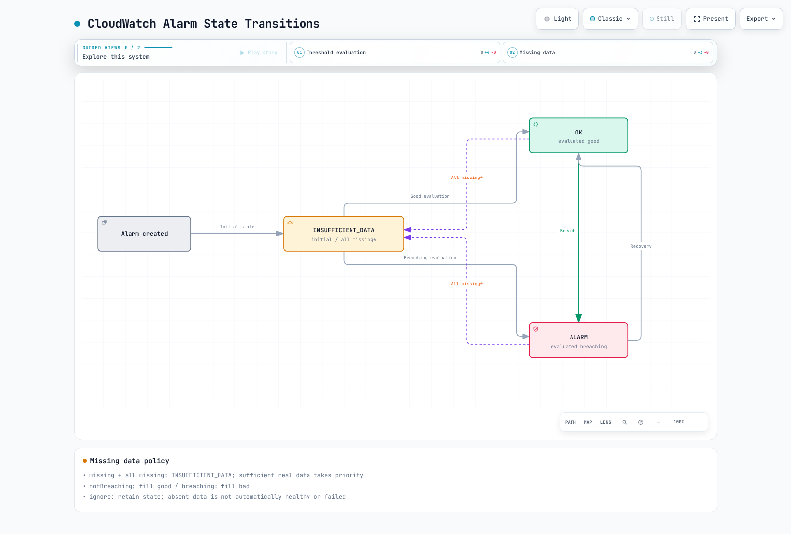
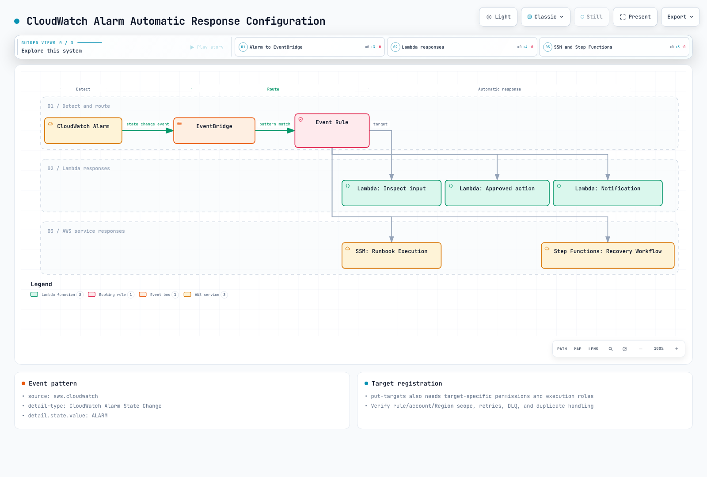

# CloudWatch Alarms

> **最后更新**: September 13, 2026

本文的 CLI 与 Terraform 示例涵盖 **经典 CloudWatch 指标告警（metric alarm）** 和复合告警（composite alarm）。CloudWatch 还支持基于其 OTLP 端点摄取的指标的 **PromQL 告警**，以及基于 Logs Insights 查询结果的 **日志告警**。PromQL 告警使用 `PendingPeriod`/`RecoveryPeriod`；下文的 M-of-N 与缺失数据设置并不能原样套用。文中的账户、Region 和资源取值均为示例。在执行创建或更新命令之前，请先确认实际目标、IAM 权限、成本和接收人。`PutMetricAlarm`/`PutCompositeAlarm` 会替换已有的告警配置，因此更新前请先保留其当前设置。

## 目录

- [CloudWatch Alarms 概述](#cloudwatch-alarms-overview)
- [架构](#architecture)
- [指标告警](#metric-alarms)
- [复合告警](#composite-alarms)
- [异常检测](#anomaly-detection)
- [SNS 集成](#sns-integration)
- [EventBridge 集成](#eventbridge-integration)
- [Container Insights 告警](#container-insights-alerts)
- [CloudWatch 告警动作](#cloudwatch-alarm-actions)
- [成本优化](#cost-optimization)
- [Prometheus 指标集成](#prometheus-metrics-integration)
- [Terraform 示例](#terraform-examples)

---

## CloudWatch Alarms Overview

Amazon CloudWatch Alarms 是 AWS 原生监控服务的告警功能。它基于 CloudWatch 指标创建告警，并可通过与 SNS、Lambda、EC2 Auto Scaling 等服务集成实现自动化响应。

### 主要特性

1. **指标告警（Metric Alarms）**：评估单个指标、指标数学表达式或 Metrics Insights 查询
2. **复合告警（Composite Alarms）**：组合多个告警条件
3. **异常检测（Anomaly Detection）**：基于机器学习的异常检测
4. **告警动作（Alarm Actions）**：告警触发时执行自动动作
5. **AWS 服务集成**：与 EC2、ECS、EKS、Lambda 等原生集成

### CloudWatch Alarms 与 Prometheus Alertmanager 对比

| 特性 | CloudWatch Alarms | Prometheus Alertmanager |
|----------------|-------------------|-------------------------|
| **类型** | AWS 托管服务 | 开源 |
| **数据源** | 按告警类型使用 CloudWatch 指标、OTLP 指标或日志 | 由 Prometheus 或其他客户端评估出的告警 |
| **评估方式** | 按告警类型使用指标数学、PromQL 或 Logs Insights | Prometheus 评估 PromQL；Alertmanager 负责分组、抑制和路由 |
| **成本** | 取决于告警类型、被评估的指标、查询和贡献者数量 | 无软件许可费用；但基础设施与运维仍有成本 |
| **复杂路由** | 有限 | 支持高级路由 |
| **AWS 集成** | 原生 | 需要额外配置 |

---

## Architecture

### CloudWatch Alarms 运行流程


[🔍 查看交互式图表](https://www.atomai.click/kubernetes-docs/archmaps/en-observability-alerting-02-cloudwatch-alarms-0.html)

### 告警状态

经典指标告警从 `INSUFFICIENT_DATA` 开始，随后被评估为 `OK` 或 `ALARM`。缺失数据并不总是意味着 `INSUFFICIENT_DATA`：`missing` 只有在全部评估数据都缺失时才产生数据不足，`notBreaching` 将缺失点视为正常，`breaching` 将其视为异常，`ignore` 则保持当前状态。当其他真实数据点已足以完成评估时，CloudWatch 不会使用缺失数据填充设置。因此一律采用 `notBreaching` 策略可能掩盖心跳或采集器已停止的情况。复合告警只有在刚创建之后才可能处于 `INSUFFICIENT_DATA` 状态。



[🔍 查看交互式图表](https://www.atomai.click/kubernetes-docs/archmaps/en-observability-alerting-02-cloudwatch-alarms-1.html)

---

## Metric Alarms

### 创建基础告警（控制台/CLI）

#### AWS CLI

```bash
# Create CPU utilization alarm
aws cloudwatch put-metric-alarm \
  --alarm-name "HighCPUUtilization" \
  --alarm-description "CPU usage exceeds 80%" \
  --metric-name CPUUtilization \
  --namespace AWS/EC2 \
  --statistic Average \
  --period 300 \
  --threshold 80 \
  --comparison-operator GreaterThanThreshold \
  --evaluation-periods 2 \
  --dimensions Name=InstanceId,Value=i-1234567890abcdef0 \
  --alarm-actions arn:aws:sns:ap-northeast-2:123456789012:alerts \
  --ok-actions arn:aws:sns:ap-northeast-2:123456789012:alerts \
  --treat-missing-data missing
```

### 告警配置要素

| 参数 | 说明 | 示例 |
|-----------|-------------|---------|
| `metric-name` | 要监控的指标名称 | `CPUUtilization` |
| `namespace` | 指标命名空间 | `AWS/EC2`, `AWS/EKS` |
| `statistic` | 统计函数 | `Average`, `Sum`, `Maximum`, `Minimum`, `SampleCount` |
| `period` | 评估周期（秒） | `60`, `300`, `3600` |
| `threshold` | 阈值 | `80` |
| `comparison-operator` | 比较运算符 | `GreaterThanThreshold` |
| `evaluation-periods` | 评估周期数 N | `3`（M 为 `datapoints-to-alarm`） |
| `datapoints-to-alarm` | 触发告警所需的数据点数 | `3` 中的 `2` |
| `treat-missing-data` | 缺失数据处理方式 | `notBreaching`, `breaching`, `ignore`, `missing` |

请使用 `--extended-statistic p99`，而不是 `--statistic p99`。N 个周期中的 M 个越界数据点无需连续；省略 M 时其值等于 N。`Period` 是聚合时长，而不是通知间隔。经典指标告警使用 10、20 或 30 秒周期属于高分辨率，需要相应的高分辨率数据。60 秒为标准分辨率。Period×N 上限为 7 天；当 Period 小于 1 小时时上限为 1 天。除 Auto Scaling 动作外，动作通常在状态转换时执行。

### 比较运算符

```yaml
# Available comparison operators
comparison-operators:
  - GreaterThanThreshold           # Greater than
  - GreaterThanOrEqualToThreshold  # Greater than or equal
  - LessThanThreshold              # Less than
  - LessThanOrEqualToThreshold     # Less than or equal
  - LessThanLowerOrGreaterThanUpperThreshold  # Outside range
  - LessThanLowerThreshold         # Below lower bound
  - GreaterThanUpperThreshold      # Above upper bound
```

### 使用指标数学（Metrics Math）的告警

```bash
# Error rate calculation alarm (error count / total requests)
aws cloudwatch put-metric-alarm \
  --alarm-name "HighErrorRate" \
  --alarm-description "Error rate exceeds 5%" \
  --metrics '[
    {
      "Id": "errors",
      "MetricStat": {
        "Metric": {
          "Namespace": "AWS/ApplicationELB",
          "MetricName": "HTTPCode_Target_5XX_Count",
          "Dimensions": [
            {"Name": "LoadBalancer", "Value": "app/my-alb/1234567890"}
          ]
        },
        "Period": 300,
        "Stat": "Sum"
      },
      "ReturnData": false
    },
    {
      "Id": "requests",
      "MetricStat": {
        "Metric": {
          "Namespace": "AWS/ApplicationELB",
          "MetricName": "RequestCount",
          "Dimensions": [
            {"Name": "LoadBalancer", "Value": "app/my-alb/1234567890"}
          ]
        },
        "Period": 300,
        "Stat": "Sum"
      },
      "ReturnData": false
    },
    {
      "Id": "error_rate",
      "Expression": "IF(requests > 0, 100 * FILL(errors, 0) / requests, 0)",
      "ReturnData": true
    }
  ]' \
  --threshold 5 \
  --comparison-operator GreaterThanThreshold \
  --evaluation-periods 2 \
  --alarm-actions arn:aws:sns:ap-northeast-2:123456789012:alerts
```

该表达式衡量的是 ALB 转发到目标的请求中出现的目标端 5xx 响应。它并不涵盖所有用户可见的失败，例如 ALB 自身生成的错误或在选择目标之前发生的失败。当存在请求时，缺失的 5xx 数据点会被填充为零；此处将零请求定义为 0%。请单独监控请求缺失或采集缺失的情况。经典指标数学告警必须返回一条最终时间序列。`SEARCH` 用于图表，不能作为告警表达式使用。由于评估范围会变化，`RATE` 在稀疏指标上的行为可能不同。

### 指标数学函数

```yaml
# Commonly used functions
math-functions:
  # Arithmetic operations
  - "m1 + m2"           # Sum
  - "m1 - m2"           # Difference
  - "m1 * m2"           # Product
  - "m1 / m2"           # Division
  - "(m1 / m2) * 100"   # Percentage

  # Statistical functions
  - "AVG(METRICS())"    # Average
  - "SUM(METRICS())"    # Sum
  - "MIN(METRICS())"    # Minimum
  - "MAX(METRICS())"    # Maximum

  # Conditional functions
  - "IF(m1 > 100, m1, 0)"  # Conditional

  # Time-related
  - "RATE(m1)"          # Rate of change
  - "DIFF(m1)"          # Difference
  - "PERIOD(m1)"        # Period

  # Search
  - "SEARCH('{AWS/EC2,InstanceId} MetricName=\"CPUUtilization\"', 'Average', 300)"
```

---

## Composite Alarms

### 复合告警概念

Composite Alarms 可以组合多个 Metric Alarms 来定义复杂条件。


[🔍 查看交互式图表](https://www.atomai.click/kubernetes-docs/archmaps/en-observability-alerting-02-cloudwatch-alarms-2.html)

`CWAgent` 的内存和磁盘指标需要已安装 agent，并发布匹配的维度组合。仅使用 `InstanceId` 的示例只有在 agent 确实发布了该聚合时才有效。`disk_used_percent` 通常还带有 `path`、`device` 和 `fstype`；请使用 `list-metrics` 返回的**完整维度组合**。示例中的子告警没有配置动作；只有复合告警发送通知。

### 创建复合告警

```bash
# Create individual alarms
aws cloudwatch put-metric-alarm \
  --alarm-name "HighCPU" \
  --metric-name CPUUtilization \
  --namespace AWS/EC2 \
  --statistic Average \
  --period 300 \
  --threshold 80 \
  --comparison-operator GreaterThanThreshold \
  --evaluation-periods 2 \
  --dimensions Name=InstanceId,Value=i-1234567890abcdef0

aws cloudwatch put-metric-alarm \
  --alarm-name "HighMemory" \
  --metric-name mem_used_percent \
  --namespace CWAgent \
  --statistic Average \
  --period 300 \
  --threshold 85 \
  --comparison-operator GreaterThanThreshold \
  --evaluation-periods 2 \
  --dimensions Name=InstanceId,Value=i-1234567890abcdef0

aws cloudwatch put-metric-alarm \
  --alarm-name "HighDisk" \
  --metric-name disk_used_percent \
  --namespace CWAgent \
  --statistic Average \
  --period 300 \
  --threshold 90 \
  --comparison-operator GreaterThanThreshold \
  --evaluation-periods 2 \
  --dimensions Name=InstanceId,Value=i-1234567890abcdef0

# Create Composite Alarm
aws cloudwatch put-composite-alarm \
  --alarm-name "ServerResourceCritical" \
  --alarm-description "Server resources are critical" \
  --alarm-rule '(ALARM("HighCPU") AND ALARM("HighMemory")) OR ALARM("HighDisk")' \
  --alarm-actions arn:aws:sns:ap-northeast-2:123456789012:critical-alerts \
  --ok-actions arn:aws:sns:ap-northeast-2:123456789012:alerts
```

### 告警规则语法

```yaml
# Composite Alarm rule syntax
rule-syntax:
  # Basic operators
  - "ALARM(alarm-name)"      # Check ALARM state
  - "OK(alarm-name)"         # Check OK state
  - "INSUFFICIENT_DATA(alarm-name)"  # Check INSUFFICIENT_DATA state

  # Logical operators
  - "AND"                    # All conditions met
  - "OR"                     # One or more conditions met
  - "NOT"                    # Negation
  - "()"                     # Grouping

examples:
  # All conditions met
  - "ALARM(A1) AND ALARM(A2) AND ALARM(A3)"

  # One or more met
  - "ALARM(A1) OR ALARM(A2)"

  # Complex condition
  - "(ALARM(A1) AND ALARM(A2)) OR ALARM(A3)"

  # Negation
  - "ALARM(A1) AND NOT ALARM(A2)"

  # M of N pattern (2 or more of 3)
  - "(ALARM(A1) AND ALARM(A2)) OR (ALARM(A1) AND ALARM(A3)) OR (ALARM(A2) AND ALARM(A3))"
```

### 告警抑制模式

`set-alarm-state` 只是用于测试的临时覆盖；指标告警会很快回到其评估状态，并不能建立维护窗口。下面的示例假设有一个外部控制器持续发布 `MaintenanceMode` 告警的状态。`ActionsSuppressor` 在不改变自身评估状态的前提下抑制复合告警的动作。测试维护窗口时请把等待期/延长期一并考虑在内。

```bash
aws cloudwatch put-composite-alarm  \
  --alarm-name ProductionAlerts  \
  --alarm-rule 'ALARM("HighCPU")'  \
  --actions-suppressor MaintenanceMode  \
  --actions-suppressor-wait-period 60  \
  --actions-suppressor-extension-period 60  \
  --alarm-actions arn:aws:sns:ap-northeast-2:123456789012:alerts
```

---

## Anomaly Detection

### 异常检测概述

CloudWatch Anomaly Detection 使用机器学习学习指标的正常模式，并检测离群值。


[🔍 查看交互式图表](https://www.atomai.click/kubernetes-docs/archmaps/en-observability-alerting-02-cloudwatch-alarms-3.html)

### 创建异常检测告警

```bash
# Anomaly Detection model creation (automatic)
# Model is automatically created when first alarm is created

aws cloudwatch put-metric-alarm \
  --alarm-name "CPUAnomalyDetection" \
  --alarm-description "CPU usage is anomalous" \
  --metrics '[
    {
      "Id": "m1",
      "MetricStat": {
        "Metric": {
          "Namespace": "AWS/EC2",
          "MetricName": "CPUUtilization",
          "Dimensions": [
            {"Name": "InstanceId", "Value": "i-1234567890abcdef0"}
          ]
        },
        "Period": 300,
        "Stat": "Average"
      },
      "ReturnData": true
    },
    {
      "Id": "ad1",
      "Expression": "ANOMALY_DETECTION_BAND(m1, 2)",
      "ReturnData": true
    }
  ]' \
  --threshold-metric-id ad1 \
  --comparison-operator LessThanLowerOrGreaterThanUpperThreshold \
  --evaluation-periods 2 \
  --alarm-actions arn:aws:sns:ap-northeast-2:123456789012:alerts
```

### 异常检测配置

```yaml
# ANOMALY_DETECTION_BAND function
# ANOMALY_DETECTION_BAND(metric, stddev)
# - metric: Metric to analyze
# - stddev: Standard deviation multiplier (default 2)

examples:
  # Width parameter 2: not a guaranteed 95% confidence interval
  - "ANOMALY_DETECTION_BAND(m1, 2)"

  # Width parameter 3: a wider expected band
  - "ANOMALY_DETECTION_BAND(m1, 3)"

  # More sensitive detection (1 standard deviation)
  - "ANOMALY_DETECTION_BAND(m1, 1)"
```

该参数控制模型预期带的宽度，并不保证是高斯分布下的 95% 或 99.7% 区间。模型最多使用两周的历史数据，也可以在数据更少时开始工作。下面的排除日期仅用于说明格式；请替换为模型训练历史范围内的相关时间区间。

### 调整模型训练周期

```bash
# Add exclusion periods to existing model (maintenance, incident periods, etc.)
aws cloudwatch put-anomaly-detector \
  --namespace AWS/EC2 \
  --metric-name CPUUtilization \
  --stat Average \
  --dimensions Name=InstanceId,Value=i-1234567890abcdef0 \
  --configuration '{
    "ExcludedTimeRanges": [
      {
        "StartTime": "2025-02-15T00:00:00Z",
        "EndTime": "2025-02-15T06:00:00Z"
      }
    ]
  }'
```

---

## SNS Integration

### 创建 SNS Topic

```bash
# Create SNS Topic
aws sns create-topic --name eks-alerts

# Add Email subscription
aws sns subscribe \
  --topic-arn arn:aws:sns:ap-northeast-2:123456789012:eks-alerts \
  --protocol email \
  --notification-endpoint team@example.com

# Add SMS subscription
aws sns subscribe \
  --topic-arn arn:aws:sns:ap-northeast-2:123456789012:eks-alerts \
  --protocol sms \
  --notification-endpoint "$VERIFIED_SMS_NUMBER"

# Add Lambda subscription
aws sns subscribe \
  --topic-arn arn:aws:sns:ap-northeast-2:123456789012:eks-alerts \
  --protocol lambda \
  --notification-endpoint arn:aws:lambda:ap-northeast-2:123456789012:function:alert-handler
```

### SNS 消息过滤

CloudWatch 默认的 SNS 通知不会自动包含示例中的 `severity` 或 `environment` 消息属性。要过滤消息正文中的 `NewStateValue`，需要设置 `FilterPolicyScope=MessageBody`。该过滤器会排除 `OK` 恢复消息。Email 需要确认订阅；SMS 需要检查已验证号码、沙箱/Region 要求以及成本。Lambda 订阅还需要 Lambda 资源策略，允许来自特定 topic ARN 的 `sns.amazonaws.com` 调用。

```bash
aws sns set-subscription-attributes  \
  --subscription-arn "$SUBSCRIPTION_ARN"  \
  --attribute-name FilterPolicyScope  \
  --attribute-value MessageBody
aws sns set-subscription-attributes  \
  --subscription-arn "$SUBSCRIPTION_ARN"  \
  --attribute-name FilterPolicy  \
  --attribute-value '{"NewStateValue": ["ALARM"]}'
```

### SNS 到 Slack 集成（Lambda）

对于标准 CloudWatch 通知，可通过 **Amazon Q Developer in chat applications**（原 AWS Chatbot）将 SNS topic 与已批准的 Slack 频道连接起来。请把该频道的 IAM 角色和护栏策略限制在通知用途范围内。

如果确实需要自定义 Lambda，请从密钥存储中获取 webhook、校验其目标地址、设置连接/读取超时并检查响应状态。不要把 HTTP 429/5xx 当作成功；请配置重试、死信路径和重复处理。SNS 使用 `Records[].Sns.Message`，而不是下文中的 EventBridge 信封结构。本章的验证不会发送真实的 Slack 消息。

---

## EventBridge Integration

### 创建 EventBridge 规则

```bash
# Route CloudWatch Alarm state changes to EventBridge
aws events put-rule \
  --name "CloudWatchAlarmStateChange" \
  --event-pattern '{
    "source": ["aws.cloudwatch"],
    "detail-type": ["CloudWatch Alarm State Change"],
    "detail": {
      "state": {
        "value": ["ALARM"]
      }
    }
  }'

# Add Lambda target
aws events put-targets \
  --rule "CloudWatchAlarmStateChange" \
  --targets '[
    {
      "Id": "AlertHandler",
      "Arn": "arn:aws:lambda:ap-northeast-2:123456789012:function:alert-handler"
    }
  ]'
```

### 自动响应配置



[🔍 查看交互式图表](https://www.atomai.click/kubernetes-docs/archmaps/en-observability-alerting-02-cloudwatch-alarms-4.html)

### EventBridge 事件模式

```json
{
  "source": ["aws.cloudwatch"],
  "detail-type": ["CloudWatch Alarm State Change"],
  "account": ["123456789012"],
  "region": ["ap-northeast-2"],
  "resources": ["arn:aws:cloudwatch:ap-northeast-2:123456789012:alarm:EKS-Node-HighCPU"],
  "detail": {
    "alarmName": ["EKS-Node-HighCPU"],
    "state": {"value": ["ALARM"]}
  }
}
```

把 `previousState` 限制为 `OK` 会漏掉 `INSUFFICIENT_DATA → ALARM` 的转换。匹配精确的告警 ARN 可以避免对指标数学或复合告警的配置形态做假设。`put-targets` 不会授予 Lambda 调用权限：需要为 `events.amazonaws.com` 添加 Lambda 资源策略，并将其限定到该规则的 `SourceArn`，同时配置重试/死信行为。

### 自动恢复 Lambda 示例

仅凭 CPU 偏高并不能证明重启是合适的处置方式。本示例实现的是恢复流程中的**输入检查阶段**：检查状态、账户、Region 和告警 ARN，然后返回指标信息。EventBridge 中的 `dimensions` 是一个对象，与 SNS 告警消息中的维度列表不同。它也能处理以表达式为先的查询以及不含指标的复合告警。

请将[已测试的事件规范化器及其测试](https://github.com/Atom-oh/kubernetes-docs/tree/main/examples/observability/cloudwatch-alarms)与 Lambda 处理程序一起打包：

```python
from event_normalizer import normalize_alarm_event

def lambda_handler(event, context):
    return normalize_alarm_event(
        event,
        expected_account="123456789012",
        expected_region="ap-northeast-2",
    )
```

该函数不会对 AWS 执行任何变更操作。对负载的检查并不能认证发送方身份。任何新增的修复动作都需要显式的目标允许列表、当前告警/资源状态检查、幂等性、冷却时间、最小权限和回滚机制。

---

## Container Insights Alerts

### EKS Container Insights 指标

这些示例使用经典的 `ContainerInsights` CloudWatch 指标路径。不要把它的名称、维度和计费方式与增强型可观测性或 OTel 指标路径混用。请遵循[当前的 EKS add-on 指南](https://docs.aws.amazon.com/AmazonCloudWatch/latest/monitoring/install-CloudWatch-Observability-EKS-addon.html)，该 add-on 会安装 CloudWatch Agent 和 Fluent Bit；并选择与集群 Kubernetes 版本和 Region 兼容的 add-on 版本。使用 EKS Pod Identity 时，请先配置 IAM 和 agent 关联。

`update-addon` 用于更新已有安装；首次安装应使用 `create-addon`。请保留现有配置和 Pod Identity 关联。请查询可用版本并在部署计划中选定其中一个，而不要固定使用旧的 `v1.2.0` 或应用未经审阅的 `latest` Fluentd manifest。

```bash
aws eks describe-addon-versions  \
  --addon-name amazon-cloudwatch-observability  \
  --kubernetes-version "$KUBERNETES_VERSION"  \
  --region "$AWS_REGION"
aws cloudwatch list-metrics  \
  --namespace ContainerInsights  \
  --metric-name pod_number_of_container_restarts  \
  --dimensions Name=ClusterName,Value=my-cluster  \
  --region "$AWS_REGION"
```

### Container Insights 告警示例

```bash
# Cluster aggregate CPU utilization alarm
aws cloudwatch put-metric-alarm \
  --alarm-name "EKS-Node-HighCPU" \
  --metric-name node_cpu_utilization \
  --namespace ContainerInsights \
  --dimensions Name=ClusterName,Value=my-cluster \
  --statistic Average \
  --period 300 \
  --threshold 80 \
  --comparison-operator GreaterThanThreshold \
  --evaluation-periods 2 \
  --alarm-actions arn:aws:sns:ap-northeast-2:123456789012:eks-alerts

# Pod memory utilization alarm
aws cloudwatch put-metric-alarm \
  --alarm-name "EKS-Pod-HighMemory" \
  --metric-name pod_memory_utilization_over_pod_limit \
  --namespace ContainerInsights \
  --dimensions Name=ClusterName,Value=my-cluster Name=Namespace,Value=production \
  --statistic Average \
  --period 300 \
  --threshold 85 \
  --comparison-operator GreaterThanThreshold \
  --evaluation-periods 2 \
  --alarm-actions arn:aws:sns:ap-northeast-2:123456789012:eks-alerts

# One Pod's cumulative restart count (not a five-minute increase)
aws cloudwatch put-metric-alarm \
  --alarm-name "EKS-Pod-Restarts" \
  --metric-name pod_number_of_container_restarts \
  --namespace ContainerInsights \
  --dimensions Name=ClusterName,Value=my-cluster Name=Namespace,Value=production Name=PodName,Value=my-pod \
  --statistic Maximum \
  --period 300 \
  --threshold 3 \
  --comparison-operator GreaterThanThreshold \
  --evaluation-periods 1 \
  --alarm-actions arn:aws:sns:ap-northeast-2:123456789012:eks-alerts
```

CPU 示例是集群级聚合。针对单个节点需要使用 `ClusterName`、`NodeName` 和 `InstanceId` 的完整组合。`pod_memory_utilization` 除以的是**节点内存**，而 `pod_memory_utilization_over_pod_limit` 除以的是 Pod 限制。如果任一容器没有设置内存限制，后者可能不存在。`pod_number_of_container_restarts` 是累计值，使用 `ClusterName`、`Namespace` 和 `PodName` 维度。`Maximum > 3` 表示观测到的生命周期累计次数超过 3；对样本求和并不能统计近期的重启次数。还需考虑 Pod 被替换、计数重置和名称复用的情况。若要统计近期增量，请使用可感知重置的 PromQL `increase()`，或单独定义的增量指标。

### 主要 Container Insights 指标

| 指标 | 说明 | 维度 |
|--------|-------------|------------|
| `cluster_node_count` | 集群节点数 | ClusterName |
| `cluster_failed_node_count` | 故障节点数 | ClusterName |
| `node_cpu_utilization` | 节点 CPU 使用率 | ClusterName, NodeName, InstanceId；或 ClusterName |
| `node_memory_utilization` | 节点内存使用率 | ClusterName, NodeName, InstanceId；或 ClusterName |
| `node_filesystem_utilization` | 节点磁盘使用率 | ClusterName, NodeName, InstanceId；或 ClusterName |
| `pod_cpu_utilization` | Pod CPU 使用率 | ClusterName, Namespace, PodName |
| `pod_memory_utilization` | Pod 内存使用率 | ClusterName, Namespace, PodName |
| `pod_number_of_container_restarts` | 容器重启次数 | ClusterName, Namespace, PodName |
| `service_number_of_running_pods` | 每个 Service 运行中的 Pod 数 | ClusterName, Namespace, Service |

---

## CloudWatch Alarm Actions

### EC2 动作

EC2 直接动作包括 stop、terminate、reboot 和 recover；**不支持 start**。这些示例会变更实例状态：请在确认受支持的实例、权限以及停止/恢复带来的影响后，仅对明确批准的目标使用。缺失数据请使用 `missing`，并且只把变更类动作绑定到 `ALARM` 状态。指标数学告警和复合告警无法直接执行 EC2 动作。


```bash
# EC2 instance recovery (on system status check failure)
aws cloudwatch put-metric-alarm \
  --alarm-name "EC2-SystemCheckFailed" \
  --metric-name StatusCheckFailed_System \
  --namespace AWS/EC2 \
  --dimensions Name=InstanceId,Value=i-1234567890abcdef0 \
  --statistic Maximum \
  --period 60 \
  --threshold 1 \
  --comparison-operator GreaterThanOrEqualToThreshold \
  --evaluation-periods 2 \
  --treat-missing-data missing \
  --alarm-actions arn:aws:automate:ap-northeast-2:ec2:recover

# EC2 instance stop
aws cloudwatch put-metric-alarm \
  --alarm-name "EC2-LowUtilization-Stop" \
  --metric-name CPUUtilization \
  --namespace AWS/EC2 \
  --dimensions Name=InstanceId,Value=i-1234567890abcdef0 \
  --statistic Average \
  --period 3600 \
  --threshold 5 \
  --comparison-operator LessThanThreshold \
  --evaluation-periods 24 \
  --treat-missing-data missing \
  --alarm-actions arn:aws:automate:ap-northeast-2:ec2:stop
```

### Auto Scaling 动作

```bash
# Link Auto Scaling policy
aws cloudwatch put-metric-alarm \
  --alarm-name "ASG-ScaleOut" \
  --metric-name CPUUtilization \
  --namespace AWS/EC2 \
  --dimensions Name=AutoScalingGroupName,Value=my-asg \
  --statistic Average \
  --period 300 \
  --threshold 70 \
  --comparison-operator GreaterThanThreshold \
  --evaluation-periods 2 \
  --alarm-actions arn:aws:autoscaling:ap-northeast-2:123456789012:scalingPolicy:xxx:autoScalingGroupName/my-asg:policyName/scale-out

aws cloudwatch put-metric-alarm \
  --alarm-name "ASG-ScaleIn" \
  --metric-name CPUUtilization \
  --namespace AWS/EC2 \
  --dimensions Name=AutoScalingGroupName,Value=my-asg \
  --statistic Average \
  --period 300 \
  --threshold 30 \
  --comparison-operator LessThanThreshold \
  --evaluation-periods 3 \
  --alarm-actions arn:aws:autoscaling:ap-northeast-2:123456789012:scalingPolicy:xxx:autoScalingGroupName/my-asg:policyName/scale-in
```

### Systems Manager 动作

`automation-definition/...` 形式的 ARN 并不是受支持的 `AlarmActions` 直接目标，无法用于运行任意 SSM Automation runbook。SSM 的直接集成仅支持 API 中列出的动作，例如 OpsItems。请通过 **EventBridge 的 SSM Automation 目标**，或显式的 Lambda/Step Functions 工作流来触发 Automation。目标执行角色、`ssm:StartAutomationExecution`、runbook 参数和 Automation 角色都应分别限定权限范围。仅凭磁盘阈值不得授权任意文件删除。

---

## Cost Optimization

### 成本构成因素

下表数字是 2026-09-13 查阅官方定价页面时的 **US East 示例**，并非首尔 Region 的报价。请查询目标 Region 的当前价格。指标告警按被评估的指标计费，而复合告警按告警个数计费。异常检测包含实际指标以及两条带宽指标。添加复合告警不会免除子告警的费用：它减少的是通知噪音，而不会自动降低成本。


| 项目 | 费用 |
|------|------|
| 标准分辨率告警（60s） | $0.10/告警/月 |
| 高分辨率告警（10s） | $0.30/告警/月 |
| 标准异常检测告警：一条实际指标加两条带宽指标 | 示例 $0.30/告警/月 |
| 复合告警（Composite Alarm） | $0.50/告警/月 |

### 成本优化策略


[🔍 查看交互式图表](https://www.atomai.click/kubernetes-docs/archmaps/en-observability-alerting-02-cloudwatch-alarms-5.html)

### 推荐设置

```yaml
# Cost-effective alarm settings

# Critical: Standard Resolution (60s; only 10/20/30s is high resolution)
critical-alerts:
  period: 60  # 1 minute
  evaluation-periods: 2

# Warning: Standard Resolution
warning-alerts:
  period: 300  # 5 minutes
  evaluation-periods: 2

# Info: Standard Resolution (relaxed detection)
info-alerts:
  period: 900  # 15 minutes
  evaluation-periods: 3
```

### 告警清理脚本

下面的命令只列出待检查的候选项。`INSUFFICIENT_DATA` 并不能证明某个告警未被使用，固定的历史日期也不等于“90 天前”。在获得单独授权执行删除之前，请先审查距 `StateTransitionedTimestamp` 的时间、实际采集情况、归属方以及复合告警依赖关系。`StateUpdatedTimestamp` 在状态原因变化时也会更新，它与处于当前状态的时长并不相同。

```bash
aws cloudwatch describe-alarms  \
  --alarm-types MetricAlarm  \
  --state-value INSUFFICIENT_DATA  \
  --query 'MetricAlarms[].{Name:AlarmName,StateSince:StateTransitionedTimestamp,Updated:StateUpdatedTimestamp}'  \
  --output json
```

---

## Prometheus Metrics Integration

### Amazon Managed Prometheus (AMP) 集成

存储在 AMP 中的指标不会自动复制到经典 CloudWatch 指标中。请根据需求选择合适的路径。

- **在 AMP 内部告警**：配置工作区 Prometheus 告警规则 → 托管 Alertmanager → 受支持的接收器（SNS 或 PagerDuty）。
- **CloudWatch PromQL 告警**：评估通过 CloudWatch OTLP 端点摄取的指标。这并不是直接查询 AMP 工作区。
- **重新发布为经典 CloudWatch 指标**：在独立的 exporter 中只定义必需的聚合值。使用一套一致且冻结的临时凭证进行签名，并校验超时、HTTP 状态、结果类型、数值有限性、时间戳和维度。不要把空结果、NaN 或失败转换成零或成功。这会带来查询费用、自定义指标费用、运行时成本和延迟。

以前使用的 CPU mode 平均值并不是总体 CPU 使用率；对彼此无关或未设限制的 Pod 求内存平均值之比，也不等于每个 Pod 的限制使用率。请选择能保留所需标签和重置语义的 PromQL，然后测试规则并用实际采集的数据进行验证。

---

## Terraform Examples

下面这些代码块构成一个示例模块。请配置真实的资源取值和 SNS topic 策略，并在部署前审查 `terraform plan`。示例验证只覆盖 provider schema/语法，不包括 AWS 实际部署或真实通知投递。


### 基础告警

```hcl
# SNS Topic
resource "aws_sns_topic" "alerts" {
  name = "eks-alerts"
}

resource "aws_sns_topic_subscription" "email" {
  topic_arn = aws_sns_topic.alerts.arn
  protocol  = "email"
  endpoint  = "team@example.com"
}

# EC2 CPU alarm
resource "aws_cloudwatch_metric_alarm" "ec2_cpu" {
  alarm_name          = "ec2-high-cpu"
  comparison_operator = "GreaterThanThreshold"
  evaluation_periods  = 2
  metric_name         = "CPUUtilization"
  namespace           = "AWS/EC2"
  period              = 300
  statistic           = "Average"
  threshold           = 80
  alarm_description   = "EC2 CPU usage exceeds 80%"

  dimensions = {
    InstanceId = "i-1234567890abcdef0"
  }

  alarm_actions = [aws_sns_topic.alerts.arn]
  ok_actions    = [aws_sns_topic.alerts.arn]

  treat_missing_data = "missing"
}
```

### 指标数学告警

```hcl
resource "aws_cloudwatch_metric_alarm" "alb_error_rate" {
  alarm_name          = "alb-high-error-rate"
  comparison_operator = "GreaterThanThreshold"
  evaluation_periods  = 2
  threshold           = 5
  alarm_description   = "ALB error rate exceeds 5%"

  metric_query {
    id          = "errors"
    return_data = false

    metric {
      metric_name = "HTTPCode_Target_5XX_Count"
      namespace   = "AWS/ApplicationELB"
      period      = 300
      stat        = "Sum"

      dimensions = {
        LoadBalancer = "app/my-alb/1234567890"
      }
    }
  }

  metric_query {
    id          = "requests"
    return_data = false

    metric {
      metric_name = "RequestCount"
      namespace   = "AWS/ApplicationELB"
      period      = 300
      stat        = "Sum"

      dimensions = {
        LoadBalancer = "app/my-alb/1234567890"
      }
    }
  }

  metric_query {
    id          = "error_rate"
    expression  = "IF(requests > 0, 100 * FILL(errors, 0) / requests, 0)"
    label       = "Error Rate"
    return_data = true
  }

  alarm_actions = [aws_sns_topic.alerts.arn]
}
```

### 复合告警

```hcl
# Individual alarms
resource "aws_cloudwatch_metric_alarm" "cpu_alarm" {
  alarm_name          = "high-cpu"
  comparison_operator = "GreaterThanThreshold"
  evaluation_periods  = 2
  metric_name         = "CPUUtilization"
  namespace           = "AWS/EC2"
  period              = 300
  statistic           = "Average"
  threshold           = 80

  dimensions = {
    InstanceId = "i-1234567890abcdef0"
  }
}

resource "aws_cloudwatch_metric_alarm" "memory_alarm" {
  alarm_name          = "high-memory"
  comparison_operator = "GreaterThanThreshold"
  evaluation_periods  = 2
  metric_name         = "mem_used_percent"
  namespace           = "CWAgent"
  period              = 300
  statistic           = "Average"
  threshold           = 85

  dimensions = {
    InstanceId = "i-1234567890abcdef0"
  }
}

# Composite Alarm
resource "aws_cloudwatch_composite_alarm" "server_critical" {
  alarm_name        = "server-critical"
  alarm_description = "Server CPU and Memory are both high"

  alarm_rule = "ALARM(${aws_cloudwatch_metric_alarm.cpu_alarm.alarm_name}) AND ALARM(${aws_cloudwatch_metric_alarm.memory_alarm.alarm_name})"

  alarm_actions = [aws_sns_topic.alerts.arn]
  ok_actions    = [aws_sns_topic.alerts.arn]
}
```

### EKS Container Insights 告警

```hcl
resource "aws_cloudwatch_metric_alarm" "eks_node_cpu" {
  alarm_name          = "eks-node-high-cpu"
  comparison_operator = "GreaterThanThreshold"
  evaluation_periods  = 2
  metric_name         = "node_cpu_utilization"
  namespace           = "ContainerInsights"
  period              = 300
  statistic           = "Average"
  threshold           = 80
  alarm_description   = "EKS Node CPU usage exceeds 80%"

  dimensions = {
    ClusterName = "my-eks-cluster"
  }

  alarm_actions = [aws_sns_topic.alerts.arn]
}

resource "aws_cloudwatch_metric_alarm" "eks_pod_restarts" {
  alarm_name          = "eks-pod-restarts"
  comparison_operator = "GreaterThanThreshold"
  evaluation_periods  = 1
  metric_name         = "pod_number_of_container_restarts"
  namespace           = "ContainerInsights"
  period              = 300
  statistic           = "Maximum"
  threshold           = 3
  alarm_description   = "Observed cumulative restart count exceeds 3; not a 5-minute increase"

  dimensions = {
    ClusterName = "my-eks-cluster"
    Namespace   = "production"
    PodName     = "my-pod"
  }

  alarm_actions = [aws_sns_topic.alerts.arn]
}
```

### 异常检测告警

```hcl
resource "aws_cloudwatch_metric_alarm" "cpu_anomaly" {
  alarm_name          = "cpu-anomaly-detection"
  comparison_operator = "LessThanLowerOrGreaterThanUpperThreshold"
  evaluation_periods  = 2
  threshold_metric_id = "ad1"
  alarm_description   = "CPU usage is anomalous"

  metric_query {
    id          = "m1"
    return_data = true

    metric {
      metric_name = "CPUUtilization"
      namespace   = "AWS/EC2"
      period      = 300
      stat        = "Average"

      dimensions = {
        InstanceId = "i-1234567890abcdef0"
      }
    }
  }

  metric_query {
    id          = "ad1"
    expression  = "ANOMALY_DETECTION_BAND(m1, 2)"
    label       = "CPUUtilization (Expected)"
    return_data = true
  }

  alarm_actions = [aws_sns_topic.alerts.arn]
}
```

---

## 参考资料

- [CloudWatch alarm types](https://docs.aws.amazon.com/AmazonCloudWatch/latest/monitoring/CloudWatch_Alarms.html)
- [PutMetricAlarm API](https://docs.aws.amazon.com/AmazonCloudWatch/latest/APIReference/API_PutMetricAlarm.html)
- [Missing data evaluation](https://docs.aws.amazon.com/AmazonCloudWatch/latest/monitoring/alarms-and-missing-data.html)
- [Composite alarms and action suppression](https://docs.aws.amazon.com/AmazonCloudWatch/latest/APIReference/API_PutCompositeAlarm.html)
- [Metric math](https://docs.aws.amazon.com/AmazonCloudWatch/latest/monitoring/using-metric-math.html)
- [Anomaly detection](https://docs.aws.amazon.com/AmazonCloudWatch/latest/monitoring/CloudWatch_Anomaly_Detection.html)
- [SNS alarm message schemas](https://docs.aws.amazon.com/AmazonCloudWatch/latest/monitoring/Notify_Users_Alarm_Changes.html)
- [SNS filter policy scope](https://docs.aws.amazon.com/sns/latest/dg/sns-message-filtering-scope.html)
- [EventBridge alarm events](https://docs.aws.amazon.com/AmazonCloudWatch/latest/monitoring/cloudwatch-and-eventbridge.html)
- [EventBridge target permissions](https://docs.aws.amazon.com/eventbridge/latest/userguide/eb-use-resource-based.html)
- [Container Insights metric dimensions](https://docs.aws.amazon.com/AmazonCloudWatch/latest/monitoring/Container-Insights-metrics-EKS.html)
- [CloudWatch Observability EKS add-on](https://docs.aws.amazon.com/AmazonCloudWatch/latest/monitoring/install-CloudWatch-Observability-EKS-addon.html)
- [CloudWatch pricing](https://aws.amazon.com/cloudwatch/pricing/)
- [PromQL alarms](https://docs.aws.amazon.com/AmazonCloudWatch/latest/monitoring/alarm-promql.html)
- [Log alarms](https://docs.aws.amazon.com/AmazonCloudWatch/latest/monitoring/Alarm-On-Logs.html)
- [AMP alert receivers](https://docs.aws.amazon.com/prometheus/latest/userguide/AMP-alertmanager-receiver.html)

## 测验

请通过 [CloudWatch Alarms 测验](../../quizzes/observability/alerting/02-cloudwatch-alarms-quiz.md)检验你的掌握程度。
