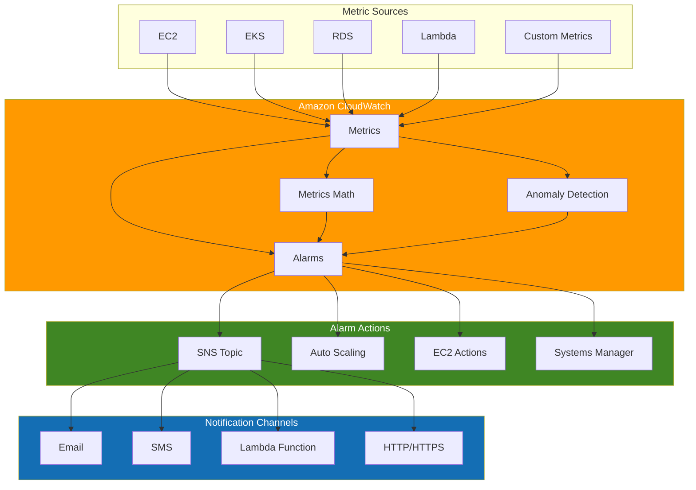
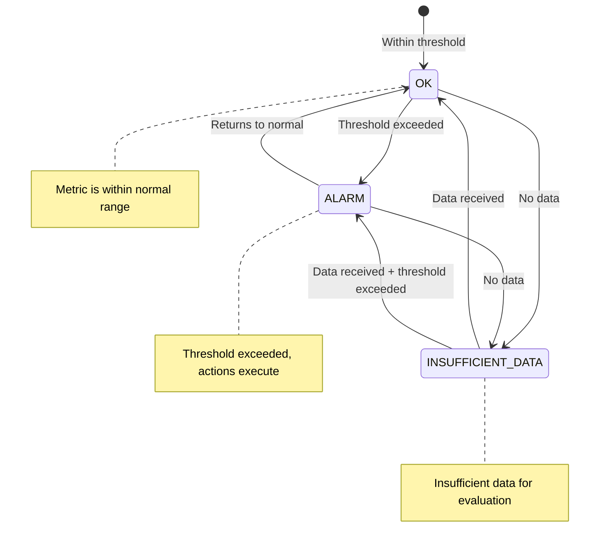
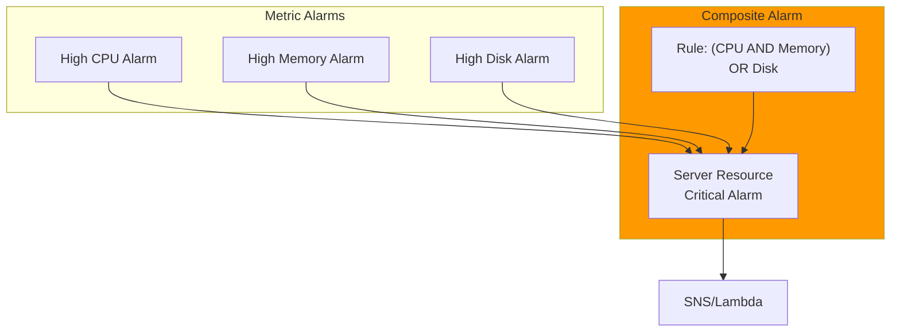
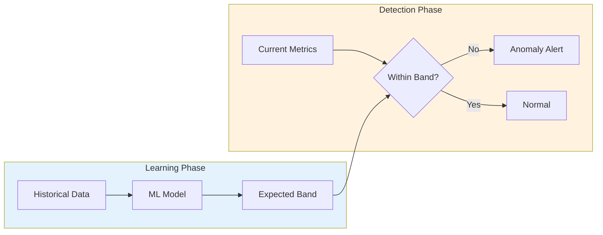
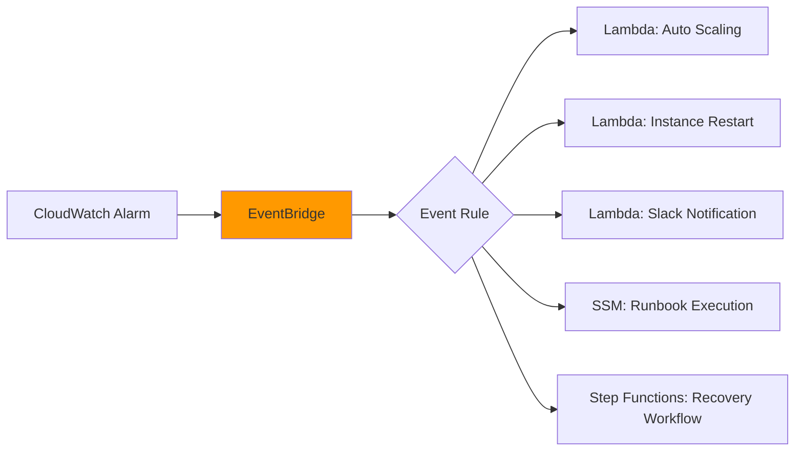
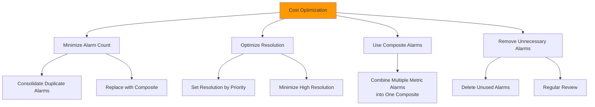

# CloudWatch Alarms

> **最后更新**: February 20, 2026

## 目录

- [CloudWatch Alarms 概览](#cloudwatch-alarms-overview)
- [架构](#architecture)
- [指标告警](#metric-alarms)
- [复合告警](#composite-alarms)
- [异常检测](#anomaly-detection)
- [SNS 集成](#sns-integration)
- [EventBridge 集成](#eventbridge-integration)
- [Container Insights 告警](#container-insights-alerts)
- [CloudWatch Alarm 操作](#cloudwatch-alarm-actions)
- [成本优化](#cost-optimization)
- [Prometheus 指标集成](#prometheus-metrics-integration)
- [Terraform 示例](#terraform-examples)

---

## CloudWatch Alarms 概览

Amazon CloudWatch Alarms 是 AWS 原生监控服务的告警功能。它基于 CloudWatch 指标创建告警，并通过与 SNS、Lambda、EC2 Auto Scaling 等服务集成来实现自动化响应。

### 主要功能

1. **指标告警**：基于单个指标的告警
2. **复合告警**：组合多个告警条件
3. **异常检测**：基于机器学习的异常检测
4. **告警操作**：告警触发时执行自动操作
5. **AWS 服务集成**：与 EC2、ECS、EKS、Lambda 等原生集成

### CloudWatch Alarms 与 Prometheus Alertmanager 对比

| 特性 | CloudWatch Alarms | Prometheus Alertmanager |
|----------------|-------------------|-------------------------|
| **类型** | AWS 托管服务 | 开源 |
| **数据源** | CloudWatch 指标 | Prometheus 指标 |
| **查询语言** | CloudWatch Metrics Math | PromQL |
| **成本** | 按告警定价 | 免费（仅基础设施成本） |
| **复杂路由** | 有限 | 高级路由支持 |
| **AWS 集成** | 原生 | 需要额外配置 |

---

## 架构

### CloudWatch Alarms 操作流程



### 告警状态

CloudWatch Alarms 有三种状态：



---

## 指标告警

### 基本告警创建（控制台/CLI）

#### AWS CLI

```bash
# Create CPU utilization alarm
aws cloudwatch put-metric-alarm \
  --alarm-name "HighCPUUtilization" \
  --alarm-description "CPU usage exceeds 80%" \
  --metric-name CPUUtilization \
  --namespace AWS/EC2 \
  --statistic Average \
  --period 300 \
  --threshold 80 \
  --comparison-operator GreaterThanThreshold \
  --evaluation-periods 2 \
  --dimensions Name=InstanceId,Value=i-1234567890abcdef0 \
  --alarm-actions arn:aws:sns:ap-northeast-2:123456789012:alerts \
  --ok-actions arn:aws:sns:ap-northeast-2:123456789012:alerts \
  --treat-missing-data notBreaching
```

### 告警配置组件

| 参数 | 描述 | 示例 |
|-----------|-------------|---------|
| `metric-name` | 要监控的指标名称 | `CPUUtilization` |
| `namespace` | 指标命名空间 | `AWS/EC2`, `AWS/EKS` |
| `statistic` | 统计函数 | `Average`, `Sum`, `Maximum`, `Minimum`, `p99` |
| `period` | 评估周期（秒） | `60`, `300`, `3600` |
| `threshold` | 阈值 | `80` |
| `comparison-operator` | 比较运算符 | `GreaterThanThreshold` |
| `evaluation-periods` | 连续评估次数 | `2`（连续 2 次超过时告警） |
| `datapoints-to-alarm` | 触发告警所需的数据点 | `3` 个中的 `2` 个 |
| `treat-missing-data` | 缺失数据处理方式 | `notBreaching`, `breaching`, `ignore`, `missing` |

### 比较运算符

```yaml
# Available comparison operators
comparison-operators:
  - GreaterThanThreshold           # Greater than
  - GreaterThanOrEqualToThreshold  # Greater than or equal
  - LessThanThreshold              # Less than
  - LessThanOrEqualToThreshold     # Less than or equal
  - LessThanLowerOrGreaterThanUpperThreshold  # Outside range
  - LessThanLowerThreshold         # Below lower bound
  - GreaterThanUpperThreshold      # Above upper bound
```

### 使用 Metrics Math 的告警

```bash
# Error rate calculation alarm (error count / total requests)
aws cloudwatch put-metric-alarm \
  --alarm-name "HighErrorRate" \
  --alarm-description "Error rate exceeds 5%" \
  --metrics '[
    {
      "Id": "errors",
      "MetricStat": {
        "Metric": {
          "Namespace": "AWS/ApplicationELB",
          "MetricName": "HTTPCode_Target_5XX_Count",
          "Dimensions": [
            {"Name": "LoadBalancer", "Value": "app/my-alb/1234567890"}
          ]
        },
        "Period": 300,
        "Stat": "Sum"
      },
      "ReturnData": false
    },
    {
      "Id": "requests",
      "MetricStat": {
        "Metric": {
          "Namespace": "AWS/ApplicationELB",
          "MetricName": "RequestCount",
          "Dimensions": [
            {"Name": "LoadBalancer", "Value": "app/my-alb/1234567890"}
          ]
        },
        "Period": 300,
        "Stat": "Sum"
      },
      "ReturnData": false
    },
    {
      "Id": "error_rate",
      "Expression": "(errors / requests) * 100",
      "ReturnData": true
    }
  ]' \
  --threshold 5 \
  --comparison-operator GreaterThanThreshold \
  --evaluation-periods 2 \
  --alarm-actions arn:aws:sns:ap-northeast-2:123456789012:alerts
```

### Metrics Math 函数

```yaml
# Commonly used functions
math-functions:
  # Arithmetic operations
  - "m1 + m2"           # Sum
  - "m1 - m2"           # Difference
  - "m1 * m2"           # Product
  - "m1 / m2"           # Division
  - "(m1 / m2) * 100"   # Percentage

  # Statistical functions
  - "AVG(METRICS())"    # Average
  - "SUM(METRICS())"    # Sum
  - "MIN(METRICS())"    # Minimum
  - "MAX(METRICS())"    # Maximum

  # Conditional functions
  - "IF(m1 > 100, m1, 0)"  # Conditional

  # Time-related
  - "RATE(m1)"          # Rate of change
  - "DIFF(m1)"          # Difference
  - "PERIOD(m1)"        # Period

  # Search
  - "SEARCH('{AWS/EC2,InstanceId} MetricName=\"CPUUtilization\"', 'Average', 300)"
```

---

## 复合告警

### 复合告警概念

复合告警可以组合多个指标告警来定义复杂条件。



### 创建复合告警

```bash
# Create individual alarms
aws cloudwatch put-metric-alarm \
  --alarm-name "HighCPU" \
  --metric-name CPUUtilization \
  --namespace AWS/EC2 \
  --statistic Average \
  --period 300 \
  --threshold 80 \
  --comparison-operator GreaterThanThreshold \
  --evaluation-periods 2 \
  --dimensions Name=InstanceId,Value=i-1234567890abcdef0

aws cloudwatch put-metric-alarm \
  --alarm-name "HighMemory" \
  --metric-name mem_used_percent \
  --namespace CWAgent \
  --statistic Average \
  --period 300 \
  --threshold 85 \
  --comparison-operator GreaterThanThreshold \
  --evaluation-periods 2 \
  --dimensions Name=InstanceId,Value=i-1234567890abcdef0

aws cloudwatch put-metric-alarm \
  --alarm-name "HighDisk" \
  --metric-name disk_used_percent \
  --namespace CWAgent \
  --statistic Average \
  --period 300 \
  --threshold 90 \
  --comparison-operator GreaterThanThreshold \
  --evaluation-periods 2 \
  --dimensions Name=InstanceId,Value=i-1234567890abcdef0

# Create Composite Alarm
aws cloudwatch put-composite-alarm \
  --alarm-name "ServerResourceCritical" \
  --alarm-description "Server resources are critical" \
  --alarm-rule "ALARM(HighCPU) AND ALARM(HighMemory) OR ALARM(HighDisk)" \
  --alarm-actions arn:aws:sns:ap-northeast-2:123456789012:critical-alerts \
  --ok-actions arn:aws:sns:ap-northeast-2:123456789012:alerts
```

### 告警规则语法

```yaml
# Composite Alarm rule syntax
rule-syntax:
  # Basic operators
  - "ALARM(alarm-name)"      # Check ALARM state
  - "OK(alarm-name)"         # Check OK state
  - "INSUFFICIENT_DATA(alarm-name)"  # Check INSUFFICIENT_DATA state

  # Logical operators
  - "AND"                    # All conditions met
  - "OR"                     # One or more conditions met
  - "NOT"                    # Negation
  - "()"                     # Grouping

examples:
  # All conditions met
  - "ALARM(A1) AND ALARM(A2) AND ALARM(A3)"

  # One or more met
  - "ALARM(A1) OR ALARM(A2)"

  # Complex condition
  - "(ALARM(A1) AND ALARM(A2)) OR ALARM(A3)"

  # Negation
  - "ALARM(A1) AND NOT ALARM(A2)"

  # M of N pattern (2 or more of 3)
  - "(ALARM(A1) AND ALARM(A2)) OR (ALARM(A1) AND ALARM(A3)) OR (ALARM(A2) AND ALARM(A3))"
```

### 告警抑制模式

```bash
# Suppress alerts during maintenance
aws cloudwatch put-composite-alarm \
  --alarm-name "ProductionAlerts" \
  --alarm-rule "ALARM(HighCPU) AND NOT ALARM(MaintenanceMode)" \
  --alarm-actions arn:aws:sns:ap-northeast-2:123456789012:alerts

# Manually transition MaintenanceMode alarm to ALARM state for suppression
aws cloudwatch set-alarm-state \
  --alarm-name "MaintenanceMode" \
  --state-value ALARM \
  --state-reason "Scheduled maintenance"
```

---

## 异常检测

### 异常检测概览

CloudWatch Anomaly Detection 使用机器学习来学习指标的正常模式并检测异常值。



### 创建异常检测告警

```bash
# Anomaly Detection model creation (automatic)
# Model is automatically created when first alarm is created

aws cloudwatch put-metric-alarm \
  --alarm-name "CPUAnomalyDetection" \
  --alarm-description "CPU usage is anomalous" \
  --metrics '[
    {
      "Id": "m1",
      "MetricStat": {
        "Metric": {
          "Namespace": "AWS/EC2",
          "MetricName": "CPUUtilization",
          "Dimensions": [
            {"Name": "InstanceId", "Value": "i-1234567890abcdef0"}
          ]
        },
        "Period": 300,
        "Stat": "Average"
      },
      "ReturnData": true
    },
    {
      "Id": "ad1",
      "Expression": "ANOMALY_DETECTION_BAND(m1, 2)",
      "ReturnData": true
    }
  ]' \
  --threshold-metric-id ad1 \
  --comparison-operator LessThanLowerOrGreaterThanUpperThreshold \
  --evaluation-periods 2 \
  --alarm-actions arn:aws:sns:ap-northeast-2:123456789012:alerts
```

### 异常检测配置

```yaml
# ANOMALY_DETECTION_BAND function
# ANOMALY_DETECTION_BAND(metric, stddev)
# - metric: Metric to analyze
# - stddev: Standard deviation multiplier (default 2)

examples:
  # 2 standard deviations (approximately 95% confidence interval)
  - "ANOMALY_DETECTION_BAND(m1, 2)"

  # 3 standard deviations (approximately 99.7% confidence interval)
  - "ANOMALY_DETECTION_BAND(m1, 3)"

  # More sensitive detection (1 standard deviation)
  - "ANOMALY_DETECTION_BAND(m1, 1)"
```

### 调整模型训练周期

```bash
# Add exclusion periods to existing model (maintenance, incident periods, etc.)
aws cloudwatch put-anomaly-detector \
  --namespace AWS/EC2 \
  --metric-name CPUUtilization \
  --stat Average \
  --dimensions Name=InstanceId,Value=i-1234567890abcdef0 \
  --configuration '{
    "ExcludedTimeRanges": [
      {
        "StartTime": "2025-02-15T00:00:00Z",
        "EndTime": "2025-02-15T06:00:00Z"
      }
    ]
  }'
```

---

## SNS 集成

### 创建 SNS Topic

```bash
# Create SNS Topic
aws sns create-topic --name eks-alerts

# Add Email subscription
aws sns subscribe \
  --topic-arn arn:aws:sns:ap-northeast-2:123456789012:eks-alerts \
  --protocol email \
  --notification-endpoint team@example.com

# Add SMS subscription
aws sns subscribe \
  --topic-arn arn:aws:sns:ap-northeast-2:123456789012:eks-alerts \
  --protocol sms \
  --notification-endpoint +821012345678

# Add Lambda subscription
aws sns subscribe \
  --topic-arn arn:aws:sns:ap-northeast-2:123456789012:eks-alerts \
  --protocol lambda \
  --notification-endpoint arn:aws:lambda:ap-northeast-2:123456789012:function:alert-handler
```

### SNS 消息筛选

```json
// Subscription filter policy
{
  "severity": ["critical", "high"],
  "environment": ["production"]
}
```

```bash
# Apply filter policy
aws sns set-subscription-attributes \
  --subscription-arn arn:aws:sns:ap-northeast-2:123456789012:eks-alerts:xxx \
  --attribute-name FilterPolicy \
  --attribute-value '{"severity": ["critical", "high"]}'
```

### SNS 到 Slack 集成（Lambda）

```python
# lambda_function.py
import json
import urllib3
import os

http = urllib3.PoolManager()

def lambda_handler(event, context):
    slack_webhook_url = os.environ['SLACK_WEBHOOK_URL']

    for record in event['Records']:
        sns_message = json.loads(record['Sns']['Message'])

        # Parse CloudWatch Alarm message
        alarm_name = sns_message.get('AlarmName', 'Unknown')
        alarm_description = sns_message.get('AlarmDescription', '')
        new_state = sns_message.get('NewStateValue', 'Unknown')
        reason = sns_message.get('NewStateReason', '')
        timestamp = sns_message.get('StateChangeTime', '')

        # Slack message color
        if new_state == 'ALARM':
            color = '#ff0000'
            emoji = ':rotating_light:'
        elif new_state == 'OK':
            color = '#36a64f'
            emoji = ':white_check_mark:'
        else:
            color = '#808080'
            emoji = ':question:'

        # Compose Slack message
        slack_message = {
            "attachments": [
                {
                    "color": color,
                    "title": f"{emoji} {alarm_name}",
                    "text": alarm_description,
                    "fields": [
                        {
                            "title": "State",
                            "value": new_state,
                            "short": True
                        },
                        {
                            "title": "Time",
                            "value": timestamp,
                            "short": True
                        },
                        {
                            "title": "Reason",
                            "value": reason,
                            "short": False
                        }
                    ]
                }
            ]
        }

        # Send to Slack
        response = http.request(
            'POST',
            slack_webhook_url,
            body=json.dumps(slack_message),
            headers={'Content-Type': 'application/json'}
        )

    return {'statusCode': 200}
```

---

## EventBridge 集成

### 创建 EventBridge 规则

```bash
# Route CloudWatch Alarm state changes to EventBridge
aws events put-rule \
  --name "CloudWatchAlarmStateChange" \
  --event-pattern '{
    "source": ["aws.cloudwatch"],
    "detail-type": ["CloudWatch Alarm State Change"],
    "detail": {
      "state": {
        "value": ["ALARM"]
      }
    }
  }'

# Add Lambda target
aws events put-targets \
  --rule "CloudWatchAlarmStateChange" \
  --targets '[
    {
      "Id": "AlertHandler",
      "Arn": "arn:aws:lambda:ap-northeast-2:123456789012:function:alert-handler"
    }
  ]'
```

### 自动响应配置



### EventBridge 事件模式

```json
{
  "source": ["aws.cloudwatch"],
  "detail-type": ["CloudWatch Alarm State Change"],
  "detail": {
    "alarmName": [{
      "prefix": "EKS-"
    }],
    "state": {
      "value": ["ALARM"]
    },
    "previousState": {
      "value": ["OK"]
    },
    "configuration": {
      "metrics": [{
        "metricStat": {
          "metric": {
            "namespace": ["AWS/EKS", "ContainerInsights"]
          }
        }
      }]
    }
  }
}
```

### Auto Recovery Lambda 示例

```python
# auto_recovery.py
import boto3
import json

ec2 = boto3.client('ec2')
ecs = boto3.client('ecs')

def lambda_handler(event, context):
    alarm_name = event['detail']['alarmName']
    alarm_state = event['detail']['state']['value']

    print(f"Alarm: {alarm_name}, State: {alarm_state}")

    # Automatic response based on alarm name
    if 'EC2-HighCPU' in alarm_name:
        # Identify EC2 instance
        dimensions = event['detail']['configuration']['metrics'][0]['metricStat']['metric']['dimensions']
        instance_id = next(d['value'] for d in dimensions if d['name'] == 'InstanceId')

        # Reboot instance
        ec2.reboot_instances(InstanceIds=[instance_id])
        return {'action': 'reboot', 'instance': instance_id}

    elif 'ECS-ServiceUnhealthy' in alarm_name:
        # Restart ECS service
        dimensions = event['detail']['configuration']['metrics'][0]['metricStat']['metric']['dimensions']
        cluster = next(d['value'] for d in dimensions if d['name'] == 'ClusterName')
        service = next(d['value'] for d in dimensions if d['name'] == 'ServiceName')

        ecs.update_service(
            cluster=cluster,
            service=service,
            forceNewDeployment=True
        )
        return {'action': 'redeploy', 'service': service}

    return {'action': 'none'}
```

---

## Container Insights 告警

### EKS Container Insights 指标

启用 Container Insights 后，可以在 CloudWatch 中查看 EKS 集群指标。

```bash
# Enable Container Insights
aws eks update-addon \
  --cluster-name my-cluster \
  --addon-name amazon-cloudwatch-observability \
  --addon-version v1.2.0-eksbuild.1

# Or install CloudWatch Agent
kubectl apply -f https://raw.githubusercontent.com/aws-samples/amazon-cloudwatch-container-insights/latest/k8s-deployment-manifest-templates/deployment-mode/daemonset/container-insights-monitoring/quickstart/cwagent-fluentd-quickstart.yaml
```

### Container Insights 告警示例

```bash
# Node CPU utilization alarm
aws cloudwatch put-metric-alarm \
  --alarm-name "EKS-Node-HighCPU" \
  --metric-name node_cpu_utilization \
  --namespace ContainerInsights \
  --dimensions Name=ClusterName,Value=my-cluster \
  --statistic Average \
  --period 300 \
  --threshold 80 \
  --comparison-operator GreaterThanThreshold \
  --evaluation-periods 2 \
  --alarm-actions arn:aws:sns:ap-northeast-2:123456789012:eks-alerts

# Pod memory utilization alarm
aws cloudwatch put-metric-alarm \
  --alarm-name "EKS-Pod-HighMemory" \
  --metric-name pod_memory_utilization \
  --namespace ContainerInsights \
  --dimensions Name=ClusterName,Value=my-cluster Name=Namespace,Value=production \
  --statistic Average \
  --period 300 \
  --threshold 85 \
  --comparison-operator GreaterThanThreshold \
  --evaluation-periods 2 \
  --alarm-actions arn:aws:sns:ap-northeast-2:123456789012:eks-alerts

# Pod restart alarm
aws cloudwatch put-metric-alarm \
  --alarm-name "EKS-Pod-Restarts" \
  --metric-name pod_number_of_container_restarts \
  --namespace ContainerInsights \
  --dimensions Name=ClusterName,Value=my-cluster Name=Namespace,Value=production \
  --statistic Sum \
  --period 300 \
  --threshold 3 \
  --comparison-operator GreaterThanThreshold \
  --evaluation-periods 1 \
  --alarm-actions arn:aws:sns:ap-northeast-2:123456789012:eks-alerts
```

### 主要 Container Insights 指标

| 指标 | 描述 | 维度 |
|--------|-------------|------------|
| `cluster_node_count` | 集群节点数量 | ClusterName |
| `cluster_failed_node_count` | 失败节点数量 | ClusterName |
| `node_cpu_utilization` | Node CPU 利用率 | ClusterName, NodeName |
| `node_memory_utilization` | Node 内存利用率 | ClusterName, NodeName |
| `node_filesystem_utilization` | Node 磁盘利用率 | ClusterName, NodeName |
| `pod_cpu_utilization` | Pod CPU 利用率 | ClusterName, Namespace, PodName |
| `pod_memory_utilization` | Pod 内存利用率 | ClusterName, Namespace, PodName |
| `pod_number_of_container_restarts` | 容器重启次数 | ClusterName, Namespace, PodName |
| `service_number_of_running_pods` | 每个 Service 的运行中 Pod 数量 | ClusterName, Namespace, Service |

---

## CloudWatch Alarm 操作

### EC2 操作

```bash
# EC2 instance recovery (on system status check failure)
aws cloudwatch put-metric-alarm \
  --alarm-name "EC2-SystemCheckFailed" \
  --metric-name StatusCheckFailed_System \
  --namespace AWS/EC2 \
  --dimensions Name=InstanceId,Value=i-1234567890abcdef0 \
  --statistic Maximum \
  --period 60 \
  --threshold 1 \
  --comparison-operator GreaterThanOrEqualToThreshold \
  --evaluation-periods 2 \
  --alarm-actions arn:aws:automate:ap-northeast-2:ec2:recover

# EC2 instance stop
aws cloudwatch put-metric-alarm \
  --alarm-name "EC2-LowUtilization-Stop" \
  --metric-name CPUUtilization \
  --namespace AWS/EC2 \
  --dimensions Name=InstanceId,Value=i-1234567890abcdef0 \
  --statistic Average \
  --period 3600 \
  --threshold 5 \
  --comparison-operator LessThanThreshold \
  --evaluation-periods 24 \
  --alarm-actions arn:aws:automate:ap-northeast-2:ec2:stop
```

### Auto Scaling 操作

```bash
# Link Auto Scaling policy
aws cloudwatch put-metric-alarm \
  --alarm-name "ASG-ScaleOut" \
  --metric-name CPUUtilization \
  --namespace AWS/EC2 \
  --dimensions Name=AutoScalingGroupName,Value=my-asg \
  --statistic Average \
  --period 300 \
  --threshold 70 \
  --comparison-operator GreaterThanThreshold \
  --evaluation-periods 2 \
  --alarm-actions arn:aws:autoscaling:ap-northeast-2:123456789012:scalingPolicy:xxx:autoScalingGroupName/my-asg:policyName/scale-out

aws cloudwatch put-metric-alarm \
  --alarm-name "ASG-ScaleIn" \
  --metric-name CPUUtilization \
  --namespace AWS/EC2 \
  --dimensions Name=AutoScalingGroupName,Value=my-asg \
  --statistic Average \
  --period 300 \
  --threshold 30 \
  --comparison-operator LessThanThreshold \
  --evaluation-periods 3 \
  --alarm-actions arn:aws:autoscaling:ap-northeast-2:123456789012:scalingPolicy:xxx:autoScalingGroupName/my-asg:policyName/scale-in
```

### Systems Manager 操作

```bash
# Execute SSM Automation
aws cloudwatch put-metric-alarm \
  --alarm-name "DiskFull-Cleanup" \
  --metric-name disk_used_percent \
  --namespace CWAgent \
  --dimensions Name=InstanceId,Value=i-1234567890abcdef0 Name=path,Value=/ \
  --statistic Average \
  --period 300 \
  --threshold 90 \
  --comparison-operator GreaterThanThreshold \
  --evaluation-periods 1 \
  --alarm-actions arn:aws:ssm:ap-northeast-2:123456789012:automation-definition/CleanupDisk:$DEFAULT
```

---

## 成本优化

### 成本因素

| 项目 | 成本 |
|------|------|
| 标准分辨率告警（60 秒） | $0.10/告警/月 |
| 高分辨率告警（10 秒） | $0.30/告警/月 |
| 异常检测 | $0.30/指标/月 |
| 复合告警 | $0.50/告警/月 |

### 成本优化策略



### 推荐设置

```yaml
# Cost-effective alarm settings

# Critical: High Resolution (fast detection needed)
critical-alerts:
  period: 60  # 1 minute
  evaluation-periods: 2

# Warning: Standard Resolution
warning-alerts:
  period: 300  # 5 minutes
  evaluation-periods: 2

# Info: Standard Resolution (relaxed detection)
info-alerts:
  period: 900  # 15 minutes
  evaluation-periods: 3
```

### 告警清理脚本

```bash
#!/bin/bash
# Identify and clean up old alarms

# List alarms in INSUFFICIENT_DATA state for 90+ days
aws cloudwatch describe-alarms \
  --state-value INSUFFICIENT_DATA \
  --query 'MetricAlarms[?StateUpdatedTimestamp<=`2024-11-01`].AlarmName' \
  --output text

# Delete alarms
aws cloudwatch delete-alarms \
  --alarm-names "old-alarm-1" "old-alarm-2"
```

---

## Prometheus 指标集成

### Amazon Managed Prometheus (AMP) 集成

AMP 指标可用于 CloudWatch 告警。

```bash
# Send AMP workspace metrics to CloudWatch
# (Periodic query via Lambda)

# Lambda function example
```

```python
# amp_to_cloudwatch.py
import boto3
import requests
from aws_requests_auth.aws_auth import AWSRequestsAuth

def lambda_handler(event, context):
    # AMP workspace settings
    amp_endpoint = "https://aps-workspaces.ap-northeast-2.amazonaws.com/workspaces/ws-xxx/api/v1/query"
    region = "ap-northeast-2"

    # AWS authentication
    auth = AWSRequestsAuth(
        aws_access_key=boto3.Session().get_credentials().access_key,
        aws_secret_access_key=boto3.Session().get_credentials().secret_key,
        aws_token=boto3.Session().get_credentials().token,
        aws_host=f"aps-workspaces.{region}.amazonaws.com",
        aws_region=region,
        aws_service="aps"
    )

    # Execute Prometheus queries
    queries = [
        ("eks_node_cpu_usage", 'avg(rate(node_cpu_seconds_total{mode!="idle"}[5m])) * 100'),
        ("eks_pod_memory_usage", 'avg(container_memory_working_set_bytes) / avg(container_spec_memory_limit_bytes) * 100'),
    ]

    cloudwatch = boto3.client('cloudwatch')

    for metric_name, query in queries:
        response = requests.get(
            amp_endpoint,
            params={"query": query},
            auth=auth
        )

        result = response.json()
        if result['data']['result']:
            value = float(result['data']['result'][0]['value'][1])

            # Send metric to CloudWatch
            cloudwatch.put_metric_data(
                Namespace='AMP/EKS',
                MetricData=[{
                    'MetricName': metric_name,
                    'Value': value,
                    'Unit': 'Percent'
                }]
            )

    return {'status': 'success'}
```

---

## Terraform 示例

### 基本告警

```hcl
# SNS Topic
resource "aws_sns_topic" "alerts" {
  name = "eks-alerts"
}

resource "aws_sns_topic_subscription" "email" {
  topic_arn = aws_sns_topic.alerts.arn
  protocol  = "email"
  endpoint  = "team@example.com"
}

# EC2 CPU alarm
resource "aws_cloudwatch_metric_alarm" "ec2_cpu" {
  alarm_name          = "ec2-high-cpu"
  comparison_operator = "GreaterThanThreshold"
  evaluation_periods  = 2
  metric_name         = "CPUUtilization"
  namespace           = "AWS/EC2"
  period              = 300
  statistic           = "Average"
  threshold           = 80
  alarm_description   = "EC2 CPU usage exceeds 80%"

  dimensions = {
    InstanceId = "i-1234567890abcdef0"
  }

  alarm_actions = [aws_sns_topic.alerts.arn]
  ok_actions    = [aws_sns_topic.alerts.arn]

  treat_missing_data = "notBreaching"
}
```

### Metrics Math 告警

```hcl
resource "aws_cloudwatch_metric_alarm" "alb_error_rate" {
  alarm_name          = "alb-high-error-rate"
  comparison_operator = "GreaterThanThreshold"
  evaluation_periods  = 2
  threshold           = 5
  alarm_description   = "ALB error rate exceeds 5%"

  metric_query {
    id          = "errors"
    return_data = false

    metric {
      metric_name = "HTTPCode_Target_5XX_Count"
      namespace   = "AWS/ApplicationELB"
      period      = 300
      stat        = "Sum"

      dimensions = {
        LoadBalancer = "app/my-alb/1234567890"
      }
    }
  }

  metric_query {
    id          = "requests"
    return_data = false

    metric {
      metric_name = "RequestCount"
      namespace   = "AWS/ApplicationELB"
      period      = 300
      stat        = "Sum"

      dimensions = {
        LoadBalancer = "app/my-alb/1234567890"
      }
    }
  }

  metric_query {
    id          = "error_rate"
    expression  = "(errors / requests) * 100"
    label       = "Error Rate"
    return_data = true
  }

  alarm_actions = [aws_sns_topic.alerts.arn]
}
```

### 复合告警

```hcl
# Individual alarms
resource "aws_cloudwatch_metric_alarm" "cpu_alarm" {
  alarm_name          = "high-cpu"
  comparison_operator = "GreaterThanThreshold"
  evaluation_periods  = 2
  metric_name         = "CPUUtilization"
  namespace           = "AWS/EC2"
  period              = 300
  statistic           = "Average"
  threshold           = 80

  dimensions = {
    InstanceId = "i-1234567890abcdef0"
  }
}

resource "aws_cloudwatch_metric_alarm" "memory_alarm" {
  alarm_name          = "high-memory"
  comparison_operator = "GreaterThanThreshold"
  evaluation_periods  = 2
  metric_name         = "mem_used_percent"
  namespace           = "CWAgent"
  period              = 300
  statistic           = "Average"
  threshold           = 85

  dimensions = {
    InstanceId = "i-1234567890abcdef0"
  }
}

# Composite Alarm
resource "aws_cloudwatch_composite_alarm" "server_critical" {
  alarm_name        = "server-critical"
  alarm_description = "Server CPU and Memory are both high"

  alarm_rule = "ALARM(${aws_cloudwatch_metric_alarm.cpu_alarm.alarm_name}) AND ALARM(${aws_cloudwatch_metric_alarm.memory_alarm.alarm_name})"

  alarm_actions = [aws_sns_topic.alerts.arn]
  ok_actions    = [aws_sns_topic.alerts.arn]
}
```

### EKS Container Insights 告警

```hcl
resource "aws_cloudwatch_metric_alarm" "eks_node_cpu" {
  alarm_name          = "eks-node-high-cpu"
  comparison_operator = "GreaterThanThreshold"
  evaluation_periods  = 2
  metric_name         = "node_cpu_utilization"
  namespace           = "ContainerInsights"
  period              = 300
  statistic           = "Average"
  threshold           = 80
  alarm_description   = "EKS Node CPU usage exceeds 80%"

  dimensions = {
    ClusterName = "my-eks-cluster"
  }

  alarm_actions = [aws_sns_topic.alerts.arn]
}

resource "aws_cloudwatch_metric_alarm" "eks_pod_restarts" {
  alarm_name          = "eks-pod-restarts"
  comparison_operator = "GreaterThanThreshold"
  evaluation_periods  = 1
  metric_name         = "pod_number_of_container_restarts"
  namespace           = "ContainerInsights"
  period              = 300
  statistic           = "Sum"
  threshold           = 3
  alarm_description   = "EKS Pod has restarted more than 3 times"

  dimensions = {
    ClusterName = "my-eks-cluster"
    Namespace   = "production"
  }

  alarm_actions = [aws_sns_topic.alerts.arn]
}
```

### 异常检测告警

```hcl
resource "aws_cloudwatch_metric_alarm" "cpu_anomaly" {
  alarm_name          = "cpu-anomaly-detection"
  comparison_operator = "LessThanLowerOrGreaterThanUpperThreshold"
  evaluation_periods  = 2
  threshold_metric_id = "ad1"
  alarm_description   = "CPU usage is anomalous"

  metric_query {
    id          = "m1"
    return_data = true

    metric {
      metric_name = "CPUUtilization"
      namespace   = "AWS/EC2"
      period      = 300
      stat        = "Average"

      dimensions = {
        InstanceId = "i-1234567890abcdef0"
      }
    }
  }

  metric_query {
    id          = "ad1"
    expression  = "ANOMALY_DETECTION_BAND(m1, 2)"
    label       = "CPUUtilization (Expected)"
    return_data = true
  }

  alarm_actions = [aws_sns_topic.alerts.arn]
}
```

---

## 测验

通过 [CloudWatch Alarms 测验](../../quizzes/observability/alerting/02-cloudwatch-alarms-quiz.md) 测试你的知识。
