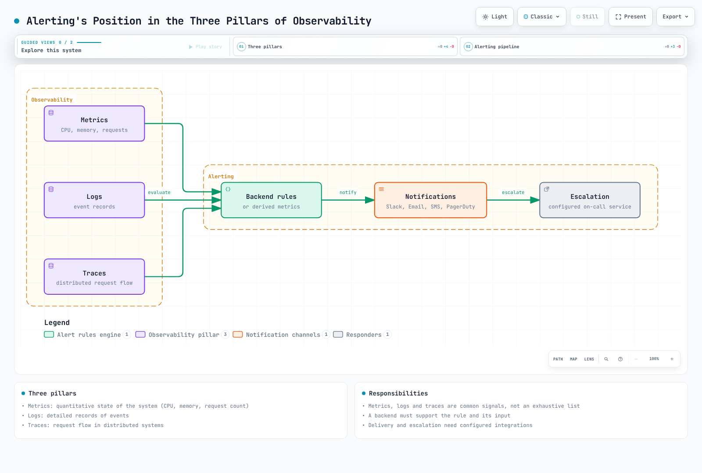
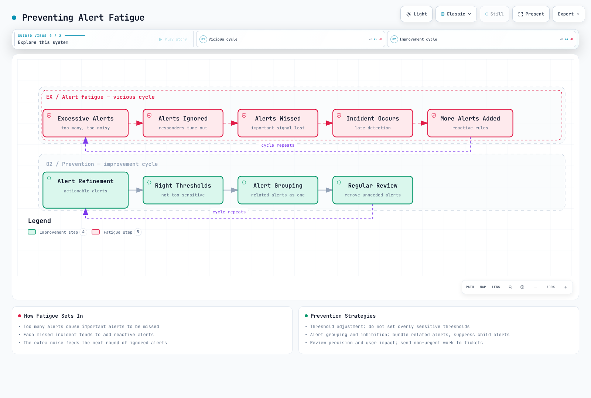
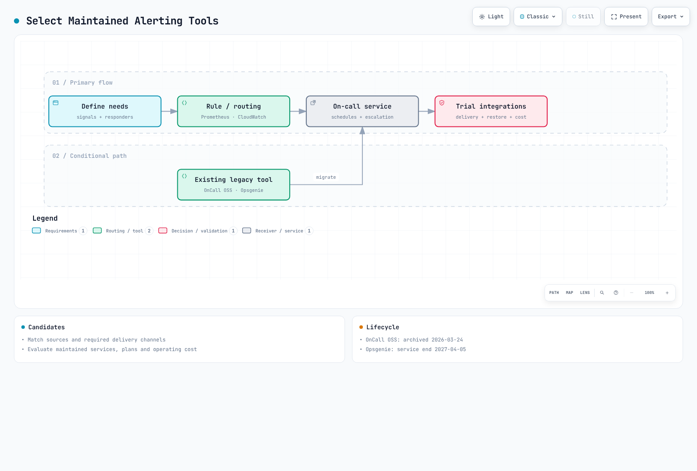
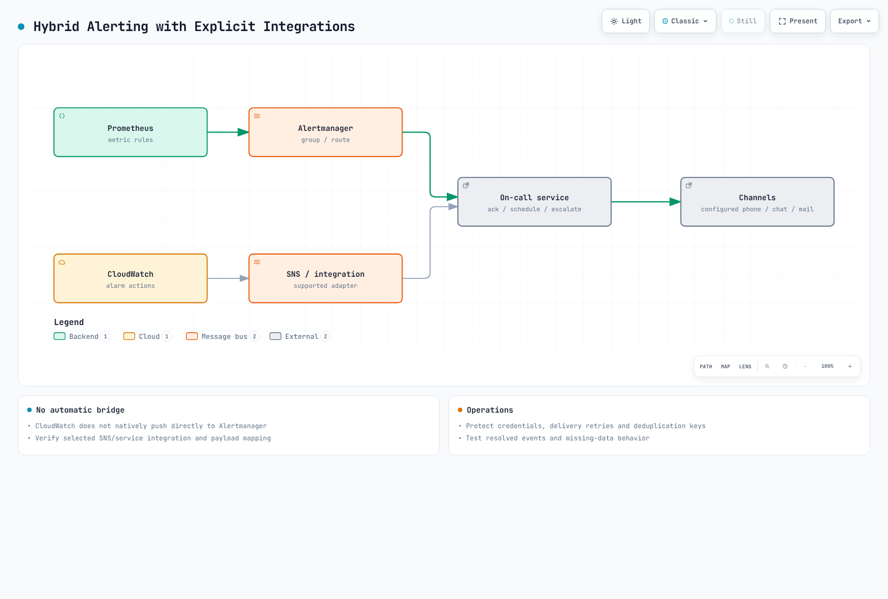

# 告警概述

> **最后更新**: September 13, 2026


> 审阅基线：Prometheus 3.14.0 与 Alertmanager 0.34.0。示例假定为单集群且时间序列已去重。请先确认实际的 job、标签、exporter 以及指标可用性，然后再调整阈值。仅执行了本地的规则/路由检查；未在任何集群或通知渠道上进行验证。


## 目录

- [告警的作用与重要性](#the-role-and-importance-of-alerting)
- [告警生命周期](#alert-lifecycle)
- [告警设计原则](#alert-design-principles)
- [告警路由与升级](#alert-routing-and-escalation)
- [On-Call 轮值](#on-call-rotation)
- [EKS 环境的告警策略](#alerting-strategy-for-eks-environments)
- [方案对比](#solution-comparison)

---

<span id="the-role-and-importance-of-alerting"></span>

## 告警的作用与重要性

### 告警在可观测性三大支柱中的位置

指标（metrics）、日志（logs）和追踪（traces）是常见的可观测性信号；此外还存在 profile 等其他信号。规则引擎并不一定直接评估这三者中的全部：



[🔍 View interactive diagram](https://www.atomai.click/kubernetes-docs/archmaps/en-observability-alerting-readme-0.html)

- **指标**：系统的量化状态（CPU、内存、请求数等）
- **日志**：事件的详细记录
- **追踪**：分布式系统中的请求流转

Prometheus 规则评估指标。日志和追踪则通过各后端特定的规则或派生指标来触发告警。检测、通知与人工确认是彼此独立的阶段，投递是否成功需要单独监控。

### 为什么需要告警

1. **主动响应问题**：在用户感受到问题之前发现问题
2. **最小化停机时间**：通过快速检测与响应提升服务可用性
3. **降低成本**：通过自动化监控减少人力成本
4. **满足 SLA/SLO**：达成服务级别目标的必备组成部分
5. **事故记录**：追踪并分析问题发生的历史

### 好的告警 vs 差的告警

| 方面 | 好的告警 | 差的告警 |
|--------|-------------|------------|
| **可操作性** | 需要立即采取行动 | 仅供参考，无需行动 |
| **清晰度** | 问题是什么很明确 | 含糊不清 |
| **紧急程度** | 紧急程度与严重性匹配 | 一切都很紧急 |
| **频率** | 频率适当 | 过于频繁或过于稀少 |
| **重复性** | 相关告警已分组 | 同一个问题产生数十条告警 |

---

<span id="alert-lifecycle"></span>

## 告警生命周期

下图将规则状态与事故响应结合在一起。Prometheus 使用 inactive/pending/firing；确认（acknowledgment）和处理中（work-in-progress）属于 on-call 工具。关闭事故并不会清除处于 firing 状态的规则。时间序列消失同样可以使规则变为非激活状态，绝不能将其视为已恢复的证据：


[🔍 View interactive diagram](https://www.atomai.click/kubernetes-docs/archmaps/en-observability-alerting-readme-1.html)

### 1. 检测

- **基于阈值**：当某个特定值超过配置的阈值时
- **基于变化率**：当变化率异常时
- **异常检测**：基于机器学习的异常模式检测
- **日志模式**：当出现特定日志模式时

```yaml
groups:
  - name: node-alerts
    rules:
      - alert: HighCPUUsage
        expr: 100 * (1 - avg by (cluster, instance) (rate(node_cpu_seconds_total{mode="idle"}[5m]))) > 80
        for: 5m
        labels:
          severity: warning
          team: sre
        annotations:
          summary: "High CPU usage detected"
          description: "CPU usage is above 80% for 5 minutes on {{ $labels.instance }}"
```

### 2. 通知

- **渠道选择**：Slack、Email、SMS、PagerDuty 等
- **路由**：根据告警类型投递给合适的接收者
- **分组**：将相关告警捆绑在一起
- **去重**：减少重复通知；repeat_interval 提醒和重试仍可能发生，不提供恰好一次（exactly-once）的保证

### 3. 升级

- **基于时间**：若在指定时间内无响应，则升级到下一位响应者
- **基于严重性**：根据严重性采用不同的升级路径
- **自动升级**：在 on-call 服务中进行配置。Alertmanager 的 repeat_interval 既不检查确认状态，也不轮换响应者


[🔍 View interactive diagram](https://www.atomai.click/kubernetes-docs/archmaps/en-observability-alerting-readme-2.html)

### 4. 解决

- **手动解决**：响应者在事故工具中关闭事故；规则状态需单独检查
- **自动解决**：在检查规则与采集健康状况后，按照集成策略更新事故状态
- **解决通知**：问题修复后发送解决通知

---

<span id="alert-design-principles"></span>

## 告警设计原则

### 1. 可操作的告警

打断他人的呼叫（page）需要有可立即执行的响应动作。信息性事件和较长期的工作可以改为进入工单或仪表板。

**不好的示例：**
```
Alert: Database connection count increased
```

**好的示例：**
```
Alert: Database connection pool exhausted
Action Required: Confirm user impact; inspect pool saturation and connection leaks using the runbook
Runbook: https://example.com/runbooks/replace-db-runbook
```

### 2. 防止告警疲劳

告警过多可能导致重要告警被忽略。



[🔍 View interactive diagram](https://www.atomai.click/kubernetes-docs/archmaps/en-observability-alerting-readme-3.html)

**防止告警疲劳的策略：**

1. **调整阈值**：不要设置过于敏感的阈值
2. **告警分组**：将相关告警合并为一条
3. **抑制（Inhibition）**：当父告警触发时抑制子告警
4. **定期审查**：移除不必要的告警
5. **逐步引入**：新告警先以较低严重性上线

### 3. 严重性级别

以下响应时间为示例性的组织策略，并非产品 SLA 或通用建议：

| 严重性 | 说明 | 响应时间 | 示例 |
|----------|-------------|---------------|----------|
| **Critical** | 服务完全中断 | 立即（5 分钟内） | 服务整体宕机、存在数据丢失风险 |
| **High** | 主要功能故障 | 15 分钟内 | 支付系统错误、登录失败 |
| **Warning** | 潜在问题 | 1 小时内 | 磁盘使用率 80%、响应延迟上升 |
| **Info** | 信息性告警 | 工作时间内 | 部署完成、备份成功 |

```yaml
groups:
  - name: disk-alerts
    rules:
      - alert: DiskSpaceCritical
        expr: |
          (100 * node_filesystem_avail_bytes{fstype!~"tmpfs|overlay|squashfs"}
            / node_filesystem_size_bytes{fstype!~"tmpfs|overlay|squashfs"} < 5)
          and node_filesystem_readonly == 0
          and node_filesystem_size_bytes > 0
        for: 5m
        labels:
          severity: critical
          team: sre
        annotations:
          summary: "Disk space critical"
      - alert: DiskSpaceWarning
        expr: |
          (100 * node_filesystem_avail_bytes{fstype!~"tmpfs|overlay|squashfs"}
            / node_filesystem_size_bytes{fstype!~"tmpfs|overlay|squashfs"} < 20)
          and node_filesystem_readonly == 0
          and node_filesystem_size_bytes > 0
        for: 10m
        labels:
          severity: warning
          team: sre
        annotations:
          summary: "Disk space low"
```

### 4. 告警文档

所有告警都应包含以下信息：

- **描述**：该告警的含义
- **影响**：该问题如何影响服务
- **处理步骤**：解决问题的分步指南
- **Runbook 链接**：详细的响应流程文档

```yaml
annotations:
  summary: "Investigate the affected operation"
  description: "Check the rule expression, its units, labels, and collection health."
  impact: "Document the affected user operation before paging."
  action: "Use the owning team's reviewed runbook; do not scale resources blindly."
  runbook_url: "https://example.com/runbooks/replace-with-reviewed-runbook"
```

---

<span id="alert-routing-and-escalation"></span>

## 告警路由与升级

### 路由策略

告警应根据各种条件投递给合适的接收者：


[🔍 View interactive diagram](https://www.atomai.click/kubernetes-docs/archmaps/en-observability-alerting-readme-5.html)

### 路由树设计

这是一份完整的**不发送通知**的路由验证配置。其中空的 receiver 是有意为之；在用于生产之前，请配置经过审阅的集成和 Secret 文件。critical 告警会同时分发给 on-call receiver 和匹配的团队。缺少 team 标签时会回退到 default，但仅匹配 critical 的情况不会同时调用 default。由于存在分组延迟，因此不存在"立即电话呼叫"的保证。disk critical 仅对相同的 instance/device/mountpoint 抑制 warning。

```yaml
route:
  receiver: default-receiver
  group_by: [alertname, cluster, namespace, service]
  group_wait: 30s
  group_interval: 5m
  repeat_interval: 4h
  routes:
    - matchers: ['severity="critical"']
      receiver: critical-oncall
      continue: true
    - matchers: ['team="sre"']
      receiver: sre-team
    - matchers: ['team="app"']
      receiver: dev-team
    - matchers: ['team="database"']
      receiver: dba-team
    - matchers: ['team="security"']
      receiver: security-team
receivers:
  - name: default-receiver
  - name: critical-oncall
  - name: sre-team
  - name: dev-team
  - name: dba-team
  - name: security-team
inhibit_rules:
  - source_matchers: ['alertname="DiskSpaceCritical"', 'instance!=""', 'device!=""', 'mountpoint!=""']
    target_matchers: ['alertname="DiskSpaceWarning"', 'instance!=""', 'device!=""', 'mountpoint!=""']
    equal: [cluster, instance, device, mountpoint]
```

### 升级策略

以下内容为示例。请在 on-call 服务中配置时区、确认时间窗、备份人员和重新呼叫行为，并通过演练进行测试：

| 步骤 | 时间 | 目标 | 渠道 |
|------|------|--------|------|
| 1 | 0 分钟 | 主 on-call | Slack, PagerDuty |
| 2 | 15 分钟 | 副 on-call | Slack, PagerDuty, SMS |
| 3 | 30 分钟 | 团队负责人 | Slack, PagerDuty, Phone |
| 4 | 45 分钟 | 工程经理 | Phone |
| 5 | 60 分钟 | CTO/工程 VP | Phone |

---

<span id="on-call-rotation"></span>

## On-Call 轮值

### On-Call 概念

On-Call 指在指定时间段内负责处理系统问题的指定响应者。


[🔍 View interactive diagram](https://www.atomai.click/kubernetes-docs/archmaps/en-observability-alerting-readme-8.html)


### On-Call 最佳实践

1. **明确的交接排班**：每周或每两周轮换
2. **交接流程**：换班时移交进行中的问题
3. **备份响应者**：主响应者不可用时由备份接手
4. **合理的补偿**：on-call 津贴或补休
5. **防止倦怠**：合理的轮换周期

### On-Call 工具需求

- **排班管理**：日历集成、班次管理
- **临时替班（Override）**：临时变更响应者
- **升级**：自动升级
- **移动端支持**：随时随地接收告警
- **报告**：on-call 活动分析

---

<span id="alerting-strategy-for-eks-environments"></span>

## EKS 环境的告警策略

### EKS 特有的告警领域


[🔍 View interactive diagram](https://www.atomai.click/kubernetes-docs/archmaps/en-observability-alerting-readme-4.html)

### 按层次划分的告警策略

#### 1. 集群级告警

请将 job 名称替换为实际部署的目标。up=0 证明的是抓取（scrape）失败，而非 API 完全中断。absent 规则仅覆盖一个采集范围；多集群环境需要预期目标清单和 cluster 标签。对 Cluster Autoscaler 的累计错误计数器应使用 increase。近期的增长在五分钟内持续存在，并不意味着错误在这五分钟内连续发生。该规则不能原样适用于 Karpenter 或 EKS Auto Mode。

```yaml
groups:
  - name: eks-cluster
    rules:
      - alert: EKSAPIServerScrapeFailed
        expr: up{job="kubernetes-apiservers"} == 0
        for: 1m
        labels:
          severity: critical
          team: sre
        annotations:
          summary: "Prometheus cannot scrape the configured API server target"
      - alert: EKSAPIServerTargetMissing
        expr: absent(up{job="kubernetes-apiservers"})
        for: 5m
        labels:
          severity: warning
          team: sre
        annotations:
          summary: "No API server target series in this Prometheus"
      - alert: EKSNodeNotReady
        expr: kube_node_status_condition{condition="Ready",status="true"} == 0
        for: 5m
        labels:
          severity: critical
          team: sre
        annotations:
          summary: "Node {{ $labels.node }} is not ready"
      - alert: EKSClusterAutoscalerRecentErrors
        expr: increase(cluster_autoscaler_errors_total[10m]) > 0
        for: 5m
        labels:
          severity: warning
          team: sre
        annotations:
          summary: "Cluster Autoscaler recorded failed loops in the last 10 minutes"
```

#### 2. 工作负载级告警

CrashLoopBackOff 时间序列可能在重试之间短暂消失。该规则在最近五分钟的观察窗口持续有数据达十分钟后触发。它检测的是反复出现的观察结果，而非当前持续处于 Waiting 状态，并且在最后一次观察之后最多可保持激活五分钟。原生规则测试能够区分短暂瞬时状态、反复重试和恢复。

```yaml
groups:
  - name: eks-workloads
    rules:
      - alert: PodCrashLooping
        expr: max_over_time(kube_pod_container_status_waiting_reason{reason="CrashLoopBackOff"}[5m]) >= 1
        for: 10m
        labels:
          severity: warning
          team: app
        annotations:
          summary: "Pod {{ $labels.namespace }}/{{ $labels.pod }} repeatedly observed in CrashLoopBackOff"
      - alert: PodFrequentRestarts
        expr: increase(kube_pod_container_status_restarts_total[15m]) > 3
        for: 5m
        labels:
          severity: warning
          team: app
        annotations:
          summary: "Pod {{ $labels.namespace }}/{{ $labels.pod }} has frequent restarts"
      - alert: PodNotReady
        expr: |
          (kube_pod_status_ready{condition="true"} == 0)
          and on (namespace, pod, uid)
          (kube_pod_status_phase{phase=~"Pending|Running|Unknown"} == 1)
        for: 15m
        labels:
          severity: warning
          team: app
        annotations:
          summary: "Active pod {{ $labels.namespace }}/{{ $labels.pod }} is not ready"
      - alert: DeploymentReplicasMismatch
        expr: |
          kube_deployment_spec_replicas
            > on (namespace, deployment) kube_deployment_status_replicas_available
        for: 10m
        labels:
          severity: warning
          team: app
        annotations:
          summary: "Deployment {{ $labels.namespace }}/{{ $labels.deployment }} has fewer available replicas than desired"
```

#### 3. 资源级告警

CFS 示例衡量的是**被限流的周期数 / 总周期数**，而不是所占用时间的比例。请确认 cAdvisor 会导出这些指标。未设置内存上限时可能显示为零或一个非常大的值；应将内存规则限定于显式设置了 limits 的容器。PVC 统计信息取决于 CSI 驱动和卷类型。分母为零的情况已被排除，但指标缺失并不能证明系统健康。

```yaml
groups:
  - name: eks-resources
    rules:
      - alert: ContainerCPUThrottling
        expr: |
          (
            sum by (namespace, pod, container) (
              rate(container_cpu_cfs_throttled_periods_total{container!="",container!="POD"}[5m]))
            / sum by (namespace, pod, container) (
              rate(container_cpu_cfs_periods_total{container!="",container!="POD"}[5m]))
          ) > 0.25
          and sum by (namespace, pod, container) (
            rate(container_cpu_cfs_periods_total{container!="",container!="POD"}[5m])) > 0
        for: 5m
        labels:
          severity: warning
          team: app
        annotations:
          summary: "More than 25% of CFS periods throttled for {{ $labels.pod }}/{{ $labels.container }}"
      - alert: ContainerMemoryNearLimit
        expr: |
          (
            container_memory_working_set_bytes{container!="",container!="POD"}
            / container_spec_memory_limit_bytes{container!="",container!="POD"}
          ) > 0.9
          and container_spec_memory_limit_bytes{container!="",container!="POD"} > 0
        for: 5m
        labels:
          severity: warning
          team: app
        annotations:
          summary: "Container {{ $labels.pod }}/{{ $labels.container }} memory is near its reported limit"
      - alert: PVCAlmostFull
        expr: |
          (kubelet_volume_stats_used_bytes / kubelet_volume_stats_capacity_bytes > 0.85)
          and kubelet_volume_stats_capacity_bytes > 0
        for: 5m
        labels:
          severity: warning
          team: sre
        annotations:
          summary: "PVC {{ $labels.namespace }}/{{ $labels.persistentvolumeclaim }} is almost full"
```

### AWS 服务集成告警

EKS 1.28+ 在 AWS/EKS 中提供部分控制平面指标；这并不会将每个内部组件都开放供抓取。若要排查认证错误，需单独启用控制平面日志。评估可用性时应结合采集健康状况、API 请求失败情况以及外部探测：

| AWS 服务 | 监控项 | 告警工具 |
|-------------|------------------|------------|
| EKS Control Plane | API Server 可用性、认证错误 | CloudWatch |
| EC2 (Nodes) | 实例状态、系统检查 | CloudWatch |
| EBS | 卷状态、IOPS 使用率 | CloudWatch |
| EFS | 吞吐量、连接数 | CloudWatch |
| ALB / NLB | ALB HTTP 请求/错误/响应时间；NLB 流量/TCP 重置/目标健康状况 | CloudWatch：使用各产品专属指标 |
| VPC / NAT Gateway | NAT 指标；单独启用的 Flow Logs 中的接受/拒绝记录 | CloudWatch 指标/Logs；Flow Logs 不是告警引擎 |

---

<span id="solution-comparison"></span>

## 方案对比

### 主流告警方案对比表

| 产品 | 作用与运维限制 |
|---------|--------------------------------|
| Alertmanager | 开源的分组、路由、抑制与提醒；需自行托管和运维。不提供 on-call 排班或基于确认的升级 |
| CloudWatch Alarms | 评估 AWS 指标/受支持的查询，改变状态并调用已配置的操作；排班需单独处理 |
| Grafana OnCall OSS | 已于 2026-03-24 归档；不适合作为新生产部署的默认选择 |
| Grafana Cloud IRM / PagerDuty | on-call/升级的候选方案；请确认当前的套餐、渠道、区域和合同 |
| Opsgenie | 2025-06-04 停止销售；支持与服务计划于 2027-04-05 终止。现有用户需要制定迁移计划 |

### 方案选择指南



[🔍 View interactive diagram](https://www.atomai.click/kubernetes-docs/archmaps/en-observability-alerting-readme-6.html)

#### 按场景推荐的方案

1. 以 Prometheus 为中心：使用 Alertmanager 进行分组/路由，并接入所需的渠道。
2. 以 AWS 指标为中心：评估配合 SNS 或受支持的事故集成使用 CloudWatch Alarms。
3. 全天候响应：根据人员配置、备份、时区、确认、升级和成本，选择一个仍在维护的 on-call 服务。
4. 已有 Grafana OnCall OSS/Opsgenie：确认功能、历史记录、排班和集成的迁移方案。

### 混合方案

各方案可以组合使用。CloudWatch 不会自动直接发送到 Alertmanager。本示例通过 SNS/受支持的集成对接 on-call 服务；若要经由 Alertmanager 路由，则需要单独设计适配器、认证以及重复/解决状态的处理：



[🔍 View interactive diagram](https://www.atomai.click/kubernetes-docs/archmaps/en-observability-alerting-readme-7.html)

**架构示例：**

1. **Prometheus + Alertmanager**：指标采集与主要告警处理
2. **CloudWatch**：AWS 服务指标采集
3. **仍在维护的 on-call 服务**：on-call 管理与升级
4. **Slack**：实时告警与协作

---

## 下一步

本节介绍了告警的基本概念与策略。各方案的详细配置方法请参考以下文档：

- [Prometheus Alertmanager](./01-alertmanager.md): 开源告警管理
- [CloudWatch Alarms](./02-cloudwatch-alarms.md): AWS 原生告警
- [Grafana OnCall](./03-grafana-oncall.md): 现有部署的评估与迁移注意事项

---

## 参考资料

- [Prometheus Alerting Best Practices](https://prometheus.io/docs/practices/alerting/)
- [Google SRE Book - Practical Alerting](https://sre.google/sre-book/practical-alerting/)
- [AWS CloudWatch Alarms Documentation](https://docs.aws.amazon.com/AmazonCloudWatch/latest/monitoring/AlarmThatSendsEmail.html)
- [Grafana OnCall Documentation](https://grafana.com/docs/oncall/latest/)
- [PagerDuty Incident Response](https://response.pagerduty.com/)

- [Alertmanager configuration](https://prometheus.io/docs/alerting/latest/configuration/)
- [EKS control-plane metrics](https://docs.aws.amazon.com/eks/latest/userguide/cloudwatch.html)
- [Opsgenie lifecycle and migration](https://www.atlassian.com/software/opsgenie)
