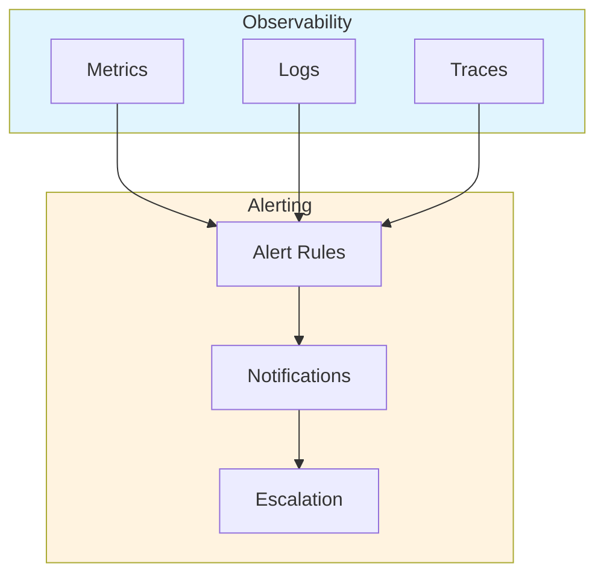
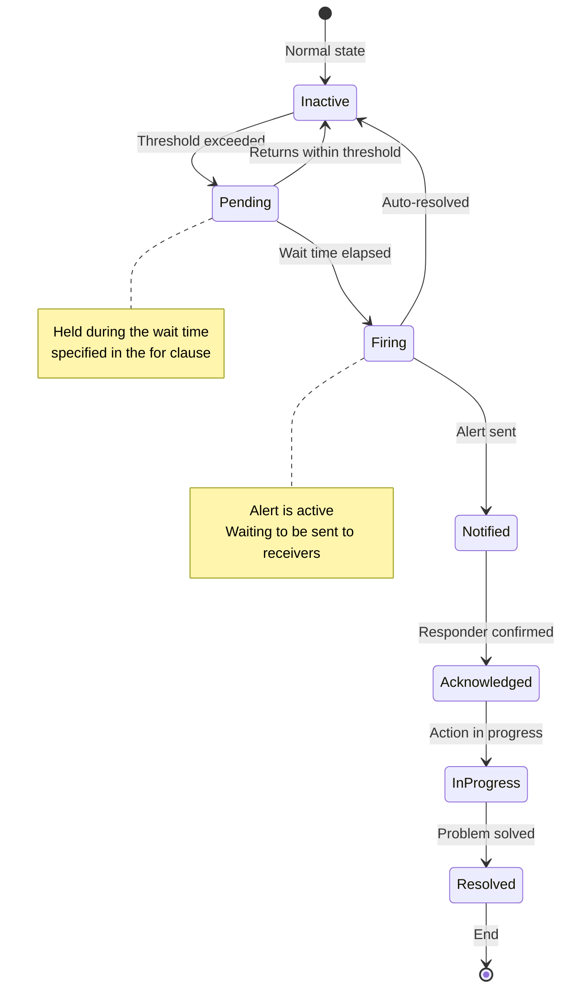
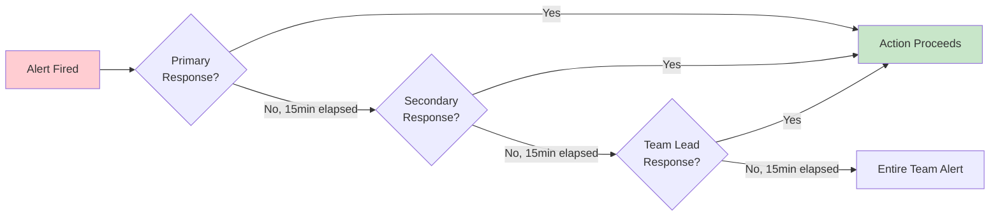
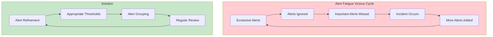
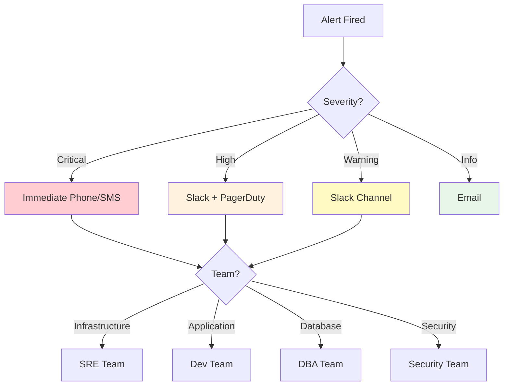
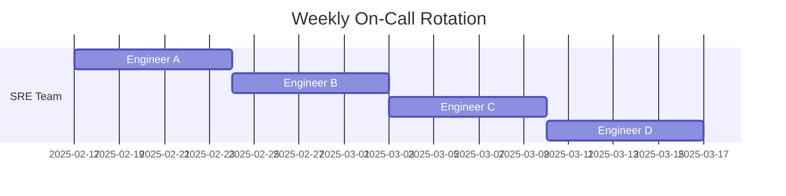
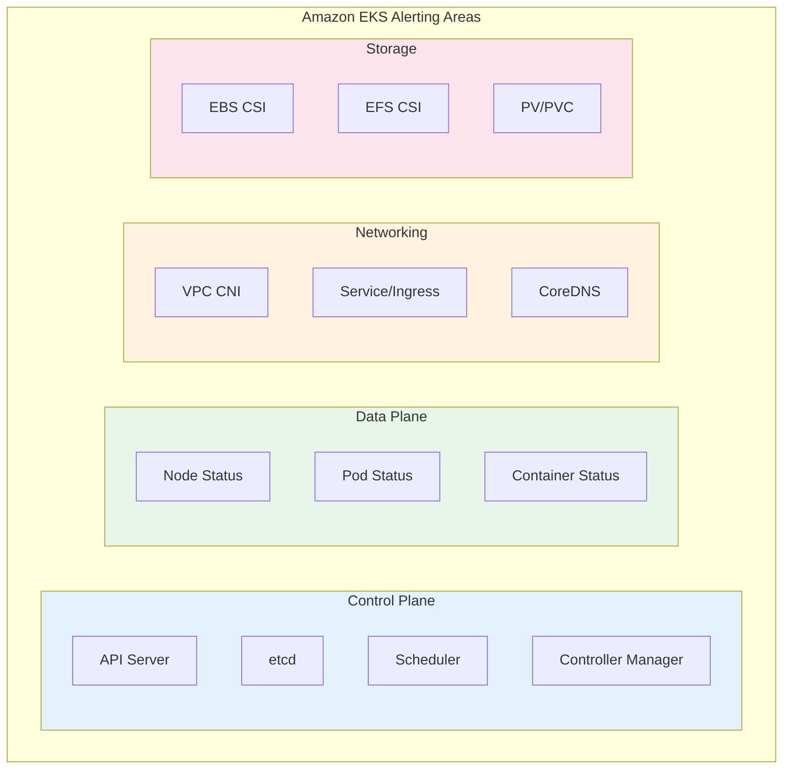
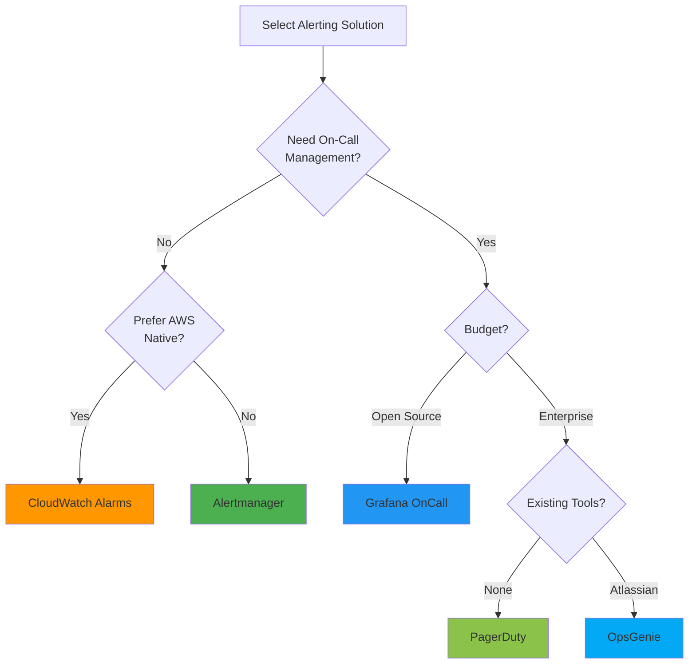
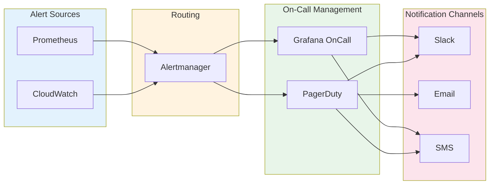

# 告警概述

> **最后更新**: February 20, 2026

## 目录

- [告警的角色与重要性](#告警的角色与重要性)
- [告警生命周期](#告警生命周期)
- [告警设计原则](#告警设计原则)
- [告警路由与升级](#告警路由与升级)
- [值班轮换](#值班轮换)
- [EKS 环境的告警策略](#eks-环境的告警策略)
- [解决方案对比](#解决方案对比)

---

## 告警的角色与重要性

### 告警在可观测性三大支柱中的位置

现代可观测性由三大核心支柱构成：



- **Metrics**：系统的量化状态（CPU、内存、请求数等）
- **Logs**：事件的详细记录
- **Traces**：分布式系统中的请求流

**Alerting** 基于这三类数据源检测异常，并及时通知相关负责人，从而实现快速响应。

### 为什么需要告警

1. **主动响应问题**：在用户遇到问题之前检测问题
2. **最小化停机时间**：通过快速检测和响应提高服务可用性
3. **降低成本**：通过自动化监控降低人力成本
4. **遵守 SLA/SLO**：实现服务级别目标的重要组成部分
5. **事件记录**：跟踪和分析问题发生历史

### 好的告警与差的告警

| 方面 | 好的告警 | 差的告警 |
|--------|-------------|------------|
| **可操作性** | 需要立即采取行动 | 仅提供信息，无需行动 |
| **清晰度** | 明确说明问题所在 | 模糊不清 |
| **紧急程度** | 紧急程度与严重性相符 | 所有事情都很紧急 |
| **频率** | 频率适当 | 过于频繁或过于罕见 |
| **重复性** | 相关告警已分组 | 同一问题触发数十个告警 |

---

## 告警生命周期

告警会经历以下生命周期：



### 1. 检测

- **基于阈值**：特定值超过配置的阈值时
- **基于变化率**：变化率异常时
- **异常检测**：基于机器学习的异常模式检测
- **日志模式**：特定日志模式出现时

```yaml
# Prometheus alert rule example
groups:
  - name: node-alerts
    rules:
      - alert: HighCPUUsage
        expr: 100 - (avg by(instance) (irate(node_cpu_seconds_total{mode="idle"}[5m])) * 100) > 80
        for: 5m  # Alert fires if condition persists for 5 minutes
        labels:
          severity: warning
        annotations:
          summary: "High CPU usage detected"
          description: "CPU usage is above 80% for 5 minutes on {{ $labels.instance }}"
```

### 2. 通知

- **渠道选择**：Slack、Email、SMS、PagerDuty 等
- **路由**：根据告警类型发送给合适的接收者
- **分组**：将相关告警打包在一起
- **去重**：防止重复发送相同的告警

### 3. 升级

- **基于时间**：在指定时间内未响应时升级给下一位响应者
- **基于严重性**：根据严重性采用不同的升级路径
- **自动升级**：根据定义的规则自动升级



### 4. 解决

- **手动解决**：响应者修复问题后关闭告警
- **自动解决**：指标恢复到正常范围后自动关闭
- **解决通知**：问题修复后发送解决通知

---

## 告警设计原则

### 1. 可操作的告警

所有告警都应使接收者能够立即采取行动。

**不良示例：**
```
Alert: Database connection count increased
```

**良好示例：**
```
Alert: Database connection pool exhausted
Action Required: Scale up database or investigate connection leaks
Runbook: https://wiki.company.com/db-connection-exhausted
```

### 2. 防止告警疲劳

过多的告警可能导致重要告警被忽略。



**防止告警疲劳的策略：**

1. **调整阈值**：不要设置过于敏感的阈值
2. **告警分组**：将相关告警合并为一个
3. **抑制**：父级告警触发时抑制子级告警
4. **定期审查**：移除不必要的告警
5. **逐步引入**：先以低严重性引入新告警

### 3. 严重性级别

定义并遵循一致的严重性体系：

| 严重性 | 描述 | 响应时间 | 示例 |
|----------|-------------|---------------|----------|
| **Critical** | 完全服务中断 | 立即（5 分钟内） | 整个服务宕机、存在数据丢失风险 |
| **High** | 主要功能故障 | 15 分钟内 | 支付系统错误、登录失败 |
| **Warning** | 潜在问题 | 1 小时内 | 磁盘使用率 80%、响应延迟增加 |
| **Info** | 信息性告警 | 工作时间内 | Deployment 完成、备份成功 |

```yaml
# Alert rules by severity example
groups:
  - name: disk-alerts
    rules:
      - alert: DiskSpaceCritical
        expr: (node_filesystem_avail_bytes / node_filesystem_size_bytes) * 100 < 5
        for: 5m
        labels:
          severity: critical
        annotations:
          summary: "Disk space critical"

      - alert: DiskSpaceWarning
        expr: (node_filesystem_avail_bytes / node_filesystem_size_bytes) * 100 < 20
        for: 10m
        labels:
          severity: warning
        annotations:
          summary: "Disk space low"
```

### 4. 告警文档

所有告警都应包含以下信息：

- **描述**：告警的含义
- **影响**：该问题如何影响服务
- **操作步骤**：解决问题的分步指南
- **Runbook 链接**：详细的响应流程文档

```yaml
annotations:
  summary: "High memory usage on {{ $labels.instance }}"
  description: |
    Memory usage is above 90% on {{ $labels.instance }}.
    Current value: {{ $value | printf "%.2f" }}%
  impact: "Application may experience OOM kills and service degradation"
  action: |
    1. Check for memory leaks: kubectl top pods -n {{ $labels.namespace }}
    2. Review recent deployments
    3. Consider scaling horizontally
  runbook_url: "https://wiki.company.com/runbooks/high-memory"
```

---

## 告警路由与升级

### 路由策略

应根据各种条件将告警发送给合适的接收者：



### 路由树设计

```yaml
# Alertmanager routing configuration example
route:
  receiver: 'default-receiver'
  group_by: ['alertname', 'cluster', 'service']
  group_wait: 30s
  group_interval: 5m
  repeat_interval: 4h

  routes:
    # Critical alerts - immediate phone call
    - match:
        severity: critical
      receiver: 'pagerduty-critical'
      continue: true

    # Infrastructure team alerts
    - match_re:
        alertname: ^(Node|Disk|CPU|Memory).*
      receiver: 'sre-team'
      routes:
        - match:
            severity: critical
          receiver: 'sre-oncall'

    # Application team alerts
    - match_re:
        namespace: ^(app|api|web).*
      receiver: 'dev-team'

    # Database alerts
    - match_re:
        alertname: ^(MySQL|PostgreSQL|Redis|MongoDB).*
      receiver: 'dba-team'
```

### 升级策略

设置基于时间的升级策略，确保告警不会被忽略：

| 步骤 | 时间 | 目标 | 渠道 |
|------|------|--------|---------|
| 1 | 0 分钟 | 主要值班人员 | Slack、PagerDuty |
| 2 | 15 分钟 | 次要值班人员 | Slack、PagerDuty、SMS |
| 3 | 30 分钟 | 团队负责人 | Slack、PagerDuty、电话 |
| 4 | 45 分钟 | 工程经理 | 电话 |
| 5 | 60 分钟 | CTO/VP Engineering | 电话 |

---

## 值班轮换

### 值班概念

值班是指在指定期间内负责处理系统问题的指定响应者。



### 值班最佳实践

1. **明确的交接计划**：每周或每两周轮换
2. **交接流程**：在换班期间移交进行中的问题
3. **备用响应者**：主要响应者不可用时提供备份
4. **适当的补偿**：值班津贴或补休
5. **防止倦怠**：采用适当的轮换周期

### 值班工具要求

- **排班管理**：日历集成、班次管理
- **替换**：临时更改响应者
- **升级**：自动升级
- **移动支持**：随时随地接收告警
- **报告**：值班活动分析

---

## EKS 环境的告警策略

### EKS 专属告警领域



### 按层划分的告警策略

#### 1. 集群级告警

```yaml
# Cluster-level alert examples
groups:
  - name: eks-cluster
    rules:
      - alert: EKSAPIServerDown
        expr: up{job="kubernetes-apiservers"} == 0
        for: 1m
        labels:
          severity: critical
        annotations:
          summary: "EKS API Server is down"

      - alert: EKSNodeNotReady
        expr: kube_node_status_condition{condition="Ready",status="true"} == 0
        for: 5m
        labels:
          severity: critical
        annotations:
          summary: "Node {{ $labels.node }} is not ready"

      - alert: EKSClusterAutoscalerError
        expr: cluster_autoscaler_errors_total > 0
        for: 5m
        labels:
          severity: warning
        annotations:
          summary: "Cluster Autoscaler is experiencing errors"
```

#### 2. 工作负载级告警

```yaml
# Workload-level alert examples
groups:
  - name: eks-workloads
    rules:
      - alert: PodCrashLooping
        expr: rate(kube_pod_container_status_restarts_total[15m]) * 60 * 15 > 3
        for: 5m
        labels:
          severity: warning
        annotations:
          summary: "Pod {{ $labels.pod }} is crash looping"

      - alert: PodNotReady
        expr: |
          sum by (namespace, pod) (
            kube_pod_status_phase{phase=~"Pending|Unknown"}
          ) > 0
        for: 15m
        labels:
          severity: warning
        annotations:
          summary: "Pod {{ $labels.pod }} has been pending for 15 minutes"

      - alert: DeploymentReplicasMismatch
        expr: |
          kube_deployment_spec_replicas != kube_deployment_status_replicas_available
        for: 10m
        labels:
          severity: warning
        annotations:
          summary: "Deployment {{ $labels.deployment }} has replica mismatch"
```

#### 3. 资源级告警

```yaml
# Resource-level alert examples
groups:
  - name: eks-resources
    rules:
      - alert: ContainerCPUThrottling
        expr: |
          rate(container_cpu_cfs_throttled_seconds_total[5m]) > 0.25
        for: 5m
        labels:
          severity: warning
        annotations:
          summary: "Container {{ $labels.container }} is being CPU throttled"

      - alert: ContainerMemoryNearLimit
        expr: |
          (container_memory_working_set_bytes / container_spec_memory_limit_bytes) > 0.9
        for: 5m
        labels:
          severity: warning
        annotations:
          summary: "Container {{ $labels.container }} memory usage is near limit"

      - alert: PVCAlmostFull
        expr: |
          (kubelet_volume_stats_used_bytes / kubelet_volume_stats_capacity_bytes) > 0.85
        for: 5m
        labels:
          severity: warning
        annotations:
          summary: "PVC {{ $labels.persistentvolumeclaim }} is almost full"
```

### AWS 服务集成告警

EKS 与多种 AWS 服务集成，因此也需要为这些服务设置告警：

| AWS 服务 | 监控项 | 告警工具 |
|-------------|------------------|------------|
| EKS Control Plane | API Server 可用性、身份验证错误 | CloudWatch |
| EC2 (Nodes) | 实例状态、系统检查 | CloudWatch |
| EBS | Volume 状态、IOPS 使用情况 | CloudWatch |
| EFS | 吞吐量、连接数 | CloudWatch |
| ALB/NLB | 请求数、错误率、延迟 | CloudWatch |
| VPC | 网络流量、NAT Gateway | CloudWatch/VPC Flow Logs |

---

## 解决方案对比

### 主要告警解决方案对比表

| 功能 | Alertmanager | CloudWatch Alarms | Grafana OnCall | PagerDuty | OpsGenie |
|---------|--------------|-------------------|----------------|-----------|----------|
| **类型** | Open Source | AWS Native | Open Source/SaaS | SaaS | SaaS |
| **成本** | 免费 | 按告警收费 | 免费/付费 | 付费 | 付费 |
| **EKS 集成** | Prometheus 集成 | 原生 | Alertmanager 集成 | 多种集成 | 多种集成 |
| **值班管理** | 无 | 无 | 是 | 是 | 是 |
| **升级** | 基础 | 无 | 是 | 高级 | 高级 |
| **移动应用** | 无 | 无 | 是 | 是 | 是 |
| **ChatOps** | Webhook | SNS | Slack、Teams | 多种 | 多种 |
| **复杂度** | 中 | 低 | 中 | 低 | 低 |

### 解决方案选择指南



#### 按场景推荐的解决方案

1. **小型团队、成本敏感**：Alertmanager + Slack
2. **完全采用 AWS 的环境**：CloudWatch Alarms + SNS + Lambda
3. **中型规模、需要值班**：Grafana OnCall
4. **大型组织、复杂升级**：PagerDuty
5. **Atlassian 生态系统**：OpsGenie

### 混合方法

大多数生产环境会组合使用多种解决方案：



**推荐架构：**

1. **Prometheus + Alertmanager**：指标收集和主要告警处理
2. **CloudWatch**：AWS 服务指标收集
3. **Grafana OnCall 或 PagerDuty**：值班管理和升级
4. **Slack**：实时告警和协作

---

## 后续步骤

本节介绍了告警的基本概念和策略。有关各解决方案的详细配置方法，请参阅以下文档：

- [Prometheus Alertmanager](./01-alertmanager.md)：开源告警管理
- [CloudWatch Alarms](./02-cloudwatch-alarms.md)：AWS 原生告警
- [Grafana OnCall](./03-grafana-oncall.md)：值班和事件管理

---

## 参考资料

- [Prometheus 告警最佳实践](https://prometheus.io/docs/practices/alerting/)
- [Google SRE Book - 实用告警](https://sre.google/sre-book/practical-alerting/)
- [AWS CloudWatch Alarms 文档](https://docs.aws.amazon.com/AmazonCloudWatch/latest/monitoring/AlarmThatSendsEmail.html)
- [Grafana OnCall 文档](https://grafana.com/docs/oncall/latest/)
- [PagerDuty 运维指南](https://www.pagerduty.com/resources/operations/)
