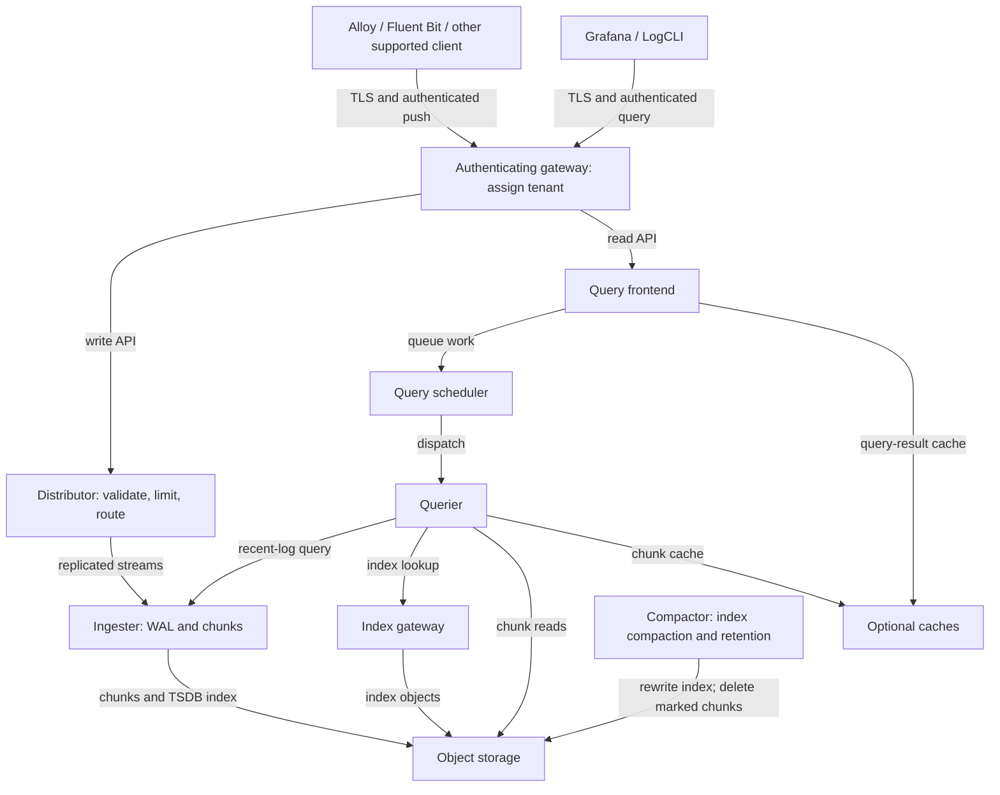

# Grafana Loki

> **最后更新**: September 13, 2026
> **示例基线**: Loki 3.7.7 / 社区 Helm chart 18.12.1。本地配置、渲染和 LogQL 检查；不包括 EKS 部署、S3 访问、负载测试或 HA/故障切换测试。

Loki 将日志存储为压缩块，并为流标签建立索引。这可以减少索引开销，但并不意味着相较于 Elasticsearch/OpenSearch 在成本或查询速度上具有普遍优势。请结合具有代表性的工作负载，比较摄取、保留、查询选择性、对象请求、计算、缓存和运维要求。

## 概览

| 能力 | 含义和边界 |
|---|---|
| 标签索引 | 在扫描日志内容前选择流。解析 JSON 和扫描块仍需要工作。 |
| 对象存储 | 生产存储可以使用 S3 和其他受支持的后端。本地文件系统存储适合小型实验，但并非共享的分布式对象存储。 |
| LogQL | 支持日志管道和从日志派生的指标。它不能与 PromQL 或 SQL 互换。 |
| 多租户 | 租户 ID 用于隔离数据和限制。认证代理必须决定调用方可访问哪个租户。 |
| 扩缩容与复制 | 取决于部署模式、ring、仲裁、存储和故障域。仅有副本和 WAL 并不能保证无损交付。 |

Elasticsearch/OpenSearch 使用不同的索引和搜索模型。Loki 可以搜索日志文本，但通常会先缩小标签/时间范围，再扫描匹配的块。没有可复现的比较时，应避免固定的“便宜 10 倍”、“始终更快”或内存排名说法。

## 架构

该图展示常规的 TSDB/块部署，而非所有可选或实验性的 Loki 组件。查询箭头指向所请求的服务；响应沿相同路径返回。



| 组件 | 职责 |
|---|---|
| Distributor | 验证流，应用租户/每流摄取限制，并通过 ring 路由写入。字节速率限制不是每秒流数设置。 |
| Ingester | 缓冲流、在启用时写入 WAL、构建/刷新块并提供最近数据。持久 WAL 存储可降低故障风险；但不能取代复制、备份或客户端重试规划。 |
| Querier | 通过 Ingester 读取最近数据，并经由索引/对象存储路径读取历史数据，然后执行 LogQL 并合并结果。 |
| Query frontend / scheduler | 拆分并排队查询工作；提供可选的结果缓存和受控重试。运行时配置键为 `frontend`；Helm 的工作负载键为 `queryFrontend`。 |
| Index gateway | 在分布式部署中提供索引查询。它与块存储不同。 |
| Compactor | 压缩**索引文件**，并在启用时删除过期的索引引用，异步删除已标记的块。它不是通用的小日志块合并器。 |

## 部署模式

| 模式 | 选择建议 |
|---|---|
| 单体，`-target=all` | 适合小型安装和实验。Chart 18.12.1 将此模式称为 `Monolithic`；其工作负载值仍位于 `singleBinary` 下。Chart 默认值并不能证明其适合生产环境。 |
| Simple Scalable (SSD) | 历史读/写/后端组。SSD 已弃用，计划在 Loki 4.0 中移除。应规划明确的迁移，而不是将其选作新的生产 EKS 安装的默认模式。 |
| 微服务，chart `Distributed` | 分离 Distributor、Ingester、Querier、frontend、scheduler、index gateway 和 Compactor。当前 Helm 指引建议将其用于生产可扩展性/HA，但运维复杂度更高。 |

旧的 `<100GB`、`100GB–10TB` 和 `>10TB` 分类并非经过测量的容量。应根据峰值字节/秒、活跃流、查询并发数、保留期、块利用率和故障恢复进行容量规划。不要将近似的容量建议当作保证。

## Helm 安装

### 前提条件和所有权

以下是**新安装的配置起点**，而非完整的生产平台：

- Chart 18.12.1 声明 Kubernetes `>=1.25.0-0`；清单检查使用 Kubernetes 1.36.2。这不是对每个 Kubernetes/EKS 版本或平台的测试。
- 配置私有 bucket、范围受限的 IAM role、用于 IRSA 的 EKS OIDC provider，以及合适的现有 `gp3` StorageClass。该类名是一个假设，并非 EKS 内置保证。EBS CSI/Auto Mode provisioner、节点 OS、AZ 容量、PVC 绑定和配额必须与实际集群相符。
- 准备带有 `.htpasswd` 键的 `loki-gateway-auth` 以及带有 `tls.crt`/`tls.key` 的 `loki-gateway-tls`。为 gateway 的实际 DNS 名称使用受信任的证书。通过你的密钥管理工作流提供 secret；不要将密码或私钥提交到 values 文件中。
- gateway 会将已认证用户名映射到 `X-Scope-OrgID`，覆盖调用方提供的租户 header。使用 network policy/security boundary 和 namespace RBAC 限制对 Loki 组件端口的直接访问。仅有租户 header 并不是认证；绕过 gateway 就绕过了其授权。
- gateway 使用 HTTPS 和 ClusterIP Service，且禁用 ingress。内部 Loki 组件流量仍需要适合该环境的传输/网络控制。此处未配置 ALB、公共端点或完整的 network policy。

### 固定版本的分布式 values

保存为 `values-eks.yaml`。请一致地替换示例账户、role 和 bucket 名称。schema 起始日期适用于**新的**存储；升级时请保留所有现有 schema 条目。

```yaml
deploymentMode: Distributed
loki:
  image:
    tag: 3.7.7
  auth_enabled: true
  analytics:
    reporting_enabled: false
  commonConfig:
    replication_factor: 3
  schemaConfig:
    configs:
    - from: '2026-09-01'
      store: tsdb
      object_store: s3
      schema: v13
      index:
        prefix: loki_index_
        period: 24h
  storage:
    type: s3
    bucketNames:
      chunks: example-loki-chunks-123456789012
      ruler: example-loki-ruler-123456789012
    s3:
      region: ap-northeast-2
  ingester:
    chunk_encoding: snappy
    wal:
      enabled: true
      dir: /var/loki/wal
  compactor:
    working_directory: /var/loki/compactor
    retention_enabled: true
    delete_request_store: s3
    retention_delete_delay: 2h
  limits_config:
    retention_period: 744h
    allow_structured_metadata: true
    ingestion_rate_strategy: global
    ingestion_rate_mb: 10
    ingestion_burst_size_mb: 20
    per_stream_rate_limit: 5MB
    per_stream_rate_limit_burst: 15MB
  runtimeConfig:
    overrides:
      development:
        retention_period: 168h
serviceAccount:
  create: true
  name: loki
  annotations:
    eks.amazonaws.com/role-arn: arn:aws:iam::123456789012:role/loki-s3
singleBinary:
  replicas: 0
read:
  replicas: 0
write:
  replicas: 0
backend:
  replicas: 0
ingester:
  replicas: 3
  zoneAwareReplication:
    enabled: false
  persistence:
    enabled: true
    claims:
    - name: data
      accessModes:
      - ReadWriteOnce
      size: 50Gi
      storageClass: gp3
distributor:
  replicas: 2
querier:
  replicas: 2
queryFrontend:
  replicas: 2
queryScheduler:
  replicas: 2
indexGateway:
  replicas: 2
compactor:
  replicas: 1
  persistence:
    enabled: true
    claims:
    - name: data
      accessModes:
      - ReadWriteOnce
      size: 20Gi
      storageClass: gp3
ruler:
  enabled: false
gateway:
  enabled: true
  replicas: 2
  service:
    type: ClusterIP
    port: 443
  ingress:
    enabled: false
  basicAuth:
    enabled: true
    existingSecret: loki-gateway-auth
  nginxConfig:
    locationSnippet: proxy_set_header X-Scope-OrgID $remote_user;
    ssl: true
    serverSnippet: |-
      ssl_certificate /etc/nginx/tls/tls.crt;
      ssl_certificate_key /etc/nginx/tls/tls.key;
      ssl_protocols TLSv1.2 TLSv1.3;
      if ($tenant_api_allowed = 0) { return 403; }
    httpSnippet: |-
      map $uri $tenant_api_allowed {
        default 0;
        / 1;
        /loki/api/v1/push 1;
        /otlp/v1/logs 1;
        /loki/api/v1/query 1;
        /loki/api/v1/query_range 1;
        /loki/api/v1/labels 1;
        ~^/loki/api/v1/label/[^/]+/values$ 1;
        /loki/api/v1/series 1;
        /loki/api/v1/tail 1;
        /loki/api/v1/index/stats 1;
        /loki/api/v1/index/volume 1;
        /loki/api/v1/index/volume_range 1;
      }
  containerPort: 8443
  metrics:
    enabled: false
  extraVolumes:
  - name: gateway-tls
    secret:
      secretName: loki-gateway-tls
  extraVolumeMounts:
  - name: gateway-tls
    mountPath: /etc/nginx/tls
    readOnly: true
  readinessProbe:
    httpGet:
      path: /
      port: http
      scheme: HTTPS
    initialDelaySeconds: 15
    timeoutSeconds: 1
chunksCache:
  enabled: false
resultsCache:
  enabled: false
sidecar:
  rules:
    enabled: false
lokiCanary:
  enabled: false
test:
  enabled: false
```

gateway 仅公开所列数据 API 和非敏感的 `/` 就绪检查。即使是有效的租户凭证，请求 `/ingester/shutdown`、`/flush`、`/config`、ring/memberlist/status、删除和 ruler 管理路径时仍会收到403。请使用单独授权的内部访问/port-forward 进行管理。在扩展 allowlist 前审查所有附加客户端 API，并继续阻止直接后端访问。


`loki.*` 字段配置应用程序；顶层的 `ingester`、`querier`、`compactor` 和其他组件字段配置 Kubernetes 工作负载。该示例有意使用一个 Compactor 和三个 Ingester。它禁用了 zone-aware replication，因此**不作任何 AZ 弹性声明**。在生产环境前添加适当的 requests/limits、anti-affinity/topology spread、PDB 和经过测试的容量；不要复制旧的固定 CPU/内存容量表。

此处禁用了 ruler。可选的 ruler bucket 用于后续规则配置；它不是开源 Loki 所需的管理 bucket。企业版 `admin` bucket 并非此示例所必需。为明确示例范围，禁用了缓存和合成 canary/test 工作负载；请使用适当的容量和认证单独规划并启用它们。

```bash
helm repo add grafana-community https://grafana-community.github.io/helm-charts
helm repo update grafana-community

# Review the rendered resources before installing.
helm template loki grafana-community/loki \
  --version 18.12.1 --namespace loki \
  --values values-eks.yaml > loki-rendered.yaml

# Creates/updates resources; run only against the intended cluster.
helm upgrade --install loki grafana-community/loki \
  --version 18.12.1 --namespace loki --create-namespace \
  --values values-eks.yaml

kubectl get pods,services,pvc -n loki
```

对于现有 release，请先审查中间 chart/Loki 升级说明、values 变更、schema 兼容性和回滚限制。用此文件替换旧 chart 的 values 并不是原地迁移流程。

## S3 后端和工作负载身份

### IAM 和 ServiceAccount

此示例使用 IRSA。当节点平台、agent 和应用程序的 AWS SDK 凭证链支持时，EKS Pod Identity 是另一种选择；IRSA 并不是唯一的安全选择。不要在 Loki YAML 中嵌入 S3 access key，也不要继承宽泛的 node-role 权限。

针对指定 bucket 的示例同账户 policy 如下：

```json
{
  "Version": "2012-10-17",
  "Statement": [
    {
      "Effect": "Allow",
      "Action": [
        "s3:ListBucket",
        "s3:GetBucketLocation"
      ],
      "Resource": [
        "arn:aws:s3:::example-loki-chunks-123456789012",
        "arn:aws:s3:::example-loki-ruler-123456789012"
      ],
      "Condition": {
        "StringEquals": {
          "aws:ResourceAccount": "123456789012"
        }
      }
    },
    {
      "Effect": "Allow",
      "Action": [
        "s3:GetObject",
        "s3:PutObject",
        "s3:DeleteObject"
      ],
      "Resource": [
        "arn:aws:s3:::example-loki-chunks-123456789012/*",
        "arn:aws:s3:::example-loki-ruler-123456789012/*"
      ],
      "Condition": {
        "StringEquals": {
          "aws:ResourceAccount": "123456789012"
        }
      }
    }
  ]
}
```

Compactor 需要用于保留策略的对象删除权限。单独的组件 role 可进一步缩小权限范围。使用 SSE-KMS 时，请添加所选加密配置所需的特定 KMS 权限和 key policy；`s3:*` 或被广泛信任的 role 不能替代这些配置。

IRSA role 必须信任集群的确切 OIDC provider，并使用 `aud=sts.amazonaws.com` 和 `sub=system:serviceaccount:loki:loki`。在创建/审查该受限 policy 并关联 OIDC provider 后，管理员可以**仅创建 role**：

```bash
eksctl create iamserviceaccount \
  --cluster="$CLUSTER_NAME" --region="$AWS_REGION" \
  --namespace=loki --name=loki \
  --role-only --role-name=loki-s3 \
  --attach-policy-arn="$LOKI_S3_POLICY_ARN" \
  --approve
```

为目标账户/集群明确设置这些变量。Helm 通过 `serviceAccount.create: true` 拥有 ServiceAccount；不要也使用 eksctl 创建同一个 ServiceAccount。如果由外部系统拥有它，请使用 `create: false`，并确保其名称、annotation 和 role trust 相匹配。

### 私有 bucket 示例

此 Terraform 片段是资源示例，并非已测试的 apply 或完整 root module。请使用你已审查的 AWS provider 配置和全局唯一名称。两个 bucket 都会获得加密和 Block Public Access。

```hcl
variable "loki_buckets" {
  type = map(string)
  default = {
    chunks = "example-loki-chunks-123456789012"
    ruler  = "example-loki-ruler-123456789012"
  }
}

resource "aws_s3_bucket" "loki" {
  for_each      = var.loki_buckets
  bucket        = each.value
  force_destroy = false
}

resource "aws_s3_bucket_public_access_block" "loki" {
  for_each                = aws_s3_bucket.loki
  bucket                  = each.value.id
  block_public_acls       = true
  block_public_policy     = true
  ignore_public_acls      = true
  restrict_public_buckets = true
}

resource "aws_s3_bucket_server_side_encryption_configuration" "loki" {
  for_each = aws_s3_bucket.loki
  bucket   = each.value.id
  rule {
    apply_server_side_encryption_by_default {
      sse_algorithm = "AES256"
    }
  }
}

resource "aws_s3_bucket_versioning" "loki" {
  for_each = aws_s3_bucket.loki
  bucket   = each.value.id
  versioning_configuration {
    status = "Disabled"
  }
}
```

除非另有配置，新 bucket 不启用版本控制。如本示例所示，AWS Terraform provider 在创建/导入未启用版本控制的 bucket 时接受 `status = "Disabled"`。它无法将已为 `Enabled` 或 `Suspended` 的 bucket 改回 `Disabled`；请使用适当的受支持转换并保留现有状态。若启用了版本控制，对象删除可能会保留旧版本：请单独规划非当前版本清理和 legal hold，而不要与 Loki 查询保留混为一谈。

不要将在线 Loki 块转换为需要恢复的 Glacier 存储类别。查询需要立即读取对象；恢复归档对象不是正常 Loki 读取路径的一部分。不要使用无范围的存续期规则使整个 bucket 过期：索引文件、集群状态和 delete-request/ruler 数据有不同的生命周期。若使用生命周期安全网，请将其限定为已确认的块前缀，并将过期时间设置为保留期**加删除延迟**之后。Compactor 保留通常是主要删除机制。

Chart 会生成 S3/TSDB 运行时配置。不要附加旧版 `tsdb_shipper.shared_store`、`boltdb_shipper.shared_store`、`compactor.shared_store` 或 `storage_config.aws.sse_encryption`；Loki 3.7.7 会拒绝这些字段。请使用固定版本的存储/加密配置参考资料。

## LogQL

### 选择器、过滤器和解析器

每个选择器都需要一个不能匹配空值的 matcher。仅使用负 matcher 可以选择缺失标签；请包含一个正向的非空 matcher。以下是独立查询，而非一个多语句程序。

```logql
{namespace="production"}

{namespace="production", app=~"nginx|apache"}

{namespace=~".+", namespace!="kube-system"}

{app=~".+", app!~"test.*"}
```

行过滤器区分大小写；正则表达式行过滤器可以匹配子字符串。在不改变预期含义的前提下，尽早放置选择性过滤器。从查询中排除 health-check 文本不同于在摄取时删除这些日志。

```logql
{app="nginx"} |= "error"

{app="nginx"} != "healthcheck"

{app="nginx"} |~ "status=[45][0-9]{2}"

{app="nginx"} !~ "GET /health"

{app="nginx"} |= "error" != "timeout"

{namespace="production"} |= "OOMKilled" or "CrashLoopBackOff"
```

最后一个查询搜索已收集的文本；Kubernetes 原因/事件不会自动出现在应用程序日志中。在依赖它之前，请收集相应的事件/运行时来源。

```logql
{app="api"} | json

{app="api"} | json level, message, request_id

{app="api"} | logfmt

{app="nginx"} | regexp `(?P<ip>[\d.]+) - - \[(?P<timestamp>[^\]]+)\]`

{app="nginx"} | pattern `<ip> - - [<_>] "<method> <path> <_>" <status> <size>`

{app="packed"} | unpack
```

`json` 支持具名提取；简写形式 `json level, message` 在 3.7.7 中仍然有效。`unpack` 需要由兼容的 pack stage 生成的行，而不是任意 JSON。Pattern 和 regexp 解析器必须匹配实际日志格式；两者均不保证具有普遍的速度优势。

```logql
{app="api"} | json | level="error" | __error__=""

{app="api"} | json | response_time > 1000 | __error__=""

{app="api"} | json | level="error" and request_id!="" | __error__=""

{app="nginx"} | pattern `<ip> - - <_>` | ip != ip("10.0.0.1")

{app="api"} | json | line_format "{{.level}}: {{.message}}"

{app="api"} | json | line_format `{{ if eq .level "error" }}ERROR: {{ end }}{{.message}}`

{app="api"} | json | line_format `{{ .timestamp | toDate "2006-01-02T15:04:05Z07:00" | date "15:04:05" }}`
```

数值 `response_time` 示例假定单位为毫秒；不要将此阈值应用于秒或名称不同的字段。解析/类型转换可能附加 `__error__`。显式过滤错误会从计算中丢弃这些记录；请单独监控被拒绝/格式错误的记录。

### 从日志派生的指标

```logql
rate({app="nginx"}[5m])

(sum(rate({app="api"} | json | __error__="" | level="error" [5m])) or vector(0))
/
sum(rate({app="api"} | json | __error__="" [5m]))

quantile_over_time(0.99,
  {app="api"} | json | unwrap response_time | __error__="" [5m]
) by (endpoint)

topk(10, sum by (error_type) (
  count_over_time({app="api"} | json | __error__="" | level="error" [1h])
))

avg_over_time(
  {app="nginx"} | pattern `<_> - - [<_>] "<_> <path> <_>" <_> <size>`
  | unwrap size | __error__="" [5m]
) by (path)

sum by (app) (count_over_time({namespace="production"} |= "error" [1h]))

absent_over_time({app="critical-service"}[5m])
```

错误率是 `level="error"` 的**成功解析日志行**所占比例，并非自动等同于 HTTP 请求错误率。分子中的零回退处理存在有效日志但没有匹配错误行的情况。无流量/缺失遥测仍是单独的无数据或非有限条件，并不能证明健康。对于 HTTP SLI，请定义每个请求一个访问事件、有效状态码、采样和收集覆盖范围。

请在 `unwrap` **之后**应用 `__error__=""` 过滤器，以排除数值转换错误。`absent_over_time` 检测所选数据中的缺失；它无法区分安静的应用程序和故障的 collector。LogQL 还支持诸如 `count(...)` 的向量聚合；这不同于将日志流表达式用作指标向量。

```logql
{app="api"} | json | response_time > 5000 | __error__="" | line_format `{{.method}} {{.path}}: {{.response_time}}ms`

{app="api"} | json | request_id="example-request" | __error__=""

{app="nginx"} | pattern `<_> - - [<_>] "<method> <path> <_>" <status> <_>`
| status >= 500 and status < 600 | __error__=""

sum by (hour) (
  count_over_time({app="api"} |= "error" | label_format hour=`{{ __timestamp__ | date "15" }}` [24h])
)

sum(count_over_time({app="api"} |= "error" [5m])) > 100
```

按小时分组使用条目时间戳，可能合并不同日期；请选择有意的时间范围/时区，并使用 Grafana range-query 步长绘制时间序列图。最后一个表达式是说明性的计数阈值。它既不能检测 Deployment，也不能证明统计上显著的峰值。`increase(count_over_time(...))` 不是有效的 LogQL 替代方案。

## 标签设计和 collector

保留有界且有用的索引标签，例如 cluster、namespace、service/app 和 environment。即使是常见标签名称也并非天然低基数：请测量实际组合和变化。请求 ID、用户 ID、时间戳、Pod UID/名称和客户端 IP 通常是不良索引标签；请根据你的隐私/访问策略在日志内容或结构化元数据中保留必要值。

| 示例 | 流影响 |
|---|---|
| 2 个 namespace 和 3 个 app，但每个 app 只存在于一个 namespace | 观察到 3 个组合，并不会自动成为 6 个 |
| 每个 app 都出现在两个 namespace 中 | 其他标签之前最多 6 个组合 |
| 向标签集添加唯一请求 ID | 每个请求可能产生一个新流 |

每个标签基数的乘积是在所有组合都可能出现时的**上限**，并非精确流数。流数、摄取速率、块大小、查询选择性、缓存和存储延迟都会影响资源使用。旧的 `<100,000 streams/cluster`、`<10,000/tenant` 和 `<1,000 values/label` 并非通用限制。

Promtail 已于 **March 2, 2026** 结束生命周期；请使用诸如 Alloy 的受维护客户端，并审查迁移指南。`lambda-promtail` 有独立的生命周期。迁移后的 scrape 配置还需要正常工作的发现、RBAC、路径/CRI framing、positions、重试和输出认证；仅有 relabel 规则并不能构成 collector。

对于现有 Alloy pipeline，以下**处理片段**会在将字段用作标签/结构化元数据之前提取字段。它假定 `loki.write.default` 已存在，并且上游组件将纯应用程序 JSON 转发到 `loki.process.app.receiver`。它不是完整配置，也不是 CRI parser。

```alloy
loki.process "app" {
  forward_to = [loki.write.default.receiver]

  stage.json {
    expressions = {
      level      = "level",
      request_id = "request_id",
    }
  }

  stage.labels {
    values = { level = "level" }
  }

  stage.structured_metadata {
    values = { request_id = "request_id" }
  }
}
```

索引的 `level` 必须具有受控的值集合；应用程序提供的数据不是受信任的租户或 cluster 身份。结构化元数据需要兼容的 schema（本示例中为 v13）和 `allow_structured_metadata`。它不是隐私脱敏功能。必须单独配置 collector secret 引用和文件权限。

## 性能调优

这些是 **Loki 运行时片段**，而非 Helm 工作负载副本/资源。对于此 chart，请将它们放在 `loki.structuredConfig` 下，或使用有文档说明的对应 `loki.ingester`、`loki.frontend`、`loki.querier` 和 `loki.limits_config` values。请渲染并验证最终合并的配置。

```yaml
ingester:
  chunk_idle_period: 30m
  chunk_block_size: 262144
  chunk_target_size: 1572864
  chunk_retain_period: 1m
  max_chunk_age: 2h
  concurrent_flushes: 32
  wal:
    enabled: true
    dir: /var/loki/wal
    flush_on_shutdown: true
    replay_memory_ceiling: 512MB
querier:
  max_concurrent: 4
frontend:
  max_outstanding_per_tenant: 2048
  compress_responses: true
  log_queries_longer_than: 5s
query_scheduler:
  max_outstanding_requests_per_tenant: 2048
limits_config:
  query_timeout: 5m
  max_query_length: 744h
  max_query_lookback: 744h
  max_query_parallelism: 32
  tsdb_max_query_parallelism: 32
  split_queries_by_interval: 15m
  max_global_streams_per_user: 5000
```

- 摄取限制属于 `limits_config`；全局租户速率会分配给健康的 Distributor，而突发和每流行为各不相同。提高限制前，请检查返回的 429 原因和 discarded-samples/bytes 指标。
- `chunk_idle_period` 控制流在没有新数据到达后何时刷新。较小的块可能增加对象请求、索引工作和存储开销。内存限制可能导致 OOM 终止；它并不能防止过高的内存需求。
- WAL 重放需要足够的持久存储和内存。`replay_memory_ceiling` 不是总进程 RSS 的上限。计划中的 Ingester 缩容需要优雅终止/排空以及经验证的数据可用性；仅基于 CPU 的 HPA 不足以满足要求。
- 查询超时、拆分、TSDB 并行度和并发性会与扇出和存储负载相互作用。更多排队请求或副本可能使过载的后端变得更糟。
- 此 chart 的结果/块缓存默认使用 Memcached。提及 Redis host 的注释并不会配置外部 Redis 缓存。请单独调整容量/测试缓存，并保持缓存端口私有。

## 保留

仅设置持续时间并不会启用保留策略。该示例使用 TSDB v13 和 24h 索引周期，启用 Compactor 的保留处理，并提供 `delete_request_store`。Compactor marker 状态必须在重启后存活；此示例使用 PVC。实际删除会在索引更新和删除延迟后异步发生。

`744h` 是说明性的 31 天策略，**不是 Loki 的默认值**。在禁用保留或保留期为零时，日志不会自动仅保留 31 天。备份/版本控制/legal-hold 要求是单独事项。

仅在选择策略后合并此可选 Helm overlay：

```yaml
loki:
  limits_config:
    retention_period: 744h
    retention_stream:
    - selector: '{namespace="development"}'
      priority: 1
      period: 72h
  runtimeConfig:
    overrides:
      production:
        retention_period: 2160h
        retention_stream:
        - selector: '{namespace="production",level="error"}'
          priority: 2
          period: 2160h
        - selector: '{app="audit-log"}'
          priority: 1
          period: 8760h
      development:
        retention_period: 168h
```

`loki.runtimeConfig` 渲染运行时 override 文件及其 mount；松散的 `runtime-config.yaml` 文件不会自动加载。使用 gateway 从用户名到租户的映射时，诸如 `development` 的用户名会选择对应的 override。

租户 stream 规则优先于全局 stream 规则；在相关列表中的匹配规则之间，优先级较大者胜出，优先级相等时选择较短的周期。然后应用租户/全局持续时间回退。选择器匹配**已索引的流标签**，而非解析后的 JSON 字段或结构化元数据。例如，上述 `level="error"` 策略要求在摄取时对 `level` 建立索引。保留策略变更无法恢复已删除的日志；请针对固定版本的 release 规划变更，并测试删除窗口。

## 故障排除和监控

| 症状 | 更改限制前的检查项 |
|---|---|
| 未完成查询限制 | 查询扇出、scheduler 队列、Querier 并发、缓慢的对象存储和高成本范围。增加队列深度可能只会延迟故障。 |
| 摄取 429 | 区分租户字节速率/突发、每流速率和活跃流限制。客户端需要有界重试/退避以及交付丢失策略。 |
| 流限制拒绝 | 检查实际标签组合和变化；为部署使用正确的本地/全局流限制设置。不要将 10,000 视为通用默认值。 |
| Ingester OOM | 活跃流、块、WAL 重放、缓存/buffer 大小和节点/container 限制。避免重复的 `ingester:` YAML 键，或将 Helm 资源混入运行时 YAML。 |
| S3 错误 | 有效的工作负载身份、bucket/region、账户/资源限制、KMS policy、DNS/endpoints 和对象可用性。不要用公共 bucket 或静态 access key 来“修复”它们。 |
| 写入时出现“Ingester is shutting down” | 检查实际生命周期状态**和 WAL 磁盘压力**：当 WAL 磁盘已满阈值（默认0.9）限制写入时，3.7.7 可能返回相同错误。恢复容量；不要盲目禁用该保护措施。 |
| 没有 org ID / 意外租户 | Gateway 认证、header 覆盖和直接后端绕过。`auth_enabled: true` 需要租户 ID；它不会验证密码。 |

使用安全配置的 LogCLI 连接或经过认证的 HTTPS gateway。例如，将凭证保存在受保护的 netrc 文件中，并使用受信任的 CA，而不是在命令中输入密码或禁用证书验证：

```bash
curl --fail --silent --show-error \
  --netrc-file "$LOKI_NETRC_FILE" --cacert "$LOKI_CA_FILE" \
  --get "$LOKI_GATEWAY_URL/loki/api/v1/query_range" \
  --data-urlencode 'query={app="nginx"}' \
  --data-urlencode 'since=1h' \
  --data-urlencode 'limit=100' | jq '.data.stats'

curl --fail --silent --show-error \
  --netrc-file "$LOKI_NETRC_FILE" --cacert "$LOKI_CA_FILE" \
  --get "$LOKI_GATEWAY_URL/loki/api/v1/series" \
  --data-urlencode 'match[]={namespace="production"}' \
  --data-urlencode 'since=1h' | jq '.data | length'
```

将 URL 设置为目标 HTTPS gateway，限制凭证文件权限并限定查询窗口。`start` 需要绝对且受支持的时间戳；相对范围请使用 `since=1h`。series API 计数是在请求时间段内匹配的 series，并不一定是当前内存中的活跃流计数。

对于管理诊断，请选择实际 Pod 并使用本地 port-forward：

```bash
kubectl get pods -n loki -l app.kubernetes.io/instance=loki
kubectl port-forward -n loki pod/REPLACE_WITH_ACTUAL_POD 13100:3100

# In a second terminal; local administrative connection.
curl --fail http://127.0.0.1:13100/ready
curl --fail http://127.0.0.1:13100/metrics
```

就绪状态不能证明端到端存储/查询健康。Ring endpoint 取决于所选组件。请将 `/config` 输出视为敏感的运维信息。**`POST /flush` 会触发刷新；它不是状态 endpoint**，因此未列入诊断命令。

以下是针对**已抓取的 Loki 指标**的 Prometheus 表达式，而非 LogQL 或可完整导入的 Grafana dashboard：

```promql
sum(rate(loki_distributor_bytes_received_total[5m]))

sum(loki_ingester_memory_streams)

histogram_quantile(0.99,
  sum by (le) (rate(loki_request_duration_seconds_bucket{route=~"loki_api_v1_query.*"}[5m]))
)
```

Distributor 字节表示到达 Distributor 的数据；它们本身不能证明持久摄取。汇总 Ingester 流也会计入副本。使用延迟选择器之前请确认实际 route 标签，并区分无样本和零延迟。

## 验证和参考资料

审计使用官方 Loki 3.7.7 二进制文件和 chart 18.12.1，并通过 release SHA 摘要进行验证，用于本地配置/Helm/LogQL 检查。这些检查并不能证明 EKS 权限、TLS secret 有效性、交付保证、S3 保留执行、生产容量或 AZ 故障切换。Alloy 片段和 Terraform 资源示例需要在其完整配置中进行集成验证。

- [固定版本的社区 chart values](https://raw.githubusercontent.com/grafana-community/helm-charts/loki-18.12.1/charts/loki/values.yaml)
- [Helm 安装和部署建议](https://grafana.com/docs/loki/latest/setup/install/helm/)
- [部署模式](https://grafana.com/docs/loki/latest/get-started/deployment-modes/)和[升级指南](https://grafana.com/docs/loki/latest/setup/upgrade/)
- [组件](https://grafana.com/docs/loki/latest/get-started/components/)和[配置参考](https://grafana.com/docs/loki/latest/configure/)
- [认证](https://grafana.com/docs/loki/latest/operations/authentication/)和[租户隔离](https://grafana.com/docs/loki/latest/operations/multi-tenancy/)
- [日志查询](https://grafana.com/docs/loki/latest/query/log_queries/)、[指标查询](https://grafana.com/docs/loki/latest/query/metric_queries/)和[HTTP API](https://grafana.com/docs/loki/latest/reference/loki-http-api/)
- [基数](https://grafana.com/docs/loki/latest/get-started/labels/cardinality/)和[结构化元数据](https://grafana.com/docs/loki/latest/get-started/labels/structured-metadata/)
- [保留和对象存储生命周期](https://grafana.com/docs/loki/latest/operations/storage/retention/)
- [Promtail 生命周期](https://grafana.com/docs/loki/latest/send-data/promtail/)和[Alloy 迁移](https://grafana.com/docs/alloy/latest/set-up/migrate/from-promtail/)
- [IRSA](https://docs.aws.amazon.com/eks/latest/userguide/iam-roles-for-service-accounts.html)和[EKS Pod Identity](https://docs.aws.amazon.com/eks/latest/userguide/pod-identities.html)

## 测验

使用 [Loki 测验](../../quizzes/observability/logging/01-loki-quiz.md)测试上述区别。
