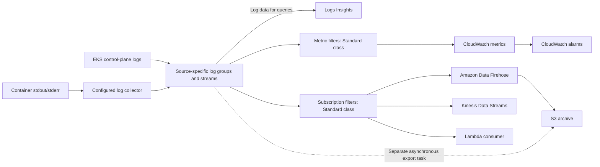

# CloudWatch Logs

> **最后更新**: September 13, 2026
> **已检查示例**: AWS provider 6.64.0；可选的 CloudWatch Observability Helm chart 6.6.0；手动部署的 AWS for Fluent Bit 3.4.15/Fluent Bit 5.0.9。仅进行了本地配置、SDK 和合成负载检查。未执行 AWS 资源创建、日志传输、Insights 查询或告警。

Amazon CloudWatch Logs 用于管理日志摄取、存储和分析。你仍需配置生产者、身份、网络、保留期、配额和下游消费者。EKS control-plane 日志、工作负载日志和 EKS Auto Mode 托管组件日志是不同的收集路径。

## 目录

1. [概述](#overview)
2. [EKS Control Plane 日志记录](#eks-control-plane-logging)
3. [Container Insights](#container-insights)
4. [FluentBit 集成](#fluentbit-integration)
5. [CloudWatch Logs Insights](#cloudwatch-logs-insights)
6. [订阅筛选器](#subscription-filters)
7. [成本优化](#cost-optimization)

## 概述

<span id="cloudwatch-logs-features"></span>

### 功能和日志类别

| 范围 | 检查内容 |
|---|---|
| 托管服务 | 无需运营搜索集群，但收集器和传输集成仍需要负责人 |
| 容量 | 事件大小、API、订阅和目标配额均适用；摄取并非无限制 |
| 安全性 | IAM、加密、数据保护和私有连接均有独立配置 |
| 时效性 | 传输和告警均为异步；必须考虑重试以及重复或缺失的传输 |
| Standard 类别 | 支持本章使用的指标筛选器和订阅 |
| Infrequent Access | 摄取价格更低且功能集不同；不支持订阅筛选器、指标筛选器或 EMF |
| Delivery 类别 | 用于传输至 S3/Firehose 的 Lambda 日志的独立选项；固定两天的 CloudWatch 保留期，且不支持 Logs Insights 查询 |

日志组的类别在创建后无法更改。Infrequent Access 当前支持的功能包括 S3 导出、Logs Insights 和数据保护，因此“它不支持其中任何功能”之类的旧有笼统说法并不正确。更改收集设计前，请检查当前的功能表。

<span id="terminology"></span>

### 核心概念



订阅筛选器**不会**将 S3 bucket ARN 作为其目标。通过 Firehose 持续传输至 S3 与异步 S3 导出任务是不同的路径。CloudWatch Logs 批次也无法通过 Firehose 的 OpenSearch 目标进行传输；请改用有文档说明的 CloudWatch-to-OpenSearch 集成。直接发送至 Firehose 的应用程序记录是不同的输入契约。

| 术语 | 含义 |
|---|---|
| 日志组 | 通用的保留期、访问和配置边界；例如 `/aws/eks/example-eks/cluster` |
| 日志流 | 组内的一系列日志事件 |
| 日志事件 | 时间戳和消息，受服务限制约束 |
| 保留期 | 受支持的离散保留期，或者在未设置保留期时永不过期 |

## EKS Control Plane 日志记录

### 日志类型

五种类型分别是 `api`、`audit`、`authenticator`、`controllerManager` 和 `scheduler`。它们分别涵盖 API server 诊断、审计事件、IAM 身份验证、controller manager 诊断和调度。Worker node 和应用程序日志是独立的。

默认禁用 Control Plane 日志记录。请根据诊断、安全和保留期要求选择类型；API 不要求采用早先表格中的“必需”选择。传输通常需要数分钟，并且尽力而为。启用日志记录不会恢复已轮换的历史日志。

<span id="enable-via-aws-cli"></span>

### 启用并观察更新

对于现有集群，请将以下内容保存为 `control-plane-logging.json`：

```json
{
  "clusterLogging": [
    {
      "types": [
        "api",
        "audit",
        "authenticator",
        "controllerManager",
        "scheduler"
      ],
      "enabled": true
    }
  ]
}
```

```bash
DOCS_CLUSTER=example-eks
DOCS_REGION=ap-northeast-2

aws eks describe-cluster --name "$DOCS_CLUSTER" --region "$DOCS_REGION" \
  --query 'cluster.{version:version,logging:logging}'

UPDATE_ID=$(aws eks update-cluster-config \
  --name "$DOCS_CLUSTER" --region "$DOCS_REGION" \
  --logging file://control-plane-logging.json --query update.id --output text)

aws eks describe-update --name "$DOCS_CLUSTER" --region "$DOCS_REGION" \
  --update-id "$UPDATE_ID" --query 'update.{status:status,errors:errors}'
```

更新必须达到 `Successful`；仅接受请求并不足够。日志记录更新可能要求每个集群 subnet 最多有五个可用 IP 地址。若要禁用某种类型，请明确审查该更改，而不是复制第二个会悄然关闭现有日志的示例。

<span id="configure-with-terraform"></span>

### Terraform 所有权和保留期

对于由 Terraform 管理的集群，请在**现有集群资源的所属配置**中更改 `enabled_cluster_log_types`。不要仅为启用日志而再创建一个 `aws_eks_cluster` 资源，也不要复制已废弃的 Kubernetes 1.29 创建示例。

以下独立文件管理日志组和手动收集器的策略：

```hcl
terraform {
  required_providers {
    aws = {
      source  = "hashicorp/aws"
      version = "6.64.0"
    }
  }
}

variable "region" {
  type    = string
  default = "ap-northeast-2"
}

variable "account_id" {
  type = string
  validation {
    condition     = can(regex("^[0-9]{12}$", var.account_id))
    error_message = "Use the owning account ID."
  }
}

variable "cluster_name" {
  type    = string
  default = "example-eks"
}

provider "aws" {
  region = var.region
}

resource "aws_cloudwatch_log_group" "application" {
  name              = "/aws/containerinsights/${var.cluster_name}/application"
  log_group_class   = "STANDARD"
  retention_in_days = 30

  lifecycle {
    prevent_destroy = true
  }
}

resource "aws_cloudwatch_log_group" "control_plane" {
  name              = "/aws/eks/${var.cluster_name}/cluster"
  log_group_class   = "STANDARD"
  retention_in_days = 30

  lifecycle {
    prevent_destroy = true
  }
}

resource "aws_iam_policy" "collector" {
  name_prefix = "fluent-bit-cloudwatch-"
  policy = jsonencode({
    Version = "2012-10-17"
    Statement = [{
      Effect   = "Allow"
      Action   = ["logs:CreateLogStream", "logs:PutLogEvents"]
      Resource = "${aws_cloudwatch_log_group.application.arn}:*"
    }]
  })
}

output "collector_policy_arn" {
  value = aws_iam_policy.collector.arn
}
```

如果组已存在，请在应用前重用其所有者，或将其导入预期状态。例如，Control Plane 组使用导入 ID `/aws/eks/example-eks/cluster`。不要将相同的组再次声明为“audit”组：所有五种 Control Plane 类型共享此组及其保留期。

30 天的值只是示例，并非法律要求。`prevent_destroy` 会阻止 Terraform 销毁，但不会阻止缩短保留期或在 Terraform 外部删除。CloudWatch 会加密存储的日志数据；客户托管 KMS key 需要其自身的 key policy 和运维规划。

### 日志组结构

```text
/aws/eks/example-eks/cluster
  kube-apiserver-...          API server
  kube-apiserver-audit-...    Audit
  authenticator-...          IAM authentication
  kube-controller-manager-... Controller manager
  kube-scheduler-...         Scheduler
```

日志流后缀会轮换。旧图中的示例 `/aws/eks/cluster/logs` 并非实际的 Control Plane 组命名约定。

## Container Insights

<span id="container-insights-overview"></span>
<span id="installation-methods"></span>
<span id="cloudwatch-agent-fluentbit-recommended"></span>
<span id="install-via-helm-chart"></span>
<span id="irsa-setup"></span>

### 安装选项

使用当前的 **Amazon CloudWatch Observability EKS add-on** 或其 **amazon-cloudwatch-observability** Helm chart。此前的 ADOT exporter chart 和未经替换的 quickstart URL 并非等效安装方式。

对于 add-on，请发现与实际集群兼容的版本，检查所选配置 schema，并配置有文档说明的 IAM association。chart 版本不是 EKS add-on 版本字符串。

```bash
K8S_VERSION=$(aws eks describe-cluster --name "$DOCS_CLUSTER" \
  --region "$DOCS_REGION" --query cluster.version --output text)
aws eks describe-addon-versions \
  --addon-name amazon-cloudwatch-observability \
  --kubernetes-version "$K8S_VERSION" --region "$DOCS_REGION"
```

可选 Helm 示例使用以下 `cloudwatch-values.yaml`。它选择传统的 Container Insights 路径和容器日志；此处禁用了 Application Signals 和独立的 OTel Container Insights pipeline。

```yaml
clusterName: example-eks
region: ap-northeast-2
containerInsights:
  enabled: true
containerLogs:
  enabled: true
applicationSignals:
  enabled: false
otelContainerInsights:
  enabled: false
  logs:
    enabled: false
```

```bash
helm repo add aws-observability https://aws-observability.github.io/helm-charts
helm repo update aws-observability
helm upgrade --install cloudwatch-observability \
  aws-observability/amazon-cloudwatch-observability \
  --version 6.6.0 --namespace amazon-cloudwatch --create-namespace \
  --values cloudwatch-values.yaml
```

请在**安装前**设置 IAM 权限。在此 chart 中，Fluent Bit DaemonSet 使用 `cloudwatch-agent` ServiceAccount；其名称和 namespace 必须与所选 Pod Identity association 相匹配。请遵循官方的 association/role-trust 要求。为名称不同的 ServiceAccount 创建的 IRSA role 不会授权手动创建的 `fluent-bit` Pod。不要在 EKS 托管的 add-on 之上安装此 chart，也不要对相同日志运行重复的收集器。

<span id="collected-logs"></span>

### 已收集的日志和平台

| 典型组后缀 | 内容和限制 |
|---|---|
| `application` | `/aws/containerinsights/CLUSTER/application` 下的容器 stdout/stderr |
| `dataplane` | 配置的 kubelet/runtime/VPC CNI/kube-proxy 源；实际组件因平台而异 |
| `host` | 配置的 Linux 文件/journal 或 Windows 事件日志；并非每个 OS 都有 `/var/log/messages`、`/var/log/secure` 或 `/var/log/dmesg` |
| `performance` | 性能事件，通常为 EMF；不能与应用程序日志消息互换 |

受支持的 add-on/chart 具有 Linux 和 Windows 路径，但 EKS Windows 不支持 Application Signals。Fargate 使用其平台日志路由器，而非此手动 DaemonSet。请分别验证 Hybrid Nodes 和 Auto Mode；不要假定传统 EC2 host 路径在所有环境中都存在。

EKS Auto Mode 的 AWS 托管 Karpenter、EBS CSI、load-balancer-controller 和 IPAM 日志使用独立的 **vended log delivery** 设置。其日志类型为 `AUTO_MODE_COMPUTE_LOGS`、`AUTO_MODE_BLOCK_STORAGE_LOGS`、`AUTO_MODE_LOAD_BALANCING_LOGS` 和 `AUTO_MODE_IPAM_LOGS`。有文档说明的 `PutDeliverySource` → `PutDeliveryDestination` → `CreateDelivery` 流程可将目标设为日志组、S3 或 Firehose。这与 `PutSubscriptionFilter` 以及启用五种 Control Plane 日志类型不同。

## FluentBit 集成

<span id="fluentbit-configmap"></span>
<span id="fluentbit-daemonset"></span>

### 手动应用程序日志收集器

这是适用于符合条件的 Linux EC2 node 的**替代性仅应用程序日志配置**。它不会安装完整的 Container Insights 指标 pipeline，也不保证通用的 host/dataplane 收集。

请先创建或重用 application 组。上面的收集器策略允许向该组创建日志流和写入事件；它刻意不创建组或更改保留期。因此，手动配置不需要 `cloudwatch:PutMetricData`、`s3:PutObject` 或宽泛的 `logs:*` 权限。

准备一个已批准的 IRSA role，其 OIDC trust 与 `system:serviceaccount:logging:fluent-bit-cloudwatch` 及受众 `sts.amazonaws.com` 匹配，并附加生成的策略。`eksctl --role-only` 工作流可以创建该 role，而 manifest 拥有 ServiceAccount。请一致地替换 role ARN、集群名称和 Region。

```yaml
apiVersion: v1
kind: Namespace
metadata:
  name: logging
---
apiVersion: v1
kind: ServiceAccount
metadata:
  name: fluent-bit-cloudwatch
  namespace: logging
  annotations:
    eks.amazonaws.com/role-arn: arn:aws:iam::123456789012:role/FluentBitCloudWatchLogsRole
---
apiVersion: rbac.authorization.k8s.io/v1
kind: ClusterRole
metadata:
  name: fluent-bit-cloudwatch-metadata
rules:
- apiGroups:
  - ''
  resources:
  - namespaces
  - pods
  verbs:
  - get
  - list
  - watch
---
apiVersion: rbac.authorization.k8s.io/v1
kind: ClusterRoleBinding
metadata:
  name: fluent-bit-cloudwatch-metadata
roleRef:
  apiGroup: rbac.authorization.k8s.io
  kind: ClusterRole
  name: fluent-bit-cloudwatch-metadata
subjects:
- kind: ServiceAccount
  name: fluent-bit-cloudwatch
  namespace: logging
---
apiVersion: v1
kind: ConfigMap
metadata:
  name: fluent-bit-cloudwatch-config
  namespace: logging
data:
  fluent-bit.conf: |
    [SERVICE]
        Flush         5
        Grace         30
        Log_Level     info
        HTTP_Server   Off
        storage.path  /buffers/storage

    [INPUT]
        Name              tail
        Tag               application.*
        Path              /var/log/containers/*.log
        Exclude_Path      /var/log/containers/fluent-bit-cloudwatch-*_logging_fluent-bit-*.log
        multiline.parser  docker, cri
        DB                /buffers/tail.db
        Mem_Buf_Limit     50MB
        Skip_Long_Lines   On
        Read_from_Head    Off
        storage.type      filesystem

    [FILTER]
        Name                kubernetes
        Match               application.*
        Kube_Tag_Prefix     application.var.log.containers.
        Use_Kubelet         Off
        Merge_Log           On
        Merge_Log_Key       log_processed
        Keep_Log            On
        Labels              Off
        Annotations         Off
        K8S-Logging.Parser  Off
        K8S-Logging.Exclude Off

    [OUTPUT]
        Name                     cloudwatch_logs
        Match                    application.*
        region                   ap-northeast-2
        log_group_name           /aws/containerinsights/example-eks/application
        log_stream_prefix        ${HOST_NAME}-
        auto_create_group        false
        Retry_Limit              5
        storage.total_limit_size 1G
---
apiVersion: apps/v1
kind: DaemonSet
metadata:
  name: fluent-bit-cloudwatch
  namespace: logging
spec:
  selector:
    matchLabels:
      app: fluent-bit-cloudwatch
  template:
    metadata:
      labels:
        app: fluent-bit-cloudwatch
    spec:
      serviceAccountName: fluent-bit-cloudwatch
      nodeSelector:
        kubernetes.io/os: linux
      tolerations:
      - operator: Exists
        effect: NoSchedule
      containers:
      - name: fluent-bit
        image: public.ecr.aws/aws-observability/aws-for-fluent-bit:3.4.15@sha256:88e1b56cedb230486afeca6eeb26c5f6bd59c48879d0054d1674d5a58838c607
        args:
        - -c
        - /fluent-bit/custom/fluent-bit.conf
        securityContext:
          runAsUser: 0
          allowPrivilegeEscalation: false
          readOnlyRootFilesystem: true
          capabilities:
            drop:
            - ALL
          seccompProfile:
            type: RuntimeDefault
        resources:
          requests:
            cpu: 100m
            memory: 128Mi
          limits:
            memory: 512Mi
        volumeMounts:
        - name: logs
          mountPath: /var/log
          readOnly: true
        - name: buffers
          mountPath: /buffers
        - name: config
          mountPath: /fluent-bit/custom
          readOnly: true
        - name: tmp
          mountPath: /tmp
        command:
        - /fluent-bit/bin/fluent-bit
        env:
        - name: HOST_NAME
          valueFrom:
            fieldRef:
              fieldPath: spec.nodeName
      volumes:
      - name: logs
        hostPath:
          path: /var/log
          type: Directory
      - name: buffers
        hostPath:
          path: /var/lib/fluent-bit-cloudwatch
          type: DirectoryOrCreate
      - name: config
        configMap:
          name: fluent-bit-cloudwatch-config
      - name: tmp
        emptyDir: {}
      terminationGracePeriodSeconds: 45
```

原生 plugin 是 `cloudwatch_logs`；较旧的 Go plugin 名为 `cloudwatch`。该 image 的默认 command 是 entrypoint script，因此手动 manifest 使用其配置显式启动原生 Fluent Bit binary。

Tail DB 和 filesystem buffer 可写，且与只读日志挂载分离。Grace 为 30 秒，Pod termination grace 为 45 秒，但这并不保证交付所有缓冲数据。node 丢失、磁盘已满、长行、有限重试和重启偏移量仍可能导致日志丢失。`Read_from_Head Off` 会影响此前未见过的文件；持久偏移量仍然很重要。

该配置使用 API server 元数据查找，而非 host-network kubelet 访问。应用程序 annotation 无法更改解析或排除日志。不要在自定义收集器中设置保留的 `extra_user_agent: container-insights` 值来暗示其为托管安装。

### 记录契约和 Host 源

发送到 CloudWatch 的一个示例扩充事件如下：

```json
{"log":"{\"level\":\"error\",\"message\":\"upstream request failed\",\"error_type\":\"upstream_timeout\",\"http\":{\"response_time_ms\":1250,\"status_code\":503}}","stream":"stderr","kubernetes":{"namespace_name":"production","pod_name":"api-example","container_name":"api"},"log_processed":{"level":"error","message":"upstream request failed","error_type":"upstream_timeout","http":{"response_time_ms":1250,"status_code":503}}}
```

应用程序字段位于 `log_processed` 下，而受信任的 Kubernetes 元数据位于 `kubernetes` 下。原始 `log` 字符串重复了应用程序数据；请在收集前脱敏禁止字段。下方的查询、订阅和指标筛选器示例使用此精确 JSON envelope 以及小写的 `level: error`。

如果需要收集 Linux journal，请验证持久 journal 是否位于 `/var/log/journal`，或易失 journal 是否位于 `/run/log/journal`。请配置 `systemd` input、适当的 unit filter、只读挂载、独立的可写 DB、输出组和 IAM 权限。不要盲目挂载 Docker 旧的 `/var/lib/docker/containers` 路径，也不要在 containerd/Bottlerocket/AL2023 node 上要求不存在的文本文件。这些特定于平台的 host 配置不会由手动配置部署。

## CloudWatch Logs Insights

这些示例使用 **Logs Insights QL**，而非 SQL。请选择预期日志组和有边界的时间范围。本地审查检查了已发布的语法/契约；未调用托管查询服务。

### 基本查询语法

```text
fields @timestamp, @message
| filter @message like /(?i)error/
| sort @timestamp desc
| limit 100
```

不区分大小写的 regex 使用 `/(?i)error/`，而非 JavaScript 的 `/error/i` 后缀。文本匹配可能匹配并非应用程序结构化错误级别的词语。

对于收集器的 JSON envelope：

```text
fields jsonParse(@message) as record
| filter record.log_processed.level = "error"
| fields @timestamp, record.log_processed.message as message
| sort @timestamp desc
| limit 100
```

对于包含 `user_id=12345` 的实际文本字段：

```text
fields @timestamp, @message
| parse @message /user_id=(?<user_id>\d+)/
| filter user_id = "12345"
| limit 100
```

不要依赖假定任意 JSON key 顺序和空白的 glob。`jsonParse` 和显式嵌套字段可使预期记录结构清晰明确。

### EKS 日志查询示例

API server 诊断排除重叠的 audit 日志流前缀：

```text
fields @timestamp, @logStream, @message
| filter @logStream like /^kube-apiserver-/
| filter @logStream not like /^kube-apiserver-audit-/
| filter @message like /(?i)error/
| sort @timestamp desc
| limit 50
```

特定 Kubernetes username 的 audit 活动：

```text
fields jsonParse(@message) as audit
| filter @logStream like /^kube-apiserver-audit-/
| filter audit.user.username = "example-user"
| fields @timestamp, audit.verb as verb, audit.objectRef as objectRef
| sort @timestamp desc
| limit 100
```

Authenticator 诊断：

```text
fields @timestamp, @message
| filter @logStream like /^authenticator-/
| filter @message like /(?i)(AccessDenied|Forbidden|unauthorized)/
| sort @timestamp desc
| limit 100
```

Pod 创建/删除 audit 事件：

```text
fields jsonParse(@message) as audit
| filter @logStream like /^kube-apiserver-audit-/
| filter audit.verb in ["create", "delete"]
| filter audit.objectRef.resource = "pods"
| fields @timestamp, audit.verb as verb, audit.objectRef.name as pod
| sort @timestamp desc
| limit 100
```

这些是诊断性搜索，并非 audit 捕获每一个操作或文本匹配确定根本原因的证明。

### 应用程序日志查询

按 namespace 统计的错误：

```text
fields jsonParse(@message) as record
| filter record.log_processed.level = "error"
| stats count(*) as error_count by record.kubernetes.namespace_name as namespace
| sort error_count desc
```

使用声明的数值毫秒字段统计的慢响应：

```text
fields jsonParse(@message) as record
| filter record.kubernetes.container_name = "api"
| filter record.log_processed.http.response_time_ms > 1000
| fields @timestamp, record.log_processed.http.response_time_ms as response_time_ms
| sort response_time_ms desc
| limit 100
```

每小时事件计数：

```text
stats count(*) as log_count by bin(1h) as bucket
| sort bucket asc
```

在 `stats` 之后，请对定义的 bucket alias 排序；原始的每事件 `@timestamp` 不再是分组输出。

最多的错误类别：

```text
fields jsonParse(@message) as record
| filter record.log_processed.level = "error"
| stats count(*) as error_count by record.log_processed.error_type as error_type
| sort error_count desc
| limit 10
```

有界类别通常比按每个唯一完整消息分组更易于理解。不要将请求 ID 或任意消息变成无界指标维度。

### 高级查询

```text
fields jsonParse(@message) as record
| filter ispresent(record.log_processed.http.response_time_ms)
| stats pct(record.log_processed.http.response_time_ms, 50) as p50_ms,
        pct(record.log_processed.http.response_time_ms, 90) as p90_ms,
        pct(record.log_processed.http.response_time_ms, 99) as p99_ms
  by bin(5m) as bucket
| sort bucket asc
```

QL 聚合函数是 `pct`，不是 `percentile`。生产者必须输出数值毫秒；旧 nginx 示例的 wildcard 计数不匹配且虚构了字段位置。

```text
fields @timestamp, @message, @logStream
| filter @message like /Back-off restarting failed container/
| stats count(*) as backoff_log_events by @logStream
| sort backoff_log_events desc
```

这会统计匹配的**日志事件**，而非容器重启次数。kubelet 事件/消息可能缺失、重复或聚合。当你需要实际重启计数时，请使用适当的 Kubernetes 重启指标。

`SOURCE` 在 CLI/API 查询中受支持，而不在 console query editor 中：

```text
SOURCE logGroups(accountIdentifier:['111122223333'], namePrefix:['/aws/containerinsights/prod-', '/aws/containerinsights/stage-'])
| fields @timestamp, @message, @logStream
| filter @message like /(?i)error/
| sort @timestamp desc
| limit 100
```

`accountIdentifier` 为单数。跨账户查询需要已批准的 monitoring/source-account 设置和权限；提及第二个账户或组并不会创建该访问权限。省略账户/prefix 选择可能会大幅扩大查询范围。

## 订阅筛选器

订阅筛选器会异步转发新的匹配事件。传输至少一次；可能发生重复。可重试的目标失败最多可重试 24 小时；不可重试错误和持续失败可能丢失传输。请监控配额、`DeliveryErrors` 和 `DeliveryThrottling`。订阅不会回填所有历史日志。

这些示例中的直接 Lambda、Kinesis 和 Firehose 目标属于与日志组相同的账户。跨账户传输使用受支持的 logical destination 及其 destination policy；任意跨账户 Lambda ARN 并不是替代方案。

<span id="export-to-s3"></span>

### 通过 Firehose 归档至 S3

此可选文件使用上面的组、现有的私有 S3 bucket 和已批准的 Firehose delivery role：

```hcl
variable "firehose_delivery_role_arn" {
  type = string
}

variable "archive_bucket_arn" {
  type = string
}

resource "aws_cloudwatch_log_group" "firehose" {
  name              = "/aws/kinesisfirehose/cloudwatch-archive"
  retention_in_days = 30
}

resource "aws_cloudwatch_log_stream" "firehose" {
  name           = "S3Delivery"
  log_group_name = aws_cloudwatch_log_group.firehose.name
}

resource "aws_kinesis_firehose_delivery_stream" "archive" {
  name        = "cloudwatch-archive"
  destination = "extended_s3"

  extended_s3_configuration {
    role_arn            = var.firehose_delivery_role_arn
    bucket_arn          = var.archive_bucket_arn
    prefix              = "cloudwatch/year=!{timestamp:yyyy}/month=!{timestamp:MM}/day=!{timestamp:dd}/"
    error_output_prefix = "errors/!{firehose:error-output-type}/year=!{timestamp:yyyy}/"
    buffering_size      = 64
    buffering_interval  = 300
    compression_format  = "UNCOMPRESSED"

    cloudwatch_logging_options {
      enabled         = true
      log_group_name  = aws_cloudwatch_log_group.firehose.name
      log_stream_name = aws_cloudwatch_log_stream.firehose.name
    }
  }
}

resource "aws_iam_role" "logs_to_firehose" {
  name_prefix = "cloudwatch-to-firehose-"
  assume_role_policy = jsonencode({
    Version = "2012-10-17"
    Statement = [{
      Effect    = "Allow"
      Principal = { Service = "logs.amazonaws.com" }
      Action    = "sts:AssumeRole"
      Condition = {
        StringEquals = { "aws:SourceAccount" = var.account_id }
        ArnLike      = { "aws:SourceArn" = "arn:aws:logs:${var.region}:${var.account_id}:*" }
      }
    }]
  })
}

resource "aws_iam_role_policy" "logs_to_firehose" {
  role = aws_iam_role.logs_to_firehose.id
  policy = jsonencode({
    Version = "2012-10-17"
    Statement = [{
      Effect   = "Allow"
      Action   = ["firehose:PutRecord", "firehose:PutRecordBatch"]
      Resource = aws_kinesis_firehose_delivery_stream.archive.arn
    }]
  })
}

resource "aws_cloudwatch_log_subscription_filter" "archive" {
  name            = "application-archive"
  log_group_name  = aws_cloudwatch_log_group.application.name
  filter_pattern  = ""
  destination_arn = aws_kinesis_firehose_delivery_stream.archive.arn
  role_arn        = aws_iam_role.logs_to_firehose.arn

  depends_on = [aws_iam_role_policy.logs_to_firehose]
}
```

该 delivery role 需要其经过审查的 Firehose trust、bucket/prefix 访问权限、可选 KMS 权限和目标日志权限。CloudWatch-to-Firehose role 是独立的，部署者需要范围限定的 `iam:PassRole`。避免将 delivery-error 日志订阅回其自身 pipeline。

CloudWatch 订阅记录已经过 gzip 压缩。这里的 `UNCOMPRESSED` 禁用的是**额外的 Firehose 压缩**；它不会将传入负载转换为纯文本，也不会移除 CloudWatch envelope。消费者必须处理实际归档记录格式。

对于解压后的输出，请有意配置 Firehose 有文档说明的解压功能。可选消息提取会移除 `owner`、`logGroup`、`logStream` 和其他 envelope 元数据。不要将 vended-log input 与为 CloudWatch-subscription 解压配置的 stream 混用，也不要假设这些设置会使不受支持的 CloudWatch→Firehose→OpenSearch 路径有效。

### 使用 Lambda 处理

此示例处理上面的结构化 envelope，忽略控制消息，并发送错误**摘要**而非原始日志文本。请将其保存为 `log_processor.py`：

```python
import base64
import gzip
import hashlib
import io
import json
import os

import boto3

# Example processing limit, not an AWS service quota.
MAX_UNCOMPRESSED_BYTES = 8 * 1024 * 1024


def summarize(event):
    compressed = base64.b64decode(event["awslogs"]["data"], validate=True)
    with gzip.GzipFile(fileobj=io.BytesIO(compressed)) as stream:
        payload = stream.read(MAX_UNCOMPRESSED_BYTES + 1)
    if len(payload) > MAX_UNCOMPRESSED_BYTES:
        raise ValueError("Batch exceeds this example's processing limit")
    batch = json.loads(payload)
    if batch.get("messageType") == "CONTROL_MESSAGE":
        return None
    if batch.get("messageType") != "DATA_MESSAGE":
        raise ValueError("Unsupported subscription message type")

    errors = []
    unparsed = 0
    for item in batch["logEvents"]:
        try:
            record = json.loads(item["message"])
            application = record["log_processed"]
            if not isinstance(application, dict):
                raise ValueError("Expected an application object")
        except (ValueError, KeyError, TypeError):
            unparsed += 1
            continue
        if application.get("level") == "error":
            errors.append(item)
    if not errors:
        return None

    # Raw messages are intentionally excluded from the notification.
    event_keys = [
        hashlib.sha256(
            json.dumps([batch["owner"], batch["logGroup"], batch["logStream"], item["id"]],
                       ensure_ascii=True).encode("utf-8")
        ).hexdigest()
        for item in errors[:20]
    ]
    return {
        "errorCount": len(errors),
        "unparsedRecords": unparsed,
        "sampleEventKeys": event_keys,
    }


def lambda_handler(event, context):
    summary = summarize(event)
    if summary is None:
        return {"notified": False}
    topic_arn = os.environ["ALERT_TOPIC_ARN"]  # Non-secret destination identifier.
    message = json.dumps(summary, ensure_ascii=True)
    if len(message.encode("utf-8")) > 262144:
        raise ValueError("SNS message is too large")
    boto3.client("sns").publish(
        TopicArn=topic_arn,
        Subject="CloudWatch Logs error batch",
        Message=message,
    )
    return {"notified": True, "errorCount": summary["errorCount"]}
```

`ALERT_TOPIC_ARN` 是已批准的同一 Region topic 的非秘密目标标识符。Lambda execution role 需要范围限定的 `sns:Publish` 及其自身日志权限，以及适用的 KMS 权限。其日志组不得以递归方式馈送相同订阅。

8MiB 处理限制是选定的示例边界，而非 AWS 配额。无效 envelope 会引发错误；预期应用程序 schema 之外的记录不会被视为结构化错误。请监控解析失败、配置失败处理，并在部署前测试重放。SNS 非 SMS 消息受**UTF-8 字节数**限制，而非 1,000 个字符的规则；固定 subject 也低于 subject 限制。

事件 key 有助于调查；它们**不是持久化去重机制**。重复调用可能发送重复通知。生产消费者需要明确的幂等性和失败目标决策。

<span id="create-alerts-with-metric-filters"></span>

### 指标筛选器和告警

以下可选文件连接已部署的、无别名 Lambda function ARN，并创建计数指标/告警。它使用与收集器和查询相同的 JSON 字段：

```hcl
variable "processor_function_arn" {
  type = string
}

variable "alerts_topic_arn" {
  type = string
}

resource "aws_lambda_permission" "cloudwatch" {
  statement_id   = "AllowOwnedCloudWatchLogGroup"
  action         = "lambda:InvokeFunction"
  function_name  = var.processor_function_arn
  principal      = "logs.${var.region}.amazonaws.com"
  source_arn     = "${aws_cloudwatch_log_group.application.arn}:*"
  source_account = var.account_id
}

resource "aws_cloudwatch_log_subscription_filter" "processor" {
  name            = "structured-errors"
  log_group_name  = aws_cloudwatch_log_group.application.name
  filter_pattern  = "{ $.log_processed.level = \"error\" }"
  destination_arn = var.processor_function_arn

  depends_on = [aws_lambda_permission.cloudwatch]
}

resource "aws_cloudwatch_log_metric_filter" "errors" {
  name           = "StructuredErrorCount"
  log_group_name = aws_cloudwatch_log_group.application.name
  pattern        = "{ $.log_processed.level = \"error\" }"

  metric_transformation {
    name          = "ErrorCount"
    namespace     = "Example/Logs"
    value         = "1"
    default_value = "0"
    unit          = "Count"
  }
}

resource "aws_cloudwatch_metric_alarm" "high_error_count" {
  alarm_name          = "ExampleHighErrorCount"
  comparison_operator = "GreaterThanThreshold"
  evaluation_periods  = 2
  datapoints_to_alarm = 2
  metric_name         = "ErrorCount"
  namespace           = "Example/Logs"
  period              = 300
  statistic           = "Sum"
  threshold           = 100
  treat_missing_data  = "missing"
  alarm_description   = "More than 100 matching error events in each of two 5-minute periods"
  alarm_actions       = [var.alerts_topic_arn]
}
```

该权限先于 Lambda 订阅，并按日志组 ARN 和源账户进行限制。SNS 告警目标也需要合适的 topic policy。function 部署、execution-role policy、topic 订阅和端到端通知是独立的前提条件。

告警是**错误计数**，而非错误率：两个五分钟周期中的每一个均有超过 100 个匹配事件。`default_value = 0` 在日志到达但没有任何匹配时适用；没有传入日志仍可能意味着缺失数据。`treat_missing_data = "missing"` 不会将沉默视为健康状态。指标筛选器不会回填历史事件，重复事件会影响计数。

<span id="_3-archive-to-s3"></span>

### 导出任务和 S3 生命周期

对于有界历史导出，请使用 CloudWatch 独立的 S3 export task API 及其 bucket/KMS 权限。导出可用性最多可能延迟 12 小时，顺序无法保证，并且该服务不建议将定期导出任务用于持续归档。

归档 lifecycle rule 属于 bucket 的单一配置所有者。请将经过审查的 prefix-scoped rule 合并到该配置中，而不是用第二个 Terraform resource 替换现有规则。选择 Standard-IA 或 Glacier tier 前，请考虑小对象转换行为、最短存储期限、检索成本和 Object Lock。

## 成本优化

### 成本结构

请检查当前区域/类别/层级的摄取、保留存储、查询扫描、vended delivery、转换和下游服务定价。Firehose、S3、KMS、Lambda、自定义指标和告警并非普遍免费。旧表并未证实其首尔费率或零成本“Logs to S3”路径。

以下是**假设性算术，而非当前区域定价**：

| 假设 | 月度计算 |
|---|---|
| 以假定 $0.50/GB 的价格每天摄取 100GB，持续 30 天 | 3,000 × $0.50 = $1,500 |
| 30 天稳定状态保留期，假定存储比例为 0.5，$0.03/GB-month | 平均 1,500GB × $0.03 = $45 |
| 以假定 $0.005/GB 的价格每天扫描 200GB，持续 30 天 | 6,000 × $0.005 = $30 |
| 仅在这些假设下的小计 | **$1,575** |

这不是第一个月的存储爬坡、压缩基准或完整账单。原始的 $1,576 总计混合了每日/月度查询值。请使用测得的平均保留字节数、扫描量、当前费率和所有其他收费类别。

<span id="cost-reduction-strategies"></span>
<span id="_1-log-filtering"></span>
<span id="_2-retention-period-optimization"></span>
<span id="_4-adjust-log-levels"></span>

### 筛选、保留期和日志级别

仅筛除诊断和安全要求允许你丢弃的记录。Fluent Bit classic 配置不是 YAML。对于此记录结构，namespace 筛选器使用诸如 `$kubernetes['namespace_name']` 的 record accessor，而非不存在的扁平字段 `kubernetes_namespace_name`。

避免宽泛的 substring filter，它们会仅因提及 health-check path 而丢弃有用错误。优先选择明确字段，例如已审查的事件类型，并验证必须保留以及必须丢弃的示例。

不同的保留期可适用于开发、生产和审计需求，但更改保留期可能删除数据。同一组中的所有 Control Plane 日志流共享该组策略。应用程序日志级别是一项应用程序契约：除非应用程序使用并实现它，否则将 `LOG_LEVEL: INFO` 放入 ConfigMap 不会起任何作用。临时提高详细程度需要访问控制、到期时间和容量预算。

### 成本监控

使用带有 `LogGroupName` dimension 和 `Sum` statistic 的 `AWS/Logs` 指标，例如 `IncomingBytes` 和 `IncomingLogEvents`。它们描述摄取，而非整个账单。`@billedDuration` 是 Lambda 字段，并非 CloudWatch Logs 的存储或摄取计费指标。

```bash
aws logs describe-log-groups --region "$DOCS_REGION" \
  --log-group-name-prefix /aws/containerinsights/example-eks/ \
  --query 'logGroups[].{name:logGroupName,retention:retentionInDays,class:logGroupClass,storedBytes:storedBytes}'

# Example complete month; End is exclusive.
aws ce get-dimension-values --region us-east-1 \
  --time-period Start=2026-08-01,End=2026-09-01 \
  --dimension SERVICE --search-string CloudWatch
```

请在 Cost Explorer filter 中使用返回的 billing-service 值，并在估算完整 pipeline 时包含相关服务。`storedBytes` 是日志组属性，而不是名为该名称且得到保证的 `AWS/Logs` 指标。查询所有日志以估算其成本本身可能产生查询费用。

## 验证和参考资料

审计检查了本地 Terraform/Helm 配置、Kubernetes schema、SDK payload type、合成 Lambda event、双语示例、测验答案和 Markdown 渲染。这些检查并不能证明实时 IAM、收集器传输、托管 QL 执行、Firehose 归档、告警传输或实际成本。

- [EKS control-plane 日志](https://docs.aws.amazon.com/eks/latest/userguide/control-plane-logs.html)
- [CloudWatch Observability add-on 和 Helm 安装](https://docs.aws.amazon.com/AmazonCloudWatch/latest/monitoring/install-CloudWatch-Observability-EKS-addon.html)
- [Auto Mode 托管组件日志传输](https://docs.aws.amazon.com/eks/latest/userguide/auto-managed-component-logs.html)
- [日志类别](https://docs.aws.amazon.com/AmazonCloudWatch/latest/logs/CloudWatch_Logs_Log_Classes.html) 和 [配额](https://docs.aws.amazon.com/AmazonCloudWatch/latest/logs/cloudwatch_limits_cwl.html)
- [Fluent Bit 原生 CloudWatch 输出](https://raw.githubusercontent.com/fluent/fluent-bit-docs/master/pipeline/outputs/cloudwatch.md)
- [QL filter](https://docs.aws.amazon.com/AmazonCloudWatch/latest/logs/CWL_QuerySyntax-Filter.html)、[stats](https://docs.aws.amazon.com/AmazonCloudWatch/latest/logs/CWL_QuerySyntax-Stats.html)、[functions](https://docs.aws.amazon.com/AmazonCloudWatch/latest/logs/CWL_QuerySyntax-operations-functions.html) 和 [SOURCE](https://docs.aws.amazon.com/AmazonCloudWatch/latest/logs/CWL_QuerySyntax-Source.html)
- [订阅示例](https://docs.aws.amazon.com/AmazonCloudWatch/latest/logs/SubscriptionFilters.html) 和 [destination API](https://docs.aws.amazon.com/AmazonCloudWatchLogs/latest/APIReference/API_PutSubscriptionFilter.html)
- [CloudWatch Logs 到 Firehose 的限制](https://docs.aws.amazon.com/firehose/latest/dev/writing-with-cloudwatch-logs.html)、[解压](https://docs.aws.amazon.com/firehose/latest/dev/writing-with-cloudwatch-logs-decompression.html) 和 [消息提取](https://docs.aws.amazon.com/firehose/latest/dev/Message_extraction.html)
- [指标筛选器](https://docs.aws.amazon.com/AmazonCloudWatch/latest/logs/MonitoringLogData.html)、[S3 导出任务](https://docs.aws.amazon.com/AmazonCloudWatch/latest/logs/S3Export.html) 和 [CloudWatch Logs 服务指标](https://docs.aws.amazon.com/AmazonCloudWatch/latest/logs/CloudWatch-Logs-Monitoring-CloudWatch-Metrics.html)
- [SNS Publish API](https://docs.aws.amazon.com/sns/latest/api/API_Publish.html) 和 [当前 CloudWatch 定价](https://aws.amazon.com/cloudwatch/pricing/)

## 测验

请通过 [CloudWatch Logs 测验](../../quizzes/observability/logging/03-cloudwatch-logs-quiz.md)检查这些差异。
