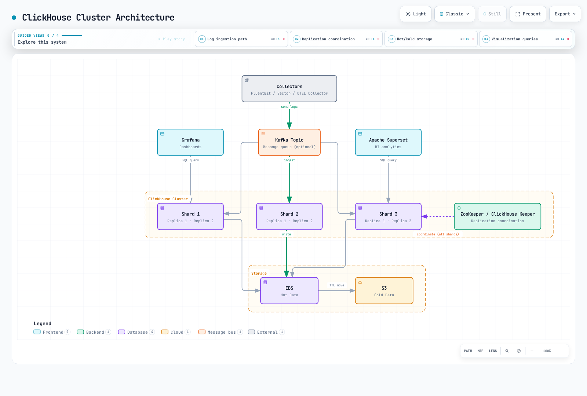

# ClickHouse

> **最后更新**: September 13, 2026

ClickHouse 是一个列式分析数据库。它适合需要 SQL 筛选、聚合和连接的日志工作负载，前提是摄取模式、保留策略和运维模型适合该工作负载。

## 目录

1. [概述](#overview)
2. [架构](#architecture)
3. [Kubernetes 部署](#kubernetes-deployment)
4. [日志摄取管道](#log-ingestion-pipeline)
5. [SQL 查询](#sql-queries)
6. [Grafana 集成](#grafana-integration)
7. [HyperDX (English)](https://www.atomai.click/kubernetes-docs/en/observability/logging/04-clickhouse#hyperdx-clickhouse-native-viewer)
8. [性能优化](#performance-optimization)
9. [S3 归档 (English)](https://www.atomai.click/kubernetes-docs/en/observability/logging/04-clickhouse#s3-archiving-and-long-term-retention)

<span id="overview"></span>

## 概述

### ClickHouse 功能

| 功能 | 实际影响 |
|---|---|
| 列式存储 | 读取选定列，而不是每条记录的每个字段 |
| 压缩和编解码器 | 重复值和适当的排序可以减少存储；请测量自己的数据 |
| SQL 分析 | 使用 ClickHouse SQL 函数、聚合和连接；它并非每种 SQL 方言的直接替代实现 |
| 分片 | 在服务器之间分配行；选择可避免热点分片的键 |
| 副本 | ReplicatedMergeTree 通过 Keeper/ZooKeeper 协调副本 |
| 批量摄取 | 控制插入频率和 part 创建，而不是假定固定的每秒行数 |

### 为什么选择 ClickHouse 用于日志分析

当日志具有结构化特征且重复分析查询占主导时，可评估 ClickHouse。对有代表性的筛选器、文本搜索、保留期、并发读取器和摄取突发进行基准测试。超过 10:1 的压缩率、在数秒内扫描数十亿行以及特定成本节省均是依赖工作负载的结果，而非对此配置的保证。

本指南以 **ClickHouse 26.3.33.24 LTS**、**Altinity Operator 0.27.3**、**Vector 0.58.0** 和 **Grafana ClickHouse datasource 4.21.2** 作为明确的审查基准。发布版本并不能证明任意 Kubernetes/EKS 版本、存储类或其组合与生产环境兼容。请分别验证集群和升级路径。

### 与其他解决方案的比较

| 系统 | 查询和存储模型 | 评估项 |
|---|---|---|
| ClickHouse | 基于列式表的 SQL | 排序键、投影/索引、聚合以及插入/合并行为 |
| OpenSearch / Elasticsearch | 文档搜索和分析 | 文本分析、映射、索引成本和搜索要求 |
| Loki | 基于标签索引的日志流/chunk 上的 LogQL | 标签基数、查询扫描、保留策略和运维模式 |

避免对压缩率、查询速度或运维复杂性进行通用排名。每个系统都有多种部署模式和索引/查询选项。请比较相同的数据、查询、副本和保留期。

<span id="architecture"></span>

## 架构

### ClickHouse 集群架构



[查看交互式图表](https://www.atomai.click/kubernetes-docs/archmaps/en-observability-logging-04-clickhouse-0.html)

该图概述的是拓扑，而不是经过测试的容量规划。每个 ClickHouse 副本都需要其**自己的数据卷**；EBS 图标并不意味着六个副本共享一个可写的 EBS 文件系统。Keeper/ZooKeeper 协调副本和分布式 DDL。ClickHouse 查询发起方和 `Distributed` 引擎执行分布式查询；Keeper 不是查询路由器。

### 数据流


[查看交互式图表](https://www.atomai.click/kubernetes-docs/archmaps/en-observability-logging-04-clickhouse-1.html)

箭头表示数据移动。在 Kafka-engine 变体中，ClickHouse 消费者轮询 Kafka；该图并不意味着 Kafka 会推送插入，或保证恰好一次交付。S3 冷表 part 和独立 Parquet 归档是不同的机制。

<span id="kubernetes-deployment"></span>

## Kubernetes 部署

### 安装 ClickHouse Operator

请使用带版本的官方 chart，而不是应用不断变化的 `master` bundle：

```bash
helm upgrade --install clickhouse-operator \
  https://github.com/Altinity/clickhouse-operator/releases/download/release-0.27.3/altinity-clickhouse-operator-0.27.3.tgz \
  --namespace clickhouse-operator --create-namespace

kubectl -n clickhouse-operator get deployments,pods
kubectl get crd clickhouseinstallations.clickhouse.altinity.com \
  clickhousekeeperinstallations.clickhouse-keeper.altinity.com
```

在应用前检查渲染出的 RBAC、受监视的 namespace 和 CRD 安装/升级行为。本地审查渲染了此 chart 并检查了其官方发布校验和；它并未安装 Operator，也未验证针对集群的协调。

### ClickHouse 集群定义

以下是一个**具有必需现有依赖项的拓扑示例**，而不是完整的安全安装：

- 必须存在 namespace `clickhouse`、ServiceAccount `clickhouse-server` 以及适当的由 CSI 支持的 `gp3` StorageClass。存储类名称是本地选择；EKS Auto Mode 存储和传统 EBS CSI 都需要相应的 provisioner 和拓扑设置。
- 名为 `log-security` 的站点自有 ClickHouseInstallationTemplate 必须配置挂载的 Secret 文件、账户、TLS、探针和经身份验证的内部通信。确保其设置/挂载也适用于下面的 `logs-server` Pod 模板。
- 健康的 `logs-keeper` ClickHouseKeeperInstallation 必须已经提供预期的 TLS endpoint 和 quorum。
- 在 namespace `clickhouse` 中提供名为 `logs-clickhouse` 的内部 TLS Service，暴露 HTTPS 8443。其证书必须与客户端 DNS 名称匹配。确认实际的 Operator 生成的 selector 和 endpoint；单独的 CHI 名称不会创建这个特定的 Service 名称。
- 根据测量到的要求分配故障域、中断预算和资源。3×2 布局以及下方每副本 100Gi/8Gi 限制仅为说明，并非吞吐量或可用性承诺。

```yaml
apiVersion: clickhouse.altinity.com/v1
kind: ClickHouseInstallation
metadata:
  name: logs-demo
  namespace: clickhouse
spec:
  # Required site-owned template: users, TLS, probes and internal authentication.
  useTemplates:
    - name: log-security
  defaults:
    templates:
      podTemplate: logs-server
      dataVolumeClaimTemplate: logs-data
  configuration:
    zookeeper:
      keeper:
        name: logs-keeper
        serviceType: replicas
    clusters:
      - name: logscluster
        secure: "yes"
        insecure: "no"
        layout:
          shardsCount: 3
          replicasCount: 2
  templates:
    podTemplates:
      - name: logs-server
        spec:
          serviceAccountName: clickhouse-server
          containers:
            - name: clickhouse
              image: clickhouse/clickhouse-server:26.3.33.24
              resources:
                requests:
                  cpu: "2"
                  memory: 4Gi
                limits:
                  memory: 8Gi
    volumeClaimTemplates:
      - name: logs-data
        spec:
          accessModes: [ReadWriteOnce]
          storageClassName: gp3
          resources:
            requests:
              storage: 100Gi
```

使用彼此独立的 `log_writer`、`log_reader` 和管理身份。从 Secret 挂载凭证/配置文件；不要将密码放在 ConfigMap、源代码、shell 命令参数或广泛的环境转储中。将账户网络和 NetworkPolicy 限制为实际的采集器/查询/副本路径。不要复制宽松的 `::/0` 用户、过期的示例证书或证书验证绕过措施。

仅暴露 TLS 端口是不够的：请验证证书加载、hostname/CA 检查、副本流量和就绪探针。在一并审查安全模板、卷和依赖项之前，不要应用该拓扑。本地 CRD 验证检查的是形状，而不是 admission、调度、TLS 或 Operator 行为。

### ZooKeeper（或 ClickHouse Keeper）部署

对于新部署，请考虑 ClickHouse Keeper 和 Operator 的 `ClickHouseKeeperInstallation` 支持。固定版本的 Operator 可以使用 `zookeeper.keeper.name` 解析 CHK 引用；在协调期间会检测安全的 Keeper Service 端口。使用官方 [Keeper 参考](https://github.com/Altinity/clickhouse-operator/blob/release-0.27.3/docs/keeper_reference.md) 和 [TLS 配置示例](https://github.com/Altinity/clickhouse-operator/blob/release-0.27.3/docs/chk-examples/30-secure-cluster.yaml) 作为配置参考，并在复用前审查其中的示例镜像/设置。

三个投票成员需要两个成员构成多数。持久状态、对等连接、证书以及跨故障域调度仍需验证。不要将 `zookeeper-0` 之类的 Pod 名称传递给 ZooKeeper 镜像的数字型 `ZOO_MY_ID`。

```bash
kubectl -n clickhouse get chk logs-keeper
kubectl -n clickhouse get chi logs-demo
kubectl -n clickhouse get pods,pvc,services,endpointslices
kubectl -n clickhouse get events --sort-by=.metadata.creationTimestamp
```

<span id="log-ingestion-pipeline"></span>

## 日志摄取管道

### Buffer → Store → Distributed 三层设计

这些是引擎职责，而不是三份独立的持久副本。`MergeTree` 存储 part；`ReplicatedMergeTree` 增加副本；`Distributed` 将读取/插入路由至各分片。可选的 `Buffer` 引擎会在转发至目标表之前将数据保存在进程内存中。

使用一个一致的目标：每个分片上的 `logs.application_logs`，以及用于集群范围访问的 `logs.application_logs_distributed`。使用 `IF NOT EXISTS` 两次创建相同的 Distributed 表不会重新指向已有表。检查 `SHOW CREATE TABLE` 并审慎迁移。

优先采用采集器端批处理。ClickHouse 异步插入是另一种选择：启用时，`wait_for_async_insert=1` 会等待缓冲的插入被处理；刷新前确认模式会削弱交付/错误反馈。请将选定的引擎、用户设置和重试一并测试。下面的 Vector 示例使用同步批量插入和具有前台 Distributed 转发功能的写入器 profile。

仅作比较，此可选的 Buffer 表针对同一个本地存储表：

```sql
CREATE TABLE logs.application_logs_buffer ON CLUSTER logscluster
AS logs.application_logs
ENGINE = Buffer(
    logs, application_logs, 4,
    1, 10,
    1000, 10000,
    1000000, 10000000);
```

当达到**所有最小阈值**或达到**任一最大阈值**时，`Buffer` 会刷新。限制按每个 buffer layer 应用。四个 layer × 10,000,000 字节是粗略的阈值预算，而非进程内存上限；源 block、副本、查询和缓存会增加内存。崩溃可能导致未刷新的行丢失，重新排序的 block 可能破坏副本插入去重。不要通过此示例路由默认管道，也不要将其描述为持久的 Kafka 重放保护。

### 日志表模式

在验证集群名称 `logscluster`、Keeper 和 `{shard}`/`{replica}` 宏后，使用管理身份执行集群 DDL：

```sql
CREATE DATABASE IF NOT EXISTS logs ON CLUSTER logscluster;

CREATE TABLE IF NOT EXISTS logs.application_logs ON CLUSTER logscluster
(
    timestamp DateTime64(3, 'UTC') CODEC(Delta, ZSTD(1)),
    date Date MATERIALIZED toDate(timestamp),
    level LowCardinality(String),
    namespace LowCardinality(String),
    service LowCardinality(String),
    pod_name String,
    container_name LowCardinality(String),
    node_name LowCardinality(String),
    message String CODEC(ZSTD(1)),
    trace_id String,
    raw_json String CODEC(ZSTD(1)),
    response_time_ms Nullable(Float64)
        MATERIALIZED if(
            JSONType(raw_json, 'response_time_ms') IN ('Int64', 'UInt64', 'Double'),
            JSONExtract(raw_json, 'response_time_ms', 'Nullable(Float64)'),
            NULL)
)
ENGINE = ReplicatedMergeTree(
    '/clickhouse/logs-demo/tables/{shard}/application_logs', '{replica}')
PARTITION BY date
ORDER BY (namespace, service, timestamp)
TTL toDateTime(timestamp) + INTERVAL 90 DAY DELETE;

CREATE TABLE IF NOT EXISTS logs.application_logs_distributed ON CLUSTER logscluster
AS logs.application_logs
ENGINE = Distributed(
    'logscluster', 'logs', 'application_logs',
    cityHash64(namespace, service, pod_name));
```

采集器发送十个普通列；ClickHouse 计算 `date` 和可为空的 `response_time_ms`。缺失或非数值响应时间保持为 `NULL`，因此非请求日志不会被计为零延迟请求。`raw_json` 是有效的应用程序 JSON，与受信任的 Kubernetes 元数据分开。如果应用程序可能输出 Secret 或个人数据，请在摄取前进行脱敏。

每日分区适用于本示例的保留管理；并非普遍最优。Keeper 路径专用于此安装。在不相关的安装之间复用它可能混合副本身份。`IF NOT EXISTS` 不是模式迁移。

对于**已经通过 Secret 流程预配的 SQL 管理账户**，请在每个参与服务器上配置授权/profile。文件管理的用户需要等效的文件管理权限，而不是假定 `ALTER USER` 可以修改它们：

```sql
-- Users and credentials already exist through the site-owned secret configuration.
GRANT INSERT ON logs.application_logs TO log_writer;
GRANT INSERT ON logs.application_logs_distributed TO log_writer;
GRANT SELECT ON logs.application_logs TO log_reader;
GRANT SELECT ON logs.application_logs_distributed TO log_reader;

CREATE SETTINGS PROFILE logs_readonly
SETTINGS readonly = 1, max_execution_time = 60 CHANGEABLE_IN_READONLY;
ALTER USER log_reader SETTINGS PROFILE logs_readonly;

CREATE SETTINGS PROFILE logs_writer
SETTINGS distributed_foreground_insert = 1, async_insert = 0;
ALTER USER log_writer SETTINGS PROFILE logs_writer;
```

写入器的前台 Distributed 插入会等待分片转发，但并不意味着选择的副本 quorum、通用的重试去重或针对每种存储故障的保护。请分别审查 quorum、故障/重试语义和权限。在允许其所需查询超时设置的同时，保持 Grafana 读取器为只读。

### 通过 Vector 摄取

这是 Vector **0.58.0 配置文件**。必须另行提供 DaemonSet、ServiceAccount/RBAC、对 `/var/log/pods` 的只读访问和可写的 `/var/lib/vector`。使用 Downward API 将非 Secret 的 `VECTOR_SELF_NODE_NAME` 从 Pod 的 `spec.nodeName` 设置出来。该 source 自己读取该变量；不需要全局环境插值。

将 Secret 键 `password` 挂载在 `/etc/vector/clickhouse-auth` 下，并将受信任的 CA 挂载在 `/etc/vector/clickhouse-tls/ca.crt`。Vector 0.58 使用下方显式的 `SECRET[backend.key]` backend。不要假定默认启用了较旧的 `${CLICKHOUSE_PASSWORD}` 插值。

```yaml
data_dir: /var/lib/vector

secret:
  clickhouse_auth:
    type: directory
    path: /etc/vector/clickhouse-auth
    remove_trailing_whitespace: true

sources:
  kubernetes:
    type: kubernetes_logs
    auto_partial_merge: true

transforms:
  project:
    type: remap
    inputs: [kubernetes]
    source: |
      raw = string(.message) ?? ""
      parsed, err = parse_json(raw)
      app = if err == null && is_object(parsed) { object!(parsed) } else { {} }
      namespace = string(.kubernetes.pod_namespace) ?? "unknown"
      service = string(.kubernetes.pod_labels."app.kubernetes.io/name") ??
        string(.kubernetes.pod_labels.app) ?? "unknown"
      pod = string(.kubernetes.pod_name) ?? "unknown"
      container = string(.kubernetes.container_name) ?? "unknown"
      node = string(.kubernetes.pod_node_name) ?? "unknown"
      event_time = if is_timestamp(.timestamp) { timestamp!(.timestamp) } else {
        parse_timestamp(string(.timestamp) ?? "", format: "%+") ?? now()
      }
      . = {
        "timestamp": event_time,
        "level": downcase(string(app.level) ?? "unknown"),
        "namespace": namespace,
        "service": service,
        "pod_name": pod,
        "container_name": container,
        "node_name": node,
        "message": string(app.message) ?? raw,
        "trace_id": string(app.trace_id) ?? "",
        "raw_json": encode_json(app)
      }

sinks:
  clickhouse:
    type: clickhouse
    inputs: [project]
    endpoint: https://logs-clickhouse.clickhouse.svc.cluster.local:8443
    database: logs
    table: application_logs_distributed
    format: json_each_row
    date_time_best_effort: true
    skip_unknown_fields: false
    auth:
      strategy: basic
      user: log_writer
      password: "SECRET[clickhouse_auth.password]"
    tls:
      ca_file: /etc/vector/clickhouse-tls/ca.crt
      verify_certificate: true
      verify_hostname: true
    batch:
      max_events: 10000
      timeout_secs: 2
    buffer:
      type: disk
      max_size: 536870912
      when_full: block
    query_settings:
      async_insert_settings:
        enabled: false
```

该 transform 投影固定模式，而非将任意应用程序 JSON 合并到事件根目录。应用程序提供的 `kubernetes`/`namespace` 字段无法覆盖 Kubernetes 元数据。格式错误的 JSON 在 `message` 中仍可读取；其解析后的应用程序对象变为 `{}`。时间戳是采集器事件时间戳，而不是不受信任的应用程序声称的事件时间。

512MiB 磁盘 buffer 需要实际可写的持久存储和容量策略。背压不会无限期阻止 kubelet 日志轮转。`kubernetes_logs` 是尽力而为的文件 source，不支持端到端确认；不要因为 sink 有磁盘 buffer 就声称恰好一次或保证无损交付。此主机日志收集模型也不覆盖 EKS Fargate 节点。

审查在没有环境/健康检查的情况下编译了此配置，并执行了十个合成 VRL 用例。实际的 Kubernetes 访问、Secret 挂载、TLS 握手和 ClickHouse 交付仍需要部署验证。

### 通过 FluentBit 摄取

Fluent Bit 的 HTTP output 可以将换行分隔的 JSON 发送到 ClickHouse 的 HTTP 插入接口。复用已正确安装的、具有 CRI/Docker framing、Kubernetes 元数据、RBAC 以及可写 tail database/buffer 的采集器。外层 CRI 记录并非应用程序 JSON。

在使用 HTTP output 前，将每条记录转换为与上面相同的十列契约，并一致地配置时间戳输入解析。带有嵌套 `kubernetes`、任意应用程序键和错误时间戳字段的原始 Kubernetes 记录不是表模式。不要通过盲目丢弃未知列来掩盖不匹配。

使用带证书验证的 HTTPS 和单独管理的写入器凭证。如果所选 Fluent Bit 版本要求其 HTTP output 配置中使用密码字符串，请渲染受保护的、由 Secret 支持的配置文件；不要发布静态 Base64 `admin:password` header。Vector 路径是此处完整的规范化示例；本节并不声称未提供的 Fluent Bit transform/DaemonSet 已经测试。

### 通过 Kafka 缓冲（大规模环境）

Kafka 可以吸收突发流量，并在其配置的保留期内提供重放。为所需的故障窗口预配身份验证/TLS、副本、确认和磁盘容量；Kafka 并不能自动防止每种丢失或重复。

ClickHouse Kafka 引擎通过 consumer group 消费 topic，而 materialized view 会将已解析的行传输到**同一个**存储表。保持一个有意的 group/partition 分配跨越消费者，避免将每条消息插入每个分片，并监控 lag、解析器故障和被拒消息。凭证应置于托管的服务器配置中，而非 SQL 示例。

Kafka-engine 表不支持上面使用的普通默认列。仅在其中定义传入字段，并在目标表/view 中计算默认值/materialized 值。必须一并测试 offset 提交、下游插入确认和重试行为。当需要确认持久处理时，避免使用内存 Buffer 目标；不要将实验性的 Keeper 支持 offset 存储作为无条件的生产默认设置。

<span id="sql-queries"></span>

## SQL 查询

### 基础查询

最近错误使用即使跨越午夜也有效的相对时间戳范围：

```sql
SELECT timestamp, namespace, service, pod_name, message
FROM logs.application_logs_distributed
WHERE timestamp >= now() - INTERVAL 1 HOUR
  AND namespace = 'production' AND level = 'error'
ORDER BY timestamp DESC LIMIT 100;
```

统计日志事件和精确的不同 Pod 名称：

```sql
SELECT toStartOfMinute(timestamp) AS minute, service,
       count() AS log_events, countIf(level = 'error') AS error_events,
       round(100.0 * error_events / nullIf(log_events, 0), 2) AS error_log_percent
FROM logs.application_logs_distributed
WHERE timestamp >= now() - INTERVAL 1 HOUR
  AND namespace = 'production'
GROUP BY minute, service ORDER BY minute, service;

SELECT namespace, service, uniqExact(pod_name) AS distinct_pods_with_logs
FROM logs.application_logs_distributed
WHERE timestamp >= now() - INTERVAL 1 HOUR
GROUP BY namespace, service ORDER BY distinct_pods_with_logs DESC;
```

`error_log_percent` 是标记为 error 的**日志事件**百分比。除非日志契约保证每个请求有一条相关记录，否则它不是 HTTP 请求失败率。`uniqExact` 是精确的；`uniq` 是近似的。这两个查询描述的是观察到的日志，而不是当前正在运行的 Pod 数量。

### 高级分析查询

```sql
SELECT service, count(response_time_ms) AS measured_events,
       quantileExact(0.95)(response_time_ms) AS p95_ms
FROM logs.application_logs_distributed
WHERE timestamp >= now() - INTERVAL 1 HOUR
  AND namespace = 'production' AND isNotNull(response_time_ms)
GROUP BY service;

SELECT extract(message, '(TimeoutException|ConnectionError|OutOfMemoryError)') AS error_type,
       count() AS log_events
FROM logs.application_logs_distributed
WHERE timestamp >= now() - INTERVAL 1 DAY AND level = 'error'
GROUP BY error_type ORDER BY log_events DESC;

SELECT timestamp, service, pod_name, message
FROM logs.application_logs_distributed
WHERE timestamp >= now() - INTERVAL 1 DAY
  AND trace_id = '0123456789abcdef0123456789abcdef'
ORDER BY timestamp;
```

延迟聚合仅包含携带数值响应时间的事件。`quantileExact` 有助于解释这个有界示例，但可能消耗大量内存；请为更大的工作负载评估近似聚合。没有模式匹配时，`extract` 返回空字符串，留下明确的未匹配组。

该 trace ID 是一个 32 位十六进制字符示例，而不是真实 trace。跨服务的正确传播和匹配字段是前提。敏感查询文本、凭证和客户标识符不应成为不受限制的日志字段。

### 实时仪表板查询

```sql
SELECT toStartOfHour(timestamp) AS hour, namespace,
       count() AS log_events, sum(length(message)) AS message_bytes
FROM logs.application_logs_distributed
WHERE timestamp >= now() - INTERVAL 1 DAY
GROUP BY hour, namespace ORDER BY hour;

SELECT namespace, pod_name, count() AS backoff_log_events
FROM logs.application_logs_distributed
WHERE timestamp >= now() - INTERVAL 1 DAY
  AND positionCaseInsensitive(message, 'Back-off restarting failed container') > 0
GROUP BY namespace, pod_name;
```

`message_bytes` 统计消息文本字节数，而不是压缩表存储或网络计费。“Back-off”消息匹配统计的是日志事件，而不是权威的容器重启计数；请为此使用 Kubernetes 状态指标。SQL `SELECT` 是快照查询。仪表板通过其刷新间隔定期刷新，而非通过此查询的特殊实时流属性。

<span id="grafana-integration"></span>

## Grafana 集成

### ClickHouse Datasource 设置

使用你的 Grafana 部署机制安装/固定 `grafana-clickhouse-datasource` **4.21.2**，并检查该 plugin 的 Grafana 要求。预配模板使用不含 scheme 的 hostname、数字 port、HTTP protocol 加 TLS，以及 `secureJsonData` 下的凭证。

```yaml
apiVersion: 1
datasources:
  - name: ClickHouse
    uid: clickhouse-logs
    type: grafana-clickhouse-datasource
    access: proxy
    jsonData:
      host: logs-clickhouse.clickhouse.svc.cluster.local
      port: 8443
      protocol: http
      secure: true
      tlsSkipVerify: false
      tlsAuthWithCACert: true
      username: log_reader
      defaultDatabase: logs
      logs:
        defaultDatabase: logs
        defaultTable: application_logs_distributed
        timeColumn: timestamp
        levelColumn: level
        messageColumn: message
    # Filled by the file-to-file renderer before provisioning.
    secureJsonData: {}
```

在预配**之前**填充空凭证 map。例如，以下 file-to-file renderer 会读取挂载的密码和 CA；它需要带有 PyYAML 的 Python。它不会将 Secret 写入 stdout，并会转义 Grafana 预配中的字面 `$` 字符。将生成的整个文件视为 Secret，而非 ConfigMap 或 Git 跟踪的构件。

```python
"""Render a complete Secret-backed provisioning file; requires PyYAML."""
import os
from pathlib import Path
import sys
import tempfile
import yaml

template, password_path, ca_path, output = map(Path, sys.argv[1:])
config = yaml.safe_load(template.read_text())
password = password_path.read_text().rstrip("\r\n")
ca = ca_path.read_text()
if not password or "-----BEGIN CERTIFICATE-----" not in ca:
    raise ValueError("A nonempty password and PEM CA file are required")
# Grafana provisioning expands $ variables even in quoted YAML scalars.
# Escape literal dollars; do not interpolate secrets through process environment.
config["datasources"][0]["secureJsonData"] = {
    "password": password.replace("$", "$$"),
    "tlsCACert": ca.replace("$", "$$"),
}
fd, temporary = tempfile.mkstemp(prefix=".clickhouse-", dir=output.parent)
try:
    with os.fdopen(fd, "w") as stream:
        yaml.safe_dump(config, stream, sort_keys=False)
    os.replace(temporary, output)
finally:
    if os.path.exists(temporary):
        os.unlink(temporary)
```

```bash
python3 render-grafana.py grafana-template.yaml \
  /run/secrets/clickhouse/password /run/secrets/clickhouse/ca.crt \
  /run/grafana-provisioning/clickhouse.yaml
```

目标目录必须位于受保护的可写卷上。为 Grafana 进程安排文件所有权/读取权限，并将完成的文件挂载到其 datasource 预配目录中。Secret 更新本身并不能证明 Grafana 已重新加载 datasource。请测试只读账户、CA 验证和真实查询；仅“Save & test”并不能证明允许了每项查询设置。

### Grafana 仪表板面板

对时间加数值的查询选择**Time series**：

```sql
SELECT $__timeInterval(timestamp) AS time, count() AS log_events
FROM logs.application_logs_distributed
WHERE $__timeFilter(timestamp) AND namespace = 'production'
GROUP BY time ORDER BY time;
```

对单个记录，请使用使用已配置时间戳、级别和消息列的 Logs/Explore。Grafana 会在发送 SQL 前展开其 macro；`$__timeFilter` 本身不是可执行的 ClickHouse SQL。

### 告警规则

将 Grafana Alerting 与此 datasource 配合使用，而不是虚构名为 `clickhouse_custom_query{query="..."}` 的 Prometheus 指标：

```sql
SELECT countIf(level = 'error') AS value
FROM logs.application_logs_distributed
WHERE $__timeFilter(timestamp) AND namespace = 'production';
```

为单个数值行选择 Table 格式，然后选择 Reduce/Last 和诸如“above 10”的阈值。明确地定义评估间隔、时间范围、pending 期间和联系策略。十是练习阈值，而非生产建议。请从已配置的 Grafana 版本导出预配，而不是将 Prometheus 的 `groups/rules/expr` 与 Grafana 的告警 schema 混用。

当没有摄取行时，`countIf` 可以返回零。请单独监控摄取，例如使用计划的合成 heartbeat：

```sql
SELECT $__timeInterval(timestamp) AS time, count() AS value
FROM logs.application_logs_distributed
WHERE $__timeFilter(timestamp) AND service = 'log-heartbeat'
GROUP BY time ORDER BY time;
```

没有 heartbeat 时，此查询不返回任何时间序列行。请审慎配置 No Data 和执行错误，考虑摄取 lag，并测试通知交付。

## HyperDX（ClickHouse 原生查看器）

### 主要优势

HyperDX 是 ClickStack 中使用的可观测性 UI。它支持基于现有 ClickHouse 表配置 source；使用自定义 schema 并非本质上不受支持。将时间戳、消息/body、severity、service 和 trace 字段明确映射到你的 schema，设置连接和受限用户，并针对有代表性的记录验证搜索。

不要将 Buffer/Store/Distributed 命名约定视为自动 source 发现，也不要声称通用的 20× 速度提升。HyperDX 应用程序/API 版本 **2.38.0** 与其单独版本控制的 CLI 是不同构件。本指南不会在自定义集群上规定新的 ClickStack 部署，也不声称已执行集成。

### 日志查看器比较

| 查看器 | 要评估的适配性 |
|---|---|
| Grafana + ClickHouse plugin | SQL、现有仪表板、告警和跨 datasource 工作流 |
| HyperDX / ClickStack | 通过显式配置的 source/schema 实现可观测性搜索和关联 |
| SigNoz | 自己的可观测性摄取/模型和 UI；它也使用 ClickHouse |

比较每个组件的实际摄取 schema、身份验证、查询工作流、支持的发布版本和许可证。现有的 ClickHouse 数据库并不会使每个可观测性 UI 都成为即插即用、可互换的前端。

<span id="performance-optimization"></span>

## 性能优化

### 表设计优化

为频繁的选择性筛选器和局部性选择 `ORDER BY`；把每个经常查询的列都放在第一位并非通用规则。`LowCardinality(String)` 可以帮助重复的 namespace/service/level 值；请评估字典大小和查询行为，而不是强制执行固定的通用不同值数量阈值。

为可管理的保留和合并进行分区，而不是追求最大的可能粒度。90 天按小时分区可能保留大约 **2,160 个每小时分区**，而不仅是 24–48 个。延迟事件也可能写入旧分区。

### Part 优化

```sql
SELECT partition, count() AS active_parts,
       sum(rows) AS rows, sum(bytes_on_disk) AS bytes_on_disk
FROM system.parts
WHERE active AND database = 'logs' AND table = 'application_logs'
GROUP BY partition ORDER BY partition;

SELECT database, table, is_readonly, is_session_expired,
       queue_size, absolute_delay
FROM system.replicas
WHERE database = 'logs';

SELECT database, table, is_blocked, error_count, last_exception
FROM system.distribution_queue WHERE database = 'logs';
```

这些 system-table 查询描述所连接的服务器。对于集群范围操作，请检查每个相关副本/分片。跟踪 part 创建/合并、副本 lag 和 Distributed 队列。批量处理小型插入；特定 part 计数或目标 part 大小并非通用阈值。避免将常规 `OPTIMIZE FINAL` 作为修复过多小型插入的替代品。

### 查询优化

在适当情况下筛选时间戳和前导排序键列，仅选择所需列，并检查 `EXPLAIN`/query-log 的读取行数和字节数。低基数标签并不总是最佳前导键；请测试实际查询组合。

主日志表**未**定义 sampling expression，因此向其追加 `SAMPLE 0.1` 无效。单独的演示表可以定义包含在其主/排序键中的确定性无符号 sampling key：

```sql
CREATE TABLE logs.sample_demo
(
    event_id UInt64,
    message String
)
ENGINE = MergeTree
ORDER BY cityHash64(event_id)
SAMPLE BY cityHash64(event_id);

SELECT count() * 10 AS estimated_events
FROM logs.sample_demo SAMPLE 0.1;
```

该分数是 sampling-key interval，而不是对有限行集恰好 10% 的承诺。请适当地缩放可加计数；不要将平均值或百分位数乘以十。采样也必须能代表所提问题。

### 系统配置优化

`max_threads` 和 `max_memory_usage` 是查询/user-profile 设置。请将它们放在 profile 或每查询设置中，而不是任意的顶层 server XML。服务器缓存和后台池会消耗单个查询限制之外的额外资源。在设置 Pod 内存限制前，考虑并发查询、合并和摄取 buffer。

在更改设置前，使用有界测试工作负载并观察 CPU throttling、内存、I/O、合并积压和故障恢复。低查询限制并不会限制整个进程。

### 资源指南

根据每日摄取字节数、测量的压缩率、保留天数、副本、查询并发性以及峰值合并/摄取开销确定大小。举例来说，测得的 1TB/天数据缩减为 5:1 会产生约 200GB/天的压缩数据；90 天约为 18TB，尚未包括副本和运维余量。两个副本大致会使存储副本数翻倍。此算术并非测得的容量结果或 AWS 账单。

在 EKS 上，请包括 EBS 预配性能/容量、跨 AZ 流量、node 架构、故障域放置和替换容量。Fargate 不提供与基于 node 的采集器/ClickHouse 部署相同的主机日志/卷拓扑。

## S3 归档和长期保留

### 归档管道

区分两种设计：

1. **冷表存储：** ClickHouse 在配置的 S3 disk/volume 上管理自己的 part 和元数据。保留本地元数据，并根据所选 disk 设计的要求为每个副本使用不同的对象 namespace。不要手动通过生命周期删除仍由活动 ClickHouse 表拥有的对象。
2. **独立归档：** 将选定行导出到已版本控制、已清单化的 Parquet 对象。分别定义完整性、延迟到达处理、访问控制和恢复/查询测试。

对于冷存储，使用 `cold` volume 配置 server 的存储策略，并在表上显式选择该策略：

```sql
-- Separate example: the server must already define the logs_tiered policy.
CREATE TABLE logs.tiered_example
(
    timestamp DateTime,
    message String
)
ENGINE = MergeTree
ORDER BY timestamp
TTL timestamp + INTERVAL 7 DAY TO VOLUME 'cold',
    timestamp + INTERVAL 90 DAY DELETE
SETTINGS storage_policy = 'logs_tiered';
```

必须先存在 `logs_tiered`，才能创建此示例。TTL 工作是异步的；它不是精确的每行删除期限。TTL 子句不能创建 S3 权限或存储策略。本次审查使用了该策略的本地磁盘类比，而非 S3 部署。

使用 server 工作负载的 AWS 身份以及 bucket/prefix 范围的权限、私有 bucket 控制、加密和适用的 KMS 权限。仅设置 `use_environment_credentials` 不会创建 ServiceAccount 身份关联，也无法证明所选 ClickHouse 构建支持你的凭证提供程序。

### 直接 S3 归档

以下**2025 年 1 月的历史范围**用于说明语法；它不是基准，也不是声称这些记录在 90 天 TTL 下仍然存在。请将 bucket、范围和 `RUN_ID` 替换为你自有归档 job 的值。

```sql
-- Historical January 2025 example; replace range and the unique owned export prefix.
INSERT INTO FUNCTION s3(
    'https://EXAMPLE-ARCHIVE.s3.ap-northeast-2.amazonaws.com/logs/export-RUN_ID/{_partition_id}.parquet',
    'Parquet'
)
PARTITION BY toYYYYMMDD(timestamp)
SELECT timestamp, level, namespace, service, pod_name, container_name,
       node_name, message, trace_id, raw_json
FROM logs.application_logs_distributed
WHERE timestamp >= toDateTime64('2025-01-01 00:00:00', 3, 'UTC')
  AND timestamp < toDateTime64('2025-02-01 00:00:00', 3, 'UTC')
SETTINGS s3_truncate_on_insert = 0,
         s3_create_new_file_on_insert = 0,
         output_format_parquet_compression_method = 'zstd';
```

`PARTITION BY` 提供 `{_partition_id}` 替换。Distributed source 覆盖预期的分片；仅导出一个本地副本并不覆盖分片集群。每次执行都使用新的保留 prefix，绝不能使用不受控制的共享文件名。这些设置拒绝覆盖/自动额外文件；它们不实现分布式锁，也不使部分导出具备原子性。

通过预期的 Distributed 拓扑，每个分片选择一个权威副本；不要 union 所有副本并重复计数。在宣布成功或更改源保留之前，请验证导出行数、时间戳边界、schema、有代表性的聚合和可读对象。

### 基于 Watermark 的进度跟踪

watermark 是进度记录，而不是完整性的证明。普通 MergeTree 表不强制执行唯一 job key 或 compare-and-swap 锁。对于并发 job，请使用单一所有者或外部事务性 lease/state store。

记录 job ID、源集群/表/schema 版本、排他时间范围、分片覆盖范围、输出 prefix/object manifest 和验证结果。仅在检查所有预期输出后才标记完成。根据显式所有权策略重试部分导出；读取时对重叠范围去重。

根据实际数据选择任意 late-arrival delay。固定的“在三天后合并”假设既不会使旧分区停止写入，也不能保证所有延迟事件已到达。显式处理修正/重放，并在导出失败后保留之前成功的 watermark。

### 直接查询已归档数据

```sql
SELECT namespace, service, count() AS log_events
FROM s3(
    'https://EXAMPLE-ARCHIVE.s3.ap-northeast-2.amazonaws.com/logs/export-RUN_ID/*.parquet',
    'Parquet'
)
WHERE timestamp >= toDateTime64('2025-01-01 00:00:00', 3, 'UTC')
  AND timestamp < toDateTime64('2025-02-01 00:00:00', 3, 'UTC')
GROUP BY namespace, service;
```

仅查询已完成且已验证的导出 prefix。需要恢复的归档类必须在普通 S3 读取之前恢复。请使用所选 Region、存储字节数、存储类、请求/检索费用、副本和保留期估算成本。通用的“90% 压缩率”或“每原始 TB-月 $2.3”数字会掩盖这些假设。

## 参考资料和验证范围

- [ClickHouse LTS 发布版本](https://github.com/ClickHouse/ClickHouse/releases/tag/v26.3.33.24-lts)
- [Altinity Operator 发布版本](https://github.com/Altinity/clickhouse-operator/releases/tag/release-0.27.3)
- [Buffer 引擎和限制](https://github.com/ClickHouse/ClickHouse/blob/v26.3.33.24-lts/docs/en/engines/table-engines/special/buffer.md)
- [Kafka 引擎](https://github.com/ClickHouse/ClickHouse/blob/v26.3.33.24-lts/docs/en/engines/table-engines/integrations/kafka.md)
- [采样](https://github.com/ClickHouse/ClickHouse/blob/v26.3.33.24-lts/docs/en/sql-reference/statements/select/sample.md)
- [S3 表函数](https://github.com/ClickHouse/ClickHouse/blob/v26.3.33.24-lts/docs/en/sql-reference/table-functions/s3.md)
- [Vector ClickHouse sink](https://vector.dev/docs/reference/configuration/sinks/clickhouse/)
- [Vector Kubernetes source](https://vector.dev/docs/reference/configuration/sources/kubernetes_logs/)
- [Vector Secret backend](https://vector.dev/docs/reference/configuration/secrets/)
- [Grafana ClickHouse 配置](https://github.com/grafana/clickhouse-datasource/blob/v4.21.2/docs/sources/configure.md)
- [Grafana ClickHouse 告警](https://github.com/grafana/clickhouse-datasource/blob/v4.21.2/docs/sources/alerting.md)
- [HyperDX source](https://github.com/hyperdxio/hyperdx)

原生本地检查涵盖 SQL 解析、合成 schema/查询行为、Vector transform、Operator chart 渲染和 schema/配置契约。它们并不能证明集群兼容性、HA/failover、实际 Kafka/S3 摄取、IAM、TLS 或生产容量。在使用此设计之前，请根据已部署环境验证这些内容。

## 测验

使用 [ClickHouse 测验](../../quizzes/observability/logging/04-clickhouse-quiz.md) 测试你的理解。
