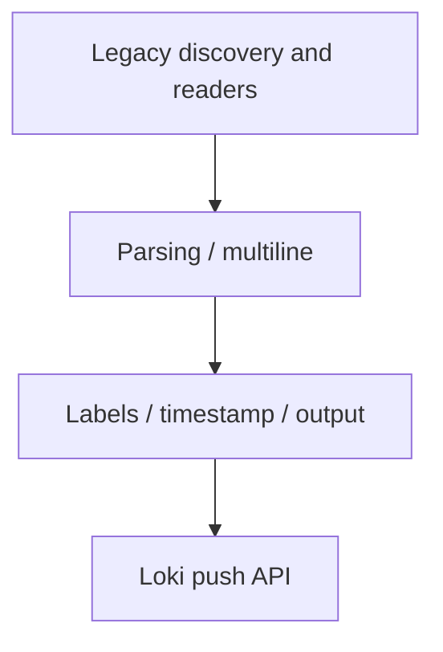
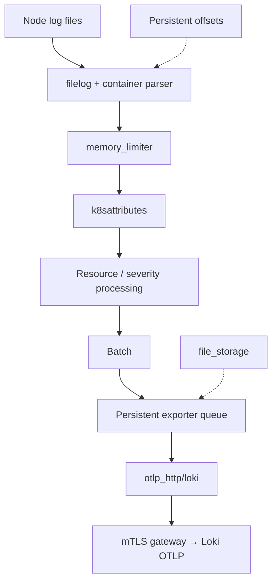
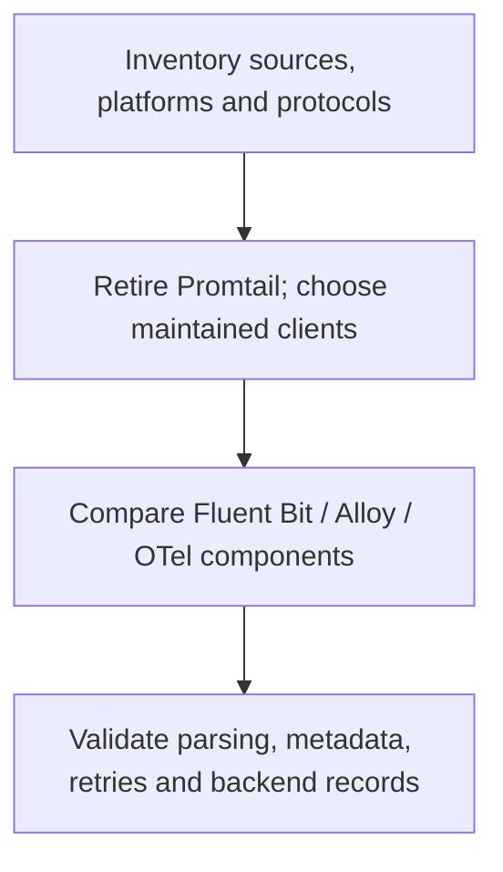

# 日志收集器对比

> **最后更新**: September 13, 2026

本指南对比 Fluent Bit、Grafana Alloy 和 OpenTelemetry Collector，并说明如何从已停止维护的 Promtail 安装迁移。请根据收集器实际的输入、输出插件、部署所需权限和故障行为来选型，而不是依据假想的内存占用或每秒事件数排名。

配置基线为 **Fluent Bit 5.1.2**、**Alloy 1.19.2** 和 **OpenTelemetry Collector Contrib 0.160.0**。发行版的版本、其包含的组件以及它支持的平台是彼此独立的检查项。

## 目录

1. [概述](#overview)
2. [FluentBit](#fluentbit)
3. [Promtail](#promtail)
4. [Grafana Alloy](#grafana-alloy)
5. [OpenTelemetry Collector](#opentelemetry-collector)
6. [对比与选型](#comparison-and-selection-guide)

## 概述

### 日志收集器的角色


[查看交互式图表](https://www.atomai.click/kubernetes-docs/archmaps/en-observability-logging-05-collectors-0.html)

图中展示的是可能的目的地。这并不意味着每个收集器都原生支持每一种目的地，也不意味着启用多个输出就能对所有目的地提供事务性投递。

### 核心功能

| 功能 | 需要验证的内容 |
|---|---|
| 输入 | 文件/API 权限、轮转、首次读取位置和来源归属 |
| 解析 | 将容器运行时的分帧格式与应用 JSON 或堆栈跟踪分开处理 |
| 转换/过滤 | 哪些记录和字段被修改或丢弃 |
| 元数据 | 正确关联 Pod/namespace（命名空间）并控制标签基数 |
| 缓冲 | 内存与持久化存储的差异、容量、重试和溢出策略 |
| 输出 | 身份验证、TLS、租户映射、确认机制和目的地限制 |

每个来源只运行一条有意设计的收集路径。多个 agent 读取同一批文件，或文件读取器与 Kubernetes API 读取器同时针对相同的 Pod，都可能导致日志重复。offset、持久化队列和后端成功摄取是不同的状态。

| 平台 | 收集注意事项 |
|---|---|
| Linux Kubernetes 节点 | 读取宿主机文件的 agent 需要挂载节点日志目录并具备被允许的 security context；journal 的位置各不相同 |
| Windows 节点 | 使用受支持的 Windows 构建/配置和实际的 Windows 路径；下文的 Linux manifest 并不适用 |
| EKS Fargate | 不要安装读取宿主机文件的 DaemonSet；使用托管的 Fargate log router 或合适的基于 API/应用的路径 |
| EKS Auto Mode | 确认可用的宿主机路径和 add-on 支持情况；托管组件输出的日志与应用 stdout 是不同的内容 |

示例将数据发送到一个**已存在的、启用 mTLS 的私有日志网关**。该网关必须信任每个 agent 的客户端证书、提供与其 DNS 名称匹配的证书、正确路由 Loki/OTLP 路径，并强制执行相应的租户策略。证书、DNS、网关配置和 NetworkPolicy 都是前置条件，不由这些代码片段创建。

## FluentBit

### 概述

Fluent Bit 是 Fluentd 生态（已毕业项目）中基于 C 的遥测 agent。当前的构建版本支持日志、指标、追踪和 OpenTelemetry 插件；早期那种“不支持追踪/不支持 OTLP”的对比说法并不准确。请确认所选镜像实际包含哪些插件。

Fluent Bit 5.1.2 和 AWS for Fluent Bit 是版本号各自独立的发行版。AWS 镜像的 tag 并不等于其内嵌的 Fluent Bit 版本。本示例固定使用官方上游镜像及其 manifest digest；下文链接的 AWS 专用指南使用它们各自经过审核的镜像基线。

### 架构


[查看交互式图表](https://www.atomai.click/kubernetes-docs/archmaps/en-observability-logging-05-collectors-1.html)

请将该图视为逻辑概览。缓冲并不等于恰好一次（exactly-once）保证，过滤也不会删除原始的容器日志文件。请保护节点存储，并在应用边界处控制敏感数据。

### 完整配置示例

将以下内容保存为 `fluent-bit.conf`。它收集容器日志，并使用**原生 C 实现的 `loki` 输出**，其选项包括 `line_format`、`tenant_id` 和 `auto_kubernetes_labels`。另行开发的 Go 插件所使用的 `LineFormat`、`TenantID`、`BatchWait` 和 `BatchSize` 等名称不可互换使用。

```ini
[SERVICE]
    Flush                     2
    Grace                     30
    Daemon                    Off
    Log_Level                 info
    HTTP_Server               On
    HTTP_Listen               0.0.0.0
    HTTP_Port                 2020
    Health_Check              On
    storage.path              /var/lib/fluent-bit/storage
    storage.sync              normal
    storage.checksum          On
    storage.backlog.mem_limit 32M

[INPUT]
    Name                      tail
    Tag                       kube.*
    Path                      /var/log/containers/*.log
    Exclude_Path              /var/log/containers/fluent-bit-*_logging_*.log
    multiline.parser          docker, cri
    DB                        /var/lib/fluent-bit/tail.db
    DB.locking                true
    Mem_Buf_Limit             32M
    Skip_Long_Lines           On
    Refresh_Interval          10
    Rotate_Wait               30
    Read_From_Head            Off
    storage.type              filesystem

[FILTER]
    Name                      kubernetes
    Match                     kube.*
    Kube_URL                  https://kubernetes.default.svc:443
    Kube_Tag_Prefix           kube.var.log.containers.
    Merge_Log                 On
    Merge_Log_Key             log_processed
    Keep_Log                  On
    K8S-Logging.Parser         Off
    K8S-Logging.Exclude        Off
    Use_Kubelet               Off
    Labels                    On
    Annotations               Off

[FILTER]
    Name                      lua
    Match                     kube.*
    script                    /fluent-bit/scripts/process.lua
    call                      process_log
    protected_mode            On

[OUTPUT]
    Name                      loki
    Match                     kube.*
    Host                      logs-gateway.logging.svc.cluster.local
    Port                      443
    tls                       On
    tls.verify                On
    tls.verify_hostname       On
    tls.ca_file               /fluent-bit/tls/ca.crt
    tls.crt_file              /fluent-bit/tls/tls.crt
    tls.key_file              /fluent-bit/tls/tls.key
    Labels                    job=fluent-bit,namespace=$kubernetes['namespace_name']
    line_format               json
    auto_kubernetes_labels    Off
    Retry_Limit               5
    storage.total_limit_size  1G
```

tail 数据库和文件系统 chunk 使用可写的状态挂载卷，而不是只读的日志挂载卷。已有的 offset 会从数据库恢复；`Read_From_Head Off` 会在首次发现文件时跳过其中已存在的内容。修改该设置前请先确定一个明确的回填策略。`Skip_Long_Lines On`、有限的重试次数和有限的存储都可能丢弃数据；请对这些情况进行监控。

排除规则匹配的是本示例自身的收集器 Pod。如果 namespace 或工作负载名称发生变化，请调整该规则，而不要不知不觉地排除某个 namespace 中的所有应用。在该配置中，Kubernetes annotation 无法覆盖 parser/排除策略。

示例使用 API server 获取元数据，不需要 kubelet 的 `nodes/proxy` 访问权限。如果启用 `Use_Kubelet`，请另行确认 kubelet 地址、授权、证书和网络访问。开放一个 HTTP 指标监听端口并不等于可以把收集器的 UI/健康检查端点公开暴露。

对于其他目的地，请有意识地选择对应的输出和工作负载身份：

- [CloudWatch Logs](03-cloudwatch-logs.md)：使用原生的 `cloudwatch_logs`、预先创建好的 log group 和 agent ServiceAccount 的实际身份。不要添加不受支持的 `compress` 选项，也不要假设已具备创建/设置保留期的权限。
- [OpenSearch](02-opensearch.md)：为所选后端使用原生的 `opensearch` 输出，并配置正确的 SigV4 service/Region、TLS 和 typeless API 设置。
- S3：为 `s3` 输出配置其自身的可写 `store_dir`、唯一的 object key 策略以及 bucket 前缀权限。它的缓冲/上传行为与通用的文件系统队列不同。在把它当作备份之前，请测试部分上传、重启恢复和数据取回。

如果添加 `systemd` 输入，请挂载该节点操作系统上实际存在的 journal，保持其 cursor 数据库可写，并为其 tag 添加匹配的输出。一个 `host.systemd` 输入在只有 `Match kube.*` 的输出时没有任何投递路径。宿主机的 journal/audit 文件并不是 EKS 控制平面的 API 审计日志。

### Parser 配置

tail 输入内置的 `docker, cri` 多行 parser 用于重组容器运行时的日志片段。这与拼接应用的 Java/Python/Go 堆栈跟踪是不同的事情。

| 格式 | 处理方式 |
|---|---|
| Docker JSON 外层封装 | 先解析运行时封装，再解析应用 JSON |
| CRI/containerd/CRI-O | 解析时间戳、stream 和 partial/full 标记；重组 partial 记录 |
| JSON 应用日志 | 只解析应用负载；保留或显式处理格式错误/纯文本记录 |
| Nginx/logfmt/自定义文本 | 为该应用格式选择对应的 parser，而不是无条件串联所有 parser |
| 应用堆栈跟踪 | 使用经过测试的多行 parser，并设置 stream 边界、大小和超时限制 |

使用多行 **filter** 时，请遵循其关于重新发送/顺序的指引：把它放在那些否则会重复处理已重新发送记录的 filter 之前。请测试容器日志交错以及没有时间戳的异常场景；单一的“行以日期开头”这类通用表达式并不是万能的堆栈跟踪 parser。

### Lua 脚本示例

将以下内容保存为 `process.lua`。它会对已解析的应用对象中选定的 key 进行脱敏，包括嵌套的对象/数组，并移除未脱敏的原始重复内容。它**不能**检测任意文本中的所有 secret 或个人标识信息。

```lua
-- Redacts selected structured keys; it is not a general PII detector.
local sensitive = {
    password = true, passwd = true, token = true, secret = true,
    api_key = true, ["api-key"] = true, authorization = true
}

local function redact(value, depth)
    if type(value) ~= "table" then
        return value
    end
    if depth > 8 then
        return "[DEPTH_LIMIT]"
    end
    for key, child in pairs(value) do
        if type(key) == "string" and sensitive[string.lower(key)] then
            value[key] = "***"
        elseif type(child) == "table" then
            value[key] = redact(child, depth + 1)
        end
    end
    return value
end

function process_log(tag, timestamp, record)
    local app = record["log_processed"]
    if type(app) == "table" then
        record["log_processed"] = redact(app, 0)
        -- Do not retain an unredacted duplicate of the parsed application JSON.
        record["log"] = nil
        if type(app["level"]) == "string" then
            record["level"] = string.upper(app["level"])
        else
            record["level"] = "UNKNOWN"
        end
    else
        if type(record["log"]) ~= "string" then
            record["log"] = "[NON_STRING_LOG]"
        end
        record["level"] = "UNKNOWN"
    end
    -- 2 changes the record while retaining the original Fluent Bit timestamp.
    return 2, timestamp, record
end
```

例如，`password` 字段会被脱敏，但诸如 `"message": "password=..."` 这样的文本不会被自动识别为凭据。纯文本日志仍然是纯文本。该转换不是一个故障即关闭（fail-closed）的安全边界；请保护源文件、本地存储和目的地，并在需要更强保证时使用应用侧的日志字段允许列表。

`return 2` 会在修改记录的同时保留 Fluent Bit 的原始时间戳。类型检查可避免格式错误的布尔型日志级别导致回调崩溃。这些转换是用原生 Lua 解释器测试的；并未运行完整的 Fluent Bit 容器。

### DaemonSet 部署

将以下内容保存为 `fluent-bit-workload.yaml`。它要求 `logging` 中存在 `agent-gateway-client` Secret，并包含 `ca.crt`、`tls.crt` 和 `tls.key`。这些是与部署环境相关的凭据；不要把示例私钥粘贴到 Git 中。

```yaml
apiVersion: v1
kind: ServiceAccount
metadata:
  name: fluent-bit
  namespace: logging
---
apiVersion: rbac.authorization.k8s.io/v1
kind: ClusterRole
metadata:
  name: log-collector-fluent-bit
rules:
- apiGroups:
  - ''
  resources:
  - pods
  - namespaces
  verbs:
  - get
  - list
  - watch
---
apiVersion: rbac.authorization.k8s.io/v1
kind: ClusterRoleBinding
metadata:
  name: log-collector-fluent-bit
roleRef:
  apiGroup: rbac.authorization.k8s.io
  kind: ClusterRole
  name: log-collector-fluent-bit
subjects:
- kind: ServiceAccount
  name: fluent-bit
  namespace: logging
---
apiVersion: apps/v1
kind: DaemonSet
metadata:
  name: fluent-bit
  namespace: logging
spec:
  selector:
    matchLabels: &id001
      app.kubernetes.io/name: fluent-bit
  template:
    metadata:
      labels: *id001
    spec:
      serviceAccountName: fluent-bit
      nodeSelector:
        kubernetes.io/os: linux
      terminationGracePeriodSeconds: 45
      containers:
      - name: fluent-bit
        image: fluent/fluent-bit:5.1.2@sha256:d792375ca8e53be72fc25716c28f291f32c6fc6f4f31d12d0d14bc78cefe9226
        command:
        - /fluent-bit/bin/fluent-bit
        args:
        - -c
        - /fluent-bit/etc/fluent-bit.conf
        ports:
        - name: metrics
          containerPort: 2020
        securityContext:
          runAsUser: 0
          allowPrivilegeEscalation: false
          readOnlyRootFilesystem: true
          capabilities:
            drop:
            - ALL
        resources:
          requests:
            cpu: 100m
            memory: 128Mi
          limits:
            cpu: 500m
            memory: 512Mi
        livenessProbe:
          httpGet:
            path: /
            port: metrics
          initialDelaySeconds: 10
        readinessProbe:
          httpGet:
            path: /api/v1/health
            port: metrics
          initialDelaySeconds: 10
        volumeMounts:
        - name: logs
          mountPath: /var/log
          readOnly: true
        - name: state
          mountPath: /var/lib/fluent-bit
        - name: config
          mountPath: /fluent-bit/etc
          readOnly: true
        - name: scripts
          mountPath: /fluent-bit/scripts
          readOnly: true
        - name: tls
          mountPath: /fluent-bit/tls
          readOnly: true
        - name: tmp
          mountPath: /tmp
      volumes:
      - name: logs
        hostPath:
          path: /var/log
          type: Directory
      - name: state
        hostPath:
          path: /var/lib/fluent-bit
          type: DirectoryOrCreate
      - name: config
        configMap:
          name: fluent-bit-config
          items:
          - key: fluent-bit.conf
            path: fluent-bit.conf
      - name: scripts
        configMap:
          name: fluent-bit-config
          items:
          - key: process.lua
            path: process.lua
      - name: tls
        secret:
          secretName: agent-gateway-client
      - name: tmp
        emptyDir:
          sizeLimit: 32Mi
```

先保存前面的配置/脚本文件，然后在启动工作负载之前创建它们的 ConfigMap：

```bash
kubectl create namespace logging --dry-run=client -o yaml |
  kubectl apply -f -
kubectl -n logging create configmap fluent-bit-config \
  --from-file=fluent-bit.conf --from-file=process.lua \
  --dry-run=client -o yaml | kubectl apply -f -
kubectl apply -f fluent-bit-workload.yaml
kubectl -n logging rollout status daemonset/fluent-bit
```

该 agent 以 root 运行，以便读取示例中的节点日志路径并写入其专用状态目录，同时不添加任何 capability、不允许特权提升、也不使用可写的根文件系统。使用 hostPath 仍然需要集群具备相应的 admission 策略。请根据实际的节点操作系统调整文件权限、SELinux/AppArmor、taint 和存储。不要仅仅为了让应用日志 agent 保持运行就赋予它保留的系统关键 PriorityClass。

45 秒的 Pod 终止宽限期长于 Fluent Bit 的 30 秒宽限期，但这并不能保证在长时间故障期间成功投递。资源限制仅作示例。请在后端验证真实记录，并检查 tail offset、健康状态和缓冲/重试指标；仅凭 Pod 处于 Ready 状态并不能证明数据已被摄取。

## Promtail

### 概述

**Promtail 已于 2026 年 3 月 2 日结束生命周期（EOL）。** 商业支持和后续更新均已终止。请将现有安装迁移到 Alloy 或其他受支持的客户端；不要为新的 Loki 部署选择 Promtail。此次宣布的停止维护不包括独立的 `lambda-promtail` 客户端。

### 架构



这是一条历史数据路径，而不是安装建议。Loki 仓库的[许可例外说明](https://github.com/grafana/loki/blob/v2.9.4/LICENSING.md)将 `clients/`（包括 Promtail 源码）列为 Apache-2.0；不要把 Loki 服务端的 AGPL 许可套用到每个客户端上。请检查实际 artifact 及其依赖的许可证。position 文件记录的是读取进度，而不是已确认的后端投递。

### 完整配置示例

使用**已有的** `promtail.yaml` 作为迁移输入，而不要去部署已过时的 2.9.4 镜像：

```bash
alloy convert --source-format=promtail \
  --report=conversion-report.txt \
  --output=config.alloy promtail.yaml
alloy validate config.alloy
```

请检查生成的配置和诊断报告。不要把绕过转换错误当成正常的部署步骤。转换器支持几乎所有旧功能，但这并不是行为完全一致的无条件保证。

被审核的旧配置转换成功，但工具给出了警告：其全局读取速率限制会变成按管道的 `stage.limit` 限制、Promtail 自身的 tracing 配置可能需要手动迁移、以及 Alloy 输出的自监控指标不同。请更新告警/仪表板，并用真实数据验证这些变化。

### 管道 stage 细节

以下是**各自独立的概念**，不是把所有 parser 依次运行的配方：

| Promtail YAML | Alloy 对应项 | 重要区别 |
|---|---|---|
| `cri` / `docker` | `stage.cri` / `stage.docker` | 选择实际的运行时分帧格式 |
| `json`、`regex`、`logfmt` | 对应的 `stage.*` | 选择正确的源字段和格式错误数据的处理策略 |
| 先 `template`，再 `labels` | 先 `stage.template`，再 `stage.labels` | 在把值复制到标签之前先做归一化 |
| `drop` | `stage.drop` | Promtail 的 YAML key 是 `drop`，不是 `stage.drop` |
| `match` | `stage.match` | 分支只应作用于其目标 stream |
| `metrics` | `stage.metrics` | 检查标签集合、空闲时间序列和指标名称 |
| `timestamp`、`multiline` | 对应的 stage | 测试时间格式、stream 隔离和有界等待 |
| `output` | `stage.output` | 替换日志行可能丢弃关联分析所需的字段 |
| `pack` | `stage.pack` | JSON 行打包不同于 Loki 独立的 structured metadata 功能 |

不要默认把客户端 IP、订单 ID、trace ID 或所有任意的应用标签建入索引。Pod 和 filename 标签同样有基数成本。请决定哪些元数据必须以标签、structured metadata 还是日志正文的形式保持可用。

### DaemonSet 部署

用选定的、仍在维护的收集器替换已停止维护的工作负载，并有意识地保留来源/状态的过渡。旧的只读根文件系统示例中，位于 `/tmp` 下的 positions 文件既不持久也不可写；在 `/run/promtail` 上挂载卷并不能修复一个把文件写到别处的配置。

请协调好旧读取器的停止位置、新读取器的起始位置和后端检查。不要让两个读取器长期同时读取相同的日志。转换成功并不能验证 Secret 挂载、Kubernetes RBAC、journal 路径、状态迁移或后端投递。

## Grafana Alloy

### 概述

Alloy 是 Grafana 的 OpenTelemetry Collector 发行版，附带 Prometheus 和 Loki 组件。它的配置语言称为 **Alloy 配置语法**（以前叫 River）；它类似 HCL，但并不是可以互换使用的 Terraform 文件。

### River 配置

将以下内容保存为 `config.alloy`。该示例针对 Linux CRI 日志使用**单一的基于文件的路径**。通过 Pod Downward API 从 `spec.nodeName` 设置非敏感的 `NODE_NAME`，挂载节点日志文件，并提供可写的持久化 `--storage.path`。

```alloy
logging {
  level = "info"
}

discovery.kubernetes "pods" {
  role = "pod"
  selectors {
    role = "pod"
    field = "spec.nodeName=" + sys.env("NODE_NAME")
  }
}

discovery.relabel "pods" {
  targets = discovery.kubernetes.pods.targets
  rule {
    source_labels = ["__meta_kubernetes_namespace", "__meta_kubernetes_pod_label_app_kubernetes_io_name"]
    regex = "logging;alloy"
    action = "drop"
  }
  rule {
    source_labels = ["__meta_kubernetes_namespace"]
    target_label = "namespace"
  }
  rule {
    source_labels = ["__meta_kubernetes_pod_name"]
    target_label = "pod"
  }
  rule {
    source_labels = ["__meta_kubernetes_pod_container_name"]
    target_label = "container"
  }
  rule {
    source_labels = ["__meta_kubernetes_pod_label_app_kubernetes_io_name"]
    target_label = "service_name"
    regex = "(.+)"
  }
  rule {
    source_labels = ["__meta_kubernetes_pod_uid", "__meta_kubernetes_pod_container_name"]
    separator = "/"
    target_label = "__path__"
    replacement = "/var/log/pods/*$1/*.log"
  }
}

local.file_match "pods" {
  path_targets = discovery.relabel.pods.output
}

loki.source.file "pods" {
  targets = local.file_match.pods.targets
  forward_to = [loki.process.pods.receiver]
  tail_from_end = true
}

loki.process "pods" {
  forward_to = [loki.write.logs.receiver]
  stage.cri {}
  stage.json {
    expressions = {
      level = "level",
    }
    drop_malformed = false
  }
  stage.template {
    source = "level"
    template = "{{ if .Value }}{{ $v := ToUpper .Value }}{{ if or (eq $v \"TRACE\") (eq $v \"DEBUG\") (eq $v \"INFO\") (eq $v \"WARN\") (eq $v \"WARNING\") (eq $v \"ERROR\") (eq $v \"FATAL\") (eq $v \"CRITICAL\") }}{{ $v }}{{ else }}UNKNOWN{{ end }}{{ else }}UNKNOWN{{ end }}"
  }
  stage.labels {
    values = {
      level = "",
    }
  }
  stage.label_drop {
    values = ["filename"]
  }
  // Retain the application line, including its trace ID; do not assume it is safe.
}

loki.write "logs" {
  endpoint {
    url = "https://logs-gateway.logging.svc.cluster.local/loki/api/v1/push"
    batch_wait = "1s"
    batch_size = "1MiB"
    tls_config {
      ca_file = "/etc/alloy/tls/ca.crt"
      cert_file = "/etc/alloy/tls/tls.crt"
      key_file = "/etc/alloy/tls/tls.key"
      insecure_skip_verify = false
    }
  }
  external_labels = {
    cluster = "lab-cluster",
  }
}
```

配置中指定的 mTLS 证书文件必须存在。Kubernetes 服务发现权限和相应的网关策略需要另行配置。使用所选的 Alloy 二进制文件校验该文件：

```bash
alloy validate config.alloy
```

严重级别标签被限制为已知级别和 `UNKNOWN`，同时应用日志行仍然保留，可用于按 trace ID 查询。这不是一条脱敏管道。filename 标签被移除；Pod/container 标签被保留，仍应结合保留期/基数限制进行评估。

若采用基于 API 的收集，请使用 `loki.source.kubernetes` **替代**文件读取器，并移除 CRI/Docker 封装解析 stage：Kubernetes 日志 API 提供的就是应用日志行。一个 API 收集器即可收集整个集群，无需宿主机挂载。多个实例需要有意识的目标分区，或配置 Alloy clustering 并让相关组件参与其中；单纯增加副本数可能导致重复收集。

在本次审核的版本中，`env()` 仍是已弃用的函数；非敏感配置请使用 `sys.env()`。相比通过环境变量导出令牌，优先使用挂载的凭据文件或支持 secret 的组件。

Alloy 的自监控指标可以被抓取。若要将它们发送到 Prometheus 的 `/api/v1/write`，还需要启用 remote write 接收端，或使用为 remote write 设计的后端；仅有 URL 并不能启用该能力。请将指标/UI 访问保持在私有范围内。请为该部署显式配置遥测/上报行为。

### 从 Promtail 迁移

以下内容需要各自独立地保留：运行时解析、服务发现标签、应用字段、offset、记录丢弃策略、客户端身份验证和自监控指标告警。一个使用未定义服务发现组件的 API 源示例，或把 `stage.docker` parser 应用到已解码的 API 日志上，都不是完整的迁移。

Alloy 1.19.2 提供可选的 Loki WAL，但该功能是**实验性的且默认关闭**。主示例没有启用它。持久化的来源读取位置不等于持久的确认队列；请分别评估重试限制、来源轮转和任何 WAL 保留策略。

## OpenTelemetry Collector

### 概述

OpenTelemetry 提供厂商中立的遥测管道，并已于 **2026 年 5 月 11 日成为 CNCF 毕业项目**。请使用包含所需 receiver/processor/exporter 的发行版；core 发行版并不包含所有 Contrib 组件。

OTLP 可以使用 Protobuf 或 JSON。传输体积取决于实际字段、资源分组、压缩和传输方式。Filebeat/Fluentd 也可以批量发送。用 Protobuf tag 替换字段名并不会消除任意 JSON 正文或属性键中的字符串。

举一个有条件成立的算术例子：如果一条管道每个 Kafka 记录存放一个事件，而另一条每个记录打包 150 个事件，那么在后者中 1,000 个事件大约需要七条记录。这并不能说明网络请求量会等比例减少，或吞吐量会提升 18 倍。请在硬件、数据、目的地和持久化设置都匹配的条件下对完整管道做基准测试。

### 架构



Loki 通过其 OTLP 端点接入。Contrib 0.160.0 中已不存在停止维护的 Collector `loki` exporter。集群范围的 Kubernetes event 以及集中式 Syslog/OTLP receiver 需要各自的归属和部署模型；不要在每个节点上都重复部署一个 event watcher。

### 完整配置示例

将以下内容保存为 `otel.yaml`。它使用 Contrib 的 `container` operator 进行运行时解析/重组，并生成文件路径相关的资源元数据。要使用所指定的 Kubernetes 关联方式，Pod UID 必须是一个**资源属性**；仅提取普通的 `attributes.uid` 是不够的。

```yaml
extensions:
  file_storage/offsets:
    directory: /var/lib/otelcol/offsets
    create_directory: true
  file_storage/queue:
    directory: /var/lib/otelcol/queue
    create_directory: true
  health_check:
    endpoint: 0.0.0.0:13133

receivers:
  filelog:
    include: [/var/log/pods/*/*/*.log]
    exclude: [/var/log/pods/logging_otel-collector-*/*/*.log]
    start_at: end
    include_file_path: true
    storage: file_storage/offsets
    retry_on_failure:
      enabled: true
      max_elapsed_time: 5m
    operators:
      - type: container
        id: container-parser

processors:
  memory_limiter:
    check_interval: 1s
    limit_mib: 400
    spike_limit_mib: 100
  k8sattributes:
    auth_type: serviceAccount
    filter:
      node_from_env_var: NODE_NAME
    pod_association:
      - sources:
          - from: resource_attribute
            name: k8s.pod.uid
    extract:
      metadata:
        - k8s.namespace.name
        - k8s.pod.name
        - k8s.pod.uid
        - k8s.node.name
        - k8s.container.name
  resource/cluster:
    attributes:
      - key: k8s.cluster.name
        value: lab-cluster
        action: upsert
  transform/application:
    error_mode: ignore
    log_statements:
      - context: log
        statements:
          - 'set(cache["app"], ParseJSON(body)) where IsString(body) and IsMatch(body, "^\\s*\\{")'
          - 'set(severity_text, ConvertCase(cache["app"]["level"], "upper")) where IsMap(cache["app"]) and IsString(cache["app"]["level"])'
          - 'set(severity_number, SEVERITY_NUMBER_ERROR) where severity_text == "ERROR"'
          - 'set(severity_number, SEVERITY_NUMBER_WARN) where severity_text == "WARN" or severity_text == "WARNING"'
          - 'set(severity_number, SEVERITY_NUMBER_INFO) where severity_text == "INFO"'
          - 'set(severity_number, SEVERITY_NUMBER_DEBUG) where severity_text == "DEBUG"'
          - 'set(severity_number, SEVERITY_NUMBER_TRACE) where severity_text == "TRACE"'
          - 'set(severity_number, SEVERITY_NUMBER_FATAL) where severity_text == "FATAL" or severity_text == "CRITICAL"'
  batch:
    send_batch_size: 1024
    send_batch_max_size: 2048
    timeout: 2s

exporters:
  otlp_http/loki:
    endpoint: https://logs-gateway.logging.svc.cluster.local/otlp
    encoding: proto
    compression: gzip
    tls:
      ca_file: /etc/otelcol/tls/ca.crt
      cert_file: /etc/otelcol/tls/tls.crt
      key_file: /etc/otelcol/tls/tls.key
    sending_queue:
      enabled: true
      num_consumers: 2
      queue_size: 128
      storage: file_storage/queue
    retry_on_failure:
      enabled: true
      max_elapsed_time: 5m

service:
  extensions: [file_storage/offsets, file_storage/queue, health_check]
  telemetry:
    logs:
      level: info
    metrics:
      readers:
        - pull:
            exporter:
              prometheus:
                host: 0.0.0.0
                port: 8888
  pipelines:
    logs:
      receivers: [filelog]
      processors: [memory_limiter, k8sattributes, resource/cluster, transform/application, batch]
      exporters: [otlp_http/loki]
```

请提供 `NODE_NAME` 的 Downward API 取值、只读的节点日志挂载、可写的 `/var/lib/otelcol`、获取 Kubernetes 元数据所需的 RBAC 以及客户端证书挂载。存储 extension 会在该可写卷内部创建自己的目录。使用实际部署环境的取值进行校验：

```bash
otelcol-contrib validate --config=otel.yaml
```

该 exporter 会在 `/otlp` 后面追加 `/v1/logs`；请据此配置网关以及 Loki 的 OTLP/structured metadata 支持。在该基线中，`service.telemetry.metrics.readers` 取代了旧的无效 `address` key。

`memory_limiter` 可以用可重试的错误拒收数据并请求垃圾回收。它不是进程内存上限，也不是绝对的 OOM 保证。上游的重试行为很重要；本文的文件 receiver 只会在有限的五分钟内重试，超时之后失败的批次可能被丢弃。队列容量、磁盘容量、关闭流程和后端故障仍需测试。

应用日志正文会被保留，包括纯文本和格式错误的 JSON。解析严重级别并不等于移除敏感数据。不要额外添加一个详细 debug exporter，否则可能无意间把未脱敏的生产负载复制到收集器日志中。

### Routing Connector

这个**独立的本地路由演示**定义了所有被引用的组件，并包含一条兜底路由。由 OTLP 生产者提供 `resource.attributes["logtype"]`；应用 JSON 正文中的某个字段不会自动变成资源属性。

```yaml
receivers:
  otlp:
    protocols:
      http:
        endpoint: 127.0.0.1:4318

connectors:
  routing:
    default_pipelines: [logs/other]
    table:
      - condition: resource.attributes["logtype"] == "mysql"
        pipelines: [logs/mysql]
      - condition: resource.attributes["logtype"] == "nginx"
        pipelines: [logs/nginx]
      - condition: resource.attributes["logtype"] == "app"
        pipelines: [logs/app]

exporters:
  file/mysql:
    path: /var/lib/otelcol/routed/mysql.json
  file/nginx:
    path: /var/lib/otelcol/routed/nginx.json
  file/app:
    path: /var/lib/otelcol/routed/app.json
  file/other:
    path: /var/lib/otelcol/routed/other.json

service:
  pipelines:
    logs/ingestion:
      receivers: [otlp]
      exporters: [routing]
    logs/mysql:
      receivers: [routing]
      exporters: [file/mysql]
    logs/nginx:
      receivers: [routing]
      exporters: [file/nginx]
    logs/app:
      receivers: [routing]
      exporters: [file/app]
    logs/other:
      receivers: [routing]
      exporters: [file/other]
```

运行该示例前请先创建可写的输出目录。它的 receiver 绑定在回环地址，目的地是本地文件；它既不是生产网关，也不是 ClickHouse 部署。只有在配置好每个真实后端、身份验证和存储策略之后，才可替换这些本地输出。

当前的 connector 接受 `statement: route() where ...`；这一点已经过验证，不应被错误地当成已移除。`condition` 是这里使用的更清晰的写法。默认的 `move` 动作会把匹配到的数据从后续路由中移除；`copy` 的分发行为不同。未匹配的记录需要一条有意设计的兜底路径。

只有在 ACL、保留期、分区、消费者归属和故障隔离仍然合适的情况下，合并 Kafka topic 才可能简化管理。在 Collector 内部做分类并不能替代 broker 层面的隔离，也不会让分发变成原子操作。由生产者控制的路由属性不是租户授权边界。

### 按日志级别分池（大规模环境）

| 池 | 示例目标 | 所需控制手段 |
|---|---|---|
| 快速：ERROR/FATAL | 两分钟内送达 | 预留容量、适当的队列/分区隔离和可度量的积压 |
| 常规：INFO/WARN | 15 分钟内送达 | 经过度量的自动扩缩和有界的保留期/队列 |
| 调试：DEBUG/TRACE | 尽力而为 | 明确的丢弃/限流策略，以及对被丢弃数据的可见性 |

这些是示意性目标，不是实测的 SLA。仅仅命名三个 Deployment 或分配副本数并不会路由数据，也不会隔离一个共享的、已拥塞的输入队列。请根据观测到的输入体积、处理、批处理和重试情况来设置资源 request 和 limit。

请使用适合该集群、由运维方自行定义的 PriorityClass，而不要把保留的 `system-cluster-critical`/`system-node-critical` 类别当作通用的日志方案建议。专用节点、优先级和预留容量并不能保证在所有故障期间都可用。

## 对比与选型指南

### 功能对比表

| 项目 | Fluent Bit | Promtail | Alloy | OTel Collector Contrib |
|---|---|---|---|---|
| 生命周期 | 维护中 | 已 EOL；需迁移 | 维护中 | 维护中 |
| 配置 | 经典配置 / YAML | 旧版 YAML | Alloy 语法 | YAML |
| 信号 | 取决于插件的日志/指标/追踪 | 主要是 Loki 日志 | 日志/指标/追踪 | 取决于组件的日志/指标/追踪 |
| Loki 路径 | 原生输出 | 旧版 push 客户端 | Loki 组件 | OTLP HTTP exporter |
| AWS 输出 | 有原生插件可用 | 不是它的用途 | 检查包含的组件/转发路径 | 检查包含的 AWS exporter |
| 可扩展性 | C/插件、Lua filter，以及其他取决于构建的选项 | 旧版管道 stage | 组件和管道 | receiver/processor/connector/exporter |
| 持久化 | 输入 chunk/状态和特定输出的存储 | 来源 position；有界的客户端缓冲 | position；可选的实验性 Loki WAL | 用于 offset 的 file storage 和受支持的 exporter 队列 |
| 资源占用 | 请测量所选配置 | 仅有历史测量数据 | 请测量所选配置 | 请测量所选配置 |

原生插件支持与把 OTLP 转发到第二个收集器不是一回事。在断定某个目的地受支持或不受支持之前，请确认所安装发行版实际包含的组件列表以及后端协议。

### 按使用场景的建议

- 如果需要现有的原生输出集成，且节点 agent 的资源占用适合你实测的工作负载，可评估 Fluent Bit。
- 面向 Grafana/Loki/Prometheus 工作流和 Promtail 迁移时，可评估 Alloy，并采用一种有意设计的来源归属模型。
- 需要标准 OTLP 和多厂商管道并依赖其 processor/connector 时，可评估 OTel Collector。
- 迁移 Promtail；仅仅因为它已经在运行就继续保留它，不是受支持的长期选择。

### 决策流程



## 参考资料与验证范围

- [Fluent Bit 5.1.2 源码与能力](https://github.com/fluent/fluent-bit/tree/v5.1.2)
- [原生 Loki 输出选项](https://github.com/fluent/fluent-bit/blob/v5.1.2/plugins/out_loki/loki.c)
- [Promtail 生命周期](https://grafana.com/docs/loki/latest/send-data/promtail/)
- [Alloy 迁移](https://grafana.com/docs/alloy/latest/set-up/migrate/from-promtail/)
- [Alloy Kubernetes API 源](https://grafana.com/docs/alloy/latest/reference/components/loki/loki.source.kubernetes/)
- [Alloy Loki 输出/WAL](https://grafana.com/docs/alloy/latest/reference/components/loki/loki.write/)
- [Collector Contrib 版本发布](https://github.com/open-telemetry/opentelemetry-collector-releases/releases/tag/v0.160.0)
- [Filelog receiver](https://github.com/open-telemetry/opentelemetry-collector-contrib/blob/v0.160.0/receiver/filelogreceiver/README.md)
- [Routing connector](https://github.com/open-telemetry/opentelemetry-collector-contrib/blob/v0.160.0/connector/routingconnector/README.md)
- [Memory limiter](https://github.com/open-telemetry/opentelemetry-collector/blob/v0.160.0/processor/memorylimiterprocessor/README.md)
- [OpenTelemetry 的 CNCF 状态](https://www.cncf.io/projects/opentelemetry/)
- [EKS Fargate 日志](https://docs.aws.amazon.com/eks/latest/userguide/fargate-logging.html)

验证范围包括已发布的 Alloy/Collector 配置校验、本地合成日志处理、Lua 转换测试、官方插件/源契约以及 Kubernetes manifest 结构。未执行真实的 Kubernetes 元数据查询、节点 agent 部署、网关 mTLS、AWS 投递、HA、生产负载或吞吐量基准测试。

## 测验

请通过[日志收集器测验](../../quizzes/observability/logging/05-collectors-quiz.md)检验你的理解。
