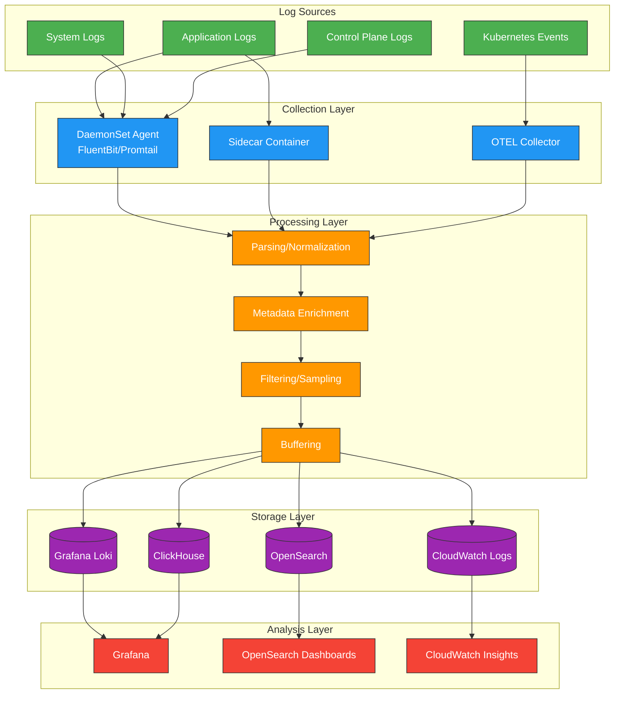
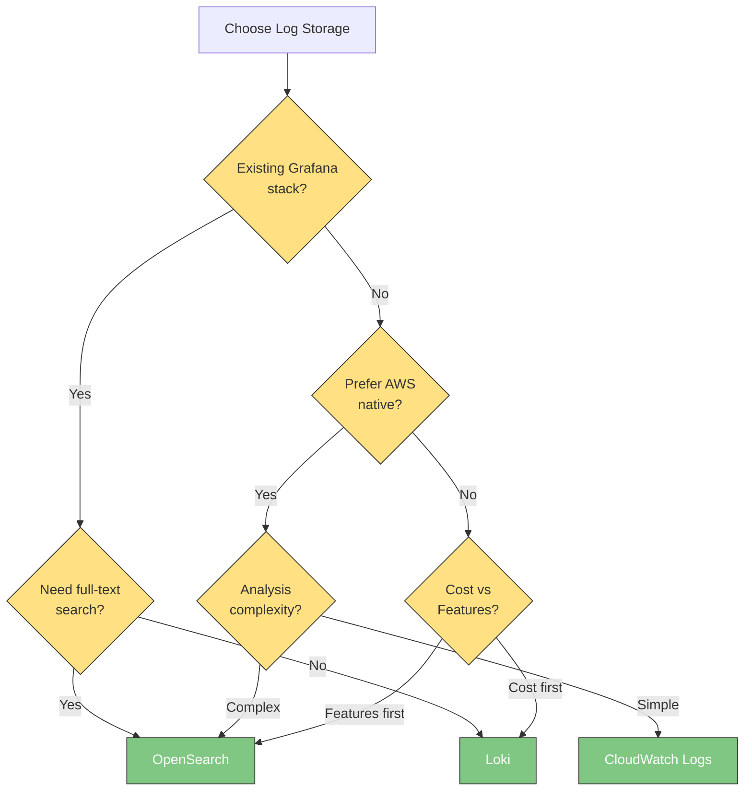

# 日志

> **最后更新**: February 20, 2026

在 Kubernetes 环境中，有效的日志记录对于系统可观测性、故障排除和安全审计至关重要。本文档介绍日志记录基础、日志收集管道架构，以及 EKS 环境的日志记录策略。

## 目录

1. [日志记录基础](#日志记录基础)
2. [日志收集管道架构](#日志收集管道架构)
3. [日志存储选择标准](#日志存储选择标准)
4. [EKS 日志记录策略](#eks-日志记录策略)
5. [解决方案比较](#解决方案比较)

***

## 日志记录基础

### 结构化日志

结构化日志以一致的格式输出日志消息，使解析和分析更加容易。与非结构化文本日志不同，结构化日志由字段值对组成，能够实现更高效的搜索和筛选。

#### 非结构化日志与结构化日志

```plaintext
# Unstructured log (difficult to parse)
2025-02-15 10:23:45 ERROR Failed to connect to database: connection timeout after 30s

# Structured log (JSON format)
{
  "timestamp": "2025-02-15T10:23:45.123Z",
  "level": "ERROR",
  "message": "Failed to connect to database",
  "error": "connection timeout",
  "timeout_seconds": 30,
  "service": "user-api",
  "pod": "user-api-7d4f8b9c6-x2k9m",
  "namespace": "production",
  "trace_id": "abc123def456"
}
```

#### 结构化日志的优势

| 优势                  | 描述                                               |
| ------------------------ | --------------------------------------------------------- |
| **搜索效率**    | 按特定字段快速筛选                         |
| **一致性**          | 所有 Service 使用相同格式                           |
| **关联分析** | 通过 trace\_id、request\_id 跟踪请求                 |
| **自动化**           | 无需解析即可立即用于分析工具      |
| **告警配置**  | 易于根据特定字段值创建告警规则 |

### 日志级别

日志级别表示消息的重要性和严重程度。正确使用日志级别对于有效的故障排除和减少噪声至关重要。

| 级别     | 编号 | 用途                                  | 示例                                              |
| --------- | ------ | ---------------------------------------- | ---------------------------------------------------- |
| **TRACE** | 0      | 最详细的调试信息      | 函数进入/退出、变量值                 |
| **DEBUG** | 1      | 开发期间的调试信息 | SQL 查询、请求参数                      |
| **INFO**  | 2      | 常规运行信息          | Service 启动、请求完成                  |
| **WARN**  | 3      | 潜在问题情况             | 发生重试、性能下降           |
| **ERROR** | 4      | 发生错误（可恢复）             | API 调用失败、验证失败                 |
| **FATAL** | 5      | 严重错误（不可恢复）           | Service 启动失败、缺少必需依赖项 |

#### 按环境推荐的日志级别

```yaml
# Development environment
LOG_LEVEL: DEBUG

# Staging environment
LOG_LEVEL: INFO

# Production environment
LOG_LEVEL: INFO  # or WARN (for high traffic)
```

### JSON 日志格式

在 Kubernetes 环境中，JSON 格式是事实标准。大多数日志收集器和分析工具原生支持 JSON。

#### 推荐的 JSON 字段

```json
{
  "timestamp": "2025-02-15T10:23:45.123Z",
  "level": "INFO",
  "logger": "com.example.UserService",
  "message": "User login successful",
  "context": {
    "user_id": "user-12345",
    "session_id": "sess-abc123",
    "ip_address": "10.0.1.50"
  },
  "kubernetes": {
    "namespace": "production",
    "pod": "user-api-7d4f8b9c6-x2k9m",
    "container": "user-api",
    "node": "ip-10-0-1-100.ec2.internal"
  },
  "trace": {
    "trace_id": "abc123def456",
    "span_id": "789ghi",
    "parent_span_id": "456def"
  }
}
```

#### 关键字段说明

| 字段组    | 字段         | 描述                                         |
| -------------- | ------------- | --------------------------------------------------- |
| **基本**      | timestamp     | ISO 8601 格式的时间戳                           |
|                | level         | 日志级别                                           |
|                | message       | 人类可读的消息                              |
| **上下文**    | context.\*    | 与业务逻辑相关的信息                  |
| **Kubernetes** | kubernetes.\* | Pod、namespace 等 K8s 元数据                    |
| **追踪**      | trace.\*      | 分布式追踪 ID（OpenTelemetry 集成） |

***

## 日志收集管道架构

### 架构概述



### 各层职责

#### 1. 收集层

负责从日志源收集原始日志。

| 方法          | 优势                                   | 劣势                     | 最适用场景                          |
| --------------- | -------------------------------------------- | --------------------------------- | --------------------------------- |
| **DaemonSet**   | 资源高效，集中式管理   | 每个节点仅一个                 | 大多数标准工作负载           |
| **Sidecar**     | 按应用隔离，自定义处理 | 资源开销                 | 特殊日志格式、多租户 |
| **直接推送** | 实时、灵活的传输                 | 需要修改应用 | 高性能要求     |

#### 2. 处理层

对收集到的日志进行标准化并添加元数据。

```yaml
# FluentBit processing pipeline example
[FILTER]
    Name         kubernetes
    Match        kube.*
    Kube_URL     https://kubernetes.default.svc:443
    Merge_Log    On
    K8S-Logging.Parser  On

[FILTER]
    Name         modify
    Match        *
    Add          cluster_name eks-production
    Add          environment production

[FILTER]
    Name         grep
    Match        *
    Exclude      log HealthCheck
```

#### 3. 存储层

存储并索引处理后的日志。存储方式因解决方案特性而异。

#### 4. 分析层

搜索并可视化已存储的日志。

***

## 日志存储选择标准

### 关键考量因素

#### 1. 成本

```
Monthly log volume: Estimated cost based on 1TB (2025)

+------------------+------------------+-----------------+
|     Solution     |   Storage/GB     |   Query Cost    |
+------------------+------------------+-----------------+
| Loki (S3)        | $0.023 (S3)      | Free            |
| OpenSearch       | $0.10-0.15       | Free            |
| CloudWatch       | $0.50 (ingest)   | $0.005/GB scan  |
| ClickHouse       | $0.023 (S3)      | Free            |
+------------------+------------------+-----------------+
```

#### 2. 查询性能

| 解决方案       | 实时查询 | 聚合 | 全文搜索 | 仪表板             |
| -------------- | --------------- | ----------- | ---------------- | --------------------- |
| **Loki**       | 优秀       | 良好        | 有限          | Grafana               |
| **OpenSearch** | 优秀       | 优秀   | 优秀        | OpenSearch Dashboards |
| **CloudWatch** | 良好            | 良好        | 良好             | CloudWatch Console    |
| **ClickHouse** | 优秀       | 优秀   | 良好             | Grafana               |

#### 3. 保留期限

```yaml
# Recommended retention policies
regulatory_compliance:
  financial: 7 years
  healthcare: 6 years
  general: 1 year

operational:
  hot_storage: 7-14 days    # Fast queries
  warm_storage: 30-90 days  # Investigation
  cold_storage: 1 year+     # Compliance
```

#### 4. 运维复杂度

| 解决方案       | 安装 | 运维 | 可扩展性 |
| -------------- | ------------ | ---------- | ----------- |
| **Loki**       | 低          | 低        | 高        |
| **OpenSearch** | 中          | 高       | 中      |
| **CloudWatch** | 很低     | 很低   | 高        |
| **ClickHouse** | 高         | 中     | 高        |

***

## EKS 日志记录策略

### 日志收集模式

#### 1. stdout/stderr 模式（推荐）

通过容器标准输出/错误输出进行日志记录是默认的 Kubernetes 模式。

```yaml
apiVersion: v1
kind: Pod
metadata:
  name: app-pod
spec:
  containers:
  - name: app
    image: myapp:1.0
    # Application outputs logs to stdout/stderr
    # kubelet saves to files in /var/log/containers/
    # DaemonSet agent collects
```

**优势：**

* Kubernetes 原生方式
* 自动日志轮转管理（`/var/log/containers/`）
* 可使用 `kubectl logs` 命令
* 无需单独挂载 volume

**日志文件位置：**

```bash
# Actual log files
/var/log/containers/<pod-name>_<namespace>_<container-name>-<container-id>.log

# Symbolic links
/var/log/pods/<namespace>_<pod-name>_<pod-uid>/<container-name>/0.log
```

#### 2. Sidecar 模式

需要基于文件的日志记录或特殊处理时使用。

```yaml
apiVersion: v1
kind: Pod
metadata:
  name: app-with-sidecar
spec:
  containers:
  - name: app
    image: legacy-app:1.0
    volumeMounts:
    - name: log-volume
      mountPath: /var/log/app

  - name: log-collector
    image: fluent/fluent-bit:latest
    volumeMounts:
    - name: log-volume
      mountPath: /var/log/app
      readOnly: true
    - name: fluent-bit-config
      mountPath: /fluent-bit/etc/

  volumes:
  - name: log-volume
    emptyDir: {}
  - name: fluent-bit-config
    configMap:
      name: fluent-bit-sidecar-config
```

**使用场景：**

* 旧版应用（仅文件日志记录）
* 多租户环境中的日志隔离
* 每个应用需要特殊解析
* 高安全性要求

#### 3. DaemonSet 模式（最常见）

每个节点上的一个 Agent 收集所有容器日志。

```yaml
apiVersion: apps/v1
kind: DaemonSet
metadata:
  name: fluent-bit
  namespace: logging
spec:
  selector:
    matchLabels:
      app: fluent-bit
  template:
    metadata:
      labels:
        app: fluent-bit
    spec:
      serviceAccountName: fluent-bit
      tolerations:
      - operator: Exists  # Deploy on all nodes
      containers:
      - name: fluent-bit
        image: public.ecr.aws/aws-observability/aws-for-fluent-bit:latest
        volumeMounts:
        - name: varlog
          mountPath: /var/log
          readOnly: true
        - name: varlibdockercontainers
          mountPath: /var/lib/docker/containers
          readOnly: true
        resources:
          limits:
            memory: 200Mi
            cpu: 200m
          requests:
            memory: 100Mi
            cpu: 100m
      volumes:
      - name: varlog
        hostPath:
          path: /var/log
      - name: varlibdockercontainers
        hostPath:
          path: /var/lib/docker/containers
```

### EKS 控制平面日志

EKS 控制平面日志将发送至 CloudWatch Logs。

```bash
# Enable control plane logging via AWS CLI
aws eks update-cluster-config \
  --name my-cluster \
  --logging '{"clusterLogging":[{"types":["api","audit","authenticator","controllerManager","scheduler"],"enabled":true}]}'
```

| 日志类型              | 描述             | 建议         |
| --------------------- | ----------------------- | ------------------- |
| **api**               | API server 日志         | 必需            |
| **audit**             | Kubernetes 审计日志   | 必需（安全） |
| **authenticator**     | IAM 身份验证日志 | 推荐         |
| **controllerManager** | Controller manager 日志 | 可选            |
| **scheduler**         | Scheduler 日志          | 可选            |

### Container Insights 日志记录

```yaml
# CloudWatch Agent ConfigMap
apiVersion: v1
kind: ConfigMap
metadata:
  name: cloudwatch-agent-config
  namespace: amazon-cloudwatch
data:
  cwagentconfig.json: |
    {
      "logs": {
        "metrics_collected": {
          "kubernetes": {
            "cluster_name": "my-cluster",
            "metrics_collection_interval": 60
          }
        },
        "force_flush_interval": 5
      }
    }
```

***

## 解决方案比较

### 功能对比表

| 功能                     | Loki       | OpenSearch     | CloudWatch     | ClickHouse     |
| --------------------------- | ---------- | -------------- | -------------- | -------------- |
| **安装复杂度** | 低        | 中         | 无（托管） | 高           |
| **查询语言**          | LogQL      | Lucene/DQL     | Insights QL    | SQL            |
| **全文搜索**        | 有限    | 优秀      | 良好           | 良好           |
| **模式**                  | 无模式 | 无模式     | 无模式     | 已定义模式 |
| **压缩**             | 高       | 中         | 不适用            | 很高      |
| **实时尾随**       | 支持  | 支持      | 有限        | 支持      |
| **告警**                | Grafana    | 内置       | 内置       | Grafana        |
| **多租户**           | 支持  | 支持      | 支持      | 支持      |
| **S3 后端**              | 原生     | 仅快照 | 不适用            | 原生         |

### 按使用场景推荐的解决方案

```
+-------------------------------------+---------------------+
|           Use Case                  |  Recommended        |
+-------------------------------------+---------------------+
| Cost optimization is top priority   | Loki + S3           |
| Full-text search and analytics      | OpenSearch          |
| AWS native, simple operations       | CloudWatch Logs     |
| Large-scale analytics, SQL pref.    | ClickHouse          |
| Existing Grafana stack              | Loki                |
| Compliance requirements             | OpenSearch/CloudWatch|
| Startup/small team                  | Loki or CloudWatch  |
| Enterprise/complex analytics        | OpenSearch          |
+-------------------------------------+---------------------+
```

### 成本模拟（基于每月 100GB 日志）

```
Estimated monthly cost by solution:

Loki (S3 Simple Scalable):
  +- S3 storage: $2.30
  +- S3 requests: $0.50
  +- EC2 (3x m5.large): $180
  +- Total: ~$183

OpenSearch (3x m5.large):
  +- Instances: $300
  +- EBS storage: $15
  +- Total: ~$315

CloudWatch Logs:
  +- Ingestion: $50
  +- Storage: $3
  +- Queries (estimated): $10
  +- Total: ~$63

ClickHouse (self-hosted):
  +- EC2 (3x m5.large): $180
  +- S3 storage: $2.30
  +- Total: ~$183
```

> **注意**：实际成本可能会因查询模式、保留期限和区域而有很大差异。

### 决策流程图



***

## 后续步骤

有关各日志存储解决方案的详细信息，请参阅以下文档：

* [Grafana Loki](01-loki.md) - 经济高效的日志聚合
* [Amazon OpenSearch Service](02-opensearch.md) - 强大的搜索与分析
* [CloudWatch Logs](03-cloudwatch-logs.md) - AWS 原生日志记录
* [ClickHouse](04-clickhouse.md) - 高性能日志分析
* [日志收集器比较](05-collectors.md) - FluentBit、Promtail、Alloy、OTEL

***

## 测验

通过 [日志概览测验](https://github.com/Atom-oh/kubernetes-docs/blob/main/en/quizzes/observability/logging/README-quiz.md) 测试您的知识。
