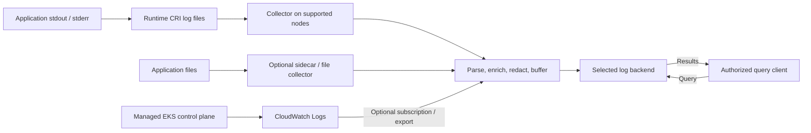

# 日志

> **最后更新**: September 13, 2026

日志将应用程序行为、基础设施事件和审计证据连接起来。
应一并设计事件 schema、采集所有权、投递失败行为、访问控制、
保留和查询。仅选择 collector 或 backend 并不能保证完整记录、租户隔离或监管合规。

## 日志基础

### 结构化记录仍需要解析

JSON 使字段明确且更易于验证/搜索，但它仍需要解码、
时间戳/类型映射，以及对容器运行时分帧的正确处理。JSON 可能比纯文本更大，
也不会自动移除敏感数据。除非经过测试的多行格式另有要求，
否则每行生成一个事件。

此合成示例保留了其原始的 2025 时间戳，作为格式说明，
而非关于当前事故的声明：

```json
{
  "timestamp": "2025-02-15T10:23:45.123Z",
  "level": "ERROR",
  "message": "Database connection timed out",
  "service": "example-api",
  "operation": "database.connect",
  "timeout_ms": 30000,
  "trace_id": "4bf92f3577b34da6a3ce929d0e0e4736",
  "span_id": "00f067aa0ba902b7"
}
```

为便于阅读，展示了展开的 JSON。面向行的生成器可以按如下方式对其编码，
包括包含换行符的消息：

```python
import json


def encode_log(record):
    # JSON escapes embedded newlines; append exactly one record delimiter.
    return json.dumps(record, ensure_ascii=False, separators=(",", ":")) + "\n"
```

这些是应用程序字段约定，而非 OTLP wire schema。请在相关位置配置
collector/backend 映射至 OpenTelemetry 的 Timestamp、SeverityText/SeverityNumber、
Body、Resource、Attributes 和 trace context。

Trace ID 是 16-byte 值（在此表示中为 32 个十六进制字符）；
span ID 为 8 bytes（16 个十六进制字符）。全零 ID 无效。请附加
实际活动 context，而不是为每条日志生成一个无关的新 ID。没有 span 的启动/系统记录
可以省略 trace context；这些字段并非每个 JSON log 的必填项。
仅有正确的 ID 并不会创建 span，也不保证跨 Service 关联。

仅采集实际所需的业务/context 字段。不要将原始
session token、密码、客户数据、IP 或 request body 推荐为通用默认字段。
带有身份信息的审计数据可能具有正当用途，但需要已定义的
访问/保留/脱敏策略。对于路由，优先使用可信 collector metadata，而不要
让应用程序 JSON 任意声明 tenant/namespace。

### Severity 不是通用的 0–5 量表

框架具有不同的名称和数值级别。请明确映射其含义。
对于 OpenTelemetry log model，范围如下：

| Severity | SeverityNumber |
| --- | --- |
| TRACE | 1–4 |
| DEBUG | 5–8 |
| INFO | 9–12 |
| WARN | 13–16 |
| ERROR | 17–20 |
| FATAL | 21–24 |

在该 model 中，零表示未指定的 Severity。ERROR 并不普遍
表示可恢复，且仅凭标签无法决定重试/恢复策略。
INFO 通常是生产运维的起点；审计/安全事件
以及临时启用的调试需要各自的要求。仅为减少容量而将所有内容提高到 WARN
可能会移除所需的证据。

## 采集和处理

下述层次是职责划分，并不一定是独立的进程。
有意选择目标位置；这并不要求将每条
记录复制到每个 backend。托管 EKS control-plane 记录通过 CloudWatch 进入，
而非 worker-node 日志文件。



| 模式 | 适当用途和限制 |
| --- | --- |
| stdout/stderr + node collector | 常见的 Linux worker-node 路径；运行时文件和 collector 权限仍然很重要 |
| File + sidecar | 旧版/仅文件应用程序或应用程序特定处理；需谨慎考虑共享 volume、启动/关闭和开销 |
| Application/SDK push | 可直接携带结构化事件；buffering、authentication 和失败行为会影响应用程序 |
| Managed platform router | 例如 EKS Fargate 的内置 log router；使用其支持的配置模型 |

DaemonSet 会根据 selector、affinity、toleration、
OS 和 rollout 行为在符合条件的节点上调度。它并不能证明每个节点都有健康的 collector，
或每个 container 都被包含。多个 collector/滚动重叠可能造成重复采集。
sidecar 并不自动成为强多 tenant 安全边界。

### 默认 Linux 日志路径和生命周期

常见默认布局为：

```text
Runtime log files:
  /var/log/pods/<namespace>_<pod>_<uid>/<container>/0.log

Compatibility symlinks pointing to those files:
  /var/log/containers/<pod>_<namespace>_<container>-<container-id>.log
```

Kubelet 指示运行时的 CRI 日志路径并管理 rotation。`podLogsDir` 可以
更改默认路径，且特定 OS/runtime 的布局有所不同。请检查实际
部署，而不是为每个 containerd workload 添加仅适用于 Docker 的 mount。
`kubectl logs` 显示当前日志文件；保留时，`--previous` 可以访问上一个
container 实例。它不是历史日志 archive。

Rotation 限制本地文件；它并不实现集中保留或 backup。
节点丢失、eviction 或 deletion 可能会在采集前移除记录。sidecar 的
`emptyDir` 在同一 pod 内的 container 重启后仍然存在，但在 pod 删除后不会保留。
collector offset database、queue 和 persistent storage 必须与
输出 acknowledgment/retry 一并设计。Buffering 是有限的；retry 可能会重复记录。
请在故障期间衡量丢失/重复、backlog、storage 耗尽和恢复。

为每条记录选择一条主路由。一个既转发记录又将其写入 stdout 的 sidecar
可能重复 node collector 路径。避免递归采集 collector 输出，
或转发到同一已订阅的 source log group。

### Fluent Bit 处理片段

以下是**经典 Fluent Bit 配置**，不是 YAML。它仅说明
filter：实际 input、CRI/multiline parser、tag 格式、
RBAC/cache 访问、storage 和 output 应单独提供和验证。

```text
# Fluent Bit classic-format FILTER fragment, not YAML or a complete pipeline.
# Requires matching tail input tags and CRI/Docker parsing.
[FILTER]
    Name               kubernetes
    Match              kube.*
    Kube_Tag_Prefix     kube.var.log.containers.
    Merge_Log          On
    Merge_Log_Key      app
    Keep_Log           On
    K8S-Logging.Parser  Off
    Labels             Off
    Annotations        Off

[FILTER]
    Name               modify
    Match              kube.*
    Set                cluster_name example-cluster
    Set                environment demo
```

`Merge_Log_Key app` 将解析后的应用程序字段与 collector metadata 分开保留。
`Set` 会替换选定的可信 cluster/environment 值；`Add` 会使
已存在的值保持不变。此片段不会隐式信任 workload 选择的 parser/annotation。
请将 `Kube_Tag_Prefix` 与实际 input tag 匹配。

使用 `Keep_Log On` 时，脱敏必须同时考虑原始 log 和解析后的
副本。仅在经过测试的策略下移除原始副本。不要丢弃任何包含
`HealthCheck` 的行：失败的 health check 可能正是所需的证据。仅在检查
应用程序格式和失败情况后，过滤明确定义的常规事件。

本概述不会将不完整的 `latest`-image DaemonSet 呈现为完整
安装。真实 collector 需要 pinned image、实际 configuration、
service account/RBAC、正确的 mount、权限和资源。请遵循
[collector 章节](05-collectors.md)了解部署详情，并验证其所选的
platform/backend configuration。

## EKS 日志路径

### Control-plane 日志

EKS 可以将 `api`、`audit`、`authenticator`、`controllerManager` 和 `scheduler`
记录直接发送到账户中的 CloudWatch Logs。它们服务于不同目的：
API 诊断、审计事件、IAM authentication 诊断、controller 和
scheduler 诊断。请选择运营/安全要求所需的类型。

将此请求保存为 `control-plane-logging.json`：

```json
{
  "clusterLogging": [
    {
      "types": [
        "api",
        "audit",
        "authenticator",
        "controllerManager",
        "scheduler"
      ],
      "enabled": true
    }
  ]
}
```
```bash
export AWS_REGION=ap-northeast-2
export CLUSTER_NAME=my-cluster

# Inspect the existing configuration before choosing a change.
aws eks describe-cluster --name "$CLUSTER_NAME" --region "$AWS_REGION" \
  --query 'cluster.logging'

# This changes the cluster logging configuration and can incur log charges.
aws eks update-cluster-config --name "$CLUSTER_NAME" --region "$AWS_REGION" \
  --logging file://control-plane-logging.json

# Use the actual update ID from the response, then inspect status/errors.
: "${UPDATE_ID:?Set the returned update ID}"
aws eks describe-update --name "$CLUSTER_NAME" --region "$AWS_REGION" \
  --update-id "$UPDATE_ID"
```

日志更新是异步的。EKS 为更新记录每个 subnet 最多需要五个可用 IP 地址。
请验证更新状态、已发出的 stream 以及 log-group 的保留/权限。投递尽力而为，
通常在数分钟内完成；启用某个类型不会回填每个先前事件。

审计事件遵循 audit policy 及其 level/stage/exclusion。它们并不能
证明每个 request/body 都被记录，且仅启用 `audit` 并不
建立合规性。node DaemonSet 不会读取托管 control-plane host。
将 CloudWatch 记录转发到其他位置是一条独立的 subscription/export 路径，
具有其自身的 encoding、IAM、投递和重复处理要求。

### Fargate 和 Container Insights

EKS Fargate 提供由 `aws-observability` namespace 中 `aws-logging` 配置的、
基于托管 Fluent Bit 的 router，具有文档说明的 5,300-character 限制及
支持的 section/plugin 限制。不要在那里安装普通 host DaemonSet。
请配置其目标权限并测试新 workload 日志。
Auto Mode/mixed/Windows 环境也需要其支持的采集路径。

该 namespace 需要 `aws-observability: enabled` label。请按文档所述向
Fargate pod execution role 授予目标权限。ConfigMap 更改
仅适用于新 pod，而不适用于现有 pod；请规划受控 rollout 并验证投递。


CloudWatch Agent 的 `logs.metrics_collected.kubernetes` 会发出 Container Insights
性能数据；仅此并不是应用程序 stdout/stderr 日志采集。
Fluent Bit 或已配置的 OTel log 路径会单独处理应用程序日志。
除非实际 workload/Operator 消费，否则 ConfigMap 没有作用。
有关这些 model 和 configuration 边界，请参阅已审查的
[CloudWatch 指南](../metrics/04-cloudwatch-metrics.md)。

## Storage、retention 和成本决策

| Backend | 设计问题 |
| --- | --- |
| Loki | LogQL、label-indexed stream/chunk 和受支持的 metadata/filter 路径；选择 label、tenancy/authentication、storage 和 query capacity |
| OpenSearch | Search/aggregation API 和 mapping/index lifecycle；区分 self-managed、managed domain、UltraWarm 和 Serverless |
| CloudWatch Logs | 托管 log group、IAM、retention 以及 Logs Insights QL/SQL/PPL；功能因 log class 和 Region 而异 |
| ClickHouse | column-oriented SQL analytics、schema/order/partition/TTL 选择，以及选定的 self-managed 或 cloud storage model |

OpenSearch 并不总是“仅 S3 snapshot”：UltraWarm 使用 S3 和 caching，
而 Serverless 将 storage 与 compute 分离。CloudWatch 并非用户配置的
S3 log backend，但支持独立的 export/delivery/integration 路径。产品的
tenant identifier 或 sidecar 不能替代经 authentication 的路由和 backend
access control。

全文 filtering、indexing 和 query latency 是不同的问题。请测试
代表性 volume、query predicate、concurrency、cold data 和 recovery。
避免无条件的“优秀/有限”排名、“schemaless 即无 schema”
的断言，或没有测量 dataset/configuration 的 compression ratio。

### Retention 需要针对实际记录制定策略

不要将 `financial` 映射为七年、`healthcare` 映射为六年，或将通用日志映射为
一年，作为通用法律规则。确定适用的 record category、
jurisdiction、contractual requirement、legal hold 和经批准的 owner policy。
hot/warm/cold tier 是运营选择，而非已经满足这些义务的证据。
在删除/访问计划中包括 replica、object version、backup 和 export，
并单独测试恢复。

### 比较可比成本

旧的 2025 表格混合了每 GB storage 和 ingestion 价格，并将 self-managed
query 称为免费。后来的 100-GB 估算缺少可复现的 Region、小时数、
retention、capacity 和 workload 基础。这些是说明性估算，而非
生产测量；更改日期或仅更改一个价格并不能修复它们。

比较 ingestion、retained/compressed byte 和 index overhead、replica、compute、
query scan/capacity、storage request、network transfer、backup 和运营工作。
object-store 价格只是其中一项。即使没有按 query 收取服务费用，
query 也会消耗已预置的 CPU/memory/I/O。Loki 加 S3 并非保证的成本
胜者，具名 backend 也不会自动适合合规。

1. 定义所需的 query、freshness、retention、access 和 recovery 目标。
2. 筛选满足这些要求的部署 model。
3. 重放代表性 data/query 以及故障/recovery 情况。
4. 比较完整成本和运营所有权。
5. 记录剩余假设，并在生产使用前验证它们。

## 后续步骤和验证范围

Promtail 已于 **2026-03-02** 结束生命周期。对于新工作，请使用 Alloy 或其他受支持的 client，
并为现有 Promtail deployment 规划迁移。引用的公告明确将 `lambda-promtail` 单独处理；
请不要扩大弃用声明。

- [Loki](01-loki.md)
- [OpenSearch](02-opensearch.md)
- [CloudWatch Logs](03-cloudwatch-logs.md)
- [ClickHouse](04-clickhouse.md)
- [Collectors: Fluent Bit、Alloy 和 OpenTelemetry](05-collectors.md)

本审计检查了 source fact、示例 serialization/ID 以及 request/configuration
结构。未运行 EKS 日志变更、collector deployment、tenant/storage provisioning、
法律判定、生产成本测量或投递/recovery 测试。

## 参考资料

- [Kubernetes logging architecture](https://kubernetes.io/docs/concepts/cluster-administration/logging/)
- [Kubelet legacy log symlinks](https://github.com/kubernetes/kubernetes/blob/v1.36.2/pkg/kubelet/kuberuntime/legacy.go)
- [DaemonSet behavior](https://kubernetes.io/docs/concepts/workloads/controllers/daemonset/)
- [Kubernetes audit policy](https://kubernetes.io/docs/tasks/debug/debug-cluster/audit/)
- [OpenTelemetry logs data model](https://opentelemetry.io/docs/specs/otel/logs/data-model/)
- [W3C Trace Context](https://www.w3.org/TR/trace-context/)
- [EKS control-plane logging](https://docs.aws.amazon.com/eks/latest/userguide/control-plane-logs.html)
- [EKS Fargate log router](https://docs.aws.amazon.com/eks/latest/userguide/fargate-logging.html)
- [Fluent Bit Kubernetes filter source documentation](https://github.com/fluent/fluent-bit-docs/blob/master/pipeline/filters/kubernetes.md)
- [Fluent Bit modify filter](https://github.com/fluent/fluent-bit-docs/blob/master/pipeline/filters/modify.md)
- [Loki architecture](https://grafana.com/docs/loki/latest/get-started/overview/)
- [Promtail end of life](https://grafana.com/docs/loki/latest/send-data/promtail/)
- [OpenSearch UltraWarm](https://docs.aws.amazon.com/opensearch-service/latest/developerguide/ultrawarm.html)
- [OpenSearch Serverless](https://docs.aws.amazon.com/opensearch-service/latest/developerguide/serverless-overview.html)
- [CloudWatch Logs query languages](https://docs.aws.amazon.com/AmazonCloudWatch/latest/logs/AnalyzingLogData.html)
- [CloudWatch log classes](https://docs.aws.amazon.com/AmazonCloudWatch/latest/logs/CloudWatch_Logs_Log_Classes.html)
- [ClickHouse overview](https://github.com/ClickHouse/ClickHouse)

[测验](../../quizzes/observability/logging/README-quiz.md)
