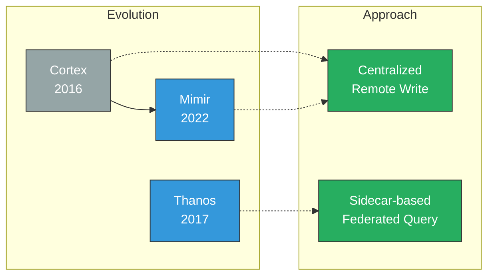
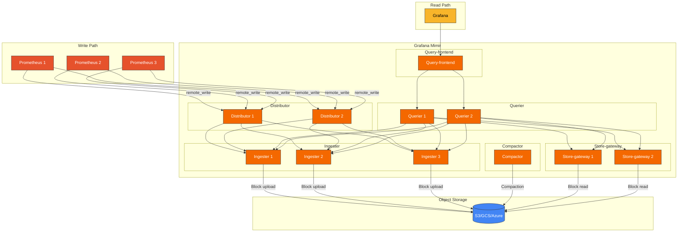
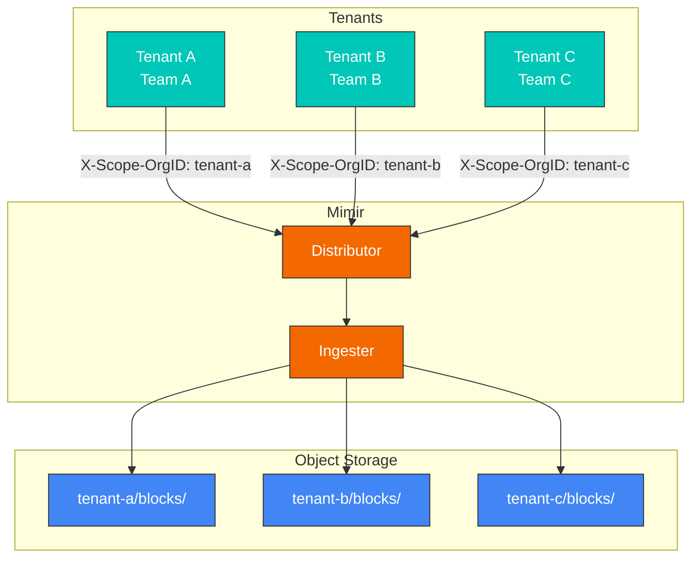
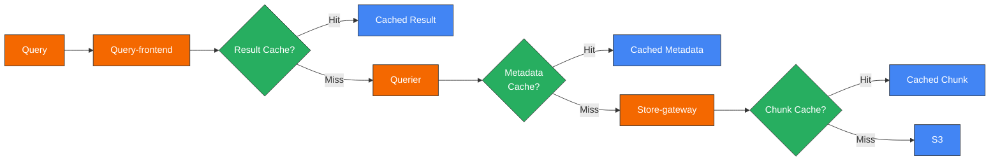
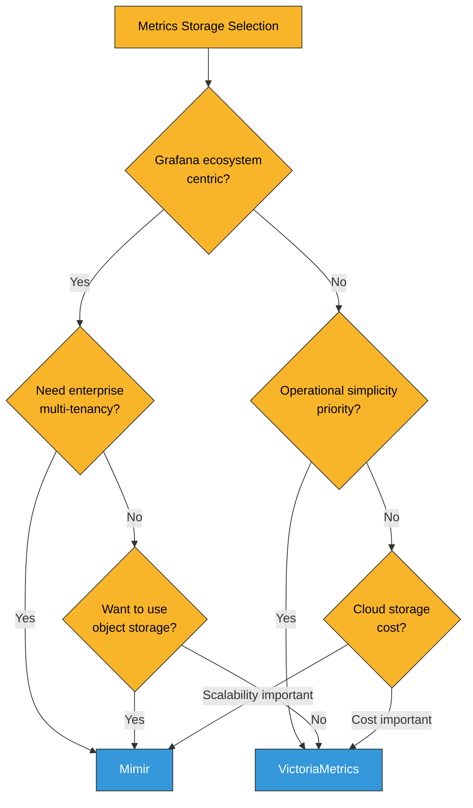

# Grafana Mimir

> **支持的版本**: Mimir 2.x
> **最后更新**: February 20, 2026

## 目录

- [简介](#introduction)
- [架构](#architecture)
- [核心组件](#core-components)
- [多租户](#multi-tenancy)
- [Helm 安装](#helm-installation)
- [S3 后端配置](#s3-backend-configuration)
- [查询与数据保留](#query-and-data-retention)
- [与 VictoriaMetrics 的比较](#comparison-with-victoriametrics)
- [性能调优](#performance-tuning)
- [最佳实践](#best-practices)
- [故障排除](#troubleshooting)

## 简介

Grafana Mimir 是由 Grafana Labs 开发的开源、可水平扩展的长期指标存储系统。作为 Prometheus 指标的企业级存储，它利用对象存储提供多租户、高可用性和无限扩展能力。

### 主要特性

| 功能 | 描述 |
|---------|-------------|
| **水平扩展** | 可扩展至数十亿条活跃时间序列 |
| **多租户** | 原生支持租户隔离 |
| **高可用性** | 组件级复制和自动故障转移 |
| **对象存储** | 支持 S3、GCS、Azure Blob 等 |
| **100% PromQL 兼容** | 支持所有 PromQL 查询 |
| **长期保留** | 数据保留期限不受限制 |
| **Grafana 集成** | 与 Grafana 原生集成 |

### Mimir、Cortex 与 Thanos

Mimir 是 Cortex 的后继者，提供更好的性能和可运维性：



| 项目 | Mimir | Cortex | Thanos |
|------|-------|--------|--------|
| 架构 | 集中式 | 集中式 | 基于 Sidecar |
| 复杂度 | 中等 | 高 | 中等 |
| 查询性能 | 快 | 中等 | 中等 |
| 运维开销 | 低 | 高 | 中等 |
| Prometheus 修改 | 不需要 | 不需要 | 需要 Sidecar |
| 多租户 | 原生 | 原生 | 有限 |

## 架构

### 整体架构



### 数据流

1. **写入路径**：
   - Prometheus 通过 remote_write 发送指标
   - Distributor 验证租户并分发样本
   - Ingester 在内存中存储数据，并定期上传块

2. **读取路径**：
   - Query-frontend 拆分查询并缓存
   - Querier 查询 Ingester（最近数据）和 Store-gateway（历史数据）
   - 合并并返回结果

3. **后台进程**：
   - Compactor 将小块合并为大块
   - 应用降采样和保留策略

## 核心组件

### Distributor

写入请求的第一个入口点，负责租户验证和样本分发。

```yaml
# Distributor configuration
distributor:
  ring:
    kvstore:
      store: memberlist
  instance_limits:
    max_inflight_push_requests: 30000
    max_ingestion_rate: 100000
```

**职责**：
- 租户 ID 验证
- 时间序列验证（标签、样本值）
- 基于哈希环的 Ingester 分发
- 基于复制因子的复制

### Ingester

在内存中存储时间序列数据，并定期上传到对象存储。

```yaml
# Ingester configuration
ingester:
  ring:
    replication_factor: 3
    kvstore:
      store: memberlist
  instance_limits:
    max_series: 5000000
    max_inflight_push_requests: 30000

blocks_storage:
  tsdb:
    block_ranges_period: [2h]
    retention_period: 24h
    ship_interval: 1m
```

**职责**：
- 在内存中存储时间序列数据
- 维护 WAL (Write-Ahead Log)
- 创建并上传 TSDB 块
- 处理最近数据的查询

### Store-gateway

从对象存储缓存和查询块。

```yaml
# Store-gateway configuration
store_gateway:
  sharding_ring:
    replication_factor: 3
    kvstore:
      store: memberlist

blocks_storage:
  bucket_store:
    sync_interval: 15m
    bucket_index:
      enabled: true
    chunks_cache:
      backend: memcached
      memcached:
        addresses: dns+memcached:11211
    metadata_cache:
      backend: memcached
      memcached:
        addresses: dns+memcached:11211
```

**职责**：
- 缓存对象存储块索引
- 处理历史数据查询
- 缓存块元数据和数据块

### Compactor

执行块压缩和降采样。

```yaml
# Compactor configuration
compactor:
  data_dir: /data/compactor
  sharding_ring:
    kvstore:
      store: memberlist
  compaction_interval: 1h
  block_ranges: [2h, 12h, 24h]
  deletion_delay: 12h
```

**职责**：
- 将小块合并为大块
- 删除重复数据
- 根据保留策略删除数据
- 优化块索引

### Querier

从 Ingester 和 Store-gateway 查询并合并数据。

```yaml
# Querier configuration
querier:
  max_concurrent: 20
  timeout: 2m
  query_ingesters_within: 13h
```

**职责**：
- 执行 PromQL 查询
- 并行查询 Ingester/Store-gateway
- 合并结果并去重

### Query-frontend

处理查询优化和缓存。

```yaml
# Query-frontend configuration
query_frontend:
  align_querier_with_step: true
  cache_results: true
  results_cache:
    backend: memcached
    memcached:
      addresses: dns+memcached:11211
      timeout: 500ms
  split_queries_by_interval: 24h
  max_retries: 5
```

**职责**：
- 拆分大型查询
- 缓存结果
- 管理查询队列
- 处理重试

## 多租户

Mimir 支持原生多租户，以隔离来自多个团队/组织的指标。

### 租户配置

```yaml
# Add tenant header to Prometheus remote_write
remote_write:
  - url: http://mimir:8080/api/v1/push
    headers:
      X-Scope-OrgID: tenant-1

# Or identify tenant via basic auth
remote_write:
  - url: http://mimir:8080/api/v1/push
    basic_auth:
      username: tenant-1
      password: secret
```

### 每租户限制

```yaml
# Mimir configuration
limits:
  # Default limits (all tenants)
  ingestion_rate: 100000
  ingestion_burst_size: 200000
  max_global_series_per_user: 5000000
  max_global_series_per_metric: 50000
  max_label_names_per_series: 30
  max_label_value_length: 2048

# Per-tenant overrides
overrides:
  tenant-1:
    ingestion_rate: 200000
    max_global_series_per_user: 10000000
  tenant-2:
    ingestion_rate: 50000
    max_global_series_per_user: 1000000
```

### 租户隔离



## Helm 安装

### 安装 mimir-distributed

```bash
# Add Helm repository
helm repo add grafana https://grafana.github.io/helm-charts
helm repo update

# Install
helm install mimir grafana/mimir-distributed \
  --namespace monitoring \
  --create-namespace \
  -f values.yaml
```

### values.yaml

```yaml
# Global configuration
global:
  # Object storage configuration
  extraEnvFrom:
    - secretRef:
        name: mimir-s3-credentials

# Distributor
distributor:
  replicas: 3
  resources:
    requests:
      cpu: 100m
      memory: 512Mi
    limits:
      cpu: 1000m
      memory: 2Gi

# Ingester
ingester:
  replicas: 3
  persistentVolume:
    enabled: true
    storageClass: gp3
    size: 50Gi
  resources:
    requests:
      cpu: 500m
      memory: 2Gi
    limits:
      cpu: 2000m
      memory: 8Gi
  zoneAwareReplication:
    enabled: true
    zones:
      - name: zone-a
        nodeSelector:
          topology.kubernetes.io/zone: ap-northeast-2a
      - name: zone-b
        nodeSelector:
          topology.kubernetes.io/zone: ap-northeast-2b
      - name: zone-c
        nodeSelector:
          topology.kubernetes.io/zone: ap-northeast-2c

# Store-gateway
store_gateway:
  replicas: 3
  persistentVolume:
    enabled: true
    storageClass: gp3
    size: 20Gi
  resources:
    requests:
      cpu: 200m
      memory: 1Gi
    limits:
      cpu: 1000m
      memory: 4Gi

# Compactor
compactor:
  replicas: 1
  persistentVolume:
    enabled: true
    storageClass: gp3
    size: 50Gi
  resources:
    requests:
      cpu: 500m
      memory: 2Gi
    limits:
      cpu: 2000m
      memory: 8Gi

# Querier
querier:
  replicas: 3
  resources:
    requests:
      cpu: 200m
      memory: 512Mi
    limits:
      cpu: 1000m
      memory: 2Gi

# Query-frontend
query_frontend:
  replicas: 2
  resources:
    requests:
      cpu: 100m
      memory: 256Mi
    limits:
      cpu: 500m
      memory: 1Gi

# Query-scheduler (optional)
query_scheduler:
  enabled: true
  replicas: 2

# Ruler (optional)
ruler:
  enabled: true
  replicas: 2

# Alertmanager (optional, Mimir built-in)
alertmanager:
  enabled: false

# Cache configuration
memcached:
  enabled: true

memcached-queries:
  enabled: true
  replicas: 2

memcached-metadata:
  enabled: true
  replicas: 2

# Minio (for testing, use S3 in production)
minio:
  enabled: false

# Structured configuration
mimir:
  structuredConfig:
    common:
      storage:
        backend: s3
        s3:
          endpoint: s3.ap-northeast-2.amazonaws.com
          region: ap-northeast-2
          bucket_name: my-mimir-bucket

    limits:
      ingestion_rate: 100000
      ingestion_burst_size: 200000
      max_global_series_per_user: 5000000
      compactor_blocks_retention_period: 365d

    blocks_storage:
      tsdb:
        dir: /data/tsdb
      bucket_store:
        sync_dir: /data/tsdb-sync

    compactor:
      data_dir: /data/compactor
```

## S3 后端配置

### IRSA 设置

```bash
# Check OIDC provider
aws eks describe-cluster --name my-cluster --query "cluster.identity.oidc.issuer" --output text

# Create IAM policy
cat <<EOF > mimir-s3-policy.json
{
    "Version": "2012-10-17",
    "Statement": [
        {
            "Effect": "Allow",
            "Action": [
                "s3:PutObject",
                "s3:GetObject",
                "s3:DeleteObject",
                "s3:ListBucket"
            ],
            "Resource": [
                "arn:aws:s3:::my-mimir-bucket",
                "arn:aws:s3:::my-mimir-bucket/*"
            ]
        }
    ]
}
EOF

aws iam create-policy \
  --policy-name MimirS3Policy \
  --policy-document file://mimir-s3-policy.json

# Create service account
eksctl create iamserviceaccount \
  --name mimir \
  --namespace monitoring \
  --cluster my-cluster \
  --attach-policy-arn arn:aws:iam::123456789012:policy/MimirS3Policy \
  --approve
```

### S3 Bucket 配置

```yaml
# Mimir S3 configuration
mimir:
  structuredConfig:
    common:
      storage:
        backend: s3
        s3:
          endpoint: s3.ap-northeast-2.amazonaws.com
          region: ap-northeast-2
          bucket_name: my-mimir-bucket
          # access_key and secret_key not needed with IRSA

    blocks_storage:
      s3:
        bucket_name: my-mimir-bucket

    ruler_storage:
      s3:
        bucket_name: my-mimir-bucket

    alertmanager_storage:
      s3:
        bucket_name: my-mimir-bucket
```

### S3 Bucket 生命周期策略

```json
{
  "Rules": [
    {
      "ID": "CleanupIncompleteMultipartUploads",
      "Status": "Enabled",
      "Filter": {},
      "AbortIncompleteMultipartUpload": {
        "DaysAfterInitiation": 7
      }
    },
    {
      "ID": "TransitionToIA",
      "Status": "Enabled",
      "Filter": {
        "Prefix": "blocks/"
      },
      "Transitions": [
        {
          "Days": 90,
          "StorageClass": "STANDARD_IA"
        }
      ]
    }
  ]
}
```

## 查询与数据保留

### 保留策略配置

```yaml
mimir:
  structuredConfig:
    limits:
      # Block retention period
      compactor_blocks_retention_period: 365d

    compactor:
      # Deletion delay (recovery time for mistakes)
      deletion_delay: 12h
```

### 查询优化配置

```yaml
mimir:
  structuredConfig:
    query_frontend:
      # Query splitting
      split_queries_by_interval: 24h
      # Query step alignment
      align_querier_with_step: true
      # Result caching
      cache_results: true
      results_cache:
        backend: memcached
        memcached:
          addresses: dns+memcached:11211
          timeout: 500ms

    querier:
      # Concurrent queries
      max_concurrent: 20
      # Query timeout
      timeout: 2m
      # Ingester query range
      query_ingesters_within: 13h

    limits:
      # Maximum samples per query
      max_fetched_samples_per_query: 50000000
      # Query range limit
      max_query_length: 30d
      # Maximum query parallelism
      max_query_parallelism: 32
```

### 查询缓存策略



## 与 VictoriaMetrics 的比较

### 详细比较

| 项目 | Grafana Mimir | VictoriaMetrics |
|------|---------------|-----------------|
| **许可证** | AGPL v3 | Apache 2.0 |
| **架构** | 微服务 | 单体/集群 |
| **存储** | 需要对象存储 | 可使用本地磁盘 |
| **运维复杂度** | 高 | 低至中等 |
| **查询语言** | PromQL | MetricsQL（超集） |
| **多租户** | 原生 | 支持 |
| **压缩率** | 良好 | 非常好 |
| **内存效率** | 中等 | 高 |
| **社区** | Grafana Labs | 活跃的开源社区 |
| **商业支持** | Grafana Cloud | VictoriaMetrics Inc. |

### 选择标准



**以下情况选择 Mimir**：
- 使用 Grafana Cloud 或 Grafana 生态系统
- 需要企业级多租户
- 希望利用对象存储
- 能够管理复杂的运维环境

**以下情况选择 VictoriaMetrics**：
- 偏好简单的运维环境
- 偏好基于本地磁盘的存储
- 最大压缩率和性能很重要
- 成本效率是优先事项

## 性能调优

### Ingester 调优

```yaml
ingester:
  ring:
    replication_factor: 3
  instance_limits:
    max_series: 5000000
    max_inflight_push_requests: 30000

blocks_storage:
  tsdb:
    block_ranges_period: [2h]
    retention_period: 24h
    head_compaction_interval: 15m
    head_compaction_concurrency: 4
    wal_compression_enabled: true
```

### Store-gateway 调优

```yaml
blocks_storage:
  bucket_store:
    sync_interval: 15m
    max_chunk_pool_bytes: 2147483648  # 2GB
    chunk_pool_min_bucket_size_bytes: 16384
    chunk_pool_max_bucket_size_bytes: 524288

    index_cache:
      backend: memcached
      memcached:
        addresses: dns+memcached:11211
        max_item_size: 5242880  # 5MB
        timeout: 450ms

    chunks_cache:
      backend: memcached
      memcached:
        addresses: dns+memcached:11211
        max_item_size: 1048576  # 1MB
        timeout: 450ms
```

### 查询调优

```yaml
query_frontend:
  parallelize_shardable_queries: true
  split_queries_by_interval: 24h
  max_retries: 5

  query_sharding:
    enabled: true
    total_shards: 16

querier:
  max_concurrent: 20
  timeout: 2m
```

## 最佳实践

### 生产检查清单

1. **高可用性**
   - Ingester：至少 3 个，启用区域感知复制
   - Store-gateway：至少 2 个
   - Distributor：至少 2 个
   - Query-frontend：至少 2 个

2. **缓存**
   - 结果缓存：memcached
   - 元数据缓存：memcached
   - 数据块缓存：memcached

3. **监控**
   ```promql
   # Mimir self metrics
   cortex_ingester_active_series
   cortex_distributor_received_samples_total
   cortex_querier_request_duration_seconds
   cortex_compactor_runs_completed_total
   ```

4. **告警规则**
   ```yaml
   groups:
   - name: mimir
     rules:
     - alert: MimirIngesterUnhealthy
       expr: cortex_ring_members{state="Unhealthy"} > 0
       for: 5m
       labels:
         severity: critical

     - alert: MimirCompactorFailed
       expr: increase(cortex_compactor_runs_failed_total[1h]) > 0
       for: 5m
       labels:
         severity: warning
   ```

### 成本优化

```yaml
# Use S3 storage classes
blocks_storage:
  s3:
    storage_class: INTELLIGENT_TIERING

# Filter unnecessary metrics
limits:
  drop_labels:
    - pod_template_hash
    - controller_revision_hash

# Downsampling (Enterprise)
compactor:
  downsampling_enabled: true
```

## 故障排除

### 常见问题

#### 1. Ingester OOM

```bash
# Check memory usage
kubectl top pod -l app.kubernetes.io/component=ingester -n monitoring

# Solution: Adjust time series limit
ingester:
  instance_limits:
    max_series: 3000000  # Reduce
```

#### 2. 查询超时

```bash
# Check slow queries
curl http://query-frontend:8080/api/v1/status/buildinfo

# Solution: Query splitting and parallelization
query_frontend:
  split_queries_by_interval: 12h  # Smaller
  query_sharding:
    total_shards: 32  # Increase
```

#### 3. Compactor 延迟

```bash
# Check Compactor status
curl http://compactor:8080/compactor/ring

# Solution: Increase resources
compactor:
  resources:
    limits:
      cpu: 4000m
      memory: 16Gi
```

### 调试命令

```bash
# Check component status
curl http://distributor:8080/distributor/all_user_stats
curl http://ingester:8080/ingester/ring
curl http://store-gateway:8080/store-gateway/ring
curl http://compactor:8080/compactor/ring

# Check metrics
curl http://distributor:8080/metrics | grep cortex_
curl http://ingester:8080/metrics | grep cortex_

# Check configuration
curl http://distributor:8080/config
```

## 参考资料

- [Grafana Mimir 官方文档](https://grafana.com/docs/mimir/latest/)
- [Mimir GitHub](https://github.com/grafana/mimir)
- [mimir-distributed Helm Chart](https://github.com/grafana/mimir/tree/main/operations/helm/charts/mimir-distributed)
- [Mimir 架构](https://grafana.com/docs/mimir/latest/references/architecture/)

## 测验

为测试您对本章的理解，请尝试完成 [Grafana Mimir 测验](../../quizzes/observability/metrics/03-mimir-quiz.md)。
