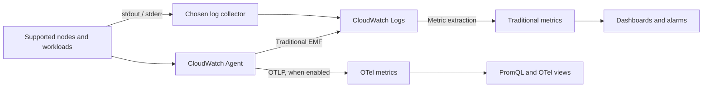

# CloudWatch 指标

> **最后更新**: September 13, 2026
> Helm 示例：amazon-cloudwatch-observability 6.6.0。
> 下文历史性的 4 月/7 月公告保留其实际日期。

## 简介

CloudWatch 管理存储、查询、仪表板和告警。团队仍需配置
采集器、工作负载身份、网络访问、基数、保留期和响应
所有权。托管后端并不会消除这些运维责任。

| 主题 | CloudWatch | 自管 Prometheus / VictoriaMetrics |
| --- | --- | --- |
| 后端 | AWS 托管服务；功能/Region 可用性各不相同 | 运营容量、存储、升级和恢复 |
| 采集 | AWS 服务指标，以及已配置的 agent/SDK/OTLP | Exporter、agent、抓取和远程写入 |
| 查询 | Metric Math、Metrics Insights；OTel 指标使用 PromQL | PromQL / MetricsQL |
| 成本 | 指标/观测数据或 OTLP 摄取模型、日志、查询和告警 | 计算/存储/网络加运维 |
| 平台 | AWS 以及受支持的混合/多云采集 | 云中立的部署选择 |
| 保留期 | 取决于指标模型和分辨率；日志具有单独的保留期 | 已配置的存储/保留策略 |

## Container Insights：选择指标模型

CloudWatch Observability EKS add-on 和 Helm chart 配置 Operator 及
采集组件。传统 Container Insights 使用性能日志事件和提取出的 CloudWatch
指标；基于 OTel 的 Container Insights 发送 OpenTelemetry
指标并可使用 PromQL。这些是不同的命名、维度和计费模型。

| 传统 `ContainerInsights` 指标 | 含义和示例维度集 |
| --- | --- |
| `cluster_node_count` | Node 数量；`ClusterName` |
| `cluster_failed_node_count` | 处于故障状况的 Node；`ClusterName`。并非专指 `NotReady` |
| `node_cpu_utilization`, `node_memory_utilization` | Node 利用率；`ClusterName`，或 `NodeName,ClusterName,InstanceId` |
| `node_network_total_bytes` | 网络吞吐量，单位为**字节/秒**，不是累积字节计数器 |
| `namespace_number_of_running_pods` | Pod 数量；`Namespace,ClusterName` |
| `pod_cpu_utilization`, `pod_memory_utilization` | 相对于 **node** 限制的 Pod 使用率；对于 Pod 限制比率，请使用文档中的 `_over_pod_limit` 指标 |
| `pod_number_of_container_restarts` | 一个 Pod 中的重启总数；`PodName,Namespace,ClusterName` |

文档列表不包含 `cluster_cpu_utilization` 或
`cluster_memory_utilization`。仅带有 `ClusterName` 的 node 指标并不自动
成为按容量加权的集群利用率计算。请匹配已发布的精确
维度集。某些字段仅出现在性能日志中，而增强指标
具有额外的集合，例如 `FullPodName`；不要根据日志字段臆造指标名称。
网络接收/发送指标也是速率。不要像对待单调字节计数器那样
对它们应用 `RATE()`。

下图分离了传统指标提取、可选的 OTLP 指标和应用日志。



### 安装和平台范围

对于相同组件，使用 EKS 托管 add-on 或 Helm 拥有的安装之一。
切换前先确定所有权；不要不加辨别地同时安装两者。
对于托管 add-on，请根据实际 Kubernetes 版本、
架构、计算类型和 Region 发现兼容性。Helm 版本不是 EKS
`v…-eksbuild.…` 版本。

```bash
# Read-only discovery. Use the intended account, Region and cluster.
export AWS_REGION=ap-northeast-2
export CLUSTER_NAME=my-cluster
K8S_VERSION=$(aws eks describe-cluster --name "$CLUSTER_NAME" \
  --region "$AWS_REGION" --query 'cluster.version' --output text)
aws eks describe-addon-versions \
  --addon-name amazon-cloudwatch-observability \
  --kubernetes-version "$K8S_VERSION" --region "$AWS_REGION" \
  --query 'addons[0].addonVersions[].{version:addonVersion,architectures:architecture,computeTypes:computeTypes,compatibilities:compatibilities}'

# Set ADDON_VERSION to the exact compatible version selected above.
: "${ADDON_VERSION:?Select a compatible EKS add-on version}"
aws eks describe-addon-configuration \
  --addon-name amazon-cloudwatch-observability \
  --addon-version "$ADDON_VERSION" --region "$AWS_REGION" \
  --query configurationSchema --output text > addon-schema.json
```

请单独准备 add-on 文档中要求的 IAM 权限和工作负载身份。
对于受支持版本，add-on 指南推荐 EKS Pod Identity；它
需要一个 Agent，以及实际 namespace/service account 的关联。
IRSA 是替代方案，需要集群 OIDC provider、信任策略和 service
account annotation。本地 `aws sts get-caller-identity` 只能标识该调用方，
而不是采集器内部使用的凭证。

该 add-on 在 Linux 和 Windows worker node 上支持 Container Insights，
从 1.5.0 开始支持 Windows；EKS Windows 上不支持 Application Signals。
Fargate 不运行此类 host-mounted DaemonSet；请使用其文档化的采集路径。
请依据所选 add-on 支持的计算
类型和采集要求检查 Auto Mode 和混合集群。不要承诺所有
平台上都有相同的 host 指标。工作负载、采集器和 AWS endpoint 还需要相关的网络
路径及 RBAC。

以下 Helm 示例面向 **Linux EC2 worker node**。Chart 6.6.0 声明的
agent 镜像为 `1.300072.0b1766`；公开的 agent GitHub release `v1.300071.0` 是
不同的发布通道。该 chart 已固定版本，并保留其默认镜像。
此次审查渲染了 chart，而非实时 EKS 部署。

```yaml
# cloudwatch-values.yaml: reviewed Helm chart 6.6.0, Linux EC2 example
clusterName: my-cluster
region: ap-northeast-2
containerInsights:
  enabled: true
containerLogs:
  enabled: true
applicationSignals:
  enabled: false
otelContainerInsights:
  enabled: false
  logs:
    enabled: false
```

在此 chart 中，CloudWatch agent 和 Fluent Bit 使用 release namespace 中的
`cloudwatch-agent` service account。在期待遥测数据之前，请准备其 Pod Identity 关联。
对于 IRSA，请在该实际 service account 上配置并维护 annotation；顶层
chart 的 `roleArn` **不是** EKS IRSA 快捷方式。检查生成的 CRD、ClusterRole、Secret、
host mount 和 node selector。Operator 从 `AmazonCloudWatchAgent` custom resource
创建 agent 工作负载；单独执行 `helm template` 不会执行该协调。

Chart 6.6.0 即使在此 Linux 示例中也会渲染两个 Windows 专用 agent CR，
它们为 Windows node 选择。Linux 的 `applicationSignals.enabled: false`
设置不会移除这些 Windows CR。此示例假定仅有 Linux node；在混合集群中使用前，
请单独检查生成的 Windows 配置。

```bash
helm repo add aws-observability https://aws-observability.github.io/helm-charts
helm repo update aws-observability
helm template cloudwatch aws-observability/amazon-cloudwatch-observability \
  --version 6.6.0 --namespace amazon-cloudwatch \
  --include-crds --values cloudwatch-values.yaml > cloudwatch-rendered.yaml

# Installation changes the cluster; run only after reviewing ownership and prerequisites.
helm upgrade --install cloudwatch aws-observability/amazon-cloudwatch-observability \
  --version 6.6.0 --namespace amazon-cloudwatch --create-namespace \
  --values cloudwatch-values.yaml
```

`eksctl utils update-cluster-logging` 配置的是 **EKS control-plane 日志**。它
不会安装 CloudWatch Agent 或启用 Container Insights。

### OTel 迁移和历史公告

当前 OTel Container Insights 指南推荐新开发使用 OTel 路径，
并将传统路径描述为维护模式。OTel 默认禁用；该指南要求 add-on 6.2.0 或更高版本。请检查实际兼容的
add-on 版本和功能可用性，而不只是该最低版本。

对于已审查的 chart，在评估 OTel 指标模型后启用 `otelContainerInsights.enabled`。
在迁移期间保留 `containerInsights.enabled: true` 允许同时使用两个
指标路径，需评估额外的摄取/成本。该示例保持 `otelContainerInsights.logs.enabled: false`，同时由 Fluent Bit
采集日志；请审慎选择日志所有权，而不是重复采集。

OTel 指标保留诸如 `container_cpu_usage_seconds_total` 的源名称，并且
支持来自源/资源/Kubernetes 元数据的最多 150 个 label。传统
`PutMetricData` 指标有单独的 30 个 dimension 限制。额外 label 会增加
payload 大小并可能暴露元数据；它们不是免费或无限的基数
预算。加速器指标仍需要受支持的 driver/plugin/toolkit。

**2026-04-02 preview 公告**列出了 N. Virginia、Oregon、Sydney、
Singapore 和 Ireland。这是有日期的发布记录，不是今天完整的可用性
或定价表。**2026-07-06 Service Events 公告**描述了活跃的 Application Signals 应用的错误、
延迟和部署事件、受支持的 Java/Python/JavaScript instrumentation 以及可选的 function 指标。Application
Signals 必须实际启用并进行了 instrumentation；上面的仅指标示例并未启用它。即使公告 URL 包含 `/06/`，
也请保留 7 月日期。

## CloudWatch Agent 配置

### 正确的传统 Container Insights JSON

Kubernetes 采集器属于 **`logs.metrics_collected.kubernetes`** 下。
此片段展示传统采集配置；它不是完整的
DaemonSet、身份策略，也不能替代所有生成的 add-on 设置。
JSON 不允许内联注释。

```json
{
  "logs": {
    "metrics_collected": {
      "kubernetes": {
        "cluster_name": "my-cluster",
        "metrics_collection_interval": 60,
        "enhanced_container_insights": true
      }
    }
  }
}
```

不要在 `metrics.metrics_collected` 下放置第二个 Kubernetes 采集器。
使用 Helm chart 时，自定义 `agent.config` 会覆盖生成的默认值，可能
移除 Application Signals、trace 或其他已配置的采集。请从
有效的渲染配置开始，并保留打算继续使用的功能。
修改未被运行工作负载挂载的 ConfigMap 没有任何效果。

chart/Operator 提供 service account、发现 RBAC、配置 mount
和运行时专用 host path。手写的 DaemonSet 需要所有这些，并且
必须考虑其平台。不要将仅有 Docker socket 的部署复制到
containerd/Fargate/Auto Mode 环境并假定行为等同。
host 级采集是特权访问；限制可以更改其工作负载和
service account 的人员。

增强可观测性增加指标和维度，但一些 reserved-capacity
指标已存在于传统列表中。请验证增强指标目录
和计费模型，而不是将每个 reserved/GPU 指标都视为仅增强版。
GPU/EFA/Neuron 采集还依赖相关的受支持 node 硬件和
软件。

## 自定义指标采集

### 目标选择和维度 label

每个目标只使用一个采集所有者：CloudWatch Agent Prometheus 采集、
ADOT/EMF，或合适的 OTLP 路径。从每个 DaemonSet replica 抓取所有 Pod
可能会成倍增加样本和费用。singleton Deployment 是一种简单的所有权
模型；HA/sharding 需要经过审查的分配策略。

此示例预期 `/metrics` 上有名为 `queue_depth` 的 **gauge**、名为 `metrics` 的
Pod container port、annotation `prometheus.io/scrape: "true"`，以及 namespace
`default` 中的 label `app.kubernetes.io/name`。目标必须可访问且已获授权；
请添加与实际 endpoint 相匹配的 TLS/authentication。此 HTTP 抓取
片段假定使用允许的内部 endpoint，而非公共 metrics service。

将以下内容保存为 `prometheus.yaml`。它选择命名 port，并创建 EMF 声明所需的
**全部三个** label 值。EMF dimension 列表不会创建缺失的 label。
用于 `Service` 的 Pod label 是逻辑服务身份；它不能证明 Kubernetes Service 对象存在。

```yaml
global:
  scrape_interval: 30s
  scrape_timeout: 10s
scrape_configs:
- job_name: my-app
  kubernetes_sd_configs:
  - role: pod
    namespaces:
      names:
      - default
  relabel_configs:
  - source_labels:
    - __meta_kubernetes_pod_annotation_prometheus_io_scrape
    action: keep
    regex: 'true'
  - source_labels:
    - __meta_kubernetes_pod_container_port_name
    action: keep
    regex: metrics
  - source_labels:
    - __meta_kubernetes_namespace
    target_label: Namespace
  - source_labels:
    - __meta_kubernetes_pod_label_app_kubernetes_io_name
    target_label: Service
  - source_labels:
    - Service
    action: keep
    regex: .+
  - target_label: ClusterName
    replacement: my-cluster
  metric_relabel_configs:
  - source_labels:
    - __name__
    action: keep
    regex: queue_depth
```

### CloudWatch Agent Prometheus 配置

agent 的 JSON 和 Prometheus YAML 是两个独立文件。将前者挂载在
agent 配置的输入路径中，并将后者挂载在下文引用的精确
`/etc/prometheusconfig/prometheus.yaml` 路径中。这是独立拥有的采集器
配置，不是完整安装，也不是要粘贴到每个 Container Insights DaemonSet 中的覆盖配置。

```json
{
  "logs": {
    "metrics_collected": {
      "prometheus": {
        "cluster_name": "my-cluster",
        "log_group_name": "/aws/containerinsights/my-cluster/prometheus",
        "prometheus_config_path": "/etc/prometheusconfig/prometheus.yaml",
        "emf_processor": {
          "metric_declaration_dedup": true,
          "metric_namespace": "CustomMetrics",
          "metric_unit": {
            "queue_depth": "Count"
          },
          "metric_declaration": [
            {
              "source_labels": [
                "job"
              ],
              "label_matcher": "^my-app$",
              "dimensions": [
                [
                  "ClusterName",
                  "Namespace",
                  "Service"
                ]
              ],
              "metric_selectors": [
                "^queue_depth$"
              ]
            }
          ]
        }
      }
    }
  }
}
```

官方传统 Prometheus 集成文档说明支持 gauge、counter 和 summary，
而非自动导入 Prometheus histogram。Counter 增量、首次样本、
重置和 summary 字段需要各自解释。此示例刻意使用 gauge：
`Average`/`Maximum` 描述队列深度，而汇总快照不会计算已处理的请求。
请在适当时使用 OTel 路径，并单独验证其实际的 histogram/temporality 映射。

### AWS Distro for OpenTelemetry (ADOT)

对于 **EMF 路径**，带有 `prometheus` receiver 和 `awsemf`
exporter 的 ADOT collector 可以使用以下 `config.yaml`。审查的 ADOT release 是
`v0.50.0`；请确认其镜像/平台以及为你的部署启用的组件。
exporter 发送 EMF 日志事件，CloudWatch 将其提取为传统
指标。这并不意味着每个现代 CloudWatch/OTLP 路径都使用 EMF。

```yaml
receivers:
  prometheus:
    config:
      global:
        scrape_interval: 30s
        scrape_timeout: 10s
      scrape_configs:
      - job_name: my-app
        kubernetes_sd_configs:
        - role: pod
          namespaces:
            names:
            - default
        relabel_configs:
        - source_labels:
          - __meta_kubernetes_pod_annotation_prometheus_io_scrape
          action: keep
          regex: 'true'
        - source_labels:
          - __meta_kubernetes_pod_container_port_name
          action: keep
          regex: metrics
        - source_labels:
          - __meta_kubernetes_namespace
          target_label: Namespace
        - source_labels:
          - __meta_kubernetes_pod_label_app_kubernetes_io_name
          target_label: Service
        - source_labels:
          - Service
          action: keep
          regex: .+
        - target_label: ClusterName
          replacement: my-cluster
        metric_relabel_configs:
        - source_labels:
          - __name__
          action: keep
          regex: queue_depth
processors:
  memory_limiter:
    check_interval: 1s
    limit_mib: 384
    spike_limit_mib: 64
  batch:
    timeout: 10s
exporters:
  awsemf:
    region: ap-northeast-2
    namespace: CustomMetrics
    log_group_name: /aws/containerinsights/my-cluster/prometheus
    dimension_rollup_option: NoDimensionRollup
    metric_declarations:
    - dimensions:
      - - ClusterName
        - Namespace
        - Service
      metric_name_selectors:
      - ^queue_depth$
service:
  pipelines:
    metrics:
      receivers:
      - prometheus
      processors:
      - memory_limiter
      - batch
      exporters:
      - awsemf
```

collector 必须以配置 mount 和指向该文件的 `--config` 运行，
其工作负载 IAM 凭证必须允许写入预期的 **Standard-class** EMF log
 group/stream，并且内存限制应与 limiter 一致。它还需要
Kubernetes 发现 RBAC，以及访问选定目标和 AWS Logs 的网络权限。
以下 Role 的范围限于一个被发现的 namespace；请先创建
`amazon-cloudwatch` namespace，并将此 SA 绑定到实际 collector。

```yaml
apiVersion: v1
kind: ServiceAccount
metadata:
  name: metrics-scraper
  namespace: amazon-cloudwatch
---
apiVersion: rbac.authorization.k8s.io/v1
kind: Role
metadata:
  name: metrics-pod-discovery
  namespace: default
rules:
- apiGroups:
  - ''
  resources:
  - pods
  verbs:
  - get
  - list
  - watch
---
apiVersion: rbac.authorization.k8s.io/v1
kind: RoleBinding
metadata:
  name: metrics-pod-discovery
  namespace: default
roleRef:
  apiGroup: rbac.authorization.k8s.io
  kind: Role
  name: metrics-pod-discovery
subjects:
- kind: ServiceAccount
  name: metrics-scraper
  namespace: amazon-cloudwatch
```

IAM 和 Kubernetes RBAC 是独立的。将 collector SA 与它自己的
Pod Identity role 或正确配置的 IRSA role 关联；此
RBAC manifest 不会创建 role。预先创建/拥有 log group，或明确授权其创建。
使用更多 replica 或 namespace 时，请检查目标所有权，并且仅扩展必要的发现权限。
在本次审查期间未部署这些配置片段，也未用其发送指标。

### 通过 SDK 发送自定义指标

这些是可复用的 helper，不是独立可执行程序。调用方创建并
复用具有预期 Region、工作负载凭证、超时和重试策略的 boto3/AWS SDK for Go v2 CloudWatch client。
错误会传播给该调用方。没有嵌入凭证。Python 时间戳是带时区的 UTC。
该值是应用报告间隔内的计数；请在匹配的时间窗口中用
`Sum` 查询，而不是将其视为累积计数器。
`PutMetricData` 没有幂等性 token，因此不明确的重试可能重复样本；
不要将遥测提交当作恰好一次的业务账本。

```python
from datetime import datetime, timezone


def put_orders_processed(cloudwatch, count):
    """The caller supplies a configured boto3 CloudWatch client."""
    if isinstance(count, bool) or not isinstance(count, int) or count < 0:
        raise ValueError("count must be a non-negative integer")
    return cloudwatch.put_metric_data(
        Namespace="MyApp/Production",
        MetricData=[{
            "MetricName": "OrdersProcessed",
            "Dimensions": [
                {"Name": "Service", "Value": "order-service"},
                {"Name": "Environment", "Value": "production"},
            ],
            "Timestamp": datetime.now(timezone.utc),
            "Value": count,
            "Unit": "Count",
            "StorageResolution": 60,
        }],
    )
```

```go
package metrics

import (
    "context"
    "time"

    "github.com/aws/aws-sdk-go-v2/aws"
    "github.com/aws/aws-sdk-go-v2/service/cloudwatch"
    "github.com/aws/aws-sdk-go-v2/service/cloudwatch/types"
)

func PutOrdersProcessed(ctx context.Context, client *cloudwatch.Client, count uint64) error {
    _, err := client.PutMetricData(ctx, &cloudwatch.PutMetricDataInput{
        Namespace: aws.String("MyApp/Production"),
        MetricData: []types.MetricDatum{{
            MetricName: aws.String("OrdersProcessed"),
            Dimensions: []types.Dimension{
                {Name: aws.String("Service"), Value: aws.String("order-service")},
                {Name: aws.String("Environment"), Value: aws.String("production")},
            },
            Timestamp: aws.Time(time.Now().UTC()),
            Value: aws.Float64(float64(count)),
            Unit: types.StandardUnitCount,
            StorageResolution: aws.Int32(60),
        }},
    })
    return err
}
```

Namespace、指标名称和**完整维度集**共同标识一个传统
指标。省略 `Environment` 会查询不同的标识；自定义 dimension 不会
自动生成所有聚合序列。请在文档化的 API 限制内批处理，并使用
`cloudwatch:namespace` IAM condition 将 `cloudwatch:PutMetricData` 限制到预期 namespace。

## Metric Math 和 Anomaly Detection

### Metric Math

相关序列使用相同的时间周期、维度和兼容单位。
ALB target-error 和 request 指标都是计数，因此 widget 使用 **Sum**。
确认实际 load-balancer dimension 值，以及两个指标都属于它。

```json
{
  "metrics": [
    [{"expression": "IF(m2>0,100*m1/m2)", "label": "Target 5xx / requests (%)", "id": "e1"}],
    ["AWS/ApplicationELB", "HTTPCode_Target_5XX_Count", "LoadBalancer", "app/replace-with-your-alb/id", {"id": "m1", "visible": false}],
    [".", "RequestCount", ".", ".", {"id": "m2", "visible": false}]
  ],
  "view": "timeSeries",
  "region": "ap-northeast-2",
  "period": 60,
  "stat": "Sum"
}
```

CloudWatch 算术将缺失数据点视为零；除以零会丢弃
结果。`IF` 会将零流量周期排除在该比率之外。对于没有发布 target-5xx 计数的请求
流量，缺失的分子贡献零。请区分这种文档化的稀疏指标行为和
损坏的采集路径；缺失的请求遥测不应被表述为健康的零错误结果。

| 表达式或设置 | 含义 / 限制 |
| --- | --- |
| `SUM(METRICS())`, `AVG(METRICS())` | 组合 widget 的指标时间序列；不是时间移动平均 |
| `AVG(m1)`, `STDDEV(m1)` | 一个序列的标量摘要；不能单独作为最终时间序列结果 |
| `DIFF(m1)`, `RATE(m1)` | 数据点的差值/速率；检查源语义、稀疏性和重置 |
| `FILL(m1,0)` | 显式填充；若没有独立的新鲜度检查，可能掩盖遥测中断 |
| 指标 statistic `p95` | 所选指标合格样本的百分位数 |
| `period: 300`, `stat: "Average"` | 五分钟聚合 bucket；不是滑动五分钟均值 |
| `SEARCH(...)` | dashboard 的匹配指标序列数组；不能直接用于告警 |
| `SLICE(SORT(SEARCH(...), AVG, DESC), 0, 10)` | 按评估范围内的平均值对匹配序列排序并保留十个 |

`PERCENTILE(m1,95)` 和 `AVG(METRICS()) PERIOD(300)` 不是有效的 Metric Math。
在支持时选择 `p95` 作为指标 statistic。对服务级 p95 值求平均或百分位数
不能重建全局请求延迟 p95：
这需要在采集层进行兼容的分布/样本聚合。
不要混用 CloudWatch Metric Math 语义和 PromQL。

### Anomaly Detection

CloudWatch Anomaly Detection 使用 ML 自动检测异常指标模式。

```bash
# Enable anomaly detection via CLI
aws cloudwatch put-anomaly-detector \
  --namespace ContainerInsights \
  --metric-name pod_cpu_utilization \
  --stat Average \
  --dimensions Name=ClusterName,Value=my-cluster

# Create anomaly detection alarm
aws cloudwatch put-metric-alarm \
  --alarm-name "AnomalyDetection-PodCPU" \
  --comparison-operator LessThanLowerOrGreaterThanUpperThreshold \
  --evaluation-periods 2 \
  --metrics '[
    {
      "Id": "m1",
      "MetricStat": {
        "Metric": {
          "Namespace": "ContainerInsights",
          "MetricName": "pod_cpu_utilization",
          "Dimensions": [{"Name": "ClusterName", "Value": "my-cluster"}]
        },
        "Period": 300,
        "Stat": "Average"
      },
      "ReturnData": true
    },
    {
      "Id": "ad1",
      "Expression": "ANOMALY_DETECTION_BAND(m1, 2)",
      "ReturnData": true
    }
  ]' \
  --threshold-metric-id ad1 \
  --alarm-actions arn:aws:sns:ap-northeast-2:123456789012:my-alerts
```

### 使用 Terraform 的 Anomaly Detection

```hcl
resource "aws_cloudwatch_metric_alarm" "anomaly_detection" {
  alarm_name          = "pod-cpu-anomaly"
  comparison_operator = "LessThanLowerOrGreaterThanUpperThreshold"
  evaluation_periods  = 2
  threshold_metric_id = "ad1"

  metric_query {
    id          = "m1"
    return_data = true

    metric {
      metric_name = "pod_cpu_utilization"
      namespace   = "ContainerInsights"
      period      = 300
      stat        = "Average"

      dimensions = {
        ClusterName = var.cluster_name
      }
    }
  }

  metric_query {
    id          = "ad1"
    expression  = "ANOMALY_DETECTION_BAND(m1, 2)"
    label       = "Anomaly Detection Band"
    return_data = true
  }

  alarm_actions = [var.alert_topic_arn]

  tags = {
    Environment = "production"
  }
}
```

## 创建 Dashboard

### CloudFormation

此模板保留了 node CPU/内存/计数、namespace Pod 计数、网络吞吐量
和前十 Pod 视图。请使用实际发布的 namespace/dimension。
`namespace_number_of_running_pods` 是 Pod 计数；计算运行中的 **container**
不会得到相同值。计数快照使用 `Average`，而不是重复样本的 `Sum`。
网络指标已经是字节/秒。前十视图按所选范围内的序列排序；
它不是单独的十 Pod 告警。

```yaml
AWSTemplateFormatVersion: '2010-09-09'
Description: Traditional Container Insights dashboard
Parameters:
  ClusterName:
    Type: String
    MinLength: 1
  NamespaceName:
    Type: String
    Default: default
    MinLength: 1
Resources:
  Dashboard:
    Type: AWS::CloudWatch::Dashboard
    Properties:
      DashboardName:
        Fn::Sub: ${AWS::StackName}-${AWS::Region}
      DashboardBody:
        Fn::Sub: |-
          {
            "widgets": [
              {
                "type": "metric",
                "x": 0,
                "y": 0,
                "width": 8,
                "height": 6,
                "properties": {
                  "title": "Node CPU (ClusterName series)",
                  "region": "${AWS::Region}",
                  "period": 60,
                  "stat": "Average",
                  "view": "timeSeries",
                  "metrics": [
                    [
                      "ContainerInsights",
                      "node_cpu_utilization",
                      "ClusterName",
                      "${ClusterName}"
                    ]
                  ]
                }
              },
              {
                "type": "metric",
                "x": 8,
                "y": 0,
                "width": 8,
                "height": 6,
                "properties": {
                  "title": "Node memory (ClusterName series)",
                  "region": "${AWS::Region}",
                  "period": 60,
                  "stat": "Average",
                  "view": "timeSeries",
                  "metrics": [
                    [
                      "ContainerInsights",
                      "node_memory_utilization",
                      "ClusterName",
                      "${ClusterName}"
                    ]
                  ]
                }
              },
              {
                "type": "metric",
                "x": 16,
                "y": 0,
                "width": 8,
                "height": 6,
                "properties": {
                  "title": "Node count",
                  "region": "${AWS::Region}",
                  "period": 60,
                  "stat": "Average",
                  "view": "singleValue",
                  "metrics": [
                    [
                      "ContainerInsights",
                      "cluster_node_count",
                      "ClusterName",
                      "${ClusterName}"
                    ]
                  ]
                }
              },
              {
                "type": "metric",
                "x": 0,
                "y": 6,
                "width": 8,
                "height": 6,
                "properties": {
                  "title": "Running pods in namespace",
                  "region": "${AWS::Region}",
                  "period": 60,
                  "stat": "Average",
                  "view": "timeSeries",
                  "metrics": [
                    [
                      "ContainerInsights",
                      "namespace_number_of_running_pods",
                      "Namespace",
                      "${NamespaceName}",
                      "ClusterName",
                      "${ClusterName}"
                    ]
                  ]
                }
              },
              {
                "type": "metric",
                "x": 8,
                "y": 6,
                "width": 8,
                "height": 6,
                "properties": {
                  "title": "Node network (bytes/second)",
                  "region": "${AWS::Region}",
                  "period": 60,
                  "stat": "Average",
                  "view": "timeSeries",
                  "metrics": [
                    [
                      "ContainerInsights",
                      "node_network_total_bytes",
                      "ClusterName",
                      "${ClusterName}"
                    ]
                  ]
                }
              },
              {
                "type": "metric",
                "x": 16,
                "y": 6,
                "width": 8,
                "height": 6,
                "properties": {
                  "title": "Top 10 pod series by average CPU",
                  "region": "${AWS::Region}",
                  "view": "timeSeries",
                  "period": 60,
                  "metrics": [
                    [
                      {
                        "expression": "SLICE(SORT(SEARCH('{ContainerInsights,ClusterName,Namespace,PodName} MetricName=\"pod_cpu_utilization\" ClusterName=\"${ClusterName}\"', 'Average', 60), AVG, DESC), 0, 10)",
                        "id": "top10",
                        "label": "Pod CPU"
                      }
                    ]
                  ]
                }
              }
            ]
          }
```

### Terraform

在根 module 中使用以下 HCL 片段，该 module 中的 AWS provider 由你的
版本约束/lock file 固定，并针对预期 account/Region 进行配置。
为 anomaly、dashboard 和 alarm 示例声明这些输入一次；提供现有 SNS topic ARN，
而不是引用未声明的 topic resource。

```hcl
variable "cluster_name" {
  type = string
}
variable "namespace_name" {
  type    = string
  default = "default"
}
variable "region" {
  type = string
}
variable "alert_topic_arn" {
  type = string
}
```
```hcl
resource "aws_cloudwatch_dashboard" "eks_monitoring" {
  dashboard_name = "${var.cluster_name}-${var.region}-metrics"
  dashboard_body = jsonencode({
  "widgets": [
    {
      "type": "metric",
      "x": 0,
      "y": 0,
      "width": 8,
      "height": 6,
      "properties": {
        "title": "Node CPU (ClusterName series)",
        "region": "${var.region}",
        "period": 60,
        "stat": "Average",
        "view": "timeSeries",
        "metrics": [
          [
            "ContainerInsights",
            "node_cpu_utilization",
            "ClusterName",
            "${var.cluster_name}"
          ]
        ]
      }
    },
    {
      "type": "metric",
      "x": 8,
      "y": 0,
      "width": 8,
      "height": 6,
      "properties": {
        "title": "Node memory (ClusterName series)",
        "region": "${var.region}",
        "period": 60,
        "stat": "Average",
        "view": "timeSeries",
        "metrics": [
          [
            "ContainerInsights",
            "node_memory_utilization",
            "ClusterName",
            "${var.cluster_name}"
          ]
        ]
      }
    },
    {
      "type": "metric",
      "x": 16,
      "y": 0,
      "width": 8,
      "height": 6,
      "properties": {
        "title": "Node count",
        "region": "${var.region}",
        "period": 60,
        "stat": "Average",
        "view": "singleValue",
        "metrics": [
          [
            "ContainerInsights",
            "cluster_node_count",
            "ClusterName",
            "${var.cluster_name}"
          ]
        ]
      }
    },
    {
      "type": "metric",
      "x": 0,
      "y": 6,
      "width": 8,
      "height": 6,
      "properties": {
        "title": "Running pods in namespace",
        "region": "${var.region}",
        "period": 60,
        "stat": "Average",
        "view": "timeSeries",
        "metrics": [
          [
            "ContainerInsights",
            "namespace_number_of_running_pods",
            "Namespace",
            "${var.namespace_name}",
            "ClusterName",
            "${var.cluster_name}"
          ]
        ]
      }
    },
    {
      "type": "metric",
      "x": 8,
      "y": 6,
      "width": 8,
      "height": 6,
      "properties": {
        "title": "Node network (bytes/second)",
        "region": "${var.region}",
        "period": 60,
        "stat": "Average",
        "view": "timeSeries",
        "metrics": [
          [
            "ContainerInsights",
            "node_network_total_bytes",
            "ClusterName",
            "${var.cluster_name}"
          ]
        ]
      }
    },
    {
      "type": "metric",
      "x": 16,
      "y": 6,
      "width": 8,
      "height": 6,
      "properties": {
        "title": "Top 10 pod series by average CPU",
        "region": "${var.region}",
        "view": "timeSeries",
        "period": 60,
        "metrics": [
          [
            {
              "expression": "SLICE(SORT(SEARCH('{ContainerInsights,ClusterName,Namespace,PodName} MetricName=\"pod_cpu_utilization\" ClusterName=\"${var.cluster_name}\"', 'Average', 60), AVG, DESC), 0, 10)",
              "id": "top10",
              "label": "Pod CPU"
            }
          ]
        ]
      }
    }
  ]
})
}
```

## 告警配置

以下 CloudFormation 模板独立于 dashboard 模板；它声明了自身输入。
阈值只是示例，并非通用事件标准。
仅 `ClusterName` 的 node 序列可能掩盖一个过热 node；请检查每个 node 序列
以及所需的聚合。验证告警传递和缺失数据行为。

```yaml
AWSTemplateFormatVersion: '2010-09-09'
Description: Example traditional metric alarms; tune thresholds
Parameters:
  ClusterName:
    Type: String
    MinLength: 1
  NamespaceName:
    Type: String
    Default: default
    MinLength: 1
  PodMetricName:
    Type: String
    Description: Exact published PodName dimension value
    MinLength: 1
  AlertTopicArn:
    Type: String
    Description: Existing authorized SNS topic with confirmed delivery
    AllowedPattern: ^arn:[^:]+:sns:[^:]+:[0-9]{12}:.+$
Resources:
  HighCPU:
    Type: AWS::CloudWatch::Alarm
    Properties:
      AlarmDescription: Node CPU ClusterName series exceeds the example threshold
      Namespace: ContainerInsights
      MetricName: node_cpu_utilization
      Dimensions:
      - Name: ClusterName
        Value:
          Ref: ClusterName
      Statistic: Average
      Period: 300
      EvaluationPeriods: 2
      DatapointsToAlarm: 2
      Threshold: 80
      ComparisonOperator: GreaterThanThreshold
      TreatMissingData: missing
      AlarmActions:
      - Ref: AlertTopicArn
  HighMemory:
    Type: AWS::CloudWatch::Alarm
    Properties:
      AlarmDescription: Node memory ClusterName series exceeds the example threshold
      Namespace: ContainerInsights
      MetricName: node_memory_utilization
      Dimensions:
      - Name: ClusterName
        Value:
          Ref: ClusterName
      Statistic: Average
      Period: 300
      EvaluationPeriods: 2
      DatapointsToAlarm: 2
      Threshold: 85
      ComparisonOperator: GreaterThanThreshold
      TreatMissingData: missing
      AlarmActions:
      - Ref: AlertTopicArn
  PodRestartTotal:
    Type: AWS::CloudWatch::Alarm
    Properties:
      AlarmDescription: Observed restart total exceeds 5; not five new restarts per
        period
      Namespace: ContainerInsights
      MetricName: pod_number_of_container_restarts
      Dimensions:
      - Name: ClusterName
        Value:
          Ref: ClusterName
      - Name: Namespace
        Value:
          Ref: NamespaceName
      - Name: PodName
        Value:
          Ref: PodMetricName
      Statistic: Maximum
      Period: 300
      EvaluationPeriods: 2
      DatapointsToAlarm: 2
      Threshold: 5
      ComparisonOperator: GreaterThanThreshold
      TreatMissingData: missing
      AlarmActions:
      - Ref: AlertTopicArn
```

重启告警评估的是**总量**，不是五分钟内新增五次重启。
使用精确的 `PodName` 指标 dimension；它可能表示工作负载规范化的
名称，而不是完整 Kubernetes pod 名称。Pod 替换和指标标识
变化可能重置/拆分观测值。对于近期重启告警，请单独定义和验证
delta/rate 采集及重置行为。

异常检测模型需要合适的历史数据，并非事件的即时证据。
在文档化的 anomaly-alarm 形式中，观测序列和 `ANOMALY_DETECTION_BAND` 查询都可以有
`ReturnData: true`；不要盲目套用通用的
单输出 math-alarm 规则以移除所需序列。

### Terraform 告警

```hcl
resource "aws_cloudwatch_metric_alarm" "high_cpu" {
  alarm_name          = "${var.cluster_name}-node-cpu"
  comparison_operator = "GreaterThanThreshold"
  evaluation_periods  = 2
  datapoints_to_alarm  = 2
  metric_name         = "node_cpu_utilization"
  namespace           = "ContainerInsights"
  period              = 300
  statistic           = "Average"
  threshold           = 80
  treat_missing_data  = "missing"
  alarm_description   = "Node CPU ClusterName series exceeds the example threshold"
  dimensions          = { ClusterName = var.cluster_name }
  alarm_actions       = [var.alert_topic_arn]
  ok_actions          = [var.alert_topic_arn]
}

resource "aws_cloudwatch_metric_alarm" "failed_nodes" {
  alarm_name          = "${var.cluster_name}-failed-nodes"
  comparison_operator = "GreaterThanThreshold"
  evaluation_periods  = 2
  datapoints_to_alarm  = 2
  metric_name         = "cluster_failed_node_count"
  namespace           = "ContainerInsights"
  period              = 60
  statistic           = "Maximum"
  threshold           = 0
  treat_missing_data  = "missing"
  alarm_description   = "Node failure conditions; inspect the actual conditions"
  dimensions          = { ClusterName = var.cluster_name }
  alarm_actions       = [var.alert_topic_arn]
}
```

`cluster_failed_node_count` 覆盖 node 故障状况，而不仅是 NotReady。
`TreatMissingData: missing` 会在适当时将遥测缺口显示为数据不足；
除非配置了该操作，它本身不会发送通知。
请使用单独的采集健康检查，并验证 SNS subscription、policy 和
传递。成功的 template/plan 并不证明指标有数据点。

## 成本优化

### 将计费模型与采集匹配

| 路径 | 要验证的成本驱动因素 |
| --- | --- |
| 传统自定义指标 / `PutMetricData` | 已发布的指标/dimension 标识、API 使用量、查询和告警 |
| 带增强可观测性的 EKS Container Insights | 基于观测数据的层级；性能日志存储和 container 日志另计 |
| OTel 指标 | 包含 attribute/resource 元数据的 OTLP 摄取字节数；适用的查询和集中化费用 |
| 日志 | 摄取、存储、查询扫描和已启用功能 |

不要在所有产品和 account offer 中复用固定的 Seoul 价格表，或笼统假定“前十个指标/100 万次 API 调用
免费”。请查阅当前 Region/产品定价和 account 资格。OTel 定价不是传统的
每唯一指标模型。更多 label 仍会增加字节数和披露风险。
同时启用传统和 OTel 采集可能产生两种模型的成本。

一秒自定义指标没有通用的十倍每指标存储费率。
更频繁的 `PutMetricData` 请求和高分辨率告警可能增加
费用。对受支持的请求进行批处理，仅采集所需序列，并根据检测目标
选择分辨率。标准指标保留期会汇总较旧样本；
“15 个月”并不意味着每个一秒样本都可查询 15 个月。

### 保留期是数据删除决策

为明确且经过批准的 log group 设置保留期。较短的保留期可能使
现有历史数据过期；它不仅是未来的计费偏好。绝不要遍历每个没有保留期的
account log group 并分配较短期限。

```bash
# Inspect exactly one owned log group and its current retention before changing it.
: "${AWS_REGION:?Set the intended Region}"
: "${OWNED_LOG_GROUP:?Set one approved log group name}"
aws logs describe-log-groups --region "$AWS_REGION" \
  --log-group-name-prefix "$OWNED_LOG_GROUP" \
  --query 'logGroups[].{name:logGroupName,retention:retentionInDays,class:logGroupClass}'

# Only after checking exact name, ownership and the approved retention requirement:
aws logs put-retention-policy --region "$AWS_REGION" \
  --log-group-name "$OWNED_LOG_GROUP" --retention-in-days 30
```

前缀查询可能返回额外 group。请检查准确名称；写入仅使用
`OWNED_LOG_GROUP`。请应用组织的法律/事件保留
要求，而不是将此示例性的 30 天值视为通用值。
对于可重复操作，请在 log group 所拥有的 IaC 中管理它。

### Infrequent Access 具有功能限制

Standard 和 Infrequent Access 的摄取价格不同；存储和 Logs Insights
查询定价相同。log group 的 class 创建后不能更改。
Infrequent Access **不**支持 EMF、Container Insights 日志摄取、metric
filter、subscription filter 或 Live Tail。不要将本指南的性能/
EMF 日志作为一揽子节省措施移至该 class。请针对符合条件的取证/archive
日志及其支持的查询功能评估它。较低的摄取价格并不意味着
总可观测性账单节省 50%。

### 成本可见性

使用已计费用量和成本分配进行成本分析。`ListMetrics` 用于发现，
不是发票或完整的历史序列清单；非活跃指标可能不会出现。
计算 dimension **名称**不衡量唯一的 dimension-value
组合，因此也不属于基数测量。

CloudWatch `AWS/Billing` 估算费用指标需要启用 billing alert，
并在 **us-east-1** 发布。请验证适用的 account/payer
范围和实际 `Currency`/service dimension。它们会定期更新，
且不是支出上限。使用 AWS Budgets/Cost Explorer 跟踪服务成本和
告警；SNS subscription 也必须已确认并测试其传递。

## 最佳实践

- 将应用 namespace 与 AWS/collector 拥有的 namespace 分开。Namespace 是
  指标标识，而不是本身的 IAM 安全边界。
- 使用稳定的 service/environment dimension；避免 user ID、request ID、原始 URL
  或其他敏感/高基数 label。缺失或重命名 dimension 会改变标识。
- 在选择 `Average`、`Sum`、percentile 或 rate 前，将每个指标分类为 gauge、
  interval count、cumulative counter 或 distribution。检查实际样本/重置。
- 共同定义检测窗口、缺失数据行为和传递所有权。
  使用 SLO/customer impact 加上 resource/collection 健康状况，而不只是 CPU。
- 记录采集模型、固定的版本、IAM/SA 所有权、保留期决策
  和测得的成本。不要只是为匹配示例而切换模型或删除历史数据。

## 故障排除

### 没有指标或出现意外值

先检查**选定的模型**：OTel 源名称不一定是传统的
`ContainerInsights` 名称。检查 Region、namespace、完整 dimension
集、请求的时间范围/statistic 以及采集和可见性之间的延迟。
检查 collector 健康/日志、实际挂载的配置和抓取目标/label
选择。仅有 annotation 并不能保证目标 port/path 正确。

```bash
# Read-only checks; use the actual Region and installation owner.
aws eks describe-addon --cluster-name "$CLUSTER_NAME" \
  --addon-name amazon-cloudwatch-observability --region "$AWS_REGION" \
  --query 'addon.{version:addonVersion,status:status,health:health,config:configurationValues}'
kubectl get amazoncloudwatchagents -n amazon-cloudwatch
kubectl get pods,daemonsets,deployments,serviceaccounts -n amazon-cloudwatch

aws cloudwatch list-metrics --region "$AWS_REGION" \
  --namespace ContainerInsights --metric-name node_cpu_utilization \
  --dimensions "Name=ClusterName,Value=$CLUSTER_NAME"

: "${ALARM_NAME:?Set one alarm name}"
aws cloudwatch describe-alarms --alarm-names "$ALARM_NAME" --region "$AWS_REGION"
aws cloudwatch describe-alarm-history --alarm-name "$ALARM_NAME" \
  --history-item-type StateUpdate --region "$AWS_REGION"
```

`describe-addon` 适用于托管 add-on；仅 Helm 的安装没有
相应 add-on record。`ListMetrics` 过滤会匹配包含
所请求 dimension 的指标，并可能返回额外 dimension。查询前检查返回的
**完整**集。发现不证明近期
数据点、完整历史清单或当前已计费基数。

单独检查 Kubernetes 发现授权和 IAM。检查实际
collector SA/association 或 IRSA trust，以及该工作负载内部选择的 credential provider。
本地 STS 命令或 IAM policy simulation 本身不能证明端到端授权：
SCP、resource policy、endpoint 和运行时身份
可能改变结果。诊断时不要记录临时凭证或 token。

### 高成本或未激活的告警

使用 billing usage category 区分重复抓取、额外 dimension 集、
增强观测数据、OTLP payload、日志、扫描和告警/查询使用量。
在其所有者处移除不需要的采集；不要缩短每个 log group 的保留期。
对于未激活的告警，检查其实际指标数据、state reason、缺失数据
policy 和 history。然后验证 action enablement、SNS topic permission、
subscription confirmation 和传递。未违反阈值的告警与没有可用遥测的
告警是不同状态。

## 验证范围

本指南区分配置/结构检查和已部署行为。
审查期间未执行 EKS 安装、身份/凭证查找、指标/日志提交、保留期
变更、CloudFormation/Terraform apply、真实告警传递或定价测量。
采集器片段需要所述运行时、mount、RBAC、身份和网络前提条件。
在投入运维使用前，请验证实际目标和端到端结果。

本地检查包括 Helm 6.6.0 渲染、agent v1.300071.0 JSON schema、
在 Stubber 下运行的 Python 3.12.13/boto3 1.42.97 请求、HCL 语法和 Markdown/diagram
渲染。chart 保留其较新的声明镜像；schema 检查不是对该运行 binary 的
验证。已在源代码中检查 ADOT v0.50.0 component field 和 Go SDK
CloudWatch v1.72.0 API type；未执行 collector，也未进行 Go 编译。
Metric Math 已根据参考资料和算术情形检查，未调用 CloudWatch expression engine。

## 参考资料

- [EKS add-on 和 Helm 安装](https://docs.aws.amazon.com/AmazonCloudWatch/latest/monitoring/install-CloudWatch-Observability-EKS-addon.html)
- [已审查的 Helm 6.6.0 release](https://github.com/aws-observability/helm-charts/releases/tag/amazon-cloudwatch-observability-6.6.0)
- [传统 EKS 指标和维度](https://docs.aws.amazon.com/AmazonCloudWatch/latest/monitoring/Container-Insights-metrics-EKS.html)
- [增强 EKS 指标](https://docs.aws.amazon.com/AmazonCloudWatch/latest/monitoring/Container-Insights-metrics-enhanced-EKS.html)
- [OTel Container Insights](https://docs.aws.amazon.com/AmazonCloudWatch/latest/monitoring/container-insights-eks-otel.html)
- [OTel 快速入门](https://docs.aws.amazon.com/AmazonCloudWatch/latest/monitoring/container-insights-eks-otel-quickstart.html)
- [4 月 2 日 preview 公告](https://aws.amazon.com/about-aws/whats-new/2026/04/cloudwatch-otel-container-insights-eks/)
- [7 月 6 日 Service Events 公告](https://aws.amazon.com/about-aws/whats-new/2026/06/cloudwatch-service-events/)
- [Agent 配置参考](https://docs.aws.amazon.com/AmazonCloudWatch/latest/monitoring/CloudWatch-Agent-Configuration-File-Details.html)
- [Prometheus / EMF 配置](https://docs.aws.amazon.com/AmazonCloudWatch/latest/monitoring/ContainerInsights-Prometheus-Setup-configure.html)
- [ADOT v0.50.0](https://github.com/aws-observability/aws-otel-collector/releases/tag/v0.50.0)
- [PutMetricData API](https://docs.aws.amazon.com/AmazonCloudWatch/latest/APIReference/API_PutMetricData.html)
- [Namespace IAM condition](https://docs.aws.amazon.com/AmazonCloudWatch/latest/monitoring/iam-cw-condition-keys-namespace.html)
- [Metric Math](https://docs.aws.amazon.com/AmazonCloudWatch/latest/monitoring/using-metric-math.html)
- [Dashboard body 结构](https://docs.aws.amazon.com/AmazonCloudWatch/latest/monitoring/CloudWatch-Dashboard-Body-Structure.html)
- [Log class 功能](https://docs.aws.amazon.com/AmazonCloudWatch/latest/logs/CloudWatch_Logs_Log_Classes.html)
- [CloudWatch 定价](https://aws.amazon.com/cloudwatch/pricing/)
- [Billing alarm 前提条件](https://docs.aws.amazon.com/AmazonCloudWatch/latest/monitoring/monitor_estimated_charges_with_cloudwatch.html)

[测验](../../quizzes/observability/metrics/04-cloudwatch-metrics-quiz.md)
