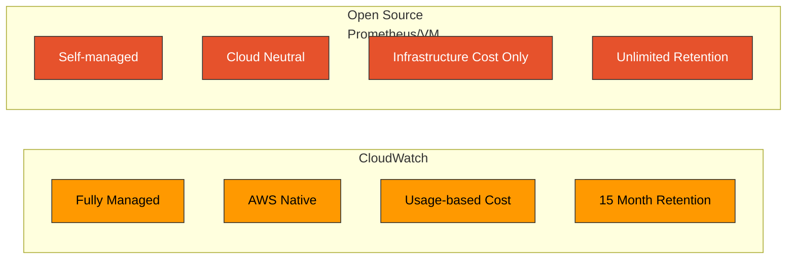
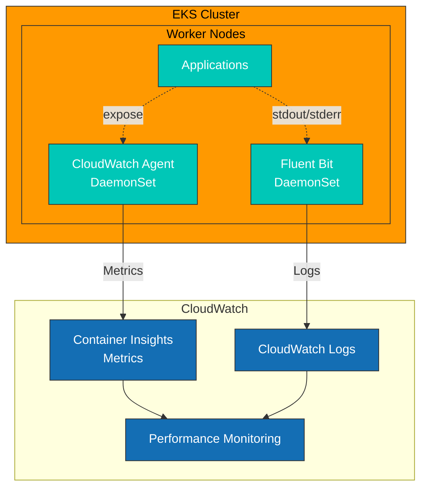
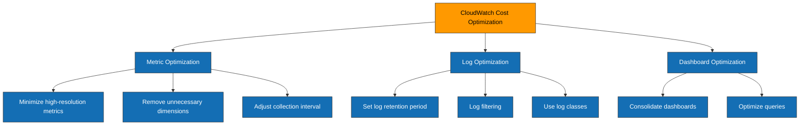

# CloudWatch 指标

> **最后更新**: July 11, 2026

## 目录

- [简介](#简介)
- [Container Insights 概览](#container-insights-概览)
- [CloudWatch Agent 配置](#cloudwatch-agent-配置)
- [自定义指标收集](#自定义指标收集)
- [指标数学与异常检测](#指标数学与异常检测)
- [创建仪表板](#创建仪表板)
- [告警配置](#告警配置)
- [成本优化](#成本优化)
- [最佳实践](#最佳实践)
- [故障排除](#故障排除)

## 简介

Amazon CloudWatch 是 AWS 原生的监控和可观测性服务。在 EKS 环境中使用 CloudWatch，可在无需单独监控基础设施的情况下，获得与 AWS 服务集成的指标收集、告警和仪表板功能。

### 主要功能

| 功能 | 描述 |
|---------|-------------|
| **完全托管** | 无需管理基础设施 |
| **AWS 原生集成** | 自动集成 EC2、EKS、RDS 等服务 |
| **Container Insights** | 容器/Pod 级监控 |
| **异常检测** | 基于 ML 的自动异常检测 |
| **指标数学** | 使用数学表达式计算指标 |
| **统一仪表板** | 整合日志、指标和追踪 |
| **全球可用性** | 所有 AWS 区域均受支持 |

### CloudWatch 与开源解决方案对比



| 项目 | CloudWatch | Prometheus/VM |
|------|------------|---------------|
| 运维开销 | 无 | 有 |
| 成本模型 | 按使用量计费 | 基于基础设施 |
| 可扩展性 | 自动 | 手动配置 |
| 查询语言 | Metric Math | PromQL/MetricsQL |
| 多云 | 仅 AWS | 云中立 |
| 可定制性 | 有限 | 完全灵活 |

## Container Insights 概览

Container Insights 是一项 CloudWatch 功能，用于监控 EKS 集群中的容器化工作负载。

### 架构



### 收集的指标

**Cluster 级别**:
- `cluster_node_count` - Node 数量
- `cluster_failed_node_count` - 失败的 Node 数量
- `cluster_cpu_utilization` - CPU 利用率
- `cluster_memory_utilization` - 内存利用率

**Node 级别**:
- `node_cpu_utilization` - Node CPU 利用率
- `node_memory_utilization` - Node 内存利用率
- `node_network_total_bytes` - 网络总字节数
- `node_filesystem_utilization` - 文件系统利用率

**Pod/Container 级别**:
- `pod_cpu_utilization` - Pod CPU 利用率
- `pod_memory_utilization` - Pod 内存利用率
- `pod_network_rx_bytes` - 接收的网络字节数
- `pod_network_tx_bytes` - 发送的网络字节数
- `container_cpu_utilization` - Container CPU 利用率
- `container_memory_utilization` - Container 内存利用率

### 启用 Container Insights

```bash
# Enable as EKS add-on (recommended)
aws eks create-addon \
  --cluster-name my-cluster \
  --addon-name amazon-cloudwatch-observability \
  --addon-version v1.5.0-eksbuild.1 \
  --service-account-role-arn arn:aws:iam::123456789012:role/CloudWatchAgentRole

# Or enable with eksctl
eksctl utils update-cluster-logging \
  --cluster my-cluster \
  --enable-types all \
  --approve
```

### 基于 OpenTelemetry 的 Container Insights（预览版）

CloudWatch 正在预览基于 OpenTelemetry (OTLP) 的 EKS Container Insights 后继版本，该版本于 2026 年 4 月 2 日发布。它与上述基于经典 CloudWatch Agent 的 Container Insights 并行运行，因此您可以按 Cluster 逐步采用，而不必一次性全部切换。

与经典的基于 Agent 的收集方式相比：

- 通过 OTLP 而非 CloudWatch Agent 的固定指标集实现**更广泛的指标收集**
- **高基数过滤**——每个指标最多可有 150 个标签，适用于经典维度模型无法经济地表达的按 Pod 或 Namespace 的细分
- **CloudWatch Query Studio 中的 PromQL 支持**——直接使用 PromQL 查询由 OTel 收集的指标，无需部署单独的 Prometheus 或 Amazon Managed Service for Prometheus 工作区
- **自动加速器检测**——自动检测 NVIDIA GPU、EFA 和 AWS Trainium/Inferentia 设备，这对于 AI/ML 工作负载的可观测性至关重要（有关 GPU 工作负载内容，请参阅 [AI/ML 课程轨道](../../ai-ml/)）

预览区域：美国东部（弗吉尼亚北部）、美国西部（俄勒冈）、亚太地区（悉尼）、亚太地区（新加坡）和欧洲（爱尔兰）。

> 参考：[面向 EKS 的基于 OTel 的 CloudWatch Container Insights（预览版）](https://aws.amazon.com/about-aws/whats-new/2026/04/cloudwatch-otel-container-insights-eks/)

有关它与 `amazon-cloudwatch-observability` EKS add-on 和 Application Signals 的关系，请参阅 [EKS 监控和日志记录](../../eks/06-eks-monitoring-logging.md#cloudwatch-observability-add-on-500)。

### 2026 年 7 月更新：Application Signals Service Events

2026 年 7 月 6 日发布的 Service Events 会自动捕获为 CloudWatch Application Signals 启用的任何应用程序的错误（异常快照）、性能异常（延迟事件快照）和部署事件。使用 ADOT SDK 或 `amazon-cloudwatch-observability` EKS add-on 进行埋点的应用程序，在 Application Signals 激活后无需额外配置即可获得此功能；您还可以选择启用函数调用指标，以获得更深入的性能可见性。适用于所有商业 AWS 区域；支持的语言包括 Java、Python 和 JavaScript。([公告](https://aws.amazon.com/about-aws/whats-new/2026/06/cloudwatch-service-events/))

## CloudWatch Agent 配置

### IRSA 设置

```bash
# Create IAM policy
cat <<EOF > cloudwatch-agent-policy.json
{
    "Version": "2012-10-17",
    "Statement": [
        {
            "Effect": "Allow",
            "Action": [
                "cloudwatch:PutMetricData",
                "ec2:DescribeVolumes",
                "ec2:DescribeTags",
                "logs:PutLogEvents",
                "logs:DescribeLogStreams",
                "logs:DescribeLogGroups",
                "logs:CreateLogStream",
                "logs:CreateLogGroup"
            ],
            "Resource": "*"
        },
        {
            "Effect": "Allow",
            "Action": [
                "ssm:GetParameter"
            ],
            "Resource": "arn:aws:ssm:*:*:parameter/AmazonCloudWatch-*"
        }
    ]
}
EOF

aws iam create-policy \
  --policy-name CloudWatchAgentPolicy \
  --policy-document file://cloudwatch-agent-policy.json

# Create service account
eksctl create iamserviceaccount \
  --name cloudwatch-agent \
  --namespace amazon-cloudwatch \
  --cluster my-cluster \
  --attach-policy-arn arn:aws:iam::123456789012:policy/CloudWatchAgentPolicy \
  --approve
```

### DaemonSet 部署

```yaml
apiVersion: v1
kind: Namespace
metadata:
  name: amazon-cloudwatch
---
apiVersion: v1
kind: ConfigMap
metadata:
  name: cwagentconfig
  namespace: amazon-cloudwatch
data:
  cwagentconfig.json: |
    {
      "logs": {
        "metrics_collected": {
          "kubernetes": {
            "cluster_name": "my-cluster",
            "metrics_collection_interval": 60
          }
        },
        "force_flush_interval": 5
      },
      "metrics": {
        "namespace": "ContainerInsights",
        "metrics_collected": {
          "kubernetes": {
            "cluster_name": "my-cluster",
            "metrics_collection_interval": 60,
            "enhanced_container_insights": true
          }
        }
      }
    }
---
apiVersion: apps/v1
kind: DaemonSet
metadata:
  name: cloudwatch-agent
  namespace: amazon-cloudwatch
spec:
  selector:
    matchLabels:
      name: cloudwatch-agent
  template:
    metadata:
      labels:
        name: cloudwatch-agent
    spec:
      serviceAccountName: cloudwatch-agent
      containers:
      - name: cloudwatch-agent
        image: public.ecr.aws/cloudwatch-agent/cloudwatch-agent:1.300031.0b311
        resources:
          limits:
            cpu: 400m
            memory: 400Mi
          requests:
            cpu: 200m
            memory: 200Mi
        env:
        - name: HOST_IP
          valueFrom:
            fieldRef:
              fieldPath: status.hostIP
        - name: HOST_NAME
          valueFrom:
            fieldRef:
              fieldPath: spec.nodeName
        - name: K8S_NAMESPACE
          valueFrom:
            fieldRef:
              fieldPath: metadata.namespace
        - name: CI_VERSION
          value: "k8s/1.3.11"
        volumeMounts:
        - name: cwagentconfig
          mountPath: /etc/cwagentconfig
        - name: rootfs
          mountPath: /rootfs
          readOnly: true
        - name: dockersock
          mountPath: /var/run/docker.sock
          readOnly: true
        - name: varlibdocker
          mountPath: /var/lib/docker
          readOnly: true
        - name: containerdsock
          mountPath: /run/containerd/containerd.sock
          readOnly: true
        - name: sys
          mountPath: /sys
          readOnly: true
        - name: devdisk
          mountPath: /dev/disk
          readOnly: true
      volumes:
      - name: cwagentconfig
        configMap:
          name: cwagentconfig
      - name: rootfs
        hostPath:
          path: /
      - name: dockersock
        hostPath:
          path: /var/run/docker.sock
      - name: varlibdocker
        hostPath:
          path: /var/lib/docker
      - name: containerdsock
        hostPath:
          path: /run/containerd/containerd.sock
      - name: sys
        hostPath:
          path: /sys
      - name: devdisk
        hostPath:
          path: /dev/disk/
      terminationGracePeriodSeconds: 60
      tolerations:
      - operator: Exists
```

### 增强型 Container Insights

增强型 Container Insights 提供额外指标和更精细的监控。

```yaml
# Enable in ConfigMap
cwagentconfig.json: |
  {
    "metrics": {
      "metrics_collected": {
        "kubernetes": {
          "enhanced_container_insights": true,
          "accelerated_compute_metrics": true  # GPU metrics
        }
      }
    }
  }
```

**额外指标**:
- `pod_cpu_reserved_capacity` - 预留 CPU 容量
- `pod_memory_reserved_capacity` - 预留内存容量
- `node_cpu_reserved_capacity` - Node 预留 CPU
- `node_memory_reserved_capacity` - Node 预留内存
- GPU 指标（使用 NVIDIA GPU 时）

## 自定义指标收集

### 使用 CloudWatch Agent 收集 Prometheus 指标

CloudWatch Agent 可以收集 Prometheus 格式的指标并将其发送到 CloudWatch。

```yaml
apiVersion: v1
kind: ConfigMap
metadata:
  name: prometheus-cwagentconfig
  namespace: amazon-cloudwatch
data:
  cwagentconfig.json: |
    {
      "logs": {
        "metrics_collected": {
          "prometheus": {
            "cluster_name": "my-cluster",
            "log_group_name": "/aws/containerinsights/my-cluster/prometheus",
            "prometheus_config_path": "/etc/prometheusconfig/prometheus.yaml",
            "emf_processor": {
              "metric_declaration_dedup": true,
              "metric_namespace": "ContainerInsights/Prometheus",
              "metric_unit": {
                "http_requests_total": "Count",
                "http_request_duration_seconds": "Seconds"
              },
              "metric_declaration": [
                {
                  "source_labels": ["job"],
                  "label_matcher": "^my-app$",
                  "dimensions": [["ClusterName", "Namespace", "Service"]],
                  "metric_selectors": [
                    "^http_requests_total$",
                    "^http_request_duration_seconds.*$"
                  ]
                }
              ]
            }
          }
        }
      }
    }
  prometheus.yaml: |
    global:
      scrape_interval: 1m
      scrape_timeout: 10s
    scrape_configs:
      - job_name: 'my-app'
        kubernetes_sd_configs:
          - role: pod
        relabel_configs:
          - source_labels: [__meta_kubernetes_pod_annotation_prometheus_io_scrape]
            action: keep
            regex: true
          - source_labels: [__meta_kubernetes_pod_annotation_prometheus_io_path]
            action: replace
            target_label: __metrics_path__
            regex: (.+)
```

### AWS Distro for OpenTelemetry (ADOT)

ADOT 可以将 Prometheus 指标发送到 CloudWatch。

```yaml
apiVersion: v1
kind: ConfigMap
metadata:
  name: adot-collector-config
  namespace: amazon-cloudwatch
data:
  config.yaml: |
    receivers:
      prometheus:
        config:
          global:
            scrape_interval: 30s
          scrape_configs:
            - job_name: 'kubernetes-pods'
              kubernetes_sd_configs:
                - role: pod
              relabel_configs:
                - source_labels: [__meta_kubernetes_pod_annotation_prometheus_io_scrape]
                  action: keep
                  regex: true

    processors:
      batch:
        timeout: 60s

    exporters:
      awsemf:
        namespace: CustomMetrics
        log_group_name: '/aws/containerinsights/my-cluster/prometheus'
        dimension_rollup_option: NoDimensionRollup
        metric_declarations:
          - dimensions: [[ClusterName, Namespace, Service]]
            metric_name_selectors:
              - "^http_.*"

    service:
      pipelines:
        metrics:
          receivers: [prometheus]
          processors: [batch]
          exporters: [awsemf]
---
apiVersion: apps/v1
kind: Deployment
metadata:
  name: adot-collector
  namespace: amazon-cloudwatch
spec:
  replicas: 1
  selector:
    matchLabels:
      app: adot-collector
  template:
    metadata:
      labels:
        app: adot-collector
    spec:
      serviceAccountName: adot-collector
      containers:
      - name: adot-collector
        image: public.ecr.aws/aws-observability/aws-otel-collector:v0.35.0
        command:
          - "/awscollector"
          - "--config=/etc/config/config.yaml"
        resources:
          limits:
            cpu: 500m
            memory: 512Mi
          requests:
            cpu: 200m
            memory: 256Mi
        volumeMounts:
        - name: config
          mountPath: /etc/config
      volumes:
      - name: config
        configMap:
          name: adot-collector-config
```

### 通过 SDK 发送自定义指标

```python
# Python example
import boto3
from datetime import datetime

cloudwatch = boto3.client('cloudwatch', region_name='ap-northeast-2')

def put_custom_metric(namespace, metric_name, value, dimensions, unit='Count'):
    cloudwatch.put_metric_data(
        Namespace=namespace,
        MetricData=[
            {
                'MetricName': metric_name,
                'Dimensions': dimensions,
                'Timestamp': datetime.utcnow(),
                'Value': value,
                'Unit': unit
            }
        ]
    )

# Usage example
put_custom_metric(
    namespace='MyApp/Production',
    metric_name='OrdersProcessed',
    value=150,
    dimensions=[
        {'Name': 'Service', 'Value': 'order-service'},
        {'Name': 'Environment', 'Value': 'production'}
    ]
)
```

```go
// Go example
package main

import (
    "context"
    "time"

    "github.com/aws/aws-sdk-go-v2/config"
    "github.com/aws/aws-sdk-go-v2/service/cloudwatch"
    "github.com/aws/aws-sdk-go-v2/service/cloudwatch/types"
)

func putCustomMetric(ctx context.Context, client *cloudwatch.Client) error {
    _, err := client.PutMetricData(ctx, &cloudwatch.PutMetricDataInput{
        Namespace: aws.String("MyApp/Production"),
        MetricData: []types.MetricDatum{
            {
                MetricName: aws.String("OrdersProcessed"),
                Dimensions: []types.Dimension{
                    {
                        Name:  aws.String("Service"),
                        Value: aws.String("order-service"),
                    },
                },
                Timestamp: aws.Time(time.Now()),
                Value:     aws.Float64(150),
                Unit:      types.StandardUnitCount,
            },
        },
    })
    return err
}
```

## 指标数学与异常检测

### 指标数学

Metric Math 允许您以数学方式组合多个指标。

```json
// Using Metric Math in CloudWatch dashboard widget
{
  "metrics": [
    [ { "expression": "m1/m2*100", "label": "Error Rate (%)", "id": "e1" } ],
    [ "AWS/ApplicationELB", "HTTPCode_Target_5XX_Count", "LoadBalancer", "app/my-alb/xxx", { "id": "m1", "visible": false } ],
    [ ".", "RequestCount", ".", ".", { "id": "m2", "visible": false } ]
  ],
  "view": "timeSeries",
  "stacked": false,
  "region": "ap-northeast-2",
  "period": 60
}
```

**主要 Metric Math 函数**:

```
# Basic operations
m1 + m2                    # Addition
m1 - m2                    # Subtraction
m1 * m2                    # Multiplication
m1 / m2                    # Division

# Aggregation functions
SUM(METRICS())            # Sum of all metrics
AVG(METRICS())            # Average
MIN(METRICS())            # Minimum
MAX(METRICS())            # Maximum

# Statistical functions
STDDEV(m1)                # Standard deviation
PERCENTILE(m1, 95)        # Percentile

# Time series functions
RATE(m1)                  # Rate of change
DIFF(m1)                  # Difference from previous value
PERIOD(m1)                # Period (seconds)
FILL(m1, 0)               # Fill missing data

# Search
SEARCH('{Namespace, Dim1, Dim2} MetricName', 'Average')
```

**实际示例**:

```json
// CPU utilization calculation
{
  "expression": "m1 / m2 * 100",
  "label": "CPU Utilization %"
}

// Error rate calculation
{
  "expression": "100 * m1 / (m1 + m2)",
  "label": "Error Rate %"
}

// p95 latency (combined across multiple services)
{
  "expression": "PERCENTILE(METRICS(), 95)",
  "label": "p95 Latency"
}

// Moving average
{
  "expression": "AVG(METRICS()) PERIOD(300)",
  "label": "5min Moving Average"
}
```

### 异常检测

CloudWatch Anomaly Detection 使用 ML 自动检测异常的指标模式。

```bash
# Enable anomaly detection via CLI
aws cloudwatch put-anomaly-detector \
  --namespace ContainerInsights \
  --metric-name pod_cpu_utilization \
  --stat Average \
  --dimensions Name=ClusterName,Value=my-cluster

# Create anomaly detection alarm
aws cloudwatch put-metric-alarm \
  --alarm-name "AnomalyDetection-PodCPU" \
  --comparison-operator LessThanLowerOrGreaterThanUpperThreshold \
  --evaluation-periods 2 \
  --metrics '[
    {
      "Id": "m1",
      "MetricStat": {
        "Metric": {
          "Namespace": "ContainerInsights",
          "MetricName": "pod_cpu_utilization",
          "Dimensions": [{"Name": "ClusterName", "Value": "my-cluster"}]
        },
        "Period": 300,
        "Stat": "Average"
      },
      "ReturnData": true
    },
    {
      "Id": "ad1",
      "Expression": "ANOMALY_DETECTION_BAND(m1, 2)",
      "ReturnData": true
    }
  ]' \
  --threshold-metric-id ad1 \
  --alarm-actions arn:aws:sns:ap-northeast-2:123456789012:my-alerts
```

### 使用 Terraform 进行异常检测

```hcl
resource "aws_cloudwatch_metric_alarm" "anomaly_detection" {
  alarm_name          = "pod-cpu-anomaly"
  comparison_operator = "LessThanLowerOrGreaterThanUpperThreshold"
  evaluation_periods  = 2
  threshold_metric_id = "ad1"

  metric_query {
    id          = "m1"
    return_data = true

    metric {
      metric_name = "pod_cpu_utilization"
      namespace   = "ContainerInsights"
      period      = 300
      stat        = "Average"

      dimensions = {
        ClusterName = "my-cluster"
      }
    }
  }

  metric_query {
    id          = "ad1"
    expression  = "ANOMALY_DETECTION_BAND(m1, 2)"
    label       = "Anomaly Detection Band"
    return_data = true
  }

  alarm_actions = [aws_sns_topic.alerts.arn]

  tags = {
    Environment = "production"
  }
}
```

## 创建仪表板

### 使用 CloudFormation 创建仪表板

```yaml
AWSTemplateFormatVersion: '2010-09-09'
Description: EKS Monitoring Dashboard

Parameters:
  ClusterName:
    Type: String
    Default: my-cluster

Resources:
  EKSDashboard:
    Type: AWS::CloudWatch::Dashboard
    Properties:
      DashboardName: !Sub "${ClusterName}-monitoring"
      DashboardBody: !Sub |
        {
          "widgets": [
            {
              "type": "metric",
              "x": 0,
              "y": 0,
              "width": 12,
              "height": 6,
              "properties": {
                "title": "Cluster CPU Utilization",
                "metrics": [
                  ["ContainerInsights", "cluster_cpu_utilization", "ClusterName", "${ClusterName}"]
                ],
                "view": "timeSeries",
                "region": "${AWS::Region}",
                "period": 60,
                "stat": "Average"
              }
            },
            {
              "type": "metric",
              "x": 12,
              "y": 0,
              "width": 12,
              "height": 6,
              "properties": {
                "title": "Cluster Memory Utilization",
                "metrics": [
                  ["ContainerInsights", "cluster_memory_utilization", "ClusterName", "${ClusterName}"]
                ],
                "view": "timeSeries",
                "region": "${AWS::Region}",
                "period": 60,
                "stat": "Average"
              }
            },
            {
              "type": "metric",
              "x": 0,
              "y": 6,
              "width": 8,
              "height": 6,
              "properties": {
                "title": "Node Count",
                "metrics": [
                  ["ContainerInsights", "cluster_node_count", "ClusterName", "${ClusterName}"]
                ],
                "view": "singleValue",
                "region": "${AWS::Region}",
                "period": 60,
                "stat": "Average"
              }
            }
          ]
        }
```

### 使用 Terraform 创建仪表板

```hcl
resource "aws_cloudwatch_dashboard" "eks_monitoring" {
  dashboard_name = "${var.cluster_name}-monitoring"

  dashboard_body = jsonencode({
    widgets = [
      {
        type   = "metric"
        x      = 0
        y      = 0
        width  = 12
        height = 6
        properties = {
          title  = "Cluster CPU Utilization"
          region = var.region
          metrics = [
            ["ContainerInsights", "cluster_cpu_utilization", "ClusterName", var.cluster_name]
          ]
          view   = "timeSeries"
          period = 60
          stat   = "Average"
          yAxis = {
            left = {
              min = 0
              max = 100
            }
          }
        }
      },
      {
        type   = "metric"
        x      = 12
        y      = 0
        width  = 12
        height = 6
        properties = {
          title  = "Cluster Memory Utilization"
          region = var.region
          metrics = [
            ["ContainerInsights", "cluster_memory_utilization", "ClusterName", var.cluster_name]
          ]
          view   = "timeSeries"
          period = 60
          stat   = "Average"
        }
      }
    ]
  })
}
```

## 告警配置

### 基本告警规则

```yaml
# CloudFormation
Resources:
  HighCPUAlarm:
    Type: AWS::CloudWatch::Alarm
    Properties:
      AlarmName: !Sub "${ClusterName}-high-cpu"
      AlarmDescription: "Cluster CPU utilization is high"
      MetricName: cluster_cpu_utilization
      Namespace: ContainerInsights
      Dimensions:
        - Name: ClusterName
          Value: !Ref ClusterName
      Statistic: Average
      Period: 300
      EvaluationPeriods: 2
      Threshold: 80
      ComparisonOperator: GreaterThanThreshold
      AlarmActions:
        - !Ref AlertSNSTopic

  HighMemoryAlarm:
    Type: AWS::CloudWatch::Alarm
    Properties:
      AlarmName: !Sub "${ClusterName}-high-memory"
      AlarmDescription: "Cluster memory utilization is high"
      MetricName: cluster_memory_utilization
      Namespace: ContainerInsights
      Dimensions:
        - Name: ClusterName
          Value: !Ref ClusterName
      Statistic: Average
      Period: 300
      EvaluationPeriods: 2
      Threshold: 85
      ComparisonOperator: GreaterThanThreshold
      AlarmActions:
        - !Ref AlertSNSTopic
```

### Terraform 告警配置

```hcl
resource "aws_cloudwatch_metric_alarm" "high_cpu" {
  alarm_name          = "${var.cluster_name}-high-cpu"
  comparison_operator = "GreaterThanThreshold"
  evaluation_periods  = 2
  metric_name         = "cluster_cpu_utilization"
  namespace           = "ContainerInsights"
  period              = 300
  statistic           = "Average"
  threshold           = 80
  alarm_description   = "Cluster CPU utilization exceeds 80%"

  dimensions = {
    ClusterName = var.cluster_name
  }

  alarm_actions = [aws_sns_topic.alerts.arn]
  ok_actions    = [aws_sns_topic.alerts.arn]

  tags = {
    Environment = var.environment
  }
}

resource "aws_cloudwatch_metric_alarm" "node_not_ready" {
  alarm_name          = "${var.cluster_name}-node-not-ready"
  comparison_operator = "GreaterThanThreshold"
  evaluation_periods  = 2
  metric_name         = "cluster_failed_node_count"
  namespace           = "ContainerInsights"
  period              = 60
  statistic           = "Maximum"
  threshold           = 0
  alarm_description   = "One or more nodes are not ready"

  dimensions = {
    ClusterName = var.cluster_name
  }

  alarm_actions = [aws_sns_topic.alerts.arn]
}
```

## 成本优化

### CloudWatch 成本结构

| 项目 | 成本 (ap-northeast-2) |
|------|----------------------|
| 自定义指标 | $0.30/指标/月（前 10,000 个） |
| GetMetricData API | $0.01/1,000 次指标请求 |
| 仪表板 | $3.00/仪表板/月（前 3 个免费） |
| 日志摄取 | $0.76/GB |
| 日志存储 | $0.0314/GB/月 |
| 告警 | 免费（前 10 个），$0.10/告警/月 |

### 成本优化策略



### 1. 指标收集优化

```yaml
# Filtering in CloudWatch Agent configuration
cwagentconfig.json: |
  {
    "metrics": {
      "metrics_collected": {
        "kubernetes": {
          "cluster_name": "my-cluster",
          "metrics_collection_interval": 60,  # 60s instead of 30s
          "enhanced_container_insights": false  # Enable only when needed
        }
      },
      "aggregation_dimensions": [
        ["ClusterName"],
        ["ClusterName", "Namespace"]
        # Remove unnecessary dimension combinations
      ]
    }
  }
```

### 2. 日志保留策略

```bash
# Set log group retention period
aws logs put-retention-policy \
  --log-group-name /aws/containerinsights/my-cluster/application \
  --retention-in-days 7

aws logs put-retention-policy \
  --log-group-name /aws/containerinsights/my-cluster/performance \
  --retention-in-days 30

# Clean up old log groups
for lg in $(aws logs describe-log-groups --query 'logGroups[?retentionInDays==`null`].logGroupName' --output text); do
  aws logs put-retention-policy --log-group-name "$lg" --retention-in-days 14
done
```

### 3. 使用低频访问日志类别

```bash
# Apply Infrequent Access class to new log group (50% cost savings)
aws logs create-log-group \
  --log-group-name /aws/containerinsights/my-cluster/audit \
  --log-group-class INFREQUENT_ACCESS
```

### 成本监控

```hcl
# CloudWatch cost alarm
resource "aws_cloudwatch_metric_alarm" "cw_cost_alarm" {
  alarm_name          = "cloudwatch-cost-alarm"
  comparison_operator = "GreaterThanThreshold"
  evaluation_periods  = 1
  metric_name         = "EstimatedCharges"
  namespace           = "AWS/Billing"
  period              = 86400
  statistic           = "Maximum"
  threshold           = 100  # $100
  alarm_description   = "CloudWatch estimated charges exceed $100"

  dimensions = {
    ServiceName = "AmazonCloudWatch"
    Currency    = "USD"
  }

  alarm_actions = [aws_sns_topic.billing_alerts.arn]
}
```

## 最佳实践

### 1. Namespace 策略

```yaml
# Custom metric namespace structure
MyCompany/Production/API        # Production API metrics
MyCompany/Staging/API           # Staging API metrics
MyCompany/Production/Workers    # Production worker metrics
```

### 2. 维度设计

```yaml
# Recommended dimension structure
dimensions:
  - ClusterName     # Required
  - Namespace       # K8s namespace
  - Service         # Service name
  - Environment     # Environment (prod/staging/dev)

# Dimensions to avoid (high cardinality)
dimensions:
  - PodName         # Different per pod (cost increase)
  - RequestID       # Different per request (very high cost)
```

### 3. 告警设计

```yaml
# Layered alerting strategy
Critical (P1):
  - Cluster down
  - 50%+ nodes failed
  - SNS -> PagerDuty

Warning (P2):
  - CPU/memory 80%+
  - Increasing pod restarts
  - SNS -> Slack

Info (P3):
  - Scaling events
  - Deployment complete
  - SNS -> Email/Logs
```

## 故障排除

### 常见问题

#### 1. 指标未显示

```bash
# Check CloudWatch Agent logs
kubectl logs -n amazon-cloudwatch -l name=cloudwatch-agent

# Check IAM permissions
aws sts get-caller-identity
aws iam simulate-principal-policy \
  --policy-source-arn arn:aws:iam::123456789012:role/CloudWatchAgentRole \
  --action-names cloudwatch:PutMetricData

# Check metrics directly
aws cloudwatch list-metrics \
  --namespace ContainerInsights \
  --dimensions Name=ClusterName,Value=my-cluster
```

#### 2. 成本过高

```bash
# Check metric count
aws cloudwatch list-metrics --namespace ContainerInsights | jq '.Metrics | length'

# Find high cardinality metrics
aws cloudwatch list-metrics \
  --namespace ContainerInsights \
  --query 'Metrics[*].Dimensions[*].Name' \
  --output text | sort | uniq -c | sort -rn | head -20
```

#### 3. 告警未触发

```bash
# Check alarm status
aws cloudwatch describe-alarms --alarm-names "my-alarm"

# Check alarm history
aws cloudwatch describe-alarm-history \
  --alarm-name "my-alarm" \
  --history-item-type StateUpdate

# Check SNS topic
aws sns list-subscriptions-by-topic \
  --topic-arn arn:aws:sns:ap-northeast-2:123456789012:my-alerts
```

### 调试命令

```bash
# Check Container Insights status
kubectl get pods -n amazon-cloudwatch

# Check CloudWatch Agent configuration
kubectl describe configmap cwagentconfig -n amazon-cloudwatch

# Check real-time metrics
aws cloudwatch get-metric-statistics \
  --namespace ContainerInsights \
  --metric-name cluster_cpu_utilization \
  --dimensions Name=ClusterName,Value=my-cluster \
  --start-time $(date -u -d '1 hour ago' +%Y-%m-%dT%H:%M:%SZ) \
  --end-time $(date -u +%Y-%m-%dT%H:%M:%SZ) \
  --period 60 \
  --statistics Average
```

## 参考资料

- [Amazon CloudWatch 官方文档](https://docs.aws.amazon.com/cloudwatch/)
- [Container Insights 设置指南](https://docs.aws.amazon.com/AmazonCloudWatch/latest/monitoring/Container-Insights-setup-EKS-quickstart.html)
- [CloudWatch Agent 配置](https://docs.aws.amazon.com/AmazonCloudWatch/latest/monitoring/CloudWatch-Agent-Configuration-File-Details.html)
- [CloudWatch 定价](https://aws.amazon.com/cloudwatch/pricing/)

## 测验

要测试您对本章的理解，请尝试 [CloudWatch 指标测验](../../quizzes/observability/metrics/04-cloudwatch-metrics-quiz.md)。
